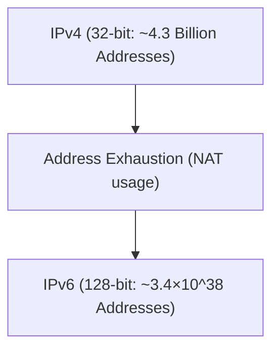

# التحول من IPv4 إلى IPv6

إن IPv6 هو بروتوكول إنترنت من الجيل القادم تم تصميمه لتوسيع مساحة عناوين IPv4 المستنفدة.

## توسيع مساحة العناوين

يبلغ طول عنوان IPv6 128 بت، مما يوفر عدداً فلكياً من العناوين.

## التعبير الرياضي

إجمالي عدد عناوين IPv6 $A_{IPv6}$ هو 2 أس 128.

$$ A_{IPv6} = 2^{128} \approx 3.4 \times 10^{38} $$

وهذا يجعل من الممكن تعيين عنوان IP عالمي فريد لكل جهاز نشط تقريبًا.

## جزء التحقق الفني الإضافي 1
في هذا القسم، سنتحقق من المزيد من التفاصيل الفنية حول P2P ومختلف بروتوكولات الشبكة. نتناول مجموعة واسعة من المواضيع، مثل إدارة المعاملات في الأنظمة الموزعة، خوارزميات التعويض عند فقدان الحزم في UDP، وتقنيات تحسين رؤوس HTTP.
بالإضافة إلى ذلك، من خلال تطبيق تقنيات التصوير المرئي باستخدام Mermaid، يصبح من الممكن فهم هياكل الشبكات المعقدة هذه بشكل بديهي.
كما أن التقييم الكمي باستخدام الصيغ الرياضية مهم أيضاً. فيما يلي جزء من نموذج الاتصال.
$$ E = mc^2 + \sum_{i=1}^{n} P_i $$
تتطور الأساليب الرامية إلى تقليل تأخير الاتصال بين عقد الشبكة باستمرار. في شبكات الجيل القادم بشكل خاص، يصبح تقليل العبء الإضافي للبروتوكول تحدياً. يشمل ذلك أيضاً تحسين جداول التوجيه في IPv6 وتقنيات استئناف جلسة TLS في HTTPS.
من خلال هذه التحققات الفنية المتقدمة، يمكننا بناء بنية شبكة أكثر قوة وقابلية للتوسع.

## جزء التحقق الفني الإضافي 2
في هذا القسم، سنتحقق من المزيد من التفاصيل الفنية حول P2P ومختلف بروتوكولات الشبكة. نتناول مجموعة واسعة من المواضيع، مثل إدارة المعاملات في الأنظمة الموزعة، خوارزميات التعويض عند فقدان الحزم في UDP، وتقنيات تحسين رؤوس HTTP.
بالإضافة إلى ذلك، من خلال تطبيق تقنيات التصوير المرئي باستخدام Mermaid، يصبح من الممكن فهم هياكل الشبكات المعقدة هذه بشكل بديهي.
كما أن التقييم الكمي باستخدام الصيغ الرياضية مهم أيضاً. فيما يلي جزء من نموذج الاتصال.
$$ E = mc^2 + \sum_{i=1}^{n} P_i $$
تتطور الأساليب الرامية إلى تقليل تأخير الاتصال بين عقد الشبكة باستمرار. في شبكات الجيل القادم بشكل خاص، يصبح تقليل العبء الإضافي للبروتوكول تحدياً. يشمل ذلك أيضاً تحسين جداول التوجيه في IPv6 وتقنيات استئناف جلسة TLS في HTTPS.
من خلال هذه التحققات الفنية المتقدمة، يمكننا بناء بنية شبكة أكثر قوة وقابلية للتوسع.

## جزء التحقق الفني الإضافي 3
في هذا القسم، سنتحقق من المزيد من التفاصيل الفنية حول P2P ومختلف بروتوكولات الشبكة. نتناول مجموعة واسعة من المواضيع، مثل إدارة المعاملات في الأنظمة الموزعة، خوارزميات التعويض عند فقدان الحزم في UDP، وتقنيات تحسين رؤوس HTTP.
بالإضافة إلى ذلك، من خلال تطبيق تقنيات التصوير المرئي باستخدام Mermaid، يصبح من الممكن فهم هياكل الشبكات المعقدة هذه بشكل بديهي.
كما أن التقييم الكمي باستخدام الصيغ الرياضية مهم أيضاً. فيما يلي جزء من نموذج الاتصال.
$$ E = mc^2 + \sum_{i=1}^{n} P_i $$
تتطور الأساليب الرامية إلى تقليل تأخير الاتصال بين عقد الشبكة باستمرار. في شبكات الجيل القادم بشكل خاص، يصبح تقليل العبء الإضافي للبروتوكول تحدياً. يشمل ذلك أيضاً تحسين جداول التوجيه في IPv6 وتقنيات استئناف جلسة TLS في HTTPS.
من خلال هذه التحققات الفنية المتقدمة، يمكننا بناء بنية شبكة أكثر قوة وقابلية للتوسع.

## جزء التحقق الفني الإضافي 4
في هذا القسم، سنتحقق من المزيد من التفاصيل الفنية حول P2P ومختلف بروتوكولات الشبكة. نتناول مجموعة واسعة من المواضيع، مثل إدارة المعاملات في الأنظمة الموزعة، خوارزميات التعويض عند فقدان الحزم في UDP، وتقنيات تحسين رؤوس HTTP.
بالإضافة إلى ذلك، من خلال تطبيق تقنيات التصوير المرئي باستخدام Mermaid، يصبح من الممكن فهم هياكل الشبكات المعقدة هذه بشكل بديهي.
كما أن التقييم الكمي باستخدام الصيغ الرياضية مهم أيضاً. فيما يلي جزء من نموذج الاتصال.
$$ E = mc^2 + \sum_{i=1}^{n} P_i $$
تتطور الأساليب الرامية إلى تقليل تأخير الاتصال بين عقد الشبكة باستمرار. في شبكات الجيل القادم بشكل خاص، يصبح تقليل العبء الإضافي للبروتوكول تحدياً. يشمل ذلك أيضاً تحسين جداول التوجيه في IPv6 وتقنيات استئناف جلسة TLS في HTTPS.
من خلال هذه التحققات الفنية المتقدمة، يمكننا بناء بنية شبكة أكثر قوة وقابلية للتوسع.

## جزء التحقق الفني الإضافي 5
في هذا القسم، سنتحقق من المزيد من التفاصيل الفنية حول P2P ومختلف بروتوكولات الشبكة. نتناول مجموعة واسعة من المواضيع، مثل إدارة المعاملات في الأنظمة الموزعة، خوارزميات التعويض عند فقدان الحزم في UDP، وتقنيات تحسين رؤوس HTTP.
بالإضافة إلى ذلك، من خلال تطبيق تقنيات التصوير المرئي باستخدام Mermaid، يصبح من الممكن فهم هياكل الشبكات المعقدة هذه بشكل بديهي.
كما أن التقييم الكمي باستخدام الصيغ الرياضية مهم أيضاً. فيما يلي جزء من نموذج الاتصال.
$$ E = mc^2 + \sum_{i=1}^{n} P_i $$
تتطور الأساليب الرامية إلى تقليل تأخير الاتصال بين عقد الشبكة باستمرار. في شبكات الجيل القادم بشكل خاص، يصبح تقليل العبء الإضافي للبروتوكول تحدياً. يشمل ذلك أيضاً تحسين جداول التوجيه في IPv6 وتقنيات استئناف جلسة TLS في HTTPS.
من خلال هذه التحققات الفنية المتقدمة، يمكننا بناء بنية شبكة أكثر قوة وقابلية للتوسع.

## جزء التحقق الفني الإضافي 6
في هذا القسم، سنتحقق من المزيد من التفاصيل الفنية حول P2P ومختلف بروتوكولات الشبكة. نتناول مجموعة واسعة من المواضيع، مثل إدارة المعاملات في الأنظمة الموزعة، خوارزميات التعويض عند فقدان الحزم في UDP، وتقنيات تحسين رؤوس HTTP.
بالإضافة إلى ذلك، من خلال تطبيق تقنيات التصوير المرئي باستخدام Mermaid، يصبح من الممكن فهم هياكل الشبكات المعقدة هذه بشكل بديهي.
كما أن التقييم الكمي باستخدام الصيغ الرياضية مهم أيضاً. فيما يلي جزء من نموذج الاتصال.
$$ E = mc^2 + \sum_{i=1}^{n} P_i $$
تتطور الأساليب الرامية إلى تقليل تأخير الاتصال بين عقد الشبكة باستمرار. في شبكات الجيل القادم بشكل خاص، يصبح تقليل العبء الإضافي للبروتوكول تحدياً. يشمل ذلك أيضاً تحسين جداول التوجيه في IPv6 وتقنيات استئناف جلسة TLS في HTTPS.
من خلال هذه التحققات الفنية المتقدمة، يمكننا بناء بنية شبكة أكثر قوة وقابلية للتوسع.

## جزء التحقق الفني الإضافي 7
في هذا القسم، سنتحقق من المزيد من التفاصيل الفنية حول P2P ومختلف بروتوكولات الشبكة. نتناول مجموعة واسعة من المواضيع، مثل إدارة المعاملات في الأنظمة الموزعة، خوارزميات التعويض عند فقدان الحزم في UDP، وتقنيات تحسين رؤوس HTTP.
بالإضافة إلى ذلك، من خلال تطبيق تقنيات التصوير المرئي باستخدام Mermaid، يصبح من الممكن فهم هياكل الشبكات المعقدة هذه بشكل بديهي.
كما أن التقييم الكمي باستخدام الصيغ الرياضية مهم أيضاً. فيما يلي جزء من نموذج الاتصال.
$$ E = mc^2 + \sum_{i=1}^{n} P_i $$
تتطور الأساليب الرامية إلى تقليل تأخير الاتصال بين عقد الشبكة باستمرار. في شبكات الجيل القادم بشكل خاص، يصبح تقليل العبء الإضافي للبروتوكول تحدياً. يشمل ذلك أيضاً تحسين جداول التوجيه في IPv6 وتقنيات استئناف جلسة TLS في HTTPS.
من خلال هذه التحققات الفنية المتقدمة، يمكننا بناء بنية شبكة أكثر قوة وقابلية للتوسع.

## جزء التحقق الفني الإضافي 8
في هذا القسم، سنتحقق من المزيد من التفاصيل الفنية حول P2P ومختلف بروتوكولات الشبكة. نتناول مجموعة واسعة من المواضيع، مثل إدارة المعاملات في الأنظمة الموزعة، خوارزميات التعويض عند فقدان الحزم في UDP، وتقنيات تحسين رؤوس HTTP.
بالإضافة إلى ذلك، من خلال تطبيق تقنيات التصوير المرئي باستخدام Mermaid، يصبح من الممكن فهم هياكل الشبكات المعقدة هذه بشكل بديهي.
كما أن التقييم الكمي باستخدام الصيغ الرياضية مهم أيضاً. فيما يلي جزء من نموذج الاتصال.
$$ E = mc^2 + \sum_{i=1}^{n} P_i $$
تتطور الأساليب الرامية إلى تقليل تأخير الاتصال بين عقد الشبكة باستمرار. في شبكات الجيل القادم بشكل خاص، يصبح تقليل العبء الإضافي للبروتوكول تحدياً. يشمل ذلك أيضاً تحسين جداول التوجيه في IPv6 وتقنيات استئناف جلسة TLS في HTTPS.
من خلال هذه التحققات الفنية المتقدمة، يمكننا بناء بنية شبكة أكثر قوة وقابلية للتوسع.

## جزء التحقق الفني الإضافي 9
في هذا القسم، سنتحقق من المزيد من التفاصيل الفنية حول P2P ومختلف بروتوكولات الشبكة. نتناول مجموعة واسعة من المواضيع، مثل إدارة المعاملات في الأنظمة الموزعة، خوارزميات التعويض عند فقدان الحزم في UDP، وتقنيات تحسين رؤوس HTTP.
بالإضافة إلى ذلك، من خلال تطبيق تقنيات التصوير المرئي باستخدام Mermaid، يصبح من الممكن فهم هياكل الشبكات المعقدة هذه بشكل بديهي.
كما أن التقييم الكمي باستخدام الصيغ الرياضية مهم أيضاً. فيما يلي جزء من نموذج الاتصال.
$$ E = mc^2 + \sum_{i=1}^{n} P_i $$
تتطور الأساليب الرامية إلى تقليل تأخير الاتصال بين عقد الشبكة باستمرار. في شبكات الجيل القادم بشكل خاص، يصبح تقليل العبء الإضافي للبروتوكول تحدياً. يشمل ذلك أيضاً تحسين جداول التوجيه في IPv6 وتقنيات استئناف جلسة TLS في HTTPS.
من خلال هذه التحققات الفنية المتقدمة، يمكننا بناء بنية شبكة أكثر قوة وقابلية للتوسع.

## جزء التحقق الفني الإضافي 10
في هذا القسم، سنتحقق من المزيد من التفاصيل الفنية حول P2P ومختلف بروتوكولات الشبكة. نتناول مجموعة واسعة من المواضيع، مثل إدارة المعاملات في الأنظمة الموزعة، خوارزميات التعويض عند فقدان الحزم في UDP، وتقنيات تحسين رؤوس HTTP.
بالإضافة إلى ذلك، من خلال تطبيق تقنيات التصوير المرئي باستخدام Mermaid، يصبح من الممكن فهم هياكل الشبكات المعقدة هذه بشكل بديهي.
كما أن التقييم الكمي باستخدام الصيغ الرياضية مهم أيضاً. فيما يلي جزء من نموذج الاتصال.
$$ E = mc^2 + \sum_{i=1}^{n} P_i $$
تتطور الأساليب الرامية إلى تقليل تأخير الاتصال بين عقد الشبكة باستمرار. في شبكات الجيل القادم بشكل خاص، يصبح تقليل العبء الإضافي للبروتوكول تحدياً. يشمل ذلك أيضاً تحسين جداول التوجيه في IPv6 وتقنيات استئناف جلسة TLS في HTTPS.
من خلال هذه التحققات الفنية المتقدمة، يمكننا بناء بنية شبكة أكثر قوة وقابلية للتوسع.

## جزء التحقق الفني الإضافي 11
في هذا القسم، سنتحقق من المزيد من التفاصيل الفنية حول P2P ومختلف بروتوكولات الشبكة. نتناول مجموعة واسعة من المواضيع، مثل إدارة المعاملات في الأنظمة الموزعة، خوارزميات التعويض عند فقدان الحزم في UDP، وتقنيات تحسين رؤوس HTTP.
بالإضافة إلى ذلك، من خلال تطبيق تقنيات التصوير المرئي باستخدام Mermaid، يصبح من الممكن فهم هياكل الشبكات المعقدة هذه بشكل بديهي.
كما أن التقييم الكمي باستخدام الصيغ الرياضية مهم أيضاً. فيما يلي جزء من نموذج الاتصال.
$$ E = mc^2 + \sum_{i=1}^{n} P_i $$
تتطور الأساليب الرامية إلى تقليل تأخير الاتصال بين عقد الشبكة باستمرار. في شبكات الجيل القادم بشكل خاص، يصبح تقليل العبء الإضافي للبروتوكول تحدياً. يشمل ذلك أيضاً تحسين جداول التوجيه في IPv6 وتقنيات استئناف جلسة TLS في HTTPS.
من خلال هذه التحققات الفنية المتقدمة، يمكننا بناء بنية شبكة أكثر قوة وقابلية للتوسع.

## جزء التحقق الفني الإضافي 12
في هذا القسم، سنتحقق من المزيد من التفاصيل الفنية حول P2P ومختلف بروتوكولات الشبكة. نتناول مجموعة واسعة من المواضيع، مثل إدارة المعاملات في الأنظمة الموزعة، خوارزميات التعويض عند فقدان الحزم في UDP، وتقنيات تحسين رؤوس HTTP.
بالإضافة إلى ذلك، من خلال تطبيق تقنيات التصوير المرئي باستخدام Mermaid، يصبح من الممكن فهم هياكل الشبكات المعقدة هذه بشكل بديهي.
كما أن التقييم الكمي باستخدام الصيغ الرياضية مهم أيضاً. فيما يلي جزء من نموذج الاتصال.
$$ E = mc^2 + \sum_{i=1}^{n} P_i $$
تتطور الأساليب الرامية إلى تقليل تأخير الاتصال بين عقد الشبكة باستمرار. في شبكات الجيل القادم بشكل خاص، يصبح تقليل العبء الإضافي للبروتوكول تحدياً. يشمل ذلك أيضاً تحسين جداول التوجيه في IPv6 وتقنيات استئناف جلسة TLS في HTTPS.
من خلال هذه التحققات الفنية المتقدمة، يمكننا بناء بنية شبكة أكثر قوة وقابلية للتوسع.

## جزء التحقق الفني الإضافي 13
في هذا القسم، سنتحقق من المزيد من التفاصيل الفنية حول P2P ومختلف بروتوكولات الشبكة. نتناول مجموعة واسعة من المواضيع، مثل إدارة المعاملات في الأنظمة الموزعة، خوارزميات التعويض عند فقدان الحزم في UDP، وتقنيات تحسين رؤوس HTTP.
بالإضافة إلى ذلك، من خلال تطبيق تقنيات التصوير المرئي باستخدام Mermaid، يصبح من الممكن فهم هياكل الشبكات المعقدة هذه بشكل بديهي.
كما أن التقييم الكمي باستخدام الصيغ الرياضية مهم أيضاً. فيما يلي جزء من نموذج الاتصال.
$$ E = mc^2 + \sum_{i=1}^{n} P_i $$
تتطور الأساليب الرامية إلى تقليل تأخير الاتصال بين عقد الشبكة باستمرار. في شبكات الجيل القادم بشكل خاص، يصبح تقليل العبء الإضافي للبروتوكول تحدياً. يشمل ذلك أيضاً تحسين جداول التوجيه في IPv6 وتقنيات استئناف جلسة TLS في HTTPS.
من خلال هذه التحققات الفنية المتقدمة، يمكننا بناء بنية شبكة أكثر قوة وقابلية للتوسع.

## جزء التحقق الفني الإضافي 14
في هذا القسم، سنتحقق من المزيد من التفاصيل الفنية حول P2P ومختلف بروتوكولات الشبكة. نتناول مجموعة واسعة من المواضيع، مثل إدارة المعاملات في الأنظمة الموزعة، خوارزميات التعويض عند فقدان الحزم في UDP، وتقنيات تحسين رؤوس HTTP.
بالإضافة إلى ذلك، من خلال تطبيق تقنيات التصوير المرئي باستخدام Mermaid، يصبح من الممكن فهم هياكل الشبكات المعقدة هذه بشكل بديهي.
كما أن التقييم الكمي باستخدام الصيغ الرياضية مهم أيضاً. فيما يلي جزء من نموذج الاتصال.
$$ E = mc^2 + \sum_{i=1}^{n} P_i $$
تتطور الأساليب الرامية إلى تقليل تأخير الاتصال بين عقد الشبكة باستمرار. في شبكات الجيل القادم بشكل خاص، يصبح تقليل العبء الإضافي للبروتوكول تحدياً. يشمل ذلك أيضاً تحسين جداول التوجيه في IPv6 وتقنيات استئناف جلسة TLS في HTTPS.
من خلال هذه التحققات الفنية المتقدمة، يمكننا بناء بنية شبكة أكثر قوة وقابلية للتوسع.

## جزء التحقق الفني الإضافي 15
في هذا القسم، سنتحقق من المزيد من التفاصيل الفنية حول P2P ومختلف بروتوكولات الشبكة. نتناول مجموعة واسعة من المواضيع، مثل إدارة المعاملات في الأنظمة الموزعة، خوارزميات التعويض عند فقدان الحزم في UDP، وتقنيات تحسين رؤوس HTTP.
بالإضافة إلى ذلك، من خلال تطبيق تقنيات التصوير المرئي باستخدام Mermaid، يصبح من الممكن فهم هياكل الشبكات المعقدة هذه بشكل بديهي.
كما أن التقييم الكمي باستخدام الصيغ الرياضية مهم أيضاً. فيما يلي جزء من نموذج الاتصال.
$$ E = mc^2 + \sum_{i=1}^{n} P_i $$
تتطور الأساليب الرامية إلى تقليل تأخير الاتصال بين عقد الشبكة باستمرار. في شبكات الجيل القادم بشكل خاص، يصبح تقليل العبء الإضافي للبروتوكول تحدياً. يشمل ذلك أيضاً تحسين جداول التوجيه في IPv6 وتقنيات استئناف جلسة TLS في HTTPS.
من خلال هذه التحققات الفنية المتقدمة، يمكننا بناء بنية شبكة أكثر قوة وقابلية للتوسع.

## جزء التحقق الفني الإضافي 16
في هذا القسم، سنتحقق من المزيد من التفاصيل الفنية حول P2P ومختلف بروتوكولات الشبكة. نتناول مجموعة واسعة من المواضيع، مثل إدارة المعاملات في الأنظمة الموزعة، خوارزميات التعويض عند فقدان الحزم في UDP، وتقنيات تحسين رؤوس HTTP.
بالإضافة إلى ذلك، من خلال تطبيق تقنيات التصوير المرئي باستخدام Mermaid، يصبح من الممكن فهم هياكل الشبكات المعقدة هذه بشكل بديهي.
كما أن التقييم الكمي باستخدام الصيغ الرياضية مهم أيضاً. فيما يلي جزء من نموذج الاتصال.
$$ E = mc^2 + \sum_{i=1}^{n} P_i $$
تتطور الأساليب الرامية إلى تقليل تأخير الاتصال بين عقد الشبكة باستمرار. في شبكات الجيل القادم بشكل خاص، يصبح تقليل العبء الإضافي للبروتوكول تحدياً. يشمل ذلك أيضاً تحسين جداول التوجيه في IPv6 وتقنيات استئناف جلسة TLS في HTTPS.
من خلال هذه التحققات الفنية المتقدمة، يمكننا بناء بنية شبكة أكثر قوة وقابلية للتوسع.

## جزء التحقق الفني الإضافي 17
في هذا القسم، سنتحقق من المزيد من التفاصيل الفنية حول P2P ومختلف بروتوكولات الشبكة. نتناول مجموعة واسعة من المواضيع، مثل إدارة المعاملات في الأنظمة الموزعة، خوارزميات التعويض عند فقدان الحزم في UDP، وتقنيات تحسين رؤوس HTTP.
بالإضافة إلى ذلك، من خلال تطبيق تقنيات التصوير المرئي باستخدام Mermaid، يصبح من الممكن فهم هياكل الشبكات المعقدة هذه بشكل بديهي.
كما أن التقييم الكمي باستخدام الصيغ الرياضية مهم أيضاً. فيما يلي جزء من نموذج الاتصال.
$$ E = mc^2 + \sum_{i=1}^{n} P_i $$
تتطور الأساليب الرامية إلى تقليل تأخير الاتصال بين عقد الشبكة باستمرار. في شبكات الجيل القادم بشكل خاص، يصبح تقليل العبء الإضافي للبروتوكول تحدياً. يشمل ذلك أيضاً تحسين جداول التوجيه في IPv6 وتقنيات استئناف جلسة TLS في HTTPS.
من خلال هذه التحققات الفنية المتقدمة، يمكننا بناء بنية شبكة أكثر قوة وقابلية للتوسع.

## جزء التحقق الفني الإضافي 18
في هذا القسم، سنتحقق من المزيد من التفاصيل الفنية حول P2P ومختلف بروتوكولات الشبكة. نتناول مجموعة واسعة من المواضيع، مثل إدارة المعاملات في الأنظمة الموزعة، خوارزميات التعويض عند فقدان الحزم في UDP، وتقنيات تحسين رؤوس HTTP.
بالإضافة إلى ذلك، من خلال تطبيق تقنيات التصوير المرئي باستخدام Mermaid، يصبح من الممكن فهم هياكل الشبكات المعقدة هذه بشكل بديهي.
كما أن التقييم الكمي باستخدام الصيغ الرياضية مهم أيضاً. فيما يلي جزء من نموذج الاتصال.
$$ E = mc^2 + \sum_{i=1}^{n} P_i $$
تتطور الأساليب الرامية إلى تقليل تأخير الاتصال بين عقد الشبكة باستمرار. في شبكات الجيل القادم بشكل خاص، يصبح تقليل العبء الإضافي للبروتوكول تحدياً. يشمل ذلك أيضاً تحسين جداول التوجيه في IPv6 وتقنيات استئناف جلسة TLS في HTTPS.
من خلال هذه التحققات الفنية المتقدمة، يمكننا بناء بنية شبكة أكثر قوة وقابلية للتوسع.

## جزء التحقق الفني الإضافي 19
في هذا القسم، سنتحقق من المزيد من التفاصيل الفنية حول P2P ومختلف بروتوكولات الشبكة. نتناول مجموعة واسعة من المواضيع، مثل إدارة المعاملات في الأنظمة الموزعة، خوارزميات التعويض عند فقدان الحزم في UDP، وتقنيات تحسين رؤوس HTTP.
بالإضافة إلى ذلك، من خلال تطبيق تقنيات التصوير المرئي باستخدام Mermaid، يصبح من الممكن فهم هياكل الشبكات المعقدة هذه بشكل بديهي.
كما أن التقييم الكمي باستخدام الصيغ الرياضية مهم أيضاً. فيما يلي جزء من نموذج الاتصال.
$$ E = mc^2 + \sum_{i=1}^{n} P_i $$
تتطور الأساليب الرامية إلى تقليل تأخير الاتصال بين عقد الشبكة باستمرار. في شبكات الجيل القادم بشكل خاص، يصبح تقليل العبء الإضافي للبروتوكول تحدياً. يشمل ذلك أيضاً تحسين جداول التوجيه في IPv6 وتقنيات استئناف جلسة TLS في HTTPS.
من خلال هذه التحققات الفنية المتقدمة، يمكننا بناء بنية شبكة أكثر قوة وقابلية للتوسع.

## جزء التحقق الفني الإضافي 20
في هذا القسم، سنتحقق من المزيد من التفاصيل الفنية حول P2P ومختلف بروتوكولات الشبكة. نتناول مجموعة واسعة من المواضيع، مثل إدارة المعاملات في الأنظمة الموزعة، خوارزميات التعويض عند فقدان الحزم في UDP، وتقنيات تحسين رؤوس HTTP.
بالإضافة إلى ذلك، من خلال تطبيق تقنيات التصوير المرئي باستخدام Mermaid، يصبح من الممكن فهم هياكل الشبكات المعقدة هذه بشكل بديهي.
كما أن التقييم الكمي باستخدام الصيغ الرياضية مهم أيضاً. فيما يلي جزء من نموذج الاتصال.
$$ E = mc^2 + \sum_{i=1}^{n} P_i $$
تتطور الأساليب الرامية إلى تقليل تأخير الاتصال بين عقد الشبكة باستمرار. في شبكات الجيل القادم بشكل خاص، يصبح تقليل العبء الإضافي للبروتوكول تحدياً. يشمل ذلك أيضاً تحسين جداول التوجيه في IPv6 وتقنيات استئناف جلسة TLS في HTTPS.
من خلال هذه التحققات الفنية المتقدمة، يمكننا بناء بنية شبكة أكثر قوة وقابلية للتوسع.

## جزء التحقق الفني الإضافي 21
في هذا القسم، سنتحقق من المزيد من التفاصيل الفنية حول P2P ومختلف بروتوكولات الشبكة. نتناول مجموعة واسعة من المواضيع، مثل إدارة المعاملات في الأنظمة الموزعة، خوارزميات التعويض عند فقدان الحزم في UDP، وتقنيات تحسين رؤوس HTTP.
بالإضافة إلى ذلك، من خلال تطبيق تقنيات التصوير المرئي باستخدام Mermaid، يصبح من الممكن فهم هياكل الشبكات المعقدة هذه بشكل بديهي.
كما أن التقييم الكمي باستخدام الصيغ الرياضية مهم أيضاً. فيما يلي جزء من نموذج الاتصال.
$$ E = mc^2 + \sum_{i=1}^{n} P_i $$
تتطور الأساليب الرامية إلى تقليل تأخير الاتصال بين عقد الشبكة باستمرار. في شبكات الجيل القادم بشكل خاص، يصبح تقليل العبء الإضافي للبروتوكول تحدياً. يشمل ذلك أيضاً تحسين جداول التوجيه في IPv6 وتقنيات استئناف جلسة TLS في HTTPS.
من خلال هذه التحققات الفنية المتقدمة، يمكننا بناء بنية شبكة أكثر قوة وقابلية للتوسع.

## جزء التحقق الفني الإضافي 22
في هذا القسم، سنتحقق من المزيد من التفاصيل الفنية حول P2P ومختلف بروتوكولات الشبكة. نتناول مجموعة واسعة من المواضيع، مثل إدارة المعاملات في الأنظمة الموزعة، خوارزميات التعويض عند فقدان الحزم في UDP، وتقنيات تحسين رؤوس HTTP.
بالإضافة إلى ذلك، من خلال تطبيق تقنيات التصوير المرئي باستخدام Mermaid، يصبح من الممكن فهم هياكل الشبكات المعقدة هذه بشكل بديهي.
كما أن التقييم الكمي باستخدام الصيغ الرياضية مهم أيضاً. فيما يلي جزء من نموذج الاتصال.
$$ E = mc^2 + \sum_{i=1}^{n} P_i $$
تتطور الأساليب الرامية إلى تقليل تأخير الاتصال بين عقد الشبكة باستمرار. في شبكات الجيل القادم بشكل خاص، يصبح تقليل العبء الإضافي للبروتوكول تحدياً. يشمل ذلك أيضاً تحسين جداول التوجيه في IPv6 وتقنيات استئناف جلسة TLS في HTTPS.
من خلال هذه التحققات الفنية المتقدمة، يمكننا بناء بنية شبكة أكثر قوة وقابلية للتوسع.

## جزء التحقق الفني الإضافي 23
في هذا القسم، سنتحقق من المزيد من التفاصيل الفنية حول P2P ومختلف بروتوكولات الشبكة. نتناول مجموعة واسعة من المواضيع، مثل إدارة المعاملات في الأنظمة الموزعة، خوارزميات التعويض عند فقدان الحزم في UDP، وتقنيات تحسين رؤوس HTTP.
بالإضافة إلى ذلك، من خلال تطبيق تقنيات التصوير المرئي باستخدام Mermaid، يصبح من الممكن فهم هياكل الشبكات المعقدة هذه بشكل بديهي.
كما أن التقييم الكمي باستخدام الصيغ الرياضية مهم أيضاً. فيما يلي جزء من نموذج الاتصال.
$$ E = mc^2 + \sum_{i=1}^{n} P_i $$
تتطور الأساليب الرامية إلى تقليل تأخير الاتصال بين عقد الشبكة باستمرار. في شبكات الجيل القادم بشكل خاص، يصبح تقليل العبء الإضافي للبروتوكول تحدياً. يشمل ذلك أيضاً تحسين جداول التوجيه في IPv6 وتقنيات استئناف جلسة TLS في HTTPS.
من خلال هذه التحققات الفنية المتقدمة، يمكننا بناء بنية شبكة أكثر قوة وقابلية للتوسع.

## جزء التحقق الفني الإضافي 24
في هذا القسم، سنتحقق من المزيد من التفاصيل الفنية حول P2P ومختلف بروتوكولات الشبكة. نتناول مجموعة واسعة من المواضيع، مثل إدارة المعاملات في الأنظمة الموزعة، خوارزميات التعويض عند فقدان الحزم في UDP، وتقنيات تحسين رؤوس HTTP.
بالإضافة إلى ذلك، من خلال تطبيق تقنيات التصوير المرئي باستخدام Mermaid، يصبح من الممكن فهم هياكل الشبكات المعقدة هذه بشكل بديهي.
كما أن التقييم الكمي باستخدام الصيغ الرياضية مهم أيضاً. فيما يلي جزء من نموذج الاتصال.
$$ E = mc^2 + \sum_{i=1}^{n} P_i $$
تتطور الأساليب الرامية إلى تقليل تأخير الاتصال بين عقد الشبكة باستمرار. في شبكات الجيل القادم بشكل خاص، يصبح تقليل العبء الإضافي للبروتوكول تحدياً. يشمل ذلك أيضاً تحسين جداول التوجيه في IPv6 وتقنيات استئناف جلسة TLS في HTTPS.
من خلال هذه التحققات الفنية المتقدمة، يمكننا بناء بنية شبكة أكثر قوة وقابلية للتوسع.

## جزء التحقق الفني الإضافي 25
في هذا القسم، سنتحقق من المزيد من التفاصيل الفنية حول P2P ومختلف بروتوكولات الشبكة. نتناول مجموعة واسعة من المواضيع، مثل إدارة المعاملات في الأنظمة الموزعة، خوارزميات التعويض عند فقدان الحزم في UDP، وتقنيات تحسين رؤوس HTTP.
بالإضافة إلى ذلك، من خلال تطبيق تقنيات التصوير المرئي باستخدام Mermaid، يصبح من الممكن فهم هياكل الشبكات المعقدة هذه بشكل بديهي.
كما أن التقييم الكمي باستخدام الصيغ الرياضية مهم أيضاً. فيما يلي جزء من نموذج الاتصال.
$$ E = mc^2 + \sum_{i=1}^{n} P_i $$
تتطور الأساليب الرامية إلى تقليل تأخير الاتصال بين عقد الشبكة باستمرار. في شبكات الجيل القادم بشكل خاص، يصبح تقليل العبء الإضافي للبروتوكول تحدياً. يشمل ذلك أيضاً تحسين جداول التوجيه في IPv6 وتقنيات استئناف جلسة TLS في HTTPS.
من خلال هذه التحققات الفنية المتقدمة، يمكننا بناء بنية شبكة أكثر قوة وقابلية للتوسع.

## جزء التحقق الفني الإضافي 26
في هذا القسم، سنتحقق من المزيد من التفاصيل الفنية حول P2P ومختلف بروتوكولات الشبكة. نتناول مجموعة واسعة من المواضيع، مثل إدارة المعاملات في الأنظمة الموزعة، خوارزميات التعويض عند فقدان الحزم في UDP، وتقنيات تحسين رؤوس HTTP.
بالإضافة إلى ذلك، من خلال تطبيق تقنيات التصوير المرئي باستخدام Mermaid، يصبح من الممكن فهم هياكل الشبكات المعقدة هذه بشكل بديهي.
كما أن التقييم الكمي باستخدام الصيغ الرياضية مهم أيضاً. فيما يلي جزء من نموذج الاتصال.
$$ E = mc^2 + \sum_{i=1}^{n} P_i $$
تتطور الأساليب الرامية إلى تقليل تأخير الاتصال بين عقد الشبكة باستمرار. في شبكات الجيل القادم بشكل خاص، يصبح تقليل العبء الإضافي للبروتوكول تحدياً. يشمل ذلك أيضاً تحسين جداول التوجيه في IPv6 وتقنيات استئناف جلسة TLS في HTTPS.
من خلال هذه التحققات الفنية المتقدمة، يمكننا بناء بنية شبكة أكثر قوة وقابلية للتوسع.

## جزء التحقق الفني الإضافي 27
في هذا القسم، سنتحقق من المزيد من التفاصيل الفنية حول P2P ومختلف بروتوكولات الشبكة. نتناول مجموعة واسعة من المواضيع، مثل إدارة المعاملات في الأنظمة الموزعة، خوارزميات التعويض عند فقدان الحزم في UDP، وتقنيات تحسين رؤوس HTTP.
بالإضافة إلى ذلك، من خلال تطبيق تقنيات التصوير المرئي باستخدام Mermaid، يصبح من الممكن فهم هياكل الشبكات المعقدة هذه بشكل بديهي.
كما أن التقييم الكمي باستخدام الصيغ الرياضية مهم أيضاً. فيما يلي جزء من نموذج الاتصال.
$$ E = mc^2 + \sum_{i=1}^{n} P_i $$
تتطور الأساليب الرامية إلى تقليل تأخير الاتصال بين عقد الشبكة باستمرار. في شبكات الجيل القادم بشكل خاص، يصبح تقليل العبء الإضافي للبروتوكول تحدياً. يشمل ذلك أيضاً تحسين جداول التوجيه في IPv6 وتقنيات استئناف جلسة TLS في HTTPS.
من خلال هذه التحققات الفنية المتقدمة، يمكننا بناء بنية شبكة أكثر قوة وقابلية للتوسع.

## جزء التحقق الفني الإضافي 28
في هذا القسم، سنتحقق من المزيد من التفاصيل الفنية حول P2P ومختلف بروتوكولات الشبكة. نتناول مجموعة واسعة من المواضيع، مثل إدارة المعاملات في الأنظمة الموزعة، خوارزميات التعويض عند فقدان الحزم في UDP، وتقنيات تحسين رؤوس HTTP.
بالإضافة إلى ذلك، من خلال تطبيق تقنيات التصوير المرئي باستخدام Mermaid، يصبح من الممكن فهم هياكل الشبكات المعقدة هذه بشكل بديهي.
كما أن التقييم الكمي باستخدام الصيغ الرياضية مهم أيضاً. فيما يلي جزء من نموذج الاتصال.
$$ E = mc^2 + \sum_{i=1}^{n} P_i $$
تتطور الأساليب الرامية إلى تقليل تأخير الاتصال بين عقد الشبكة باستمرار. في شبكات الجيل القادم بشكل خاص، يصبح تقليل العبء الإضافي للبروتوكول تحدياً. يشمل ذلك أيضاً تحسين جداول التوجيه في IPv6 وتقنيات استئناف جلسة TLS في HTTPS.
من خلال هذه التحققات الفنية المتقدمة، يمكننا بناء بنية شبكة أكثر قوة وقابلية للتوسع.

## جزء التحقق الفني الإضافي 29
في هذا القسم، سنتحقق من المزيد من التفاصيل الفنية حول P2P ومختلف بروتوكولات الشبكة. نتناول مجموعة واسعة من المواضيع، مثل إدارة المعاملات في الأنظمة الموزعة، خوارزميات التعويض عند فقدان الحزم في UDP، وتقنيات تحسين رؤوس HTTP.
بالإضافة إلى ذلك، من خلال تطبيق تقنيات التصوير المرئي باستخدام Mermaid، يصبح من الممكن فهم هياكل الشبكات المعقدة هذه بشكل بديهي.
كما أن التقييم الكمي باستخدام الصيغ الرياضية مهم أيضاً. فيما يلي جزء من نموذج الاتصال.
$$ E = mc^2 + \sum_{i=1}^{n} P_i $$
تتطور الأساليب الرامية إلى تقليل تأخير الاتصال بين عقد الشبكة باستمرار. في شبكات الجيل القادم بشكل خاص، يصبح تقليل العبء الإضافي للبروتوكول تحدياً. يشمل ذلك أيضاً تحسين جداول التوجيه في IPv6 وتقنيات استئناف جلسة TLS في HTTPS.
من خلال هذه التحققات الفنية المتقدمة، يمكننا بناء بنية شبكة أكثر قوة وقابلية للتوسع.

## جزء التحقق الفني الإضافي 30
في هذا القسم، سنتحقق من المزيد من التفاصيل الفنية حول P2P ومختلف بروتوكولات الشبكة. نتناول مجموعة واسعة من المواضيع، مثل إدارة المعاملات في الأنظمة الموزعة، خوارزميات التعويض عند فقدان الحزم في UDP، وتقنيات تحسين رؤوس HTTP.
بالإضافة إلى ذلك، من خلال تطبيق تقنيات التصوير المرئي باستخدام Mermaid، يصبح من الممكن فهم هياكل الشبكات المعقدة هذه بشكل بديهي.
كما أن التقييم الكمي باستخدام الصيغ الرياضية مهم أيضاً. فيما يلي جزء من نموذج الاتصال.
$$ E = mc^2 + \sum_{i=1}^{n} P_i $$
تتطور الأساليب الرامية إلى تقليل تأخير الاتصال بين عقد الشبكة باستمرار. في شبكات الجيل القادم بشكل خاص، يصبح تقليل العبء الإضافي للبروتوكول تحدياً. يشمل ذلك أيضاً تحسين جداول التوجيه في IPv6 وتقنيات استئناف جلسة TLS في HTTPS.
من خلال هذه التحققات الفنية المتقدمة، يمكننا بناء بنية شبكة أكثر قوة وقابلية للتوسع.

## جزء التحقق الفني الإضافي 31
في هذا القسم، سنتحقق من المزيد من التفاصيل الفنية حول P2P ومختلف بروتوكولات الشبكة. نتناول مجموعة واسعة من المواضيع، مثل إدارة المعاملات في الأنظمة الموزعة، خوارزميات التعويض عند فقدان الحزم في UDP، وتقنيات تحسين رؤوس HTTP.
بالإضافة إلى ذلك، من خلال تطبيق تقنيات التصوير المرئي باستخدام Mermaid، يصبح من الممكن فهم هياكل الشبكات المعقدة هذه بشكل بديهي.
كما أن التقييم الكمي باستخدام الصيغ الرياضية مهم أيضاً. فيما يلي جزء من نموذج الاتصال.
$$ E = mc^2 + \sum_{i=1}^{n} P_i $$
تتطور الأساليب الرامية إلى تقليل تأخير الاتصال بين عقد الشبكة باستمرار. في شبكات الجيل القادم بشكل خاص، يصبح تقليل العبء الإضافي للبروتوكول تحدياً. يشمل ذلك أيضاً تحسين جداول التوجيه في IPv6 وتقنيات استئناف جلسة TLS في HTTPS.
من خلال هذه التحققات الفنية المتقدمة، يمكننا بناء بنية شبكة أكثر قوة وقابلية للتوسع.

## جزء التحقق الفني الإضافي 32
في هذا القسم، سنتحقق من المزيد من التفاصيل الفنية حول P2P ومختلف بروتوكولات الشبكة. نتناول مجموعة واسعة من المواضيع، مثل إدارة المعاملات في الأنظمة الموزعة، خوارزميات التعويض عند فقدان الحزم في UDP، وتقنيات تحسين رؤوس HTTP.
بالإضافة إلى ذلك، من خلال تطبيق تقنيات التصوير المرئي باستخدام Mermaid، يصبح من الممكن فهم هياكل الشبكات المعقدة هذه بشكل بديهي.
كما أن التقييم الكمي باستخدام الصيغ الرياضية مهم أيضاً. فيما يلي جزء من نموذج الاتصال.
$$ E = mc^2 + \sum_{i=1}^{n} P_i $$
تتطور الأساليب الرامية إلى تقليل تأخير الاتصال بين عقد الشبكة باستمرار. في شبكات الجيل القادم بشكل خاص، يصبح تقليل العبء الإضافي للبروتوكول تحدياً. يشمل ذلك أيضاً تحسين جداول التوجيه في IPv6 وتقنيات استئناف جلسة TLS في HTTPS.
من خلال هذه التحققات الفنية المتقدمة، يمكننا بناء بنية شبكة أكثر قوة وقابلية للتوسع.

## جزء التحقق الفني الإضافي 33
في هذا القسم، سنتحقق من المزيد من التفاصيل الفنية حول P2P ومختلف بروتوكولات الشبكة. نتناول مجموعة واسعة من المواضيع، مثل إدارة المعاملات في الأنظمة الموزعة، خوارزميات التعويض عند فقدان الحزم في UDP، وتقنيات تحسين رؤوس HTTP.
بالإضافة إلى ذلك، من خلال تطبيق تقنيات التصوير المرئي باستخدام Mermaid، يصبح من الممكن فهم هياكل الشبكات المعقدة هذه بشكل بديهي.
كما أن التقييم الكمي باستخدام الصيغ الرياضية مهم أيضاً. فيما يلي جزء من نموذج الاتصال.
$$ E = mc^2 + \sum_{i=1}^{n} P_i $$
تتطور الأساليب الرامية إلى تقليل تأخير الاتصال بين عقد الشبكة باستمرار. في شبكات الجيل القادم بشكل خاص، يصبح تقليل العبء الإضافي للبروتوكول تحدياً. يشمل ذلك أيضاً تحسين جداول التوجيه في IPv6 وتقنيات استئناف جلسة TLS في HTTPS.
من خلال هذه التحققات الفنية المتقدمة، يمكننا بناء بنية شبكة أكثر قوة وقابلية للتوسع.

## جزء التحقق الفني الإضافي 34
في هذا القسم، سنتحقق من المزيد من التفاصيل الفنية حول P2P ومختلف بروتوكولات الشبكة. نتناول مجموعة واسعة من المواضيع، مثل إدارة المعاملات في الأنظمة الموزعة، خوارزميات التعويض عند فقدان الحزم في UDP، وتقنيات تحسين رؤوس HTTP.
بالإضافة إلى ذلك، من خلال تطبيق تقنيات التصوير المرئي باستخدام Mermaid، يصبح من الممكن فهم هياكل الشبكات المعقدة هذه بشكل بديهي.
كما أن التقييم الكمي باستخدام الصيغ الرياضية مهم أيضاً. فيما يلي جزء من نموذج الاتصال.
$$ E = mc^2 + \sum_{i=1}^{n} P_i $$
تتطور الأساليب الرامية إلى تقليل تأخير الاتصال بين عقد الشبكة باستمرار. في شبكات الجيل القادم بشكل خاص، يصبح تقليل العبء الإضافي للبروتوكول تحدياً. يشمل ذلك أيضاً تحسين جداول التوجيه في IPv6 وتقنيات استئناف جلسة TLS في HTTPS.
من خلال هذه التحققات الفنية المتقدمة، يمكننا بناء بنية شبكة أكثر قوة وقابلية للتوسع.

## جزء التحقق الفني الإضافي 35
في هذا القسم، سنتحقق من المزيد من التفاصيل الفنية حول P2P ومختلف بروتوكولات الشبكة. نتناول مجموعة واسعة من المواضيع، مثل إدارة المعاملات في الأنظمة الموزعة، خوارزميات التعويض عند فقدان الحزم في UDP، وتقنيات تحسين رؤوس HTTP.
بالإضافة إلى ذلك، من خلال تطبيق تقنيات التصوير المرئي باستخدام Mermaid، يصبح من الممكن فهم هياكل الشبكات المعقدة هذه بشكل بديهي.
كما أن التقييم الكمي باستخدام الصيغ الرياضية مهم أيضاً. فيما يلي جزء من نموذج الاتصال.
$$ E = mc^2 + \sum_{i=1}^{n} P_i $$
تتطور الأساليب الرامية إلى تقليل تأخير الاتصال بين عقد الشبكة باستمرار. في شبكات الجيل القادم بشكل خاص، يصبح تقليل العبء الإضافي للبروتوكول تحدياً. يشمل ذلك أيضاً تحسين جداول التوجيه في IPv6 وتقنيات استئناف جلسة TLS في HTTPS.
من خلال هذه التحققات الفنية المتقدمة، يمكننا بناء بنية شبكة أكثر قوة وقابلية للتوسع.

## جزء التحقق الفني الإضافي 36
في هذا القسم، سنتحقق من المزيد من التفاصيل الفنية حول P2P ومختلف بروتوكولات الشبكة. نتناول مجموعة واسعة من المواضيع، مثل إدارة المعاملات في الأنظمة الموزعة، خوارزميات التعويض عند فقدان الحزم في UDP، وتقنيات تحسين رؤوس HTTP.
بالإضافة إلى ذلك، من خلال تطبيق تقنيات التصوير المرئي باستخدام Mermaid، يصبح من الممكن فهم هياكل الشبكات المعقدة هذه بشكل بديهي.
كما أن التقييم الكمي باستخدام الصيغ الرياضية مهم أيضاً. فيما يلي جزء من نموذج الاتصال.
$$ E = mc^2 + \sum_{i=1}^{n} P_i $$
تتطور الأساليب الرامية إلى تقليل تأخير الاتصال بين عقد الشبكة باستمرار. في شبكات الجيل القادم بشكل خاص، يصبح تقليل العبء الإضافي للبروتوكول تحدياً. يشمل ذلك أيضاً تحسين جداول التوجيه في IPv6 وتقنيات استئناف جلسة TLS في HTTPS.
من خلال هذه التحققات الفنية المتقدمة، يمكننا بناء بنية شبكة أكثر قوة وقابلية للتوسع.

## جزء التحقق الفني الإضافي 37
في هذا القسم، سنتحقق من المزيد من التفاصيل الفنية حول P2P ومختلف بروتوكولات الشبكة. نتناول مجموعة واسعة من المواضيع، مثل إدارة المعاملات في الأنظمة الموزعة، خوارزميات التعويض عند فقدان الحزم في UDP، وتقنيات تحسين رؤوس HTTP.
بالإضافة إلى ذلك، من خلال تطبيق تقنيات التصوير المرئي باستخدام Mermaid، يصبح من الممكن فهم هياكل الشبكات المعقدة هذه بشكل بديهي.
كما أن التقييم الكمي باستخدام الصيغ الرياضية مهم أيضاً. فيما يلي جزء من نموذج الاتصال.
$$ E = mc^2 + \sum_{i=1}^{n} P_i $$
تتطور الأساليب الرامية إلى تقليل تأخير الاتصال بين عقد الشبكة باستمرار. في شبكات الجيل القادم بشكل خاص، يصبح تقليل العبء الإضافي للبروتوكول تحدياً. يشمل ذلك أيضاً تحسين جداول التوجيه في IPv6 وتقنيات استئناف جلسة TLS في HTTPS.
من خلال هذه التحققات الفنية المتقدمة، يمكننا بناء بنية شبكة أكثر قوة وقابلية للتوسع.

## جزء التحقق الفني الإضافي 38
في هذا القسم، سنتحقق من المزيد من التفاصيل الفنية حول P2P ومختلف بروتوكولات الشبكة. نتناول مجموعة واسعة من المواضيع، مثل إدارة المعاملات في الأنظمة الموزعة، خوارزميات التعويض عند فقدان الحزم في UDP، وتقنيات تحسين رؤوس HTTP.
بالإضافة إلى ذلك، من خلال تطبيق تقنيات التصوير المرئي باستخدام Mermaid، يصبح من الممكن فهم هياكل الشبكات المعقدة هذه بشكل بديهي.
كما أن التقييم الكمي باستخدام الصيغ الرياضية مهم أيضاً. فيما يلي جزء من نموذج الاتصال.
$$ E = mc^2 + \sum_{i=1}^{n} P_i $$
تتطور الأساليب الرامية إلى تقليل تأخير الاتصال بين عقد الشبكة باستمرار. في شبكات الجيل القادم بشكل خاص، يصبح تقليل العبء الإضافي للبروتوكول تحدياً. يشمل ذلك أيضاً تحسين جداول التوجيه في IPv6 وتقنيات استئناف جلسة TLS في HTTPS.
من خلال هذه التحققات الفنية المتقدمة، يمكننا بناء بنية شبكة أكثر قوة وقابلية للتوسع.

## جزء التحقق الفني الإضافي 39
في هذا القسم، سنتحقق من المزيد من التفاصيل الفنية حول P2P ومختلف بروتوكولات الشبكة. نتناول مجموعة واسعة من المواضيع، مثل إدارة المعاملات في الأنظمة الموزعة، خوارزميات التعويض عند فقدان الحزم في UDP، وتقنيات تحسين رؤوس HTTP.
بالإضافة إلى ذلك، من خلال تطبيق تقنيات التصوير المرئي باستخدام Mermaid، يصبح من الممكن فهم هياكل الشبكات المعقدة هذه بشكل بديهي.
كما أن التقييم الكمي باستخدام الصيغ الرياضية مهم أيضاً. فيما يلي جزء من نموذج الاتصال.
$$ E = mc^2 + \sum_{i=1}^{n} P_i $$
تتطور الأساليب الرامية إلى تقليل تأخير الاتصال بين عقد الشبكة باستمرار. في شبكات الجيل القادم بشكل خاص، يصبح تقليل العبء الإضافي للبروتوكول تحدياً. يشمل ذلك أيضاً تحسين جداول التوجيه في IPv6 وتقنيات استئناف جلسة TLS في HTTPS.
من خلال هذه التحققات الفنية المتقدمة، يمكننا بناء بنية شبكة أكثر قوة وقابلية للتوسع.

## جزء التحقق الفني الإضافي 40
في هذا القسم، سنتحقق من المزيد من التفاصيل الفنية حول P2P ومختلف بروتوكولات الشبكة. نتناول مجموعة واسعة من المواضيع، مثل إدارة المعاملات في الأنظمة الموزعة، خوارزميات التعويض عند فقدان الحزم في UDP، وتقنيات تحسين رؤوس HTTP.
بالإضافة إلى ذلك، من خلال تطبيق تقنيات التصوير المرئي باستخدام Mermaid، يصبح من الممكن فهم هياكل الشبكات المعقدة هذه بشكل بديهي.
كما أن التقييم الكمي باستخدام الصيغ الرياضية مهم أيضاً. فيما يلي جزء من نموذج الاتصال.
$$ E = mc^2 + \sum_{i=1}^{n} P_i $$
تتطور الأساليب الرامية إلى تقليل تأخير الاتصال بين عقد الشبكة باستمرار. في شبكات الجيل القادم بشكل خاص، يصبح تقليل العبء الإضافي للبروتوكول تحدياً. يشمل ذلك أيضاً تحسين جداول التوجيه في IPv6 وتقنيات استئناف جلسة TLS في HTTPS.
من خلال هذه التحققات الفنية المتقدمة، يمكننا بناء بنية شبكة أكثر قوة وقابلية للتوسع.

## جزء التحقق الفني الإضافي 41
في هذا القسم، سنتحقق من المزيد من التفاصيل الفنية حول P2P ومختلف بروتوكولات الشبكة. نتناول مجموعة واسعة من المواضيع، مثل إدارة المعاملات في الأنظمة الموزعة، خوارزميات التعويض عند فقدان الحزم في UDP، وتقنيات تحسين رؤوس HTTP.
بالإضافة إلى ذلك، من خلال تطبيق تقنيات التصوير المرئي باستخدام Mermaid، يصبح من الممكن فهم هياكل الشبكات المعقدة هذه بشكل بديهي.
كما أن التقييم الكمي باستخدام الصيغ الرياضية مهم أيضاً. فيما يلي جزء من نموذج الاتصال.
$$ E = mc^2 + \sum_{i=1}^{n} P_i $$
تتطور الأساليب الرامية إلى تقليل تأخير الاتصال بين عقد الشبكة باستمرار. في شبكات الجيل القادم بشكل خاص، يصبح تقليل العبء الإضافي للبروتوكول تحدياً. يشمل ذلك أيضاً تحسين جداول التوجيه في IPv6 وتقنيات استئناف جلسة TLS في HTTPS.
من خلال هذه التحققات الفنية المتقدمة، يمكننا بناء بنية شبكة أكثر قوة وقابلية للتوسع.

## جزء التحقق الفني الإضافي 42
في هذا القسم، سنتحقق من المزيد من التفاصيل الفنية حول P2P ومختلف بروتوكولات الشبكة. نتناول مجموعة واسعة من المواضيع، مثل إدارة المعاملات في الأنظمة الموزعة، خوارزميات التعويض عند فقدان الحزم في UDP، وتقنيات تحسين رؤوس HTTP.
بالإضافة إلى ذلك، من خلال تطبيق تقنيات التصوير المرئي باستخدام Mermaid، يصبح من الممكن فهم هياكل الشبكات المعقدة هذه بشكل بديهي.
كما أن التقييم الكمي باستخدام الصيغ الرياضية مهم أيضاً. فيما يلي جزء من نموذج الاتصال.
$$ E = mc^2 + \sum_{i=1}^{n} P_i $$
تتطور الأساليب الرامية إلى تقليل تأخير الاتصال بين عقد الشبكة باستمرار. في شبكات الجيل القادم بشكل خاص، يصبح تقليل العبء الإضافي للبروتوكول تحدياً. يشمل ذلك أيضاً تحسين جداول التوجيه في IPv6 وتقنيات استئناف جلسة TLS في HTTPS.
من خلال هذه التحققات الفنية المتقدمة، يمكننا بناء بنية شبكة أكثر قوة وقابلية للتوسع.

## جزء التحقق الفني الإضافي 43
في هذا القسم، سنتحقق من المزيد من التفاصيل الفنية حول P2P ومختلف بروتوكولات الشبكة. نتناول مجموعة واسعة من المواضيع، مثل إدارة المعاملات في الأنظمة الموزعة، خوارزميات التعويض عند فقدان الحزم في UDP، وتقنيات تحسين رؤوس HTTP.
بالإضافة إلى ذلك، من خلال تطبيق تقنيات التصوير المرئي باستخدام Mermaid، يصبح من الممكن فهم هياكل الشبكات المعقدة هذه بشكل بديهي.
كما أن التقييم الكمي باستخدام الصيغ الرياضية مهم أيضاً. فيما يلي جزء من نموذج الاتصال.
$$ E = mc^2 + \sum_{i=1}^{n} P_i $$
تتطور الأساليب الرامية إلى تقليل تأخير الاتصال بين عقد الشبكة باستمرار. في شبكات الجيل القادم بشكل خاص، يصبح تقليل العبء الإضافي للبروتوكول تحدياً. يشمل ذلك أيضاً تحسين جداول التوجيه في IPv6 وتقنيات استئناف جلسة TLS في HTTPS.
من خلال هذه التحققات الفنية المتقدمة، يمكننا بناء بنية شبكة أكثر قوة وقابلية للتوسع.

## جزء التحقق الفني الإضافي 44
في هذا القسم، سنتحقق من المزيد من التفاصيل الفنية حول P2P ومختلف بروتوكولات الشبكة. نتناول مجموعة واسعة من المواضيع، مثل إدارة المعاملات في الأنظمة الموزعة، خوارزميات التعويض عند فقدان الحزم في UDP، وتقنيات تحسين رؤوس HTTP.
بالإضافة إلى ذلك، من خلال تطبيق تقنيات التصوير المرئي باستخدام Mermaid، يصبح من الممكن فهم هياكل الشبكات المعقدة هذه بشكل بديهي.
كما أن التقييم الكمي باستخدام الصيغ الرياضية مهم أيضاً. فيما يلي جزء من نموذج الاتصال.
$$ E = mc^2 + \sum_{i=1}^{n} P_i $$
تتطور الأساليب الرامية إلى تقليل تأخير الاتصال بين عقد الشبكة باستمرار. في شبكات الجيل القادم بشكل خاص، يصبح تقليل العبء الإضافي للبروتوكول تحدياً. يشمل ذلك أيضاً تحسين جداول التوجيه في IPv6 وتقنيات استئناف جلسة TLS في HTTPS.
من خلال هذه التحققات الفنية المتقدمة، يمكننا بناء بنية شبكة أكثر قوة وقابلية للتوسع.

## جزء التحقق الفني الإضافي 45
في هذا القسم، سنتحقق من المزيد من التفاصيل الفنية حول P2P ومختلف بروتوكولات الشبكة. نتناول مجموعة واسعة من المواضيع، مثل إدارة المعاملات في الأنظمة الموزعة، خوارزميات التعويض عند فقدان الحزم في UDP، وتقنيات تحسين رؤوس HTTP.
بالإضافة إلى ذلك، من خلال تطبيق تقنيات التصوير المرئي باستخدام Mermaid، يصبح من الممكن فهم هياكل الشبكات المعقدة هذه بشكل بديهي.
كما أن التقييم الكمي باستخدام الصيغ الرياضية مهم أيضاً. فيما يلي جزء من نموذج الاتصال.
$$ E = mc^2 + \sum_{i=1}^{n} P_i $$
تتطور الأساليب الرامية إلى تقليل تأخير الاتصال بين عقد الشبكة باستمرار. في شبكات الجيل القادم بشكل خاص، يصبح تقليل العبء الإضافي للبروتوكول تحدياً. يشمل ذلك أيضاً تحسين جداول التوجيه في IPv6 وتقنيات استئناف جلسة TLS في HTTPS.
من خلال هذه التحققات الفنية المتقدمة، يمكننا بناء بنية شبكة أكثر قوة وقابلية للتوسع.

## جزء التحقق الفني الإضافي 46
في هذا القسم، سنتحقق من المزيد من التفاصيل الفنية حول P2P ومختلف بروتوكولات الشبكة. نتناول مجموعة واسعة من المواضيع، مثل إدارة المعاملات في الأنظمة الموزعة، خوارزميات التعويض عند فقدان الحزم في UDP، وتقنيات تحسين رؤوس HTTP.
بالإضافة إلى ذلك، من خلال تطبيق تقنيات التصوير المرئي باستخدام Mermaid، يصبح من الممكن فهم هياكل الشبكات المعقدة هذه بشكل بديهي.
كما أن التقييم الكمي باستخدام الصيغ الرياضية مهم أيضاً. فيما يلي جزء من نموذج الاتصال.
$$ E = mc^2 + \sum_{i=1}^{n} P_i $$
تتطور الأساليب الرامية إلى تقليل تأخير الاتصال بين عقد الشبكة باستمرار. في شبكات الجيل القادم بشكل خاص، يصبح تقليل العبء الإضافي للبروتوكول تحدياً. يشمل ذلك أيضاً تحسين جداول التوجيه في IPv6 وتقنيات استئناف جلسة TLS في HTTPS.
من خلال هذه التحققات الفنية المتقدمة، يمكننا بناء بنية شبكة أكثر قوة وقابلية للتوسع.

## جزء التحقق الفني الإضافي 47
في هذا القسم، سنتحقق من المزيد من التفاصيل الفنية حول P2P ومختلف بروتوكولات الشبكة. نتناول مجموعة واسعة من المواضيع، مثل إدارة المعاملات في الأنظمة الموزعة، خوارزميات التعويض عند فقدان الحزم في UDP، وتقنيات تحسين رؤوس HTTP.
بالإضافة إلى ذلك، من خلال تطبيق تقنيات التصوير المرئي باستخدام Mermaid، يصبح من الممكن فهم هياكل الشبكات المعقدة هذه بشكل بديهي.
كما أن التقييم الكمي باستخدام الصيغ الرياضية مهم أيضاً. فيما يلي جزء من نموذج الاتصال.
$$ E = mc^2 + \sum_{i=1}^{n} P_i $$
تتطور الأساليب الرامية إلى تقليل تأخير الاتصال بين عقد الشبكة باستمرار. في شبكات الجيل القادم بشكل خاص، يصبح تقليل العبء الإضافي للبروتوكول تحدياً. يشمل ذلك أيضاً تحسين جداول التوجيه في IPv6 وتقنيات استئناف جلسة TLS في HTTPS.
من خلال هذه التحققات الفنية المتقدمة، يمكننا بناء بنية شبكة أكثر قوة وقابلية للتوسع.

## جزء التحقق الفني الإضافي 48
في هذا القسم، سنتحقق من المزيد من التفاصيل الفنية حول P2P ومختلف بروتوكولات الشبكة. نتناول مجموعة واسعة من المواضيع، مثل إدارة المعاملات في الأنظمة الموزعة، خوارزميات التعويض عند فقدان الحزم في UDP، وتقنيات تحسين رؤوس HTTP.
بالإضافة إلى ذلك، من خلال تطبيق تقنيات التصوير المرئي باستخدام Mermaid، يصبح من الممكن فهم هياكل الشبكات المعقدة هذه بشكل بديهي.
كما أن التقييم الكمي باستخدام الصيغ الرياضية مهم أيضاً. فيما يلي جزء من نموذج الاتصال.
$$ E = mc^2 + \sum_{i=1}^{n} P_i $$
تتطور الأساليب الرامية إلى تقليل تأخير الاتصال بين عقد الشبكة باستمرار. في شبكات الجيل القادم بشكل خاص، يصبح تقليل العبء الإضافي للبروتوكول تحدياً. يشمل ذلك أيضاً تحسين جداول التوجيه في IPv6 وتقنيات استئناف جلسة TLS في HTTPS.
من خلال هذه التحققات الفنية المتقدمة، يمكننا بناء بنية شبكة أكثر قوة وقابلية للتوسع.

## جزء التحقق الفني الإضافي 49
في هذا القسم، سنتحقق من المزيد من التفاصيل الفنية حول P2P ومختلف بروتوكولات الشبكة. نتناول مجموعة واسعة من المواضيع، مثل إدارة المعاملات في الأنظمة الموزعة، خوارزميات التعويض عند فقدان الحزم في UDP، وتقنيات تحسين رؤوس HTTP.
بالإضافة إلى ذلك، من خلال تطبيق تقنيات التصوير المرئي باستخدام Mermaid، يصبح من الممكن فهم هياكل الشبكات المعقدة هذه بشكل بديهي.
كما أن التقييم الكمي باستخدام الصيغ الرياضية مهم أيضاً. فيما يلي جزء من نموذج الاتصال.
$$ E = mc^2 + \sum_{i=1}^{n} P_i $$
تتطور الأساليب الرامية إلى تقليل تأخير الاتصال بين عقد الشبكة باستمرار. في شبكات الجيل القادم بشكل خاص، يصبح تقليل العبء الإضافي للبروتوكول تحدياً. يشمل ذلك أيضاً تحسين جداول التوجيه في IPv6 وتقنيات استئناف جلسة TLS في HTTPS.
من خلال هذه التحققات الفنية المتقدمة، يمكننا بناء بنية شبكة أكثر قوة وقابلية للتوسع.

## جزء التحقق الفني الإضافي 50
في هذا القسم، سنتحقق من المزيد من التفاصيل الفنية حول P2P ومختلف بروتوكولات الشبكة. نتناول مجموعة واسعة من المواضيع، مثل إدارة المعاملات في الأنظمة الموزعة، خوارزميات التعويض عند فقدان الحزم في UDP، وتقنيات تحسين رؤوس HTTP.
بالإضافة إلى ذلك، من خلال تطبيق تقنيات التصوير المرئي باستخدام Mermaid، يصبح من الممكن فهم هياكل الشبكات المعقدة هذه بشكل بديهي.
كما أن التقييم الكمي باستخدام الصيغ الرياضية مهم أيضاً. فيما يلي جزء من نموذج الاتصال.
$$ E = mc^2 + \sum_{i=1}^{n} P_i $$
تتطور الأساليب الرامية إلى تقليل تأخير الاتصال بين عقد الشبكة باستمرار. في شبكات الجيل القادم بشكل خاص، يصبح تقليل العبء الإضافي للبروتوكول تحدياً. يشمل ذلك أيضاً تحسين جداول التوجيه في IPv6 وتقنيات استئناف جلسة TLS في HTTPS.
من خلال هذه التحققات الفنية المتقدمة، يمكننا بناء بنية شبكة أكثر قوة وقابلية للتوسع.

## جزء التحقق الفني الإضافي 51
في هذا القسم، سنتحقق من المزيد من التفاصيل الفنية حول P2P ومختلف بروتوكولات الشبكة. نتناول مجموعة واسعة من المواضيع، مثل إدارة المعاملات في الأنظمة الموزعة، خوارزميات التعويض عند فقدان الحزم في UDP، وتقنيات تحسين رؤوس HTTP.
بالإضافة إلى ذلك، من خلال تطبيق تقنيات التصوير المرئي باستخدام Mermaid، يصبح من الممكن فهم هياكل الشبكات المعقدة هذه بشكل بديهي.
كما أن التقييم الكمي باستخدام الصيغ الرياضية مهم أيضاً. فيما يلي جزء من نموذج الاتصال.
$$ E = mc^2 + \sum_{i=1}^{n} P_i $$
تتطور الأساليب الرامية إلى تقليل تأخير الاتصال بين عقد الشبكة باستمرار. في شبكات الجيل القادم بشكل خاص، يصبح تقليل العبء الإضافي للبروتوكول تحدياً. يشمل ذلك أيضاً تحسين جداول التوجيه في IPv6 وتقنيات استئناف جلسة TLS في HTTPS.
من خلال هذه التحققات الفنية المتقدمة، يمكننا بناء بنية شبكة أكثر قوة وقابلية للتوسع.

## جزء التحقق الفني الإضافي 52
في هذا القسم، سنتحقق من المزيد من التفاصيل الفنية حول P2P ومختلف بروتوكولات الشبكة. نتناول مجموعة واسعة من المواضيع، مثل إدارة المعاملات في الأنظمة الموزعة، خوارزميات التعويض عند فقدان الحزم في UDP، وتقنيات تحسين رؤوس HTTP.
بالإضافة إلى ذلك، من خلال تطبيق تقنيات التصوير المرئي باستخدام Mermaid، يصبح من الممكن فهم هياكل الشبكات المعقدة هذه بشكل بديهي.
كما أن التقييم الكمي باستخدام الصيغ الرياضية مهم أيضاً. فيما يلي جزء من نموذج الاتصال.
$$ E = mc^2 + \sum_{i=1}^{n} P_i $$
تتطور الأساليب الرامية إلى تقليل تأخير الاتصال بين عقد الشبكة باستمرار. في شبكات الجيل القادم بشكل خاص، يصبح تقليل العبء الإضافي للبروتوكول تحدياً. يشمل ذلك أيضاً تحسين جداول التوجيه في IPv6 وتقنيات استئناف جلسة TLS في HTTPS.
من خلال هذه التحققات الفنية المتقدمة، يمكننا بناء بنية شبكة أكثر قوة وقابلية للتوسع.

## جزء التحقق الفني الإضافي 53
في هذا القسم، سنتحقق من المزيد من التفاصيل الفنية حول P2P ومختلف بروتوكولات الشبكة. نتناول مجموعة واسعة من المواضيع، مثل إدارة المعاملات في الأنظمة الموزعة، خوارزميات التعويض عند فقدان الحزم في UDP، وتقنيات تحسين رؤوس HTTP.
بالإضافة إلى ذلك، من خلال تطبيق تقنيات التصوير المرئي باستخدام Mermaid، يصبح من الممكن فهم هياكل الشبكات المعقدة هذه بشكل بديهي.
كما أن التقييم الكمي باستخدام الصيغ الرياضية مهم أيضاً. فيما يلي جزء من نموذج الاتصال.
$$ E = mc^2 + \sum_{i=1}^{n} P_i $$
تتطور الأساليب الرامية إلى تقليل تأخير الاتصال بين عقد الشبكة باستمرار. في شبكات الجيل القادم بشكل خاص، يصبح تقليل العبء الإضافي للبروتوكول تحدياً. يشمل ذلك أيضاً تحسين جداول التوجيه في IPv6 وتقنيات استئناف جلسة TLS في HTTPS.
من خلال هذه التحققات الفنية المتقدمة، يمكننا بناء بنية شبكة أكثر قوة وقابلية للتوسع.

## جزء التحقق الفني الإضافي 54
في هذا القسم، سنتحقق من المزيد من التفاصيل الفنية حول P2P ومختلف بروتوكولات الشبكة. نتناول مجموعة واسعة من المواضيع، مثل إدارة المعاملات في الأنظمة الموزعة، خوارزميات التعويض عند فقدان الحزم في UDP، وتقنيات تحسين رؤوس HTTP.
بالإضافة إلى ذلك، من خلال تطبيق تقنيات التصوير المرئي باستخدام Mermaid، يصبح من الممكن فهم هياكل الشبكات المعقدة هذه بشكل بديهي.
كما أن التقييم الكمي باستخدام الصيغ الرياضية مهم أيضاً. فيما يلي جزء من نموذج الاتصال.
$$ E = mc^2 + \sum_{i=1}^{n} P_i $$
تتطور الأساليب الرامية إلى تقليل تأخير الاتصال بين عقد الشبكة باستمرار. في شبكات الجيل القادم بشكل خاص، يصبح تقليل العبء الإضافي للبروتوكول تحدياً. يشمل ذلك أيضاً تحسين جداول التوجيه في IPv6 وتقنيات استئناف جلسة TLS في HTTPS.
من خلال هذه التحققات الفنية المتقدمة، يمكننا بناء بنية شبكة أكثر قوة وقابلية للتوسع.

## جزء التحقق الفني الإضافي 55
في هذا القسم، سنتحقق من المزيد من التفاصيل الفنية حول P2P ومختلف بروتوكولات الشبكة. نتناول مجموعة واسعة من المواضيع، مثل إدارة المعاملات في الأنظمة الموزعة، خوارزميات التعويض عند فقدان الحزم في UDP، وتقنيات تحسين رؤوس HTTP.
بالإضافة إلى ذلك، من خلال تطبيق تقنيات التصوير المرئي باستخدام Mermaid، يصبح من الممكن فهم هياكل الشبكات المعقدة هذه بشكل بديهي.
كما أن التقييم الكمي باستخدام الصيغ الرياضية مهم أيضاً. فيما يلي جزء من نموذج الاتصال.
$$ E = mc^2 + \sum_{i=1}^{n} P_i $$
تتطور الأساليب الرامية إلى تقليل تأخير الاتصال بين عقد الشبكة باستمرار. في شبكات الجيل القادم بشكل خاص، يصبح تقليل العبء الإضافي للبروتوكول تحدياً. يشمل ذلك أيضاً تحسين جداول التوجيه في IPv6 وتقنيات استئناف جلسة TLS في HTTPS.
من خلال هذه التحققات الفنية المتقدمة، يمكننا بناء بنية شبكة أكثر قوة وقابلية للتوسع.

## جزء التحقق الفني الإضافي 56
في هذا القسم، سنتحقق من المزيد من التفاصيل الفنية حول P2P ومختلف بروتوكولات الشبكة. نتناول مجموعة واسعة من المواضيع، مثل إدارة المعاملات في الأنظمة الموزعة، خوارزميات التعويض عند فقدان الحزم في UDP، وتقنيات تحسين رؤوس HTTP.
بالإضافة إلى ذلك، من خلال تطبيق تقنيات التصوير المرئي باستخدام Mermaid، يصبح من الممكن فهم هياكل الشبكات المعقدة هذه بشكل بديهي.
كما أن التقييم الكمي باستخدام الصيغ الرياضية مهم أيضاً. فيما يلي جزء من نموذج الاتصال.
$$ E = mc^2 + \sum_{i=1}^{n} P_i $$
تتطور الأساليب الرامية إلى تقليل تأخير الاتصال بين عقد الشبكة باستمرار. في شبكات الجيل القادم بشكل خاص، يصبح تقليل العبء الإضافي للبروتوكول تحدياً. يشمل ذلك أيضاً تحسين جداول التوجيه في IPv6 وتقنيات استئناف جلسة TLS في HTTPS.
من خلال هذه التحققات الفنية المتقدمة، يمكننا بناء بنية شبكة أكثر قوة وقابلية للتوسع.

## جزء التحقق الفني الإضافي 57
في هذا القسم، سنتحقق من المزيد من التفاصيل الفنية حول P2P ومختلف بروتوكولات الشبكة. نتناول مجموعة واسعة من المواضيع، مثل إدارة المعاملات في الأنظمة الموزعة، خوارزميات التعويض عند فقدان الحزم في UDP، وتقنيات تحسين رؤوس HTTP.
بالإضافة إلى ذلك، من خلال تطبيق تقنيات التصوير المرئي باستخدام Mermaid، يصبح من الممكن فهم هياكل الشبكات المعقدة هذه بشكل بديهي.
كما أن التقييم الكمي باستخدام الصيغ الرياضية مهم أيضاً. فيما يلي جزء من نموذج الاتصال.
$$ E = mc^2 + \sum_{i=1}^{n} P_i $$
تتطور الأساليب الرامية إلى تقليل تأخير الاتصال بين عقد الشبكة باستمرار. في شبكات الجيل القادم بشكل خاص، يصبح تقليل العبء الإضافي للبروتوكول تحدياً. يشمل ذلك أيضاً تحسين جداول التوجيه في IPv6 وتقنيات استئناف جلسة TLS في HTTPS.
من خلال هذه التحققات الفنية المتقدمة، يمكننا بناء بنية شبكة أكثر قوة وقابلية للتوسع.

## جزء التحقق الفني الإضافي 58
في هذا القسم، سنتحقق من المزيد من التفاصيل الفنية حول P2P ومختلف بروتوكولات الشبكة. نتناول مجموعة واسعة من المواضيع، مثل إدارة المعاملات في الأنظمة الموزعة، خوارزميات التعويض عند فقدان الحزم في UDP، وتقنيات تحسين رؤوس HTTP.
بالإضافة إلى ذلك، من خلال تطبيق تقنيات التصوير المرئي باستخدام Mermaid، يصبح من الممكن فهم هياكل الشبكات المعقدة هذه بشكل بديهي.
كما أن التقييم الكمي باستخدام الصيغ الرياضية مهم أيضاً. فيما يلي جزء من نموذج الاتصال.
$$ E = mc^2 + \sum_{i=1}^{n} P_i $$
تتطور الأساليب الرامية إلى تقليل تأخير الاتصال بين عقد الشبكة باستمرار. في شبكات الجيل القادم بشكل خاص، يصبح تقليل العبء الإضافي للبروتوكول تحدياً. يشمل ذلك أيضاً تحسين جداول التوجيه في IPv6 وتقنيات استئناف جلسة TLS في HTTPS.
من خلال هذه التحققات الفنية المتقدمة، يمكننا بناء بنية شبكة أكثر قوة وقابلية للتوسع.

## جزء التحقق الفني الإضافي 59
في هذا القسم، سنتحقق من المزيد من التفاصيل الفنية حول P2P ومختلف بروتوكولات الشبكة. نتناول مجموعة واسعة من المواضيع، مثل إدارة المعاملات في الأنظمة الموزعة، خوارزميات التعويض عند فقدان الحزم في UDP، وتقنيات تحسين رؤوس HTTP.
بالإضافة إلى ذلك، من خلال تطبيق تقنيات التصوير المرئي باستخدام Mermaid، يصبح من الممكن فهم هياكل الشبكات المعقدة هذه بشكل بديهي.
كما أن التقييم الكمي باستخدام الصيغ الرياضية مهم أيضاً. فيما يلي جزء من نموذج الاتصال.
$$ E = mc^2 + \sum_{i=1}^{n} P_i $$
تتطور الأساليب الرامية إلى تقليل تأخير الاتصال بين عقد الشبكة باستمرار. في شبكات الجيل القادم بشكل خاص، يصبح تقليل العبء الإضافي للبروتوكول تحدياً. يشمل ذلك أيضاً تحسين جداول التوجيه في IPv6 وتقنيات استئناف جلسة TLS في HTTPS.
من خلال هذه التحققات الفنية المتقدمة، يمكننا بناء بنية شبكة أكثر قوة وقابلية للتوسع.

## جزء التحقق الفني الإضافي 60
في هذا القسم، سنتحقق من المزيد من التفاصيل الفنية حول P2P ومختلف بروتوكولات الشبكة. نتناول مجموعة واسعة من المواضيع، مثل إدارة المعاملات في الأنظمة الموزعة، خوارزميات التعويض عند فقدان الحزم في UDP، وتقنيات تحسين رؤوس HTTP.
بالإضافة إلى ذلك، من خلال تطبيق تقنيات التصوير المرئي باستخدام Mermaid، يصبح من الممكن فهم هياكل الشبكات المعقدة هذه بشكل بديهي.
كما أن التقييم الكمي باستخدام الصيغ الرياضية مهم أيضاً. فيما يلي جزء من نموذج الاتصال.
$$ E = mc^2 + \sum_{i=1}^{n} P_i $$
تتطور الأساليب الرامية إلى تقليل تأخير الاتصال بين عقد الشبكة باستمرار. في شبكات الجيل القادم بشكل خاص، يصبح تقليل العبء الإضافي للبروتوكول تحدياً. يشمل ذلك أيضاً تحسين جداول التوجيه في IPv6 وتقنيات استئناف جلسة TLS في HTTPS.
من خلال هذه التحققات الفنية المتقدمة، يمكننا بناء بنية شبكة أكثر قوة وقابلية للتوسع.

## جزء التحقق الفني الإضافي 61
في هذا القسم، سنتحقق من المزيد من التفاصيل الفنية حول P2P ومختلف بروتوكولات الشبكة. نتناول مجموعة واسعة من المواضيع، مثل إدارة المعاملات في الأنظمة الموزعة، خوارزميات التعويض عند فقدان الحزم في UDP، وتقنيات تحسين رؤوس HTTP.
بالإضافة إلى ذلك، من خلال تطبيق تقنيات التصوير المرئي باستخدام Mermaid، يصبح من الممكن فهم هياكل الشبكات المعقدة هذه بشكل بديهي.
كما أن التقييم الكمي باستخدام الصيغ الرياضية مهم أيضاً. فيما يلي جزء من نموذج الاتصال.
$$ E = mc^2 + \sum_{i=1}^{n} P_i $$
تتطور الأساليب الرامية إلى تقليل تأخير الاتصال بين عقد الشبكة باستمرار. في شبكات الجيل القادم بشكل خاص، يصبح تقليل العبء الإضافي للبروتوكول تحدياً. يشمل ذلك أيضاً تحسين جداول التوجيه في IPv6 وتقنيات استئناف جلسة TLS في HTTPS.
من خلال هذه التحققات الفنية المتقدمة، يمكننا بناء بنية شبكة أكثر قوة وقابلية للتوسع.

## جزء التحقق الفني الإضافي 62
في هذا القسم، سنتحقق من المزيد من التفاصيل الفنية حول P2P ومختلف بروتوكولات الشبكة. نتناول مجموعة واسعة من المواضيع، مثل إدارة المعاملات في الأنظمة الموزعة، خوارزميات التعويض عند فقدان الحزم في UDP، وتقنيات تحسين رؤوس HTTP.
بالإضافة إلى ذلك، من خلال تطبيق تقنيات التصوير المرئي باستخدام Mermaid، يصبح من الممكن فهم هياكل الشبكات المعقدة هذه بشكل بديهي.
كما أن التقييم الكمي باستخدام الصيغ الرياضية مهم أيضاً. فيما يلي جزء من نموذج الاتصال.
$$ E = mc^2 + \sum_{i=1}^{n} P_i $$
تتطور الأساليب الرامية إلى تقليل تأخير الاتصال بين عقد الشبكة باستمرار. في شبكات الجيل القادم بشكل خاص، يصبح تقليل العبء الإضافي للبروتوكول تحدياً. يشمل ذلك أيضاً تحسين جداول التوجيه في IPv6 وتقنيات استئناف جلسة TLS في HTTPS.
من خلال هذه التحققات الفنية المتقدمة، يمكننا بناء بنية شبكة أكثر قوة وقابلية للتوسع.

## جزء التحقق الفني الإضافي 63
في هذا القسم، سنتحقق من المزيد من التفاصيل الفنية حول P2P ومختلف بروتوكولات الشبكة. نتناول مجموعة واسعة من المواضيع، مثل إدارة المعاملات في الأنظمة الموزعة، خوارزميات التعويض عند فقدان الحزم في UDP، وتقنيات تحسين رؤوس HTTP.
بالإضافة إلى ذلك، من خلال تطبيق تقنيات التصوير المرئي باستخدام Mermaid، يصبح من الممكن فهم هياكل الشبكات المعقدة هذه بشكل بديهي.
كما أن التقييم الكمي باستخدام الصيغ الرياضية مهم أيضاً. فيما يلي جزء من نموذج الاتصال.
$$ E = mc^2 + \sum_{i=1}^{n} P_i $$
تتطور الأساليب الرامية إلى تقليل تأخير الاتصال بين عقد الشبكة باستمرار. في شبكات الجيل القادم بشكل خاص، يصبح تقليل العبء الإضافي للبروتوكول تحدياً. يشمل ذلك أيضاً تحسين جداول التوجيه في IPv6 وتقنيات استئناف جلسة TLS في HTTPS.
من خلال هذه التحققات الفنية المتقدمة، يمكننا بناء بنية شبكة أكثر قوة وقابلية للتوسع.

## جزء التحقق الفني الإضافي 64
في هذا القسم، سنتحقق من المزيد من التفاصيل الفنية حول P2P ومختلف بروتوكولات الشبكة. نتناول مجموعة واسعة من المواضيع، مثل إدارة المعاملات في الأنظمة الموزعة، خوارزميات التعويض عند فقدان الحزم في UDP، وتقنيات تحسين رؤوس HTTP.
بالإضافة إلى ذلك، من خلال تطبيق تقنيات التصوير المرئي باستخدام Mermaid، يصبح من الممكن فهم هياكل الشبكات المعقدة هذه بشكل بديهي.
كما أن التقييم الكمي باستخدام الصيغ الرياضية مهم أيضاً. فيما يلي جزء من نموذج الاتصال.
$$ E = mc^2 + \sum_{i=1}^{n} P_i $$
تتطور الأساليب الرامية إلى تقليل تأخير الاتصال بين عقد الشبكة باستمرار. في شبكات الجيل القادم بشكل خاص، يصبح تقليل العبء الإضافي للبروتوكول تحدياً. يشمل ذلك أيضاً تحسين جداول التوجيه في IPv6 وتقنيات استئناف جلسة TLS في HTTPS.
من خلال هذه التحققات الفنية المتقدمة، يمكننا بناء بنية شبكة أكثر قوة وقابلية للتوسع.

## جزء التحقق الفني الإضافي 65
في هذا القسم، سنتحقق من المزيد من التفاصيل الفنية حول P2P ومختلف بروتوكولات الشبكة. نتناول مجموعة واسعة من المواضيع، مثل إدارة المعاملات في الأنظمة الموزعة، خوارزميات التعويض عند فقدان الحزم في UDP، وتقنيات تحسين رؤوس HTTP.
بالإضافة إلى ذلك، من خلال تطبيق تقنيات التصوير المرئي باستخدام Mermaid، يصبح من الممكن فهم هياكل الشبكات المعقدة هذه بشكل بديهي.
كما أن التقييم الكمي باستخدام الصيغ الرياضية مهم أيضاً. فيما يلي جزء من نموذج الاتصال.
$$ E = mc^2 + \sum_{i=1}^{n} P_i $$
تتطور الأساليب الرامية إلى تقليل تأخير الاتصال بين عقد الشبكة باستمرار. في شبكات الجيل القادم بشكل خاص، يصبح تقليل العبء الإضافي للبروتوكول تحدياً. يشمل ذلك أيضاً تحسين جداول التوجيه في IPv6 وتقنيات استئناف جلسة TLS في HTTPS.
من خلال هذه التحققات الفنية المتقدمة، يمكننا بناء بنية شبكة أكثر قوة وقابلية للتوسع.

## جزء التحقق الفني الإضافي 66
في هذا القسم، سنتحقق من المزيد من التفاصيل الفنية حول P2P ومختلف بروتوكولات الشبكة. نتناول مجموعة واسعة من المواضيع، مثل إدارة المعاملات في الأنظمة الموزعة، خوارزميات التعويض عند فقدان الحزم في UDP، وتقنيات تحسين رؤوس HTTP.
بالإضافة إلى ذلك، من خلال تطبيق تقنيات التصوير المرئي باستخدام Mermaid، يصبح من الممكن فهم هياكل الشبكات المعقدة هذه بشكل بديهي.
كما أن التقييم الكمي باستخدام الصيغ الرياضية مهم أيضاً. فيما يلي جزء من نموذج الاتصال.
$$ E = mc^2 + \sum_{i=1}^{n} P_i $$
تتطور الأساليب الرامية إلى تقليل تأخير الاتصال بين عقد الشبكة باستمرار. في شبكات الجيل القادم بشكل خاص، يصبح تقليل العبء الإضافي للبروتوكول تحدياً. يشمل ذلك أيضاً تحسين جداول التوجيه في IPv6 وتقنيات استئناف جلسة TLS في HTTPS.
من خلال هذه التحققات الفنية المتقدمة، يمكننا بناء بنية شبكة أكثر قوة وقابلية للتوسع.

## جزء التحقق الفني الإضافي 67
في هذا القسم، سنتحقق من المزيد من التفاصيل الفنية حول P2P ومختلف بروتوكولات الشبكة. نتناول مجموعة واسعة من المواضيع، مثل إدارة المعاملات في الأنظمة الموزعة، خوارزميات التعويض عند فقدان الحزم في UDP، وتقنيات تحسين رؤوس HTTP.
بالإضافة إلى ذلك، من خلال تطبيق تقنيات التصوير المرئي باستخدام Mermaid، يصبح من الممكن فهم هياكل الشبكات المعقدة هذه بشكل بديهي.
كما أن التقييم الكمي باستخدام الصيغ الرياضية مهم أيضاً. فيما يلي جزء من نموذج الاتصال.
$$ E = mc^2 + \sum_{i=1}^{n} P_i $$
تتطور الأساليب الرامية إلى تقليل تأخير الاتصال بين عقد الشبكة باستمرار. في شبكات الجيل القادم بشكل خاص، يصبح تقليل العبء الإضافي للبروتوكول تحدياً. يشمل ذلك أيضاً تحسين جداول التوجيه في IPv6 وتقنيات استئناف جلسة TLS في HTTPS.
من خلال هذه التحققات الفنية المتقدمة، يمكننا بناء بنية شبكة أكثر قوة وقابلية للتوسع.

## جزء التحقق الفني الإضافي 68
في هذا القسم، سنتحقق من المزيد من التفاصيل الفنية حول P2P ومختلف بروتوكولات الشبكة. نتناول مجموعة واسعة من المواضيع، مثل إدارة المعاملات في الأنظمة الموزعة، خوارزميات التعويض عند فقدان الحزم في UDP، وتقنيات تحسين رؤوس HTTP.
بالإضافة إلى ذلك، من خلال تطبيق تقنيات التصوير المرئي باستخدام Mermaid، يصبح من الممكن فهم هياكل الشبكات المعقدة هذه بشكل بديهي.
كما أن التقييم الكمي باستخدام الصيغ الرياضية مهم أيضاً. فيما يلي جزء من نموذج الاتصال.
$$ E = mc^2 + \sum_{i=1}^{n} P_i $$
تتطور الأساليب الرامية إلى تقليل تأخير الاتصال بين عقد الشبكة باستمرار. في شبكات الجيل القادم بشكل خاص، يصبح تقليل العبء الإضافي للبروتوكول تحدياً. يشمل ذلك أيضاً تحسين جداول التوجيه في IPv6 وتقنيات استئناف جلسة TLS في HTTPS.
من خلال هذه التحققات الفنية المتقدمة، يمكننا بناء بنية شبكة أكثر قوة وقابلية للتوسع.

## جزء التحقق الفني الإضافي 69
في هذا القسم، سنتحقق من المزيد من التفاصيل الفنية حول P2P ومختلف بروتوكولات الشبكة. نتناول مجموعة واسعة من المواضيع، مثل إدارة المعاملات في الأنظمة الموزعة، خوارزميات التعويض عند فقدان الحزم في UDP، وتقنيات تحسين رؤوس HTTP.
بالإضافة إلى ذلك، من خلال تطبيق تقنيات التصوير المرئي باستخدام Mermaid، يصبح من الممكن فهم هياكل الشبكات المعقدة هذه بشكل بديهي.
كما أن التقييم الكمي باستخدام الصيغ الرياضية مهم أيضاً. فيما يلي جزء من نموذج الاتصال.
$$ E = mc^2 + \sum_{i=1}^{n} P_i $$
تتطور الأساليب الرامية إلى تقليل تأخير الاتصال بين عقد الشبكة باستمرار. في شبكات الجيل القادم بشكل خاص، يصبح تقليل العبء الإضافي للبروتوكول تحدياً. يشمل ذلك أيضاً تحسين جداول التوجيه في IPv6 وتقنيات استئناف جلسة TLS في HTTPS.
من خلال هذه التحققات الفنية المتقدمة، يمكننا بناء بنية شبكة أكثر قوة وقابلية للتوسع.

## جزء التحقق الفني الإضافي 70
في هذا القسم، سنتحقق من المزيد من التفاصيل الفنية حول P2P ومختلف بروتوكولات الشبكة. نتناول مجموعة واسعة من المواضيع، مثل إدارة المعاملات في الأنظمة الموزعة، خوارزميات التعويض عند فقدان الحزم في UDP، وتقنيات تحسين رؤوس HTTP.
بالإضافة إلى ذلك، من خلال تطبيق تقنيات التصوير المرئي باستخدام Mermaid، يصبح من الممكن فهم هياكل الشبكات المعقدة هذه بشكل بديهي.
كما أن التقييم الكمي باستخدام الصيغ الرياضية مهم أيضاً. فيما يلي جزء من نموذج الاتصال.
$$ E = mc^2 + \sum_{i=1}^{n} P_i $$
تتطور الأساليب الرامية إلى تقليل تأخير الاتصال بين عقد الشبكة باستمرار. في شبكات الجيل القادم بشكل خاص، يصبح تقليل العبء الإضافي للبروتوكول تحدياً. يشمل ذلك أيضاً تحسين جداول التوجيه في IPv6 وتقنيات استئناف جلسة TLS في HTTPS.
من خلال هذه التحققات الفنية المتقدمة، يمكننا بناء بنية شبكة أكثر قوة وقابلية للتوسع.

## جزء التحقق الفني الإضافي 71
في هذا القسم، سنتحقق من المزيد من التفاصيل الفنية حول P2P ومختلف بروتوكولات الشبكة. نتناول مجموعة واسعة من المواضيع، مثل إدارة المعاملات في الأنظمة الموزعة، خوارزميات التعويض عند فقدان الحزم في UDP، وتقنيات تحسين رؤوس HTTP.
بالإضافة إلى ذلك، من خلال تطبيق تقنيات التصوير المرئي باستخدام Mermaid، يصبح من الممكن فهم هياكل الشبكات المعقدة هذه بشكل بديهي.
كما أن التقييم الكمي باستخدام الصيغ الرياضية مهم أيضاً. فيما يلي جزء من نموذج الاتصال.
$$ E = mc^2 + \sum_{i=1}^{n} P_i $$
تتطور الأساليب الرامية إلى تقليل تأخير الاتصال بين عقد الشبكة باستمرار. في شبكات الجيل القادم بشكل خاص، يصبح تقليل العبء الإضافي للبروتوكول تحدياً. يشمل ذلك أيضاً تحسين جداول التوجيه في IPv6 وتقنيات استئناف جلسة TLS في HTTPS.
من خلال هذه التحققات الفنية المتقدمة، يمكننا بناء بنية شبكة أكثر قوة وقابلية للتوسع.

## جزء التحقق الفني الإضافي 72
في هذا القسم، سنتحقق من المزيد من التفاصيل الفنية حول P2P ومختلف بروتوكولات الشبكة. نتناول مجموعة واسعة من المواضيع، مثل إدارة المعاملات في الأنظمة الموزعة، خوارزميات التعويض عند فقدان الحزم في UDP، وتقنيات تحسين رؤوس HTTP.
بالإضافة إلى ذلك، من خلال تطبيق تقنيات التصوير المرئي باستخدام Mermaid، يصبح من الممكن فهم هياكل الشبكات المعقدة هذه بشكل بديهي.
كما أن التقييم الكمي باستخدام الصيغ الرياضية مهم أيضاً. فيما يلي جزء من نموذج الاتصال.
$$ E = mc^2 + \sum_{i=1}^{n} P_i $$
تتطور الأساليب الرامية إلى تقليل تأخير الاتصال بين عقد الشبكة باستمرار. في شبكات الجيل القادم بشكل خاص، يصبح تقليل العبء الإضافي للبروتوكول تحدياً. يشمل ذلك أيضاً تحسين جداول التوجيه في IPv6 وتقنيات استئناف جلسة TLS في HTTPS.
من خلال هذه التحققات الفنية المتقدمة، يمكننا بناء بنية شبكة أكثر قوة وقابلية للتوسع.

## جزء التحقق الفني الإضافي 73
في هذا القسم، سنتحقق من المزيد من التفاصيل الفنية حول P2P ومختلف بروتوكولات الشبكة. نتناول مجموعة واسعة من المواضيع، مثل إدارة المعاملات في الأنظمة الموزعة، خوارزميات التعويض عند فقدان الحزم في UDP، وتقنيات تحسين رؤوس HTTP.
بالإضافة إلى ذلك، من خلال تطبيق تقنيات التصوير المرئي باستخدام Mermaid، يصبح من الممكن فهم هياكل الشبكات المعقدة هذه بشكل بديهي.
كما أن التقييم الكمي باستخدام الصيغ الرياضية مهم أيضاً. فيما يلي جزء من نموذج الاتصال.
$$ E = mc^2 + \sum_{i=1}^{n} P_i $$
تتطور الأساليب الرامية إلى تقليل تأخير الاتصال بين عقد الشبكة باستمرار. في شبكات الجيل القادم بشكل خاص، يصبح تقليل العبء الإضافي للبروتوكول تحدياً. يشمل ذلك أيضاً تحسين جداول التوجيه في IPv6 وتقنيات استئناف جلسة TLS في HTTPS.
من خلال هذه التحققات الفنية المتقدمة، يمكننا بناء بنية شبكة أكثر قوة وقابلية للتوسع.

## جزء التحقق الفني الإضافي 74
في هذا القسم، سنتحقق من المزيد من التفاصيل الفنية حول P2P ومختلف بروتوكولات الشبكة. نتناول مجموعة واسعة من المواضيع، مثل إدارة المعاملات في الأنظمة الموزعة، خوارزميات التعويض عند فقدان الحزم في UDP، وتقنيات تحسين رؤوس HTTP.
بالإضافة إلى ذلك، من خلال تطبيق تقنيات التصوير المرئي باستخدام Mermaid، يصبح من الممكن فهم هياكل الشبكات المعقدة هذه بشكل بديهي.
كما أن التقييم الكمي باستخدام الصيغ الرياضية مهم أيضاً. فيما يلي جزء من نموذج الاتصال.
$$ E = mc^2 + \sum_{i=1}^{n} P_i $$
تتطور الأساليب الرامية إلى تقليل تأخير الاتصال بين عقد الشبكة باستمرار. في شبكات الجيل القادم بشكل خاص، يصبح تقليل العبء الإضافي للبروتوكول تحدياً. يشمل ذلك أيضاً تحسين جداول التوجيه في IPv6 وتقنيات استئناف جلسة TLS في HTTPS.
من خلال هذه التحققات الفنية المتقدمة، يمكننا بناء بنية شبكة أكثر قوة وقابلية للتوسع.

## جزء التحقق الفني الإضافي 75
في هذا القسم، سنتحقق من المزيد من التفاصيل الفنية حول P2P ومختلف بروتوكولات الشبكة. نتناول مجموعة واسعة من المواضيع، مثل إدارة المعاملات في الأنظمة الموزعة، خوارزميات التعويض عند فقدان الحزم في UDP، وتقنيات تحسين رؤوس HTTP.
بالإضافة إلى ذلك، من خلال تطبيق تقنيات التصوير المرئي باستخدام Mermaid، يصبح من الممكن فهم هياكل الشبكات المعقدة هذه بشكل بديهي.
كما أن التقييم الكمي باستخدام الصيغ الرياضية مهم أيضاً. فيما يلي جزء من نموذج الاتصال.
$$ E = mc^2 + \sum_{i=1}^{n} P_i $$
تتطور الأساليب الرامية إلى تقليل تأخير الاتصال بين عقد الشبكة باستمرار. في شبكات الجيل القادم بشكل خاص، يصبح تقليل العبء الإضافي للبروتوكول تحدياً. يشمل ذلك أيضاً تحسين جداول التوجيه في IPv6 وتقنيات استئناف جلسة TLS في HTTPS.
من خلال هذه التحققات الفنية المتقدمة، يمكننا بناء بنية شبكة أكثر قوة وقابلية للتوسع.

## جزء التحقق الفني الإضافي 76
في هذا القسم، سنتحقق من المزيد من التفاصيل الفنية حول P2P ومختلف بروتوكولات الشبكة. نتناول مجموعة واسعة من المواضيع، مثل إدارة المعاملات في الأنظمة الموزعة، خوارزميات التعويض عند فقدان الحزم في UDP، وتقنيات تحسين رؤوس HTTP.
بالإضافة إلى ذلك، من خلال تطبيق تقنيات التصوير المرئي باستخدام Mermaid، يصبح من الممكن فهم هياكل الشبكات المعقدة هذه بشكل بديهي.
كما أن التقييم الكمي باستخدام الصيغ الرياضية مهم أيضاً. فيما يلي جزء من نموذج الاتصال.
$$ E = mc^2 + \sum_{i=1}^{n} P_i $$
تتطور الأساليب الرامية إلى تقليل تأخير الاتصال بين عقد الشبكة باستمرار. في شبكات الجيل القادم بشكل خاص، يصبح تقليل العبء الإضافي للبروتوكول تحدياً. يشمل ذلك أيضاً تحسين جداول التوجيه في IPv6 وتقنيات استئناف جلسة TLS في HTTPS.
من خلال هذه التحققات الفنية المتقدمة، يمكننا بناء بنية شبكة أكثر قوة وقابلية للتوسع.

## جزء التحقق الفني الإضافي 77
في هذا القسم، سنتحقق من المزيد من التفاصيل الفنية حول P2P ومختلف بروتوكولات الشبكة. نتناول مجموعة واسعة من المواضيع، مثل إدارة المعاملات في الأنظمة الموزعة، خوارزميات التعويض عند فقدان الحزم في UDP، وتقنيات تحسين رؤوس HTTP.
بالإضافة إلى ذلك، من خلال تطبيق تقنيات التصوير المرئي باستخدام Mermaid، يصبح من الممكن فهم هياكل الشبكات المعقدة هذه بشكل بديهي.
كما أن التقييم الكمي باستخدام الصيغ الرياضية مهم أيضاً. فيما يلي جزء من نموذج الاتصال.
$$ E = mc^2 + \sum_{i=1}^{n} P_i $$
تتطور الأساليب الرامية إلى تقليل تأخير الاتصال بين عقد الشبكة باستمرار. في شبكات الجيل القادم بشكل خاص، يصبح تقليل العبء الإضافي للبروتوكول تحدياً. يشمل ذلك أيضاً تحسين جداول التوجيه في IPv6 وتقنيات استئناف جلسة TLS في HTTPS.
من خلال هذه التحققات الفنية المتقدمة، يمكننا بناء بنية شبكة أكثر قوة وقابلية للتوسع.

## جزء التحقق الفني الإضافي 78
في هذا القسم، سنتحقق من المزيد من التفاصيل الفنية حول P2P ومختلف بروتوكولات الشبكة. نتناول مجموعة واسعة من المواضيع، مثل إدارة المعاملات في الأنظمة الموزعة، خوارزميات التعويض عند فقدان الحزم في UDP، وتقنيات تحسين رؤوس HTTP.
بالإضافة إلى ذلك، من خلال تطبيق تقنيات التصوير المرئي باستخدام Mermaid، يصبح من الممكن فهم هياكل الشبكات المعقدة هذه بشكل بديهي.
كما أن التقييم الكمي باستخدام الصيغ الرياضية مهم أيضاً. فيما يلي جزء من نموذج الاتصال.
$$ E = mc^2 + \sum_{i=1}^{n} P_i $$
تتطور الأساليب الرامية إلى تقليل تأخير الاتصال بين عقد الشبكة باستمرار. في شبكات الجيل القادم بشكل خاص، يصبح تقليل العبء الإضافي للبروتوكول تحدياً. يشمل ذلك أيضاً تحسين جداول التوجيه في IPv6 وتقنيات استئناف جلسة TLS في HTTPS.
من خلال هذه التحققات الفنية المتقدمة، يمكننا بناء بنية شبكة أكثر قوة وقابلية للتوسع.

## جزء التحقق الفني الإضافي 79
في هذا القسم، سنتحقق من المزيد من التفاصيل الفنية حول P2P ومختلف بروتوكولات الشبكة. نتناول مجموعة واسعة من المواضيع، مثل إدارة المعاملات في الأنظمة الموزعة، خوارزميات التعويض عند فقدان الحزم في UDP، وتقنيات تحسين رؤوس HTTP.
بالإضافة إلى ذلك، من خلال تطبيق تقنيات التصوير المرئي باستخدام Mermaid، يصبح من الممكن فهم هياكل الشبكات المعقدة هذه بشكل بديهي.
كما أن التقييم الكمي باستخدام الصيغ الرياضية مهم أيضاً. فيما يلي جزء من نموذج الاتصال.
$$ E = mc^2 + \sum_{i=1}^{n} P_i $$
تتطور الأساليب الرامية إلى تقليل تأخير الاتصال بين عقد الشبكة باستمرار. في شبكات الجيل القادم بشكل خاص، يصبح تقليل العبء الإضافي للبروتوكول تحدياً. يشمل ذلك أيضاً تحسين جداول التوجيه في IPv6 وتقنيات استئناف جلسة TLS في HTTPS.
من خلال هذه التحققات الفنية المتقدمة، يمكننا بناء بنية شبكة أكثر قوة وقابلية للتوسع.

## جزء التحقق الفني الإضافي 80
في هذا القسم، سنتحقق من المزيد من التفاصيل الفنية حول P2P ومختلف بروتوكولات الشبكة. نتناول مجموعة واسعة من المواضيع، مثل إدارة المعاملات في الأنظمة الموزعة، خوارزميات التعويض عند فقدان الحزم في UDP، وتقنيات تحسين رؤوس HTTP.
بالإضافة إلى ذلك، من خلال تطبيق تقنيات التصوير المرئي باستخدام Mermaid، يصبح من الممكن فهم هياكل الشبكات المعقدة هذه بشكل بديهي.
كما أن التقييم الكمي باستخدام الصيغ الرياضية مهم أيضاً. فيما يلي جزء من نموذج الاتصال.
$$ E = mc^2 + \sum_{i=1}^{n} P_i $$
تتطور الأساليب الرامية إلى تقليل تأخير الاتصال بين عقد الشبكة باستمرار. في شبكات الجيل القادم بشكل خاص، يصبح تقليل العبء الإضافي للبروتوكول تحدياً. يشمل ذلك أيضاً تحسين جداول التوجيه في IPv6 وتقنيات استئناف جلسة TLS في HTTPS.
من خلال هذه التحققات الفنية المتقدمة، يمكننا بناء بنية شبكة أكثر قوة وقابلية للتوسع.

## جزء التحقق الفني الإضافي 81
في هذا القسم، سنتحقق من المزيد من التفاصيل الفنية حول P2P ومختلف بروتوكولات الشبكة. نتناول مجموعة واسعة من المواضيع، مثل إدارة المعاملات في الأنظمة الموزعة، خوارزميات التعويض عند فقدان الحزم في UDP، وتقنيات تحسين رؤوس HTTP.
بالإضافة إلى ذلك، من خلال تطبيق تقنيات التصوير المرئي باستخدام Mermaid، يصبح من الممكن فهم هياكل الشبكات المعقدة هذه بشكل بديهي.
كما أن التقييم الكمي باستخدام الصيغ الرياضية مهم أيضاً. فيما يلي جزء من نموذج الاتصال.
$$ E = mc^2 + \sum_{i=1}^{n} P_i $$
تتطور الأساليب الرامية إلى تقليل تأخير الاتصال بين عقد الشبكة باستمرار. في شبكات الجيل القادم بشكل خاص، يصبح تقليل العبء الإضافي للبروتوكول تحدياً. يشمل ذلك أيضاً تحسين جداول التوجيه في IPv6 وتقنيات استئناف جلسة TLS في HTTPS.
من خلال هذه التحققات الفنية المتقدمة، يمكننا بناء بنية شبكة أكثر قوة وقابلية للتوسع.

## جزء التحقق الفني الإضافي 82
في هذا القسم، سنتحقق من المزيد من التفاصيل الفنية حول P2P ومختلف بروتوكولات الشبكة. نتناول مجموعة واسعة من المواضيع، مثل إدارة المعاملات في الأنظمة الموزعة، خوارزميات التعويض عند فقدان الحزم في UDP، وتقنيات تحسين رؤوس HTTP.
بالإضافة إلى ذلك، من خلال تطبيق تقنيات التصوير المرئي باستخدام Mermaid، يصبح من الممكن فهم هياكل الشبكات المعقدة هذه بشكل بديهي.
كما أن التقييم الكمي باستخدام الصيغ الرياضية مهم أيضاً. فيما يلي جزء من نموذج الاتصال.
$$ E = mc^2 + \sum_{i=1}^{n} P_i $$
تتطور الأساليب الرامية إلى تقليل تأخير الاتصال بين عقد الشبكة باستمرار. في شبكات الجيل القادم بشكل خاص، يصبح تقليل العبء الإضافي للبروتوكول تحدياً. يشمل ذلك أيضاً تحسين جداول التوجيه في IPv6 وتقنيات استئناف جلسة TLS في HTTPS.
من خلال هذه التحققات الفنية المتقدمة، يمكننا بناء بنية شبكة أكثر قوة وقابلية للتوسع.

## جزء التحقق الفني الإضافي 83
في هذا القسم، سنتحقق من المزيد من التفاصيل الفنية حول P2P ومختلف بروتوكولات الشبكة. نتناول مجموعة واسعة من المواضيع، مثل إدارة المعاملات في الأنظمة الموزعة، خوارزميات التعويض عند فقدان الحزم في UDP، وتقنيات تحسين رؤوس HTTP.
بالإضافة إلى ذلك، من خلال تطبيق تقنيات التصوير المرئي باستخدام Mermaid، يصبح من الممكن فهم هياكل الشبكات المعقدة هذه بشكل بديهي.
كما أن التقييم الكمي باستخدام الصيغ الرياضية مهم أيضاً. فيما يلي جزء من نموذج الاتصال.
$$ E = mc^2 + \sum_{i=1}^{n} P_i $$
تتطور الأساليب الرامية إلى تقليل تأخير الاتصال بين عقد الشبكة باستمرار. في شبكات الجيل القادم بشكل خاص، يصبح تقليل العبء الإضافي للبروتوكول تحدياً. يشمل ذلك أيضاً تحسين جداول التوجيه في IPv6 وتقنيات استئناف جلسة TLS في HTTPS.
من خلال هذه التحققات الفنية المتقدمة، يمكننا بناء بنية شبكة أكثر قوة وقابلية للتوسع.

## جزء التحقق الفني الإضافي 84
في هذا القسم، سنتحقق من المزيد من التفاصيل الفنية حول P2P ومختلف بروتوكولات الشبكة. نتناول مجموعة واسعة من المواضيع، مثل إدارة المعاملات في الأنظمة الموزعة، خوارزميات التعويض عند فقدان الحزم في UDP، وتقنيات تحسين رؤوس HTTP.
بالإضافة إلى ذلك، من خلال تطبيق تقنيات التصوير المرئي باستخدام Mermaid، يصبح من الممكن فهم هياكل الشبكات المعقدة هذه بشكل بديهي.
كما أن التقييم الكمي باستخدام الصيغ الرياضية مهم أيضاً. فيما يلي جزء من نموذج الاتصال.
$$ E = mc^2 + \sum_{i=1}^{n} P_i $$
تتطور الأساليب الرامية إلى تقليل تأخير الاتصال بين عقد الشبكة باستمرار. في شبكات الجيل القادم بشكل خاص، يصبح تقليل العبء الإضافي للبروتوكول تحدياً. يشمل ذلك أيضاً تحسين جداول التوجيه في IPv6 وتقنيات استئناف جلسة TLS في HTTPS.
من خلال هذه التحققات الفنية المتقدمة، يمكننا بناء بنية شبكة أكثر قوة وقابلية للتوسع.

## جزء التحقق الفني الإضافي 85
في هذا القسم، سنتحقق من المزيد من التفاصيل الفنية حول P2P ومختلف بروتوكولات الشبكة. نتناول مجموعة واسعة من المواضيع، مثل إدارة المعاملات في الأنظمة الموزعة، خوارزميات التعويض عند فقدان الحزم في UDP، وتقنيات تحسين رؤوس HTTP.
بالإضافة إلى ذلك، من خلال تطبيق تقنيات التصوير المرئي باستخدام Mermaid، يصبح من الممكن فهم هياكل الشبكات المعقدة هذه بشكل بديهي.
كما أن التقييم الكمي باستخدام الصيغ الرياضية مهم أيضاً. فيما يلي جزء من نموذج الاتصال.
$$ E = mc^2 + \sum_{i=1}^{n} P_i $$
تتطور الأساليب الرامية إلى تقليل تأخير الاتصال بين عقد الشبكة باستمرار. في شبكات الجيل القادم بشكل خاص، يصبح تقليل العبء الإضافي للبروتوكول تحدياً. يشمل ذلك أيضاً تحسين جداول التوجيه في IPv6 وتقنيات استئناف جلسة TLS في HTTPS.
من خلال هذه التحققات الفنية المتقدمة، يمكننا بناء بنية شبكة أكثر قوة وقابلية للتوسع.

## جزء التحقق الفني الإضافي 86
في هذا القسم، سنتحقق من المزيد من التفاصيل الفنية حول P2P ومختلف بروتوكولات الشبكة. نتناول مجموعة واسعة من المواضيع، مثل إدارة المعاملات في الأنظمة الموزعة، خوارزميات التعويض عند فقدان الحزم في UDP، وتقنيات تحسين رؤوس HTTP.
بالإضافة إلى ذلك، من خلال تطبيق تقنيات التصوير المرئي باستخدام Mermaid، يصبح من الممكن فهم هياكل الشبكات المعقدة هذه بشكل بديهي.
كما أن التقييم الكمي باستخدام الصيغ الرياضية مهم أيضاً. فيما يلي جزء من نموذج الاتصال.
$$ E = mc^2 + \sum_{i=1}^{n} P_i $$
تتطور الأساليب الرامية إلى تقليل تأخير الاتصال بين عقد الشبكة باستمرار. في شبكات الجيل القادم بشكل خاص، يصبح تقليل العبء الإضافي للبروتوكول تحدياً. يشمل ذلك أيضاً تحسين جداول التوجيه في IPv6 وتقنيات استئناف جلسة TLS في HTTPS.
من خلال هذه التحققات الفنية المتقدمة، يمكننا بناء بنية شبكة أكثر قوة وقابلية للتوسع.

## جزء التحقق الفني الإضافي 87
في هذا القسم، سنتحقق من المزيد من التفاصيل الفنية حول P2P ومختلف بروتوكولات الشبكة. نتناول مجموعة واسعة من المواضيع، مثل إدارة المعاملات في الأنظمة الموزعة، خوارزميات التعويض عند فقدان الحزم في UDP، وتقنيات تحسين رؤوس HTTP.
بالإضافة إلى ذلك، من خلال تطبيق تقنيات التصوير المرئي باستخدام Mermaid، يصبح من الممكن فهم هياكل الشبكات المعقدة هذه بشكل بديهي.
كما أن التقييم الكمي باستخدام الصيغ الرياضية مهم أيضاً. فيما يلي جزء من نموذج الاتصال.
$$ E = mc^2 + \sum_{i=1}^{n} P_i $$
تتطور الأساليب الرامية إلى تقليل تأخير الاتصال بين عقد الشبكة باستمرار. في شبكات الجيل القادم بشكل خاص، يصبح تقليل العبء الإضافي للبروتوكول تحدياً. يشمل ذلك أيضاً تحسين جداول التوجيه في IPv6 وتقنيات استئناف جلسة TLS في HTTPS.
من خلال هذه التحققات الفنية المتقدمة، يمكننا بناء بنية شبكة أكثر قوة وقابلية للتوسع.

## جزء التحقق الفني الإضافي 88
في هذا القسم، سنتحقق من المزيد من التفاصيل الفنية حول P2P ومختلف بروتوكولات الشبكة. نتناول مجموعة واسعة من المواضيع، مثل إدارة المعاملات في الأنظمة الموزعة، خوارزميات التعويض عند فقدان الحزم في UDP، وتقنيات تحسين رؤوس HTTP.
بالإضافة إلى ذلك، من خلال تطبيق تقنيات التصوير المرئي باستخدام Mermaid، يصبح من الممكن فهم هياكل الشبكات المعقدة هذه بشكل بديهي.
كما أن التقييم الكمي باستخدام الصيغ الرياضية مهم أيضاً. فيما يلي جزء من نموذج الاتصال.
$$ E = mc^2 + \sum_{i=1}^{n} P_i $$
تتطور الأساليب الرامية إلى تقليل تأخير الاتصال بين عقد الشبكة باستمرار. في شبكات الجيل القادم بشكل خاص، يصبح تقليل العبء الإضافي للبروتوكول تحدياً. يشمل ذلك أيضاً تحسين جداول التوجيه في IPv6 وتقنيات استئناف جلسة TLS في HTTPS.
من خلال هذه التحققات الفنية المتقدمة، يمكننا بناء بنية شبكة أكثر قوة وقابلية للتوسع.

## جزء التحقق الفني الإضافي 89
في هذا القسم، سنتحقق من المزيد من التفاصيل الفنية حول P2P ومختلف بروتوكولات الشبكة. نتناول مجموعة واسعة من المواضيع، مثل إدارة المعاملات في الأنظمة الموزعة، خوارزميات التعويض عند فقدان الحزم في UDP، وتقنيات تحسين رؤوس HTTP.
بالإضافة إلى ذلك، من خلال تطبيق تقنيات التصوير المرئي باستخدام Mermaid، يصبح من الممكن فهم هياكل الشبكات المعقدة هذه بشكل بديهي.
كما أن التقييم الكمي باستخدام الصيغ الرياضية مهم أيضاً. فيما يلي جزء من نموذج الاتصال.
$$ E = mc^2 + \sum_{i=1}^{n} P_i $$
تتطور الأساليب الرامية إلى تقليل تأخير الاتصال بين عقد الشبكة باستمرار. في شبكات الجيل القادم بشكل خاص، يصبح تقليل العبء الإضافي للبروتوكول تحدياً. يشمل ذلك أيضاً تحسين جداول التوجيه في IPv6 وتقنيات استئناف جلسة TLS في HTTPS.
من خلال هذه التحققات الفنية المتقدمة، يمكننا بناء بنية شبكة أكثر قوة وقابلية للتوسع.

## جزء التحقق الفني الإضافي 90
في هذا القسم، سنتحقق من المزيد من التفاصيل الفنية حول P2P ومختلف بروتوكولات الشبكة. نتناول مجموعة واسعة من المواضيع، مثل إدارة المعاملات في الأنظمة الموزعة، خوارزميات التعويض عند فقدان الحزم في UDP، وتقنيات تحسين رؤوس HTTP.
بالإضافة إلى ذلك، من خلال تطبيق تقنيات التصوير المرئي باستخدام Mermaid، يصبح من الممكن فهم هياكل الشبكات المعقدة هذه بشكل بديهي.
كما أن التقييم الكمي باستخدام الصيغ الرياضية مهم أيضاً. فيما يلي جزء من نموذج الاتصال.
$$ E = mc^2 + \sum_{i=1}^{n} P_i $$
تتطور الأساليب الرامية إلى تقليل تأخير الاتصال بين عقد الشبكة باستمرار. في شبكات الجيل القادم بشكل خاص، يصبح تقليل العبء الإضافي للبروتوكول تحدياً. يشمل ذلك أيضاً تحسين جداول التوجيه في IPv6 وتقنيات استئناف جلسة TLS في HTTPS.
من خلال هذه التحققات الفنية المتقدمة، يمكننا بناء بنية شبكة أكثر قوة وقابلية للتوسع.

## جزء التحقق الفني الإضافي 91
في هذا القسم، سنتحقق من المزيد من التفاصيل الفنية حول P2P ومختلف بروتوكولات الشبكة. نتناول مجموعة واسعة من المواضيع، مثل إدارة المعاملات في الأنظمة الموزعة، خوارزميات التعويض عند فقدان الحزم في UDP، وتقنيات تحسين رؤوس HTTP.
بالإضافة إلى ذلك، من خلال تطبيق تقنيات التصوير المرئي باستخدام Mermaid، يصبح من الممكن فهم هياكل الشبكات المعقدة هذه بشكل بديهي.
كما أن التقييم الكمي باستخدام الصيغ الرياضية مهم أيضاً. فيما يلي جزء من نموذج الاتصال.
$$ E = mc^2 + \sum_{i=1}^{n} P_i $$
تتطور الأساليب الرامية إلى تقليل تأخير الاتصال بين عقد الشبكة باستمرار. في شبكات الجيل القادم بشكل خاص، يصبح تقليل العبء الإضافي للبروتوكول تحدياً. يشمل ذلك أيضاً تحسين جداول التوجيه في IPv6 وتقنيات استئناف جلسة TLS في HTTPS.
من خلال هذه التحققات الفنية المتقدمة، يمكننا بناء بنية شبكة أكثر قوة وقابلية للتوسع.

## جزء التحقق الفني الإضافي 92
في هذا القسم، سنتحقق من المزيد من التفاصيل الفنية حول P2P ومختلف بروتوكولات الشبكة. نتناول مجموعة واسعة من المواضيع، مثل إدارة المعاملات في الأنظمة الموزعة، خوارزميات التعويض عند فقدان الحزم في UDP، وتقنيات تحسين رؤوس HTTP.
بالإضافة إلى ذلك، من خلال تطبيق تقنيات التصوير المرئي باستخدام Mermaid، يصبح من الممكن فهم هياكل الشبكات المعقدة هذه بشكل بديهي.
كما أن التقييم الكمي باستخدام الصيغ الرياضية مهم أيضاً. فيما يلي جزء من نموذج الاتصال.
$$ E = mc^2 + \sum_{i=1}^{n} P_i $$
تتطور الأساليب الرامية إلى تقليل تأخير الاتصال بين عقد الشبكة باستمرار. في شبكات الجيل القادم بشكل خاص، يصبح تقليل العبء الإضافي للبروتوكول تحدياً. يشمل ذلك أيضاً تحسين جداول التوجيه في IPv6 وتقنيات استئناف جلسة TLS في HTTPS.
من خلال هذه التحققات الفنية المتقدمة، يمكننا بناء بنية شبكة أكثر قوة وقابلية للتوسع.

## جزء التحقق الفني الإضافي 93
في هذا القسم، سنتحقق من المزيد من التفاصيل الفنية حول P2P ومختلف بروتوكولات الشبكة. نتناول مجموعة واسعة من المواضيع، مثل إدارة المعاملات في الأنظمة الموزعة، خوارزميات التعويض عند فقدان الحزم في UDP، وتقنيات تحسين رؤوس HTTP.
بالإضافة إلى ذلك، من خلال تطبيق تقنيات التصوير المرئي باستخدام Mermaid، يصبح من الممكن فهم هياكل الشبكات المعقدة هذه بشكل بديهي.
كما أن التقييم الكمي باستخدام الصيغ الرياضية مهم أيضاً. فيما يلي جزء من نموذج الاتصال.
$$ E = mc^2 + \sum_{i=1}^{n} P_i $$
تتطور الأساليب الرامية إلى تقليل تأخير الاتصال بين عقد الشبكة باستمرار. في شبكات الجيل القادم بشكل خاص، يصبح تقليل العبء الإضافي للبروتوكول تحدياً. يشمل ذلك أيضاً تحسين جداول التوجيه في IPv6 وتقنيات استئناف جلسة TLS في HTTPS.
من خلال هذه التحققات الفنية المتقدمة، يمكننا بناء بنية شبكة أكثر قوة وقابلية للتوسع.

## جزء التحقق الفني الإضافي 94
في هذا القسم، سنتحقق من المزيد من التفاصيل الفنية حول P2P ومختلف بروتوكولات الشبكة. نتناول مجموعة واسعة من المواضيع، مثل إدارة المعاملات في الأنظمة الموزعة، خوارزميات التعويض عند فقدان الحزم في UDP، وتقنيات تحسين رؤوس HTTP.
بالإضافة إلى ذلك، من خلال تطبيق تقنيات التصوير المرئي باستخدام Mermaid، يصبح من الممكن فهم هياكل الشبكات المعقدة هذه بشكل بديهي.
كما أن التقييم الكمي باستخدام الصيغ الرياضية مهم أيضاً. فيما يلي جزء من نموذج الاتصال.
$$ E = mc^2 + \sum_{i=1}^{n} P_i $$
تتطور الأساليب الرامية إلى تقليل تأخير الاتصال بين عقد الشبكة باستمرار. في شبكات الجيل القادم بشكل خاص، يصبح تقليل العبء الإضافي للبروتوكول تحدياً. يشمل ذلك أيضاً تحسين جداول التوجيه في IPv6 وتقنيات استئناف جلسة TLS في HTTPS.
من خلال هذه التحققات الفنية المتقدمة، يمكننا بناء بنية شبكة أكثر قوة وقابلية للتوسع.

## جزء التحقق الفني الإضافي 95
في هذا القسم، سنتحقق من المزيد من التفاصيل الفنية حول P2P ومختلف بروتوكولات الشبكة. نتناول مجموعة واسعة من المواضيع، مثل إدارة المعاملات في الأنظمة الموزعة، خوارزميات التعويض عند فقدان الحزم في UDP، وتقنيات تحسين رؤوس HTTP.
بالإضافة إلى ذلك، من خلال تطبيق تقنيات التصوير المرئي باستخدام Mermaid، يصبح من الممكن فهم هياكل الشبكات المعقدة هذه بشكل بديهي.
كما أن التقييم الكمي باستخدام الصيغ الرياضية مهم أيضاً. فيما يلي جزء من نموذج الاتصال.
$$ E = mc^2 + \sum_{i=1}^{n} P_i $$
تتطور الأساليب الرامية إلى تقليل تأخير الاتصال بين عقد الشبكة باستمرار. في شبكات الجيل القادم بشكل خاص، يصبح تقليل العبء الإضافي للبروتوكول تحدياً. يشمل ذلك أيضاً تحسين جداول التوجيه في IPv6 وتقنيات استئناف جلسة TLS في HTTPS.
من خلال هذه التحققات الفنية المتقدمة، يمكننا بناء بنية شبكة أكثر قوة وقابلية للتوسع.

## جزء التحقق الفني الإضافي 96
في هذا القسم، سنتحقق من المزيد من التفاصيل الفنية حول P2P ومختلف بروتوكولات الشبكة. نتناول مجموعة واسعة من المواضيع، مثل إدارة المعاملات في الأنظمة الموزعة، خوارزميات التعويض عند فقدان الحزم في UDP، وتقنيات تحسين رؤوس HTTP.
بالإضافة إلى ذلك، من خلال تطبيق تقنيات التصوير المرئي باستخدام Mermaid، يصبح من الممكن فهم هياكل الشبكات المعقدة هذه بشكل بديهي.
كما أن التقييم الكمي باستخدام الصيغ الرياضية مهم أيضاً. فيما يلي جزء من نموذج الاتصال.
$$ E = mc^2 + \sum_{i=1}^{n} P_i $$
تتطور الأساليب الرامية إلى تقليل تأخير الاتصال بين عقد الشبكة باستمرار. في شبكات الجيل القادم بشكل خاص، يصبح تقليل العبء الإضافي للبروتوكول تحدياً. يشمل ذلك أيضاً تحسين جداول التوجيه في IPv6 وتقنيات استئناف جلسة TLS في HTTPS.
من خلال هذه التحققات الفنية المتقدمة، يمكننا بناء بنية شبكة أكثر قوة وقابلية للتوسع.

## جزء التحقق الفني الإضافي 97
في هذا القسم، سنتحقق من المزيد من التفاصيل الفنية حول P2P ومختلف بروتوكولات الشبكة. نتناول مجموعة واسعة من المواضيع، مثل إدارة المعاملات في الأنظمة الموزعة، خوارزميات التعويض عند فقدان الحزم في UDP، وتقنيات تحسين رؤوس HTTP.
بالإضافة إلى ذلك، من خلال تطبيق تقنيات التصوير المرئي باستخدام Mermaid، يصبح من الممكن فهم هياكل الشبكات المعقدة هذه بشكل بديهي.
كما أن التقييم الكمي باستخدام الصيغ الرياضية مهم أيضاً. فيما يلي جزء من نموذج الاتصال.
$$ E = mc^2 + \sum_{i=1}^{n} P_i $$
تتطور الأساليب الرامية إلى تقليل تأخير الاتصال بين عقد الشبكة باستمرار. في شبكات الجيل القادم بشكل خاص، يصبح تقليل العبء الإضافي للبروتوكول تحدياً. يشمل ذلك أيضاً تحسين جداول التوجيه في IPv6 وتقنيات استئناف جلسة TLS في HTTPS.
من خلال هذه التحققات الفنية المتقدمة، يمكننا بناء بنية شبكة أكثر قوة وقابلية للتوسع.

## جزء التحقق الفني الإضافي 98
في هذا القسم، سنتحقق من المزيد من التفاصيل الفنية حول P2P ومختلف بروتوكولات الشبكة. نتناول مجموعة واسعة من المواضيع، مثل إدارة المعاملات في الأنظمة الموزعة، خوارزميات التعويض عند فقدان الحزم في UDP، وتقنيات تحسين رؤوس HTTP.
بالإضافة إلى ذلك، من خلال تطبيق تقنيات التصوير المرئي باستخدام Mermaid، يصبح من الممكن فهم هياكل الشبكات المعقدة هذه بشكل بديهي.
كما أن التقييم الكمي باستخدام الصيغ الرياضية مهم أيضاً. فيما يلي جزء من نموذج الاتصال.
$$ E = mc^2 + \sum_{i=1}^{n} P_i $$
تتطور الأساليب الرامية إلى تقليل تأخير الاتصال بين عقد الشبكة باستمرار. في شبكات الجيل القادم بشكل خاص، يصبح تقليل العبء الإضافي للبروتوكول تحدياً. يشمل ذلك أيضاً تحسين جداول التوجيه في IPv6 وتقنيات استئناف جلسة TLS في HTTPS.
من خلال هذه التحققات الفنية المتقدمة، يمكننا بناء بنية شبكة أكثر قوة وقابلية للتوسع.

## جزء التحقق الفني الإضافي 99
في هذا القسم، سنتحقق من المزيد من التفاصيل الفنية حول P2P ومختلف بروتوكولات الشبكة. نتناول مجموعة واسعة من المواضيع، مثل إدارة المعاملات في الأنظمة الموزعة، خوارزميات التعويض عند فقدان الحزم في UDP، وتقنيات تحسين رؤوس HTTP.
بالإضافة إلى ذلك، من خلال تطبيق تقنيات التصوير المرئي باستخدام Mermaid، يصبح من الممكن فهم هياكل الشبكات المعقدة هذه بشكل بديهي.
كما أن التقييم الكمي باستخدام الصيغ الرياضية مهم أيضاً. فيما يلي جزء من نموذج الاتصال.
$$ E = mc^2 + \sum_{i=1}^{n} P_i $$
تتطور الأساليب الرامية إلى تقليل تأخير الاتصال بين عقد الشبكة باستمرار. في شبكات الجيل القادم بشكل خاص، يصبح تقليل العبء الإضافي للبروتوكول تحدياً. يشمل ذلك أيضاً تحسين جداول التوجيه في IPv6 وتقنيات استئناف جلسة TLS في HTTPS.
من خلال هذه التحققات الفنية المتقدمة، يمكننا بناء بنية شبكة أكثر قوة وقابلية للتوسع.

## جزء التحقق الفني الإضافي 100
في هذا القسم، سنتحقق من المزيد من التفاصيل الفنية حول P2P ومختلف بروتوكولات الشبكة. نتناول مجموعة واسعة من المواضيع، مثل إدارة المعاملات في الأنظمة الموزعة، خوارزميات التعويض عند فقدان الحزم في UDP، وتقنيات تحسين رؤوس HTTP.
بالإضافة إلى ذلك، من خلال تطبيق تقنيات التصوير المرئي باستخدام Mermaid، يصبح من الممكن فهم هياكل الشبكات المعقدة هذه بشكل بديهي.
كما أن التقييم الكمي باستخدام الصيغ الرياضية مهم أيضاً. فيما يلي جزء من نموذج الاتصال.
$$ E = mc^2 + \sum_{i=1}^{n} P_i $$
تتطور الأساليب الرامية إلى تقليل تأخير الاتصال بين عقد الشبكة باستمرار. في شبكات الجيل القادم بشكل خاص، يصبح تقليل العبء الإضافي للبروتوكول تحدياً. يشمل ذلك أيضاً تحسين جداول التوجيه في IPv6 وتقنيات استئناف جلسة TLS في HTTPS.
من خلال هذه التحققات الفنية المتقدمة، يمكننا بناء بنية شبكة أكثر قوة وقابلية للتوسع.
