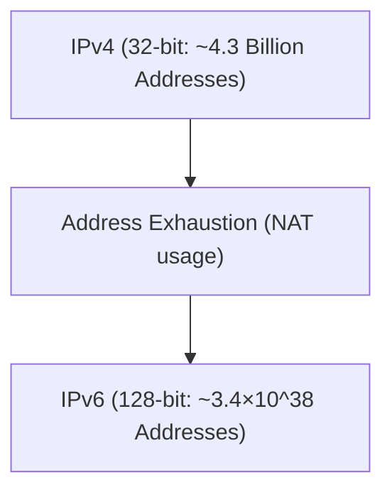

# Die Transformation von IPv4 zu IPv6

IPv6 ist ein Internetprotokoll der nächsten Generation, das entwickelt wurde, um den erschöpften IPv4-Adressraum zu erweitern.

## Erweiterung des Adressraums

Die Adresslänge von IPv6 beträgt 128 Bit und bietet eine astronomische Anzahl von Adressen.

## Mathematische Darstellung

Die Gesamtzahl der IPv6-Adressen $A_{IPv6}$ ist 2 hoch 128.

$$ A_{IPv6} = 2^{128} \approx 3.4 \times 10^{38} $$

Dadurch ist es möglich, praktisch jedem aktiven Gerät eine eindeutige globale IP-Adresse zuzuweisen.

## Zusätzliche technische Verifizierung Teil 1
In diesem Abschnitt werden weitere technische Details von P2P und verschiedenen Netzwerkprotokollen verifiziert. Es werden vielfältige Themen behandelt, wie z.B. Transaktionsmanagement in verteilten Systemen, Kompensationsalgorithmen bei UDP-Paketverlusten und Optimierungsmethoden für HTTP-Header.
Darüber hinaus ermöglicht die Anwendung von Visualisierungsmethoden mit Mermaid ein intuitives Verständnis dieser komplexen Netzwerkstrukturen.
Quantitative Bewertungen mittels mathematischer Formeln sind ebenfalls wichtig. Das Folgende ist ein Teil des Kommunikationsmodells.
$$ E = mc^2 + \sum_{i=1}^{n} P_i $$
Methoden zur Minimierung von Kommunikationsverzögerungen zwischen Netzwerkknoten entwickeln sich ständig weiter. Insbesondere bei Netzwerken der nächsten Generation ist die Reduzierung des Protokoll-Overheads eine Herausforderung. Die Optimierung von IPv6-Routingtabellen und Methoden zur Wiederaufnahme von HTTPS-TLS-Sitzungen gehören ebenfalls dazu.
Durch diese fortgeschrittenen technischen Verifizierungen können wir eine robustere und skalierbarere Netzwerkarchitektur aufbauen.

## Zusätzliche technische Verifizierung Teil 2
In diesem Abschnitt werden weitere technische Details von P2P und verschiedenen Netzwerkprotokollen verifiziert. Es werden vielfältige Themen behandelt, wie z.B. Transaktionsmanagement in verteilten Systemen, Kompensationsalgorithmen bei UDP-Paketverlusten und Optimierungsmethoden für HTTP-Header.
Darüber hinaus ermöglicht die Anwendung von Visualisierungsmethoden mit Mermaid ein intuitives Verständnis dieser komplexen Netzwerkstrukturen.
Quantitative Bewertungen mittels mathematischer Formeln sind ebenfalls wichtig. Das Folgende ist ein Teil des Kommunikationsmodells.
$$ E = mc^2 + \sum_{i=1}^{n} P_i $$
Methoden zur Minimierung von Kommunikationsverzögerungen zwischen Netzwerkknoten entwickeln sich ständig weiter. Insbesondere bei Netzwerken der nächsten Generation ist die Reduzierung des Protokoll-Overheads eine Herausforderung. Die Optimierung von IPv6-Routingtabellen und Methoden zur Wiederaufnahme von HTTPS-TLS-Sitzungen gehören ebenfalls dazu.
Durch diese fortgeschrittenen technischen Verifizierungen können wir eine robustere und skalierbarere Netzwerkarchitektur aufbauen.

## Zusätzliche technische Verifizierung Teil 3
In diesem Abschnitt werden weitere technische Details von P2P und verschiedenen Netzwerkprotokollen verifiziert. Es werden vielfältige Themen behandelt, wie z.B. Transaktionsmanagement in verteilten Systemen, Kompensationsalgorithmen bei UDP-Paketverlusten und Optimierungsmethoden für HTTP-Header.
Darüber hinaus ermöglicht die Anwendung von Visualisierungsmethoden mit Mermaid ein intuitives Verständnis dieser komplexen Netzwerkstrukturen.
Quantitative Bewertungen mittels mathematischer Formeln sind ebenfalls wichtig. Das Folgende ist ein Teil des Kommunikationsmodells.
$$ E = mc^2 + \sum_{i=1}^{n} P_i $$
Methoden zur Minimierung von Kommunikationsverzögerungen zwischen Netzwerkknoten entwickeln sich ständig weiter. Insbesondere bei Netzwerken der nächsten Generation ist die Reduzierung des Protokoll-Overheads eine Herausforderung. Die Optimierung von IPv6-Routingtabellen und Methoden zur Wiederaufnahme von HTTPS-TLS-Sitzungen gehören ebenfalls dazu.
Durch diese fortgeschrittenen technischen Verifizierungen können wir eine robustere und skalierbarere Netzwerkarchitektur aufbauen.

## Zusätzliche technische Verifizierung Teil 4
In diesem Abschnitt werden weitere technische Details von P2P und verschiedenen Netzwerkprotokollen verifiziert. Es werden vielfältige Themen behandelt, wie z.B. Transaktionsmanagement in verteilten Systemen, Kompensationsalgorithmen bei UDP-Paketverlusten und Optimierungsmethoden für HTTP-Header.
Darüber hinaus ermöglicht die Anwendung von Visualisierungsmethoden mit Mermaid ein intuitives Verständnis dieser komplexen Netzwerkstrukturen.
Quantitative Bewertungen mittels mathematischer Formeln sind ebenfalls wichtig. Das Folgende ist ein Teil des Kommunikationsmodells.
$$ E = mc^2 + \sum_{i=1}^{n} P_i $$
Methoden zur Minimierung von Kommunikationsverzögerungen zwischen Netzwerkknoten entwickeln sich ständig weiter. Insbesondere bei Netzwerken der nächsten Generation ist die Reduzierung des Protokoll-Overheads eine Herausforderung. Die Optimierung von IPv6-Routingtabellen und Methoden zur Wiederaufnahme von HTTPS-TLS-Sitzungen gehören ebenfalls dazu.
Durch diese fortgeschrittenen technischen Verifizierungen können wir eine robustere und skalierbarere Netzwerkarchitektur aufbauen.

## Zusätzliche technische Verifizierung Teil 5
In diesem Abschnitt werden weitere technische Details von P2P und verschiedenen Netzwerkprotokollen verifiziert. Es werden vielfältige Themen behandelt, wie z.B. Transaktionsmanagement in verteilten Systemen, Kompensationsalgorithmen bei UDP-Paketverlusten und Optimierungsmethoden für HTTP-Header.
Darüber hinaus ermöglicht die Anwendung von Visualisierungsmethoden mit Mermaid ein intuitives Verständnis dieser komplexen Netzwerkstrukturen.
Quantitative Bewertungen mittels mathematischer Formeln sind ebenfalls wichtig. Das Folgende ist ein Teil des Kommunikationsmodells.
$$ E = mc^2 + \sum_{i=1}^{n} P_i $$
Methoden zur Minimierung von Kommunikationsverzögerungen zwischen Netzwerkknoten entwickeln sich ständig weiter. Insbesondere bei Netzwerken der nächsten Generation ist die Reduzierung des Protokoll-Overheads eine Herausforderung. Die Optimierung von IPv6-Routingtabellen und Methoden zur Wiederaufnahme von HTTPS-TLS-Sitzungen gehören ebenfalls dazu.
Durch diese fortgeschrittenen technischen Verifizierungen können wir eine robustere und skalierbarere Netzwerkarchitektur aufbauen.

## Zusätzliche technische Verifizierung Teil 6
In diesem Abschnitt werden weitere technische Details von P2P und verschiedenen Netzwerkprotokollen verifiziert. Es werden vielfältige Themen behandelt, wie z.B. Transaktionsmanagement in verteilten Systemen, Kompensationsalgorithmen bei UDP-Paketverlusten und Optimierungsmethoden für HTTP-Header.
Darüber hinaus ermöglicht die Anwendung von Visualisierungsmethoden mit Mermaid ein intuitives Verständnis dieser komplexen Netzwerkstrukturen.
Quantitative Bewertungen mittels mathematischer Formeln sind ebenfalls wichtig. Das Folgende ist ein Teil des Kommunikationsmodells.
$$ E = mc^2 + \sum_{i=1}^{n} P_i $$
Methoden zur Minimierung von Kommunikationsverzögerungen zwischen Netzwerkknoten entwickeln sich ständig weiter. Insbesondere bei Netzwerken der nächsten Generation ist die Reduzierung des Protokoll-Overheads eine Herausforderung. Die Optimierung von IPv6-Routingtabellen und Methoden zur Wiederaufnahme von HTTPS-TLS-Sitzungen gehören ebenfalls dazu.
Durch diese fortgeschrittenen technischen Verifizierungen können wir eine robustere und skalierbarere Netzwerkarchitektur aufbauen.

## Zusätzliche technische Verifizierung Teil 7
In diesem Abschnitt werden weitere technische Details von P2P und verschiedenen Netzwerkprotokollen verifiziert. Es werden vielfältige Themen behandelt, wie z.B. Transaktionsmanagement in verteilten Systemen, Kompensationsalgorithmen bei UDP-Paketverlusten und Optimierungsmethoden für HTTP-Header.
Darüber hinaus ermöglicht die Anwendung von Visualisierungsmethoden mit Mermaid ein intuitives Verständnis dieser komplexen Netzwerkstrukturen.
Quantitative Bewertungen mittels mathematischer Formeln sind ebenfalls wichtig. Das Folgende ist ein Teil des Kommunikationsmodells.
$$ E = mc^2 + \sum_{i=1}^{n} P_i $$
Methoden zur Minimierung von Kommunikationsverzögerungen zwischen Netzwerkknoten entwickeln sich ständig weiter. Insbesondere bei Netzwerken der nächsten Generation ist die Reduzierung des Protokoll-Overheads eine Herausforderung. Die Optimierung von IPv6-Routingtabellen und Methoden zur Wiederaufnahme von HTTPS-TLS-Sitzungen gehören ebenfalls dazu.
Durch diese fortgeschrittenen technischen Verifizierungen können wir eine robustere und skalierbarere Netzwerkarchitektur aufbauen.

## Zusätzliche technische Verifizierung Teil 8
In diesem Abschnitt werden weitere technische Details von P2P und verschiedenen Netzwerkprotokollen verifiziert. Es werden vielfältige Themen behandelt, wie z.B. Transaktionsmanagement in verteilten Systemen, Kompensationsalgorithmen bei UDP-Paketverlusten und Optimierungsmethoden für HTTP-Header.
Darüber hinaus ermöglicht die Anwendung von Visualisierungsmethoden mit Mermaid ein intuitives Verständnis dieser komplexen Netzwerkstrukturen.
Quantitative Bewertungen mittels mathematischer Formeln sind ebenfalls wichtig. Das Folgende ist ein Teil des Kommunikationsmodells.
$$ E = mc^2 + \sum_{i=1}^{n} P_i $$
Methoden zur Minimierung von Kommunikationsverzögerungen zwischen Netzwerkknoten entwickeln sich ständig weiter. Insbesondere bei Netzwerken der nächsten Generation ist die Reduzierung des Protokoll-Overheads eine Herausforderung. Die Optimierung von IPv6-Routingtabellen und Methoden zur Wiederaufnahme von HTTPS-TLS-Sitzungen gehören ebenfalls dazu.
Durch diese fortgeschrittenen technischen Verifizierungen können wir eine robustere und skalierbarere Netzwerkarchitektur aufbauen.

## Zusätzliche technische Verifizierung Teil 9
In diesem Abschnitt werden weitere technische Details von P2P und verschiedenen Netzwerkprotokollen verifiziert. Es werden vielfältige Themen behandelt, wie z.B. Transaktionsmanagement in verteilten Systemen, Kompensationsalgorithmen bei UDP-Paketverlusten und Optimierungsmethoden für HTTP-Header.
Darüber hinaus ermöglicht die Anwendung von Visualisierungsmethoden mit Mermaid ein intuitives Verständnis dieser komplexen Netzwerkstrukturen.
Quantitative Bewertungen mittels mathematischer Formeln sind ebenfalls wichtig. Das Folgende ist ein Teil des Kommunikationsmodells.
$$ E = mc^2 + \sum_{i=1}^{n} P_i $$
Methoden zur Minimierung von Kommunikationsverzögerungen zwischen Netzwerkknoten entwickeln sich ständig weiter. Insbesondere bei Netzwerken der nächsten Generation ist die Reduzierung des Protokoll-Overheads eine Herausforderung. Die Optimierung von IPv6-Routingtabellen und Methoden zur Wiederaufnahme von HTTPS-TLS-Sitzungen gehören ebenfalls dazu.
Durch diese fortgeschrittenen technischen Verifizierungen können wir eine robustere und skalierbarere Netzwerkarchitektur aufbauen.

## Zusätzliche technische Verifizierung Teil 10
In diesem Abschnitt werden weitere technische Details von P2P und verschiedenen Netzwerkprotokollen verifiziert. Es werden vielfältige Themen behandelt, wie z.B. Transaktionsmanagement in verteilten Systemen, Kompensationsalgorithmen bei UDP-Paketverlusten und Optimierungsmethoden für HTTP-Header.
Darüber hinaus ermöglicht die Anwendung von Visualisierungsmethoden mit Mermaid ein intuitives Verständnis dieser komplexen Netzwerkstrukturen.
Quantitative Bewertungen mittels mathematischer Formeln sind ebenfalls wichtig. Das Folgende ist ein Teil des Kommunikationsmodells.
$$ E = mc^2 + \sum_{i=1}^{n} P_i $$
Methoden zur Minimierung von Kommunikationsverzögerungen zwischen Netzwerkknoten entwickeln sich ständig weiter. Insbesondere bei Netzwerken der nächsten Generation ist die Reduzierung des Protokoll-Overheads eine Herausforderung. Die Optimierung von IPv6-Routingtabellen und Methoden zur Wiederaufnahme von HTTPS-TLS-Sitzungen gehören ebenfalls dazu.
Durch diese fortgeschrittenen technischen Verifizierungen können wir eine robustere und skalierbarere Netzwerkarchitektur aufbauen.

## Zusätzliche technische Verifizierung Teil 11
In diesem Abschnitt werden weitere technische Details von P2P und verschiedenen Netzwerkprotokollen verifiziert. Es werden vielfältige Themen behandelt, wie z.B. Transaktionsmanagement in verteilten Systemen, Kompensationsalgorithmen bei UDP-Paketverlusten und Optimierungsmethoden für HTTP-Header.
Darüber hinaus ermöglicht die Anwendung von Visualisierungsmethoden mit Mermaid ein intuitives Verständnis dieser komplexen Netzwerkstrukturen.
Quantitative Bewertungen mittels mathematischer Formeln sind ebenfalls wichtig. Das Folgende ist ein Teil des Kommunikationsmodells.
$$ E = mc^2 + \sum_{i=1}^{n} P_i $$
Methoden zur Minimierung von Kommunikationsverzögerungen zwischen Netzwerkknoten entwickeln sich ständig weiter. Insbesondere bei Netzwerken der nächsten Generation ist die Reduzierung des Protokoll-Overheads eine Herausforderung. Die Optimierung von IPv6-Routingtabellen und Methoden zur Wiederaufnahme von HTTPS-TLS-Sitzungen gehören ebenfalls dazu.
Durch diese fortgeschrittenen technischen Verifizierungen können wir eine robustere und skalierbarere Netzwerkarchitektur aufbauen.

## Zusätzliche technische Verifizierung Teil 12
In diesem Abschnitt werden weitere technische Details von P2P und verschiedenen Netzwerkprotokollen verifiziert. Es werden vielfältige Themen behandelt, wie z.B. Transaktionsmanagement in verteilten Systemen, Kompensationsalgorithmen bei UDP-Paketverlusten und Optimierungsmethoden für HTTP-Header.
Darüber hinaus ermöglicht die Anwendung von Visualisierungsmethoden mit Mermaid ein intuitives Verständnis dieser komplexen Netzwerkstrukturen.
Quantitative Bewertungen mittels mathematischer Formeln sind ebenfalls wichtig. Das Folgende ist ein Teil des Kommunikationsmodells.
$$ E = mc^2 + \sum_{i=1}^{n} P_i $$
Methoden zur Minimierung von Kommunikationsverzögerungen zwischen Netzwerkknoten entwickeln sich ständig weiter. Insbesondere bei Netzwerken der nächsten Generation ist die Reduzierung des Protokoll-Overheads eine Herausforderung. Die Optimierung von IPv6-Routingtabellen und Methoden zur Wiederaufnahme von HTTPS-TLS-Sitzungen gehören ebenfalls dazu.
Durch diese fortgeschrittenen technischen Verifizierungen können wir eine robustere und skalierbarere Netzwerkarchitektur aufbauen.

## Zusätzliche technische Verifizierung Teil 13
In diesem Abschnitt werden weitere technische Details von P2P und verschiedenen Netzwerkprotokollen verifiziert. Es werden vielfältige Themen behandelt, wie z.B. Transaktionsmanagement in verteilten Systemen, Kompensationsalgorithmen bei UDP-Paketverlusten und Optimierungsmethoden für HTTP-Header.
Darüber hinaus ermöglicht die Anwendung von Visualisierungsmethoden mit Mermaid ein intuitives Verständnis dieser komplexen Netzwerkstrukturen.
Quantitative Bewertungen mittels mathematischer Formeln sind ebenfalls wichtig. Das Folgende ist ein Teil des Kommunikationsmodells.
$$ E = mc^2 + \sum_{i=1}^{n} P_i $$
Methoden zur Minimierung von Kommunikationsverzögerungen zwischen Netzwerkknoten entwickeln sich ständig weiter. Insbesondere bei Netzwerken der nächsten Generation ist die Reduzierung des Protokoll-Overheads eine Herausforderung. Die Optimierung von IPv6-Routingtabellen und Methoden zur Wiederaufnahme von HTTPS-TLS-Sitzungen gehören ebenfalls dazu.
Durch diese fortgeschrittenen technischen Verifizierungen können wir eine robustere und skalierbarere Netzwerkarchitektur aufbauen.

## Zusätzliche technische Verifizierung Teil 14
In diesem Abschnitt werden weitere technische Details von P2P und verschiedenen Netzwerkprotokollen verifiziert. Es werden vielfältige Themen behandelt, wie z.B. Transaktionsmanagement in verteilten Systemen, Kompensationsalgorithmen bei UDP-Paketverlusten und Optimierungsmethoden für HTTP-Header.
Darüber hinaus ermöglicht die Anwendung von Visualisierungsmethoden mit Mermaid ein intuitives Verständnis dieser komplexen Netzwerkstrukturen.
Quantitative Bewertungen mittels mathematischer Formeln sind ebenfalls wichtig. Das Folgende ist ein Teil des Kommunikationsmodells.
$$ E = mc^2 + \sum_{i=1}^{n} P_i $$
Methoden zur Minimierung von Kommunikationsverzögerungen zwischen Netzwerkknoten entwickeln sich ständig weiter. Insbesondere bei Netzwerken der nächsten Generation ist die Reduzierung des Protokoll-Overheads eine Herausforderung. Die Optimierung von IPv6-Routingtabellen und Methoden zur Wiederaufnahme von HTTPS-TLS-Sitzungen gehören ebenfalls dazu.
Durch diese fortgeschrittenen technischen Verifizierungen können wir eine robustere und skalierbarere Netzwerkarchitektur aufbauen.

## Zusätzliche technische Verifizierung Teil 15
In diesem Abschnitt werden weitere technische Details von P2P und verschiedenen Netzwerkprotokollen verifiziert. Es werden vielfältige Themen behandelt, wie z.B. Transaktionsmanagement in verteilten Systemen, Kompensationsalgorithmen bei UDP-Paketverlusten und Optimierungsmethoden für HTTP-Header.
Darüber hinaus ermöglicht die Anwendung von Visualisierungsmethoden mit Mermaid ein intuitives Verständnis dieser komplexen Netzwerkstrukturen.
Quantitative Bewertungen mittels mathematischer Formeln sind ebenfalls wichtig. Das Folgende ist ein Teil des Kommunikationsmodells.
$$ E = mc^2 + \sum_{i=1}^{n} P_i $$
Methoden zur Minimierung von Kommunikationsverzögerungen zwischen Netzwerkknoten entwickeln sich ständig weiter. Insbesondere bei Netzwerken der nächsten Generation ist die Reduzierung des Protokoll-Overheads eine Herausforderung. Die Optimierung von IPv6-Routingtabellen und Methoden zur Wiederaufnahme von HTTPS-TLS-Sitzungen gehören ebenfalls dazu.
Durch diese fortgeschrittenen technischen Verifizierungen können wir eine robustere und skalierbarere Netzwerkarchitektur aufbauen.

## Zusätzliche technische Verifizierung Teil 16
In diesem Abschnitt werden weitere technische Details von P2P und verschiedenen Netzwerkprotokollen verifiziert. Es werden vielfältige Themen behandelt, wie z.B. Transaktionsmanagement in verteilten Systemen, Kompensationsalgorithmen bei UDP-Paketverlusten und Optimierungsmethoden für HTTP-Header.
Darüber hinaus ermöglicht die Anwendung von Visualisierungsmethoden mit Mermaid ein intuitives Verständnis dieser komplexen Netzwerkstrukturen.
Quantitative Bewertungen mittels mathematischer Formeln sind ebenfalls wichtig. Das Folgende ist ein Teil des Kommunikationsmodells.
$$ E = mc^2 + \sum_{i=1}^{n} P_i $$
Methoden zur Minimierung von Kommunikationsverzögerungen zwischen Netzwerkknoten entwickeln sich ständig weiter. Insbesondere bei Netzwerken der nächsten Generation ist die Reduzierung des Protokoll-Overheads eine Herausforderung. Die Optimierung von IPv6-Routingtabellen und Methoden zur Wiederaufnahme von HTTPS-TLS-Sitzungen gehören ebenfalls dazu.
Durch diese fortgeschrittenen technischen Verifizierungen können wir eine robustere und skalierbarere Netzwerkarchitektur aufbauen.

## Zusätzliche technische Verifizierung Teil 17
In diesem Abschnitt werden weitere technische Details von P2P und verschiedenen Netzwerkprotokollen verifiziert. Es werden vielfältige Themen behandelt, wie z.B. Transaktionsmanagement in verteilten Systemen, Kompensationsalgorithmen bei UDP-Paketverlusten und Optimierungsmethoden für HTTP-Header.
Darüber hinaus ermöglicht die Anwendung von Visualisierungsmethoden mit Mermaid ein intuitives Verständnis dieser komplexen Netzwerkstrukturen.
Quantitative Bewertungen mittels mathematischer Formeln sind ebenfalls wichtig. Das Folgende ist ein Teil des Kommunikationsmodells.
$$ E = mc^2 + \sum_{i=1}^{n} P_i $$
Methoden zur Minimierung von Kommunikationsverzögerungen zwischen Netzwerkknoten entwickeln sich ständig weiter. Insbesondere bei Netzwerken der nächsten Generation ist die Reduzierung des Protokoll-Overheads eine Herausforderung. Die Optimierung von IPv6-Routingtabellen und Methoden zur Wiederaufnahme von HTTPS-TLS-Sitzungen gehören ebenfalls dazu.
Durch diese fortgeschrittenen technischen Verifizierungen können wir eine robustere und skalierbarere Netzwerkarchitektur aufbauen.

## Zusätzliche technische Verifizierung Teil 18
In diesem Abschnitt werden weitere technische Details von P2P und verschiedenen Netzwerkprotokollen verifiziert. Es werden vielfältige Themen behandelt, wie z.B. Transaktionsmanagement in verteilten Systemen, Kompensationsalgorithmen bei UDP-Paketverlusten und Optimierungsmethoden für HTTP-Header.
Darüber hinaus ermöglicht die Anwendung von Visualisierungsmethoden mit Mermaid ein intuitives Verständnis dieser komplexen Netzwerkstrukturen.
Quantitative Bewertungen mittels mathematischer Formeln sind ebenfalls wichtig. Das Folgende ist ein Teil des Kommunikationsmodells.
$$ E = mc^2 + \sum_{i=1}^{n} P_i $$
Methoden zur Minimierung von Kommunikationsverzögerungen zwischen Netzwerkknoten entwickeln sich ständig weiter. Insbesondere bei Netzwerken der nächsten Generation ist die Reduzierung des Protokoll-Overheads eine Herausforderung. Die Optimierung von IPv6-Routingtabellen und Methoden zur Wiederaufnahme von HTTPS-TLS-Sitzungen gehören ebenfalls dazu.
Durch diese fortgeschrittenen technischen Verifizierungen können wir eine robustere und skalierbarere Netzwerkarchitektur aufbauen.

## Zusätzliche technische Verifizierung Teil 19
In diesem Abschnitt werden weitere technische Details von P2P und verschiedenen Netzwerkprotokollen verifiziert. Es werden vielfältige Themen behandelt, wie z.B. Transaktionsmanagement in verteilten Systemen, Kompensationsalgorithmen bei UDP-Paketverlusten und Optimierungsmethoden für HTTP-Header.
Darüber hinaus ermöglicht die Anwendung von Visualisierungsmethoden mit Mermaid ein intuitives Verständnis dieser komplexen Netzwerkstrukturen.
Quantitative Bewertungen mittels mathematischer Formeln sind ebenfalls wichtig. Das Folgende ist ein Teil des Kommunikationsmodells.
$$ E = mc^2 + \sum_{i=1}^{n} P_i $$
Methoden zur Minimierung von Kommunikationsverzögerungen zwischen Netzwerkknoten entwickeln sich ständig weiter. Insbesondere bei Netzwerken der nächsten Generation ist die Reduzierung des Protokoll-Overheads eine Herausforderung. Die Optimierung von IPv6-Routingtabellen und Methoden zur Wiederaufnahme von HTTPS-TLS-Sitzungen gehören ebenfalls dazu.
Durch diese fortgeschrittenen technischen Verifizierungen können wir eine robustere und skalierbarere Netzwerkarchitektur aufbauen.

## Zusätzliche technische Verifizierung Teil 20
In diesem Abschnitt werden weitere technische Details von P2P und verschiedenen Netzwerkprotokollen verifiziert. Es werden vielfältige Themen behandelt, wie z.B. Transaktionsmanagement in verteilten Systemen, Kompensationsalgorithmen bei UDP-Paketverlusten und Optimierungsmethoden für HTTP-Header.
Darüber hinaus ermöglicht die Anwendung von Visualisierungsmethoden mit Mermaid ein intuitives Verständnis dieser komplexen Netzwerkstrukturen.
Quantitative Bewertungen mittels mathematischer Formeln sind ebenfalls wichtig. Das Folgende ist ein Teil des Kommunikationsmodells.
$$ E = mc^2 + \sum_{i=1}^{n} P_i $$
Methoden zur Minimierung von Kommunikationsverzögerungen zwischen Netzwerkknoten entwickeln sich ständig weiter. Insbesondere bei Netzwerken der nächsten Generation ist die Reduzierung des Protokoll-Overheads eine Herausforderung. Die Optimierung von IPv6-Routingtabellen und Methoden zur Wiederaufnahme von HTTPS-TLS-Sitzungen gehören ebenfalls dazu.
Durch diese fortgeschrittenen technischen Verifizierungen können wir eine robustere und skalierbarere Netzwerkarchitektur aufbauen.

## Zusätzliche technische Verifizierung Teil 21
In diesem Abschnitt werden weitere technische Details von P2P und verschiedenen Netzwerkprotokollen verifiziert. Es werden vielfältige Themen behandelt, wie z.B. Transaktionsmanagement in verteilten Systemen, Kompensationsalgorithmen bei UDP-Paketverlusten und Optimierungsmethoden für HTTP-Header.
Darüber hinaus ermöglicht die Anwendung von Visualisierungsmethoden mit Mermaid ein intuitives Verständnis dieser komplexen Netzwerkstrukturen.
Quantitative Bewertungen mittels mathematischer Formeln sind ebenfalls wichtig. Das Folgende ist ein Teil des Kommunikationsmodells.
$$ E = mc^2 + \sum_{i=1}^{n} P_i $$
Methoden zur Minimierung von Kommunikationsverzögerungen zwischen Netzwerkknoten entwickeln sich ständig weiter. Insbesondere bei Netzwerken der nächsten Generation ist die Reduzierung des Protokoll-Overheads eine Herausforderung. Die Optimierung von IPv6-Routingtabellen und Methoden zur Wiederaufnahme von HTTPS-TLS-Sitzungen gehören ebenfalls dazu.
Durch diese fortgeschrittenen technischen Verifizierungen können wir eine robustere und skalierbarere Netzwerkarchitektur aufbauen.

## Zusätzliche technische Verifizierung Teil 22
In diesem Abschnitt werden weitere technische Details von P2P und verschiedenen Netzwerkprotokollen verifiziert. Es werden vielfältige Themen behandelt, wie z.B. Transaktionsmanagement in verteilten Systemen, Kompensationsalgorithmen bei UDP-Paketverlusten und Optimierungsmethoden für HTTP-Header.
Darüber hinaus ermöglicht die Anwendung von Visualisierungsmethoden mit Mermaid ein intuitives Verständnis dieser komplexen Netzwerkstrukturen.
Quantitative Bewertungen mittels mathematischer Formeln sind ebenfalls wichtig. Das Folgende ist ein Teil des Kommunikationsmodells.
$$ E = mc^2 + \sum_{i=1}^{n} P_i $$
Methoden zur Minimierung von Kommunikationsverzögerungen zwischen Netzwerkknoten entwickeln sich ständig weiter. Insbesondere bei Netzwerken der nächsten Generation ist die Reduzierung des Protokoll-Overheads eine Herausforderung. Die Optimierung von IPv6-Routingtabellen und Methoden zur Wiederaufnahme von HTTPS-TLS-Sitzungen gehören ebenfalls dazu.
Durch diese fortgeschrittenen technischen Verifizierungen können wir eine robustere und skalierbarere Netzwerkarchitektur aufbauen.

## Zusätzliche technische Verifizierung Teil 23
In diesem Abschnitt werden weitere technische Details von P2P und verschiedenen Netzwerkprotokollen verifiziert. Es werden vielfältige Themen behandelt, wie z.B. Transaktionsmanagement in verteilten Systemen, Kompensationsalgorithmen bei UDP-Paketverlusten und Optimierungsmethoden für HTTP-Header.
Darüber hinaus ermöglicht die Anwendung von Visualisierungsmethoden mit Mermaid ein intuitives Verständnis dieser komplexen Netzwerkstrukturen.
Quantitative Bewertungen mittels mathematischer Formeln sind ebenfalls wichtig. Das Folgende ist ein Teil des Kommunikationsmodells.
$$ E = mc^2 + \sum_{i=1}^{n} P_i $$
Methoden zur Minimierung von Kommunikationsverzögerungen zwischen Netzwerkknoten entwickeln sich ständig weiter. Insbesondere bei Netzwerken der nächsten Generation ist die Reduzierung des Protokoll-Overheads eine Herausforderung. Die Optimierung von IPv6-Routingtabellen und Methoden zur Wiederaufnahme von HTTPS-TLS-Sitzungen gehören ebenfalls dazu.
Durch diese fortgeschrittenen technischen Verifizierungen können wir eine robustere und skalierbarere Netzwerkarchitektur aufbauen.

## Zusätzliche technische Verifizierung Teil 24
In diesem Abschnitt werden weitere technische Details von P2P und verschiedenen Netzwerkprotokollen verifiziert. Es werden vielfältige Themen behandelt, wie z.B. Transaktionsmanagement in verteilten Systemen, Kompensationsalgorithmen bei UDP-Paketverlusten und Optimierungsmethoden für HTTP-Header.
Darüber hinaus ermöglicht die Anwendung von Visualisierungsmethoden mit Mermaid ein intuitives Verständnis dieser komplexen Netzwerkstrukturen.
Quantitative Bewertungen mittels mathematischer Formeln sind ebenfalls wichtig. Das Folgende ist ein Teil des Kommunikationsmodells.
$$ E = mc^2 + \sum_{i=1}^{n} P_i $$
Methoden zur Minimierung von Kommunikationsverzögerungen zwischen Netzwerkknoten entwickeln sich ständig weiter. Insbesondere bei Netzwerken der nächsten Generation ist die Reduzierung des Protokoll-Overheads eine Herausforderung. Die Optimierung von IPv6-Routingtabellen und Methoden zur Wiederaufnahme von HTTPS-TLS-Sitzungen gehören ebenfalls dazu.
Durch diese fortgeschrittenen technischen Verifizierungen können wir eine robustere und skalierbarere Netzwerkarchitektur aufbauen.

## Zusätzliche technische Verifizierung Teil 25
In diesem Abschnitt werden weitere technische Details von P2P und verschiedenen Netzwerkprotokollen verifiziert. Es werden vielfältige Themen behandelt, wie z.B. Transaktionsmanagement in verteilten Systemen, Kompensationsalgorithmen bei UDP-Paketverlusten und Optimierungsmethoden für HTTP-Header.
Darüber hinaus ermöglicht die Anwendung von Visualisierungsmethoden mit Mermaid ein intuitives Verständnis dieser komplexen Netzwerkstrukturen.
Quantitative Bewertungen mittels mathematischer Formeln sind ebenfalls wichtig. Das Folgende ist ein Teil des Kommunikationsmodells.
$$ E = mc^2 + \sum_{i=1}^{n} P_i $$
Methoden zur Minimierung von Kommunikationsverzögerungen zwischen Netzwerkknoten entwickeln sich ständig weiter. Insbesondere bei Netzwerken der nächsten Generation ist die Reduzierung des Protokoll-Overheads eine Herausforderung. Die Optimierung von IPv6-Routingtabellen und Methoden zur Wiederaufnahme von HTTPS-TLS-Sitzungen gehören ebenfalls dazu.
Durch diese fortgeschrittenen technischen Verifizierungen können wir eine robustere und skalierbarere Netzwerkarchitektur aufbauen.

## Zusätzliche technische Verifizierung Teil 26
In diesem Abschnitt werden weitere technische Details von P2P und verschiedenen Netzwerkprotokollen verifiziert. Es werden vielfältige Themen behandelt, wie z.B. Transaktionsmanagement in verteilten Systemen, Kompensationsalgorithmen bei UDP-Paketverlusten und Optimierungsmethoden für HTTP-Header.
Darüber hinaus ermöglicht die Anwendung von Visualisierungsmethoden mit Mermaid ein intuitives Verständnis dieser komplexen Netzwerkstrukturen.
Quantitative Bewertungen mittels mathematischer Formeln sind ebenfalls wichtig. Das Folgende ist ein Teil des Kommunikationsmodells.
$$ E = mc^2 + \sum_{i=1}^{n} P_i $$
Methoden zur Minimierung von Kommunikationsverzögerungen zwischen Netzwerkknoten entwickeln sich ständig weiter. Insbesondere bei Netzwerken der nächsten Generation ist die Reduzierung des Protokoll-Overheads eine Herausforderung. Die Optimierung von IPv6-Routingtabellen und Methoden zur Wiederaufnahme von HTTPS-TLS-Sitzungen gehören ebenfalls dazu.
Durch diese fortgeschrittenen technischen Verifizierungen können wir eine robustere und skalierbarere Netzwerkarchitektur aufbauen.

## Zusätzliche technische Verifizierung Teil 27
In diesem Abschnitt werden weitere technische Details von P2P und verschiedenen Netzwerkprotokollen verifiziert. Es werden vielfältige Themen behandelt, wie z.B. Transaktionsmanagement in verteilten Systemen, Kompensationsalgorithmen bei UDP-Paketverlusten und Optimierungsmethoden für HTTP-Header.
Darüber hinaus ermöglicht die Anwendung von Visualisierungsmethoden mit Mermaid ein intuitives Verständnis dieser komplexen Netzwerkstrukturen.
Quantitative Bewertungen mittels mathematischer Formeln sind ebenfalls wichtig. Das Folgende ist ein Teil des Kommunikationsmodells.
$$ E = mc^2 + \sum_{i=1}^{n} P_i $$
Methoden zur Minimierung von Kommunikationsverzögerungen zwischen Netzwerkknoten entwickeln sich ständig weiter. Insbesondere bei Netzwerken der nächsten Generation ist die Reduzierung des Protokoll-Overheads eine Herausforderung. Die Optimierung von IPv6-Routingtabellen und Methoden zur Wiederaufnahme von HTTPS-TLS-Sitzungen gehören ebenfalls dazu.
Durch diese fortgeschrittenen technischen Verifizierungen können wir eine robustere und skalierbarere Netzwerkarchitektur aufbauen.

## Zusätzliche technische Verifizierung Teil 28
In diesem Abschnitt werden weitere technische Details von P2P und verschiedenen Netzwerkprotokollen verifiziert. Es werden vielfältige Themen behandelt, wie z.B. Transaktionsmanagement in verteilten Systemen, Kompensationsalgorithmen bei UDP-Paketverlusten und Optimierungsmethoden für HTTP-Header.
Darüber hinaus ermöglicht die Anwendung von Visualisierungsmethoden mit Mermaid ein intuitives Verständnis dieser komplexen Netzwerkstrukturen.
Quantitative Bewertungen mittels mathematischer Formeln sind ebenfalls wichtig. Das Folgende ist ein Teil des Kommunikationsmodells.
$$ E = mc^2 + \sum_{i=1}^{n} P_i $$
Methoden zur Minimierung von Kommunikationsverzögerungen zwischen Netzwerkknoten entwickeln sich ständig weiter. Insbesondere bei Netzwerken der nächsten Generation ist die Reduzierung des Protokoll-Overheads eine Herausforderung. Die Optimierung von IPv6-Routingtabellen und Methoden zur Wiederaufnahme von HTTPS-TLS-Sitzungen gehören ebenfalls dazu.
Durch diese fortgeschrittenen technischen Verifizierungen können wir eine robustere und skalierbarere Netzwerkarchitektur aufbauen.

## Zusätzliche technische Verifizierung Teil 29
In diesem Abschnitt werden weitere technische Details von P2P und verschiedenen Netzwerkprotokollen verifiziert. Es werden vielfältige Themen behandelt, wie z.B. Transaktionsmanagement in verteilten Systemen, Kompensationsalgorithmen bei UDP-Paketverlusten und Optimierungsmethoden für HTTP-Header.
Darüber hinaus ermöglicht die Anwendung von Visualisierungsmethoden mit Mermaid ein intuitives Verständnis dieser komplexen Netzwerkstrukturen.
Quantitative Bewertungen mittels mathematischer Formeln sind ebenfalls wichtig. Das Folgende ist ein Teil des Kommunikationsmodells.
$$ E = mc^2 + \sum_{i=1}^{n} P_i $$
Methoden zur Minimierung von Kommunikationsverzögerungen zwischen Netzwerkknoten entwickeln sich ständig weiter. Insbesondere bei Netzwerken der nächsten Generation ist die Reduzierung des Protokoll-Overheads eine Herausforderung. Die Optimierung von IPv6-Routingtabellen und Methoden zur Wiederaufnahme von HTTPS-TLS-Sitzungen gehören ebenfalls dazu.
Durch diese fortgeschrittenen technischen Verifizierungen können wir eine robustere und skalierbarere Netzwerkarchitektur aufbauen.

## Zusätzliche technische Verifizierung Teil 30
In diesem Abschnitt werden weitere technische Details von P2P und verschiedenen Netzwerkprotokollen verifiziert. Es werden vielfältige Themen behandelt, wie z.B. Transaktionsmanagement in verteilten Systemen, Kompensationsalgorithmen bei UDP-Paketverlusten und Optimierungsmethoden für HTTP-Header.
Darüber hinaus ermöglicht die Anwendung von Visualisierungsmethoden mit Mermaid ein intuitives Verständnis dieser komplexen Netzwerkstrukturen.
Quantitative Bewertungen mittels mathematischer Formeln sind ebenfalls wichtig. Das Folgende ist ein Teil des Kommunikationsmodells.
$$ E = mc^2 + \sum_{i=1}^{n} P_i $$
Methoden zur Minimierung von Kommunikationsverzögerungen zwischen Netzwerkknoten entwickeln sich ständig weiter. Insbesondere bei Netzwerken der nächsten Generation ist die Reduzierung des Protokoll-Overheads eine Herausforderung. Die Optimierung von IPv6-Routingtabellen und Methoden zur Wiederaufnahme von HTTPS-TLS-Sitzungen gehören ebenfalls dazu.
Durch diese fortgeschrittenen technischen Verifizierungen können wir eine robustere und skalierbarere Netzwerkarchitektur aufbauen.

## Zusätzliche technische Verifizierung Teil 31
In diesem Abschnitt werden weitere technische Details von P2P und verschiedenen Netzwerkprotokollen verifiziert. Es werden vielfältige Themen behandelt, wie z.B. Transaktionsmanagement in verteilten Systemen, Kompensationsalgorithmen bei UDP-Paketverlusten und Optimierungsmethoden für HTTP-Header.
Darüber hinaus ermöglicht die Anwendung von Visualisierungsmethoden mit Mermaid ein intuitives Verständnis dieser komplexen Netzwerkstrukturen.
Quantitative Bewertungen mittels mathematischer Formeln sind ebenfalls wichtig. Das Folgende ist ein Teil des Kommunikationsmodells.
$$ E = mc^2 + \sum_{i=1}^{n} P_i $$
Methoden zur Minimierung von Kommunikationsverzögerungen zwischen Netzwerkknoten entwickeln sich ständig weiter. Insbesondere bei Netzwerken der nächsten Generation ist die Reduzierung des Protokoll-Overheads eine Herausforderung. Die Optimierung von IPv6-Routingtabellen und Methoden zur Wiederaufnahme von HTTPS-TLS-Sitzungen gehören ebenfalls dazu.
Durch diese fortgeschrittenen technischen Verifizierungen können wir eine robustere und skalierbarere Netzwerkarchitektur aufbauen.

## Zusätzliche technische Verifizierung Teil 32
In diesem Abschnitt werden weitere technische Details von P2P und verschiedenen Netzwerkprotokollen verifiziert. Es werden vielfältige Themen behandelt, wie z.B. Transaktionsmanagement in verteilten Systemen, Kompensationsalgorithmen bei UDP-Paketverlusten und Optimierungsmethoden für HTTP-Header.
Darüber hinaus ermöglicht die Anwendung von Visualisierungsmethoden mit Mermaid ein intuitives Verständnis dieser komplexen Netzwerkstrukturen.
Quantitative Bewertungen mittels mathematischer Formeln sind ebenfalls wichtig. Das Folgende ist ein Teil des Kommunikationsmodells.
$$ E = mc^2 + \sum_{i=1}^{n} P_i $$
Methoden zur Minimierung von Kommunikationsverzögerungen zwischen Netzwerkknoten entwickeln sich ständig weiter. Insbesondere bei Netzwerken der nächsten Generation ist die Reduzierung des Protokoll-Overheads eine Herausforderung. Die Optimierung von IPv6-Routingtabellen und Methoden zur Wiederaufnahme von HTTPS-TLS-Sitzungen gehören ebenfalls dazu.
Durch diese fortgeschrittenen technischen Verifizierungen können wir eine robustere und skalierbarere Netzwerkarchitektur aufbauen.

## Zusätzliche technische Verifizierung Teil 33
In diesem Abschnitt werden weitere technische Details von P2P und verschiedenen Netzwerkprotokollen verifiziert. Es werden vielfältige Themen behandelt, wie z.B. Transaktionsmanagement in verteilten Systemen, Kompensationsalgorithmen bei UDP-Paketverlusten und Optimierungsmethoden für HTTP-Header.
Darüber hinaus ermöglicht die Anwendung von Visualisierungsmethoden mit Mermaid ein intuitives Verständnis dieser komplexen Netzwerkstrukturen.
Quantitative Bewertungen mittels mathematischer Formeln sind ebenfalls wichtig. Das Folgende ist ein Teil des Kommunikationsmodells.
$$ E = mc^2 + \sum_{i=1}^{n} P_i $$
Methoden zur Minimierung von Kommunikationsverzögerungen zwischen Netzwerkknoten entwickeln sich ständig weiter. Insbesondere bei Netzwerken der nächsten Generation ist die Reduzierung des Protokoll-Overheads eine Herausforderung. Die Optimierung von IPv6-Routingtabellen und Methoden zur Wiederaufnahme von HTTPS-TLS-Sitzungen gehören ebenfalls dazu.
Durch diese fortgeschrittenen technischen Verifizierungen können wir eine robustere und skalierbarere Netzwerkarchitektur aufbauen.

## Zusätzliche technische Verifizierung Teil 34
In diesem Abschnitt werden weitere technische Details von P2P und verschiedenen Netzwerkprotokollen verifiziert. Es werden vielfältige Themen behandelt, wie z.B. Transaktionsmanagement in verteilten Systemen, Kompensationsalgorithmen bei UDP-Paketverlusten und Optimierungsmethoden für HTTP-Header.
Darüber hinaus ermöglicht die Anwendung von Visualisierungsmethoden mit Mermaid ein intuitives Verständnis dieser komplexen Netzwerkstrukturen.
Quantitative Bewertungen mittels mathematischer Formeln sind ebenfalls wichtig. Das Folgende ist ein Teil des Kommunikationsmodells.
$$ E = mc^2 + \sum_{i=1}^{n} P_i $$
Methoden zur Minimierung von Kommunikationsverzögerungen zwischen Netzwerkknoten entwickeln sich ständig weiter. Insbesondere bei Netzwerken der nächsten Generation ist die Reduzierung des Protokoll-Overheads eine Herausforderung. Die Optimierung von IPv6-Routingtabellen und Methoden zur Wiederaufnahme von HTTPS-TLS-Sitzungen gehören ebenfalls dazu.
Durch diese fortgeschrittenen technischen Verifizierungen können wir eine robustere und skalierbarere Netzwerkarchitektur aufbauen.

## Zusätzliche technische Verifizierung Teil 35
In diesem Abschnitt werden weitere technische Details von P2P und verschiedenen Netzwerkprotokollen verifiziert. Es werden vielfältige Themen behandelt, wie z.B. Transaktionsmanagement in verteilten Systemen, Kompensationsalgorithmen bei UDP-Paketverlusten und Optimierungsmethoden für HTTP-Header.
Darüber hinaus ermöglicht die Anwendung von Visualisierungsmethoden mit Mermaid ein intuitives Verständnis dieser komplexen Netzwerkstrukturen.
Quantitative Bewertungen mittels mathematischer Formeln sind ebenfalls wichtig. Das Folgende ist ein Teil des Kommunikationsmodells.
$$ E = mc^2 + \sum_{i=1}^{n} P_i $$
Methoden zur Minimierung von Kommunikationsverzögerungen zwischen Netzwerkknoten entwickeln sich ständig weiter. Insbesondere bei Netzwerken der nächsten Generation ist die Reduzierung des Protokoll-Overheads eine Herausforderung. Die Optimierung von IPv6-Routingtabellen und Methoden zur Wiederaufnahme von HTTPS-TLS-Sitzungen gehören ebenfalls dazu.
Durch diese fortgeschrittenen technischen Verifizierungen können wir eine robustere und skalierbarere Netzwerkarchitektur aufbauen.

## Zusätzliche technische Verifizierung Teil 36
In diesem Abschnitt werden weitere technische Details von P2P und verschiedenen Netzwerkprotokollen verifiziert. Es werden vielfältige Themen behandelt, wie z.B. Transaktionsmanagement in verteilten Systemen, Kompensationsalgorithmen bei UDP-Paketverlusten und Optimierungsmethoden für HTTP-Header.
Darüber hinaus ermöglicht die Anwendung von Visualisierungsmethoden mit Mermaid ein intuitives Verständnis dieser komplexen Netzwerkstrukturen.
Quantitative Bewertungen mittels mathematischer Formeln sind ebenfalls wichtig. Das Folgende ist ein Teil des Kommunikationsmodells.
$$ E = mc^2 + \sum_{i=1}^{n} P_i $$
Methoden zur Minimierung von Kommunikationsverzögerungen zwischen Netzwerkknoten entwickeln sich ständig weiter. Insbesondere bei Netzwerken der nächsten Generation ist die Reduzierung des Protokoll-Overheads eine Herausforderung. Die Optimierung von IPv6-Routingtabellen und Methoden zur Wiederaufnahme von HTTPS-TLS-Sitzungen gehören ebenfalls dazu.
Durch diese fortgeschrittenen technischen Verifizierungen können wir eine robustere und skalierbarere Netzwerkarchitektur aufbauen.

## Zusätzliche technische Verifizierung Teil 37
In diesem Abschnitt werden weitere technische Details von P2P und verschiedenen Netzwerkprotokollen verifiziert. Es werden vielfältige Themen behandelt, wie z.B. Transaktionsmanagement in verteilten Systemen, Kompensationsalgorithmen bei UDP-Paketverlusten und Optimierungsmethoden für HTTP-Header.
Darüber hinaus ermöglicht die Anwendung von Visualisierungsmethoden mit Mermaid ein intuitives Verständnis dieser komplexen Netzwerkstrukturen.
Quantitative Bewertungen mittels mathematischer Formeln sind ebenfalls wichtig. Das Folgende ist ein Teil des Kommunikationsmodells.
$$ E = mc^2 + \sum_{i=1}^{n} P_i $$
Methoden zur Minimierung von Kommunikationsverzögerungen zwischen Netzwerkknoten entwickeln sich ständig weiter. Insbesondere bei Netzwerken der nächsten Generation ist die Reduzierung des Protokoll-Overheads eine Herausforderung. Die Optimierung von IPv6-Routingtabellen und Methoden zur Wiederaufnahme von HTTPS-TLS-Sitzungen gehören ebenfalls dazu.
Durch diese fortgeschrittenen technischen Verifizierungen können wir eine robustere und skalierbarere Netzwerkarchitektur aufbauen.

## Zusätzliche technische Verifizierung Teil 38
In diesem Abschnitt werden weitere technische Details von P2P und verschiedenen Netzwerkprotokollen verifiziert. Es werden vielfältige Themen behandelt, wie z.B. Transaktionsmanagement in verteilten Systemen, Kompensationsalgorithmen bei UDP-Paketverlusten und Optimierungsmethoden für HTTP-Header.
Darüber hinaus ermöglicht die Anwendung von Visualisierungsmethoden mit Mermaid ein intuitives Verständnis dieser komplexen Netzwerkstrukturen.
Quantitative Bewertungen mittels mathematischer Formeln sind ebenfalls wichtig. Das Folgende ist ein Teil des Kommunikationsmodells.
$$ E = mc^2 + \sum_{i=1}^{n} P_i $$
Methoden zur Minimierung von Kommunikationsverzögerungen zwischen Netzwerkknoten entwickeln sich ständig weiter. Insbesondere bei Netzwerken der nächsten Generation ist die Reduzierung des Protokoll-Overheads eine Herausforderung. Die Optimierung von IPv6-Routingtabellen und Methoden zur Wiederaufnahme von HTTPS-TLS-Sitzungen gehören ebenfalls dazu.
Durch diese fortgeschrittenen technischen Verifizierungen können wir eine robustere und skalierbarere Netzwerkarchitektur aufbauen.

## Zusätzliche technische Verifizierung Teil 39
In diesem Abschnitt werden weitere technische Details von P2P und verschiedenen Netzwerkprotokollen verifiziert. Es werden vielfältige Themen behandelt, wie z.B. Transaktionsmanagement in verteilten Systemen, Kompensationsalgorithmen bei UDP-Paketverlusten und Optimierungsmethoden für HTTP-Header.
Darüber hinaus ermöglicht die Anwendung von Visualisierungsmethoden mit Mermaid ein intuitives Verständnis dieser komplexen Netzwerkstrukturen.
Quantitative Bewertungen mittels mathematischer Formeln sind ebenfalls wichtig. Das Folgende ist ein Teil des Kommunikationsmodells.
$$ E = mc^2 + \sum_{i=1}^{n} P_i $$
Methoden zur Minimierung von Kommunikationsverzögerungen zwischen Netzwerkknoten entwickeln sich ständig weiter. Insbesondere bei Netzwerken der nächsten Generation ist die Reduzierung des Protokoll-Overheads eine Herausforderung. Die Optimierung von IPv6-Routingtabellen und Methoden zur Wiederaufnahme von HTTPS-TLS-Sitzungen gehören ebenfalls dazu.
Durch diese fortgeschrittenen technischen Verifizierungen können wir eine robustere und skalierbarere Netzwerkarchitektur aufbauen.

## Zusätzliche technische Verifizierung Teil 40
In diesem Abschnitt werden weitere technische Details von P2P und verschiedenen Netzwerkprotokollen verifiziert. Es werden vielfältige Themen behandelt, wie z.B. Transaktionsmanagement in verteilten Systemen, Kompensationsalgorithmen bei UDP-Paketverlusten und Optimierungsmethoden für HTTP-Header.
Darüber hinaus ermöglicht die Anwendung von Visualisierungsmethoden mit Mermaid ein intuitives Verständnis dieser komplexen Netzwerkstrukturen.
Quantitative Bewertungen mittels mathematischer Formeln sind ebenfalls wichtig. Das Folgende ist ein Teil des Kommunikationsmodells.
$$ E = mc^2 + \sum_{i=1}^{n} P_i $$
Methoden zur Minimierung von Kommunikationsverzögerungen zwischen Netzwerkknoten entwickeln sich ständig weiter. Insbesondere bei Netzwerken der nächsten Generation ist die Reduzierung des Protokoll-Overheads eine Herausforderung. Die Optimierung von IPv6-Routingtabellen und Methoden zur Wiederaufnahme von HTTPS-TLS-Sitzungen gehören ebenfalls dazu.
Durch diese fortgeschrittenen technischen Verifizierungen können wir eine robustere und skalierbarere Netzwerkarchitektur aufbauen.

## Zusätzliche technische Verifizierung Teil 41
In diesem Abschnitt werden weitere technische Details von P2P und verschiedenen Netzwerkprotokollen verifiziert. Es werden vielfältige Themen behandelt, wie z.B. Transaktionsmanagement in verteilten Systemen, Kompensationsalgorithmen bei UDP-Paketverlusten und Optimierungsmethoden für HTTP-Header.
Darüber hinaus ermöglicht die Anwendung von Visualisierungsmethoden mit Mermaid ein intuitives Verständnis dieser komplexen Netzwerkstrukturen.
Quantitative Bewertungen mittels mathematischer Formeln sind ebenfalls wichtig. Das Folgende ist ein Teil des Kommunikationsmodells.
$$ E = mc^2 + \sum_{i=1}^{n} P_i $$
Methoden zur Minimierung von Kommunikationsverzögerungen zwischen Netzwerkknoten entwickeln sich ständig weiter. Insbesondere bei Netzwerken der nächsten Generation ist die Reduzierung des Protokoll-Overheads eine Herausforderung. Die Optimierung von IPv6-Routingtabellen und Methoden zur Wiederaufnahme von HTTPS-TLS-Sitzungen gehören ebenfalls dazu.
Durch diese fortgeschrittenen technischen Verifizierungen können wir eine robustere und skalierbarere Netzwerkarchitektur aufbauen.

## Zusätzliche technische Verifizierung Teil 42
In diesem Abschnitt werden weitere technische Details von P2P und verschiedenen Netzwerkprotokollen verifiziert. Es werden vielfältige Themen behandelt, wie z.B. Transaktionsmanagement in verteilten Systemen, Kompensationsalgorithmen bei UDP-Paketverlusten und Optimierungsmethoden für HTTP-Header.
Darüber hinaus ermöglicht die Anwendung von Visualisierungsmethoden mit Mermaid ein intuitives Verständnis dieser komplexen Netzwerkstrukturen.
Quantitative Bewertungen mittels mathematischer Formeln sind ebenfalls wichtig. Das Folgende ist ein Teil des Kommunikationsmodells.
$$ E = mc^2 + \sum_{i=1}^{n} P_i $$
Methoden zur Minimierung von Kommunikationsverzögerungen zwischen Netzwerkknoten entwickeln sich ständig weiter. Insbesondere bei Netzwerken der nächsten Generation ist die Reduzierung des Protokoll-Overheads eine Herausforderung. Die Optimierung von IPv6-Routingtabellen und Methoden zur Wiederaufnahme von HTTPS-TLS-Sitzungen gehören ebenfalls dazu.
Durch diese fortgeschrittenen technischen Verifizierungen können wir eine robustere und skalierbarere Netzwerkarchitektur aufbauen.

## Zusätzliche technische Verifizierung Teil 43
In diesem Abschnitt werden weitere technische Details von P2P und verschiedenen Netzwerkprotokollen verifiziert. Es werden vielfältige Themen behandelt, wie z.B. Transaktionsmanagement in verteilten Systemen, Kompensationsalgorithmen bei UDP-Paketverlusten und Optimierungsmethoden für HTTP-Header.
Darüber hinaus ermöglicht die Anwendung von Visualisierungsmethoden mit Mermaid ein intuitives Verständnis dieser komplexen Netzwerkstrukturen.
Quantitative Bewertungen mittels mathematischer Formeln sind ebenfalls wichtig. Das Folgende ist ein Teil des Kommunikationsmodells.
$$ E = mc^2 + \sum_{i=1}^{n} P_i $$
Methoden zur Minimierung von Kommunikationsverzögerungen zwischen Netzwerkknoten entwickeln sich ständig weiter. Insbesondere bei Netzwerken der nächsten Generation ist die Reduzierung des Protokoll-Overheads eine Herausforderung. Die Optimierung von IPv6-Routingtabellen und Methoden zur Wiederaufnahme von HTTPS-TLS-Sitzungen gehören ebenfalls dazu.
Durch diese fortgeschrittenen technischen Verifizierungen können wir eine robustere und skalierbarere Netzwerkarchitektur aufbauen.

## Zusätzliche technische Verifizierung Teil 44
In diesem Abschnitt werden weitere technische Details von P2P und verschiedenen Netzwerkprotokollen verifiziert. Es werden vielfältige Themen behandelt, wie z.B. Transaktionsmanagement in verteilten Systemen, Kompensationsalgorithmen bei UDP-Paketverlusten und Optimierungsmethoden für HTTP-Header.
Darüber hinaus ermöglicht die Anwendung von Visualisierungsmethoden mit Mermaid ein intuitives Verständnis dieser komplexen Netzwerkstrukturen.
Quantitative Bewertungen mittels mathematischer Formeln sind ebenfalls wichtig. Das Folgende ist ein Teil des Kommunikationsmodells.
$$ E = mc^2 + \sum_{i=1}^{n} P_i $$
Methoden zur Minimierung von Kommunikationsverzögerungen zwischen Netzwerkknoten entwickeln sich ständig weiter. Insbesondere bei Netzwerken der nächsten Generation ist die Reduzierung des Protokoll-Overheads eine Herausforderung. Die Optimierung von IPv6-Routingtabellen und Methoden zur Wiederaufnahme von HTTPS-TLS-Sitzungen gehören ebenfalls dazu.
Durch diese fortgeschrittenen technischen Verifizierungen können wir eine robustere und skalierbarere Netzwerkarchitektur aufbauen.

## Zusätzliche technische Verifizierung Teil 45
In diesem Abschnitt werden weitere technische Details von P2P und verschiedenen Netzwerkprotokollen verifiziert. Es werden vielfältige Themen behandelt, wie z.B. Transaktionsmanagement in verteilten Systemen, Kompensationsalgorithmen bei UDP-Paketverlusten und Optimierungsmethoden für HTTP-Header.
Darüber hinaus ermöglicht die Anwendung von Visualisierungsmethoden mit Mermaid ein intuitives Verständnis dieser komplexen Netzwerkstrukturen.
Quantitative Bewertungen mittels mathematischer Formeln sind ebenfalls wichtig. Das Folgende ist ein Teil des Kommunikationsmodells.
$$ E = mc^2 + \sum_{i=1}^{n} P_i $$
Methoden zur Minimierung von Kommunikationsverzögerungen zwischen Netzwerkknoten entwickeln sich ständig weiter. Insbesondere bei Netzwerken der nächsten Generation ist die Reduzierung des Protokoll-Overheads eine Herausforderung. Die Optimierung von IPv6-Routingtabellen und Methoden zur Wiederaufnahme von HTTPS-TLS-Sitzungen gehören ebenfalls dazu.
Durch diese fortgeschrittenen technischen Verifizierungen können wir eine robustere und skalierbarere Netzwerkarchitektur aufbauen.

## Zusätzliche technische Verifizierung Teil 46
In diesem Abschnitt werden weitere technische Details von P2P und verschiedenen Netzwerkprotokollen verifiziert. Es werden vielfältige Themen behandelt, wie z.B. Transaktionsmanagement in verteilten Systemen, Kompensationsalgorithmen bei UDP-Paketverlusten und Optimierungsmethoden für HTTP-Header.
Darüber hinaus ermöglicht die Anwendung von Visualisierungsmethoden mit Mermaid ein intuitives Verständnis dieser komplexen Netzwerkstrukturen.
Quantitative Bewertungen mittels mathematischer Formeln sind ebenfalls wichtig. Das Folgende ist ein Teil des Kommunikationsmodells.
$$ E = mc^2 + \sum_{i=1}^{n} P_i $$
Methoden zur Minimierung von Kommunikationsverzögerungen zwischen Netzwerkknoten entwickeln sich ständig weiter. Insbesondere bei Netzwerken der nächsten Generation ist die Reduzierung des Protokoll-Overheads eine Herausforderung. Die Optimierung von IPv6-Routingtabellen und Methoden zur Wiederaufnahme von HTTPS-TLS-Sitzungen gehören ebenfalls dazu.
Durch diese fortgeschrittenen technischen Verifizierungen können wir eine robustere und skalierbarere Netzwerkarchitektur aufbauen.

## Zusätzliche technische Verifizierung Teil 47
In diesem Abschnitt werden weitere technische Details von P2P und verschiedenen Netzwerkprotokollen verifiziert. Es werden vielfältige Themen behandelt, wie z.B. Transaktionsmanagement in verteilten Systemen, Kompensationsalgorithmen bei UDP-Paketverlusten und Optimierungsmethoden für HTTP-Header.
Darüber hinaus ermöglicht die Anwendung von Visualisierungsmethoden mit Mermaid ein intuitives Verständnis dieser komplexen Netzwerkstrukturen.
Quantitative Bewertungen mittels mathematischer Formeln sind ebenfalls wichtig. Das Folgende ist ein Teil des Kommunikationsmodells.
$$ E = mc^2 + \sum_{i=1}^{n} P_i $$
Methoden zur Minimierung von Kommunikationsverzögerungen zwischen Netzwerkknoten entwickeln sich ständig weiter. Insbesondere bei Netzwerken der nächsten Generation ist die Reduzierung des Protokoll-Overheads eine Herausforderung. Die Optimierung von IPv6-Routingtabellen und Methoden zur Wiederaufnahme von HTTPS-TLS-Sitzungen gehören ebenfalls dazu.
Durch diese fortgeschrittenen technischen Verifizierungen können wir eine robustere und skalierbarere Netzwerkarchitektur aufbauen.

## Zusätzliche technische Verifizierung Teil 48
In diesem Abschnitt werden weitere technische Details von P2P und verschiedenen Netzwerkprotokollen verifiziert. Es werden vielfältige Themen behandelt, wie z.B. Transaktionsmanagement in verteilten Systemen, Kompensationsalgorithmen bei UDP-Paketverlusten und Optimierungsmethoden für HTTP-Header.
Darüber hinaus ermöglicht die Anwendung von Visualisierungsmethoden mit Mermaid ein intuitives Verständnis dieser komplexen Netzwerkstrukturen.
Quantitative Bewertungen mittels mathematischer Formeln sind ebenfalls wichtig. Das Folgende ist ein Teil des Kommunikationsmodells.
$$ E = mc^2 + \sum_{i=1}^{n} P_i $$
Methoden zur Minimierung von Kommunikationsverzögerungen zwischen Netzwerkknoten entwickeln sich ständig weiter. Insbesondere bei Netzwerken der nächsten Generation ist die Reduzierung des Protokoll-Overheads eine Herausforderung. Die Optimierung von IPv6-Routingtabellen und Methoden zur Wiederaufnahme von HTTPS-TLS-Sitzungen gehören ebenfalls dazu.
Durch diese fortgeschrittenen technischen Verifizierungen können wir eine robustere und skalierbarere Netzwerkarchitektur aufbauen.

## Zusätzliche technische Verifizierung Teil 49
In diesem Abschnitt werden weitere technische Details von P2P und verschiedenen Netzwerkprotokollen verifiziert. Es werden vielfältige Themen behandelt, wie z.B. Transaktionsmanagement in verteilten Systemen, Kompensationsalgorithmen bei UDP-Paketverlusten und Optimierungsmethoden für HTTP-Header.
Darüber hinaus ermöglicht die Anwendung von Visualisierungsmethoden mit Mermaid ein intuitives Verständnis dieser komplexen Netzwerkstrukturen.
Quantitative Bewertungen mittels mathematischer Formeln sind ebenfalls wichtig. Das Folgende ist ein Teil des Kommunikationsmodells.
$$ E = mc^2 + \sum_{i=1}^{n} P_i $$
Methoden zur Minimierung von Kommunikationsverzögerungen zwischen Netzwerkknoten entwickeln sich ständig weiter. Insbesondere bei Netzwerken der nächsten Generation ist die Reduzierung des Protokoll-Overheads eine Herausforderung. Die Optimierung von IPv6-Routingtabellen und Methoden zur Wiederaufnahme von HTTPS-TLS-Sitzungen gehören ebenfalls dazu.
Durch diese fortgeschrittenen technischen Verifizierungen können wir eine robustere und skalierbarere Netzwerkarchitektur aufbauen.

## Zusätzliche technische Verifizierung Teil 50
In diesem Abschnitt werden weitere technische Details von P2P und verschiedenen Netzwerkprotokollen verifiziert. Es werden vielfältige Themen behandelt, wie z.B. Transaktionsmanagement in verteilten Systemen, Kompensationsalgorithmen bei UDP-Paketverlusten und Optimierungsmethoden für HTTP-Header.
Darüber hinaus ermöglicht die Anwendung von Visualisierungsmethoden mit Mermaid ein intuitives Verständnis dieser komplexen Netzwerkstrukturen.
Quantitative Bewertungen mittels mathematischer Formeln sind ebenfalls wichtig. Das Folgende ist ein Teil des Kommunikationsmodells.
$$ E = mc^2 + \sum_{i=1}^{n} P_i $$
Methoden zur Minimierung von Kommunikationsverzögerungen zwischen Netzwerkknoten entwickeln sich ständig weiter. Insbesondere bei Netzwerken der nächsten Generation ist die Reduzierung des Protokoll-Overheads eine Herausforderung. Die Optimierung von IPv6-Routingtabellen und Methoden zur Wiederaufnahme von HTTPS-TLS-Sitzungen gehören ebenfalls dazu.
Durch diese fortgeschrittenen technischen Verifizierungen können wir eine robustere und skalierbarere Netzwerkarchitektur aufbauen.

## Zusätzliche technische Verifizierung Teil 51
In diesem Abschnitt werden weitere technische Details von P2P und verschiedenen Netzwerkprotokollen verifiziert. Es werden vielfältige Themen behandelt, wie z.B. Transaktionsmanagement in verteilten Systemen, Kompensationsalgorithmen bei UDP-Paketverlusten und Optimierungsmethoden für HTTP-Header.
Darüber hinaus ermöglicht die Anwendung von Visualisierungsmethoden mit Mermaid ein intuitives Verständnis dieser komplexen Netzwerkstrukturen.
Quantitative Bewertungen mittels mathematischer Formeln sind ebenfalls wichtig. Das Folgende ist ein Teil des Kommunikationsmodells.
$$ E = mc^2 + \sum_{i=1}^{n} P_i $$
Methoden zur Minimierung von Kommunikationsverzögerungen zwischen Netzwerkknoten entwickeln sich ständig weiter. Insbesondere bei Netzwerken der nächsten Generation ist die Reduzierung des Protokoll-Overheads eine Herausforderung. Die Optimierung von IPv6-Routingtabellen und Methoden zur Wiederaufnahme von HTTPS-TLS-Sitzungen gehören ebenfalls dazu.
Durch diese fortgeschrittenen technischen Verifizierungen können wir eine robustere und skalierbarere Netzwerkarchitektur aufbauen.

## Zusätzliche technische Verifizierung Teil 52
In diesem Abschnitt werden weitere technische Details von P2P und verschiedenen Netzwerkprotokollen verifiziert. Es werden vielfältige Themen behandelt, wie z.B. Transaktionsmanagement in verteilten Systemen, Kompensationsalgorithmen bei UDP-Paketverlusten und Optimierungsmethoden für HTTP-Header.
Darüber hinaus ermöglicht die Anwendung von Visualisierungsmethoden mit Mermaid ein intuitives Verständnis dieser komplexen Netzwerkstrukturen.
Quantitative Bewertungen mittels mathematischer Formeln sind ebenfalls wichtig. Das Folgende ist ein Teil des Kommunikationsmodells.
$$ E = mc^2 + \sum_{i=1}^{n} P_i $$
Methoden zur Minimierung von Kommunikationsverzögerungen zwischen Netzwerkknoten entwickeln sich ständig weiter. Insbesondere bei Netzwerken der nächsten Generation ist die Reduzierung des Protokoll-Overheads eine Herausforderung. Die Optimierung von IPv6-Routingtabellen und Methoden zur Wiederaufnahme von HTTPS-TLS-Sitzungen gehören ebenfalls dazu.
Durch diese fortgeschrittenen technischen Verifizierungen können wir eine robustere und skalierbarere Netzwerkarchitektur aufbauen.

## Zusätzliche technische Verifizierung Teil 53
In diesem Abschnitt werden weitere technische Details von P2P und verschiedenen Netzwerkprotokollen verifiziert. Es werden vielfältige Themen behandelt, wie z.B. Transaktionsmanagement in verteilten Systemen, Kompensationsalgorithmen bei UDP-Paketverlusten und Optimierungsmethoden für HTTP-Header.
Darüber hinaus ermöglicht die Anwendung von Visualisierungsmethoden mit Mermaid ein intuitives Verständnis dieser komplexen Netzwerkstrukturen.
Quantitative Bewertungen mittels mathematischer Formeln sind ebenfalls wichtig. Das Folgende ist ein Teil des Kommunikationsmodells.
$$ E = mc^2 + \sum_{i=1}^{n} P_i $$
Methoden zur Minimierung von Kommunikationsverzögerungen zwischen Netzwerkknoten entwickeln sich ständig weiter. Insbesondere bei Netzwerken der nächsten Generation ist die Reduzierung des Protokoll-Overheads eine Herausforderung. Die Optimierung von IPv6-Routingtabellen und Methoden zur Wiederaufnahme von HTTPS-TLS-Sitzungen gehören ebenfalls dazu.
Durch diese fortgeschrittenen technischen Verifizierungen können wir eine robustere und skalierbarere Netzwerkarchitektur aufbauen.

## Zusätzliche technische Verifizierung Teil 54
In diesem Abschnitt werden weitere technische Details von P2P und verschiedenen Netzwerkprotokollen verifiziert. Es werden vielfältige Themen behandelt, wie z.B. Transaktionsmanagement in verteilten Systemen, Kompensationsalgorithmen bei UDP-Paketverlusten und Optimierungsmethoden für HTTP-Header.
Darüber hinaus ermöglicht die Anwendung von Visualisierungsmethoden mit Mermaid ein intuitives Verständnis dieser komplexen Netzwerkstrukturen.
Quantitative Bewertungen mittels mathematischer Formeln sind ebenfalls wichtig. Das Folgende ist ein Teil des Kommunikationsmodells.
$$ E = mc^2 + \sum_{i=1}^{n} P_i $$
Methoden zur Minimierung von Kommunikationsverzögerungen zwischen Netzwerkknoten entwickeln sich ständig weiter. Insbesondere bei Netzwerken der nächsten Generation ist die Reduzierung des Protokoll-Overheads eine Herausforderung. Die Optimierung von IPv6-Routingtabellen und Methoden zur Wiederaufnahme von HTTPS-TLS-Sitzungen gehören ebenfalls dazu.
Durch diese fortgeschrittenen technischen Verifizierungen können wir eine robustere und skalierbarere Netzwerkarchitektur aufbauen.

## Zusätzliche technische Verifizierung Teil 55
In diesem Abschnitt werden weitere technische Details von P2P und verschiedenen Netzwerkprotokollen verifiziert. Es werden vielfältige Themen behandelt, wie z.B. Transaktionsmanagement in verteilten Systemen, Kompensationsalgorithmen bei UDP-Paketverlusten und Optimierungsmethoden für HTTP-Header.
Darüber hinaus ermöglicht die Anwendung von Visualisierungsmethoden mit Mermaid ein intuitives Verständnis dieser komplexen Netzwerkstrukturen.
Quantitative Bewertungen mittels mathematischer Formeln sind ebenfalls wichtig. Das Folgende ist ein Teil des Kommunikationsmodells.
$$ E = mc^2 + \sum_{i=1}^{n} P_i $$
Methoden zur Minimierung von Kommunikationsverzögerungen zwischen Netzwerkknoten entwickeln sich ständig weiter. Insbesondere bei Netzwerken der nächsten Generation ist die Reduzierung des Protokoll-Overheads eine Herausforderung. Die Optimierung von IPv6-Routingtabellen und Methoden zur Wiederaufnahme von HTTPS-TLS-Sitzungen gehören ebenfalls dazu.
Durch diese fortgeschrittenen technischen Verifizierungen können wir eine robustere und skalierbarere Netzwerkarchitektur aufbauen.

## Zusätzliche technische Verifizierung Teil 56
In diesem Abschnitt werden weitere technische Details von P2P und verschiedenen Netzwerkprotokollen verifiziert. Es werden vielfältige Themen behandelt, wie z.B. Transaktionsmanagement in verteilten Systemen, Kompensationsalgorithmen bei UDP-Paketverlusten und Optimierungsmethoden für HTTP-Header.
Darüber hinaus ermöglicht die Anwendung von Visualisierungsmethoden mit Mermaid ein intuitives Verständnis dieser komplexen Netzwerkstrukturen.
Quantitative Bewertungen mittels mathematischer Formeln sind ebenfalls wichtig. Das Folgende ist ein Teil des Kommunikationsmodells.
$$ E = mc^2 + \sum_{i=1}^{n} P_i $$
Methoden zur Minimierung von Kommunikationsverzögerungen zwischen Netzwerkknoten entwickeln sich ständig weiter. Insbesondere bei Netzwerken der nächsten Generation ist die Reduzierung des Protokoll-Overheads eine Herausforderung. Die Optimierung von IPv6-Routingtabellen und Methoden zur Wiederaufnahme von HTTPS-TLS-Sitzungen gehören ebenfalls dazu.
Durch diese fortgeschrittenen technischen Verifizierungen können wir eine robustere und skalierbarere Netzwerkarchitektur aufbauen.

## Zusätzliche technische Verifizierung Teil 57
In diesem Abschnitt werden weitere technische Details von P2P und verschiedenen Netzwerkprotokollen verifiziert. Es werden vielfältige Themen behandelt, wie z.B. Transaktionsmanagement in verteilten Systemen, Kompensationsalgorithmen bei UDP-Paketverlusten und Optimierungsmethoden für HTTP-Header.
Darüber hinaus ermöglicht die Anwendung von Visualisierungsmethoden mit Mermaid ein intuitives Verständnis dieser komplexen Netzwerkstrukturen.
Quantitative Bewertungen mittels mathematischer Formeln sind ebenfalls wichtig. Das Folgende ist ein Teil des Kommunikationsmodells.
$$ E = mc^2 + \sum_{i=1}^{n} P_i $$
Methoden zur Minimierung von Kommunikationsverzögerungen zwischen Netzwerkknoten entwickeln sich ständig weiter. Insbesondere bei Netzwerken der nächsten Generation ist die Reduzierung des Protokoll-Overheads eine Herausforderung. Die Optimierung von IPv6-Routingtabellen und Methoden zur Wiederaufnahme von HTTPS-TLS-Sitzungen gehören ebenfalls dazu.
Durch diese fortgeschrittenen technischen Verifizierungen können wir eine robustere und skalierbarere Netzwerkarchitektur aufbauen.

## Zusätzliche technische Verifizierung Teil 58
In diesem Abschnitt werden weitere technische Details von P2P und verschiedenen Netzwerkprotokollen verifiziert. Es werden vielfältige Themen behandelt, wie z.B. Transaktionsmanagement in verteilten Systemen, Kompensationsalgorithmen bei UDP-Paketverlusten und Optimierungsmethoden für HTTP-Header.
Darüber hinaus ermöglicht die Anwendung von Visualisierungsmethoden mit Mermaid ein intuitives Verständnis dieser komplexen Netzwerkstrukturen.
Quantitative Bewertungen mittels mathematischer Formeln sind ebenfalls wichtig. Das Folgende ist ein Teil des Kommunikationsmodells.
$$ E = mc^2 + \sum_{i=1}^{n} P_i $$
Methoden zur Minimierung von Kommunikationsverzögerungen zwischen Netzwerkknoten entwickeln sich ständig weiter. Insbesondere bei Netzwerken der nächsten Generation ist die Reduzierung des Protokoll-Overheads eine Herausforderung. Die Optimierung von IPv6-Routingtabellen und Methoden zur Wiederaufnahme von HTTPS-TLS-Sitzungen gehören ebenfalls dazu.
Durch diese fortgeschrittenen technischen Verifizierungen können wir eine robustere und skalierbarere Netzwerkarchitektur aufbauen.

## Zusätzliche technische Verifizierung Teil 59
In diesem Abschnitt werden weitere technische Details von P2P und verschiedenen Netzwerkprotokollen verifiziert. Es werden vielfältige Themen behandelt, wie z.B. Transaktionsmanagement in verteilten Systemen, Kompensationsalgorithmen bei UDP-Paketverlusten und Optimierungsmethoden für HTTP-Header.
Darüber hinaus ermöglicht die Anwendung von Visualisierungsmethoden mit Mermaid ein intuitives Verständnis dieser komplexen Netzwerkstrukturen.
Quantitative Bewertungen mittels mathematischer Formeln sind ebenfalls wichtig. Das Folgende ist ein Teil des Kommunikationsmodells.
$$ E = mc^2 + \sum_{i=1}^{n} P_i $$
Methoden zur Minimierung von Kommunikationsverzögerungen zwischen Netzwerkknoten entwickeln sich ständig weiter. Insbesondere bei Netzwerken der nächsten Generation ist die Reduzierung des Protokoll-Overheads eine Herausforderung. Die Optimierung von IPv6-Routingtabellen und Methoden zur Wiederaufnahme von HTTPS-TLS-Sitzungen gehören ebenfalls dazu.
Durch diese fortgeschrittenen technischen Verifizierungen können wir eine robustere und skalierbarere Netzwerkarchitektur aufbauen.

## Zusätzliche technische Verifizierung Teil 60
In diesem Abschnitt werden weitere technische Details von P2P und verschiedenen Netzwerkprotokollen verifiziert. Es werden vielfältige Themen behandelt, wie z.B. Transaktionsmanagement in verteilten Systemen, Kompensationsalgorithmen bei UDP-Paketverlusten und Optimierungsmethoden für HTTP-Header.
Darüber hinaus ermöglicht die Anwendung von Visualisierungsmethoden mit Mermaid ein intuitives Verständnis dieser komplexen Netzwerkstrukturen.
Quantitative Bewertungen mittels mathematischer Formeln sind ebenfalls wichtig. Das Folgende ist ein Teil des Kommunikationsmodells.
$$ E = mc^2 + \sum_{i=1}^{n} P_i $$
Methoden zur Minimierung von Kommunikationsverzögerungen zwischen Netzwerkknoten entwickeln sich ständig weiter. Insbesondere bei Netzwerken der nächsten Generation ist die Reduzierung des Protokoll-Overheads eine Herausforderung. Die Optimierung von IPv6-Routingtabellen und Methoden zur Wiederaufnahme von HTTPS-TLS-Sitzungen gehören ebenfalls dazu.
Durch diese fortgeschrittenen technischen Verifizierungen können wir eine robustere und skalierbarere Netzwerkarchitektur aufbauen.

## Zusätzliche technische Verifizierung Teil 61
In diesem Abschnitt werden weitere technische Details von P2P und verschiedenen Netzwerkprotokollen verifiziert. Es werden vielfältige Themen behandelt, wie z.B. Transaktionsmanagement in verteilten Systemen, Kompensationsalgorithmen bei UDP-Paketverlusten und Optimierungsmethoden für HTTP-Header.
Darüber hinaus ermöglicht die Anwendung von Visualisierungsmethoden mit Mermaid ein intuitives Verständnis dieser komplexen Netzwerkstrukturen.
Quantitative Bewertungen mittels mathematischer Formeln sind ebenfalls wichtig. Das Folgende ist ein Teil des Kommunikationsmodells.
$$ E = mc^2 + \sum_{i=1}^{n} P_i $$
Methoden zur Minimierung von Kommunikationsverzögerungen zwischen Netzwerkknoten entwickeln sich ständig weiter. Insbesondere bei Netzwerken der nächsten Generation ist die Reduzierung des Protokoll-Overheads eine Herausforderung. Die Optimierung von IPv6-Routingtabellen und Methoden zur Wiederaufnahme von HTTPS-TLS-Sitzungen gehören ebenfalls dazu.
Durch diese fortgeschrittenen technischen Verifizierungen können wir eine robustere und skalierbarere Netzwerkarchitektur aufbauen.

## Zusätzliche technische Verifizierung Teil 62
In diesem Abschnitt werden weitere technische Details von P2P und verschiedenen Netzwerkprotokollen verifiziert. Es werden vielfältige Themen behandelt, wie z.B. Transaktionsmanagement in verteilten Systemen, Kompensationsalgorithmen bei UDP-Paketverlusten und Optimierungsmethoden für HTTP-Header.
Darüber hinaus ermöglicht die Anwendung von Visualisierungsmethoden mit Mermaid ein intuitives Verständnis dieser komplexen Netzwerkstrukturen.
Quantitative Bewertungen mittels mathematischer Formeln sind ebenfalls wichtig. Das Folgende ist ein Teil des Kommunikationsmodells.
$$ E = mc^2 + \sum_{i=1}^{n} P_i $$
Methoden zur Minimierung von Kommunikationsverzögerungen zwischen Netzwerkknoten entwickeln sich ständig weiter. Insbesondere bei Netzwerken der nächsten Generation ist die Reduzierung des Protokoll-Overheads eine Herausforderung. Die Optimierung von IPv6-Routingtabellen und Methoden zur Wiederaufnahme von HTTPS-TLS-Sitzungen gehören ebenfalls dazu.
Durch diese fortgeschrittenen technischen Verifizierungen können wir eine robustere und skalierbarere Netzwerkarchitektur aufbauen.

## Zusätzliche technische Verifizierung Teil 63
In diesem Abschnitt werden weitere technische Details von P2P und verschiedenen Netzwerkprotokollen verifiziert. Es werden vielfältige Themen behandelt, wie z.B. Transaktionsmanagement in verteilten Systemen, Kompensationsalgorithmen bei UDP-Paketverlusten und Optimierungsmethoden für HTTP-Header.
Darüber hinaus ermöglicht die Anwendung von Visualisierungsmethoden mit Mermaid ein intuitives Verständnis dieser komplexen Netzwerkstrukturen.
Quantitative Bewertungen mittels mathematischer Formeln sind ebenfalls wichtig. Das Folgende ist ein Teil des Kommunikationsmodells.
$$ E = mc^2 + \sum_{i=1}^{n} P_i $$
Methoden zur Minimierung von Kommunikationsverzögerungen zwischen Netzwerkknoten entwickeln sich ständig weiter. Insbesondere bei Netzwerken der nächsten Generation ist die Reduzierung des Protokoll-Overheads eine Herausforderung. Die Optimierung von IPv6-Routingtabellen und Methoden zur Wiederaufnahme von HTTPS-TLS-Sitzungen gehören ebenfalls dazu.
Durch diese fortgeschrittenen technischen Verifizierungen können wir eine robustere und skalierbarere Netzwerkarchitektur aufbauen.

## Zusätzliche technische Verifizierung Teil 64
In diesem Abschnitt werden weitere technische Details von P2P und verschiedenen Netzwerkprotokollen verifiziert. Es werden vielfältige Themen behandelt, wie z.B. Transaktionsmanagement in verteilten Systemen, Kompensationsalgorithmen bei UDP-Paketverlusten und Optimierungsmethoden für HTTP-Header.
Darüber hinaus ermöglicht die Anwendung von Visualisierungsmethoden mit Mermaid ein intuitives Verständnis dieser komplexen Netzwerkstrukturen.
Quantitative Bewertungen mittels mathematischer Formeln sind ebenfalls wichtig. Das Folgende ist ein Teil des Kommunikationsmodells.
$$ E = mc^2 + \sum_{i=1}^{n} P_i $$
Methoden zur Minimierung von Kommunikationsverzögerungen zwischen Netzwerkknoten entwickeln sich ständig weiter. Insbesondere bei Netzwerken der nächsten Generation ist die Reduzierung des Protokoll-Overheads eine Herausforderung. Die Optimierung von IPv6-Routingtabellen und Methoden zur Wiederaufnahme von HTTPS-TLS-Sitzungen gehören ebenfalls dazu.
Durch diese fortgeschrittenen technischen Verifizierungen können wir eine robustere und skalierbarere Netzwerkarchitektur aufbauen.

## Zusätzliche technische Verifizierung Teil 65
In diesem Abschnitt werden weitere technische Details von P2P und verschiedenen Netzwerkprotokollen verifiziert. Es werden vielfältige Themen behandelt, wie z.B. Transaktionsmanagement in verteilten Systemen, Kompensationsalgorithmen bei UDP-Paketverlusten und Optimierungsmethoden für HTTP-Header.
Darüber hinaus ermöglicht die Anwendung von Visualisierungsmethoden mit Mermaid ein intuitives Verständnis dieser komplexen Netzwerkstrukturen.
Quantitative Bewertungen mittels mathematischer Formeln sind ebenfalls wichtig. Das Folgende ist ein Teil des Kommunikationsmodells.
$$ E = mc^2 + \sum_{i=1}^{n} P_i $$
Methoden zur Minimierung von Kommunikationsverzögerungen zwischen Netzwerkknoten entwickeln sich ständig weiter. Insbesondere bei Netzwerken der nächsten Generation ist die Reduzierung des Protokoll-Overheads eine Herausforderung. Die Optimierung von IPv6-Routingtabellen und Methoden zur Wiederaufnahme von HTTPS-TLS-Sitzungen gehören ebenfalls dazu.
Durch diese fortgeschrittenen technischen Verifizierungen können wir eine robustere und skalierbarere Netzwerkarchitektur aufbauen.

## Zusätzliche technische Verifizierung Teil 66
In diesem Abschnitt werden weitere technische Details von P2P und verschiedenen Netzwerkprotokollen verifiziert. Es werden vielfältige Themen behandelt, wie z.B. Transaktionsmanagement in verteilten Systemen, Kompensationsalgorithmen bei UDP-Paketverlusten und Optimierungsmethoden für HTTP-Header.
Darüber hinaus ermöglicht die Anwendung von Visualisierungsmethoden mit Mermaid ein intuitives Verständnis dieser komplexen Netzwerkstrukturen.
Quantitative Bewertungen mittels mathematischer Formeln sind ebenfalls wichtig. Das Folgende ist ein Teil des Kommunikationsmodells.
$$ E = mc^2 + \sum_{i=1}^{n} P_i $$
Methoden zur Minimierung von Kommunikationsverzögerungen zwischen Netzwerkknoten entwickeln sich ständig weiter. Insbesondere bei Netzwerken der nächsten Generation ist die Reduzierung des Protokoll-Overheads eine Herausforderung. Die Optimierung von IPv6-Routingtabellen und Methoden zur Wiederaufnahme von HTTPS-TLS-Sitzungen gehören ebenfalls dazu.
Durch diese fortgeschrittenen technischen Verifizierungen können wir eine robustere und skalierbarere Netzwerkarchitektur aufbauen.

## Zusätzliche technische Verifizierung Teil 67
In diesem Abschnitt werden weitere technische Details von P2P und verschiedenen Netzwerkprotokollen verifiziert. Es werden vielfältige Themen behandelt, wie z.B. Transaktionsmanagement in verteilten Systemen, Kompensationsalgorithmen bei UDP-Paketverlusten und Optimierungsmethoden für HTTP-Header.
Darüber hinaus ermöglicht die Anwendung von Visualisierungsmethoden mit Mermaid ein intuitives Verständnis dieser komplexen Netzwerkstrukturen.
Quantitative Bewertungen mittels mathematischer Formeln sind ebenfalls wichtig. Das Folgende ist ein Teil des Kommunikationsmodells.
$$ E = mc^2 + \sum_{i=1}^{n} P_i $$
Methoden zur Minimierung von Kommunikationsverzögerungen zwischen Netzwerkknoten entwickeln sich ständig weiter. Insbesondere bei Netzwerken der nächsten Generation ist die Reduzierung des Protokoll-Overheads eine Herausforderung. Die Optimierung von IPv6-Routingtabellen und Methoden zur Wiederaufnahme von HTTPS-TLS-Sitzungen gehören ebenfalls dazu.
Durch diese fortgeschrittenen technischen Verifizierungen können wir eine robustere und skalierbarere Netzwerkarchitektur aufbauen.

## Zusätzliche technische Verifizierung Teil 68
In diesem Abschnitt werden weitere technische Details von P2P und verschiedenen Netzwerkprotokollen verifiziert. Es werden vielfältige Themen behandelt, wie z.B. Transaktionsmanagement in verteilten Systemen, Kompensationsalgorithmen bei UDP-Paketverlusten und Optimierungsmethoden für HTTP-Header.
Darüber hinaus ermöglicht die Anwendung von Visualisierungsmethoden mit Mermaid ein intuitives Verständnis dieser komplexen Netzwerkstrukturen.
Quantitative Bewertungen mittels mathematischer Formeln sind ebenfalls wichtig. Das Folgende ist ein Teil des Kommunikationsmodells.
$$ E = mc^2 + \sum_{i=1}^{n} P_i $$
Methoden zur Minimierung von Kommunikationsverzögerungen zwischen Netzwerkknoten entwickeln sich ständig weiter. Insbesondere bei Netzwerken der nächsten Generation ist die Reduzierung des Protokoll-Overheads eine Herausforderung. Die Optimierung von IPv6-Routingtabellen und Methoden zur Wiederaufnahme von HTTPS-TLS-Sitzungen gehören ebenfalls dazu.
Durch diese fortgeschrittenen technischen Verifizierungen können wir eine robustere und skalierbarere Netzwerkarchitektur aufbauen.

## Zusätzliche technische Verifizierung Teil 69
In diesem Abschnitt werden weitere technische Details von P2P und verschiedenen Netzwerkprotokollen verifiziert. Es werden vielfältige Themen behandelt, wie z.B. Transaktionsmanagement in verteilten Systemen, Kompensationsalgorithmen bei UDP-Paketverlusten und Optimierungsmethoden für HTTP-Header.
Darüber hinaus ermöglicht die Anwendung von Visualisierungsmethoden mit Mermaid ein intuitives Verständnis dieser komplexen Netzwerkstrukturen.
Quantitative Bewertungen mittels mathematischer Formeln sind ebenfalls wichtig. Das Folgende ist ein Teil des Kommunikationsmodells.
$$ E = mc^2 + \sum_{i=1}^{n} P_i $$
Methoden zur Minimierung von Kommunikationsverzögerungen zwischen Netzwerkknoten entwickeln sich ständig weiter. Insbesondere bei Netzwerken der nächsten Generation ist die Reduzierung des Protokoll-Overheads eine Herausforderung. Die Optimierung von IPv6-Routingtabellen und Methoden zur Wiederaufnahme von HTTPS-TLS-Sitzungen gehören ebenfalls dazu.
Durch diese fortgeschrittenen technischen Verifizierungen können wir eine robustere und skalierbarere Netzwerkarchitektur aufbauen.

## Zusätzliche technische Verifizierung Teil 70
In diesem Abschnitt werden weitere technische Details von P2P und verschiedenen Netzwerkprotokollen verifiziert. Es werden vielfältige Themen behandelt, wie z.B. Transaktionsmanagement in verteilten Systemen, Kompensationsalgorithmen bei UDP-Paketverlusten und Optimierungsmethoden für HTTP-Header.
Darüber hinaus ermöglicht die Anwendung von Visualisierungsmethoden mit Mermaid ein intuitives Verständnis dieser komplexen Netzwerkstrukturen.
Quantitative Bewertungen mittels mathematischer Formeln sind ebenfalls wichtig. Das Folgende ist ein Teil des Kommunikationsmodells.
$$ E = mc^2 + \sum_{i=1}^{n} P_i $$
Methoden zur Minimierung von Kommunikationsverzögerungen zwischen Netzwerkknoten entwickeln sich ständig weiter. Insbesondere bei Netzwerken der nächsten Generation ist die Reduzierung des Protokoll-Overheads eine Herausforderung. Die Optimierung von IPv6-Routingtabellen und Methoden zur Wiederaufnahme von HTTPS-TLS-Sitzungen gehören ebenfalls dazu.
Durch diese fortgeschrittenen technischen Verifizierungen können wir eine robustere und skalierbarere Netzwerkarchitektur aufbauen.

## Zusätzliche technische Verifizierung Teil 71
In diesem Abschnitt werden weitere technische Details von P2P und verschiedenen Netzwerkprotokollen verifiziert. Es werden vielfältige Themen behandelt, wie z.B. Transaktionsmanagement in verteilten Systemen, Kompensationsalgorithmen bei UDP-Paketverlusten und Optimierungsmethoden für HTTP-Header.
Darüber hinaus ermöglicht die Anwendung von Visualisierungsmethoden mit Mermaid ein intuitives Verständnis dieser komplexen Netzwerkstrukturen.
Quantitative Bewertungen mittels mathematischer Formeln sind ebenfalls wichtig. Das Folgende ist ein Teil des Kommunikationsmodells.
$$ E = mc^2 + \sum_{i=1}^{n} P_i $$
Methoden zur Minimierung von Kommunikationsverzögerungen zwischen Netzwerkknoten entwickeln sich ständig weiter. Insbesondere bei Netzwerken der nächsten Generation ist die Reduzierung des Protokoll-Overheads eine Herausforderung. Die Optimierung von IPv6-Routingtabellen und Methoden zur Wiederaufnahme von HTTPS-TLS-Sitzungen gehören ebenfalls dazu.
Durch diese fortgeschrittenen technischen Verifizierungen können wir eine robustere und skalierbarere Netzwerkarchitektur aufbauen.

## Zusätzliche technische Verifizierung Teil 72
In diesem Abschnitt werden weitere technische Details von P2P und verschiedenen Netzwerkprotokollen verifiziert. Es werden vielfältige Themen behandelt, wie z.B. Transaktionsmanagement in verteilten Systemen, Kompensationsalgorithmen bei UDP-Paketverlusten und Optimierungsmethoden für HTTP-Header.
Darüber hinaus ermöglicht die Anwendung von Visualisierungsmethoden mit Mermaid ein intuitives Verständnis dieser komplexen Netzwerkstrukturen.
Quantitative Bewertungen mittels mathematischer Formeln sind ebenfalls wichtig. Das Folgende ist ein Teil des Kommunikationsmodells.
$$ E = mc^2 + \sum_{i=1}^{n} P_i $$
Methoden zur Minimierung von Kommunikationsverzögerungen zwischen Netzwerkknoten entwickeln sich ständig weiter. Insbesondere bei Netzwerken der nächsten Generation ist die Reduzierung des Protokoll-Overheads eine Herausforderung. Die Optimierung von IPv6-Routingtabellen und Methoden zur Wiederaufnahme von HTTPS-TLS-Sitzungen gehören ebenfalls dazu.
Durch diese fortgeschrittenen technischen Verifizierungen können wir eine robustere und skalierbarere Netzwerkarchitektur aufbauen.

## Zusätzliche technische Verifizierung Teil 73
In diesem Abschnitt werden weitere technische Details von P2P und verschiedenen Netzwerkprotokollen verifiziert. Es werden vielfältige Themen behandelt, wie z.B. Transaktionsmanagement in verteilten Systemen, Kompensationsalgorithmen bei UDP-Paketverlusten und Optimierungsmethoden für HTTP-Header.
Darüber hinaus ermöglicht die Anwendung von Visualisierungsmethoden mit Mermaid ein intuitives Verständnis dieser komplexen Netzwerkstrukturen.
Quantitative Bewertungen mittels mathematischer Formeln sind ebenfalls wichtig. Das Folgende ist ein Teil des Kommunikationsmodells.
$$ E = mc^2 + \sum_{i=1}^{n} P_i $$
Methoden zur Minimierung von Kommunikationsverzögerungen zwischen Netzwerkknoten entwickeln sich ständig weiter. Insbesondere bei Netzwerken der nächsten Generation ist die Reduzierung des Protokoll-Overheads eine Herausforderung. Die Optimierung von IPv6-Routingtabellen und Methoden zur Wiederaufnahme von HTTPS-TLS-Sitzungen gehören ebenfalls dazu.
Durch diese fortgeschrittenen technischen Verifizierungen können wir eine robustere und skalierbarere Netzwerkarchitektur aufbauen.

## Zusätzliche technische Verifizierung Teil 74
In diesem Abschnitt werden weitere technische Details von P2P und verschiedenen Netzwerkprotokollen verifiziert. Es werden vielfältige Themen behandelt, wie z.B. Transaktionsmanagement in verteilten Systemen, Kompensationsalgorithmen bei UDP-Paketverlusten und Optimierungsmethoden für HTTP-Header.
Darüber hinaus ermöglicht die Anwendung von Visualisierungsmethoden mit Mermaid ein intuitives Verständnis dieser komplexen Netzwerkstrukturen.
Quantitative Bewertungen mittels mathematischer Formeln sind ebenfalls wichtig. Das Folgende ist ein Teil des Kommunikationsmodells.
$$ E = mc^2 + \sum_{i=1}^{n} P_i $$
Methoden zur Minimierung von Kommunikationsverzögerungen zwischen Netzwerkknoten entwickeln sich ständig weiter. Insbesondere bei Netzwerken der nächsten Generation ist die Reduzierung des Protokoll-Overheads eine Herausforderung. Die Optimierung von IPv6-Routingtabellen und Methoden zur Wiederaufnahme von HTTPS-TLS-Sitzungen gehören ebenfalls dazu.
Durch diese fortgeschrittenen technischen Verifizierungen können wir eine robustere und skalierbarere Netzwerkarchitektur aufbauen.

## Zusätzliche technische Verifizierung Teil 75
In diesem Abschnitt werden weitere technische Details von P2P und verschiedenen Netzwerkprotokollen verifiziert. Es werden vielfältige Themen behandelt, wie z.B. Transaktionsmanagement in verteilten Systemen, Kompensationsalgorithmen bei UDP-Paketverlusten und Optimierungsmethoden für HTTP-Header.
Darüber hinaus ermöglicht die Anwendung von Visualisierungsmethoden mit Mermaid ein intuitives Verständnis dieser komplexen Netzwerkstrukturen.
Quantitative Bewertungen mittels mathematischer Formeln sind ebenfalls wichtig. Das Folgende ist ein Teil des Kommunikationsmodells.
$$ E = mc^2 + \sum_{i=1}^{n} P_i $$
Methoden zur Minimierung von Kommunikationsverzögerungen zwischen Netzwerkknoten entwickeln sich ständig weiter. Insbesondere bei Netzwerken der nächsten Generation ist die Reduzierung des Protokoll-Overheads eine Herausforderung. Die Optimierung von IPv6-Routingtabellen und Methoden zur Wiederaufnahme von HTTPS-TLS-Sitzungen gehören ebenfalls dazu.
Durch diese fortgeschrittenen technischen Verifizierungen können wir eine robustere und skalierbarere Netzwerkarchitektur aufbauen.

## Zusätzliche technische Verifizierung Teil 76
In diesem Abschnitt werden weitere technische Details von P2P und verschiedenen Netzwerkprotokollen verifiziert. Es werden vielfältige Themen behandelt, wie z.B. Transaktionsmanagement in verteilten Systemen, Kompensationsalgorithmen bei UDP-Paketverlusten und Optimierungsmethoden für HTTP-Header.
Darüber hinaus ermöglicht die Anwendung von Visualisierungsmethoden mit Mermaid ein intuitives Verständnis dieser komplexen Netzwerkstrukturen.
Quantitative Bewertungen mittels mathematischer Formeln sind ebenfalls wichtig. Das Folgende ist ein Teil des Kommunikationsmodells.
$$ E = mc^2 + \sum_{i=1}^{n} P_i $$
Methoden zur Minimierung von Kommunikationsverzögerungen zwischen Netzwerkknoten entwickeln sich ständig weiter. Insbesondere bei Netzwerken der nächsten Generation ist die Reduzierung des Protokoll-Overheads eine Herausforderung. Die Optimierung von IPv6-Routingtabellen und Methoden zur Wiederaufnahme von HTTPS-TLS-Sitzungen gehören ebenfalls dazu.
Durch diese fortgeschrittenen technischen Verifizierungen können wir eine robustere und skalierbarere Netzwerkarchitektur aufbauen.

## Zusätzliche technische Verifizierung Teil 77
In diesem Abschnitt werden weitere technische Details von P2P und verschiedenen Netzwerkprotokollen verifiziert. Es werden vielfältige Themen behandelt, wie z.B. Transaktionsmanagement in verteilten Systemen, Kompensationsalgorithmen bei UDP-Paketverlusten und Optimierungsmethoden für HTTP-Header.
Darüber hinaus ermöglicht die Anwendung von Visualisierungsmethoden mit Mermaid ein intuitives Verständnis dieser komplexen Netzwerkstrukturen.
Quantitative Bewertungen mittels mathematischer Formeln sind ebenfalls wichtig. Das Folgende ist ein Teil des Kommunikationsmodells.
$$ E = mc^2 + \sum_{i=1}^{n} P_i $$
Methoden zur Minimierung von Kommunikationsverzögerungen zwischen Netzwerkknoten entwickeln sich ständig weiter. Insbesondere bei Netzwerken der nächsten Generation ist die Reduzierung des Protokoll-Overheads eine Herausforderung. Die Optimierung von IPv6-Routingtabellen und Methoden zur Wiederaufnahme von HTTPS-TLS-Sitzungen gehören ebenfalls dazu.
Durch diese fortgeschrittenen technischen Verifizierungen können wir eine robustere und skalierbarere Netzwerkarchitektur aufbauen.

## Zusätzliche technische Verifizierung Teil 78
In diesem Abschnitt werden weitere technische Details von P2P und verschiedenen Netzwerkprotokollen verifiziert. Es werden vielfältige Themen behandelt, wie z.B. Transaktionsmanagement in verteilten Systemen, Kompensationsalgorithmen bei UDP-Paketverlusten und Optimierungsmethoden für HTTP-Header.
Darüber hinaus ermöglicht die Anwendung von Visualisierungsmethoden mit Mermaid ein intuitives Verständnis dieser komplexen Netzwerkstrukturen.
Quantitative Bewertungen mittels mathematischer Formeln sind ebenfalls wichtig. Das Folgende ist ein Teil des Kommunikationsmodells.
$$ E = mc^2 + \sum_{i=1}^{n} P_i $$
Methoden zur Minimierung von Kommunikationsverzögerungen zwischen Netzwerkknoten entwickeln sich ständig weiter. Insbesondere bei Netzwerken der nächsten Generation ist die Reduzierung des Protokoll-Overheads eine Herausforderung. Die Optimierung von IPv6-Routingtabellen und Methoden zur Wiederaufnahme von HTTPS-TLS-Sitzungen gehören ebenfalls dazu.
Durch diese fortgeschrittenen technischen Verifizierungen können wir eine robustere und skalierbarere Netzwerkarchitektur aufbauen.

## Zusätzliche technische Verifizierung Teil 79
In diesem Abschnitt werden weitere technische Details von P2P und verschiedenen Netzwerkprotokollen verifiziert. Es werden vielfältige Themen behandelt, wie z.B. Transaktionsmanagement in verteilten Systemen, Kompensationsalgorithmen bei UDP-Paketverlusten und Optimierungsmethoden für HTTP-Header.
Darüber hinaus ermöglicht die Anwendung von Visualisierungsmethoden mit Mermaid ein intuitives Verständnis dieser komplexen Netzwerkstrukturen.
Quantitative Bewertungen mittels mathematischer Formeln sind ebenfalls wichtig. Das Folgende ist ein Teil des Kommunikationsmodells.
$$ E = mc^2 + \sum_{i=1}^{n} P_i $$
Methoden zur Minimierung von Kommunikationsverzögerungen zwischen Netzwerkknoten entwickeln sich ständig weiter. Insbesondere bei Netzwerken der nächsten Generation ist die Reduzierung des Protokoll-Overheads eine Herausforderung. Die Optimierung von IPv6-Routingtabellen und Methoden zur Wiederaufnahme von HTTPS-TLS-Sitzungen gehören ebenfalls dazu.
Durch diese fortgeschrittenen technischen Verifizierungen können wir eine robustere und skalierbarere Netzwerkarchitektur aufbauen.

## Zusätzliche technische Verifizierung Teil 80
In diesem Abschnitt werden weitere technische Details von P2P und verschiedenen Netzwerkprotokollen verifiziert. Es werden vielfältige Themen behandelt, wie z.B. Transaktionsmanagement in verteilten Systemen, Kompensationsalgorithmen bei UDP-Paketverlusten und Optimierungsmethoden für HTTP-Header.
Darüber hinaus ermöglicht die Anwendung von Visualisierungsmethoden mit Mermaid ein intuitives Verständnis dieser komplexen Netzwerkstrukturen.
Quantitative Bewertungen mittels mathematischer Formeln sind ebenfalls wichtig. Das Folgende ist ein Teil des Kommunikationsmodells.
$$ E = mc^2 + \sum_{i=1}^{n} P_i $$
Methoden zur Minimierung von Kommunikationsverzögerungen zwischen Netzwerkknoten entwickeln sich ständig weiter. Insbesondere bei Netzwerken der nächsten Generation ist die Reduzierung des Protokoll-Overheads eine Herausforderung. Die Optimierung von IPv6-Routingtabellen und Methoden zur Wiederaufnahme von HTTPS-TLS-Sitzungen gehören ebenfalls dazu.
Durch diese fortgeschrittenen technischen Verifizierungen können wir eine robustere und skalierbarere Netzwerkarchitektur aufbauen.

## Zusätzliche technische Verifizierung Teil 81
In diesem Abschnitt werden weitere technische Details von P2P und verschiedenen Netzwerkprotokollen verifiziert. Es werden vielfältige Themen behandelt, wie z.B. Transaktionsmanagement in verteilten Systemen, Kompensationsalgorithmen bei UDP-Paketverlusten und Optimierungsmethoden für HTTP-Header.
Darüber hinaus ermöglicht die Anwendung von Visualisierungsmethoden mit Mermaid ein intuitives Verständnis dieser komplexen Netzwerkstrukturen.
Quantitative Bewertungen mittels mathematischer Formeln sind ebenfalls wichtig. Das Folgende ist ein Teil des Kommunikationsmodells.
$$ E = mc^2 + \sum_{i=1}^{n} P_i $$
Methoden zur Minimierung von Kommunikationsverzögerungen zwischen Netzwerkknoten entwickeln sich ständig weiter. Insbesondere bei Netzwerken der nächsten Generation ist die Reduzierung des Protokoll-Overheads eine Herausforderung. Die Optimierung von IPv6-Routingtabellen und Methoden zur Wiederaufnahme von HTTPS-TLS-Sitzungen gehören ebenfalls dazu.
Durch diese fortgeschrittenen technischen Verifizierungen können wir eine robustere und skalierbarere Netzwerkarchitektur aufbauen.

## Zusätzliche technische Verifizierung Teil 82
In diesem Abschnitt werden weitere technische Details von P2P und verschiedenen Netzwerkprotokollen verifiziert. Es werden vielfältige Themen behandelt, wie z.B. Transaktionsmanagement in verteilten Systemen, Kompensationsalgorithmen bei UDP-Paketverlusten und Optimierungsmethoden für HTTP-Header.
Darüber hinaus ermöglicht die Anwendung von Visualisierungsmethoden mit Mermaid ein intuitives Verständnis dieser komplexen Netzwerkstrukturen.
Quantitative Bewertungen mittels mathematischer Formeln sind ebenfalls wichtig. Das Folgende ist ein Teil des Kommunikationsmodells.
$$ E = mc^2 + \sum_{i=1}^{n} P_i $$
Methoden zur Minimierung von Kommunikationsverzögerungen zwischen Netzwerkknoten entwickeln sich ständig weiter. Insbesondere bei Netzwerken der nächsten Generation ist die Reduzierung des Protokoll-Overheads eine Herausforderung. Die Optimierung von IPv6-Routingtabellen und Methoden zur Wiederaufnahme von HTTPS-TLS-Sitzungen gehören ebenfalls dazu.
Durch diese fortgeschrittenen technischen Verifizierungen können wir eine robustere und skalierbarere Netzwerkarchitektur aufbauen.

## Zusätzliche technische Verifizierung Teil 83
In diesem Abschnitt werden weitere technische Details von P2P und verschiedenen Netzwerkprotokollen verifiziert. Es werden vielfältige Themen behandelt, wie z.B. Transaktionsmanagement in verteilten Systemen, Kompensationsalgorithmen bei UDP-Paketverlusten und Optimierungsmethoden für HTTP-Header.
Darüber hinaus ermöglicht die Anwendung von Visualisierungsmethoden mit Mermaid ein intuitives Verständnis dieser komplexen Netzwerkstrukturen.
Quantitative Bewertungen mittels mathematischer Formeln sind ebenfalls wichtig. Das Folgende ist ein Teil des Kommunikationsmodells.
$$ E = mc^2 + \sum_{i=1}^{n} P_i $$
Methoden zur Minimierung von Kommunikationsverzögerungen zwischen Netzwerkknoten entwickeln sich ständig weiter. Insbesondere bei Netzwerken der nächsten Generation ist die Reduzierung des Protokoll-Overheads eine Herausforderung. Die Optimierung von IPv6-Routingtabellen und Methoden zur Wiederaufnahme von HTTPS-TLS-Sitzungen gehören ebenfalls dazu.
Durch diese fortgeschrittenen technischen Verifizierungen können wir eine robustere und skalierbarere Netzwerkarchitektur aufbauen.

## Zusätzliche technische Verifizierung Teil 84
In diesem Abschnitt werden weitere technische Details von P2P und verschiedenen Netzwerkprotokollen verifiziert. Es werden vielfältige Themen behandelt, wie z.B. Transaktionsmanagement in verteilten Systemen, Kompensationsalgorithmen bei UDP-Paketverlusten und Optimierungsmethoden für HTTP-Header.
Darüber hinaus ermöglicht die Anwendung von Visualisierungsmethoden mit Mermaid ein intuitives Verständnis dieser komplexen Netzwerkstrukturen.
Quantitative Bewertungen mittels mathematischer Formeln sind ebenfalls wichtig. Das Folgende ist ein Teil des Kommunikationsmodells.
$$ E = mc^2 + \sum_{i=1}^{n} P_i $$
Methoden zur Minimierung von Kommunikationsverzögerungen zwischen Netzwerkknoten entwickeln sich ständig weiter. Insbesondere bei Netzwerken der nächsten Generation ist die Reduzierung des Protokoll-Overheads eine Herausforderung. Die Optimierung von IPv6-Routingtabellen und Methoden zur Wiederaufnahme von HTTPS-TLS-Sitzungen gehören ebenfalls dazu.
Durch diese fortgeschrittenen technischen Verifizierungen können wir eine robustere und skalierbarere Netzwerkarchitektur aufbauen.

## Zusätzliche technische Verifizierung Teil 85
In diesem Abschnitt werden weitere technische Details von P2P und verschiedenen Netzwerkprotokollen verifiziert. Es werden vielfältige Themen behandelt, wie z.B. Transaktionsmanagement in verteilten Systemen, Kompensationsalgorithmen bei UDP-Paketverlusten und Optimierungsmethoden für HTTP-Header.
Darüber hinaus ermöglicht die Anwendung von Visualisierungsmethoden mit Mermaid ein intuitives Verständnis dieser komplexen Netzwerkstrukturen.
Quantitative Bewertungen mittels mathematischer Formeln sind ebenfalls wichtig. Das Folgende ist ein Teil des Kommunikationsmodells.
$$ E = mc^2 + \sum_{i=1}^{n} P_i $$
Methoden zur Minimierung von Kommunikationsverzögerungen zwischen Netzwerkknoten entwickeln sich ständig weiter. Insbesondere bei Netzwerken der nächsten Generation ist die Reduzierung des Protokoll-Overheads eine Herausforderung. Die Optimierung von IPv6-Routingtabellen und Methoden zur Wiederaufnahme von HTTPS-TLS-Sitzungen gehören ebenfalls dazu.
Durch diese fortgeschrittenen technischen Verifizierungen können wir eine robustere und skalierbarere Netzwerkarchitektur aufbauen.

## Zusätzliche technische Verifizierung Teil 86
In diesem Abschnitt werden weitere technische Details von P2P und verschiedenen Netzwerkprotokollen verifiziert. Es werden vielfältige Themen behandelt, wie z.B. Transaktionsmanagement in verteilten Systemen, Kompensationsalgorithmen bei UDP-Paketverlusten und Optimierungsmethoden für HTTP-Header.
Darüber hinaus ermöglicht die Anwendung von Visualisierungsmethoden mit Mermaid ein intuitives Verständnis dieser komplexen Netzwerkstrukturen.
Quantitative Bewertungen mittels mathematischer Formeln sind ebenfalls wichtig. Das Folgende ist ein Teil des Kommunikationsmodells.
$$ E = mc^2 + \sum_{i=1}^{n} P_i $$
Methoden zur Minimierung von Kommunikationsverzögerungen zwischen Netzwerkknoten entwickeln sich ständig weiter. Insbesondere bei Netzwerken der nächsten Generation ist die Reduzierung des Protokoll-Overheads eine Herausforderung. Die Optimierung von IPv6-Routingtabellen und Methoden zur Wiederaufnahme von HTTPS-TLS-Sitzungen gehören ebenfalls dazu.
Durch diese fortgeschrittenen technischen Verifizierungen können wir eine robustere und skalierbarere Netzwerkarchitektur aufbauen.

## Zusätzliche technische Verifizierung Teil 87
In diesem Abschnitt werden weitere technische Details von P2P und verschiedenen Netzwerkprotokollen verifiziert. Es werden vielfältige Themen behandelt, wie z.B. Transaktionsmanagement in verteilten Systemen, Kompensationsalgorithmen bei UDP-Paketverlusten und Optimierungsmethoden für HTTP-Header.
Darüber hinaus ermöglicht die Anwendung von Visualisierungsmethoden mit Mermaid ein intuitives Verständnis dieser komplexen Netzwerkstrukturen.
Quantitative Bewertungen mittels mathematischer Formeln sind ebenfalls wichtig. Das Folgende ist ein Teil des Kommunikationsmodells.
$$ E = mc^2 + \sum_{i=1}^{n} P_i $$
Methoden zur Minimierung von Kommunikationsverzögerungen zwischen Netzwerkknoten entwickeln sich ständig weiter. Insbesondere bei Netzwerken der nächsten Generation ist die Reduzierung des Protokoll-Overheads eine Herausforderung. Die Optimierung von IPv6-Routingtabellen und Methoden zur Wiederaufnahme von HTTPS-TLS-Sitzungen gehören ebenfalls dazu.
Durch diese fortgeschrittenen technischen Verifizierungen können wir eine robustere und skalierbarere Netzwerkarchitektur aufbauen.

## Zusätzliche technische Verifizierung Teil 88
In diesem Abschnitt werden weitere technische Details von P2P und verschiedenen Netzwerkprotokollen verifiziert. Es werden vielfältige Themen behandelt, wie z.B. Transaktionsmanagement in verteilten Systemen, Kompensationsalgorithmen bei UDP-Paketverlusten und Optimierungsmethoden für HTTP-Header.
Darüber hinaus ermöglicht die Anwendung von Visualisierungsmethoden mit Mermaid ein intuitives Verständnis dieser komplexen Netzwerkstrukturen.
Quantitative Bewertungen mittels mathematischer Formeln sind ebenfalls wichtig. Das Folgende ist ein Teil des Kommunikationsmodells.
$$ E = mc^2 + \sum_{i=1}^{n} P_i $$
Methoden zur Minimierung von Kommunikationsverzögerungen zwischen Netzwerkknoten entwickeln sich ständig weiter. Insbesondere bei Netzwerken der nächsten Generation ist die Reduzierung des Protokoll-Overheads eine Herausforderung. Die Optimierung von IPv6-Routingtabellen und Methoden zur Wiederaufnahme von HTTPS-TLS-Sitzungen gehören ebenfalls dazu.
Durch diese fortgeschrittenen technischen Verifizierungen können wir eine robustere und skalierbarere Netzwerkarchitektur aufbauen.

## Zusätzliche technische Verifizierung Teil 89
In diesem Abschnitt werden weitere technische Details von P2P und verschiedenen Netzwerkprotokollen verifiziert. Es werden vielfältige Themen behandelt, wie z.B. Transaktionsmanagement in verteilten Systemen, Kompensationsalgorithmen bei UDP-Paketverlusten und Optimierungsmethoden für HTTP-Header.
Darüber hinaus ermöglicht die Anwendung von Visualisierungsmethoden mit Mermaid ein intuitives Verständnis dieser komplexen Netzwerkstrukturen.
Quantitative Bewertungen mittels mathematischer Formeln sind ebenfalls wichtig. Das Folgende ist ein Teil des Kommunikationsmodells.
$$ E = mc^2 + \sum_{i=1}^{n} P_i $$
Methoden zur Minimierung von Kommunikationsverzögerungen zwischen Netzwerkknoten entwickeln sich ständig weiter. Insbesondere bei Netzwerken der nächsten Generation ist die Reduzierung des Protokoll-Overheads eine Herausforderung. Die Optimierung von IPv6-Routingtabellen und Methoden zur Wiederaufnahme von HTTPS-TLS-Sitzungen gehören ebenfalls dazu.
Durch diese fortgeschrittenen technischen Verifizierungen können wir eine robustere und skalierbarere Netzwerkarchitektur aufbauen.

## Zusätzliche technische Verifizierung Teil 90
In diesem Abschnitt werden weitere technische Details von P2P und verschiedenen Netzwerkprotokollen verifiziert. Es werden vielfältige Themen behandelt, wie z.B. Transaktionsmanagement in verteilten Systemen, Kompensationsalgorithmen bei UDP-Paketverlusten und Optimierungsmethoden für HTTP-Header.
Darüber hinaus ermöglicht die Anwendung von Visualisierungsmethoden mit Mermaid ein intuitives Verständnis dieser komplexen Netzwerkstrukturen.
Quantitative Bewertungen mittels mathematischer Formeln sind ebenfalls wichtig. Das Folgende ist ein Teil des Kommunikationsmodells.
$$ E = mc^2 + \sum_{i=1}^{n} P_i $$
Methoden zur Minimierung von Kommunikationsverzögerungen zwischen Netzwerkknoten entwickeln sich ständig weiter. Insbesondere bei Netzwerken der nächsten Generation ist die Reduzierung des Protokoll-Overheads eine Herausforderung. Die Optimierung von IPv6-Routingtabellen und Methoden zur Wiederaufnahme von HTTPS-TLS-Sitzungen gehören ebenfalls dazu.
Durch diese fortgeschrittenen technischen Verifizierungen können wir eine robustere und skalierbarere Netzwerkarchitektur aufbauen.

## Zusätzliche technische Verifizierung Teil 91
In diesem Abschnitt werden weitere technische Details von P2P und verschiedenen Netzwerkprotokollen verifiziert. Es werden vielfältige Themen behandelt, wie z.B. Transaktionsmanagement in verteilten Systemen, Kompensationsalgorithmen bei UDP-Paketverlusten und Optimierungsmethoden für HTTP-Header.
Darüber hinaus ermöglicht die Anwendung von Visualisierungsmethoden mit Mermaid ein intuitives Verständnis dieser komplexen Netzwerkstrukturen.
Quantitative Bewertungen mittels mathematischer Formeln sind ebenfalls wichtig. Das Folgende ist ein Teil des Kommunikationsmodells.
$$ E = mc^2 + \sum_{i=1}^{n} P_i $$
Methoden zur Minimierung von Kommunikationsverzögerungen zwischen Netzwerkknoten entwickeln sich ständig weiter. Insbesondere bei Netzwerken der nächsten Generation ist die Reduzierung des Protokoll-Overheads eine Herausforderung. Die Optimierung von IPv6-Routingtabellen und Methoden zur Wiederaufnahme von HTTPS-TLS-Sitzungen gehören ebenfalls dazu.
Durch diese fortgeschrittenen technischen Verifizierungen können wir eine robustere und skalierbarere Netzwerkarchitektur aufbauen.

## Zusätzliche technische Verifizierung Teil 92
In diesem Abschnitt werden weitere technische Details von P2P und verschiedenen Netzwerkprotokollen verifiziert. Es werden vielfältige Themen behandelt, wie z.B. Transaktionsmanagement in verteilten Systemen, Kompensationsalgorithmen bei UDP-Paketverlusten und Optimierungsmethoden für HTTP-Header.
Darüber hinaus ermöglicht die Anwendung von Visualisierungsmethoden mit Mermaid ein intuitives Verständnis dieser komplexen Netzwerkstrukturen.
Quantitative Bewertungen mittels mathematischer Formeln sind ebenfalls wichtig. Das Folgende ist ein Teil des Kommunikationsmodells.
$$ E = mc^2 + \sum_{i=1}^{n} P_i $$
Methoden zur Minimierung von Kommunikationsverzögerungen zwischen Netzwerkknoten entwickeln sich ständig weiter. Insbesondere bei Netzwerken der nächsten Generation ist die Reduzierung des Protokoll-Overheads eine Herausforderung. Die Optimierung von IPv6-Routingtabellen und Methoden zur Wiederaufnahme von HTTPS-TLS-Sitzungen gehören ebenfalls dazu.
Durch diese fortgeschrittenen technischen Verifizierungen können wir eine robustere und skalierbarere Netzwerkarchitektur aufbauen.

## Zusätzliche technische Verifizierung Teil 93
In diesem Abschnitt werden weitere technische Details von P2P und verschiedenen Netzwerkprotokollen verifiziert. Es werden vielfältige Themen behandelt, wie z.B. Transaktionsmanagement in verteilten Systemen, Kompensationsalgorithmen bei UDP-Paketverlusten und Optimierungsmethoden für HTTP-Header.
Darüber hinaus ermöglicht die Anwendung von Visualisierungsmethoden mit Mermaid ein intuitives Verständnis dieser komplexen Netzwerkstrukturen.
Quantitative Bewertungen mittels mathematischer Formeln sind ebenfalls wichtig. Das Folgende ist ein Teil des Kommunikationsmodells.
$$ E = mc^2 + \sum_{i=1}^{n} P_i $$
Methoden zur Minimierung von Kommunikationsverzögerungen zwischen Netzwerkknoten entwickeln sich ständig weiter. Insbesondere bei Netzwerken der nächsten Generation ist die Reduzierung des Protokoll-Overheads eine Herausforderung. Die Optimierung von IPv6-Routingtabellen und Methoden zur Wiederaufnahme von HTTPS-TLS-Sitzungen gehören ebenfalls dazu.
Durch diese fortgeschrittenen technischen Verifizierungen können wir eine robustere und skalierbarere Netzwerkarchitektur aufbauen.

## Zusätzliche technische Verifizierung Teil 94
In diesem Abschnitt werden weitere technische Details von P2P und verschiedenen Netzwerkprotokollen verifiziert. Es werden vielfältige Themen behandelt, wie z.B. Transaktionsmanagement in verteilten Systemen, Kompensationsalgorithmen bei UDP-Paketverlusten und Optimierungsmethoden für HTTP-Header.
Darüber hinaus ermöglicht die Anwendung von Visualisierungsmethoden mit Mermaid ein intuitives Verständnis dieser komplexen Netzwerkstrukturen.
Quantitative Bewertungen mittels mathematischer Formeln sind ebenfalls wichtig. Das Folgende ist ein Teil des Kommunikationsmodells.
$$ E = mc^2 + \sum_{i=1}^{n} P_i $$
Methoden zur Minimierung von Kommunikationsverzögerungen zwischen Netzwerkknoten entwickeln sich ständig weiter. Insbesondere bei Netzwerken der nächsten Generation ist die Reduzierung des Protokoll-Overheads eine Herausforderung. Die Optimierung von IPv6-Routingtabellen und Methoden zur Wiederaufnahme von HTTPS-TLS-Sitzungen gehören ebenfalls dazu.
Durch diese fortgeschrittenen technischen Verifizierungen können wir eine robustere und skalierbarere Netzwerkarchitektur aufbauen.

## Zusätzliche technische Verifizierung Teil 95
In diesem Abschnitt werden weitere technische Details von P2P und verschiedenen Netzwerkprotokollen verifiziert. Es werden vielfältige Themen behandelt, wie z.B. Transaktionsmanagement in verteilten Systemen, Kompensationsalgorithmen bei UDP-Paketverlusten und Optimierungsmethoden für HTTP-Header.
Darüber hinaus ermöglicht die Anwendung von Visualisierungsmethoden mit Mermaid ein intuitives Verständnis dieser komplexen Netzwerkstrukturen.
Quantitative Bewertungen mittels mathematischer Formeln sind ebenfalls wichtig. Das Folgende ist ein Teil des Kommunikationsmodells.
$$ E = mc^2 + \sum_{i=1}^{n} P_i $$
Methoden zur Minimierung von Kommunikationsverzögerungen zwischen Netzwerkknoten entwickeln sich ständig weiter. Insbesondere bei Netzwerken der nächsten Generation ist die Reduzierung des Protokoll-Overheads eine Herausforderung. Die Optimierung von IPv6-Routingtabellen und Methoden zur Wiederaufnahme von HTTPS-TLS-Sitzungen gehören ebenfalls dazu.
Durch diese fortgeschrittenen technischen Verifizierungen können wir eine robustere und skalierbarere Netzwerkarchitektur aufbauen.

## Zusätzliche technische Verifizierung Teil 96
In diesem Abschnitt werden weitere technische Details von P2P und verschiedenen Netzwerkprotokollen verifiziert. Es werden vielfältige Themen behandelt, wie z.B. Transaktionsmanagement in verteilten Systemen, Kompensationsalgorithmen bei UDP-Paketverlusten und Optimierungsmethoden für HTTP-Header.
Darüber hinaus ermöglicht die Anwendung von Visualisierungsmethoden mit Mermaid ein intuitives Verständnis dieser komplexen Netzwerkstrukturen.
Quantitative Bewertungen mittels mathematischer Formeln sind ebenfalls wichtig. Das Folgende ist ein Teil des Kommunikationsmodells.
$$ E = mc^2 + \sum_{i=1}^{n} P_i $$
Methoden zur Minimierung von Kommunikationsverzögerungen zwischen Netzwerkknoten entwickeln sich ständig weiter. Insbesondere bei Netzwerken der nächsten Generation ist die Reduzierung des Protokoll-Overheads eine Herausforderung. Die Optimierung von IPv6-Routingtabellen und Methoden zur Wiederaufnahme von HTTPS-TLS-Sitzungen gehören ebenfalls dazu.
Durch diese fortgeschrittenen technischen Verifizierungen können wir eine robustere und skalierbarere Netzwerkarchitektur aufbauen.

## Zusätzliche technische Verifizierung Teil 97
In diesem Abschnitt werden weitere technische Details von P2P und verschiedenen Netzwerkprotokollen verifiziert. Es werden vielfältige Themen behandelt, wie z.B. Transaktionsmanagement in verteilten Systemen, Kompensationsalgorithmen bei UDP-Paketverlusten und Optimierungsmethoden für HTTP-Header.
Darüber hinaus ermöglicht die Anwendung von Visualisierungsmethoden mit Mermaid ein intuitives Verständnis dieser komplexen Netzwerkstrukturen.
Quantitative Bewertungen mittels mathematischer Formeln sind ebenfalls wichtig. Das Folgende ist ein Teil des Kommunikationsmodells.
$$ E = mc^2 + \sum_{i=1}^{n} P_i $$
Methoden zur Minimierung von Kommunikationsverzögerungen zwischen Netzwerkknoten entwickeln sich ständig weiter. Insbesondere bei Netzwerken der nächsten Generation ist die Reduzierung des Protokoll-Overheads eine Herausforderung. Die Optimierung von IPv6-Routingtabellen und Methoden zur Wiederaufnahme von HTTPS-TLS-Sitzungen gehören ebenfalls dazu.
Durch diese fortgeschrittenen technischen Verifizierungen können wir eine robustere und skalierbarere Netzwerkarchitektur aufbauen.

## Zusätzliche technische Verifizierung Teil 98
In diesem Abschnitt werden weitere technische Details von P2P und verschiedenen Netzwerkprotokollen verifiziert. Es werden vielfältige Themen behandelt, wie z.B. Transaktionsmanagement in verteilten Systemen, Kompensationsalgorithmen bei UDP-Paketverlusten und Optimierungsmethoden für HTTP-Header.
Darüber hinaus ermöglicht die Anwendung von Visualisierungsmethoden mit Mermaid ein intuitives Verständnis dieser komplexen Netzwerkstrukturen.
Quantitative Bewertungen mittels mathematischer Formeln sind ebenfalls wichtig. Das Folgende ist ein Teil des Kommunikationsmodells.
$$ E = mc^2 + \sum_{i=1}^{n} P_i $$
Methoden zur Minimierung von Kommunikationsverzögerungen zwischen Netzwerkknoten entwickeln sich ständig weiter. Insbesondere bei Netzwerken der nächsten Generation ist die Reduzierung des Protokoll-Overheads eine Herausforderung. Die Optimierung von IPv6-Routingtabellen und Methoden zur Wiederaufnahme von HTTPS-TLS-Sitzungen gehören ebenfalls dazu.
Durch diese fortgeschrittenen technischen Verifizierungen können wir eine robustere und skalierbarere Netzwerkarchitektur aufbauen.

## Zusätzliche technische Verifizierung Teil 99
In diesem Abschnitt werden weitere technische Details von P2P und verschiedenen Netzwerkprotokollen verifiziert. Es werden vielfältige Themen behandelt, wie z.B. Transaktionsmanagement in verteilten Systemen, Kompensationsalgorithmen bei UDP-Paketverlusten und Optimierungsmethoden für HTTP-Header.
Darüber hinaus ermöglicht die Anwendung von Visualisierungsmethoden mit Mermaid ein intuitives Verständnis dieser komplexen Netzwerkstrukturen.
Quantitative Bewertungen mittels mathematischer Formeln sind ebenfalls wichtig. Das Folgende ist ein Teil des Kommunikationsmodells.
$$ E = mc^2 + \sum_{i=1}^{n} P_i $$
Methoden zur Minimierung von Kommunikationsverzögerungen zwischen Netzwerkknoten entwickeln sich ständig weiter. Insbesondere bei Netzwerken der nächsten Generation ist die Reduzierung des Protokoll-Overheads eine Herausforderung. Die Optimierung von IPv6-Routingtabellen und Methoden zur Wiederaufnahme von HTTPS-TLS-Sitzungen gehören ebenfalls dazu.
Durch diese fortgeschrittenen technischen Verifizierungen können wir eine robustere und skalierbarere Netzwerkarchitektur aufbauen.

## Zusätzliche technische Verifizierung Teil 100
In diesem Abschnitt werden weitere technische Details von P2P und verschiedenen Netzwerkprotokollen verifiziert. Es werden vielfältige Themen behandelt, wie z.B. Transaktionsmanagement in verteilten Systemen, Kompensationsalgorithmen bei UDP-Paketverlusten und Optimierungsmethoden für HTTP-Header.
Darüber hinaus ermöglicht die Anwendung von Visualisierungsmethoden mit Mermaid ein intuitives Verständnis dieser komplexen Netzwerkstrukturen.
Quantitative Bewertungen mittels mathematischer Formeln sind ebenfalls wichtig. Das Folgende ist ein Teil des Kommunikationsmodells.
$$ E = mc^2 + \sum_{i=1}^{n} P_i $$
Methoden zur Minimierung von Kommunikationsverzögerungen zwischen Netzwerkknoten entwickeln sich ständig weiter. Insbesondere bei Netzwerken der nächsten Generation ist die Reduzierung des Protokoll-Overheads eine Herausforderung. Die Optimierung von IPv6-Routingtabellen und Methoden zur Wiederaufnahme von HTTPS-TLS-Sitzungen gehören ebenfalls dazu.
Durch diese fortgeschrittenen technischen Verifizierungen können wir eine robustere und skalierbarere Netzwerkarchitektur aufbauen.
