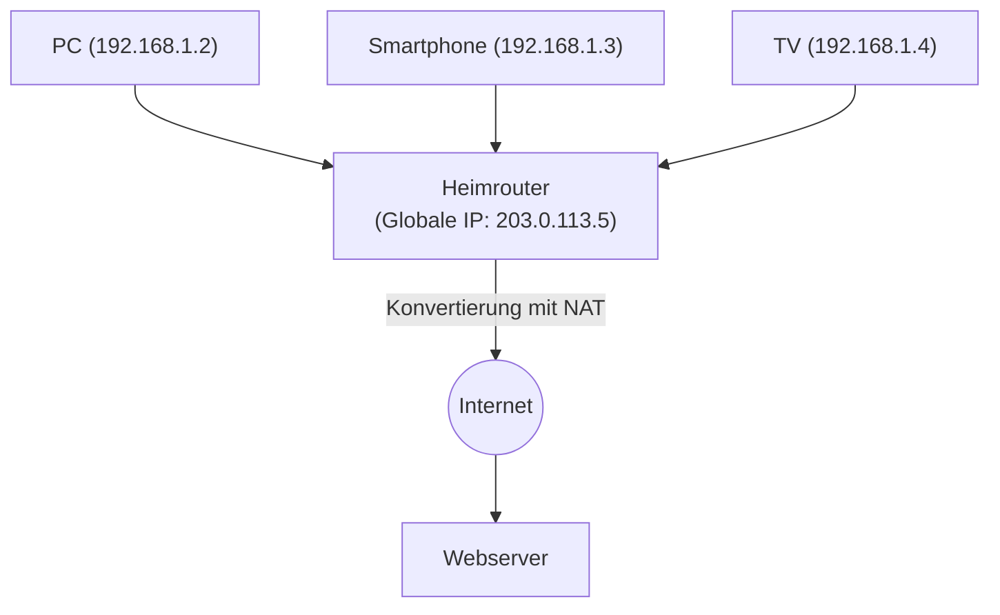

## 1. Die Rolle der "Adresse" im Internet

Dass Computer und Smartphones auf der ganzen Welt, die an das Internet angeschlossen sind, Daten ohne Fehler zueinander senden können, liegt daran, dass jedem Gerät eine weltweit eindeutige "Adresse" zugewiesen ist.
Diese Adresse im Netzwerk wird "**IP-Adresse (Internet Protocol Address)**" genannt.

Wenn wir auf den "Server von Google" zugreifen, sendet der Browser im unsichtbaren Hintergrund Datenpakete an eine Reihe von Zahlen (IP-Adresse) wie "142.250.196.110" als Ziel.
Dieses Adresssystem, das das Internet lange Zeit unterstützt hat, ist "**IPv4 (Internet Protocol version 4)**". Allerdings stößt dieses IPv4 derzeit an schwerwiegende systemische Grenzen, und ein riesiges Migrationsprojekt zur nächsten Generation, "**IPv6**", ist weltweit im Gange.

## 2. Die Entstehung von IPv4 und die "Grenze von 4,3 Milliarden"

IPv4 wurde 1981 in den Anfängen des Internets (RFC 791) standardisiert.
IPv4-Adressen werden mit einer Datenmenge von "**32-Bit**" dargestellt. 32-Bit bedeutet, dass es "32 Stellen mit Kombinationen von 0 und 1" gibt. Bei der Berechnung ergibt dies $2^{32} = 4,294,967,296$, womit sich etwa **4,3 Milliarden** Adressen erstellen lassen.

Damals war das Internet ein kleines Netzwerk, das nur von einigen Universitäten, militärischen Einrichtungen und großen Unternehmen genutzt wurde. Die Designer dachten: "Da es selbst bei der gesamten Menschheit auf der Erde nur wenige Milliarden Menschen gibt, werden 4,3 Milliarden Adressen in alle Ewigkeit nicht aufgebraucht sein."

Mit der explosionsartigen Verbreitung des World Wide Web in den 1990er Jahren, dem Aufkommen von Smartphones in den 2000er Jahren und dem Beginn des aktuellen IoT (Internet of Things: ein Zeitalter, in dem sogar Haushaltsgeräte und Autos mit dem Internet verbunden sind) wurde diese Kalkulation jedoch völlig zunichte gemacht.
Da eine einzelne Person nun mehrere IP-Adressen für PCs, Smartphones, Tablets und Smartwatches verbrauchte, waren die 4,3 Milliarden Adressen im Handumdrehen aufgebraucht.

Im Februar 2011 gab die IANA (Internet Assigned Numbers Authority), die zentrale Organisation zur Verwaltung weltweiter IP-Adressen, die letzten zentralen Bestände an IPv4-Adressen an die regionalen Organisationen weiter und erklärte schließlich die **vollständige Erschöpfung des zentralen Bestands**.

## 3. Lebenserhaltende Maßnahme: NAT und private IP-Adressen

Eigentlich hätte im Moment der Erschöpfung Panik im Internet ausbrechen müssen, aber dass wir das Internet heute immer noch normal nutzen können, ist einer lebensverlängernden Technologie namens "**NAT (Network Address Translation)**" zu verdanken.

NAT ist eine Technologie, bei der eine weltweit eindeutige "globale IP-Adresse" dem Router jedes Haushalts oder Unternehmens zugewiesen wird und innerhalb des Routers (im Haus) eine "private IP-Adresse (z. B. 192.168.1.x)" verwendet wird, die eine "eigene, nur intern funktionierende Adresse" darstellt.

Der Router sendet alle Anfragen von Geräten im Haus stellvertretend als "Anfragen von sich selbst (dem Router)" an das Internet und verteilt die zurückgegebenen Antworten korrekt an jedes Gerät im Haus weiter.
Durch diesen Mechanismus wurde es möglich, Dutzende von Geräten mit einer einzigen globalen IP-Adresse an das Internet anzuschließen, was die Krise der IPv4-Erschöpfung drastisch hinauszögerte. Dies ist jedoch keine grundlegende Lösung und führte zu Nachteilen wie Verzögerungen bei der Verarbeitung durch NAT und Schwierigkeiten bei der P2P-Kommunikation (wie z. B. direkter Kommunikation bei Online-Spielen).

## 4. Die ultimative Lösung: Das Aufkommen von "IPv6"

Das Protokoll der nächsten Generation, das entwickelt wurde, um dieses grundlegende Erschöpfungsproblem zu lösen, ist "**IPv6 (Internet Protocol version 6)**".

Das wichtigste Merkmal von IPv6 ist die überwältigende Weite seines Adressraums.
Im Gegensatz zu den "32-Bit" von IPv4 verfügt IPv6 über einen "**128-Bit**" Adressraum.
Bei der Berechnung ergibt dies $2^{128}$, was die Ausgabe einer unvorstellbaren Anzahl von etwa "**340 Sextillionen**" (340 mal eine Billion mal eine Billion) Adressen ermöglicht.

Das ist eine astronomische Zahl, von der man sagt: "Selbst wenn man jedem Sandkorn auf der Erde eine IP-Adresse zuweisen würde, gäbe es immer noch einen Überschuss."
Die Schreibweise hat sich von einer Dezimalzahl wie `192.168.1.1` bei IPv4 zu einer Hexadezimalzahl mit durch Doppelpunkte getrennten Blöcken wie `2001:0db8:85a3:0000:0000:8a2e:0370:7334` geändert.

### Vorteile, die IPv6 mit sich bringt
1. **NAT wird überflüssig**
   Da es eine nahezu unendliche Anzahl von Adressen gibt, kann sogar jeder einzelnen Glühbirne im Haus direkt eine weltweit eindeutige globale IP-Adresse zugewiesen werden. Komplexe Adressübersetzungen (NAT) im Router sind nicht mehr nötig und Geräte können direkt und mit hoher Geschwindigkeit miteinander kommunizieren.
2. **Standardisierung der Sicherheit (IPsec)**
   Eine Sicherheitsfunktion namens IPsec, die Kommunikation verschlüsselt und Manipulationen erkennt, ist standardmäßig integriert, was die Sicherheit auf der Netzwerkschichtebene verbessert.
3. **Effizienteres Routing**
   Da die Struktur der Adressen hierarchisch organisiert ist, wird die Verarbeitung der Routenauswahl (Routing), wenn Router im Internet Pakete weiterleiten, vereinfacht und Kommunikationsverzögerungen werden reduziert.

## 5. Die Verbreitung von IPv6 in Japan und "IPoE"

Technisch gesehen ist IPv6 perfekt, aber seine Verbreitung brauchte Zeit. Das größte Hindernis ist die Tatsache, dass "**IPv4 und IPv6 nicht kompatibel sind (sie können nicht direkt miteinander kommunizieren)**". Von einem PC, der IPv6 unterstützt, kann man keine Websites aufrufen, die nur IPv4 unterstützen. Aus diesem Grund wurden Telekommunikationsunternehmen und Provider gezwungen, enorme Kosten für den parallelen Betrieb beider Netzwerke (Dual-Stack) aufzuwenden.

In den letzten Jahren hat sich IPv6 jedoch in Japan aus einem ganz eigenen Grund weltweit mit am schnellsten verbreitet. Das ist die Beschleunigung der Kommunikation durch die "**IPoE (IPv6 IPoE) Methode**".

Die herkömmliche Internetverbindung in Japan (PPPoE-Methode) hatte das Problem, dass nachts an den "Netzwerkabschlussgeräten" der Provider schwere Überlastungen auftraten, wodurch die Kommunikationsgeschwindigkeit extrem abfiel.
Mit der Nutzung der neuen Verbindungsmethode "IPoE" wurde es jedoch möglich, diesen großen Staupunkt zu umgehen und direkt das breitere und weniger ausgelastete Netzwerk der nächsten Generation zu nutzen. Da die Voraussetzung für die Nutzung dieser "IPoE-Methode" die "IPv6-Kommunikation" war, entstand eine Bewegung, bei der viele Nutzer "IPv6-kompatible Router einführten, um das Internet schneller zu machen", was dazu führte, dass die Verbreitungsrate von IPv6 in Japan an die Weltspitze kletterte.

## 6. Fazit: Die stille große Infrastruktur-Migration

Ein Versions-Upgrade des IP-Protokolls, dem Fundament des Internets, ist so, als würde man den Motor eines Autos ersetzen, während es mit hoher Geschwindigkeit fährt, und ein extrem schwieriges Projekt.
Dank der langjährigen Bemühungen von globalen IT-Unternehmen wie Google und Netflix, Telekommunikationsanbietern und Router-Herstellern steigt die Verbreitungsrate von IPv6 jedoch stetig an, und mittlerweile fließt ein Großteil des weltweiten Datenverkehrs bereits über IPv6.

Das Internet, das die systemische Krise der Erschöpfung von 4,3 Milliarden Adressen überwunden und einen unendlichen Raum von 340 Sextillionen Adressen erlangt hat, ist nun bereit, sich als Grundlage für das zukünftige IoT-Zeitalter, Smart Cities und autonomes Fahren, bei dem alle möglichen Dinge mit dem Internet verbunden sein werden, weiterzuentwickeln.
