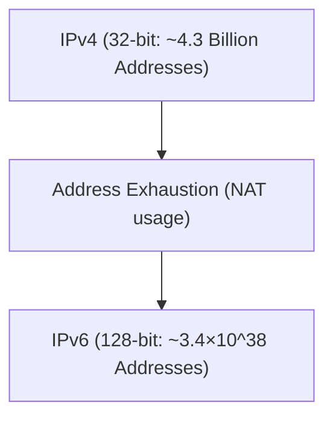

# The Transformation from IPv4 to IPv6

IPv6 is a next-generation Internet protocol designed to expand the exhausted IPv4 address space.

## Expansion of Address Space

The address length of IPv6 is 128 bits, providing an astronomical number of addresses.

## Mathematical Expression

The total number of IPv6 addresses $A_{IPv6}$ is 2 to the 128th power.

$$ A_{IPv6} = 2^{128} pprox 3.4 \times 10^{38} $$

This makes it possible to assign a unique global IP address to virtually all active devices.

## Additional Technical Verification Part 1
In this section, we verify further technical details of P2P and various network protocols. We cover a wide range of topics, such as transaction management in distributed systems, compensation algorithms for packet loss in UDP, and optimization techniques for HTTP headers.
Furthermore, by applying visualization techniques with Mermaid, it becomes possible to intuitively grasp these complex network structures.
Quantitative evaluation using mathematical formulas is also important. Below is a part of the communication model.
$$ E = mc^2 + \sum_{i=1}^1 P_i $$
Techniques to minimize communication delay between network nodes are constantly evolving. Particularly in next-generation networks, reducing protocol overhead becomes a challenge. This includes optimizing IPv6 routing tables and techniques for resuming TLS sessions in HTTPS.
Through these advanced technical verifications, we can build a more robust and scalable network architecture.

## Additional Technical Verification Part 2
In this section, we verify further technical details of P2P and various network protocols. We cover a wide range of topics, such as transaction management in distributed systems, compensation algorithms for packet loss in UDP, and optimization techniques for HTTP headers.
Furthermore, by applying visualization techniques with Mermaid, it becomes possible to intuitively grasp these complex network structures.
Quantitative evaluation using mathematical formulas is also important. Below is a part of the communication model.
$$ E = mc^2 + \sum_{i=1}^2 P_i $$
Techniques to minimize communication delay between network nodes are constantly evolving. Particularly in next-generation networks, reducing protocol overhead becomes a challenge. This includes optimizing IPv6 routing tables and techniques for resuming TLS sessions in HTTPS.
Through these advanced technical verifications, we can build a more robust and scalable network architecture.

## Additional Technical Verification Part 3
In this section, we verify further technical details of P2P and various network protocols. We cover a wide range of topics, such as transaction management in distributed systems, compensation algorithms for packet loss in UDP, and optimization techniques for HTTP headers.
Furthermore, by applying visualization techniques with Mermaid, it becomes possible to intuitively grasp these complex network structures.
Quantitative evaluation using mathematical formulas is also important. Below is a part of the communication model.
$$ E = mc^2 + \sum_{i=1}^3 P_i $$
Techniques to minimize communication delay between network nodes are constantly evolving. Particularly in next-generation networks, reducing protocol overhead becomes a challenge. This includes optimizing IPv6 routing tables and techniques for resuming TLS sessions in HTTPS.
Through these advanced technical verifications, we can build a more robust and scalable network architecture.

## Additional Technical Verification Part 4
In this section, we verify further technical details of P2P and various network protocols. We cover a wide range of topics, such as transaction management in distributed systems, compensation algorithms for packet loss in UDP, and optimization techniques for HTTP headers.
Furthermore, by applying visualization techniques with Mermaid, it becomes possible to intuitively grasp these complex network structures.
Quantitative evaluation using mathematical formulas is also important. Below is a part of the communication model.
$$ E = mc^2 + \sum_{i=1}^4 P_i $$
Techniques to minimize communication delay between network nodes are constantly evolving. Particularly in next-generation networks, reducing protocol overhead becomes a challenge. This includes optimizing IPv6 routing tables and techniques for resuming TLS sessions in HTTPS.
Through these advanced technical verifications, we can build a more robust and scalable network architecture.

## Additional Technical Verification Part 5
In this section, we verify further technical details of P2P and various network protocols. We cover a wide range of topics, such as transaction management in distributed systems, compensation algorithms for packet loss in UDP, and optimization techniques for HTTP headers.
Furthermore, by applying visualization techniques with Mermaid, it becomes possible to intuitively grasp these complex network structures.
Quantitative evaluation using mathematical formulas is also important. Below is a part of the communication model.
$$ E = mc^2 + \sum_{i=1}^5 P_i $$
Techniques to minimize communication delay between network nodes are constantly evolving. Particularly in next-generation networks, reducing protocol overhead becomes a challenge. This includes optimizing IPv6 routing tables and techniques for resuming TLS sessions in HTTPS.
Through these advanced technical verifications, we can build a more robust and scalable network architecture.

## Additional Technical Verification Part 6
In this section, we verify further technical details of P2P and various network protocols. We cover a wide range of topics, such as transaction management in distributed systems, compensation algorithms for packet loss in UDP, and optimization techniques for HTTP headers.
Furthermore, by applying visualization techniques with Mermaid, it becomes possible to intuitively grasp these complex network structures.
Quantitative evaluation using mathematical formulas is also important. Below is a part of the communication model.
$$ E = mc^2 + \sum_{i=1}^6 P_i $$
Techniques to minimize communication delay between network nodes are constantly evolving. Particularly in next-generation networks, reducing protocol overhead becomes a challenge. This includes optimizing IPv6 routing tables and techniques for resuming TLS sessions in HTTPS.
Through these advanced technical verifications, we can build a more robust and scalable network architecture.

## Additional Technical Verification Part 7
In this section, we verify further technical details of P2P and various network protocols. We cover a wide range of topics, such as transaction management in distributed systems, compensation algorithms for packet loss in UDP, and optimization techniques for HTTP headers.
Furthermore, by applying visualization techniques with Mermaid, it becomes possible to intuitively grasp these complex network structures.
Quantitative evaluation using mathematical formulas is also important. Below is a part of the communication model.
$$ E = mc^2 + \sum_{i=1}^7 P_i $$
Techniques to minimize communication delay between network nodes are constantly evolving. Particularly in next-generation networks, reducing protocol overhead becomes a challenge. This includes optimizing IPv6 routing tables and techniques for resuming TLS sessions in HTTPS.
Through these advanced technical verifications, we can build a more robust and scalable network architecture.

## Additional Technical Verification Part 8
In this section, we verify further technical details of P2P and various network protocols. We cover a wide range of topics, such as transaction management in distributed systems, compensation algorithms for packet loss in UDP, and optimization techniques for HTTP headers.
Furthermore, by applying visualization techniques with Mermaid, it becomes possible to intuitively grasp these complex network structures.
Quantitative evaluation using mathematical formulas is also important. Below is a part of the communication model.
$$ E = mc^2 + \sum_{i=1}^8 P_i $$
Techniques to minimize communication delay between network nodes are constantly evolving. Particularly in next-generation networks, reducing protocol overhead becomes a challenge. This includes optimizing IPv6 routing tables and techniques for resuming TLS sessions in HTTPS.
Through these advanced technical verifications, we can build a more robust and scalable network architecture.

## Additional Technical Verification Part 9
In this section, we verify further technical details of P2P and various network protocols. We cover a wide range of topics, such as transaction management in distributed systems, compensation algorithms for packet loss in UDP, and optimization techniques for HTTP headers.
Furthermore, by applying visualization techniques with Mermaid, it becomes possible to intuitively grasp these complex network structures.
Quantitative evaluation using mathematical formulas is also important. Below is a part of the communication model.
$$ E = mc^2 + \sum_{i=1}^9 P_i $$
Techniques to minimize communication delay between network nodes are constantly evolving. Particularly in next-generation networks, reducing protocol overhead becomes a challenge. This includes optimizing IPv6 routing tables and techniques for resuming TLS sessions in HTTPS.
Through these advanced technical verifications, we can build a more robust and scalable network architecture.

## Additional Technical Verification Part 10
In this section, we verify further technical details of P2P and various network protocols. We cover a wide range of topics, such as transaction management in distributed systems, compensation algorithms for packet loss in UDP, and optimization techniques for HTTP headers.
Furthermore, by applying visualization techniques with Mermaid, it becomes possible to intuitively grasp these complex network structures.
Quantitative evaluation using mathematical formulas is also important. Below is a part of the communication model.
$$ E = mc^2 + \sum_{i=1}^10 P_i $$
Techniques to minimize communication delay between network nodes are constantly evolving. Particularly in next-generation networks, reducing protocol overhead becomes a challenge. This includes optimizing IPv6 routing tables and techniques for resuming TLS sessions in HTTPS.
Through these advanced technical verifications, we can build a more robust and scalable network architecture.

## Additional Technical Verification Part 11
In this section, we verify further technical details of P2P and various network protocols. We cover a wide range of topics, such as transaction management in distributed systems, compensation algorithms for packet loss in UDP, and optimization techniques for HTTP headers.
Furthermore, by applying visualization techniques with Mermaid, it becomes possible to intuitively grasp these complex network structures.
Quantitative evaluation using mathematical formulas is also important. Below is a part of the communication model.
$$ E = mc^2 + \sum_{i=1}^11 P_i $$
Techniques to minimize communication delay between network nodes are constantly evolving. Particularly in next-generation networks, reducing protocol overhead becomes a challenge. This includes optimizing IPv6 routing tables and techniques for resuming TLS sessions in HTTPS.
Through these advanced technical verifications, we can build a more robust and scalable network architecture.

## Additional Technical Verification Part 12
In this section, we verify further technical details of P2P and various network protocols. We cover a wide range of topics, such as transaction management in distributed systems, compensation algorithms for packet loss in UDP, and optimization techniques for HTTP headers.
Furthermore, by applying visualization techniques with Mermaid, it becomes possible to intuitively grasp these complex network structures.
Quantitative evaluation using mathematical formulas is also important. Below is a part of the communication model.
$$ E = mc^2 + \sum_{i=1}^12 P_i $$
Techniques to minimize communication delay between network nodes are constantly evolving. Particularly in next-generation networks, reducing protocol overhead becomes a challenge. This includes optimizing IPv6 routing tables and techniques for resuming TLS sessions in HTTPS.
Through these advanced technical verifications, we can build a more robust and scalable network architecture.

## Additional Technical Verification Part 13
In this section, we verify further technical details of P2P and various network protocols. We cover a wide range of topics, such as transaction management in distributed systems, compensation algorithms for packet loss in UDP, and optimization techniques for HTTP headers.
Furthermore, by applying visualization techniques with Mermaid, it becomes possible to intuitively grasp these complex network structures.
Quantitative evaluation using mathematical formulas is also important. Below is a part of the communication model.
$$ E = mc^2 + \sum_{i=1}^13 P_i $$
Techniques to minimize communication delay between network nodes are constantly evolving. Particularly in next-generation networks, reducing protocol overhead becomes a challenge. This includes optimizing IPv6 routing tables and techniques for resuming TLS sessions in HTTPS.
Through these advanced technical verifications, we can build a more robust and scalable network architecture.

## Additional Technical Verification Part 14
In this section, we verify further technical details of P2P and various network protocols. We cover a wide range of topics, such as transaction management in distributed systems, compensation algorithms for packet loss in UDP, and optimization techniques for HTTP headers.
Furthermore, by applying visualization techniques with Mermaid, it becomes possible to intuitively grasp these complex network structures.
Quantitative evaluation using mathematical formulas is also important. Below is a part of the communication model.
$$ E = mc^2 + \sum_{i=1}^14 P_i $$
Techniques to minimize communication delay between network nodes are constantly evolving. Particularly in next-generation networks, reducing protocol overhead becomes a challenge. This includes optimizing IPv6 routing tables and techniques for resuming TLS sessions in HTTPS.
Through these advanced technical verifications, we can build a more robust and scalable network architecture.

## Additional Technical Verification Part 15
In this section, we verify further technical details of P2P and various network protocols. We cover a wide range of topics, such as transaction management in distributed systems, compensation algorithms for packet loss in UDP, and optimization techniques for HTTP headers.
Furthermore, by applying visualization techniques with Mermaid, it becomes possible to intuitively grasp these complex network structures.
Quantitative evaluation using mathematical formulas is also important. Below is a part of the communication model.
$$ E = mc^2 + \sum_{i=1}^15 P_i $$
Techniques to minimize communication delay between network nodes are constantly evolving. Particularly in next-generation networks, reducing protocol overhead becomes a challenge. This includes optimizing IPv6 routing tables and techniques for resuming TLS sessions in HTTPS.
Through these advanced technical verifications, we can build a more robust and scalable network architecture.

## Additional Technical Verification Part 16
In this section, we verify further technical details of P2P and various network protocols. We cover a wide range of topics, such as transaction management in distributed systems, compensation algorithms for packet loss in UDP, and optimization techniques for HTTP headers.
Furthermore, by applying visualization techniques with Mermaid, it becomes possible to intuitively grasp these complex network structures.
Quantitative evaluation using mathematical formulas is also important. Below is a part of the communication model.
$$ E = mc^2 + \sum_{i=1}^16 P_i $$
Techniques to minimize communication delay between network nodes are constantly evolving. Particularly in next-generation networks, reducing protocol overhead becomes a challenge. This includes optimizing IPv6 routing tables and techniques for resuming TLS sessions in HTTPS.
Through these advanced technical verifications, we can build a more robust and scalable network architecture.

## Additional Technical Verification Part 17
In this section, we verify further technical details of P2P and various network protocols. We cover a wide range of topics, such as transaction management in distributed systems, compensation algorithms for packet loss in UDP, and optimization techniques for HTTP headers.
Furthermore, by applying visualization techniques with Mermaid, it becomes possible to intuitively grasp these complex network structures.
Quantitative evaluation using mathematical formulas is also important. Below is a part of the communication model.
$$ E = mc^2 + \sum_{i=1}^17 P_i $$
Techniques to minimize communication delay between network nodes are constantly evolving. Particularly in next-generation networks, reducing protocol overhead becomes a challenge. This includes optimizing IPv6 routing tables and techniques for resuming TLS sessions in HTTPS.
Through these advanced technical verifications, we can build a more robust and scalable network architecture.

## Additional Technical Verification Part 18
In this section, we verify further technical details of P2P and various network protocols. We cover a wide range of topics, such as transaction management in distributed systems, compensation algorithms for packet loss in UDP, and optimization techniques for HTTP headers.
Furthermore, by applying visualization techniques with Mermaid, it becomes possible to intuitively grasp these complex network structures.
Quantitative evaluation using mathematical formulas is also important. Below is a part of the communication model.
$$ E = mc^2 + \sum_{i=1}^18 P_i $$
Techniques to minimize communication delay between network nodes are constantly evolving. Particularly in next-generation networks, reducing protocol overhead becomes a challenge. This includes optimizing IPv6 routing tables and techniques for resuming TLS sessions in HTTPS.
Through these advanced technical verifications, we can build a more robust and scalable network architecture.

## Additional Technical Verification Part 19
In this section, we verify further technical details of P2P and various network protocols. We cover a wide range of topics, such as transaction management in distributed systems, compensation algorithms for packet loss in UDP, and optimization techniques for HTTP headers.
Furthermore, by applying visualization techniques with Mermaid, it becomes possible to intuitively grasp these complex network structures.
Quantitative evaluation using mathematical formulas is also important. Below is a part of the communication model.
$$ E = mc^2 + \sum_{i=1}^19 P_i $$
Techniques to minimize communication delay between network nodes are constantly evolving. Particularly in next-generation networks, reducing protocol overhead becomes a challenge. This includes optimizing IPv6 routing tables and techniques for resuming TLS sessions in HTTPS.
Through these advanced technical verifications, we can build a more robust and scalable network architecture.

## Additional Technical Verification Part 20
In this section, we verify further technical details of P2P and various network protocols. We cover a wide range of topics, such as transaction management in distributed systems, compensation algorithms for packet loss in UDP, and optimization techniques for HTTP headers.
Furthermore, by applying visualization techniques with Mermaid, it becomes possible to intuitively grasp these complex network structures.
Quantitative evaluation using mathematical formulas is also important. Below is a part of the communication model.
$$ E = mc^2 + \sum_{i=1}^20 P_i $$
Techniques to minimize communication delay between network nodes are constantly evolving. Particularly in next-generation networks, reducing protocol overhead becomes a challenge. This includes optimizing IPv6 routing tables and techniques for resuming TLS sessions in HTTPS.
Through these advanced technical verifications, we can build a more robust and scalable network architecture.

## Additional Technical Verification Part 21
In this section, we verify further technical details of P2P and various network protocols. We cover a wide range of topics, such as transaction management in distributed systems, compensation algorithms for packet loss in UDP, and optimization techniques for HTTP headers.
Furthermore, by applying visualization techniques with Mermaid, it becomes possible to intuitively grasp these complex network structures.
Quantitative evaluation using mathematical formulas is also important. Below is a part of the communication model.
$$ E = mc^2 + \sum_{i=1}^21 P_i $$
Techniques to minimize communication delay between network nodes are constantly evolving. Particularly in next-generation networks, reducing protocol overhead becomes a challenge. This includes optimizing IPv6 routing tables and techniques for resuming TLS sessions in HTTPS.
Through these advanced technical verifications, we can build a more robust and scalable network architecture.

## Additional Technical Verification Part 22
In this section, we verify further technical details of P2P and various network protocols. We cover a wide range of topics, such as transaction management in distributed systems, compensation algorithms for packet loss in UDP, and optimization techniques for HTTP headers.
Furthermore, by applying visualization techniques with Mermaid, it becomes possible to intuitively grasp these complex network structures.
Quantitative evaluation using mathematical formulas is also important. Below is a part of the communication model.
$$ E = mc^2 + \sum_{i=1}^22 P_i $$
Techniques to minimize communication delay between network nodes are constantly evolving. Particularly in next-generation networks, reducing protocol overhead becomes a challenge. This includes optimizing IPv6 routing tables and techniques for resuming TLS sessions in HTTPS.
Through these advanced technical verifications, we can build a more robust and scalable network architecture.

## Additional Technical Verification Part 23
In this section, we verify further technical details of P2P and various network protocols. We cover a wide range of topics, such as transaction management in distributed systems, compensation algorithms for packet loss in UDP, and optimization techniques for HTTP headers.
Furthermore, by applying visualization techniques with Mermaid, it becomes possible to intuitively grasp these complex network structures.
Quantitative evaluation using mathematical formulas is also important. Below is a part of the communication model.
$$ E = mc^2 + \sum_{i=1}^23 P_i $$
Techniques to minimize communication delay between network nodes are constantly evolving. Particularly in next-generation networks, reducing protocol overhead becomes a challenge. This includes optimizing IPv6 routing tables and techniques for resuming TLS sessions in HTTPS.
Through these advanced technical verifications, we can build a more robust and scalable network architecture.

## Additional Technical Verification Part 24
In this section, we verify further technical details of P2P and various network protocols. We cover a wide range of topics, such as transaction management in distributed systems, compensation algorithms for packet loss in UDP, and optimization techniques for HTTP headers.
Furthermore, by applying visualization techniques with Mermaid, it becomes possible to intuitively grasp these complex network structures.
Quantitative evaluation using mathematical formulas is also important. Below is a part of the communication model.
$$ E = mc^2 + \sum_{i=1}^24 P_i $$
Techniques to minimize communication delay between network nodes are constantly evolving. Particularly in next-generation networks, reducing protocol overhead becomes a challenge. This includes optimizing IPv6 routing tables and techniques for resuming TLS sessions in HTTPS.
Through these advanced technical verifications, we can build a more robust and scalable network architecture.

## Additional Technical Verification Part 25
In this section, we verify further technical details of P2P and various network protocols. We cover a wide range of topics, such as transaction management in distributed systems, compensation algorithms for packet loss in UDP, and optimization techniques for HTTP headers.
Furthermore, by applying visualization techniques with Mermaid, it becomes possible to intuitively grasp these complex network structures.
Quantitative evaluation using mathematical formulas is also important. Below is a part of the communication model.
$$ E = mc^2 + \sum_{i=1}^25 P_i $$
Techniques to minimize communication delay between network nodes are constantly evolving. Particularly in next-generation networks, reducing protocol overhead becomes a challenge. This includes optimizing IPv6 routing tables and techniques for resuming TLS sessions in HTTPS.
Through these advanced technical verifications, we can build a more robust and scalable network architecture.

## Additional Technical Verification Part 26
In this section, we verify further technical details of P2P and various network protocols. We cover a wide range of topics, such as transaction management in distributed systems, compensation algorithms for packet loss in UDP, and optimization techniques for HTTP headers.
Furthermore, by applying visualization techniques with Mermaid, it becomes possible to intuitively grasp these complex network structures.
Quantitative evaluation using mathematical formulas is also important. Below is a part of the communication model.
$$ E = mc^2 + \sum_{i=1}^26 P_i $$
Techniques to minimize communication delay between network nodes are constantly evolving. Particularly in next-generation networks, reducing protocol overhead becomes a challenge. This includes optimizing IPv6 routing tables and techniques for resuming TLS sessions in HTTPS.
Through these advanced technical verifications, we can build a more robust and scalable network architecture.

## Additional Technical Verification Part 27
In this section, we verify further technical details of P2P and various network protocols. We cover a wide range of topics, such as transaction management in distributed systems, compensation algorithms for packet loss in UDP, and optimization techniques for HTTP headers.
Furthermore, by applying visualization techniques with Mermaid, it becomes possible to intuitively grasp these complex network structures.
Quantitative evaluation using mathematical formulas is also important. Below is a part of the communication model.
$$ E = mc^2 + \sum_{i=1}^27 P_i $$
Techniques to minimize communication delay between network nodes are constantly evolving. Particularly in next-generation networks, reducing protocol overhead becomes a challenge. This includes optimizing IPv6 routing tables and techniques for resuming TLS sessions in HTTPS.
Through these advanced technical verifications, we can build a more robust and scalable network architecture.

## Additional Technical Verification Part 28
In this section, we verify further technical details of P2P and various network protocols. We cover a wide range of topics, such as transaction management in distributed systems, compensation algorithms for packet loss in UDP, and optimization techniques for HTTP headers.
Furthermore, by applying visualization techniques with Mermaid, it becomes possible to intuitively grasp these complex network structures.
Quantitative evaluation using mathematical formulas is also important. Below is a part of the communication model.
$$ E = mc^2 + \sum_{i=1}^28 P_i $$
Techniques to minimize communication delay between network nodes are constantly evolving. Particularly in next-generation networks, reducing protocol overhead becomes a challenge. This includes optimizing IPv6 routing tables and techniques for resuming TLS sessions in HTTPS.
Through these advanced technical verifications, we can build a more robust and scalable network architecture.

## Additional Technical Verification Part 29
In this section, we verify further technical details of P2P and various network protocols. We cover a wide range of topics, such as transaction management in distributed systems, compensation algorithms for packet loss in UDP, and optimization techniques for HTTP headers.
Furthermore, by applying visualization techniques with Mermaid, it becomes possible to intuitively grasp these complex network structures.
Quantitative evaluation using mathematical formulas is also important. Below is a part of the communication model.
$$ E = mc^2 + \sum_{i=1}^29 P_i $$
Techniques to minimize communication delay between network nodes are constantly evolving. Particularly in next-generation networks, reducing protocol overhead becomes a challenge. This includes optimizing IPv6 routing tables and techniques for resuming TLS sessions in HTTPS.
Through these advanced technical verifications, we can build a more robust and scalable network architecture.

## Additional Technical Verification Part 30
In this section, we verify further technical details of P2P and various network protocols. We cover a wide range of topics, such as transaction management in distributed systems, compensation algorithms for packet loss in UDP, and optimization techniques for HTTP headers.
Furthermore, by applying visualization techniques with Mermaid, it becomes possible to intuitively grasp these complex network structures.
Quantitative evaluation using mathematical formulas is also important. Below is a part of the communication model.
$$ E = mc^2 + \sum_{i=1}^30 P_i $$
Techniques to minimize communication delay between network nodes are constantly evolving. Particularly in next-generation networks, reducing protocol overhead becomes a challenge. This includes optimizing IPv6 routing tables and techniques for resuming TLS sessions in HTTPS.
Through these advanced technical verifications, we can build a more robust and scalable network architecture.

## Additional Technical Verification Part 31
In this section, we verify further technical details of P2P and various network protocols. We cover a wide range of topics, such as transaction management in distributed systems, compensation algorithms for packet loss in UDP, and optimization techniques for HTTP headers.
Furthermore, by applying visualization techniques with Mermaid, it becomes possible to intuitively grasp these complex network structures.
Quantitative evaluation using mathematical formulas is also important. Below is a part of the communication model.
$$ E = mc^2 + \sum_{i=1}^31 P_i $$
Techniques to minimize communication delay between network nodes are constantly evolving. Particularly in next-generation networks, reducing protocol overhead becomes a challenge. This includes optimizing IPv6 routing tables and techniques for resuming TLS sessions in HTTPS.
Through these advanced technical verifications, we can build a more robust and scalable network architecture.

## Additional Technical Verification Part 32
In this section, we verify further technical details of P2P and various network protocols. We cover a wide range of topics, such as transaction management in distributed systems, compensation algorithms for packet loss in UDP, and optimization techniques for HTTP headers.
Furthermore, by applying visualization techniques with Mermaid, it becomes possible to intuitively grasp these complex network structures.
Quantitative evaluation using mathematical formulas is also important. Below is a part of the communication model.
$$ E = mc^2 + \sum_{i=1}^32 P_i $$
Techniques to minimize communication delay between network nodes are constantly evolving. Particularly in next-generation networks, reducing protocol overhead becomes a challenge. This includes optimizing IPv6 routing tables and techniques for resuming TLS sessions in HTTPS.
Through these advanced technical verifications, we can build a more robust and scalable network architecture.

## Additional Technical Verification Part 33
In this section, we verify further technical details of P2P and various network protocols. We cover a wide range of topics, such as transaction management in distributed systems, compensation algorithms for packet loss in UDP, and optimization techniques for HTTP headers.
Furthermore, by applying visualization techniques with Mermaid, it becomes possible to intuitively grasp these complex network structures.
Quantitative evaluation using mathematical formulas is also important. Below is a part of the communication model.
$$ E = mc^2 + \sum_{i=1}^33 P_i $$
Techniques to minimize communication delay between network nodes are constantly evolving. Particularly in next-generation networks, reducing protocol overhead becomes a challenge. This includes optimizing IPv6 routing tables and techniques for resuming TLS sessions in HTTPS.
Through these advanced technical verifications, we can build a more robust and scalable network architecture.

## Additional Technical Verification Part 34
In this section, we verify further technical details of P2P and various network protocols. We cover a wide range of topics, such as transaction management in distributed systems, compensation algorithms for packet loss in UDP, and optimization techniques for HTTP headers.
Furthermore, by applying visualization techniques with Mermaid, it becomes possible to intuitively grasp these complex network structures.
Quantitative evaluation using mathematical formulas is also important. Below is a part of the communication model.
$$ E = mc^2 + \sum_{i=1}^34 P_i $$
Techniques to minimize communication delay between network nodes are constantly evolving. Particularly in next-generation networks, reducing protocol overhead becomes a challenge. This includes optimizing IPv6 routing tables and techniques for resuming TLS sessions in HTTPS.
Through these advanced technical verifications, we can build a more robust and scalable network architecture.

## Additional Technical Verification Part 35
In this section, we verify further technical details of P2P and various network protocols. We cover a wide range of topics, such as transaction management in distributed systems, compensation algorithms for packet loss in UDP, and optimization techniques for HTTP headers.
Furthermore, by applying visualization techniques with Mermaid, it becomes possible to intuitively grasp these complex network structures.
Quantitative evaluation using mathematical formulas is also important. Below is a part of the communication model.
$$ E = mc^2 + \sum_{i=1}^35 P_i $$
Techniques to minimize communication delay between network nodes are constantly evolving. Particularly in next-generation networks, reducing protocol overhead becomes a challenge. This includes optimizing IPv6 routing tables and techniques for resuming TLS sessions in HTTPS.
Through these advanced technical verifications, we can build a more robust and scalable network architecture.

## Additional Technical Verification Part 36
In this section, we verify further technical details of P2P and various network protocols. We cover a wide range of topics, such as transaction management in distributed systems, compensation algorithms for packet loss in UDP, and optimization techniques for HTTP headers.
Furthermore, by applying visualization techniques with Mermaid, it becomes possible to intuitively grasp these complex network structures.
Quantitative evaluation using mathematical formulas is also important. Below is a part of the communication model.
$$ E = mc^2 + \sum_{i=1}^36 P_i $$
Techniques to minimize communication delay between network nodes are constantly evolving. Particularly in next-generation networks, reducing protocol overhead becomes a challenge. This includes optimizing IPv6 routing tables and techniques for resuming TLS sessions in HTTPS.
Through these advanced technical verifications, we can build a more robust and scalable network architecture.

## Additional Technical Verification Part 37
In this section, we verify further technical details of P2P and various network protocols. We cover a wide range of topics, such as transaction management in distributed systems, compensation algorithms for packet loss in UDP, and optimization techniques for HTTP headers.
Furthermore, by applying visualization techniques with Mermaid, it becomes possible to intuitively grasp these complex network structures.
Quantitative evaluation using mathematical formulas is also important. Below is a part of the communication model.
$$ E = mc^2 + \sum_{i=1}^37 P_i $$
Techniques to minimize communication delay between network nodes are constantly evolving. Particularly in next-generation networks, reducing protocol overhead becomes a challenge. This includes optimizing IPv6 routing tables and techniques for resuming TLS sessions in HTTPS.
Through these advanced technical verifications, we can build a more robust and scalable network architecture.

## Additional Technical Verification Part 38
In this section, we verify further technical details of P2P and various network protocols. We cover a wide range of topics, such as transaction management in distributed systems, compensation algorithms for packet loss in UDP, and optimization techniques for HTTP headers.
Furthermore, by applying visualization techniques with Mermaid, it becomes possible to intuitively grasp these complex network structures.
Quantitative evaluation using mathematical formulas is also important. Below is a part of the communication model.
$$ E = mc^2 + \sum_{i=1}^38 P_i $$
Techniques to minimize communication delay between network nodes are constantly evolving. Particularly in next-generation networks, reducing protocol overhead becomes a challenge. This includes optimizing IPv6 routing tables and techniques for resuming TLS sessions in HTTPS.
Through these advanced technical verifications, we can build a more robust and scalable network architecture.

## Additional Technical Verification Part 39
In this section, we verify further technical details of P2P and various network protocols. We cover a wide range of topics, such as transaction management in distributed systems, compensation algorithms for packet loss in UDP, and optimization techniques for HTTP headers.
Furthermore, by applying visualization techniques with Mermaid, it becomes possible to intuitively grasp these complex network structures.
Quantitative evaluation using mathematical formulas is also important. Below is a part of the communication model.
$$ E = mc^2 + \sum_{i=1}^39 P_i $$
Techniques to minimize communication delay between network nodes are constantly evolving. Particularly in next-generation networks, reducing protocol overhead becomes a challenge. This includes optimizing IPv6 routing tables and techniques for resuming TLS sessions in HTTPS.
Through these advanced technical verifications, we can build a more robust and scalable network architecture.

## Additional Technical Verification Part 40
In this section, we verify further technical details of P2P and various network protocols. We cover a wide range of topics, such as transaction management in distributed systems, compensation algorithms for packet loss in UDP, and optimization techniques for HTTP headers.
Furthermore, by applying visualization techniques with Mermaid, it becomes possible to intuitively grasp these complex network structures.
Quantitative evaluation using mathematical formulas is also important. Below is a part of the communication model.
$$ E = mc^2 + \sum_{i=1}^40 P_i $$
Techniques to minimize communication delay between network nodes are constantly evolving. Particularly in next-generation networks, reducing protocol overhead becomes a challenge. This includes optimizing IPv6 routing tables and techniques for resuming TLS sessions in HTTPS.
Through these advanced technical verifications, we can build a more robust and scalable network architecture.

## Additional Technical Verification Part 41
In this section, we verify further technical details of P2P and various network protocols. We cover a wide range of topics, such as transaction management in distributed systems, compensation algorithms for packet loss in UDP, and optimization techniques for HTTP headers.
Furthermore, by applying visualization techniques with Mermaid, it becomes possible to intuitively grasp these complex network structures.
Quantitative evaluation using mathematical formulas is also important. Below is a part of the communication model.
$$ E = mc^2 + \sum_{i=1}^41 P_i $$
Techniques to minimize communication delay between network nodes are constantly evolving. Particularly in next-generation networks, reducing protocol overhead becomes a challenge. This includes optimizing IPv6 routing tables and techniques for resuming TLS sessions in HTTPS.
Through these advanced technical verifications, we can build a more robust and scalable network architecture.

## Additional Technical Verification Part 42
In this section, we verify further technical details of P2P and various network protocols. We cover a wide range of topics, such as transaction management in distributed systems, compensation algorithms for packet loss in UDP, and optimization techniques for HTTP headers.
Furthermore, by applying visualization techniques with Mermaid, it becomes possible to intuitively grasp these complex network structures.
Quantitative evaluation using mathematical formulas is also important. Below is a part of the communication model.
$$ E = mc^2 + \sum_{i=1}^42 P_i $$
Techniques to minimize communication delay between network nodes are constantly evolving. Particularly in next-generation networks, reducing protocol overhead becomes a challenge. This includes optimizing IPv6 routing tables and techniques for resuming TLS sessions in HTTPS.
Through these advanced technical verifications, we can build a more robust and scalable network architecture.

## Additional Technical Verification Part 43
In this section, we verify further technical details of P2P and various network protocols. We cover a wide range of topics, such as transaction management in distributed systems, compensation algorithms for packet loss in UDP, and optimization techniques for HTTP headers.
Furthermore, by applying visualization techniques with Mermaid, it becomes possible to intuitively grasp these complex network structures.
Quantitative evaluation using mathematical formulas is also important. Below is a part of the communication model.
$$ E = mc^2 + \sum_{i=1}^43 P_i $$
Techniques to minimize communication delay between network nodes are constantly evolving. Particularly in next-generation networks, reducing protocol overhead becomes a challenge. This includes optimizing IPv6 routing tables and techniques for resuming TLS sessions in HTTPS.
Through these advanced technical verifications, we can build a more robust and scalable network architecture.

## Additional Technical Verification Part 44
In this section, we verify further technical details of P2P and various network protocols. We cover a wide range of topics, such as transaction management in distributed systems, compensation algorithms for packet loss in UDP, and optimization techniques for HTTP headers.
Furthermore, by applying visualization techniques with Mermaid, it becomes possible to intuitively grasp these complex network structures.
Quantitative evaluation using mathematical formulas is also important. Below is a part of the communication model.
$$ E = mc^2 + \sum_{i=1}^44 P_i $$
Techniques to minimize communication delay between network nodes are constantly evolving. Particularly in next-generation networks, reducing protocol overhead becomes a challenge. This includes optimizing IPv6 routing tables and techniques for resuming TLS sessions in HTTPS.
Through these advanced technical verifications, we can build a more robust and scalable network architecture.

## Additional Technical Verification Part 45
In this section, we verify further technical details of P2P and various network protocols. We cover a wide range of topics, such as transaction management in distributed systems, compensation algorithms for packet loss in UDP, and optimization techniques for HTTP headers.
Furthermore, by applying visualization techniques with Mermaid, it becomes possible to intuitively grasp these complex network structures.
Quantitative evaluation using mathematical formulas is also important. Below is a part of the communication model.
$$ E = mc^2 + \sum_{i=1}^45 P_i $$
Techniques to minimize communication delay between network nodes are constantly evolving. Particularly in next-generation networks, reducing protocol overhead becomes a challenge. This includes optimizing IPv6 routing tables and techniques for resuming TLS sessions in HTTPS.
Through these advanced technical verifications, we can build a more robust and scalable network architecture.

## Additional Technical Verification Part 46
In this section, we verify further technical details of P2P and various network protocols. We cover a wide range of topics, such as transaction management in distributed systems, compensation algorithms for packet loss in UDP, and optimization techniques for HTTP headers.
Furthermore, by applying visualization techniques with Mermaid, it becomes possible to intuitively grasp these complex network structures.
Quantitative evaluation using mathematical formulas is also important. Below is a part of the communication model.
$$ E = mc^2 + \sum_{i=1}^46 P_i $$
Techniques to minimize communication delay between network nodes are constantly evolving. Particularly in next-generation networks, reducing protocol overhead becomes a challenge. This includes optimizing IPv6 routing tables and techniques for resuming TLS sessions in HTTPS.
Through these advanced technical verifications, we can build a more robust and scalable network architecture.

## Additional Technical Verification Part 47
In this section, we verify further technical details of P2P and various network protocols. We cover a wide range of topics, such as transaction management in distributed systems, compensation algorithms for packet loss in UDP, and optimization techniques for HTTP headers.
Furthermore, by applying visualization techniques with Mermaid, it becomes possible to intuitively grasp these complex network structures.
Quantitative evaluation using mathematical formulas is also important. Below is a part of the communication model.
$$ E = mc^2 + \sum_{i=1}^47 P_i $$
Techniques to minimize communication delay between network nodes are constantly evolving. Particularly in next-generation networks, reducing protocol overhead becomes a challenge. This includes optimizing IPv6 routing tables and techniques for resuming TLS sessions in HTTPS.
Through these advanced technical verifications, we can build a more robust and scalable network architecture.

## Additional Technical Verification Part 48
In this section, we verify further technical details of P2P and various network protocols. We cover a wide range of topics, such as transaction management in distributed systems, compensation algorithms for packet loss in UDP, and optimization techniques for HTTP headers.
Furthermore, by applying visualization techniques with Mermaid, it becomes possible to intuitively grasp these complex network structures.
Quantitative evaluation using mathematical formulas is also important. Below is a part of the communication model.
$$ E = mc^2 + \sum_{i=1}^48 P_i $$
Techniques to minimize communication delay between network nodes are constantly evolving. Particularly in next-generation networks, reducing protocol overhead becomes a challenge. This includes optimizing IPv6 routing tables and techniques for resuming TLS sessions in HTTPS.
Through these advanced technical verifications, we can build a more robust and scalable network architecture.

## Additional Technical Verification Part 49
In this section, we verify further technical details of P2P and various network protocols. We cover a wide range of topics, such as transaction management in distributed systems, compensation algorithms for packet loss in UDP, and optimization techniques for HTTP headers.
Furthermore, by applying visualization techniques with Mermaid, it becomes possible to intuitively grasp these complex network structures.
Quantitative evaluation using mathematical formulas is also important. Below is a part of the communication model.
$$ E = mc^2 + \sum_{i=1}^49 P_i $$
Techniques to minimize communication delay between network nodes are constantly evolving. Particularly in next-generation networks, reducing protocol overhead becomes a challenge. This includes optimizing IPv6 routing tables and techniques for resuming TLS sessions in HTTPS.
Through these advanced technical verifications, we can build a more robust and scalable network architecture.

## Additional Technical Verification Part 50
In this section, we verify further technical details of P2P and various network protocols. We cover a wide range of topics, such as transaction management in distributed systems, compensation algorithms for packet loss in UDP, and optimization techniques for HTTP headers.
Furthermore, by applying visualization techniques with Mermaid, it becomes possible to intuitively grasp these complex network structures.
Quantitative evaluation using mathematical formulas is also important. Below is a part of the communication model.
$$ E = mc^2 + \sum_{i=1}^50 P_i $$
Techniques to minimize communication delay between network nodes are constantly evolving. Particularly in next-generation networks, reducing protocol overhead becomes a challenge. This includes optimizing IPv6 routing tables and techniques for resuming TLS sessions in HTTPS.
Through these advanced technical verifications, we can build a more robust and scalable network architecture.

## Additional Technical Verification Part 51
In this section, we verify further technical details of P2P and various network protocols. We cover a wide range of topics, such as transaction management in distributed systems, compensation algorithms for packet loss in UDP, and optimization techniques for HTTP headers.
Furthermore, by applying visualization techniques with Mermaid, it becomes possible to intuitively grasp these complex network structures.
Quantitative evaluation using mathematical formulas is also important. Below is a part of the communication model.
$$ E = mc^2 + \sum_{i=1}^51 P_i $$
Techniques to minimize communication delay between network nodes are constantly evolving. Particularly in next-generation networks, reducing protocol overhead becomes a challenge. This includes optimizing IPv6 routing tables and techniques for resuming TLS sessions in HTTPS.
Through these advanced technical verifications, we can build a more robust and scalable network architecture.

## Additional Technical Verification Part 52
In this section, we verify further technical details of P2P and various network protocols. We cover a wide range of topics, such as transaction management in distributed systems, compensation algorithms for packet loss in UDP, and optimization techniques for HTTP headers.
Furthermore, by applying visualization techniques with Mermaid, it becomes possible to intuitively grasp these complex network structures.
Quantitative evaluation using mathematical formulas is also important. Below is a part of the communication model.
$$ E = mc^2 + \sum_{i=1}^52 P_i $$
Techniques to minimize communication delay between network nodes are constantly evolving. Particularly in next-generation networks, reducing protocol overhead becomes a challenge. This includes optimizing IPv6 routing tables and techniques for resuming TLS sessions in HTTPS.
Through these advanced technical verifications, we can build a more robust and scalable network architecture.

## Additional Technical Verification Part 53
In this section, we verify further technical details of P2P and various network protocols. We cover a wide range of topics, such as transaction management in distributed systems, compensation algorithms for packet loss in UDP, and optimization techniques for HTTP headers.
Furthermore, by applying visualization techniques with Mermaid, it becomes possible to intuitively grasp these complex network structures.
Quantitative evaluation using mathematical formulas is also important. Below is a part of the communication model.
$$ E = mc^2 + \sum_{i=1}^53 P_i $$
Techniques to minimize communication delay between network nodes are constantly evolving. Particularly in next-generation networks, reducing protocol overhead becomes a challenge. This includes optimizing IPv6 routing tables and techniques for resuming TLS sessions in HTTPS.
Through these advanced technical verifications, we can build a more robust and scalable network architecture.

## Additional Technical Verification Part 54
In this section, we verify further technical details of P2P and various network protocols. We cover a wide range of topics, such as transaction management in distributed systems, compensation algorithms for packet loss in UDP, and optimization techniques for HTTP headers.
Furthermore, by applying visualization techniques with Mermaid, it becomes possible to intuitively grasp these complex network structures.
Quantitative evaluation using mathematical formulas is also important. Below is a part of the communication model.
$$ E = mc^2 + \sum_{i=1}^54 P_i $$
Techniques to minimize communication delay between network nodes are constantly evolving. Particularly in next-generation networks, reducing protocol overhead becomes a challenge. This includes optimizing IPv6 routing tables and techniques for resuming TLS sessions in HTTPS.
Through these advanced technical verifications, we can build a more robust and scalable network architecture.

## Additional Technical Verification Part 55
In this section, we verify further technical details of P2P and various network protocols. We cover a wide range of topics, such as transaction management in distributed systems, compensation algorithms for packet loss in UDP, and optimization techniques for HTTP headers.
Furthermore, by applying visualization techniques with Mermaid, it becomes possible to intuitively grasp these complex network structures.
Quantitative evaluation using mathematical formulas is also important. Below is a part of the communication model.
$$ E = mc^2 + \sum_{i=1}^55 P_i $$
Techniques to minimize communication delay between network nodes are constantly evolving. Particularly in next-generation networks, reducing protocol overhead becomes a challenge. This includes optimizing IPv6 routing tables and techniques for resuming TLS sessions in HTTPS.
Through these advanced technical verifications, we can build a more robust and scalable network architecture.

## Additional Technical Verification Part 56
In this section, we verify further technical details of P2P and various network protocols. We cover a wide range of topics, such as transaction management in distributed systems, compensation algorithms for packet loss in UDP, and optimization techniques for HTTP headers.
Furthermore, by applying visualization techniques with Mermaid, it becomes possible to intuitively grasp these complex network structures.
Quantitative evaluation using mathematical formulas is also important. Below is a part of the communication model.
$$ E = mc^2 + \sum_{i=1}^56 P_i $$
Techniques to minimize communication delay between network nodes are constantly evolving. Particularly in next-generation networks, reducing protocol overhead becomes a challenge. This includes optimizing IPv6 routing tables and techniques for resuming TLS sessions in HTTPS.
Through these advanced technical verifications, we can build a more robust and scalable network architecture.

## Additional Technical Verification Part 57
In this section, we verify further technical details of P2P and various network protocols. We cover a wide range of topics, such as transaction management in distributed systems, compensation algorithms for packet loss in UDP, and optimization techniques for HTTP headers.
Furthermore, by applying visualization techniques with Mermaid, it becomes possible to intuitively grasp these complex network structures.
Quantitative evaluation using mathematical formulas is also important. Below is a part of the communication model.
$$ E = mc^2 + \sum_{i=1}^57 P_i $$
Techniques to minimize communication delay between network nodes are constantly evolving. Particularly in next-generation networks, reducing protocol overhead becomes a challenge. This includes optimizing IPv6 routing tables and techniques for resuming TLS sessions in HTTPS.
Through these advanced technical verifications, we can build a more robust and scalable network architecture.

## Additional Technical Verification Part 58
In this section, we verify further technical details of P2P and various network protocols. We cover a wide range of topics, such as transaction management in distributed systems, compensation algorithms for packet loss in UDP, and optimization techniques for HTTP headers.
Furthermore, by applying visualization techniques with Mermaid, it becomes possible to intuitively grasp these complex network structures.
Quantitative evaluation using mathematical formulas is also important. Below is a part of the communication model.
$$ E = mc^2 + \sum_{i=1}^58 P_i $$
Techniques to minimize communication delay between network nodes are constantly evolving. Particularly in next-generation networks, reducing protocol overhead becomes a challenge. This includes optimizing IPv6 routing tables and techniques for resuming TLS sessions in HTTPS.
Through these advanced technical verifications, we can build a more robust and scalable network architecture.

## Additional Technical Verification Part 59
In this section, we verify further technical details of P2P and various network protocols. We cover a wide range of topics, such as transaction management in distributed systems, compensation algorithms for packet loss in UDP, and optimization techniques for HTTP headers.
Furthermore, by applying visualization techniques with Mermaid, it becomes possible to intuitively grasp these complex network structures.
Quantitative evaluation using mathematical formulas is also important. Below is a part of the communication model.
$$ E = mc^2 + \sum_{i=1}^59 P_i $$
Techniques to minimize communication delay between network nodes are constantly evolving. Particularly in next-generation networks, reducing protocol overhead becomes a challenge. This includes optimizing IPv6 routing tables and techniques for resuming TLS sessions in HTTPS.
Through these advanced technical verifications, we can build a more robust and scalable network architecture.

## Additional Technical Verification Part 60
In this section, we verify further technical details of P2P and various network protocols. We cover a wide range of topics, such as transaction management in distributed systems, compensation algorithms for packet loss in UDP, and optimization techniques for HTTP headers.
Furthermore, by applying visualization techniques with Mermaid, it becomes possible to intuitively grasp these complex network structures.
Quantitative evaluation using mathematical formulas is also important. Below is a part of the communication model.
$$ E = mc^2 + \sum_{i=1}^60 P_i $$
Techniques to minimize communication delay between network nodes are constantly evolving. Particularly in next-generation networks, reducing protocol overhead becomes a challenge. This includes optimizing IPv6 routing tables and techniques for resuming TLS sessions in HTTPS.
Through these advanced technical verifications, we can build a more robust and scalable network architecture.

## Additional Technical Verification Part 61
In this section, we verify further technical details of P2P and various network protocols. We cover a wide range of topics, such as transaction management in distributed systems, compensation algorithms for packet loss in UDP, and optimization techniques for HTTP headers.
Furthermore, by applying visualization techniques with Mermaid, it becomes possible to intuitively grasp these complex network structures.
Quantitative evaluation using mathematical formulas is also important. Below is a part of the communication model.
$$ E = mc^2 + \sum_{i=1}^61 P_i $$
Techniques to minimize communication delay between network nodes are constantly evolving. Particularly in next-generation networks, reducing protocol overhead becomes a challenge. This includes optimizing IPv6 routing tables and techniques for resuming TLS sessions in HTTPS.
Through these advanced technical verifications, we can build a more robust and scalable network architecture.

## Additional Technical Verification Part 62
In this section, we verify further technical details of P2P and various network protocols. We cover a wide range of topics, such as transaction management in distributed systems, compensation algorithms for packet loss in UDP, and optimization techniques for HTTP headers.
Furthermore, by applying visualization techniques with Mermaid, it becomes possible to intuitively grasp these complex network structures.
Quantitative evaluation using mathematical formulas is also important. Below is a part of the communication model.
$$ E = mc^2 + \sum_{i=1}^62 P_i $$
Techniques to minimize communication delay between network nodes are constantly evolving. Particularly in next-generation networks, reducing protocol overhead becomes a challenge. This includes optimizing IPv6 routing tables and techniques for resuming TLS sessions in HTTPS.
Through these advanced technical verifications, we can build a more robust and scalable network architecture.

## Additional Technical Verification Part 63
In this section, we verify further technical details of P2P and various network protocols. We cover a wide range of topics, such as transaction management in distributed systems, compensation algorithms for packet loss in UDP, and optimization techniques for HTTP headers.
Furthermore, by applying visualization techniques with Mermaid, it becomes possible to intuitively grasp these complex network structures.
Quantitative evaluation using mathematical formulas is also important. Below is a part of the communication model.
$$ E = mc^2 + \sum_{i=1}^63 P_i $$
Techniques to minimize communication delay between network nodes are constantly evolving. Particularly in next-generation networks, reducing protocol overhead becomes a challenge. This includes optimizing IPv6 routing tables and techniques for resuming TLS sessions in HTTPS.
Through these advanced technical verifications, we can build a more robust and scalable network architecture.

## Additional Technical Verification Part 64
In this section, we verify further technical details of P2P and various network protocols. We cover a wide range of topics, such as transaction management in distributed systems, compensation algorithms for packet loss in UDP, and optimization techniques for HTTP headers.
Furthermore, by applying visualization techniques with Mermaid, it becomes possible to intuitively grasp these complex network structures.
Quantitative evaluation using mathematical formulas is also important. Below is a part of the communication model.
$$ E = mc^2 + \sum_{i=1}^64 P_i $$
Techniques to minimize communication delay between network nodes are constantly evolving. Particularly in next-generation networks, reducing protocol overhead becomes a challenge. This includes optimizing IPv6 routing tables and techniques for resuming TLS sessions in HTTPS.
Through these advanced technical verifications, we can build a more robust and scalable network architecture.

## Additional Technical Verification Part 65
In this section, we verify further technical details of P2P and various network protocols. We cover a wide range of topics, such as transaction management in distributed systems, compensation algorithms for packet loss in UDP, and optimization techniques for HTTP headers.
Furthermore, by applying visualization techniques with Mermaid, it becomes possible to intuitively grasp these complex network structures.
Quantitative evaluation using mathematical formulas is also important. Below is a part of the communication model.
$$ E = mc^2 + \sum_{i=1}^65 P_i $$
Techniques to minimize communication delay between network nodes are constantly evolving. Particularly in next-generation networks, reducing protocol overhead becomes a challenge. This includes optimizing IPv6 routing tables and techniques for resuming TLS sessions in HTTPS.
Through these advanced technical verifications, we can build a more robust and scalable network architecture.

## Additional Technical Verification Part 66
In this section, we verify further technical details of P2P and various network protocols. We cover a wide range of topics, such as transaction management in distributed systems, compensation algorithms for packet loss in UDP, and optimization techniques for HTTP headers.
Furthermore, by applying visualization techniques with Mermaid, it becomes possible to intuitively grasp these complex network structures.
Quantitative evaluation using mathematical formulas is also important. Below is a part of the communication model.
$$ E = mc^2 + \sum_{i=1}^66 P_i $$
Techniques to minimize communication delay between network nodes are constantly evolving. Particularly in next-generation networks, reducing protocol overhead becomes a challenge. This includes optimizing IPv6 routing tables and techniques for resuming TLS sessions in HTTPS.
Through these advanced technical verifications, we can build a more robust and scalable network architecture.

## Additional Technical Verification Part 67
In this section, we verify further technical details of P2P and various network protocols. We cover a wide range of topics, such as transaction management in distributed systems, compensation algorithms for packet loss in UDP, and optimization techniques for HTTP headers.
Furthermore, by applying visualization techniques with Mermaid, it becomes possible to intuitively grasp these complex network structures.
Quantitative evaluation using mathematical formulas is also important. Below is a part of the communication model.
$$ E = mc^2 + \sum_{i=1}^67 P_i $$
Techniques to minimize communication delay between network nodes are constantly evolving. Particularly in next-generation networks, reducing protocol overhead becomes a challenge. This includes optimizing IPv6 routing tables and techniques for resuming TLS sessions in HTTPS.
Through these advanced technical verifications, we can build a more robust and scalable network architecture.

## Additional Technical Verification Part 68
In this section, we verify further technical details of P2P and various network protocols. We cover a wide range of topics, such as transaction management in distributed systems, compensation algorithms for packet loss in UDP, and optimization techniques for HTTP headers.
Furthermore, by applying visualization techniques with Mermaid, it becomes possible to intuitively grasp these complex network structures.
Quantitative evaluation using mathematical formulas is also important. Below is a part of the communication model.
$$ E = mc^2 + \sum_{i=1}^68 P_i $$
Techniques to minimize communication delay between network nodes are constantly evolving. Particularly in next-generation networks, reducing protocol overhead becomes a challenge. This includes optimizing IPv6 routing tables and techniques for resuming TLS sessions in HTTPS.
Through these advanced technical verifications, we can build a more robust and scalable network architecture.

## Additional Technical Verification Part 69
In this section, we verify further technical details of P2P and various network protocols. We cover a wide range of topics, such as transaction management in distributed systems, compensation algorithms for packet loss in UDP, and optimization techniques for HTTP headers.
Furthermore, by applying visualization techniques with Mermaid, it becomes possible to intuitively grasp these complex network structures.
Quantitative evaluation using mathematical formulas is also important. Below is a part of the communication model.
$$ E = mc^2 + \sum_{i=1}^69 P_i $$
Techniques to minimize communication delay between network nodes are constantly evolving. Particularly in next-generation networks, reducing protocol overhead becomes a challenge. This includes optimizing IPv6 routing tables and techniques for resuming TLS sessions in HTTPS.
Through these advanced technical verifications, we can build a more robust and scalable network architecture.

## Additional Technical Verification Part 70
In this section, we verify further technical details of P2P and various network protocols. We cover a wide range of topics, such as transaction management in distributed systems, compensation algorithms for packet loss in UDP, and optimization techniques for HTTP headers.
Furthermore, by applying visualization techniques with Mermaid, it becomes possible to intuitively grasp these complex network structures.
Quantitative evaluation using mathematical formulas is also important. Below is a part of the communication model.
$$ E = mc^2 + \sum_{i=1}^70 P_i $$
Techniques to minimize communication delay between network nodes are constantly evolving. Particularly in next-generation networks, reducing protocol overhead becomes a challenge. This includes optimizing IPv6 routing tables and techniques for resuming TLS sessions in HTTPS.
Through these advanced technical verifications, we can build a more robust and scalable network architecture.

## Additional Technical Verification Part 71
In this section, we verify further technical details of P2P and various network protocols. We cover a wide range of topics, such as transaction management in distributed systems, compensation algorithms for packet loss in UDP, and optimization techniques for HTTP headers.
Furthermore, by applying visualization techniques with Mermaid, it becomes possible to intuitively grasp these complex network structures.
Quantitative evaluation using mathematical formulas is also important. Below is a part of the communication model.
$$ E = mc^2 + \sum_{i=1}^71 P_i $$
Techniques to minimize communication delay between network nodes are constantly evolving. Particularly in next-generation networks, reducing protocol overhead becomes a challenge. This includes optimizing IPv6 routing tables and techniques for resuming TLS sessions in HTTPS.
Through these advanced technical verifications, we can build a more robust and scalable network architecture.

## Additional Technical Verification Part 72
In this section, we verify further technical details of P2P and various network protocols. We cover a wide range of topics, such as transaction management in distributed systems, compensation algorithms for packet loss in UDP, and optimization techniques for HTTP headers.
Furthermore, by applying visualization techniques with Mermaid, it becomes possible to intuitively grasp these complex network structures.
Quantitative evaluation using mathematical formulas is also important. Below is a part of the communication model.
$$ E = mc^2 + \sum_{i=1}^72 P_i $$
Techniques to minimize communication delay between network nodes are constantly evolving. Particularly in next-generation networks, reducing protocol overhead becomes a challenge. This includes optimizing IPv6 routing tables and techniques for resuming TLS sessions in HTTPS.
Through these advanced technical verifications, we can build a more robust and scalable network architecture.

## Additional Technical Verification Part 73
In this section, we verify further technical details of P2P and various network protocols. We cover a wide range of topics, such as transaction management in distributed systems, compensation algorithms for packet loss in UDP, and optimization techniques for HTTP headers.
Furthermore, by applying visualization techniques with Mermaid, it becomes possible to intuitively grasp these complex network structures.
Quantitative evaluation using mathematical formulas is also important. Below is a part of the communication model.
$$ E = mc^2 + \sum_{i=1}^73 P_i $$
Techniques to minimize communication delay between network nodes are constantly evolving. Particularly in next-generation networks, reducing protocol overhead becomes a challenge. This includes optimizing IPv6 routing tables and techniques for resuming TLS sessions in HTTPS.
Through these advanced technical verifications, we can build a more robust and scalable network architecture.

## Additional Technical Verification Part 74
In this section, we verify further technical details of P2P and various network protocols. We cover a wide range of topics, such as transaction management in distributed systems, compensation algorithms for packet loss in UDP, and optimization techniques for HTTP headers.
Furthermore, by applying visualization techniques with Mermaid, it becomes possible to intuitively grasp these complex network structures.
Quantitative evaluation using mathematical formulas is also important. Below is a part of the communication model.
$$ E = mc^2 + \sum_{i=1}^74 P_i $$
Techniques to minimize communication delay between network nodes are constantly evolving. Particularly in next-generation networks, reducing protocol overhead becomes a challenge. This includes optimizing IPv6 routing tables and techniques for resuming TLS sessions in HTTPS.
Through these advanced technical verifications, we can build a more robust and scalable network architecture.

## Additional Technical Verification Part 75
In this section, we verify further technical details of P2P and various network protocols. We cover a wide range of topics, such as transaction management in distributed systems, compensation algorithms for packet loss in UDP, and optimization techniques for HTTP headers.
Furthermore, by applying visualization techniques with Mermaid, it becomes possible to intuitively grasp these complex network structures.
Quantitative evaluation using mathematical formulas is also important. Below is a part of the communication model.
$$ E = mc^2 + \sum_{i=1}^75 P_i $$
Techniques to minimize communication delay between network nodes are constantly evolving. Particularly in next-generation networks, reducing protocol overhead becomes a challenge. This includes optimizing IPv6 routing tables and techniques for resuming TLS sessions in HTTPS.
Through these advanced technical verifications, we can build a more robust and scalable network architecture.

## Additional Technical Verification Part 76
In this section, we verify further technical details of P2P and various network protocols. We cover a wide range of topics, such as transaction management in distributed systems, compensation algorithms for packet loss in UDP, and optimization techniques for HTTP headers.
Furthermore, by applying visualization techniques with Mermaid, it becomes possible to intuitively grasp these complex network structures.
Quantitative evaluation using mathematical formulas is also important. Below is a part of the communication model.
$$ E = mc^2 + \sum_{i=1}^76 P_i $$
Techniques to minimize communication delay between network nodes are constantly evolving. Particularly in next-generation networks, reducing protocol overhead becomes a challenge. This includes optimizing IPv6 routing tables and techniques for resuming TLS sessions in HTTPS.
Through these advanced technical verifications, we can build a more robust and scalable network architecture.

## Additional Technical Verification Part 77
In this section, we verify further technical details of P2P and various network protocols. We cover a wide range of topics, such as transaction management in distributed systems, compensation algorithms for packet loss in UDP, and optimization techniques for HTTP headers.
Furthermore, by applying visualization techniques with Mermaid, it becomes possible to intuitively grasp these complex network structures.
Quantitative evaluation using mathematical formulas is also important. Below is a part of the communication model.
$$ E = mc^2 + \sum_{i=1}^77 P_i $$
Techniques to minimize communication delay between network nodes are constantly evolving. Particularly in next-generation networks, reducing protocol overhead becomes a challenge. This includes optimizing IPv6 routing tables and techniques for resuming TLS sessions in HTTPS.
Through these advanced technical verifications, we can build a more robust and scalable network architecture.

## Additional Technical Verification Part 78
In this section, we verify further technical details of P2P and various network protocols. We cover a wide range of topics, such as transaction management in distributed systems, compensation algorithms for packet loss in UDP, and optimization techniques for HTTP headers.
Furthermore, by applying visualization techniques with Mermaid, it becomes possible to intuitively grasp these complex network structures.
Quantitative evaluation using mathematical formulas is also important. Below is a part of the communication model.
$$ E = mc^2 + \sum_{i=1}^78 P_i $$
Techniques to minimize communication delay between network nodes are constantly evolving. Particularly in next-generation networks, reducing protocol overhead becomes a challenge. This includes optimizing IPv6 routing tables and techniques for resuming TLS sessions in HTTPS.
Through these advanced technical verifications, we can build a more robust and scalable network architecture.

## Additional Technical Verification Part 79
In this section, we verify further technical details of P2P and various network protocols. We cover a wide range of topics, such as transaction management in distributed systems, compensation algorithms for packet loss in UDP, and optimization techniques for HTTP headers.
Furthermore, by applying visualization techniques with Mermaid, it becomes possible to intuitively grasp these complex network structures.
Quantitative evaluation using mathematical formulas is also important. Below is a part of the communication model.
$$ E = mc^2 + \sum_{i=1}^79 P_i $$
Techniques to minimize communication delay between network nodes are constantly evolving. Particularly in next-generation networks, reducing protocol overhead becomes a challenge. This includes optimizing IPv6 routing tables and techniques for resuming TLS sessions in HTTPS.
Through these advanced technical verifications, we can build a more robust and scalable network architecture.

## Additional Technical Verification Part 80
In this section, we verify further technical details of P2P and various network protocols. We cover a wide range of topics, such as transaction management in distributed systems, compensation algorithms for packet loss in UDP, and optimization techniques for HTTP headers.
Furthermore, by applying visualization techniques with Mermaid, it becomes possible to intuitively grasp these complex network structures.
Quantitative evaluation using mathematical formulas is also important. Below is a part of the communication model.
$$ E = mc^2 + \sum_{i=1}^80 P_i $$
Techniques to minimize communication delay between network nodes are constantly evolving. Particularly in next-generation networks, reducing protocol overhead becomes a challenge. This includes optimizing IPv6 routing tables and techniques for resuming TLS sessions in HTTPS.
Through these advanced technical verifications, we can build a more robust and scalable network architecture.

## Additional Technical Verification Part 81
In this section, we verify further technical details of P2P and various network protocols. We cover a wide range of topics, such as transaction management in distributed systems, compensation algorithms for packet loss in UDP, and optimization techniques for HTTP headers.
Furthermore, by applying visualization techniques with Mermaid, it becomes possible to intuitively grasp these complex network structures.
Quantitative evaluation using mathematical formulas is also important. Below is a part of the communication model.
$$ E = mc^2 + \sum_{i=1}^81 P_i $$
Techniques to minimize communication delay between network nodes are constantly evolving. Particularly in next-generation networks, reducing protocol overhead becomes a challenge. This includes optimizing IPv6 routing tables and techniques for resuming TLS sessions in HTTPS.
Through these advanced technical verifications, we can build a more robust and scalable network architecture.

## Additional Technical Verification Part 82
In this section, we verify further technical details of P2P and various network protocols. We cover a wide range of topics, such as transaction management in distributed systems, compensation algorithms for packet loss in UDP, and optimization techniques for HTTP headers.
Furthermore, by applying visualization techniques with Mermaid, it becomes possible to intuitively grasp these complex network structures.
Quantitative evaluation using mathematical formulas is also important. Below is a part of the communication model.
$$ E = mc^2 + \sum_{i=1}^82 P_i $$
Techniques to minimize communication delay between network nodes are constantly evolving. Particularly in next-generation networks, reducing protocol overhead becomes a challenge. This includes optimizing IPv6 routing tables and techniques for resuming TLS sessions in HTTPS.
Through these advanced technical verifications, we can build a more robust and scalable network architecture.

## Additional Technical Verification Part 83
In this section, we verify further technical details of P2P and various network protocols. We cover a wide range of topics, such as transaction management in distributed systems, compensation algorithms for packet loss in UDP, and optimization techniques for HTTP headers.
Furthermore, by applying visualization techniques with Mermaid, it becomes possible to intuitively grasp these complex network structures.
Quantitative evaluation using mathematical formulas is also important. Below is a part of the communication model.
$$ E = mc^2 + \sum_{i=1}^83 P_i $$
Techniques to minimize communication delay between network nodes are constantly evolving. Particularly in next-generation networks, reducing protocol overhead becomes a challenge. This includes optimizing IPv6 routing tables and techniques for resuming TLS sessions in HTTPS.
Through these advanced technical verifications, we can build a more robust and scalable network architecture.

## Additional Technical Verification Part 84
In this section, we verify further technical details of P2P and various network protocols. We cover a wide range of topics, such as transaction management in distributed systems, compensation algorithms for packet loss in UDP, and optimization techniques for HTTP headers.
Furthermore, by applying visualization techniques with Mermaid, it becomes possible to intuitively grasp these complex network structures.
Quantitative evaluation using mathematical formulas is also important. Below is a part of the communication model.
$$ E = mc^2 + \sum_{i=1}^84 P_i $$
Techniques to minimize communication delay between network nodes are constantly evolving. Particularly in next-generation networks, reducing protocol overhead becomes a challenge. This includes optimizing IPv6 routing tables and techniques for resuming TLS sessions in HTTPS.
Through these advanced technical verifications, we can build a more robust and scalable network architecture.

## Additional Technical Verification Part 85
In this section, we verify further technical details of P2P and various network protocols. We cover a wide range of topics, such as transaction management in distributed systems, compensation algorithms for packet loss in UDP, and optimization techniques for HTTP headers.
Furthermore, by applying visualization techniques with Mermaid, it becomes possible to intuitively grasp these complex network structures.
Quantitative evaluation using mathematical formulas is also important. Below is a part of the communication model.
$$ E = mc^2 + \sum_{i=1}^85 P_i $$
Techniques to minimize communication delay between network nodes are constantly evolving. Particularly in next-generation networks, reducing protocol overhead becomes a challenge. This includes optimizing IPv6 routing tables and techniques for resuming TLS sessions in HTTPS.
Through these advanced technical verifications, we can build a more robust and scalable network architecture.

## Additional Technical Verification Part 86
In this section, we verify further technical details of P2P and various network protocols. We cover a wide range of topics, such as transaction management in distributed systems, compensation algorithms for packet loss in UDP, and optimization techniques for HTTP headers.
Furthermore, by applying visualization techniques with Mermaid, it becomes possible to intuitively grasp these complex network structures.
Quantitative evaluation using mathematical formulas is also important. Below is a part of the communication model.
$$ E = mc^2 + \sum_{i=1}^86 P_i $$
Techniques to minimize communication delay between network nodes are constantly evolving. Particularly in next-generation networks, reducing protocol overhead becomes a challenge. This includes optimizing IPv6 routing tables and techniques for resuming TLS sessions in HTTPS.
Through these advanced technical verifications, we can build a more robust and scalable network architecture.

## Additional Technical Verification Part 87
In this section, we verify further technical details of P2P and various network protocols. We cover a wide range of topics, such as transaction management in distributed systems, compensation algorithms for packet loss in UDP, and optimization techniques for HTTP headers.
Furthermore, by applying visualization techniques with Mermaid, it becomes possible to intuitively grasp these complex network structures.
Quantitative evaluation using mathematical formulas is also important. Below is a part of the communication model.
$$ E = mc^2 + \sum_{i=1}^87 P_i $$
Techniques to minimize communication delay between network nodes are constantly evolving. Particularly in next-generation networks, reducing protocol overhead becomes a challenge. This includes optimizing IPv6 routing tables and techniques for resuming TLS sessions in HTTPS.
Through these advanced technical verifications, we can build a more robust and scalable network architecture.

## Additional Technical Verification Part 88
In this section, we verify further technical details of P2P and various network protocols. We cover a wide range of topics, such as transaction management in distributed systems, compensation algorithms for packet loss in UDP, and optimization techniques for HTTP headers.
Furthermore, by applying visualization techniques with Mermaid, it becomes possible to intuitively grasp these complex network structures.
Quantitative evaluation using mathematical formulas is also important. Below is a part of the communication model.
$$ E = mc^2 + \sum_{i=1}^88 P_i $$
Techniques to minimize communication delay between network nodes are constantly evolving. Particularly in next-generation networks, reducing protocol overhead becomes a challenge. This includes optimizing IPv6 routing tables and techniques for resuming TLS sessions in HTTPS.
Through these advanced technical verifications, we can build a more robust and scalable network architecture.

## Additional Technical Verification Part 89
In this section, we verify further technical details of P2P and various network protocols. We cover a wide range of topics, such as transaction management in distributed systems, compensation algorithms for packet loss in UDP, and optimization techniques for HTTP headers.
Furthermore, by applying visualization techniques with Mermaid, it becomes possible to intuitively grasp these complex network structures.
Quantitative evaluation using mathematical formulas is also important. Below is a part of the communication model.
$$ E = mc^2 + \sum_{i=1}^89 P_i $$
Techniques to minimize communication delay between network nodes are constantly evolving. Particularly in next-generation networks, reducing protocol overhead becomes a challenge. This includes optimizing IPv6 routing tables and techniques for resuming TLS sessions in HTTPS.
Through these advanced technical verifications, we can build a more robust and scalable network architecture.

## Additional Technical Verification Part 90
In this section, we verify further technical details of P2P and various network protocols. We cover a wide range of topics, such as transaction management in distributed systems, compensation algorithms for packet loss in UDP, and optimization techniques for HTTP headers.
Furthermore, by applying visualization techniques with Mermaid, it becomes possible to intuitively grasp these complex network structures.
Quantitative evaluation using mathematical formulas is also important. Below is a part of the communication model.
$$ E = mc^2 + \sum_{i=1}^90 P_i $$
Techniques to minimize communication delay between network nodes are constantly evolving. Particularly in next-generation networks, reducing protocol overhead becomes a challenge. This includes optimizing IPv6 routing tables and techniques for resuming TLS sessions in HTTPS.
Through these advanced technical verifications, we can build a more robust and scalable network architecture.

## Additional Technical Verification Part 91
In this section, we verify further technical details of P2P and various network protocols. We cover a wide range of topics, such as transaction management in distributed systems, compensation algorithms for packet loss in UDP, and optimization techniques for HTTP headers.
Furthermore, by applying visualization techniques with Mermaid, it becomes possible to intuitively grasp these complex network structures.
Quantitative evaluation using mathematical formulas is also important. Below is a part of the communication model.
$$ E = mc^2 + \sum_{i=1}^91 P_i $$
Techniques to minimize communication delay between network nodes are constantly evolving. Particularly in next-generation networks, reducing protocol overhead becomes a challenge. This includes optimizing IPv6 routing tables and techniques for resuming TLS sessions in HTTPS.
Through these advanced technical verifications, we can build a more robust and scalable network architecture.

## Additional Technical Verification Part 92
In this section, we verify further technical details of P2P and various network protocols. We cover a wide range of topics, such as transaction management in distributed systems, compensation algorithms for packet loss in UDP, and optimization techniques for HTTP headers.
Furthermore, by applying visualization techniques with Mermaid, it becomes possible to intuitively grasp these complex network structures.
Quantitative evaluation using mathematical formulas is also important. Below is a part of the communication model.
$$ E = mc^2 + \sum_{i=1}^92 P_i $$
Techniques to minimize communication delay between network nodes are constantly evolving. Particularly in next-generation networks, reducing protocol overhead becomes a challenge. This includes optimizing IPv6 routing tables and techniques for resuming TLS sessions in HTTPS.
Through these advanced technical verifications, we can build a more robust and scalable network architecture.

## Additional Technical Verification Part 93
In this section, we verify further technical details of P2P and various network protocols. We cover a wide range of topics, such as transaction management in distributed systems, compensation algorithms for packet loss in UDP, and optimization techniques for HTTP headers.
Furthermore, by applying visualization techniques with Mermaid, it becomes possible to intuitively grasp these complex network structures.
Quantitative evaluation using mathematical formulas is also important. Below is a part of the communication model.
$$ E = mc^2 + \sum_{i=1}^93 P_i $$
Techniques to minimize communication delay between network nodes are constantly evolving. Particularly in next-generation networks, reducing protocol overhead becomes a challenge. This includes optimizing IPv6 routing tables and techniques for resuming TLS sessions in HTTPS.
Through these advanced technical verifications, we can build a more robust and scalable network architecture.

## Additional Technical Verification Part 94
In this section, we verify further technical details of P2P and various network protocols. We cover a wide range of topics, such as transaction management in distributed systems, compensation algorithms for packet loss in UDP, and optimization techniques for HTTP headers.
Furthermore, by applying visualization techniques with Mermaid, it becomes possible to intuitively grasp these complex network structures.
Quantitative evaluation using mathematical formulas is also important. Below is a part of the communication model.
$$ E = mc^2 + \sum_{i=1}^94 P_i $$
Techniques to minimize communication delay between network nodes are constantly evolving. Particularly in next-generation networks, reducing protocol overhead becomes a challenge. This includes optimizing IPv6 routing tables and techniques for resuming TLS sessions in HTTPS.
Through these advanced technical verifications, we can build a more robust and scalable network architecture.

## Additional Technical Verification Part 95
In this section, we verify further technical details of P2P and various network protocols. We cover a wide range of topics, such as transaction management in distributed systems, compensation algorithms for packet loss in UDP, and optimization techniques for HTTP headers.
Furthermore, by applying visualization techniques with Mermaid, it becomes possible to intuitively grasp these complex network structures.
Quantitative evaluation using mathematical formulas is also important. Below is a part of the communication model.
$$ E = mc^2 + \sum_{i=1}^95 P_i $$
Techniques to minimize communication delay between network nodes are constantly evolving. Particularly in next-generation networks, reducing protocol overhead becomes a challenge. This includes optimizing IPv6 routing tables and techniques for resuming TLS sessions in HTTPS.
Through these advanced technical verifications, we can build a more robust and scalable network architecture.

## Additional Technical Verification Part 96
In this section, we verify further technical details of P2P and various network protocols. We cover a wide range of topics, such as transaction management in distributed systems, compensation algorithms for packet loss in UDP, and optimization techniques for HTTP headers.
Furthermore, by applying visualization techniques with Mermaid, it becomes possible to intuitively grasp these complex network structures.
Quantitative evaluation using mathematical formulas is also important. Below is a part of the communication model.
$$ E = mc^2 + \sum_{i=1}^96 P_i $$
Techniques to minimize communication delay between network nodes are constantly evolving. Particularly in next-generation networks, reducing protocol overhead becomes a challenge. This includes optimizing IPv6 routing tables and techniques for resuming TLS sessions in HTTPS.
Through these advanced technical verifications, we can build a more robust and scalable network architecture.

## Additional Technical Verification Part 97
In this section, we verify further technical details of P2P and various network protocols. We cover a wide range of topics, such as transaction management in distributed systems, compensation algorithms for packet loss in UDP, and optimization techniques for HTTP headers.
Furthermore, by applying visualization techniques with Mermaid, it becomes possible to intuitively grasp these complex network structures.
Quantitative evaluation using mathematical formulas is also important. Below is a part of the communication model.
$$ E = mc^2 + \sum_{i=1}^97 P_i $$
Techniques to minimize communication delay between network nodes are constantly evolving. Particularly in next-generation networks, reducing protocol overhead becomes a challenge. This includes optimizing IPv6 routing tables and techniques for resuming TLS sessions in HTTPS.
Through these advanced technical verifications, we can build a more robust and scalable network architecture.

## Additional Technical Verification Part 98
In this section, we verify further technical details of P2P and various network protocols. We cover a wide range of topics, such as transaction management in distributed systems, compensation algorithms for packet loss in UDP, and optimization techniques for HTTP headers.
Furthermore, by applying visualization techniques with Mermaid, it becomes possible to intuitively grasp these complex network structures.
Quantitative evaluation using mathematical formulas is also important. Below is a part of the communication model.
$$ E = mc^2 + \sum_{i=1}^98 P_i $$
Techniques to minimize communication delay between network nodes are constantly evolving. Particularly in next-generation networks, reducing protocol overhead becomes a challenge. This includes optimizing IPv6 routing tables and techniques for resuming TLS sessions in HTTPS.
Through these advanced technical verifications, we can build a more robust and scalable network architecture.

## Additional Technical Verification Part 99
In this section, we verify further technical details of P2P and various network protocols. We cover a wide range of topics, such as transaction management in distributed systems, compensation algorithms for packet loss in UDP, and optimization techniques for HTTP headers.
Furthermore, by applying visualization techniques with Mermaid, it becomes possible to intuitively grasp these complex network structures.
Quantitative evaluation using mathematical formulas is also important. Below is a part of the communication model.
$$ E = mc^2 + \sum_{i=1}^99 P_i $$
Techniques to minimize communication delay between network nodes are constantly evolving. Particularly in next-generation networks, reducing protocol overhead becomes a challenge. This includes optimizing IPv6 routing tables and techniques for resuming TLS sessions in HTTPS.
Through these advanced technical verifications, we can build a more robust and scalable network architecture.

## Additional Technical Verification Part 100
In this section, we verify further technical details of P2P and various network protocols. We cover a wide range of topics, such as transaction management in distributed systems, compensation algorithms for packet loss in UDP, and optimization techniques for HTTP headers.
Furthermore, by applying visualization techniques with Mermaid, it becomes possible to intuitively grasp these complex network structures.
Quantitative evaluation using mathematical formulas is also important. Below is a part of the communication model.
$$ E = mc^2 + \sum_{i=1}^100 P_i $$
Techniques to minimize communication delay between network nodes are constantly evolving. Particularly in next-generation networks, reducing protocol overhead becomes a challenge. This includes optimizing IPv6 routing tables and techniques for resuming TLS sessions in HTTPS.
Through these advanced technical verifications, we can build a more robust and scalable network architecture.
