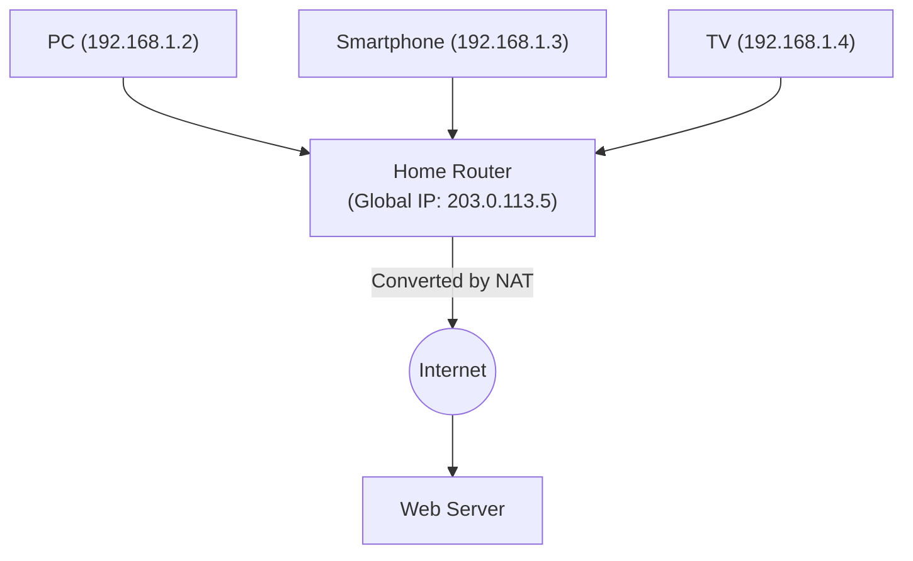

## 1. The Role of the Internet's "Address"

The reason computers and smartphones all over the world can reliably deliver data to each other over the internet is that every device is assigned a globally unique "address".
This address on the network is called an "**IP address (Internet Protocol Address)**".

When we access a "Google server", the browser invisibly sends packets (small parcels) behind the scenes addressed to a string of numbers (IP address) such as "142.250.196.110".
The address system that has supported the internet for a long time is "**IPv4 (Internet Protocol version 4)**". However, this IPv4 is currently facing serious systemic limitations, and a massive migration project to the next-generation "**IPv6**" is underway on a global scale.

## 2. The Birth of IPv4 and the "4.3 Billion Limit"

IPv4 was standardized in 1981 (RFC 791), during the dawn of the internet.
IPv4 addresses are represented by a data size of "**32 bits**". 32 bits means "a combination of 32 digits of 0s and 1s", which calculates to $2^{32} = 4,294,967,296$, meaning it can create **approximately 4.3 billion** addresses.

The internet at the time was a small-scale network used only by a few universities, military organizations, and large corporations. The designers thought, "Since the entire human population on Earth is only a few billion, if there are 4.3 billion addresses, they will never be exhausted for eternity."

However, with the explosive spread of the World Wide Web in the 1990s, the appearance of smartphones in the 2000s, and the arrival of the current IoT (Internet of Things: an era where even home appliances and cars connect to the internet), that estimate went completely awry.
A single person began consuming multiple IP addresses for their PC, smartphone, tablet, and smartwatch, and the 4.3 billion addresses were eaten up in the blink of an eye.

In February 2011, IANA (Internet Assigned Numbers Authority), the central organization that manages global IP addresses, finished allocating their "last central stock of IPv4 addresses" to regional organizations, finally declaring the **complete exhaustion of the central stock**.

## 3. Life Extension Measure: NAT and Private IP Addresses

Normally, the internet should have panicked the moment they were exhausted, but the reason we can still use the internet normally today is thanks to a life-extension technology called "**NAT (Network Address Translation)**".

NAT is a technology that assigns only one "global IP address," which is a globally unique address, to the router of each home or company, and reuses a "private IP address (e.g., 192.168.1.x)," which is a "unique address valid only among insiders," on the inside of the router (inside the house).

The router proxies all requests from devices inside the house by sending them to the internet as "requests from itself (the router)," and correctly redistributes the returned answers to each device inside the house.
By this mechanism, it became possible to connect dozens of devices to the internet with a single global IP address, dramatically postponing the IPv4 exhaustion crisis. However, this was not a fundamental solution, and it created drawbacks such as processing delays caused by NAT and difficulties with P2P communication (such as direct communication in online games).

## 4. The Ultimate Solution: The Appearance of "IPv6"

The next-generation protocol designed to solve this fundamental exhaustion problem is "**IPv6 (Internet Protocol version 6)**".

The greatest feature of IPv6 lies in the overwhelming vastness of its address space.
Compared to IPv4's "32 bits," IPv6 has an "**128-bit**" address space.
Calculated, it becomes $2^{128}$, which means it can issue an unimaginably astronomical number of addresses: approximately "**340 undecillion**" (340 trillion times 1 trillion times 1 trillion).

This is an astronomical number, often said to be "enough to assign an IP address to every grain of sand on Earth and still have some left over."
The notation method also changed from decimal numbers like IPv4's `192.168.1.1` to hexadecimal numbers separated by colons, such as `2001:0db8:85a3:0000:0000:8a2e:0370:7334`.

### The Benefits Brought by IPv6
1. **NAT becomes unnecessary**
   Because there is a nearly infinite number of addresses, a globally unique global IP address can be directly assigned to every single light bulb in a house. Complex address translation (NAT) at the router is no longer needed, allowing devices to communicate directly with each other at high speeds.
2. **Standardization of Security (IPsec)**
   A security feature called IPsec, which performs encryption and tamper detection of communication, is built-in as standard, improving safety at the network layer level.
3. **Efficiency of Routing**
   Because the address structure is hierarchically organized, the path selection (routing) processing when routers on the internet forward packets becomes lighter, reducing communication delays.

## 5. The Spread of IPv6 in Japan and "IPoE"

Although IPv6 is technically perfect, it took time to spread. The biggest barrier was that "**IPv4 and IPv6 are not compatible (they cannot converse directly)**". A PC that supports IPv6 cannot view a website that only supports IPv4. Therefore, telecommunications operators and providers were forced to bear the massive cost of operating both networks in parallel (dual stack).

However, in recent years, the spread of IPv6 exploded in Japan ahead of the rest of the world for a unique reason. That is the acceleration of communication through the "**IPoE (IPv6 IPoE) method**".

The conventional internet connection in Japan (PPPoE method) had a problem where severe congestion would occur at the provider's "network terminating equipment" at night, causing communication speeds to drop drastically.
In contrast, by using the new connection method "IPoE," it became possible to bypass this massive congestion point and directly pass through the wide and empty next-generation network. Because the condition for using this "IPoE method" was "to be IPv6 communication," a movement occurred where many users "introduced IPv6 compatible routers to speed up the internet," and as a result, Japan's IPv6 penetration rate leapt to one of the highest in the world.

## 6. Conclusion: A Quiet and Massive Infrastructure Migration

Upgrading the version of the IP protocol, which is the foundation of the internet, is like swapping out the engine of a car driving at high speed, making it an extremely difficult project.
However, through the long years of effort by global IT companies like Google and Netflix, telecommunication carriers, and router manufacturers, the adoption rate of IPv6 has steadily risen, and currently, a large portion of global traffic is already flowing over IPv6.

Having overcome the systemic crisis of the 4.3 billion exhaustion and obtained an infinite space of 340 undecillion, the internet is ready to continue its further evolution as the foundation for the IoT era, smart cities, and autonomous driving, where everything will be connected to the net in the future.
