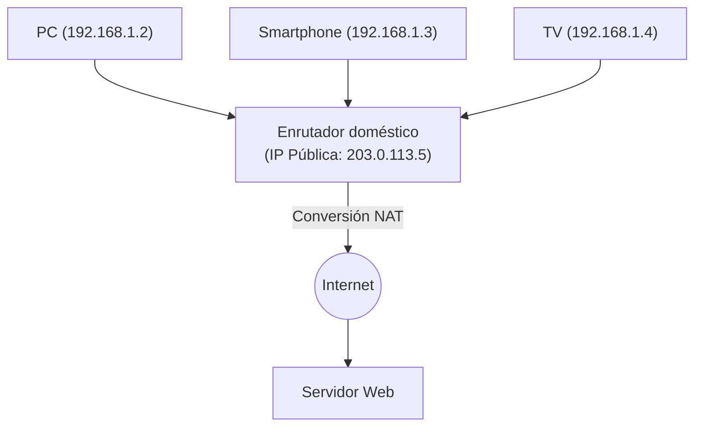

## 1. El rol de la "dirección" en Internet

Las computadoras y los teléfonos inteligentes de todo el mundo conectados a Internet pueden enviarse datos sin errores porque a cada dispositivo se le asigna una "dirección" única en el mundo.
Esta dirección en la red se denomina "**Dirección IP (Internet Protocol Address)**".

Cuando accedemos a los "servidores de Google", el navegador envía en un plano invisible paquetes (pequeños paquetes de datos) al destino utilizando una serie de números como "142.250.196.110" (dirección IP).
El sistema de direcciones que ha sostenido Internet durante mucho tiempo es "**IPv4 (Internet Protocol version 4)**". Sin embargo, en la actualidad, este IPv4 se enfrenta a un grave límite sistémico, y a nivel mundial está en marcha un proyecto de migración masiva hacia la próxima generación, "**IPv6**".

## 2. El nacimiento de IPv4 y el "límite de los 4.300 millones"

IPv4 fue estandarizado en los albores de Internet en 1981 (RFC 791).
Las direcciones IPv4 se representan con un volumen de datos de "**32 bits**". 32 bits significa que es "una combinación de 0s y 1s de 32 dígitos", y al calcularlo $2^{32} = 4,294,967,296$, lo que equivale a poder crear **aproximadamente 4.300 millones** de direcciones.

El Internet de aquel entonces era una red a pequeña escala utilizada únicamente por algunas universidades, instituciones militares y grandes empresas. Los diseñadores pensaron: "Incluso si contamos a todos los seres humanos del planeta, son solo miles de millones, así que con 4.300 millones de direcciones, nunca se agotarán por toda la eternidad".

Sin embargo, debido a la explosiva popularización de la World Wide Web en los años 1990, la aparición de los teléfonos inteligentes en los 2000 y la llegada del IoT actual (Internet de las cosas: una era en la que incluso los electrodomésticos y los automóviles se conectan a la red), ese cálculo se desvió por completo.
Una sola persona comenzó a consumir múltiples direcciones IP con su PC, smartphone, tableta y reloj inteligente, lo que provocó que las 4.300 millones de direcciones se consumieran en un abrir y cerrar de ojos.

En febrero de 2011, la organización central que gestiona las direcciones IP en el mundo, la IANA (Internet Assigned Numbers Authority), terminó de asignar a cada organización regional su "último inventario central de direcciones IPv4" almacenado, y finalmente declaró el **agotamiento total del inventario central**.

## 3. Medidas para prolongar la vida útil: NAT y direcciones IP privadas

Originalmente, Internet debería haber entrado en pánico en el momento en que se agotaron, pero si hoy en día podemos utilizar la red con normalidad, es gracias a una técnica de prolongación de vida útil llamada "**NAT (Network Address Translation)**".

NAT es una tecnología en la que se asigna solo una "dirección IP pública", que es una dirección única en el mundo, a los enrutadores de cada hogar o empresa, mientras que en el interior del enrutador (dentro de la casa) se reutiliza una "dirección IP privada (por ejemplo: 192.168.1.x)", es decir, una "dirección propia que solo es válida entre los conocidos".

El enrutador envía todas las solicitudes de los dispositivos de la casa a Internet actuando como representante como si fueran "solicitudes de sí mismo (el enrutador)", y distribuye correctamente las respuestas recibidas a cada dispositivo en la casa.
Con este mecanismo, fue posible conectar decenas de dispositivos a la red con una sola dirección IP pública, y la crisis de agotamiento de IPv4 se pospuso drásticamente. Sin embargo, esto no fue una solución fundamental, y generó inconvenientes como el retraso en el procesamiento por parte de NAT y la dificultad en las comunicaciones P2P (como la conexión directa en juegos en línea).

## 4. La solución definitiva: La llegada de "IPv6"

El protocolo de próxima generación diseñado para resolver este problema fundamental de agotamiento es "**IPv6 (Internet Protocol version 6)**".

La característica más destacada de IPv6 radica en la inmensidad abrumadora de su espacio de direcciones.
Frente a los "32 bits" de IPv4, IPv6 tiene un espacio de direcciones de "**128 bits**".
Al calcularlo resulta en $2^{128}$, lo que permite emitir aproximadamente "**340 sextillones**" (340 billones de veces un billón de veces un billón) de direcciones, una cantidad que desafía la imaginación humana.

Es una cifra tan astronómica que se dice que "incluso si asignáramos una dirección IP a cada grano de arena del planeta, aún sobrarían".
El método de notación también cambió de los números decimales como `192.168.1.1` en IPv4 a números hexadecimales separados por dos puntos, como `2001:0db8:85a3:0000:0000:8a2e:0370:7334`.

### Los beneficios que aporta IPv6
1. **Ya no se necesita NAT**
   Como hay una cantidad casi infinita de direcciones, es posible asignar directamente una dirección IP pública y única en el mundo incluso a cada bombilla de la casa. Las complejas conversiones de direcciones (NAT) en el enrutador ya no son necesarias, y los dispositivos pueden comunicarse directamente a alta velocidad entre sí.
2. **Estandarización de la seguridad (IPsec)**
   Una función de seguridad llamada IPsec, que realiza el cifrado de las comunicaciones y la detección de alteraciones, está incorporada como estándar, mejorando la seguridad a nivel de la capa de red.
3. **Eficiencia en el enrutamiento**
   Debido a que la estructura de las direcciones está organizada de forma jerárquica, se aligera el procesamiento en la selección de rutas (enrutamiento) cuando los enrutadores de Internet transfieren paquetes, reduciendo así la latencia en las comunicaciones.

## 5. La popularización de IPv6 en Japón e "IPoE"

Aunque IPv6 es técnicamente perfecto, su adopción llevó tiempo. La mayor barrera era el hecho de que "**IPv4 e IPv6 no son compatibles (no pueden comunicarse directamente)**". Desde una PC que soporta IPv6, no es posible ver un sitio web que solo soporte IPv4. Por lo tanto, los operadores de telecomunicaciones y los proveedores se vieron obligados a asumir el enorme costo de operar ambas redes en paralelo (pila dual).

Sin embargo, en los últimos años, la adopción de IPv6 en Japón ha avanzado de manera explosiva por razones propias, adelantándose al resto del mundo. Eso se debe a la aceleración de las comunicaciones mediante el método "**IPoE (IPv6 IPoE)**".

Las conexiones a Internet tradicionales en Japón (método PPPoE) tenían el problema de que por las noches se producía una severa congestión en una parte llamada "dispositivo de terminación de red" del proveedor, provocando que la velocidad de comunicación disminuyera drásticamente.
En contraste, al utilizar el nuevo método de conexión "IPoE", fue posible esquivar este punto de gran congestión y pasar directamente por una red de próxima generación, que es más amplia y está menos congestionada. Dado que la condición para utilizar este "método IPoE" era "realizar comunicaciones en IPv6", surgió un movimiento en el que muchos usuarios "adoptaron enrutadores compatibles con IPv6 para acelerar su internet", lo que resultó en que la tasa de penetración de IPv6 en Japón saltara a ser una de las más altas del mundo.

## 6. Resumen: Una gran y silenciosa transición de infraestructura

La actualización de la versión del protocolo IP, que es la base de Internet, es como cambiar el motor de un automóvil mientras viaja a alta velocidad, y es un proyecto extremadamente difícil.
Sin embargo, gracias a los años de esfuerzo de las empresas tecnológicas mundiales como Google y Netflix, los operadores de telecomunicaciones y los fabricantes de enrutadores, la tasa de penetración de IPv6 ha aumentado constantemente, y hoy en día, gran parte del tráfico mundial ya fluye a través de IPv6.

Internet, que superó la crisis sistémica del agotamiento de los 4.300 millones de direcciones y obtuvo un espacio infinito de 340 sextillones, está listo para seguir evolucionando como la base de la era del IoT, las ciudades inteligentes y la conducción autónoma, donde todo estará conectado a la red en el futuro.
