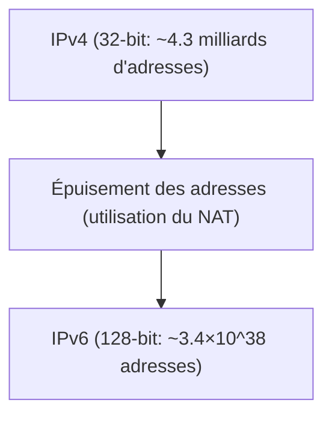

# La transition d'IPv4 à IPv6

IPv6 est le protocole Internet de nouvelle génération conçu pour étendre l'espace d'adressage IPv4 épuisé.

## Extension de l'espace d'adressage

La longueur de l'adresse d'IPv6 est de 128 bits, fournissant un nombre astronomique d'adresses.

## Expression mathématique

Le nombre total d'adresses IPv6, $A_{IPv6}$, est de 2 à la puissance 128.

$$ A_{IPv6} = 2^{128} pprox 3.4 	imes 10^{38} $$

Cela permet d'attribuer une adresse IP publique unique à pratiquement tous les appareils actifs.
