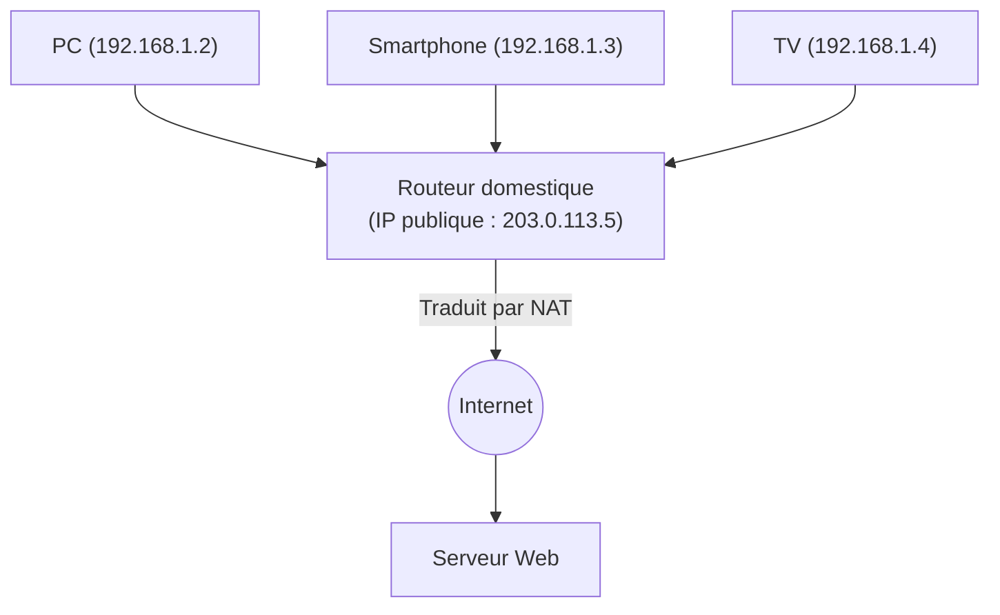

## 1. Le rôle de l'« adresse » d'Internet

Si les ordinateurs et les smartphones du monde entier connectés à Internet peuvent se transmettre des données sans erreur, c'est parce qu'une « adresse » unique au monde est attribuée à chaque appareil.
Cette adresse sur le réseau est appelée « **Adresse IP (Internet Protocol Address)** ».

Lorsque nous accédons au « serveur de Google », le navigateur envoie en arrière-plan un paquet (un petit colis) à une destination sous la forme d'une suite de chiffres (une adresse IP) telle que « 142.250.196.110 ».
Le système d'adresses qui soutient Internet depuis longtemps est l'« **IPv4 (Internet Protocol version 4)** ». Cependant, ce protocole IPv4 est aujourd'hui confronté à de graves limites systémiques, et un projet massif de migration vers l'« **IPv6** » de nouvelle génération est en cours à l'échelle mondiale.

## 2. La naissance de l'IPv4 et la « limite des 4,3 milliards »

L'IPv4 a été standardisé à l'aube d'Internet, en 1981 (RFC 791).
Une adresse IPv4 est représentée par une quantité de données de « **32 bits** ». 32 bits signifie « une combinaison de 0 et de 1 sur 32 chiffres », ce qui permet, par le calcul $2^{32} = 4 294 967 296$, de créer **environ 4,3 milliards** d'adresses.

À l'époque, Internet était un réseau à petite échelle utilisé uniquement par quelques universités, institutions militaires et grandes entreprises. Les concepteurs pensaient que « même avec toute l'humanité sur Terre, on ne compterait que quelques milliards d'individus, donc avec 4,3 milliards d'adresses, elles ne s'épuiseraient jamais, pour l'éternité ».

Cependant, l'explosion du World Wide Web dans les années 1990, l'apparition des smartphones dans les années 2000, et l'avènement actuel de l'IoT (Internet of Things : une ère où même les appareils électroménagers et les voitures sont connectés à Internet) ont complètement bouleversé ces prévisions.
Une seule personne s'est mise à consommer plusieurs adresses IP avec son PC, son smartphone, sa tablette et sa montre connectée, si bien que les 4,3 milliards d'adresses ont été englouties en un rien de temps.

En février 2011, l'IANA (Internet Assigned Numbers Authority), l'organisation centrale mondiale qui gère les adresses IP, a fini d'attribuer le « dernier stock central d'adresses IPv4 » qu'elle conservait aux organisations régionales, déclarant finalement l'**épuisement total du stock central**.

## 3. Mesure de prolongation : le NAT et les adresses IP privées

Normalement, Internet aurait dû sombrer dans la panique au moment de cet épuisement, mais si nous pouvons encore utiliser Internet normalement aujourd'hui, c'est grâce à une technologie de prolongation appelée « **NAT (Network Address Translation)** ».

Le NAT est une technologie qui attribue une seule « adresse IP publique » — l'adresse unique au monde — au routeur de chaque foyer ou entreprise, et qui réutilise à l'intérieur du routeur (dans la maison) des « adresses IP privées (ex : 192.168.1.x) », c'est-à-dire des « adresses propres qui ne sont comprises qu'en interne ».

Le routeur envoie à Internet toutes les requêtes des appareils de la maison par procuration en tant que « requêtes de lui-même (le routeur) », et redistribue correctement les réponses qu'il reçoit à chaque appareil de la maison.
Grâce à ce mécanisme, il est devenu possible de connecter des dizaines d'appareils à Internet avec une seule adresse IP publique, repoussant ainsi de manière spectaculaire la crise d'épuisement de l'IPv4. Toutefois, il ne s'agit pas d'une solution fondamentale, ce qui a engendré des inconvénients tels que des retards de traitement dus au NAT et la difficulté d'établir des communications P2P (comme la communication directe dans les jeux en ligne).

## 4. La solution ultime : l'apparition de l'« IPv6 »

Le protocole de nouvelle génération conçu pour résoudre ce problème fondamental d'épuisement est l'« **IPv6 (Internet Protocol version 6)** ».

La caractéristique majeure de l'IPv6 réside dans l'immensité écrasante de son espace d'adressage.
Contrairement aux « 32 bits » de l'IPv4, l'IPv6 possède un espace d'adressage de « **128 bits** ».
Par le calcul, cela donne $2^{128}$, ce qui permet de générer environ « **340 sextillions** » (340 suivi de 36 zéros) d'adresses, un nombre qui dépasse l'imagination humaine.

C'est un nombre tellement astronomique que l'on dit que « même si l'on attribuait une adresse IP à chaque grain de sable sur Terre, il en resterait encore ».
La méthode de notation a également changé : au lieu du format décimal de l'IPv4 comme `192.168.1.1`, on est passé à un format hexadécimal séparé par des deux-points comme `2001:0db8:85a3:0000:0000:8a2e:0370:7334`.

### Les avantages apportés par l'IPv6
1. **Le NAT n'est plus nécessaire**
   Puisqu'il existe un nombre presque infini d'adresses, il est possible d'attribuer directement une adresse IP publique, unique au monde, même à chaque ampoule électrique de la maison. La traduction complexe d'adresses (NAT) au niveau du routeur n'est plus nécessaire, ce qui permet aux appareils de communiquer directement entre eux à grande vitesse.
2. **Standardisation de la sécurité (IPsec)**
   Une fonction de sécurité appelée IPsec, qui chiffre les communications et détecte les falsifications, est intégrée en standard, améliorant ainsi la sécurité au niveau de la couche réseau.
3. **Efficacité du routage**
   Comme la structure des adresses est organisée de manière hiérarchique, le traitement du choix de l'itinéraire (routage) lorsque les routeurs sur Internet transfèrent les paquets devient plus léger, ce qui réduit la latence de communication.

## 5. La diffusion de l'IPv6 au Japon et l'« IPoE »

Bien que l'IPv6 soit parfait d'un point de vue technique, sa diffusion a pris du temps. L'obstacle majeur était que « **l'IPv4 et l'IPv6 ne sont pas compatibles (ils ne peuvent pas dialoguer directement)** ». Il n'est pas possible de consulter un site Web qui ne supporte que l'IPv4 à partir d'un PC configuré pour l'IPv6. Par conséquent, les opérateurs de télécommunications et les fournisseurs d'accès ont été contraints de supporter le coût énorme de l'exploitation simultanée des deux réseaux (double pile ou dual-stack).

Cependant, ces dernières années, la diffusion de l'IPv6 a explosé au Japon, devançant le reste du monde, pour une raison qui lui est propre : l'accélération des communications grâce à la « **méthode IPoE (IPv6 IPoE)** ».

La connexion Internet traditionnelle japonaise (méthode PPPoE) présentait un problème : la nuit venue, d'énormes embouteillages se formaient au niveau de « l'équipement de terminaison de réseau » du fournisseur d'accès, faisant chuter considérablement la vitesse de communication.
En revanche, l'utilisation de la nouvelle méthode de connexion, l'« IPoE », a permis de contourner ce point de congestion majeur et de passer directement par un réseau de nouvelle génération, large et dégagé. Comme la condition pour utiliser cette « méthode IPoE » était « d'utiliser une communication IPv6 », de nombreux utilisateurs ont initié un mouvement pour « installer un routeur compatible IPv6 afin d'accélérer Internet », ce qui a propulsé le taux de pénétration de l'IPv6 au Japon parmi les plus élevés au monde.

## 6. Conclusion : Une grande migration silencieuse des infrastructures

Mettre à niveau la version du protocole IP, qui est la base d'Internet, s'apparente à remplacer le moteur d'une voiture en pleine course à grande vitesse ; c'est un projet extrêmement difficile.
Néanmoins, grâce aux efforts continus d'entreprises informatiques mondiales telles que Google et Netflix, des opérateurs de télécommunications et des fabricants de routeurs, le taux d'adoption de l'IPv6 augmente régulièrement, et aujourd'hui, une grande partie du trafic mondial circule déjà sous IPv6.

Après avoir surmonté la crise systémique de l'épuisement de ses 4,3 milliards d'adresses et acquis un espace infini de 340 sextillions d'adresses, Internet est désormais prêt à poursuivre son évolution en tant que fondement de l'ère de l'IoT où tout sera connecté, des villes intelligentes et de la conduite autonome.
