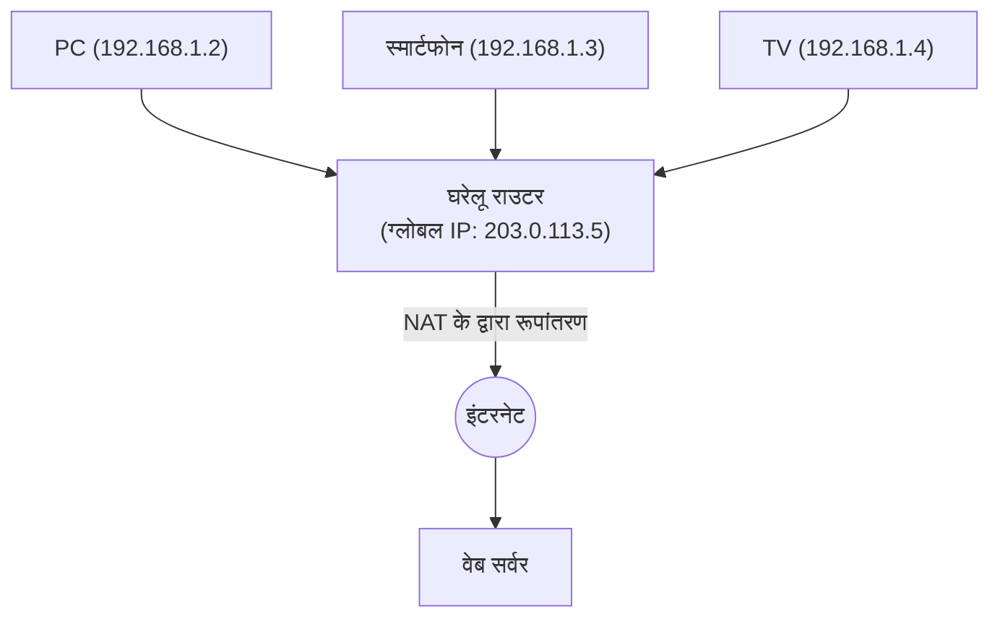

## 1. इंटरनेट के "पते" की भूमिका

इंटरनेट से जुड़े दुनिया भर के कंप्यूटर और स्मार्टफोन एक-दूसरे को बिना किसी गलती के डेटा भेज सकते हैं, क्योंकि हर डिवाइस को दुनिया में एक विशिष्ट "पता" दिया गया है।
नेटवर्क पर इस पते को " **IP एड्रेस (Internet Protocol Address)** " कहा जाता है।

जब हम "Google के सर्वर" तक पहुँचते हैं, तो ब्राउज़र बैकग्राउंड में छिपे रूप से "142.250.196.110" जैसे नंबरों की एक श्रृंखला (IP एड्रेस) को गंतव्य के रूप में मानकर पैकेट (छोटे पार्सल) भेजता है।
लंबे समय से इंटरनेट को सपोर्ट करने वाला यह एड्रेस सिस्टम " **IPv4 (Internet Protocol version 4)** " है। हालांकि, वर्तमान में यह IPv4 एक गंभीर प्रणालीगत सीमा का सामना कर रहा है, और अगली पीढ़ी के " **IPv6** " की ओर एक विशाल माइग्रेशन (स्थानांतरण) प्रोजेक्ट वैश्विक स्तर पर चल रहा है।

## 2. IPv4 का जन्म और "4.3 बिलियन (430 करोड़) की सीमा"

IPv4 को 1981 (RFC 791) में मानकीकृत किया गया था, जो इंटरनेट का प्रारंभिक दौर था।
IPv4 एड्रेस को " **32-बिट** " डेटा मात्रा में दर्शाया जाता है। 32-बिट का अर्थ है "0 और 1 का 32-अंकीय संयोजन", और गणना करने पर $2^{32} = 4,294,967,296$ होता है, जिसका अर्थ है कि लगभग **4.3 बिलियन (430 करोड़)** पते बनाए जा सकते हैं।

उस समय, इंटरनेट एक छोटे पैमाने का नेटवर्क था जिसका उपयोग केवल कुछ विश्वविद्यालयों, सैन्य संस्थानों और बड़े निगमों द्वारा किया जाता था। डिजाइनरों का मानना था कि "चूंकि पृथ्वी पर पूरी मानव जाति की आबादी केवल कुछ अरब है, इसलिए 4.3 बिलियन पते होने पर वे भविष्य में कभी भी खत्म नहीं होंगे।"

हालाँकि, 1990 के दशक में वर्ल्ड वाइड वेब के विस्फोटक प्रसार, 2000 के दशक में स्मार्टफोन के आगमन, और वर्तमान IoT (इंटरनेट ऑफ थिंग्स: एक ऐसा युग जहाँ घरेलू उपकरण और यहाँ तक कि कारें भी इंटरनेट से जुड़ी होती हैं) के आने से वह अनुमान पूरी तरह से गलत साबित हो गया।
एक व्यक्ति पीसी, स्मार्टफोन, टैबलेट और स्मार्टवॉच के रूप में कई IP एड्रेस का उपयोग करने लगा, और 4.3 बिलियन पते पलक झपकते ही समाप्त हो गए।

फरवरी 2011 में, दुनिया के IP एड्रेस का प्रबंधन करने वाले केंद्रीय संगठन IANA (Internet Assigned Numbers Authority) ने अपने स्टॉक में मौजूद "IPv4 एड्रेस का अंतिम केंद्रीय भंडार" विभिन्न क्षेत्रीय संगठनों को आवंटित कर दिया, और अंततः **केंद्रीय भंडार की पूरी तरह से समाप्ति** की घोषणा कर दी।

## 3. जीवन रक्षक उपाय: NAT और प्राइवेट IP एड्रेस

आम तौर पर, एड्रेस खत्म होने पर इंटरनेट में हड़कंप मच जाना चाहिए था, लेकिन आज भी हम सामान्य रूप से इंटरनेट का उपयोग कर पा रहे हैं, जिसका श्रेय " **NAT (Network Address Translation)** " नामक जीवन रक्षक तकनीक को जाता है।

NAT एक ऐसी तकनीक है जो प्रत्येक घर या कंपनी के राउटर को दुनिया में एक विशिष्ट पते, "ग्लोबल IP एड्रेस", का केवल एक असाइनमेंट देती है, और राउटर के अंदर (घर के भीतर) "प्राइवेट IP एड्रेस (उदाहरण: 192.168.1.x)" नामक "केवल आंतरिक नेटवर्क में मान्य एक विशिष्ट पते" का बार-बार उपयोग करती है।

राउटर, घर के अंदर के उपकरणों से आने वाले सभी अनुरोधों को इंटरनेट पर "अपने (राउटर के) अनुरोध" के रूप में प्रॉक्सी के तौर पर भेजता है, और प्राप्त हुए उत्तरों को सही ढंग से घर के अंदर के प्रत्येक उपकरण को वितरित करता है।
इस प्रणाली के माध्यम से, एक ग्लोबल IP एड्रेस से दर्जनों उपकरणों को इंटरनेट से जोड़ना संभव हो गया, और IPv4 की समाप्ति के संकट को नाटकीय रूप से टाल दिया गया। हालांकि, यह कोई स्थायी समाधान नहीं था, और इसके कारण NAT की प्रोसेसिंग में देरी तथा P2P संचार (जैसे ऑनलाइन गेम का सीधा संचार) में कठिनाई जैसी समस्याएँ उत्पन्न हुईं।

## 4. अंतिम समाधान: "IPv6" का आगमन

इस मूल समाप्ति समस्या को हल करने के लिए डिज़ाइन किया गया अगली पीढ़ी का प्रोटोकॉल " **IPv6 (Internet Protocol version 6)** " है।

IPv6 की सबसे बड़ी विशेषता इसके एड्रेस स्पेस का अत्यधिक विशाल होना है।
IPv4 के "32-बिट" की तुलना में, IPv6 में " **128-बिट** " का एड्रेस स्पेस है।
गणना करने पर यह $2^{128}$ हो जाता है, जिसका अर्थ है कि यह लगभग " **340 अनडेसिलियन** " (340 ट्रिलियन का 1 ट्रिलियन गुना 1 ट्रिलियन गुना) पते जारी कर सकता है, जो मानव कल्पना से परे एक संख्या है।

यह एक इतनी बड़ी खगोलीय संख्या है कि ऐसा कहा जाता है, "यदि पृथ्वी पर रेत के हर कण को भी एक IP एड्रेस दिया जाए, तो भी वे बच जाएंगे।"
इसके प्रदर्शन का तरीका भी IPv4 के `192.168.1.1` जैसे दशमलव (Decimal) से बदलकर `2001:0db8:85a3:0000:0000:8a2e:0370:7334` जैसे हेक्साडेसिमल (Hexadecimal) और कोलन-विभाजित प्रारूप में बदल गया है।

### IPv6 के लाभ
1. **NAT की आवश्यकता समाप्त हो जाती है**
   चूंकि इसके पते लगभग असीमित हैं, इसलिए घर के प्रत्येक लाइटबल्ब को भी दुनिया का एकमात्र ग्लोबल IP एड्रेस सीधे सौंपा जा सकता है। राउटर पर जटिल एड्रेस रूपांतरण (NAT) की आवश्यकता नहीं होती, और उपकरण एक-दूसरे के साथ सीधे उच्च गति से संचार कर सकते हैं।
2. **सुरक्षा का मानकीकरण (IPsec)**
   IPsec नामक एक सुरक्षा सुविधा, जो संचार को एन्क्रिप्ट करती है और छेड़छाड़ का पता लगाती है, मानक के रूप में शामिल है, जिससे नेटवर्क लेयर स्तर पर सुरक्षा में सुधार होता है।
3. **राउटिंग की दक्षता**
   चूंकि एड्रेस संरचना को पदानुक्रमित (hierarchical) रूप से व्यवस्थित किया गया है, इंटरनेट पर राउटर द्वारा पैकेट ट्रांसफर करते समय मार्ग चयन (राउटिंग) की प्रक्रिया हल्की हो जाती है, जिससे संचार में देरी कम हो जाती है।

## 5. जापान में IPv6 का प्रसार और "IPoE"

तकनीकी रूप से IPv6 एकदम सही है, लेकिन इसके प्रसार में समय लगा। सबसे बड़ी बाधा यह थी कि " **IPv4 और IPv6 संगत नहीं हैं (वे सीधे बातचीत नहीं कर सकते)** "। एक IPv6 समर्थित पीसी से, आप ऐसी वेबसाइट नहीं देख सकते जो केवल IPv4 का समर्थन करती हो। इसलिए, दूरसंचार वाहकों और प्रदाताओं को दोनों नेटवर्कों को समानांतर (डुअल स्टैक) में संचालित करने के लिए भारी लागत का सामना करना पड़ा।

हालाँकि हाल के वर्षों में, जापान में एक विशिष्ट कारण से दुनिया में सबसे पहले IPv6 का प्रसार बहुत तेज़ी से हुआ है। वह है " **IPoE (IPv6 IPoE) प्रणाली** " के कारण संचार की गति का तेज़ होना।

जापान के पारंपरिक इंटरनेट कनेक्शन (PPPoE प्रणाली) में एक समस्या थी कि रात के समय प्रदाता के "नेटवर्क टर्मिनेशन इक्विपमेंट (Network Termination Equipment)" वाले हिस्से में भारी ट्रैफ़िक जाम हो जाता था, जिससे संचार की गति बहुत कम हो जाती थी।
इसके विपरीत, नई कनेक्शन प्रणाली "IPoE" का उपयोग करके, इस बड़े ट्रैफ़िक जाम वाले बिंदु को बायपास करना और सीधे एक विस्तृत और खाली अगली पीढ़ी के नेटवर्क से गुजरना संभव हो गया। चूंकि इस "IPoE प्रणाली" का उपयोग करने की शर्त "IPv6 संचार" थी, इसलिए कई उपयोगकर्ताओं ने "इंटरनेट को तेज़ करने के लिए IPv6 समर्थित राउटर स्थापित करने" का एक आंदोलन शुरू किया, और परिणामस्वरूप जापान की IPv6 प्रसार दर दुनिया में शीर्ष स्तर पर पहुँच गई।

## 6. निष्कर्ष: एक शांत लेकिन विशाल बुनियादी ढांचे का स्थानांतरण

इंटरनेट की नींव, IP प्रोटोकॉल को अपग्रेड करना, तेज़ गति से चलती हुई कार के इंजन को बदलने जैसा है, और यह एक बहुत ही कठिन प्रोजेक्ट है।
हालाँकि, Google और Netflix जैसी वैश्विक IT कंपनियों, दूरसंचार वाहकों और राउटर निर्माताओं के वर्षों के प्रयासों की बदौलत, IPv6 की प्रसार दर में लगातार वृद्धि हुई है, और वर्तमान में दुनिया का अधिकांश ट्रैफ़िक पहले से ही IPv6 के माध्यम से प्रवाहित हो रहा है।

4.3 बिलियन (430 करोड़) की समाप्ति के प्रणालीगत संकट को पार करके और 340 अनडेसिलियन के असीमित स्थान को प्राप्त करके, इंटरनेट अब IoT युग (जहाँ हर चीज़ इंटरनेट से जुड़ी होगी), स्मार्ट सिटी और स्वायत्त ड्राइविंग की नींव के रूप में आगे और विकसित होने के लिए तैयार है।
