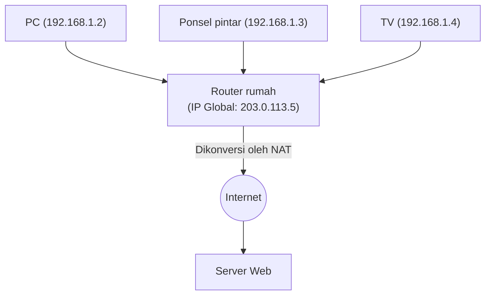

## 1. Peran "Alamat" di Internet

Komputer dan ponsel pintar di seluruh dunia yang terhubung ke internet dapat saling mengirimkan data tanpa kesalahan karena setiap perangkat telah diberi "alamat" unik di dunia.
Alamat di jaringan ini disebut dengan "**Alamat IP (Internet Protocol Address)**".

Saat kita mengakses "server Google", di balik layar browser mengirimkan paket (bingkisan kecil) dengan tujuan deretan angka (alamat IP) seperti "142.250.196.110".
Sistem alamat yang telah lama menopang internet ini adalah "**IPv4 (Internet Protocol version 4)**". Namun saat ini, IPv4 menghadapi batas sistem yang parah, dan proyek migrasi besar ke "**IPv6**" generasi berikutnya sedang berlangsung dalam skala global.

## 2. Kelahiran IPv4 dan "Batas 4,3 Miliar"

IPv4 distandarisasi pada tahun 1981 (RFC 791), yang merupakan awal mula internet.
Alamat IPv4 direpresentasikan dengan jumlah data sebesar "**32-bit**". 32-bit berarti "kombinasi 0 dan 1 sebanyak 32 digit", dan jika dihitung adalah $2^{32} = 4,294,967,296$ , yang berarti dapat membuat **sekitar 4,3 miliar** alamat.

Pada saat itu, internet adalah jaringan berskala kecil yang hanya digunakan oleh beberapa universitas, lembaga militer, dan perusahaan besar. Para perancangnya berpikir, "Karena seluruh umat manusia di bumi hanya berjumlah beberapa miliar orang, memiliki 4,3 miliar alamat tidak akan pernah habis sampai kapan pun".

Namun, ledakan penyebaran World Wide Web pada tahun 1990-an, kemunculan ponsel pintar pada tahun 2000-an, dan datangnya era IoT (Internet of Things: era di mana bahkan peralatan rumah tangga dan mobil terhubung ke jaringan) saat ini telah sepenuhnya mengacaukan perhitungan tersebut.
Satu orang mulai mengonsumsi beberapa alamat IP dengan PC, ponsel pintar, tablet, dan jam tangan pintar, dan 4,3 miliar alamat pun habis dimakan dalam sekejap mata.

Pada bulan Februari 2011, IANA (Internet Assigned Numbers Authority), organisasi pusat yang mengelola alamat IP dunia, telah selesai mengalokasikan "stok pusat terakhir alamat IPv4" yang mereka miliki ke setiap organisasi regional, dan akhirnya mendeklarasikan **kehabisan stok pusat secara total**.

## 3. Langkah Perpanjangan Usia: NAT dan Alamat IP Privat

Seharusnya internet menjadi panik saat alamat tersebut habis, tetapi alasan kita masih bisa menggunakan internet secara normal hingga hari ini adalah berkat teknologi perpanjangan usia yang disebut "**NAT (Network Address Translation)**".

NAT adalah teknologi yang mengalokasikan hanya satu "alamat IP global" sebagai alamat unik dunia untuk router setiap rumah atau perusahaan, dan di dalam router (di dalam rumah) menggunakan "alamat IP privat (contoh: 192.168.1.x)" yang merupakan "alamat eksklusif yang hanya terhubung di dalam lingkaran sendiri".

Router bertindak sebagai perwakilan dengan mengirimkan semua permintaan dari perangkat di dalam rumah ke internet sebagai "permintaan dari dirinya sendiri (router)", dan mendistribusikan kembali jawaban yang dikembalikan secara benar ke setiap perangkat di dalam rumah.
Dengan mekanisme ini, puluhan perangkat dapat terhubung ke jaringan menggunakan satu alamat IP global, dan krisis kehabisan IPv4 tertunda secara dramatis. Namun, ini bukanlah solusi fundamental, dan menciptakan efek samping seperti penundaan pemrosesan akibat NAT dan menyulitkan komunikasi P2P (seperti komunikasi langsung pada game online).

## 4. Solusi Utama: Kemunculan "IPv6"

Protokol generasi berikutnya yang dirancang untuk menyelesaikan masalah fundamental kehabisan alamat ini adalah "**IPv6 (Internet Protocol version 6)**".

Karakteristik terbesar dari IPv6 terletak pada ruang alamatnya yang sangat luas.
Berbeda dengan "32-bit" milik IPv4, IPv6 memiliki ruang alamat sebesar "**128-bit**".
Jika dihitung menjadi $2^{128}$ , yang berarti dapat menerbitkan sekitar "**340 undesiliun**" (340 triliun dikali 1 triliun dikali 1 triliun) alamat, jumlah yang tak terbayangkan oleh manusia.

Ini adalah angka astronomis yang bahkan dikatakan, "Jika Anda memberikan alamat IP ke setiap butiran pasir di bumi, masih akan ada sisanya".
Metode penulisannya juga berubah, dari bilangan desimal seperti `192.168.1.1` pada IPv4, menjadi bilangan heksadesimal yang dipisahkan dengan titik dua, seperti `2001:0db8:85a3:0000:0000:8a2e:0370:7334`.

### Manfaat yang Dibawa oleh IPv6
1. **NAT Tidak Lagi Diperlukan**
   Karena terdapat alamat yang hampir tak terbatas, sebuah alamat IP global unik di dunia dapat langsung dialokasikan bahkan hingga ke setiap bola lampu di dalam rumah. Konversi alamat (NAT) yang rumit pada router tidak lagi diperlukan, memungkinkan perangkat untuk saling berkomunikasi secara langsung dalam kecepatan tinggi.
2. **Standardisasi Keamanan (IPsec)**
   Fitur keamanan bernama IPsec, yang melakukan enkripsi komunikasi dan deteksi gangguan, telah diintegrasikan sebagai standar, sehingga meningkatkan keamanan di tingkat lapisan jaringan.
3. **Efisiensi Routing**
   Karena struktur alamat diatur secara hierarkis, pemrosesan pemilihan jalur (routing) ketika router di internet meneruskan paket menjadi lebih ringan, dan penundaan komunikasi pun berkurang.

## 5. Penyebaran IPv6 di Jepang dan "IPoE"

Meski IPv6 sempurna secara teknis, penyebarannya memakan waktu. Hambatan terbesar adalah "**IPv4 dan IPv6 tidak kompatibel (tidak dapat berdialog secara langsung)**". Dari PC yang mendukung IPv6, kita tidak dapat melihat situs web yang hanya mendukung IPv4. Oleh karena itu, operator telekomunikasi dan penyedia layanan internet (ISP) dipaksa menanggung biaya sangat besar untuk mengoperasikan kedua jaringan tersebut secara paralel (dual stack).

Namun dalam beberapa tahun terakhir, penyebaran IPv6 meledak di Jepang dengan alasan unik yang mendahului belahan dunia lainnya. Yaitu peningkatan kecepatan komunikasi melalui metode "**IPoE (IPv6 IPoE)**".

Koneksi internet konvensional di Jepang (metode PPPoE) memiliki masalah di mana kemacetan parah terjadi pada "perangkat terminasi jaringan" milik ISP pada malam hari, menyebabkan kecepatan komunikasi turun secara ekstrem.
Sebaliknya, dengan menggunakan metode koneksi baru yaitu "IPoE", pengguna dapat melewati titik kemacetan besar ini dan langsung melalui jaringan generasi berikutnya yang luas dan kosong. Karena syarat untuk menggunakan "metode IPoE" ini adalah "harus komunikasi IPv6", maka muncul gerakan di mana banyak pengguna "memasang router yang mendukung IPv6 agar internet menjadi lebih cepat", dan sebagai hasilnya, tingkat penyebaran IPv6 di Jepang melompat ke tingkat teratas di dunia.

## 6. Kesimpulan: Transisi Infrastruktur Besar yang Tenang

Pembaruan versi protokol IP, yang merupakan fondasi internet, seperti mengganti mesin mobil yang sedang melaju dalam kecepatan tinggi, menjadikannya proyek yang sangat sulit.
Namun, berkat upaya bertahun-tahun dari perusahaan IT global seperti Google dan Netflix, operator telekomunikasi, dan produsen router, tingkat penyebaran IPv6 terus meningkat dengan mantap, dan saat ini sebagian besar lalu lintas dunia sudah mengalir menggunakan IPv6.

Setelah mengatasi krisis sistem kehabisan 4,3 miliar alamat dan memperoleh ruang tak terbatas sebesar 340 undesiliun alamat, internet kini siap untuk terus berevolusi lebih jauh lagi sebagai fondasi untuk era IoT di mana segala sesuatu terhubung ke internet, kota pintar (smart city), dan sistem mengemudi otonom.
