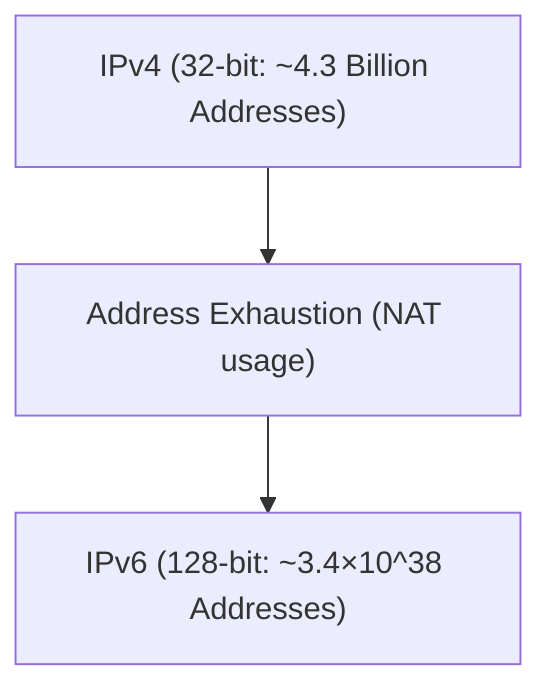

# Transformasi dari IPv4 ke IPv6

IPv6 adalah protokol internet generasi berikutnya yang dirancang untuk memperluas ruang alamat IPv4 yang telah habis.

## Perluasan Ruang Alamat

Panjang alamat IPv6 adalah 128-bit, menyediakan jumlah alamat yang astronomis.

## Representasi Matematis

Total jumlah alamat IPv6 $A_{IPv6}$ adalah 2 pangkat 128.

$$ A_{IPv6} = 2^{128} \approx 3.4 \times 10^{38} $$

Hal ini memungkinkan pemberian alamat IP global yang unik ke hampir semua perangkat aktif secara praktis.
