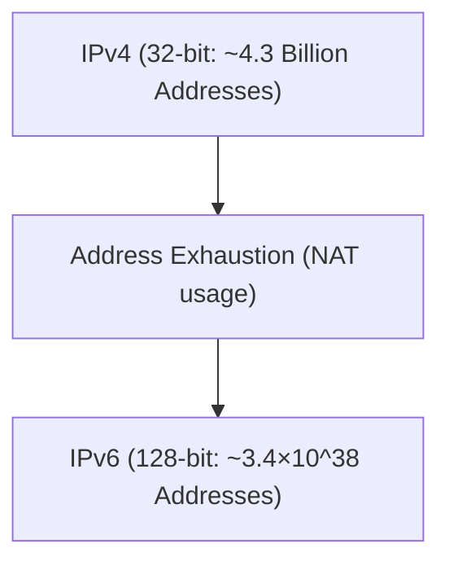

# IPv4에서 IPv6로의 변화

IPv6는 고갈된 IPv4 주소 공간을 확장하기 위해 설계된 차세대 인터넷 프로토콜입니다.

## 주소 공간의 확장

IPv6의 주소 길이는 128비트이며, 천문학적인 수의 주소를 제공합니다.

## 수학적 표현

IPv6의 총 주소 수 $A_{IPv6}$는 2의 128승입니다.

$$ A_{IPv6} = 2^{128} pprox 3.4 \times 10^{38} $$

이로 인해 사실상 모든 활성 장치에 고유한 글로벌 IP 주소를 할당할 수 있게 됩니다.
