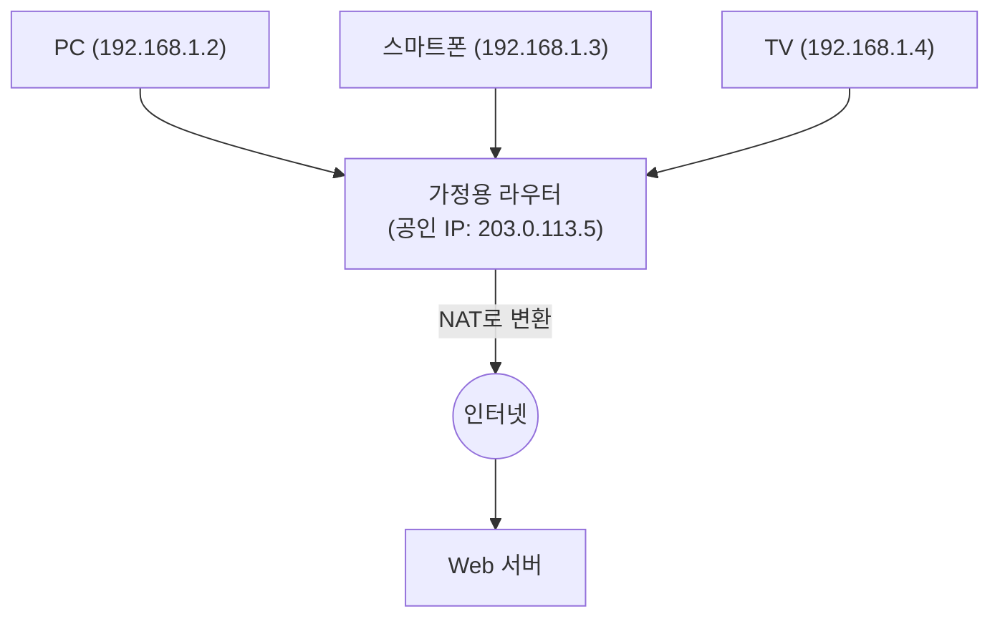

## 1. 인터넷의 「주소」의 역할

인터넷에 접속되어 있는 전 세계의 컴퓨터나 스마트폰이, 서로 틀림없이 데이터를 전달할 수 있는 것은 모든 기기에 세계에서 유일한 「주소」가 할당되어 있기 때문입니다.
이 네트워크 상의 주소를 「 **IP 주소(Internet Protocol Address)** 」라고 부릅니다.

우리가 「Google의 서버」에 접속할 때, 브라우저는 보이지 않는 이면에서 「142.250.196.110」과 같은 숫자의 나열(IP 주소)을 수신지로 하여 패킷(소포)을 송신하고 있습니다.
오랫동안 인터넷을 지탱해 온 이 주소 시스템이 「 **IPv4(Internet Protocol version 4)** 」입니다. 그러나 현재, 이 IPv4는 심각한 시스템적 한계에 직면하여, 차세대인 「 **IPv6** 」로의 거대한 전환(마이그레이션) 프로젝트가 세계 규모로 진행되고 있습니다.

## 2. IPv4의 탄생과 「43억 개의 한계」

IPv4는 인터넷의 여명기인 1981년(RFC 791)에 규격화되었습니다.
IPv4의 주소는 「 **32비트** 」의 데이터 양으로 표현됩니다. 32비트란 「0과 1의 조합이 32자리」라는 의미이며, 계산하면 $2^{32} = 4,294,967,296$ , 즉 **약 43억 개** 의 주소를 만들 수 있습니다.

당시의 인터넷은 일부 대학이나 군사 기관, 대기업만이 이용하는 소규모 네트워크였습니다. 설계자들은 「지구상의 전 인류도 수십억 명이므로, 43억 개의 주소가 있다면 영원히 고갈될 일은 없을 것이다」라고 생각했습니다.

그러나 1990년대 World Wide Web의 폭발적인 보급, 2000년대 스마트폰의 등장, 그리고 현재 IoT(사물인터넷: 가전이나 자동차까지도 인터넷에 연결되는 시대)의 도래로 인해, 그 예상은 완전히 빗나갔습니다.
1명이 PC, 스마트폰, 태블릿, 스마트워치 등 여러 개의 IP 주소를 소비하게 되면서, 43억 개의 주소는 순식간에 소진되어 버린 것입니다.

2011년 2월, 세계의 IP 주소를 관리하는 중앙 조직인 IANA(Internet Assigned Numbers Authority)는 그들이 비축하고 있던 「IPv4 주소의 마지막 중앙 재고」를 각 지역 조직에 모두 할당하고, 마침내 **중앙 재고의 완전 고갈** 을 선언했습니다.

## 3. 연명 조치: NAT와 사설 IP 주소

본래대로라면 고갈된 시점에 인터넷은 패닉에 빠졌어야 했지만, 오늘날에도 우리가 평범하게 인터넷을 사용할 수 있는 것은 「 **NAT(Network Address Translation)** 」라는 연명 기술 덕분입니다.

NAT는 세계에서 유일한 주소인 「공인 IP 주소」를 각 가정이나 기업의 라우터에 1개만 할당하고, 라우터 내부(집 안)에서는 「사설 IP 주소(예: 192.168.1.x)」라는 「내부에서만 통하는 독자적인 주소」를 돌려쓰는 기술입니다.

라우터가, 집 안의 기기에서 온 요청을 모두 「자신(라우터)으로부터의 요청」으로서 대리로 인터넷에 송신하고, 돌아온 응답을 올바르게 집 안의 각 기기에 다시 나눠줍니다.
이 구조를 통해, 1개의 공인 IP 주소로 수십 대의 기기를 인터넷에 연결하는 것이 가능해져, IPv4의 고갈 위기는 극적으로 연기되었습니다. 하지만, 이것은 근본적인 해결책이 아니며, NAT로 인한 처리 지연이나, P2P 통신(온라인 게임의 직접 통신 등)이 어려워진다는 폐해를 낳았습니다.

## 4. 궁극적인 해결책: 「IPv6」의 등장

이 근본적인 고갈 문제를 해결하기 위해 설계된 차세대 프로토콜이 「 **IPv6(Internet Protocol version 6)** 」입니다.

IPv6의 가장 큰 특징은 주소 공간의 압도적인 광활함에 있습니다.
IPv4의 「32비트」에 비해, IPv6는 「 **128비트** 」의 주소 공간을 가집니다.
계산하면 $2^{128}$ 이 되어, 약 「 **340간(澗)** 」(340조의 1조 배의 1조 배) 개라는, 인간의 상상을 초월하는 수의 주소를 발행할 수 있습니다.

이것은, 「지구상의 모든 모래알에 IP 주소를 할당해도, 여전히 남는다」라고 말할 정도의 천문학적인 숫자입니다.
표기 방법도, IPv4의 `192.168.1.1` 과 같은 10진수에서, `2001:0db8:85a3:0000:0000:8a2e:0370:7334` 와 같은 16진수와 콜론 구분으로 바뀌었습니다.

### IPv6가 가져오는 장점
1. **NAT가 필요 없어진다**
   무한에 가까운 주소가 있기 때문에, 집 안의 전구 하나하나에까지 세계에서 유일한 공인 IP 주소를 직접 할당할 수 있습니다. 라우터에서의 복잡한 주소 변환(NAT)이 필요 없어지며, 기기끼리 다이렉트로 고속 통신할 수 있게 됩니다.
2. **보안의 표준화(IPsec)**
   통신의 암호화나 변조 탐지를 수행하는 IPsec이라는 보안 기능이 표준으로 내장되어 있어, 네트워크 계층 수준에서의 안전성이 향상됩니다.
3. **라우팅의 효율화**
   주소의 구조가 계층적으로 정리되어 있기 때문에, 인터넷 상의 라우터가 패킷을 전송할 때의 경로 선택(라우팅) 처리가 가벼워져, 통신 지연이 감소합니다.

## 5. 일본에서의 IPv6 보급과 「IPoE」

기술적으로는 완벽한 IPv6이지만, 보급에는 시간이 걸렸습니다. 가장 큰 장벽은 「 **IPv4와 IPv6는 호환성이 없다(직접 대화할 수 없다)** 」라는 점입니다. IPv6를 지원하는 PC에서, IPv4만 지원하는 Web 사이트를 볼 수는 없습니다. 이로 인해 통신 사업자나 프로바이더는 두 네트워크를 병행하여 운용(듀얼 스택)하는 막대한 비용을 강요받았습니다.

그러나 최근, 일본에서는 세계에 앞서 독자적인 이유로 IPv6의 보급이 폭발적으로 진행되었습니다. 그것이 「 **IPoE(IPv6 IPoE) 방식** 」에 의한 통신 고속화입니다.

일본의 기존 인터넷 접속(PPPoE 방식)은, 야간이 되면 프로바이더의 「망 종단 장치」라는 부분에서 심한 정체가 발생하여, 통신 속도가 극단적으로 떨어진다는 문제가 있었습니다.
이에 반해, 새로운 접속 방식인 「IPoE」를 이용하면, 이 대정체 포인트를 우회하여 넓고 한산한 차세대 네트워크를 직접 통과할 수 있게 되었습니다. 이 「IPoE 방식」을 이용하는 조건이 「IPv6 통신일 것」이었기 때문에, 많은 유저가 「인터넷을 빠르게 하기 위해 IPv6 지원 라우터를 도입한다」라는 움직임이 일어났고, 결과적으로 일본의 IPv6 보급률은 세계 최고 수준으로 도약했습니다.

## 6. 요약: 조용한 인프라 대전환

인터넷의 토대인 IP 프로토콜의 버전 업은, 고속 주행 중인 자동차의 엔진을 교체하는 것과 같아서 매우 곤란한 프로젝트입니다.
그러나 Google이나 Netflix 등 세계적인 IT 기업, 통신 캐리어, 그리고 라우터 제조사의 오랜 노력으로 IPv6 보급률은 착실하게 상승하여, 현재는 전 세계 트래픽의 상당 부분이 이미 IPv6로 흐르고 있습니다.

43억 개의 고갈이라는 시스템적 위기를 극복하고, 340간 개라는 무한한 공간을 손에 넣은 인터넷은, 앞으로 모든 사물이 인터넷에 연결되는 IoT 시대, 스마트 시티, 자율 주행의 기반으로서 더욱 진화해 나갈 준비가 되어 있습니다.
