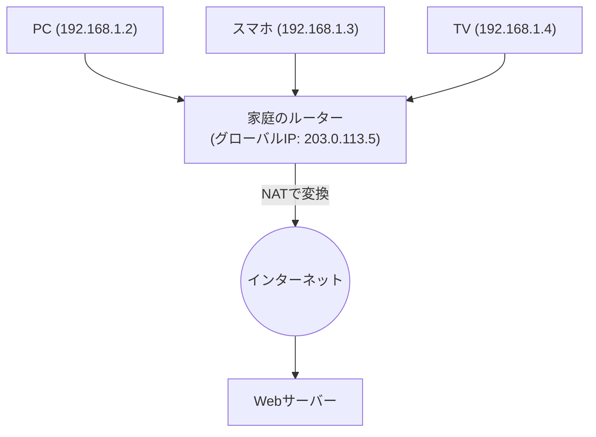

## 1. インターネットの「住所」の役割

インターネットに接続されている世界中のコンピュータやスマートフォンが、互いに間違いなくデータを送り届けることができるのは、すべての機器に世界で唯一の「住所」が割り当てられているからです。
このネットワーク上の住所を「**IPアドレス（Internet Protocol Address）**」と呼びます。

私たちが「Googleのサーバー」へアクセスする際、ブラウザは見えない裏側で「142.250.196.110」といった数字の羅列（IPアドレス）を宛先としてパケット（小包）を送信しています。
長らくインターネットを支えてきたこの住所システムが「**IPv4（Internet Protocol version 4）**」です。しかし現在、このIPv4は深刻なシステム的限界に直面し、次世代の「**IPv6**」への巨大な移行（マイグレーション）プロジェクトが世界規模で進行しています。

## 2. IPv4の誕生と「43億個の限界」

IPv4は、インターネットの黎明期である1981年（RFC 791）に規格化されました。
IPv4のアドレスは「**32ビット**」のデータ量で表現されます。32ビットとは「0と1の組み合わせが32桁」という意味であり、計算すると $2^{32} = 4,294,967,296$ 、つまり**約43億個**の住所を作ることができます。

当時のインターネットは、一部の大学や軍事機関、大企業だけが利用する小規模なネットワークでした。設計者たちは「地球上の全人類でも数十億人なのだから、43億個も住所があれば未来永劫枯渇することはないだろう」と考えていました。

しかし、1990年代のWorld Wide Webの爆発的な普及、2000年代のスマートフォンの登場、そして現在のIoT（モノのインターネット：家電や自動車までもがネットに繋がる時代）の到来により、その目算は完全に狂いました。
1人がPC、スマホ、タブレット、スマートウォッチと複数のIPアドレスを消費するようになり、43億個のアドレスはあっという間に食いつぶされてしまったのです。

2011年2月、世界のIPアドレスを管理する中央組織であるIANA（Internet Assigned Numbers Authority）は、彼らがストックしていた「IPv4アドレスの最後の中央在庫」を各地域組織に割り当て終え、ついに**中央在庫の完全枯渇**を宣言しました。

## 3. 延命措置：NATとプライベートIPアドレス

本来なら枯渇した時点でインターネットはパニックになるはずでしたが、今日でも私たちが普通にネットを使えているのは、「**NAT（Network Address Translation）**」という延命技術のおかげです。

NATは、世界で唯一の住所である「グローバルIPアドレス」を各家庭や企業のルーターに1つだけ割り当て、ルーターの内側（家の中）では「プライベートIPアドレス（例：192.168.1.x）」という「身内だけで通じる独自の住所」を使い回す技術です。

ルーターが、家の中の機器からのリクエストをすべて「自分（ルーター）からのリクエスト」として代理でインターネットに送信し、返ってきた答えを正しく家の中の各機器に配り直します。
この仕組みにより、1つのグローバルIPアドレスで数十台の機器をネットに繋ぐことが可能になり、IPv4の枯渇危機は劇的に先延ばしされました。しかし、これは根本的な解決ではなく、NATによる処理の遅延や、P2P通信（オンラインゲームの直接通信など）が難しくなるという弊害を生み出しました。

## 4. 究極の解決策：「IPv6」の登場

この根本的な枯渇問題を解決するために設計された次世代プロトコルが「**IPv6（Internet Protocol version 6）**」です。

IPv6の最大の特徴は、アドレス空間の圧倒的な広大さにあります。
IPv4の「32ビット」に対し、IPv6は「**128ビット**」のアドレス空間を持ちます。
計算すると $2^{128}$ となり、約「**340澗（かん）**」（340兆の1兆倍の1兆倍）個という、人間の想像を絶する数のアドレスを発行できます。

これは、「地球上のすべての砂粒にIPアドレスを割り当てても、まだ余る」と言われるほどの天文学的な数字です。
表記方法も、IPv4の `192.168.1.1` のような10進数から、`2001:0db8:85a3:0000:0000:8a2e:0370:7334` のような16進数とコロン区切りに変わりました。

### IPv6がもたらすメリット
1. **NATが不要になる**
   無限に近いアドレスがあるため、家の中の電球一つ一つにまで世界で唯一のグローバルIPアドレスを直接割り当てることができます。ルーターでの複雑なアドレス変換（NAT）が不要になり、機器同士がダイレクトに高速通信できるようになります。
2. **セキュリティの標準化（IPsec）**
   通信の暗号化や改ざん検知を行うIPsecというセキュリティ機能が標準で組み込まれており、ネットワーク層レベルでの安全性が向上します。
3. **ルーティングの効率化**
   アドレスの構造が階層的に整理されているため、インターネット上のルーターがパケットを転送する際の経路選択（ルーティング）の処理が軽くなり、通信遅延が減少します。

## 5. 日本におけるIPv6普及と「IPoE」

技術的には完璧なIPv6ですが、普及には時間がかかりました。最大の障壁は「**IPv4とIPv6は互換性がない（直接会話できない）**」という点です。IPv6に対応したPCから、IPv4にしか対応していないWebサイトを見ることはできません。そのため、通信事業者やプロバイダは両方のネットワークを並行して運用（デュアルスタック）する莫大なコストを強いられました。

しかし近年、日本では世界に先駆けて独自の理由でIPv6の普及が爆発的に進みました。それが「**IPoE（IPv6 IPoE）方式**」による通信の高速化です。

日本の従来のインターネット接続（PPPoE方式）は、夜間になるとプロバイダの「網終端装置」という部分でひどい渋滞が発生し、通信速度が極端に落ちるという問題がありました。
これに対し、新しい接続方式である「IPoE」を利用すると、この大渋滞ポイントをバイパスして、広くて空いている次世代ネットワークを直接通ることができるようになりました。この「IPoE方式」を利用する条件が「IPv6通信であること」だったため、多くのユーザーが「ネットを速くするためにIPv6対応ルーターを導入する」というムーブメントが起き、結果として日本のIPv6普及率は世界トップクラスに躍り出ました。

## 6. まとめ：静かなるインフラ大移行

インターネットの土台であるIPプロトコルのバージョンアップは、高速走行中の車のエンジンを載せ替えるようなものであり、非常に困難なプロジェクトです。
しかし、GoogleやNetflixなどの世界的IT企業、通信キャリア、そしてルーターメーカーの長年の努力により、IPv6の普及率は着実に上昇し、現在では世界のトラフィックの多くがすでにIPv6で流れています。

43億個の枯渇というシステム的危機を乗り越え、340澗個という無限の空間を手に入れたインターネットは、今後あらゆるモノがネットに繋がるIoT時代、スマートシティ、自動運転の基盤として、さらなる進化を続けていく準備が整っています。
