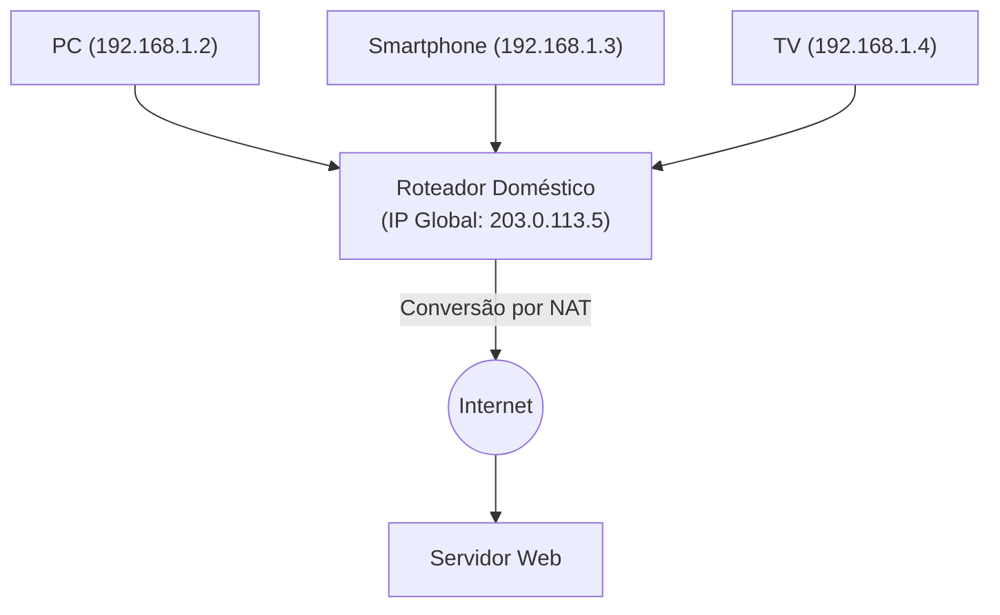

## 1. O Papel do "Endereço" na Internet

Os computadores e smartphones em todo o mundo conectados à Internet podem enviar dados uns aos outros sem erros porque cada dispositivo recebe um "endereço" único no mundo.
Esse endereço na rede é chamado de "**Endereço IP (Internet Protocol Address)**".

Quando acessamos o "servidor do Google", o navegador, nos bastidores invisíveis, envia pacotes com destino a uma sequência de números como "142.250.196.110" (endereço IP).
O sistema de endereçamento que há muito tempo sustenta a Internet é o "**IPv4 (Internet Protocol version 4)**". No entanto, atualmente, este IPv4 enfrenta limites sistêmicos severos, e um enorme projeto de migração para a próxima geração, o "**IPv6**", está em andamento em escala global.

## 2. O Nascimento do IPv4 e o "Limite de 4,3 Bilhões"

O IPv4 foi padronizado em 1981 (RFC 791), nos primórdios da Internet.
O endereço IPv4 é representado por uma quantidade de dados de "**32 bits**". 32 bits significa "uma combinação de 0 e 1 com 32 dígitos" e, ao calcular, temos $2^{32} = 4,294,967,296$, ou seja, é possível criar **cerca de 4,3 bilhões** de endereços.

A Internet da época era uma rede de pequena escala utilizada apenas por algumas universidades, instituições militares e grandes corporações. Os projetistas pensavam: "Mesmo que toda a humanidade na Terra seja de alguns bilhões de pessoas, com 4,3 bilhões de endereços, eles nunca se esgotarão na eternidade."

No entanto, com a explosiva popularização da World Wide Web na década de 1990, o surgimento dos smartphones na década de 2000 e a chegada da atual era da IoT (Internet of Things: uma era onde até eletrodomésticos e carros estão conectados à rede), essa estimativa se mostrou completamente errada.
Com uma pessoa consumindo múltiplos endereços IP por meio de PCs, smartphones, tablets e smartwatches, os 4,3 bilhões de endereços foram consumidos em um piscar de olhos.

Em fevereiro de 2011, a IANA (Internet Assigned Numbers Authority), organização central que gerencia os endereços IP do mundo, concluiu a alocação de seu "último estoque central de endereços IPv4" para as organizações regionais e declarou o **esgotamento total do estoque central**.

## 3. Medida de Sobrevivência: NAT e Endereços IP Privados

Normalmente, a Internet deveria ter entrado em pânico no momento do esgotamento, mas o fato de podermos usar a Internet normalmente hoje se deve à tecnologia de prolongamento de vida chamada "**NAT (Network Address Translation)**".

O NAT é uma tecnologia que aloca apenas um "endereço IP global", que é um endereço único no mundo, para o roteador de cada residência ou empresa, e reutiliza os "endereços IP privados (ex: 192.168.1.x)", que são "endereços próprios válidos apenas internamente", no lado de dentro do roteador (dentro de casa).

O roteador envia todas as solicitações dos dispositivos dentro de casa para a Internet em seu nome, como "solicitações de si mesmo (o roteador)", e distribui corretamente as respostas recebidas para cada dispositivo dentro de casa.
Esse mecanismo tornou possível conectar dezenas de dispositivos à Internet com apenas um endereço IP global, e a crise de esgotamento do IPv4 foi drasticamente adiada. No entanto, esta não foi uma solução fundamental, e criou desvantagens como o atraso de processamento devido ao NAT e a dificuldade na comunicação P2P (como comunicação direta em jogos online).

## 4. A Solução Definitiva: O Surgimento do "IPv6"

O protocolo de próxima geração projetado para resolver fundamentalmente este problema de esgotamento é o "**IPv6 (Internet Protocol version 6)**".

A maior característica do IPv6 está na vasta imensidão de seu espaço de endereçamento.
Em contraste com os "32 bits" do IPv4, o IPv6 possui um espaço de endereçamento de "**128 bits**".
Calculando, resulta em $2^{128}$, permitindo a emissão de um número que desafia a imaginação humana de endereços, cerca de "**340 undecilhões**" (340 trilhões de vezes 1 trilhão de vezes 1 trilhão).

Este é um número astronômico ao ponto de se dizer que "mesmo se atribuíssemos um endereço IP a cada grão de areia na Terra, ainda sobrariam endereços".
O formato de representação também mudou do sistema decimal, como o `192.168.1.1` do IPv4, para um formato hexadecimal separado por dois-pontos, como `2001:0db8:85a3:0000:0000:8a2e:0370:7334`.

### Benefícios trazidos pelo IPv6
1. **O NAT torna-se desnecessário**
   Como existe uma quantidade quase infinita de endereços, é possível atribuir diretamente um endereço IP global único no mundo para cada lâmpada dentro de casa. A conversão complexa de endereços (NAT) nos roteadores torna-se desnecessária, permitindo que os dispositivos se comuniquem diretamente em alta velocidade.
2. **Padronização da Segurança (IPsec)**
   O IPsec, uma função de segurança que realiza a criptografia da comunicação e a detecção de adulterações, é incorporado como padrão, melhorando a segurança no nível da camada de rede.
3. **Eficiência no Roteamento**
   Como a estrutura dos endereços é organizada de forma hierárquica, o processamento de seleção de rotas (roteamento) quando os roteadores na Internet encaminham os pacotes torna-se mais leve, reduzindo o atraso na comunicação.

## 5. A Difusão do IPv6 no Japão e o "IPoE"

Embora o IPv6 seja tecnicamente perfeito, sua difusão levou tempo. A maior barreira foi o fato de que "**IPv4 e IPv6 não são compatíveis (não podem conversar diretamente)**". Não é possível visualizar um site que suporta apenas IPv4 a partir de um PC que suporta IPv6. Portanto, as operadoras de telecomunicações e os provedores foram forçados a arcar com os enormes custos de operar as duas redes paralelamente (pilha dupla / dual stack).

No entanto, nos últimos anos, a difusão do IPv6 no Japão avançou de forma explosiva, à frente do resto do mundo, por um motivo único. Isso se deve à aceleração da comunicação através do método "**IPoE (IPv6 IPoE)**".

A conexão tradicional à Internet no Japão (método PPPoE) apresentava o problema de que, à noite, ocorria um congestionamento severo na parte do "equipamento de terminação de rede" do provedor, e a velocidade de comunicação caía drasticamente.
Em contraste, ao usar o novo método de conexão "IPoE", tornou-se possível contornar esse ponto de grande congestionamento e passar diretamente para a rede de próxima geração, que é ampla e vazia. A condição para usar esse "método IPoE" era "ser comunicação IPv6", de modo que muitos usuários iniciaram um movimento de "adotar roteadores compatíveis com IPv6 para tornar a Internet mais rápida", e como resultado, a taxa de adoção do IPv6 no Japão saltou para as posições mais altas do mundo.

## 6. Conclusão: A Grande e Silenciosa Migração de Infraestrutura

A atualização da versão do protocolo IP, que é a base da Internet, é como trocar o motor de um carro em alta velocidade, e é um projeto extremamente difícil.
No entanto, graças aos longos anos de esforço de empresas de TI globais como Google e Netflix, operadoras de telecomunicações e fabricantes de roteadores, a taxa de adoção do IPv6 tem aumentado de forma constante, e atualmente grande parte do tráfego mundial já flui em IPv6.

Tendo superado a crise sistêmica do esgotamento de 4,3 bilhões e adquirido um espaço infinito de 340 undecilhões, a Internet está pronta para continuar sua evolução como base para a era da IoT, cidades inteligentes e condução autônoma, onde todas as coisas estarão conectadas à rede no futuro.
