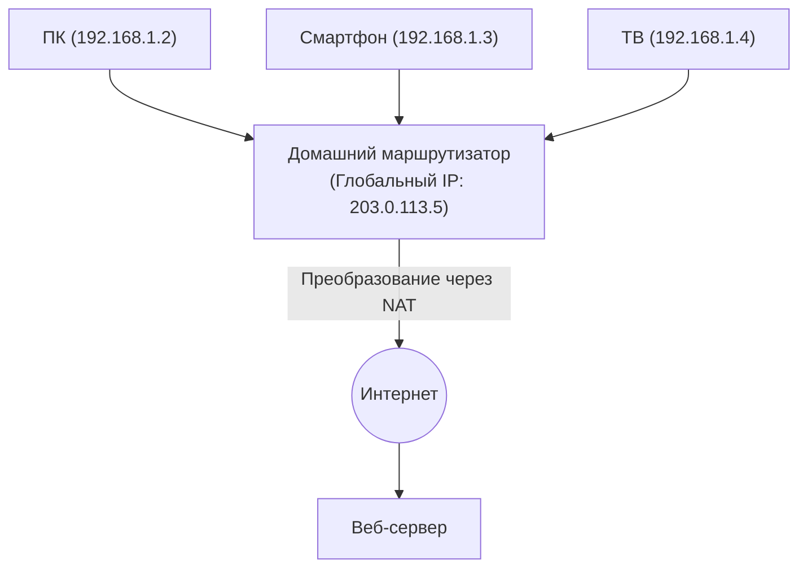

## 1. Роль «адресов» в интернете

Компьютеры и смартфоны по всему миру, подключенные к интернету, могут безошибочно отправлять данные друг другу благодаря тому, что каждому устройству присвоен уникальный глобальный «адрес».
Этот сетевой адрес называется «**IP-адресом (Internet Protocol Address)**».

Когда мы обращаемся к «серверам Google», наш браузер незаметно для нас отправляет пакеты (посылки) данных по месту назначения, представляющему собой ряд цифр (IP-адрес), например, «142.250.196.110».
Эта система адресации, которая долгое время поддерживала интернет, называется «**IPv4 (Internet Protocol version 4)**». Однако сейчас IPv4 столкнулся с серьезными системными ограничениями, и в глобальном масштабе реализуется масштабный проект по переходу на следующее поколение — «**IPv6**».

## 2. Рождение IPv4 и «ограничение в 4,3 миллиарда»

IPv4 был стандартизирован на заре развития интернета, в 1981 году (RFC 791).
Адреса IPv4 представлены объемом данных в «**32 бита**». 32 бита означают «комбинацию нулей и единиц длиной 32 разряда». По расчетам $2^{32} = 4,294,967,296$, то есть можно создать **около 4,3 миллиарда** адресов.

В то время интернет был небольшой сетью, которую использовали только некоторые университеты, военные организации и крупные корпорации. Разработчики полагали: «Даже если всё население Земли составляет несколько миллиардов человек, с 4,3 миллиарда адресов они никогда не закончатся».

Однако взрывной рост популярности World Wide Web в 1990-х годах, появление смартфонов в 2000-х и наступление нынешней эры IoT (интернета вещей: эпохи, когда к сети подключаются даже бытовая техника и автомобили) полностью разрушили эти расчеты.
Поскольку один человек начал потреблять несколько IP-адресов для ПК, смартфона, планшета и смарт-часов, 4,3 миллиарда адресов были мгновенно исчерпаны.

В феврале 2011 года IANA (Internet Assigned Numbers Authority), центральная организация, управляющая IP-адресами в мире, завершила распределение «последних центральных запасов адресов IPv4» между региональными организациями и, наконец, объявила о **полном истощении центрального пула**.

## 3. Меры по продлению жизни: NAT и частные IP-адреса

В идеале в момент истощения адресов в интернете должна была начаться паника, но сегодня мы по-прежнему можем нормально пользоваться сетью благодаря технологии продления жизни, которая называется «**NAT (Network Address Translation)**».

NAT — это технология, при которой только один «глобальный IP-адрес», являющийся уникальным во всем мире адресом, назначается маршрутизатору каждого дома или компании, а внутри маршрутизатора (в доме) используется «частный IP-адрес (например: 192.168.1.x)», который представляет собой «локальный адрес, понятный только своим».

Маршрутизатор действует как посредник, отправляя все запросы от устройств внутри дома в интернет как «запросы от себя (маршрутизатора)», а затем правильно распределяет полученные ответы по устройствам внутри дома.
Этот механизм позволил подключать к сети десятки устройств с использованием всего одного глобального IP-адреса, тем самым значительно отсрочив кризис истощения IPv4. Однако это не было фундаментальным решением и породило такие недостатки, как задержки обработки из-за NAT и сложности в P2P-коммуникациях (например, прямая связь в онлайн-играх).

## 4. Окончательное решение: появление «IPv6»

Протоколом следующего поколения, разработанным для решения этой фундаментальной проблемы истощения, является «**IPv6 (Internet Protocol version 6)**».

Главная особенность IPv6 — это подавляющая обширность адресного пространства.
По сравнению с «32 битами» в IPv4, IPv6 имеет «**128 бит**» адресного пространства.
При расчете $2^{128}$ получается, что можно выпустить около «**340 ундециллионов**» (340 триллионов раз по триллиону триллионов) адресов, что выходит за рамки человеческого воображения.

Это астрономическое число, о котором говорят: «Даже если назначить IP-адрес каждой песчинке на Земле, всё равно останутся свободные адреса».
Формат записи также изменился: от десятичных чисел в IPv4, таких как `192.168.1.1`, к шестнадцатеричным числам, разделенным двоеточиями, например, `2001:0db8:85a3:0000:0000:8a2e:0370:7334`.

### Преимущества, которые дает IPv6
1. **Отсутствие необходимости в NAT**
   Благодаря почти бесконечному количеству адресов, даже каждой лампочке в доме можно напрямую назначить уникальный глобальный IP-адрес. Отпадает необходимость в сложных преобразованиях адресов (NAT) на маршрутизаторе, и устройства могут напрямую и быстро обмениваться данными друг с другом.
2. **Стандартизация безопасности (IPsec)**
   Функция безопасности под названием IPsec, которая шифрует связь и обнаруживает вмешательства, встроена по умолчанию, что повышает безопасность на сетевом уровне.
3. **Повышение эффективности маршрутизации**
   Поскольку структура адреса организована иерархически, процесс выбора маршрута (маршрутизация) маршрутизаторами в интернете при пересылке пакетов становится легче, и задержка связи уменьшается.

## 5. Распространение IPv6 в Японии и «IPoE»

Хотя IPv6 технически совершенен, его распространение заняло время. Самым большим препятствием стало то, что «**IPv4 и IPv6 несовместимы (не могут напрямую общаться друг с другом)**». С ПК, поддерживающего IPv6, невозможно просматривать веб-сайты, которые поддерживают только IPv4. В результате телекоммуникационные операторы и провайдеры были вынуждены нести огромные расходы на параллельную эксплуатацию обеих сетей (двойной стек).

Однако в последние годы распространение IPv6 в Японии росло взрывными темпами быстрее, чем где-либо в мире, по уникальной причине. Этой причиной стало ускорение связи за счет «**метода IPoE (IPv6 IPoE)**».

Традиционные интернет-подключения в Японии (метод PPPoE) имели проблему, из-за которой в ночное время происходили сильные перегрузки в «устройствах окончания сети» провайдеров, и скорость связи резко падала.
Напротив, использование нового метода подключения «IPoE» позволило обойти эти узкие места сильных перегрузок и проходить напрямую через широкие и свободные сети следующего поколения. Поскольку условием использования этого «метода IPoE» была «передача данных по IPv6», возникло движение, при котором многие пользователи стали устанавливать маршрутизаторы с поддержкой IPv6, «чтобы ускорить интернет». В результате уровень проникновения IPv6 в Японии взлетел на одни из самых высоких позиций в мире.

## 6. Заключение: тихий масштабный переход инфраструктуры

Обновление версии IP-протокола, который является фундаментом интернета, похоже на замену двигателя в быстро движущемся автомобиле, что представляет собой крайне сложный проект.
Однако благодаря многолетним усилиям глобальных ИТ-компаний, таких как Google и Netflix, телекоммуникационных операторов и производителей маршрутизаторов, уровень проникновения IPv6 неуклонно растет, и сегодня большая часть мирового трафика уже передается по IPv6.

Преодолев системный кризис исчерпания 4,3 миллиарда адресов и получив бесконечное пространство в 340 ундециллионов, интернет готов продолжать свое развитие в качестве основы для эры IoT, когда все вещи будут подключены к сети, а также для умных городов и автономного вождения.
