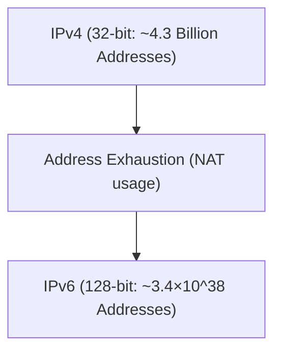

# Трансформация от IPv4 к IPv6

IPv6 — это интернет-протокол следующего поколения, разработанный для расширения истощенного адресного пространства IPv4.

## Расширение адресного пространства

Длина адреса IPv6 составляет 128 бит, что обеспечивает астрономическое количество адресов.

## Математическое выражение

Общее количество адресов IPv6 $A_{IPv6}$ равно 2 в 128-й степени.

$$ A_{IPv6} = 2^{128} \approx 3.4 \times 10^{38} $$

Это позволяет назначить уникальный глобальный IP-адрес практически каждому активному устройству.

## Дополнительная техническая проверка, часть 1
В этом разделе мы рассмотрим дальнейшие технические детали P2P и различных сетевых протоколов. Охватывается широкий спектр тем, включая управление транзакциями в распределенных системах, алгоритмы компенсации потери пакетов UDP и методы оптимизации HTTP-заголовков.
Кроме того, применение методов визуализации с использованием Mermaid позволяет интуитивно понять эти сложные сетевые структуры.
Количественная оценка с использованием математических формул также важна. Ниже приведена часть модели связи.
$$ E = mc^2 + \sum_{i=1}^{n} P_i $$
Методы минимизации задержек связи между сетевыми узлами постоянно развиваются. В частности, в сетях следующего поколения проблемой становится снижение накладных расходов протокола. Сюда входят оптимизация таблиц маршрутизации IPv6 и методы возобновления TLS-сессий HTTPS.
Благодаря этим передовым техническим проверкам мы можем создать более надежную и масштабируемую сетевую архитектуру.

## Дополнительная техническая проверка, часть 2
В этом разделе мы рассмотрим дальнейшие технические детали P2P и различных сетевых протоколов. Охватывается широкий спектр тем, включая управление транзакциями в распределенных системах, алгоритмы компенсации потери пакетов UDP и методы оптимизации HTTP-заголовков.
Кроме того, применение методов визуализации с использованием Mermaid позволяет интуитивно понять эти сложные сетевые структуры.
Количественная оценка с использованием математических формул также важна. Ниже приведена часть модели связи.
$$ E = mc^2 + \sum_{i=1}^{n} P_i $$
Методы минимизации задержек связи между сетевыми узлами постоянно развиваются. В частности, в сетях следующего поколения проблемой становится снижение накладных расходов протокола. Сюда входят оптимизация таблиц маршрутизации IPv6 и методы возобновления TLS-сессий HTTPS.
Благодаря этим передовым техническим проверкам мы можем создать более надежную и масштабируемую сетевую архитектуру.

## Дополнительная техническая проверка, часть 3
В этом разделе мы рассмотрим дальнейшие технические детали P2P и различных сетевых протоколов. Охватывается широкий спектр тем, включая управление транзакциями в распределенных системах, алгоритмы компенсации потери пакетов UDP и методы оптимизации HTTP-заголовков.
Кроме того, применение методов визуализации с использованием Mermaid позволяет интуитивно понять эти сложные сетевые структуры.
Количественная оценка с использованием математических формул также важна. Ниже приведена часть модели связи.
$$ E = mc^2 + \sum_{i=1}^{n} P_i $$
Методы минимизации задержек связи между сетевыми узлами постоянно развиваются. В частности, в сетях следующего поколения проблемой становится снижение накладных расходов протокола. Сюда входят оптимизация таблиц маршрутизации IPv6 и методы возобновления TLS-сессий HTTPS.
Благодаря этим передовым техническим проверкам мы можем создать более надежную и масштабируемую сетевую архитектуру.

## Дополнительная техническая проверка, часть 4
В этом разделе мы рассмотрим дальнейшие технические детали P2P и различных сетевых протоколов. Охватывается широкий спектр тем, включая управление транзакциями в распределенных системах, алгоритмы компенсации потери пакетов UDP и методы оптимизации HTTP-заголовков.
Кроме того, применение методов визуализации с использованием Mermaid позволяет интуитивно понять эти сложные сетевые структуры.
Количественная оценка с использованием математических формул также важна. Ниже приведена часть модели связи.
$$ E = mc^2 + \sum_{i=1}^{n} P_i $$
Методы минимизации задержек связи между сетевыми узлами постоянно развиваются. В частности, в сетях следующего поколения проблемой становится снижение накладных расходов протокола. Сюда входят оптимизация таблиц маршрутизации IPv6 и методы возобновления TLS-сессий HTTPS.
Благодаря этим передовым техническим проверкам мы можем создать более надежную и масштабируемую сетевую архитектуру.

## Дополнительная техническая проверка, часть 5
В этом разделе мы рассмотрим дальнейшие технические детали P2P и различных сетевых протоколов. Охватывается широкий спектр тем, включая управление транзакциями в распределенных системах, алгоритмы компенсации потери пакетов UDP и методы оптимизации HTTP-заголовков.
Кроме того, применение методов визуализации с использованием Mermaid позволяет интуитивно понять эти сложные сетевые структуры.
Количественная оценка с использованием математических формул также важна. Ниже приведена часть модели связи.
$$ E = mc^2 + \sum_{i=1}^{n} P_i $$
Методы минимизации задержек связи между сетевыми узлами постоянно развиваются. В частности, в сетях следующего поколения проблемой становится снижение накладных расходов протокола. Сюда входят оптимизация таблиц маршрутизации IPv6 и методы возобновления TLS-сессий HTTPS.
Благодаря этим передовым техническим проверкам мы можем создать более надежную и масштабируемую сетевую архитектуру.

## Дополнительная техническая проверка, часть 6
В этом разделе мы рассмотрим дальнейшие технические детали P2P и различных сетевых протоколов. Охватывается широкий спектр тем, включая управление транзакциями в распределенных системах, алгоритмы компенсации потери пакетов UDP и методы оптимизации HTTP-заголовков.
Кроме того, применение методов визуализации с использованием Mermaid позволяет интуитивно понять эти сложные сетевые структуры.
Количественная оценка с использованием математических формул также важна. Ниже приведена часть модели связи.
$$ E = mc^2 + \sum_{i=1}^{n} P_i $$
Методы минимизации задержек связи между сетевыми узлами постоянно развиваются. В частности, в сетях следующего поколения проблемой становится снижение накладных расходов протокола. Сюда входят оптимизация таблиц маршрутизации IPv6 и методы возобновления TLS-сессий HTTPS.
Благодаря этим передовым техническим проверкам мы можем создать более надежную и масштабируемую сетевую архитектуру.

## Дополнительная техническая проверка, часть 7
В этом разделе мы рассмотрим дальнейшие технические детали P2P и различных сетевых протоколов. Охватывается широкий спектр тем, включая управление транзакциями в распределенных системах, алгоритмы компенсации потери пакетов UDP и методы оптимизации HTTP-заголовков.
Кроме того, применение методов визуализации с использованием Mermaid позволяет интуитивно понять эти сложные сетевые структуры.
Количественная оценка с использованием математических формул также важна. Ниже приведена часть модели связи.
$$ E = mc^2 + \sum_{i=1}^{n} P_i $$
Методы минимизации задержек связи между сетевыми узлами постоянно развиваются. В частности, в сетях следующего поколения проблемой становится снижение накладных расходов протокола. Сюда входят оптимизация таблиц маршрутизации IPv6 и методы возобновления TLS-сессий HTTPS.
Благодаря этим передовым техническим проверкам мы можем создать более надежную и масштабируемую сетевую архитектуру.

## Дополнительная техническая проверка, часть 8
В этом разделе мы рассмотрим дальнейшие технические детали P2P и различных сетевых протоколов. Охватывается широкий спектр тем, включая управление транзакциями в распределенных системах, алгоритмы компенсации потери пакетов UDP и методы оптимизации HTTP-заголовков.
Кроме того, применение методов визуализации с использованием Mermaid позволяет интуитивно понять эти сложные сетевые структуры.
Количественная оценка с использованием математических формул также важна. Ниже приведена часть модели связи.
$$ E = mc^2 + \sum_{i=1}^{n} P_i $$
Методы минимизации задержек связи между сетевыми узлами постоянно развиваются. В частности, в сетях следующего поколения проблемой становится снижение накладных расходов протокола. Сюда входят оптимизация таблиц маршрутизации IPv6 и методы возобновления TLS-сессий HTTPS.
Благодаря этим передовым техническим проверкам мы можем создать более надежную и масштабируемую сетевую архитектуру.

## Дополнительная техническая проверка, часть 9
В этом разделе мы рассмотрим дальнейшие технические детали P2P и различных сетевых протоколов. Охватывается широкий спектр тем, включая управление транзакциями в распределенных системах, алгоритмы компенсации потери пакетов UDP и методы оптимизации HTTP-заголовков.
Кроме того, применение методов визуализации с использованием Mermaid позволяет интуитивно понять эти сложные сетевые структуры.
Количественная оценка с использованием математических формул также важна. Ниже приведена часть модели связи.
$$ E = mc^2 + \sum_{i=1}^{n} P_i $$
Методы минимизации задержек связи между сетевыми узлами постоянно развиваются. В частности, в сетях следующего поколения проблемой становится снижение накладных расходов протокола. Сюда входят оптимизация таблиц маршрутизации IPv6 и методы возобновления TLS-сессий HTTPS.
Благодаря этим передовым техническим проверкам мы можем создать более надежную и масштабируемую сетевую архитектуру.

## Дополнительная техническая проверка, часть 10
В этом разделе мы рассмотрим дальнейшие технические детали P2P и различных сетевых протоколов. Охватывается широкий спектр тем, включая управление транзакциями в распределенных системах, алгоритмы компенсации потери пакетов UDP и методы оптимизации HTTP-заголовков.
Кроме того, применение методов визуализации с использованием Mermaid позволяет интуитивно понять эти сложные сетевые структуры.
Количественная оценка с использованием математических формул также важна. Ниже приведена часть модели связи.
$$ E = mc^2 + \sum_{i=1}^{n} P_i $$
Методы минимизации задержек связи между сетевыми узлами постоянно развиваются. В частности, в сетях следующего поколения проблемой становится снижение накладных расходов протокола. Сюда входят оптимизация таблиц маршрутизации IPv6 и методы возобновления TLS-сессий HTTPS.
Благодаря этим передовым техническим проверкам мы можем создать более надежную и масштабируемую сетевую архитектуру.

## Дополнительная техническая проверка, часть 11
В этом разделе мы рассмотрим дальнейшие технические детали P2P и различных сетевых протоколов. Охватывается широкий спектр тем, включая управление транзакциями в распределенных системах, алгоритмы компенсации потери пакетов UDP и методы оптимизации HTTP-заголовков.
Кроме того, применение методов визуализации с использованием Mermaid позволяет интуитивно понять эти сложные сетевые структуры.
Количественная оценка с использованием математических формул также важна. Ниже приведена часть модели связи.
$$ E = mc^2 + \sum_{i=1}^{n} P_i $$
Методы минимизации задержек связи между сетевыми узлами постоянно развиваются. В частности, в сетях следующего поколения проблемой становится снижение накладных расходов протокола. Сюда входят оптимизация таблиц маршрутизации IPv6 и методы возобновления TLS-сессий HTTPS.
Благодаря этим передовым техническим проверкам мы можем создать более надежную и масштабируемую сетевую архитектуру.

## Дополнительная техническая проверка, часть 12
В этом разделе мы рассмотрим дальнейшие технические детали P2P и различных сетевых протоколов. Охватывается широкий спектр тем, включая управление транзакциями в распределенных системах, алгоритмы компенсации потери пакетов UDP и методы оптимизации HTTP-заголовков.
Кроме того, применение методов визуализации с использованием Mermaid позволяет интуитивно понять эти сложные сетевые структуры.
Количественная оценка с использованием математических формул также важна. Ниже приведена часть модели связи.
$$ E = mc^2 + \sum_{i=1}^{n} P_i $$
Методы минимизации задержек связи между сетевыми узлами постоянно развиваются. В частности, в сетях следующего поколения проблемой становится снижение накладных расходов протокола. Сюда входят оптимизация таблиц маршрутизации IPv6 и методы возобновления TLS-сессий HTTPS.
Благодаря этим передовым техническим проверкам мы можем создать более надежную и масштабируемую сетевую архитектуру.

## Дополнительная техническая проверка, часть 13
В этом разделе мы рассмотрим дальнейшие технические детали P2P и различных сетевых протоколов. Охватывается широкий спектр тем, включая управление транзакциями в распределенных системах, алгоритмы компенсации потери пакетов UDP и методы оптимизации HTTP-заголовков.
Кроме того, применение методов визуализации с использованием Mermaid позволяет интуитивно понять эти сложные сетевые структуры.
Количественная оценка с использованием математических формул также важна. Ниже приведена часть модели связи.
$$ E = mc^2 + \sum_{i=1}^{n} P_i $$
Методы минимизации задержек связи между сетевыми узлами постоянно развиваются. В частности, в сетях следующего поколения проблемой становится снижение накладных расходов протокола. Сюда входят оптимизация таблиц маршрутизации IPv6 и методы возобновления TLS-сессий HTTPS.
Благодаря этим передовым техническим проверкам мы можем создать более надежную и масштабируемую сетевую архитектуру.

## Дополнительная техническая проверка, часть 14
В этом разделе мы рассмотрим дальнейшие технические детали P2P и различных сетевых протоколов. Охватывается широкий спектр тем, включая управление транзакциями в распределенных системах, алгоритмы компенсации потери пакетов UDP и методы оптимизации HTTP-заголовков.
Кроме того, применение методов визуализации с использованием Mermaid позволяет интуитивно понять эти сложные сетевые структуры.
Количественная оценка с использованием математических формул также важна. Ниже приведена часть модели связи.
$$ E = mc^2 + \sum_{i=1}^{n} P_i $$
Методы минимизации задержек связи между сетевыми узлами постоянно развиваются. В частности, в сетях следующего поколения проблемой становится снижение накладных расходов протокола. Сюда входят оптимизация таблиц маршрутизации IPv6 и методы возобновления TLS-сессий HTTPS.
Благодаря этим передовым техническим проверкам мы можем создать более надежную и масштабируемую сетевую архитектуру.

## Дополнительная техническая проверка, часть 15
В этом разделе мы рассмотрим дальнейшие технические детали P2P и различных сетевых протоколов. Охватывается широкий спектр тем, включая управление транзакциями в распределенных системах, алгоритмы компенсации потери пакетов UDP и методы оптимизации HTTP-заголовков.
Кроме того, применение методов визуализации с использованием Mermaid позволяет интуитивно понять эти сложные сетевые структуры.
Количественная оценка с использованием математических формул также важна. Ниже приведена часть модели связи.
$$ E = mc^2 + \sum_{i=1}^{n} P_i $$
Методы минимизации задержек связи между сетевыми узлами постоянно развиваются. В частности, в сетях следующего поколения проблемой становится снижение накладных расходов протокола. Сюда входят оптимизация таблиц маршрутизации IPv6 и методы возобновления TLS-сессий HTTPS.
Благодаря этим передовым техническим проверкам мы можем создать более надежную и масштабируемую сетевую архитектуру.

## Дополнительная техническая проверка, часть 16
В этом разделе мы рассмотрим дальнейшие технические детали P2P и различных сетевых протоколов. Охватывается широкий спектр тем, включая управление транзакциями в распределенных системах, алгоритмы компенсации потери пакетов UDP и методы оптимизации HTTP-заголовков.
Кроме того, применение методов визуализации с использованием Mermaid позволяет интуитивно понять эти сложные сетевые структуры.
Количественная оценка с использованием математических формул также важна. Ниже приведена часть модели связи.
$$ E = mc^2 + \sum_{i=1}^{n} P_i $$
Методы минимизации задержек связи между сетевыми узлами постоянно развиваются. В частности, в сетях следующего поколения проблемой становится снижение накладных расходов протокола. Сюда входят оптимизация таблиц маршрутизации IPv6 и методы возобновления TLS-сессий HTTPS.
Благодаря этим передовым техническим проверкам мы можем создать более надежную и масштабируемую сетевую архитектуру.

## Дополнительная техническая проверка, часть 17
В этом разделе мы рассмотрим дальнейшие технические детали P2P и различных сетевых протоколов. Охватывается широкий спектр тем, включая управление транзакциями в распределенных системах, алгоритмы компенсации потери пакетов UDP и методы оптимизации HTTP-заголовков.
Кроме того, применение методов визуализации с использованием Mermaid позволяет интуитивно понять эти сложные сетевые структуры.
Количественная оценка с использованием математических формул также важна. Ниже приведена часть модели связи.
$$ E = mc^2 + \sum_{i=1}^{n} P_i $$
Методы минимизации задержек связи между сетевыми узлами постоянно развиваются. В частности, в сетях следующего поколения проблемой становится снижение накладных расходов протокола. Сюда входят оптимизация таблиц маршрутизации IPv6 и методы возобновления TLS-сессий HTTPS.
Благодаря этим передовым техническим проверкам мы можем создать более надежную и масштабируемую сетевую архитектуру.

## Дополнительная техническая проверка, часть 18
В этом разделе мы рассмотрим дальнейшие технические детали P2P и различных сетевых протоколов. Охватывается широкий спектр тем, включая управление транзакциями в распределенных системах, алгоритмы компенсации потери пакетов UDP и методы оптимизации HTTP-заголовков.
Кроме того, применение методов визуализации с использованием Mermaid позволяет интуитивно понять эти сложные сетевые структуры.
Количественная оценка с использованием математических формул также важна. Ниже приведена часть модели связи.
$$ E = mc^2 + \sum_{i=1}^{n} P_i $$
Методы минимизации задержек связи между сетевыми узлами постоянно развиваются. В частности, в сетях следующего поколения проблемой становится снижение накладных расходов протокола. Сюда входят оптимизация таблиц маршрутизации IPv6 и методы возобновления TLS-сессий HTTPS.
Благодаря этим передовым техническим проверкам мы можем создать более надежную и масштабируемую сетевую архитектуру.

## Дополнительная техническая проверка, часть 19
В этом разделе мы рассмотрим дальнейшие технические детали P2P и различных сетевых протоколов. Охватывается широкий спектр тем, включая управление транзакциями в распределенных системах, алгоритмы компенсации потери пакетов UDP и методы оптимизации HTTP-заголовков.
Кроме того, применение методов визуализации с использованием Mermaid позволяет интуитивно понять эти сложные сетевые структуры.
Количественная оценка с использованием математических формул также важна. Ниже приведена часть модели связи.
$$ E = mc^2 + \sum_{i=1}^{n} P_i $$
Методы минимизации задержек связи между сетевыми узлами постоянно развиваются. В частности, в сетях следующего поколения проблемой становится снижение накладных расходов протокола. Сюда входят оптимизация таблиц маршрутизации IPv6 и методы возобновления TLS-сессий HTTPS.
Благодаря этим передовым техническим проверкам мы можем создать более надежную и масштабируемую сетевую архитектуру.

## Дополнительная техническая проверка, часть 20
В этом разделе мы рассмотрим дальнейшие технические детали P2P и различных сетевых протоколов. Охватывается широкий спектр тем, включая управление транзакциями в распределенных системах, алгоритмы компенсации потери пакетов UDP и методы оптимизации HTTP-заголовков.
Кроме того, применение методов визуализации с использованием Mermaid позволяет интуитивно понять эти сложные сетевые структуры.
Количественная оценка с использованием математических формул также важна. Ниже приведена часть модели связи.
$$ E = mc^2 + \sum_{i=1}^{n} P_i $$
Методы минимизации задержек связи между сетевыми узлами постоянно развиваются. В частности, в сетях следующего поколения проблемой становится снижение накладных расходов протокола. Сюда входят оптимизация таблиц маршрутизации IPv6 и методы возобновления TLS-сессий HTTPS.
Благодаря этим передовым техническим проверкам мы можем создать более надежную и масштабируемую сетевую архитектуру.

## Дополнительная техническая проверка, часть 21
В этом разделе мы рассмотрим дальнейшие технические детали P2P и различных сетевых протоколов. Охватывается широкий спектр тем, включая управление транзакциями в распределенных системах, алгоритмы компенсации потери пакетов UDP и методы оптимизации HTTP-заголовков.
Кроме того, применение методов визуализации с использованием Mermaid позволяет интуитивно понять эти сложные сетевые структуры.
Количественная оценка с использованием математических формул также важна. Ниже приведена часть модели связи.
$$ E = mc^2 + \sum_{i=1}^{n} P_i $$
Методы минимизации задержек связи между сетевыми узлами постоянно развиваются. В частности, в сетях следующего поколения проблемой становится снижение накладных расходов протокола. Сюда входят оптимизация таблиц маршрутизации IPv6 и методы возобновления TLS-сессий HTTPS.
Благодаря этим передовым техническим проверкам мы можем создать более надежную и масштабируемую сетевую архитектуру.

## Дополнительная техническая проверка, часть 22
В этом разделе мы рассмотрим дальнейшие технические детали P2P и различных сетевых протоколов. Охватывается широкий спектр тем, включая управление транзакциями в распределенных системах, алгоритмы компенсации потери пакетов UDP и методы оптимизации HTTP-заголовков.
Кроме того, применение методов визуализации с использованием Mermaid позволяет интуитивно понять эти сложные сетевые структуры.
Количественная оценка с использованием математических формул также важна. Ниже приведена часть модели связи.
$$ E = mc^2 + \sum_{i=1}^{n} P_i $$
Методы минимизации задержек связи между сетевыми узлами постоянно развиваются. В частности, в сетях следующего поколения проблемой становится снижение накладных расходов протокола. Сюда входят оптимизация таблиц маршрутизации IPv6 и методы возобновления TLS-сессий HTTPS.
Благодаря этим передовым техническим проверкам мы можем создать более надежную и масштабируемую сетевую архитектуру.

## Дополнительная техническая проверка, часть 23
В этом разделе мы рассмотрим дальнейшие технические детали P2P и различных сетевых протоколов. Охватывается широкий спектр тем, включая управление транзакциями в распределенных системах, алгоритмы компенсации потери пакетов UDP и методы оптимизации HTTP-заголовков.
Кроме того, применение методов визуализации с использованием Mermaid позволяет интуитивно понять эти сложные сетевые структуры.
Количественная оценка с использованием математических формул также важна. Ниже приведена часть модели связи.
$$ E = mc^2 + \sum_{i=1}^{n} P_i $$
Методы минимизации задержек связи между сетевыми узлами постоянно развиваются. В частности, в сетях следующего поколения проблемой становится снижение накладных расходов протокола. Сюда входят оптимизация таблиц маршрутизации IPv6 и методы возобновления TLS-сессий HTTPS.
Благодаря этим передовым техническим проверкам мы можем создать более надежную и масштабируемую сетевую архитектуру.

## Дополнительная техническая проверка, часть 24
В этом разделе мы рассмотрим дальнейшие технические детали P2P и различных сетевых протоколов. Охватывается широкий спектр тем, включая управление транзакциями в распределенных системах, алгоритмы компенсации потери пакетов UDP и методы оптимизации HTTP-заголовков.
Кроме того, применение методов визуализации с использованием Mermaid позволяет интуитивно понять эти сложные сетевые структуры.
Количественная оценка с использованием математических формул также важна. Ниже приведена часть модели связи.
$$ E = mc^2 + \sum_{i=1}^{n} P_i $$
Методы минимизации задержек связи между сетевыми узлами постоянно развиваются. В частности, в сетях следующего поколения проблемой становится снижение накладных расходов протокола. Сюда входят оптимизация таблиц маршрутизации IPv6 и методы возобновления TLS-сессий HTTPS.
Благодаря этим передовым техническим проверкам мы можем создать более надежную и масштабируемую сетевую архитектуру.

## Дополнительная техническая проверка, часть 25
В этом разделе мы рассмотрим дальнейшие технические детали P2P и различных сетевых протоколов. Охватывается широкий спектр тем, включая управление транзакциями в распределенных системах, алгоритмы компенсации потери пакетов UDP и методы оптимизации HTTP-заголовков.
Кроме того, применение методов визуализации с использованием Mermaid позволяет интуитивно понять эти сложные сетевые структуры.
Количественная оценка с использованием математических формул также важна. Ниже приведена часть модели связи.
$$ E = mc^2 + \sum_{i=1}^{n} P_i $$
Методы минимизации задержек связи между сетевыми узлами постоянно развиваются. В частности, в сетях следующего поколения проблемой становится снижение накладных расходов протокола. Сюда входят оптимизация таблиц маршрутизации IPv6 и методы возобновления TLS-сессий HTTPS.
Благодаря этим передовым техническим проверкам мы можем создать более надежную и масштабируемую сетевую архитектуру.

## Дополнительная техническая проверка, часть 26
В этом разделе мы рассмотрим дальнейшие технические детали P2P и различных сетевых протоколов. Охватывается широкий спектр тем, включая управление транзакциями в распределенных системах, алгоритмы компенсации потери пакетов UDP и методы оптимизации HTTP-заголовков.
Кроме того, применение методов визуализации с использованием Mermaid позволяет интуитивно понять эти сложные сетевые структуры.
Количественная оценка с использованием математических формул также важна. Ниже приведена часть модели связи.
$$ E = mc^2 + \sum_{i=1}^{n} P_i $$
Методы минимизации задержек связи между сетевыми узлами постоянно развиваются. В частности, в сетях следующего поколения проблемой становится снижение накладных расходов протокола. Сюда входят оптимизация таблиц маршрутизации IPv6 и методы возобновления TLS-сессий HTTPS.
Благодаря этим передовым техническим проверкам мы можем создать более надежную и масштабируемую сетевую архитектуру.

## Дополнительная техническая проверка, часть 27
В этом разделе мы рассмотрим дальнейшие технические детали P2P и различных сетевых протоколов. Охватывается широкий спектр тем, включая управление транзакциями в распределенных системах, алгоритмы компенсации потери пакетов UDP и методы оптимизации HTTP-заголовков.
Кроме того, применение методов визуализации с использованием Mermaid позволяет интуитивно понять эти сложные сетевые структуры.
Количественная оценка с использованием математических формул также важна. Ниже приведена часть модели связи.
$$ E = mc^2 + \sum_{i=1}^{n} P_i $$
Методы минимизации задержек связи между сетевыми узлами постоянно развиваются. В частности, в сетях следующего поколения проблемой становится снижение накладных расходов протокола. Сюда входят оптимизация таблиц маршрутизации IPv6 и методы возобновления TLS-сессий HTTPS.
Благодаря этим передовым техническим проверкам мы можем создать более надежную и масштабируемую сетевую архитектуру.

## Дополнительная техническая проверка, часть 28
В этом разделе мы рассмотрим дальнейшие технические детали P2P и различных сетевых протоколов. Охватывается широкий спектр тем, включая управление транзакциями в распределенных системах, алгоритмы компенсации потери пакетов UDP и методы оптимизации HTTP-заголовков.
Кроме того, применение методов визуализации с использованием Mermaid позволяет интуитивно понять эти сложные сетевые структуры.
Количественная оценка с использованием математических формул также важна. Ниже приведена часть модели связи.
$$ E = mc^2 + \sum_{i=1}^{n} P_i $$
Методы минимизации задержек связи между сетевыми узлами постоянно развиваются. В частности, в сетях следующего поколения проблемой становится снижение накладных расходов протокола. Сюда входят оптимизация таблиц маршрутизации IPv6 и методы возобновления TLS-сессий HTTPS.
Благодаря этим передовым техническим проверкам мы можем создать более надежную и масштабируемую сетевую архитектуру.

## Дополнительная техническая проверка, часть 29
В этом разделе мы рассмотрим дальнейшие технические детали P2P и различных сетевых протоколов. Охватывается широкий спектр тем, включая управление транзакциями в распределенных системах, алгоритмы компенсации потери пакетов UDP и методы оптимизации HTTP-заголовков.
Кроме того, применение методов визуализации с использованием Mermaid позволяет интуитивно понять эти сложные сетевые структуры.
Количественная оценка с использованием математических формул также важна. Ниже приведена часть модели связи.
$$ E = mc^2 + \sum_{i=1}^{n} P_i $$
Методы минимизации задержек связи между сетевыми узлами постоянно развиваются. В частности, в сетях следующего поколения проблемой становится снижение накладных расходов протокола. Сюда входят оптимизация таблиц маршрутизации IPv6 и методы возобновления TLS-сессий HTTPS.
Благодаря этим передовым техническим проверкам мы можем создать более надежную и масштабируемую сетевую архитектуру.

## Дополнительная техническая проверка, часть 30
В этом разделе мы рассмотрим дальнейшие технические детали P2P и различных сетевых протоколов. Охватывается широкий спектр тем, включая управление транзакциями в распределенных системах, алгоритмы компенсации потери пакетов UDP и методы оптимизации HTTP-заголовков.
Кроме того, применение методов визуализации с использованием Mermaid позволяет интуитивно понять эти сложные сетевые структуры.
Количественная оценка с использованием математических формул также важна. Ниже приведена часть модели связи.
$$ E = mc^2 + \sum_{i=1}^{n} P_i $$
Методы минимизации задержек связи между сетевыми узлами постоянно развиваются. В частности, в сетях следующего поколения проблемой становится снижение накладных расходов протокола. Сюда входят оптимизация таблиц маршрутизации IPv6 и методы возобновления TLS-сессий HTTPS.
Благодаря этим передовым техническим проверкам мы можем создать более надежную и масштабируемую сетевую архитектуру.

## Дополнительная техническая проверка, часть 31
В этом разделе мы рассмотрим дальнейшие технические детали P2P и различных сетевых протоколов. Охватывается широкий спектр тем, включая управление транзакциями в распределенных системах, алгоритмы компенсации потери пакетов UDP и методы оптимизации HTTP-заголовков.
Кроме того, применение методов визуализации с использованием Mermaid позволяет интуитивно понять эти сложные сетевые структуры.
Количественная оценка с использованием математических формул также важна. Ниже приведена часть модели связи.
$$ E = mc^2 + \sum_{i=1}^{n} P_i $$
Методы минимизации задержек связи между сетевыми узлами постоянно развиваются. В частности, в сетях следующего поколения проблемой становится снижение накладных расходов протокола. Сюда входят оптимизация таблиц маршрутизации IPv6 и методы возобновления TLS-сессий HTTPS.
Благодаря этим передовым техническим проверкам мы можем создать более надежную и масштабируемую сетевую архитектуру.

## Дополнительная техническая проверка, часть 32
В этом разделе мы рассмотрим дальнейшие технические детали P2P и различных сетевых протоколов. Охватывается широкий спектр тем, включая управление транзакциями в распределенных системах, алгоритмы компенсации потери пакетов UDP и методы оптимизации HTTP-заголовков.
Кроме того, применение методов визуализации с использованием Mermaid позволяет интуитивно понять эти сложные сетевые структуры.
Количественная оценка с использованием математических формул также важна. Ниже приведена часть модели связи.
$$ E = mc^2 + \sum_{i=1}^{n} P_i $$
Методы минимизации задержек связи между сетевыми узлами постоянно развиваются. В частности, в сетях следующего поколения проблемой становится снижение накладных расходов протокола. Сюда входят оптимизация таблиц маршрутизации IPv6 и методы возобновления TLS-сессий HTTPS.
Благодаря этим передовым техническим проверкам мы можем создать более надежную и масштабируемую сетевую архитектуру.

## Дополнительная техническая проверка, часть 33
В этом разделе мы рассмотрим дальнейшие технические детали P2P и различных сетевых протоколов. Охватывается широкий спектр тем, включая управление транзакциями в распределенных системах, алгоритмы компенсации потери пакетов UDP и методы оптимизации HTTP-заголовков.
Кроме того, применение методов визуализации с использованием Mermaid позволяет интуитивно понять эти сложные сетевые структуры.
Количественная оценка с использованием математических формул также важна. Ниже приведена часть модели связи.
$$ E = mc^2 + \sum_{i=1}^{n} P_i $$
Методы минимизации задержек связи между сетевыми узлами постоянно развиваются. В частности, в сетях следующего поколения проблемой становится снижение накладных расходов протокола. Сюда входят оптимизация таблиц маршрутизации IPv6 и методы возобновления TLS-сессий HTTPS.
Благодаря этим передовым техническим проверкам мы можем создать более надежную и масштабируемую сетевую архитектуру.

## Дополнительная техническая проверка, часть 34
В этом разделе мы рассмотрим дальнейшие технические детали P2P и различных сетевых протоколов. Охватывается широкий спектр тем, включая управление транзакциями в распределенных системах, алгоритмы компенсации потери пакетов UDP и методы оптимизации HTTP-заголовков.
Кроме того, применение методов визуализации с использованием Mermaid позволяет интуитивно понять эти сложные сетевые структуры.
Количественная оценка с использованием математических формул также важна. Ниже приведена часть модели связи.
$$ E = mc^2 + \sum_{i=1}^{n} P_i $$
Методы минимизации задержек связи между сетевыми узлами постоянно развиваются. В частности, в сетях следующего поколения проблемой становится снижение накладных расходов протокола. Сюда входят оптимизация таблиц маршрутизации IPv6 и методы возобновления TLS-сессий HTTPS.
Благодаря этим передовым техническим проверкам мы можем создать более надежную и масштабируемую сетевую архитектуру.

## Дополнительная техническая проверка, часть 35
В этом разделе мы рассмотрим дальнейшие технические детали P2P и различных сетевых протоколов. Охватывается широкий спектр тем, включая управление транзакциями в распределенных системах, алгоритмы компенсации потери пакетов UDP и методы оптимизации HTTP-заголовков.
Кроме того, применение методов визуализации с использованием Mermaid позволяет интуитивно понять эти сложные сетевые структуры.
Количественная оценка с использованием математических формул также важна. Ниже приведена часть модели связи.
$$ E = mc^2 + \sum_{i=1}^{n} P_i $$
Методы минимизации задержек связи между сетевыми узлами постоянно развиваются. В частности, в сетях следующего поколения проблемой становится снижение накладных расходов протокола. Сюда входят оптимизация таблиц маршрутизации IPv6 и методы возобновления TLS-сессий HTTPS.
Благодаря этим передовым техническим проверкам мы можем создать более надежную и масштабируемую сетевую архитектуру.

## Дополнительная техническая проверка, часть 36
В этом разделе мы рассмотрим дальнейшие технические детали P2P и различных сетевых протоколов. Охватывается широкий спектр тем, включая управление транзакциями в распределенных системах, алгоритмы компенсации потери пакетов UDP и методы оптимизации HTTP-заголовков.
Кроме того, применение методов визуализации с использованием Mermaid позволяет интуитивно понять эти сложные сетевые структуры.
Количественная оценка с использованием математических формул также важна. Ниже приведена часть модели связи.
$$ E = mc^2 + \sum_{i=1}^{n} P_i $$
Методы минимизации задержек связи между сетевыми узлами постоянно развиваются. В частности, в сетях следующего поколения проблемой становится снижение накладных расходов протокола. Сюда входят оптимизация таблиц маршрутизации IPv6 и методы возобновления TLS-сессий HTTPS.
Благодаря этим передовым техническим проверкам мы можем создать более надежную и масштабируемую сетевую архитектуру.

## Дополнительная техническая проверка, часть 37
В этом разделе мы рассмотрим дальнейшие технические детали P2P и различных сетевых протоколов. Охватывается широкий спектр тем, включая управление транзакциями в распределенных системах, алгоритмы компенсации потери пакетов UDP и методы оптимизации HTTP-заголовков.
Кроме того, применение методов визуализации с использованием Mermaid позволяет интуитивно понять эти сложные сетевые структуры.
Количественная оценка с использованием математических формул также важна. Ниже приведена часть модели связи.
$$ E = mc^2 + \sum_{i=1}^{n} P_i $$
Методы минимизации задержек связи между сетевыми узлами постоянно развиваются. В частности, в сетях следующего поколения проблемой становится снижение накладных расходов протокола. Сюда входят оптимизация таблиц маршрутизации IPv6 и методы возобновления TLS-сессий HTTPS.
Благодаря этим передовым техническим проверкам мы можем создать более надежную и масштабируемую сетевую архитектуру.

## Дополнительная техническая проверка, часть 38
В этом разделе мы рассмотрим дальнейшие технические детали P2P и различных сетевых протоколов. Охватывается широкий спектр тем, включая управление транзакциями в распределенных системах, алгоритмы компенсации потери пакетов UDP и методы оптимизации HTTP-заголовков.
Кроме того, применение методов визуализации с использованием Mermaid позволяет интуитивно понять эти сложные сетевые структуры.
Количественная оценка с использованием математических формул также важна. Ниже приведена часть модели связи.
$$ E = mc^2 + \sum_{i=1}^{n} P_i $$
Методы минимизации задержек связи между сетевыми узлами постоянно развиваются. В частности, в сетях следующего поколения проблемой становится снижение накладных расходов протокола. Сюда входят оптимизация таблиц маршрутизации IPv6 и методы возобновления TLS-сессий HTTPS.
Благодаря этим передовым техническим проверкам мы можем создать более надежную и масштабируемую сетевую архитектуру.

## Дополнительная техническая проверка, часть 39
В этом разделе мы рассмотрим дальнейшие технические детали P2P и различных сетевых протоколов. Охватывается широкий спектр тем, включая управление транзакциями в распределенных системах, алгоритмы компенсации потери пакетов UDP и методы оптимизации HTTP-заголовков.
Кроме того, применение методов визуализации с использованием Mermaid позволяет интуитивно понять эти сложные сетевые структуры.
Количественная оценка с использованием математических формул также важна. Ниже приведена часть модели связи.
$$ E = mc^2 + \sum_{i=1}^{n} P_i $$
Методы минимизации задержек связи между сетевыми узлами постоянно развиваются. В частности, в сетях следующего поколения проблемой становится снижение накладных расходов протокола. Сюда входят оптимизация таблиц маршрутизации IPv6 и методы возобновления TLS-сессий HTTPS.
Благодаря этим передовым техническим проверкам мы можем создать более надежную и масштабируемую сетевую архитектуру.

## Дополнительная техническая проверка, часть 40
В этом разделе мы рассмотрим дальнейшие технические детали P2P и различных сетевых протоколов. Охватывается широкий спектр тем, включая управление транзакциями в распределенных системах, алгоритмы компенсации потери пакетов UDP и методы оптимизации HTTP-заголовков.
Кроме того, применение методов визуализации с использованием Mermaid позволяет интуитивно понять эти сложные сетевые структуры.
Количественная оценка с использованием математических формул также важна. Ниже приведена часть модели связи.
$$ E = mc^2 + \sum_{i=1}^{n} P_i $$
Методы минимизации задержек связи между сетевыми узлами постоянно развиваются. В частности, в сетях следующего поколения проблемой становится снижение накладных расходов протокола. Сюда входят оптимизация таблиц маршрутизации IPv6 и методы возобновления TLS-сессий HTTPS.
Благодаря этим передовым техническим проверкам мы можем создать более надежную и масштабируемую сетевую архитектуру.

## Дополнительная техническая проверка, часть 41
В этом разделе мы рассмотрим дальнейшие технические детали P2P и различных сетевых протоколов. Охватывается широкий спектр тем, включая управление транзакциями в распределенных системах, алгоритмы компенсации потери пакетов UDP и методы оптимизации HTTP-заголовков.
Кроме того, применение методов визуализации с использованием Mermaid позволяет интуитивно понять эти сложные сетевые структуры.
Количественная оценка с использованием математических формул также важна. Ниже приведена часть модели связи.
$$ E = mc^2 + \sum_{i=1}^{n} P_i $$
Методы минимизации задержек связи между сетевыми узлами постоянно развиваются. В частности, в сетях следующего поколения проблемой становится снижение накладных расходов протокола. Сюда входят оптимизация таблиц маршрутизации IPv6 и методы возобновления TLS-сессий HTTPS.
Благодаря этим передовым техническим проверкам мы можем создать более надежную и масштабируемую сетевую архитектуру.

## Дополнительная техническая проверка, часть 42
В этом разделе мы рассмотрим дальнейшие технические детали P2P и различных сетевых протоколов. Охватывается широкий спектр тем, включая управление транзакциями в распределенных системах, алгоритмы компенсации потери пакетов UDP и методы оптимизации HTTP-заголовков.
Кроме того, применение методов визуализации с использованием Mermaid позволяет интуитивно понять эти сложные сетевые структуры.
Количественная оценка с использованием математических формул также важна. Ниже приведена часть модели связи.
$$ E = mc^2 + \sum_{i=1}^{n} P_i $$
Методы минимизации задержек связи между сетевыми узлами постоянно развиваются. В частности, в сетях следующего поколения проблемой становится снижение накладных расходов протокола. Сюда входят оптимизация таблиц маршрутизации IPv6 и методы возобновления TLS-сессий HTTPS.
Благодаря этим передовым техническим проверкам мы можем создать более надежную и масштабируемую сетевую архитектуру.

## Дополнительная техническая проверка, часть 43
В этом разделе мы рассмотрим дальнейшие технические детали P2P и различных сетевых протоколов. Охватывается широкий спектр тем, включая управление транзакциями в распределенных системах, алгоритмы компенсации потери пакетов UDP и методы оптимизации HTTP-заголовков.
Кроме того, применение методов визуализации с использованием Mermaid позволяет интуитивно понять эти сложные сетевые структуры.
Количественная оценка с использованием математических формул также важна. Ниже приведена часть модели связи.
$$ E = mc^2 + \sum_{i=1}^{n} P_i $$
Методы минимизации задержек связи между сетевыми узлами постоянно развиваются. В частности, в сетях следующего поколения проблемой становится снижение накладных расходов протокола. Сюда входят оптимизация таблиц маршрутизации IPv6 и методы возобновления TLS-сессий HTTPS.
Благодаря этим передовым техническим проверкам мы можем создать более надежную и масштабируемую сетевую архитектуру.

## Дополнительная техническая проверка, часть 44
В этом разделе мы рассмотрим дальнейшие технические детали P2P и различных сетевых протоколов. Охватывается широкий спектр тем, включая управление транзакциями в распределенных системах, алгоритмы компенсации потери пакетов UDP и методы оптимизации HTTP-заголовков.
Кроме того, применение методов визуализации с использованием Mermaid позволяет интуитивно понять эти сложные сетевые структуры.
Количественная оценка с использованием математических формул также важна. Ниже приведена часть модели связи.
$$ E = mc^2 + \sum_{i=1}^{n} P_i $$
Методы минимизации задержек связи между сетевыми узлами постоянно развиваются. В частности, в сетях следующего поколения проблемой становится снижение накладных расходов протокола. Сюда входят оптимизация таблиц маршрутизации IPv6 и методы возобновления TLS-сессий HTTPS.
Благодаря этим передовым техническим проверкам мы можем создать более надежную и масштабируемую сетевую архитектуру.

## Дополнительная техническая проверка, часть 45
В этом разделе мы рассмотрим дальнейшие технические детали P2P и различных сетевых протоколов. Охватывается широкий спектр тем, включая управление транзакциями в распределенных системах, алгоритмы компенсации потери пакетов UDP и методы оптимизации HTTP-заголовков.
Кроме того, применение методов визуализации с использованием Mermaid позволяет интуитивно понять эти сложные сетевые структуры.
Количественная оценка с использованием математических формул также важна. Ниже приведена часть модели связи.
$$ E = mc^2 + \sum_{i=1}^{n} P_i $$
Методы минимизации задержек связи между сетевыми узлами постоянно развиваются. В частности, в сетях следующего поколения проблемой становится снижение накладных расходов протокола. Сюда входят оптимизация таблиц маршрутизации IPv6 и методы возобновления TLS-сессий HTTPS.
Благодаря этим передовым техническим проверкам мы можем создать более надежную и масштабируемую сетевую архитектуру.

## Дополнительная техническая проверка, часть 46
В этом разделе мы рассмотрим дальнейшие технические детали P2P и различных сетевых протоколов. Охватывается широкий спектр тем, включая управление транзакциями в распределенных системах, алгоритмы компенсации потери пакетов UDP и методы оптимизации HTTP-заголовков.
Кроме того, применение методов визуализации с использованием Mermaid позволяет интуитивно понять эти сложные сетевые структуры.
Количественная оценка с использованием математических формул также важна. Ниже приведена часть модели связи.
$$ E = mc^2 + \sum_{i=1}^{n} P_i $$
Методы минимизации задержек связи между сетевыми узлами постоянно развиваются. В частности, в сетях следующего поколения проблемой становится снижение накладных расходов протокола. Сюда входят оптимизация таблиц маршрутизации IPv6 и методы возобновления TLS-сессий HTTPS.
Благодаря этим передовым техническим проверкам мы можем создать более надежную и масштабируемую сетевую архитектуру.

## Дополнительная техническая проверка, часть 47
В этом разделе мы рассмотрим дальнейшие технические детали P2P и различных сетевых протоколов. Охватывается широкий спектр тем, включая управление транзакциями в распределенных системах, алгоритмы компенсации потери пакетов UDP и методы оптимизации HTTP-заголовков.
Кроме того, применение методов визуализации с использованием Mermaid позволяет интуитивно понять эти сложные сетевые структуры.
Количественная оценка с использованием математических формул также важна. Ниже приведена часть модели связи.
$$ E = mc^2 + \sum_{i=1}^{n} P_i $$
Методы минимизации задержек связи между сетевыми узлами постоянно развиваются. В частности, в сетях следующего поколения проблемой становится снижение накладных расходов протокола. Сюда входят оптимизация таблиц маршрутизации IPv6 и методы возобновления TLS-сессий HTTPS.
Благодаря этим передовым техническим проверкам мы можем создать более надежную и масштабируемую сетевую архитектуру.

## Дополнительная техническая проверка, часть 48
В этом разделе мы рассмотрим дальнейшие технические детали P2P и различных сетевых протоколов. Охватывается широкий спектр тем, включая управление транзакциями в распределенных системах, алгоритмы компенсации потери пакетов UDP и методы оптимизации HTTP-заголовков.
Кроме того, применение методов визуализации с использованием Mermaid позволяет интуитивно понять эти сложные сетевые структуры.
Количественная оценка с использованием математических формул также важна. Ниже приведена часть модели связи.
$$ E = mc^2 + \sum_{i=1}^{n} P_i $$
Методы минимизации задержек связи между сетевыми узлами постоянно развиваются. В частности, в сетях следующего поколения проблемой становится снижение накладных расходов протокола. Сюда входят оптимизация таблиц маршрутизации IPv6 и методы возобновления TLS-сессий HTTPS.
Благодаря этим передовым техническим проверкам мы можем создать более надежную и масштабируемую сетевую архитектуру.

## Дополнительная техническая проверка, часть 49
В этом разделе мы рассмотрим дальнейшие технические детали P2P и различных сетевых протоколов. Охватывается широкий спектр тем, включая управление транзакциями в распределенных системах, алгоритмы компенсации потери пакетов UDP и методы оптимизации HTTP-заголовков.
Кроме того, применение методов визуализации с использованием Mermaid позволяет интуитивно понять эти сложные сетевые структуры.
Количественная оценка с использованием математических формул также важна. Ниже приведена часть модели связи.
$$ E = mc^2 + \sum_{i=1}^{n} P_i $$
Методы минимизации задержек связи между сетевыми узлами постоянно развиваются. В частности, в сетях следующего поколения проблемой становится снижение накладных расходов протокола. Сюда входят оптимизация таблиц маршрутизации IPv6 и методы возобновления TLS-сессий HTTPS.
Благодаря этим передовым техническим проверкам мы можем создать более надежную и масштабируемую сетевую архитектуру.

## Дополнительная техническая проверка, часть 50
В этом разделе мы рассмотрим дальнейшие технические детали P2P и различных сетевых протоколов. Охватывается широкий спектр тем, включая управление транзакциями в распределенных системах, алгоритмы компенсации потери пакетов UDP и методы оптимизации HTTP-заголовков.
Кроме того, применение методов визуализации с использованием Mermaid позволяет интуитивно понять эти сложные сетевые структуры.
Количественная оценка с использованием математических формул также важна. Ниже приведена часть модели связи.
$$ E = mc^2 + \sum_{i=1}^{n} P_i $$
Методы минимизации задержек связи между сетевыми узлами постоянно развиваются. В частности, в сетях следующего поколения проблемой становится снижение накладных расходов протокола. Сюда входят оптимизация таблиц маршрутизации IPv6 и методы возобновления TLS-сессий HTTPS.
Благодаря этим передовым техническим проверкам мы можем создать более надежную и масштабируемую сетевую архитектуру.

## Дополнительная техническая проверка, часть 51
В этом разделе мы рассмотрим дальнейшие технические детали P2P и различных сетевых протоколов. Охватывается широкий спектр тем, включая управление транзакциями в распределенных системах, алгоритмы компенсации потери пакетов UDP и методы оптимизации HTTP-заголовков.
Кроме того, применение методов визуализации с использованием Mermaid позволяет интуитивно понять эти сложные сетевые структуры.
Количественная оценка с использованием математических формул также важна. Ниже приведена часть модели связи.
$$ E = mc^2 + \sum_{i=1}^{n} P_i $$
Методы минимизации задержек связи между сетевыми узлами постоянно развиваются. В частности, в сетях следующего поколения проблемой становится снижение накладных расходов протокола. Сюда входят оптимизация таблиц маршрутизации IPv6 и методы возобновления TLS-сессий HTTPS.
Благодаря этим передовым техническим проверкам мы можем создать более надежную и масштабируемую сетевую архитектуру.

## Дополнительная техническая проверка, часть 52
В этом разделе мы рассмотрим дальнейшие технические детали P2P и различных сетевых протоколов. Охватывается широкий спектр тем, включая управление транзакциями в распределенных системах, алгоритмы компенсации потери пакетов UDP и методы оптимизации HTTP-заголовков.
Кроме того, применение методов визуализации с использованием Mermaid позволяет интуитивно понять эти сложные сетевые структуры.
Количественная оценка с использованием математических формул также важна. Ниже приведена часть модели связи.
$$ E = mc^2 + \sum_{i=1}^{n} P_i $$
Методы минимизации задержек связи между сетевыми узлами постоянно развиваются. В частности, в сетях следующего поколения проблемой становится снижение накладных расходов протокола. Сюда входят оптимизация таблиц маршрутизации IPv6 и методы возобновления TLS-сессий HTTPS.
Благодаря этим передовым техническим проверкам мы можем создать более надежную и масштабируемую сетевую архитектуру.

## Дополнительная техническая проверка, часть 53
В этом разделе мы рассмотрим дальнейшие технические детали P2P и различных сетевых протоколов. Охватывается широкий спектр тем, включая управление транзакциями в распределенных системах, алгоритмы компенсации потери пакетов UDP и методы оптимизации HTTP-заголовков.
Кроме того, применение методов визуализации с использованием Mermaid позволяет интуитивно понять эти сложные сетевые структуры.
Количественная оценка с использованием математических формул также важна. Ниже приведена часть модели связи.
$$ E = mc^2 + \sum_{i=1}^{n} P_i $$
Методы минимизации задержек связи между сетевыми узлами постоянно развиваются. В частности, в сетях следующего поколения проблемой становится снижение накладных расходов протокола. Сюда входят оптимизация таблиц маршрутизации IPv6 и методы возобновления TLS-сессий HTTPS.
Благодаря этим передовым техническим проверкам мы можем создать более надежную и масштабируемую сетевую архитектуру.

## Дополнительная техническая проверка, часть 54
В этом разделе мы рассмотрим дальнейшие технические детали P2P и различных сетевых протоколов. Охватывается широкий спектр тем, включая управление транзакциями в распределенных системах, алгоритмы компенсации потери пакетов UDP и методы оптимизации HTTP-заголовков.
Кроме того, применение методов визуализации с использованием Mermaid позволяет интуитивно понять эти сложные сетевые структуры.
Количественная оценка с использованием математических формул также важна. Ниже приведена часть модели связи.
$$ E = mc^2 + \sum_{i=1}^{n} P_i $$
Методы минимизации задержек связи между сетевыми узлами постоянно развиваются. В частности, в сетях следующего поколения проблемой становится снижение накладных расходов протокола. Сюда входят оптимизация таблиц маршрутизации IPv6 и методы возобновления TLS-сессий HTTPS.
Благодаря этим передовым техническим проверкам мы можем создать более надежную и масштабируемую сетевую архитектуру.

## Дополнительная техническая проверка, часть 55
В этом разделе мы рассмотрим дальнейшие технические детали P2P и различных сетевых протоколов. Охватывается широкий спектр тем, включая управление транзакциями в распределенных системах, алгоритмы компенсации потери пакетов UDP и методы оптимизации HTTP-заголовков.
Кроме того, применение методов визуализации с использованием Mermaid позволяет интуитивно понять эти сложные сетевые структуры.
Количественная оценка с использованием математических формул также важна. Ниже приведена часть модели связи.
$$ E = mc^2 + \sum_{i=1}^{n} P_i $$
Методы минимизации задержек связи между сетевыми узлами постоянно развиваются. В частности, в сетях следующего поколения проблемой становится снижение накладных расходов протокола. Сюда входят оптимизация таблиц маршрутизации IPv6 и методы возобновления TLS-сессий HTTPS.
Благодаря этим передовым техническим проверкам мы можем создать более надежную и масштабируемую сетевую архитектуру.

## Дополнительная техническая проверка, часть 56
В этом разделе мы рассмотрим дальнейшие технические детали P2P и различных сетевых протоколов. Охватывается широкий спектр тем, включая управление транзакциями в распределенных системах, алгоритмы компенсации потери пакетов UDP и методы оптимизации HTTP-заголовков.
Кроме того, применение методов визуализации с использованием Mermaid позволяет интуитивно понять эти сложные сетевые структуры.
Количественная оценка с использованием математических формул также важна. Ниже приведена часть модели связи.
$$ E = mc^2 + \sum_{i=1}^{n} P_i $$
Методы минимизации задержек связи между сетевыми узлами постоянно развиваются. В частности, в сетях следующего поколения проблемой становится снижение накладных расходов протокола. Сюда входят оптимизация таблиц маршрутизации IPv6 и методы возобновления TLS-сессий HTTPS.
Благодаря этим передовым техническим проверкам мы можем создать более надежную и масштабируемую сетевую архитектуру.

## Дополнительная техническая проверка, часть 57
В этом разделе мы рассмотрим дальнейшие технические детали P2P и различных сетевых протоколов. Охватывается широкий спектр тем, включая управление транзакциями в распределенных системах, алгоритмы компенсации потери пакетов UDP и методы оптимизации HTTP-заголовков.
Кроме того, применение методов визуализации с использованием Mermaid позволяет интуитивно понять эти сложные сетевые структуры.
Количественная оценка с использованием математических формул также важна. Ниже приведена часть модели связи.
$$ E = mc^2 + \sum_{i=1}^{n} P_i $$
Методы минимизации задержек связи между сетевыми узлами постоянно развиваются. В частности, в сетях следующего поколения проблемой становится снижение накладных расходов протокола. Сюда входят оптимизация таблиц маршрутизации IPv6 и методы возобновления TLS-сессий HTTPS.
Благодаря этим передовым техническим проверкам мы можем создать более надежную и масштабируемую сетевую архитектуру.

## Дополнительная техническая проверка, часть 58
В этом разделе мы рассмотрим дальнейшие технические детали P2P и различных сетевых протоколов. Охватывается широкий спектр тем, включая управление транзакциями в распределенных системах, алгоритмы компенсации потери пакетов UDP и методы оптимизации HTTP-заголовков.
Кроме того, применение методов визуализации с использованием Mermaid позволяет интуитивно понять эти сложные сетевые структуры.
Количественная оценка с использованием математических формул также важна. Ниже приведена часть модели связи.
$$ E = mc^2 + \sum_{i=1}^{n} P_i $$
Методы минимизации задержек связи между сетевыми узлами постоянно развиваются. В частности, в сетях следующего поколения проблемой становится снижение накладных расходов протокола. Сюда входят оптимизация таблиц маршрутизации IPv6 и методы возобновления TLS-сессий HTTPS.
Благодаря этим передовым техническим проверкам мы можем создать более надежную и масштабируемую сетевую архитектуру.

## Дополнительная техническая проверка, часть 59
В этом разделе мы рассмотрим дальнейшие технические детали P2P и различных сетевых протоколов. Охватывается широкий спектр тем, включая управление транзакциями в распределенных системах, алгоритмы компенсации потери пакетов UDP и методы оптимизации HTTP-заголовков.
Кроме того, применение методов визуализации с использованием Mermaid позволяет интуитивно понять эти сложные сетевые структуры.
Количественная оценка с использованием математических формул также важна. Ниже приведена часть модели связи.
$$ E = mc^2 + \sum_{i=1}^{n} P_i $$
Методы минимизации задержек связи между сетевыми узлами постоянно развиваются. В частности, в сетях следующего поколения проблемой становится снижение накладных расходов протокола. Сюда входят оптимизация таблиц маршрутизации IPv6 и методы возобновления TLS-сессий HTTPS.
Благодаря этим передовым техническим проверкам мы можем создать более надежную и масштабируемую сетевую архитектуру.

## Дополнительная техническая проверка, часть 60
В этом разделе мы рассмотрим дальнейшие технические детали P2P и различных сетевых протоколов. Охватывается широкий спектр тем, включая управление транзакциями в распределенных системах, алгоритмы компенсации потери пакетов UDP и методы оптимизации HTTP-заголовков.
Кроме того, применение методов визуализации с использованием Mermaid позволяет интуитивно понять эти сложные сетевые структуры.
Количественная оценка с использованием математических формул также важна. Ниже приведена часть модели связи.
$$ E = mc^2 + \sum_{i=1}^{n} P_i $$
Методы минимизации задержек связи между сетевыми узлами постоянно развиваются. В частности, в сетях следующего поколения проблемой становится снижение накладных расходов протокола. Сюда входят оптимизация таблиц маршрутизации IPv6 и методы возобновления TLS-сессий HTTPS.
Благодаря этим передовым техническим проверкам мы можем создать более надежную и масштабируемую сетевую архитектуру.

## Дополнительная техническая проверка, часть 61
В этом разделе мы рассмотрим дальнейшие технические детали P2P и различных сетевых протоколов. Охватывается широкий спектр тем, включая управление транзакциями в распределенных системах, алгоритмы компенсации потери пакетов UDP и методы оптимизации HTTP-заголовков.
Кроме того, применение методов визуализации с использованием Mermaid позволяет интуитивно понять эти сложные сетевые структуры.
Количественная оценка с использованием математических формул также важна. Ниже приведена часть модели связи.
$$ E = mc^2 + \sum_{i=1}^{n} P_i $$
Методы минимизации задержек связи между сетевыми узлами постоянно развиваются. В частности, в сетях следующего поколения проблемой становится снижение накладных расходов протокола. Сюда входят оптимизация таблиц маршрутизации IPv6 и методы возобновления TLS-сессий HTTPS.
Благодаря этим передовым техническим проверкам мы можем создать более надежную и масштабируемую сетевую архитектуру.

## Дополнительная техническая проверка, часть 62
В этом разделе мы рассмотрим дальнейшие технические детали P2P и различных сетевых протоколов. Охватывается широкий спектр тем, включая управление транзакциями в распределенных системах, алгоритмы компенсации потери пакетов UDP и методы оптимизации HTTP-заголовков.
Кроме того, применение методов визуализации с использованием Mermaid позволяет интуитивно понять эти сложные сетевые структуры.
Количественная оценка с использованием математических формул также важна. Ниже приведена часть модели связи.
$$ E = mc^2 + \sum_{i=1}^{n} P_i $$
Методы минимизации задержек связи между сетевыми узлами постоянно развиваются. В частности, в сетях следующего поколения проблемой становится снижение накладных расходов протокола. Сюда входят оптимизация таблиц маршрутизации IPv6 и методы возобновления TLS-сессий HTTPS.
Благодаря этим передовым техническим проверкам мы можем создать более надежную и масштабируемую сетевую архитектуру.

## Дополнительная техническая проверка, часть 63
В этом разделе мы рассмотрим дальнейшие технические детали P2P и различных сетевых протоколов. Охватывается широкий спектр тем, включая управление транзакциями в распределенных системах, алгоритмы компенсации потери пакетов UDP и методы оптимизации HTTP-заголовков.
Кроме того, применение методов визуализации с использованием Mermaid позволяет интуитивно понять эти сложные сетевые структуры.
Количественная оценка с использованием математических формул также важна. Ниже приведена часть модели связи.
$$ E = mc^2 + \sum_{i=1}^{n} P_i $$
Методы минимизации задержек связи между сетевыми узлами постоянно развиваются. В частности, в сетях следующего поколения проблемой становится снижение накладных расходов протокола. Сюда входят оптимизация таблиц маршрутизации IPv6 и методы возобновления TLS-сессий HTTPS.
Благодаря этим передовым техническим проверкам мы можем создать более надежную и масштабируемую сетевую архитектуру.

## Дополнительная техническая проверка, часть 64
В этом разделе мы рассмотрим дальнейшие технические детали P2P и различных сетевых протоколов. Охватывается широкий спектр тем, включая управление транзакциями в распределенных системах, алгоритмы компенсации потери пакетов UDP и методы оптимизации HTTP-заголовков.
Кроме того, применение методов визуализации с использованием Mermaid позволяет интуитивно понять эти сложные сетевые структуры.
Количественная оценка с использованием математических формул также важна. Ниже приведена часть модели связи.
$$ E = mc^2 + \sum_{i=1}^{n} P_i $$
Методы минимизации задержек связи между сетевыми узлами постоянно развиваются. В частности, в сетях следующего поколения проблемой становится снижение накладных расходов протокола. Сюда входят оптимизация таблиц маршрутизации IPv6 и методы возобновления TLS-сессий HTTPS.
Благодаря этим передовым техническим проверкам мы можем создать более надежную и масштабируемую сетевую архитектуру.

## Дополнительная техническая проверка, часть 65
В этом разделе мы рассмотрим дальнейшие технические детали P2P и различных сетевых протоколов. Охватывается широкий спектр тем, включая управление транзакциями в распределенных системах, алгоритмы компенсации потери пакетов UDP и методы оптимизации HTTP-заголовков.
Кроме того, применение методов визуализации с использованием Mermaid позволяет интуитивно понять эти сложные сетевые структуры.
Количественная оценка с использованием математических формул также важна. Ниже приведена часть модели связи.
$$ E = mc^2 + \sum_{i=1}^{n} P_i $$
Методы минимизации задержек связи между сетевыми узлами постоянно развиваются. В частности, в сетях следующего поколения проблемой становится снижение накладных расходов протокола. Сюда входят оптимизация таблиц маршрутизации IPv6 и методы возобновления TLS-сессий HTTPS.
Благодаря этим передовым техническим проверкам мы можем создать более надежную и масштабируемую сетевую архитектуру.

## Дополнительная техническая проверка, часть 66
В этом разделе мы рассмотрим дальнейшие технические детали P2P и различных сетевых протоколов. Охватывается широкий спектр тем, включая управление транзакциями в распределенных системах, алгоритмы компенсации потери пакетов UDP и методы оптимизации HTTP-заголовков.
Кроме того, применение методов визуализации с использованием Mermaid позволяет интуитивно понять эти сложные сетевые структуры.
Количественная оценка с использованием математических формул также важна. Ниже приведена часть модели связи.
$$ E = mc^2 + \sum_{i=1}^{n} P_i $$
Методы минимизации задержек связи между сетевыми узлами постоянно развиваются. В частности, в сетях следующего поколения проблемой становится снижение накладных расходов протокола. Сюда входят оптимизация таблиц маршрутизации IPv6 и методы возобновления TLS-сессий HTTPS.
Благодаря этим передовым техническим проверкам мы можем создать более надежную и масштабируемую сетевую архитектуру.

## Дополнительная техническая проверка, часть 67
В этом разделе мы рассмотрим дальнейшие технические детали P2P и различных сетевых протоколов. Охватывается широкий спектр тем, включая управление транзакциями в распределенных системах, алгоритмы компенсации потери пакетов UDP и методы оптимизации HTTP-заголовков.
Кроме того, применение методов визуализации с использованием Mermaid позволяет интуитивно понять эти сложные сетевые структуры.
Количественная оценка с использованием математических формул также важна. Ниже приведена часть модели связи.
$$ E = mc^2 + \sum_{i=1}^{n} P_i $$
Методы минимизации задержек связи между сетевыми узлами постоянно развиваются. В частности, в сетях следующего поколения проблемой становится снижение накладных расходов протокола. Сюда входят оптимизация таблиц маршрутизации IPv6 и методы возобновления TLS-сессий HTTPS.
Благодаря этим передовым техническим проверкам мы можем создать более надежную и масштабируемую сетевую архитектуру.

## Дополнительная техническая проверка, часть 68
В этом разделе мы рассмотрим дальнейшие технические детали P2P и различных сетевых протоколов. Охватывается широкий спектр тем, включая управление транзакциями в распределенных системах, алгоритмы компенсации потери пакетов UDP и методы оптимизации HTTP-заголовков.
Кроме того, применение методов визуализации с использованием Mermaid позволяет интуитивно понять эти сложные сетевые структуры.
Количественная оценка с использованием математических формул также важна. Ниже приведена часть модели связи.
$$ E = mc^2 + \sum_{i=1}^{n} P_i $$
Методы минимизации задержек связи между сетевыми узлами постоянно развиваются. В частности, в сетях следующего поколения проблемой становится снижение накладных расходов протокола. Сюда входят оптимизация таблиц маршрутизации IPv6 и методы возобновления TLS-сессий HTTPS.
Благодаря этим передовым техническим проверкам мы можем создать более надежную и масштабируемую сетевую архитектуру.

## Дополнительная техническая проверка, часть 69
В этом разделе мы рассмотрим дальнейшие технические детали P2P и различных сетевых протоколов. Охватывается широкий спектр тем, включая управление транзакциями в распределенных системах, алгоритмы компенсации потери пакетов UDP и методы оптимизации HTTP-заголовков.
Кроме того, применение методов визуализации с использованием Mermaid позволяет интуитивно понять эти сложные сетевые структуры.
Количественная оценка с использованием математических формул также важна. Ниже приведена часть модели связи.
$$ E = mc^2 + \sum_{i=1}^{n} P_i $$
Методы минимизации задержек связи между сетевыми узлами постоянно развиваются. В частности, в сетях следующего поколения проблемой становится снижение накладных расходов протокола. Сюда входят оптимизация таблиц маршрутизации IPv6 и методы возобновления TLS-сессий HTTPS.
Благодаря этим передовым техническим проверкам мы можем создать более надежную и масштабируемую сетевую архитектуру.

## Дополнительная техническая проверка, часть 70
В этом разделе мы рассмотрим дальнейшие технические детали P2P и различных сетевых протоколов. Охватывается широкий спектр тем, включая управление транзакциями в распределенных системах, алгоритмы компенсации потери пакетов UDP и методы оптимизации HTTP-заголовков.
Кроме того, применение методов визуализации с использованием Mermaid позволяет интуитивно понять эти сложные сетевые структуры.
Количественная оценка с использованием математических формул также важна. Ниже приведена часть модели связи.
$$ E = mc^2 + \sum_{i=1}^{n} P_i $$
Методы минимизации задержек связи между сетевыми узлами постоянно развиваются. В частности, в сетях следующего поколения проблемой становится снижение накладных расходов протокола. Сюда входят оптимизация таблиц маршрутизации IPv6 и методы возобновления TLS-сессий HTTPS.
Благодаря этим передовым техническим проверкам мы можем создать более надежную и масштабируемую сетевую архитектуру.

## Дополнительная техническая проверка, часть 71
В этом разделе мы рассмотрим дальнейшие технические детали P2P и различных сетевых протоколов. Охватывается широкий спектр тем, включая управление транзакциями в распределенных системах, алгоритмы компенсации потери пакетов UDP и методы оптимизации HTTP-заголовков.
Кроме того, применение методов визуализации с использованием Mermaid позволяет интуитивно понять эти сложные сетевые структуры.
Количественная оценка с использованием математических формул также важна. Ниже приведена часть модели связи.
$$ E = mc^2 + \sum_{i=1}^{n} P_i $$
Методы минимизации задержек связи между сетевыми узлами постоянно развиваются. В частности, в сетях следующего поколения проблемой становится снижение накладных расходов протокола. Сюда входят оптимизация таблиц маршрутизации IPv6 и методы возобновления TLS-сессий HTTPS.
Благодаря этим передовым техническим проверкам мы можем создать более надежную и масштабируемую сетевую архитектуру.

## Дополнительная техническая проверка, часть 72
В этом разделе мы рассмотрим дальнейшие технические детали P2P и различных сетевых протоколов. Охватывается широкий спектр тем, включая управление транзакциями в распределенных системах, алгоритмы компенсации потери пакетов UDP и методы оптимизации HTTP-заголовков.
Кроме того, применение методов визуализации с использованием Mermaid позволяет интуитивно понять эти сложные сетевые структуры.
Количественная оценка с использованием математических формул также важна. Ниже приведена часть модели связи.
$$ E = mc^2 + \sum_{i=1}^{n} P_i $$
Методы минимизации задержек связи между сетевыми узлами постоянно развиваются. В частности, в сетях следующего поколения проблемой становится снижение накладных расходов протокола. Сюда входят оптимизация таблиц маршрутизации IPv6 и методы возобновления TLS-сессий HTTPS.
Благодаря этим передовым техническим проверкам мы можем создать более надежную и масштабируемую сетевую архитектуру.

## Дополнительная техническая проверка, часть 73
В этом разделе мы рассмотрим дальнейшие технические детали P2P и различных сетевых протоколов. Охватывается широкий спектр тем, включая управление транзакциями в распределенных системах, алгоритмы компенсации потери пакетов UDP и методы оптимизации HTTP-заголовков.
Кроме того, применение методов визуализации с использованием Mermaid позволяет интуитивно понять эти сложные сетевые структуры.
Количественная оценка с использованием математических формул также важна. Ниже приведена часть модели связи.
$$ E = mc^2 + \sum_{i=1}^{n} P_i $$
Методы минимизации задержек связи между сетевыми узлами постоянно развиваются. В частности, в сетях следующего поколения проблемой становится снижение накладных расходов протокола. Сюда входят оптимизация таблиц маршрутизации IPv6 и методы возобновления TLS-сессий HTTPS.
Благодаря этим передовым техническим проверкам мы можем создать более надежную и масштабируемую сетевую архитектуру.

## Дополнительная техническая проверка, часть 74
В этом разделе мы рассмотрим дальнейшие технические детали P2P и различных сетевых протоколов. Охватывается широкий спектр тем, включая управление транзакциями в распределенных системах, алгоритмы компенсации потери пакетов UDP и методы оптимизации HTTP-заголовков.
Кроме того, применение методов визуализации с использованием Mermaid позволяет интуитивно понять эти сложные сетевые структуры.
Количественная оценка с использованием математических формул также важна. Ниже приведена часть модели связи.
$$ E = mc^2 + \sum_{i=1}^{n} P_i $$
Методы минимизации задержек связи между сетевыми узлами постоянно развиваются. В частности, в сетях следующего поколения проблемой становится снижение накладных расходов протокола. Сюда входят оптимизация таблиц маршрутизации IPv6 и методы возобновления TLS-сессий HTTPS.
Благодаря этим передовым техническим проверкам мы можем создать более надежную и масштабируемую сетевую архитектуру.

## Дополнительная техническая проверка, часть 75
В этом разделе мы рассмотрим дальнейшие технические детали P2P и различных сетевых протоколов. Охватывается широкий спектр тем, включая управление транзакциями в распределенных системах, алгоритмы компенсации потери пакетов UDP и методы оптимизации HTTP-заголовков.
Кроме того, применение методов визуализации с использованием Mermaid позволяет интуитивно понять эти сложные сетевые структуры.
Количественная оценка с использованием математических формул также важна. Ниже приведена часть модели связи.
$$ E = mc^2 + \sum_{i=1}^{n} P_i $$
Методы минимизации задержек связи между сетевыми узлами постоянно развиваются. В частности, в сетях следующего поколения проблемой становится снижение накладных расходов протокола. Сюда входят оптимизация таблиц маршрутизации IPv6 и методы возобновления TLS-сессий HTTPS.
Благодаря этим передовым техническим проверкам мы можем создать более надежную и масштабируемую сетевую архитектуру.

## Дополнительная техническая проверка, часть 76
В этом разделе мы рассмотрим дальнейшие технические детали P2P и различных сетевых протоколов. Охватывается широкий спектр тем, включая управление транзакциями в распределенных системах, алгоритмы компенсации потери пакетов UDP и методы оптимизации HTTP-заголовков.
Кроме того, применение методов визуализации с использованием Mermaid позволяет интуитивно понять эти сложные сетевые структуры.
Количественная оценка с использованием математических формул также важна. Ниже приведена часть модели связи.
$$ E = mc^2 + \sum_{i=1}^{n} P_i $$
Методы минимизации задержек связи между сетевыми узлами постоянно развиваются. В частности, в сетях следующего поколения проблемой становится снижение накладных расходов протокола. Сюда входят оптимизация таблиц маршрутизации IPv6 и методы возобновления TLS-сессий HTTPS.
Благодаря этим передовым техническим проверкам мы можем создать более надежную и масштабируемую сетевую архитектуру.

## Дополнительная техническая проверка, часть 77
В этом разделе мы рассмотрим дальнейшие технические детали P2P и различных сетевых протоколов. Охватывается широкий спектр тем, включая управление транзакциями в распределенных системах, алгоритмы компенсации потери пакетов UDP и методы оптимизации HTTP-заголовков.
Кроме того, применение методов визуализации с использованием Mermaid позволяет интуитивно понять эти сложные сетевые структуры.
Количественная оценка с использованием математических формул также важна. Ниже приведена часть модели связи.
$$ E = mc^2 + \sum_{i=1}^{n} P_i $$
Методы минимизации задержек связи между сетевыми узлами постоянно развиваются. В частности, в сетях следующего поколения проблемой становится снижение накладных расходов протокола. Сюда входят оптимизация таблиц маршрутизации IPv6 и методы возобновления TLS-сессий HTTPS.
Благодаря этим передовым техническим проверкам мы можем создать более надежную и масштабируемую сетевую архитектуру.

## Дополнительная техническая проверка, часть 78
В этом разделе мы рассмотрим дальнейшие технические детали P2P и различных сетевых протоколов. Охватывается широкий спектр тем, включая управление транзакциями в распределенных системах, алгоритмы компенсации потери пакетов UDP и методы оптимизации HTTP-заголовков.
Кроме того, применение методов визуализации с использованием Mermaid позволяет интуитивно понять эти сложные сетевые структуры.
Количественная оценка с использованием математических формул также важна. Ниже приведена часть модели связи.
$$ E = mc^2 + \sum_{i=1}^{n} P_i $$
Методы минимизации задержек связи между сетевыми узлами постоянно развиваются. В частности, в сетях следующего поколения проблемой становится снижение накладных расходов протокола. Сюда входят оптимизация таблиц маршрутизации IPv6 и методы возобновления TLS-сессий HTTPS.
Благодаря этим передовым техническим проверкам мы можем создать более надежную и масштабируемую сетевую архитектуру.

## Дополнительная техническая проверка, часть 79
В этом разделе мы рассмотрим дальнейшие технические детали P2P и различных сетевых протоколов. Охватывается широкий спектр тем, включая управление транзакциями в распределенных системах, алгоритмы компенсации потери пакетов UDP и методы оптимизации HTTP-заголовков.
Кроме того, применение методов визуализации с использованием Mermaid позволяет интуитивно понять эти сложные сетевые структуры.
Количественная оценка с использованием математических формул также важна. Ниже приведена часть модели связи.
$$ E = mc^2 + \sum_{i=1}^{n} P_i $$
Методы минимизации задержек связи между сетевыми узлами постоянно развиваются. В частности, в сетях следующего поколения проблемой становится снижение накладных расходов протокола. Сюда входят оптимизация таблиц маршрутизации IPv6 и методы возобновления TLS-сессий HTTPS.
Благодаря этим передовым техническим проверкам мы можем создать более надежную и масштабируемую сетевую архитектуру.

## Дополнительная техническая проверка, часть 80
В этом разделе мы рассмотрим дальнейшие технические детали P2P и различных сетевых протоколов. Охватывается широкий спектр тем, включая управление транзакциями в распределенных системах, алгоритмы компенсации потери пакетов UDP и методы оптимизации HTTP-заголовков.
Кроме того, применение методов визуализации с использованием Mermaid позволяет интуитивно понять эти сложные сетевые структуры.
Количественная оценка с использованием математических формул также важна. Ниже приведена часть модели связи.
$$ E = mc^2 + \sum_{i=1}^{n} P_i $$
Методы минимизации задержек связи между сетевыми узлами постоянно развиваются. В частности, в сетях следующего поколения проблемой становится снижение накладных расходов протокола. Сюда входят оптимизация таблиц маршрутизации IPv6 и методы возобновления TLS-сессий HTTPS.
Благодаря этим передовым техническим проверкам мы можем создать более надежную и масштабируемую сетевую архитектуру.

## Дополнительная техническая проверка, часть 81
В этом разделе мы рассмотрим дальнейшие технические детали P2P и различных сетевых протоколов. Охватывается широкий спектр тем, включая управление транзакциями в распределенных системах, алгоритмы компенсации потери пакетов UDP и методы оптимизации HTTP-заголовков.
Кроме того, применение методов визуализации с использованием Mermaid позволяет интуитивно понять эти сложные сетевые структуры.
Количественная оценка с использованием математических формул также важна. Ниже приведена часть модели связи.
$$ E = mc^2 + \sum_{i=1}^{n} P_i $$
Методы минимизации задержек связи между сетевыми узлами постоянно развиваются. В частности, в сетях следующего поколения проблемой становится снижение накладных расходов протокола. Сюда входят оптимизация таблиц маршрутизации IPv6 и методы возобновления TLS-сессий HTTPS.
Благодаря этим передовым техническим проверкам мы можем создать более надежную и масштабируемую сетевую архитектуру.

## Дополнительная техническая проверка, часть 82
В этом разделе мы рассмотрим дальнейшие технические детали P2P и различных сетевых протоколов. Охватывается широкий спектр тем, включая управление транзакциями в распределенных системах, алгоритмы компенсации потери пакетов UDP и методы оптимизации HTTP-заголовков.
Кроме того, применение методов визуализации с использованием Mermaid позволяет интуитивно понять эти сложные сетевые структуры.
Количественная оценка с использованием математических формул также важна. Ниже приведена часть модели связи.
$$ E = mc^2 + \sum_{i=1}^{n} P_i $$
Методы минимизации задержек связи между сетевыми узлами постоянно развиваются. В частности, в сетях следующего поколения проблемой становится снижение накладных расходов протокола. Сюда входят оптимизация таблиц маршрутизации IPv6 и методы возобновления TLS-сессий HTTPS.
Благодаря этим передовым техническим проверкам мы можем создать более надежную и масштабируемую сетевую архитектуру.

## Дополнительная техническая проверка, часть 83
В этом разделе мы рассмотрим дальнейшие технические детали P2P и различных сетевых протоколов. Охватывается широкий спектр тем, включая управление транзакциями в распределенных системах, алгоритмы компенсации потери пакетов UDP и методы оптимизации HTTP-заголовков.
Кроме того, применение методов визуализации с использованием Mermaid позволяет интуитивно понять эти сложные сетевые структуры.
Количественная оценка с использованием математических формул также важна. Ниже приведена часть модели связи.
$$ E = mc^2 + \sum_{i=1}^{n} P_i $$
Методы минимизации задержек связи между сетевыми узлами постоянно развиваются. В частности, в сетях следующего поколения проблемой становится снижение накладных расходов протокола. Сюда входят оптимизация таблиц маршрутизации IPv6 и методы возобновления TLS-сессий HTTPS.
Благодаря этим передовым техническим проверкам мы можем создать более надежную и масштабируемую сетевую архитектуру.

## Дополнительная техническая проверка, часть 84
В этом разделе мы рассмотрим дальнейшие технические детали P2P и различных сетевых протоколов. Охватывается широкий спектр тем, включая управление транзакциями в распределенных системах, алгоритмы компенсации потери пакетов UDP и методы оптимизации HTTP-заголовков.
Кроме того, применение методов визуализации с использованием Mermaid позволяет интуитивно понять эти сложные сетевые структуры.
Количественная оценка с использованием математических формул также важна. Ниже приведена часть модели связи.
$$ E = mc^2 + \sum_{i=1}^{n} P_i $$
Методы минимизации задержек связи между сетевыми узлами постоянно развиваются. В частности, в сетях следующего поколения проблемой становится снижение накладных расходов протокола. Сюда входят оптимизация таблиц маршрутизации IPv6 и методы возобновления TLS-сессий HTTPS.
Благодаря этим передовым техническим проверкам мы можем создать более надежную и масштабируемую сетевую архитектуру.

## Дополнительная техническая проверка, часть 85
В этом разделе мы рассмотрим дальнейшие технические детали P2P и различных сетевых протоколов. Охватывается широкий спектр тем, включая управление транзакциями в распределенных системах, алгоритмы компенсации потери пакетов UDP и методы оптимизации HTTP-заголовков.
Кроме того, применение методов визуализации с использованием Mermaid позволяет интуитивно понять эти сложные сетевые структуры.
Количественная оценка с использованием математических формул также важна. Ниже приведена часть модели связи.
$$ E = mc^2 + \sum_{i=1}^{n} P_i $$
Методы минимизации задержек связи между сетевыми узлами постоянно развиваются. В частности, в сетях следующего поколения проблемой становится снижение накладных расходов протокола. Сюда входят оптимизация таблиц маршрутизации IPv6 и методы возобновления TLS-сессий HTTPS.
Благодаря этим передовым техническим проверкам мы можем создать более надежную и масштабируемую сетевую архитектуру.

## Дополнительная техническая проверка, часть 86
В этом разделе мы рассмотрим дальнейшие технические детали P2P и различных сетевых протоколов. Охватывается широкий спектр тем, включая управление транзакциями в распределенных системах, алгоритмы компенсации потери пакетов UDP и методы оптимизации HTTP-заголовков.
Кроме того, применение методов визуализации с использованием Mermaid позволяет интуитивно понять эти сложные сетевые структуры.
Количественная оценка с использованием математических формул также важна. Ниже приведена часть модели связи.
$$ E = mc^2 + \sum_{i=1}^{n} P_i $$
Методы минимизации задержек связи между сетевыми узлами постоянно развиваются. В частности, в сетях следующего поколения проблемой становится снижение накладных расходов протокола. Сюда входят оптимизация таблиц маршрутизации IPv6 и методы возобновления TLS-сессий HTTPS.
Благодаря этим передовым техническим проверкам мы можем создать более надежную и масштабируемую сетевую архитектуру.

## Дополнительная техническая проверка, часть 87
В этом разделе мы рассмотрим дальнейшие технические детали P2P и различных сетевых протоколов. Охватывается широкий спектр тем, включая управление транзакциями в распределенных системах, алгоритмы компенсации потери пакетов UDP и методы оптимизации HTTP-заголовков.
Кроме того, применение методов визуализации с использованием Mermaid позволяет интуитивно понять эти сложные сетевые структуры.
Количественная оценка с использованием математических формул также важна. Ниже приведена часть модели связи.
$$ E = mc^2 + \sum_{i=1}^{n} P_i $$
Методы минимизации задержек связи между сетевыми узлами постоянно развиваются. В частности, в сетях следующего поколения проблемой становится снижение накладных расходов протокола. Сюда входят оптимизация таблиц маршрутизации IPv6 и методы возобновления TLS-сессий HTTPS.
Благодаря этим передовым техническим проверкам мы можем создать более надежную и масштабируемую сетевую архитектуру.

## Дополнительная техническая проверка, часть 88
В этом разделе мы рассмотрим дальнейшие технические детали P2P и различных сетевых протоколов. Охватывается широкий спектр тем, включая управление транзакциями в распределенных системах, алгоритмы компенсации потери пакетов UDP и методы оптимизации HTTP-заголовков.
Кроме того, применение методов визуализации с использованием Mermaid позволяет интуитивно понять эти сложные сетевые структуры.
Количественная оценка с использованием математических формул также важна. Ниже приведена часть модели связи.
$$ E = mc^2 + \sum_{i=1}^{n} P_i $$
Методы минимизации задержек связи между сетевыми узлами постоянно развиваются. В частности, в сетях следующего поколения проблемой становится снижение накладных расходов протокола. Сюда входят оптимизация таблиц маршрутизации IPv6 и методы возобновления TLS-сессий HTTPS.
Благодаря этим передовым техническим проверкам мы можем создать более надежную и масштабируемую сетевую архитектуру.

## Дополнительная техническая проверка, часть 89
В этом разделе мы рассмотрим дальнейшие технические детали P2P и различных сетевых протоколов. Охватывается широкий спектр тем, включая управление транзакциями в распределенных системах, алгоритмы компенсации потери пакетов UDP и методы оптимизации HTTP-заголовков.
Кроме того, применение методов визуализации с использованием Mermaid позволяет интуитивно понять эти сложные сетевые структуры.
Количественная оценка с использованием математических формул также важна. Ниже приведена часть модели связи.
$$ E = mc^2 + \sum_{i=1}^{n} P_i $$
Методы минимизации задержек связи между сетевыми узлами постоянно развиваются. В частности, в сетях следующего поколения проблемой становится снижение накладных расходов протокола. Сюда входят оптимизация таблиц маршрутизации IPv6 и методы возобновления TLS-сессий HTTPS.
Благодаря этим передовым техническим проверкам мы можем создать более надежную и масштабируемую сетевую архитектуру.

## Дополнительная техническая проверка, часть 90
В этом разделе мы рассмотрим дальнейшие технические детали P2P и различных сетевых протоколов. Охватывается широкий спектр тем, включая управление транзакциями в распределенных системах, алгоритмы компенсации потери пакетов UDP и методы оптимизации HTTP-заголовков.
Кроме того, применение методов визуализации с использованием Mermaid позволяет интуитивно понять эти сложные сетевые структуры.
Количественная оценка с использованием математических формул также важна. Ниже приведена часть модели связи.
$$ E = mc^2 + \sum_{i=1}^{n} P_i $$
Методы минимизации задержек связи между сетевыми узлами постоянно развиваются. В частности, в сетях следующего поколения проблемой становится снижение накладных расходов протокола. Сюда входят оптимизация таблиц маршрутизации IPv6 и методы возобновления TLS-сессий HTTPS.
Благодаря этим передовым техническим проверкам мы можем создать более надежную и масштабируемую сетевую архитектуру.

## Дополнительная техническая проверка, часть 91
В этом разделе мы рассмотрим дальнейшие технические детали P2P и различных сетевых протоколов. Охватывается широкий спектр тем, включая управление транзакциями в распределенных системах, алгоритмы компенсации потери пакетов UDP и методы оптимизации HTTP-заголовков.
Кроме того, применение методов визуализации с использованием Mermaid позволяет интуитивно понять эти сложные сетевые структуры.
Количественная оценка с использованием математических формул также важна. Ниже приведена часть модели связи.
$$ E = mc^2 + \sum_{i=1}^{n} P_i $$
Методы минимизации задержек связи между сетевыми узлами постоянно развиваются. В частности, в сетях следующего поколения проблемой становится снижение накладных расходов протокола. Сюда входят оптимизация таблиц маршрутизации IPv6 и методы возобновления TLS-сессий HTTPS.
Благодаря этим передовым техническим проверкам мы можем создать более надежную и масштабируемую сетевую архитектуру.

## Дополнительная техническая проверка, часть 92
В этом разделе мы рассмотрим дальнейшие технические детали P2P и различных сетевых протоколов. Охватывается широкий спектр тем, включая управление транзакциями в распределенных системах, алгоритмы компенсации потери пакетов UDP и методы оптимизации HTTP-заголовков.
Кроме того, применение методов визуализации с использованием Mermaid позволяет интуитивно понять эти сложные сетевые структуры.
Количественная оценка с использованием математических формул также важна. Ниже приведена часть модели связи.
$$ E = mc^2 + \sum_{i=1}^{n} P_i $$
Методы минимизации задержек связи между сетевыми узлами постоянно развиваются. В частности, в сетях следующего поколения проблемой становится снижение накладных расходов протокола. Сюда входят оптимизация таблиц маршрутизации IPv6 и методы возобновления TLS-сессий HTTPS.
Благодаря этим передовым техническим проверкам мы можем создать более надежную и масштабируемую сетевую архитектуру.

## Дополнительная техническая проверка, часть 93
В этом разделе мы рассмотрим дальнейшие технические детали P2P и различных сетевых протоколов. Охватывается широкий спектр тем, включая управление транзакциями в распределенных системах, алгоритмы компенсации потери пакетов UDP и методы оптимизации HTTP-заголовков.
Кроме того, применение методов визуализации с использованием Mermaid позволяет интуитивно понять эти сложные сетевые структуры.
Количественная оценка с использованием математических формул также важна. Ниже приведена часть модели связи.
$$ E = mc^2 + \sum_{i=1}^{n} P_i $$
Методы минимизации задержек связи между сетевыми узлами постоянно развиваются. В частности, в сетях следующего поколения проблемой становится снижение накладных расходов протокола. Сюда входят оптимизация таблиц маршрутизации IPv6 и методы возобновления TLS-сессий HTTPS.
Благодаря этим передовым техническим проверкам мы можем создать более надежную и масштабируемую сетевую архитектуру.

## Дополнительная техническая проверка, часть 94
В этом разделе мы рассмотрим дальнейшие технические детали P2P и различных сетевых протоколов. Охватывается широкий спектр тем, включая управление транзакциями в распределенных системах, алгоритмы компенсации потери пакетов UDP и методы оптимизации HTTP-заголовков.
Кроме того, применение методов визуализации с использованием Mermaid позволяет интуитивно понять эти сложные сетевые структуры.
Количественная оценка с использованием математических формул также важна. Ниже приведена часть модели связи.
$$ E = mc^2 + \sum_{i=1}^{n} P_i $$
Методы минимизации задержек связи между сетевыми узлами постоянно развиваются. В частности, в сетях следующего поколения проблемой становится снижение накладных расходов протокола. Сюда входят оптимизация таблиц маршрутизации IPv6 и методы возобновления TLS-сессий HTTPS.
Благодаря этим передовым техническим проверкам мы можем создать более надежную и масштабируемую сетевую архитектуру.

## Дополнительная техническая проверка, часть 95
В этом разделе мы рассмотрим дальнейшие технические детали P2P и различных сетевых протоколов. Охватывается широкий спектр тем, включая управление транзакциями в распределенных системах, алгоритмы компенсации потери пакетов UDP и методы оптимизации HTTP-заголовков.
Кроме того, применение методов визуализации с использованием Mermaid позволяет интуитивно понять эти сложные сетевые структуры.
Количественная оценка с использованием математических формул также важна. Ниже приведена часть модели связи.
$$ E = mc^2 + \sum_{i=1}^{n} P_i $$
Методы минимизации задержек связи между сетевыми узлами постоянно развиваются. В частности, в сетях следующего поколения проблемой становится снижение накладных расходов протокола. Сюда входят оптимизация таблиц маршрутизации IPv6 и методы возобновления TLS-сессий HTTPS.
Благодаря этим передовым техническим проверкам мы можем создать более надежную и масштабируемую сетевую архитектуру.

## Дополнительная техническая проверка, часть 96
В этом разделе мы рассмотрим дальнейшие технические детали P2P и различных сетевых протоколов. Охватывается широкий спектр тем, включая управление транзакциями в распределенных системах, алгоритмы компенсации потери пакетов UDP и методы оптимизации HTTP-заголовков.
Кроме того, применение методов визуализации с использованием Mermaid позволяет интуитивно понять эти сложные сетевые структуры.
Количественная оценка с использованием математических формул также важна. Ниже приведена часть модели связи.
$$ E = mc^2 + \sum_{i=1}^{n} P_i $$
Методы минимизации задержек связи между сетевыми узлами постоянно развиваются. В частности, в сетях следующего поколения проблемой становится снижение накладных расходов протокола. Сюда входят оптимизация таблиц маршрутизации IPv6 и методы возобновления TLS-сессий HTTPS.
Благодаря этим передовым техническим проверкам мы можем создать более надежную и масштабируемую сетевую архитектуру.

## Дополнительная техническая проверка, часть 97
В этом разделе мы рассмотрим дальнейшие технические детали P2P и различных сетевых протоколов. Охватывается широкий спектр тем, включая управление транзакциями в распределенных системах, алгоритмы компенсации потери пакетов UDP и методы оптимизации HTTP-заголовков.
Кроме того, применение методов визуализации с использованием Mermaid позволяет интуитивно понять эти сложные сетевые структуры.
Количественная оценка с использованием математических формул также важна. Ниже приведена часть модели связи.
$$ E = mc^2 + \sum_{i=1}^{n} P_i $$
Методы минимизации задержек связи между сетевыми узлами постоянно развиваются. В частности, в сетях следующего поколения проблемой становится снижение накладных расходов протокола. Сюда входят оптимизация таблиц маршрутизации IPv6 и методы возобновления TLS-сессий HTTPS.
Благодаря этим передовым техническим проверкам мы можем создать более надежную и масштабируемую сетевую архитектуру.

## Дополнительная техническая проверка, часть 98
В этом разделе мы рассмотрим дальнейшие технические детали P2P и различных сетевых протоколов. Охватывается широкий спектр тем, включая управление транзакциями в распределенных системах, алгоритмы компенсации потери пакетов UDP и методы оптимизации HTTP-заголовков.
Кроме того, применение методов визуализации с использованием Mermaid позволяет интуитивно понять эти сложные сетевые структуры.
Количественная оценка с использованием математических формул также важна. Ниже приведена часть модели связи.
$$ E = mc^2 + \sum_{i=1}^{n} P_i $$
Методы минимизации задержек связи между сетевыми узлами постоянно развиваются. В частности, в сетях следующего поколения проблемой становится снижение накладных расходов протокола. Сюда входят оптимизация таблиц маршрутизации IPv6 и методы возобновления TLS-сессий HTTPS.
Благодаря этим передовым техническим проверкам мы можем создать более надежную и масштабируемую сетевую архитектуру.

## Дополнительная техническая проверка, часть 99
В этом разделе мы рассмотрим дальнейшие технические детали P2P и различных сетевых протоколов. Охватывается широкий спектр тем, включая управление транзакциями в распределенных системах, алгоритмы компенсации потери пакетов UDP и методы оптимизации HTTP-заголовков.
Кроме того, применение методов визуализации с использованием Mermaid позволяет интуитивно понять эти сложные сетевые структуры.
Количественная оценка с использованием математических формул также важна. Ниже приведена часть модели связи.
$$ E = mc^2 + \sum_{i=1}^{n} P_i $$
Методы минимизации задержек связи между сетевыми узлами постоянно развиваются. В частности, в сетях следующего поколения проблемой становится снижение накладных расходов протокола. Сюда входят оптимизация таблиц маршрутизации IPv6 и методы возобновления TLS-сессий HTTPS.
Благодаря этим передовым техническим проверкам мы можем создать более надежную и масштабируемую сетевую архитектуру.

## Дополнительная техническая проверка, часть 100
В этом разделе мы рассмотрим дальнейшие технические детали P2P и различных сетевых протоколов. Охватывается широкий спектр тем, включая управление транзакциями в распределенных системах, алгоритмы компенсации потери пакетов UDP и методы оптимизации HTTP-заголовков.
Кроме того, применение методов визуализации с использованием Mermaid позволяет интуитивно понять эти сложные сетевые структуры.
Количественная оценка с использованием математических формул также важна. Ниже приведена часть модели связи.
$$ E = mc^2 + \sum_{i=1}^{n} P_i $$
Методы минимизации задержек связи между сетевыми узлами постоянно развиваются. В частности, в сетях следующего поколения проблемой становится снижение накладных расходов протокола. Сюда входят оптимизация таблиц маршрутизации IPv6 и методы возобновления TLS-сессий HTTPS.
Благодаря этим передовым техническим проверкам мы можем создать более надежную и масштабируемую сетевую архитектуру.

