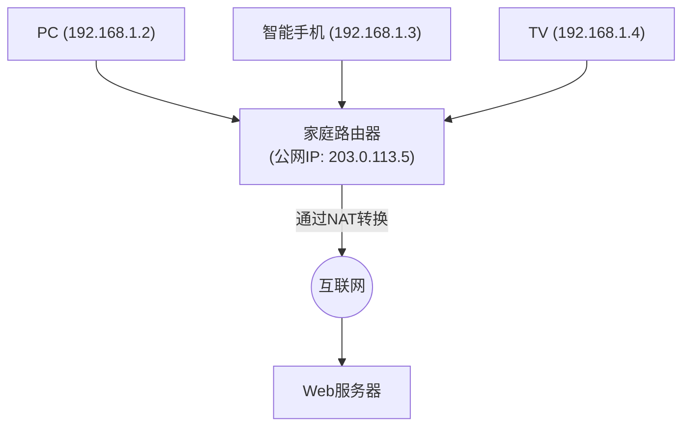

## 1. 互联网“地址”的作用

连接到互联网的全世界的计算机和智能手机，之所以能够准确无误地相互发送数据，是因为所有的设备都被分配了一个世界上唯一的“地址”。
这个网络上的地址被称为“ **IP地址（Internet Protocol Address）** ”。

当我们访问“Google的服务器”时，浏览器在看不见的后台，将诸如“142.250.196.110”这样的一串数字（IP地址）作为目的地发送数据包（包裹）。
长期支撑互联网的这个地址系统就是“ **IPv4（Internet Protocol version 4）** ”。然而现在，这个IPv4面临着严重的系统性极限，向下一代“ **IPv6** ”的大规模迁移（Migration）项目正在全球范围内进行。

## 2. IPv4的诞生与“43亿个的极限”

IPv4在互联网的黎明期，即1981年（RFC 791）被标准化。
IPv4的地址用“ **32位** ”的数据量来表示。32位意味着“0和1的组合有32位”，计算得 $2^{32} = 4,294,967,296$ ，也就是可以生成 **约43亿个** 地址。

当时的互联网，只是少数大学、军事机构和大企业使用的小规模网络。设计者们认为“因为地球上的全人类也只有几十亿人，所以如果有43亿个地址，未来永远都不会枯竭吧”。

然而，随着1990年代World Wide Web的爆炸性普及、2000年代智能手机的出现，以及现在IoT（物联网：连家电和汽车都连接到网络的时代）的到来，那个预测完全落空了。
一个人开始消耗PC、智能手机、平板电脑、智能手表等多个IP地址，43亿个地址转眼间就被消耗殆尽。

2011年2月，管理全球IP地址的中央组织IANA（Internet Assigned Numbers Authority），将他们储备的“IPv4地址的最后中央库存”分配给了各地区组织，终于宣告了 **中央库存的完全枯竭** 。

## 3. 延长寿命的措施：NAT与私有IP地址

本来在枯竭的时候互联网应该会陷入恐慌，但今天我们依然能正常使用网络，多亏了被称为“ **NAT（Network Address Translation）** ”的延寿技术。

NAT是一种技术，它将世界上唯一的地址“公网IP地址”仅分配给各家庭或企业路由器的1个，而在路由器内部（家里）则循环使用被称为“私有IP地址（例：192.168.1.x）”的“仅在内部通用的独立地址”。

路由器将来自家里设备的所有请求代理为“来自自己（路由器）的请求”发送到互联网，并将返回的答案正确地重新分发给家里的各设备。
这种机制使得1个公网IP地址可以连接几十台设备到网络，IPv4的枯竭危机被戏剧性地推迟了。然而，这不是根本的解决方案，它产生了NAT处理带来的延迟，以及P2P通信（如在线游戏的直接通信）变得困难等弊端。

## 4. 终极解决方案：“IPv6”的登场

为了解决这个根本性的枯竭问题而设计的下一代协议就是“ **IPv6（Internet Protocol version 6）** ”。

IPv6最大的特点在于其压倒性的广阔地址空间。
相对于IPv4的“32位”，IPv6拥有“ **128位** ”的地址空间。
计算得 $2^{128}$ ，可以发行约“ **340涧** ”（340万亿的1万亿倍的1万亿倍）个，这是一个超出人类想象的数量的地址。

这是一个被认为是“即使把地球上所有的沙粒都分配一个IP地址，也还有剩余”的天文数字。
表示方法也从IPv4的 `192.168.1.1` 这样的十进制，变成了 `2001:0db8:85a3:0000:0000:8a2e:0370:7334` 这样的十六进制和冒号分隔的形式。

### IPv6带来的优势
1. **不再需要NAT**
   由于有近乎无限的地址，甚至可以直接为家里的每一个灯泡分配世界上唯一的公网IP地址。路由器中复杂的地址转换（NAT）变得不再必要，设备之间可以直接进行高速通信。
2. **安全性的标准化（IPsec）**
   标准内置了进行通信加密和篡改检测的IPsec安全功能，在网络层级别的安全性得到了提升。
3. **路由效率的提升**
   由于地址结构是分层整理的，互联网上的路由器在转发数据包时，路径选择（路由）的处理变轻了，通信延迟减少了。

## 5. 日本IPv6的普及与“IPoE”

虽然在技术上是完美的IPv6，但普及却花了一些时间。最大的障碍是“ **IPv4和IPv6不兼容（无法直接对话）** ”这一点。从支持IPv6的PC上，无法浏览仅支持IPv4的Web站点。因此，通信运营商和提供商被迫承担并行运行两种网络（双栈）的巨大成本。

然而近年来，在日本，由于独特的原因，IPv6的普及呈爆炸式增长。那就是通过“ **IPoE（IPv6 IPoE）方式** ”实现的通信高速化。

日本传统的互联网连接（PPPoE方式），到了夜间就会在提供商的“网端装置”这一部分发生严重的拥堵，存在通信速度急剧下降的问题。
相比之下，如果使用新的连接方式“IPoE”，就可以绕过这个大拥堵点，直接通过宽敞空闲的下一代网络。因为使用这种“IPoE方式”的条件是“必须是IPv6通信”，所以很多用户为了“让网速变快而引入支持IPv6的路由器”，这就引发了一场运动，结果使日本的IPv6普及率跃居世界前列。

## 6. 总结：悄然进行的基础设施大迁移

支撑互联网的IP协议的版本升级，就像是在给高速行驶中的汽车更换发动机一样，是一个非常困难的项目。
但是，经过Google、Netflix等全球IT企业、通信运营商以及路由器制造商多年的努力，IPv6的普及率正在稳步上升，现在全球大部分流量已经通过IPv6传输。

克服了43亿个地址枯竭的系统性危机，获得了340涧个无限空间的互联网，如今已经准备好作为未来所有物品都连接到网络的IoT时代、智慧城市和自动驾驶的基础，继续进一步进化。
