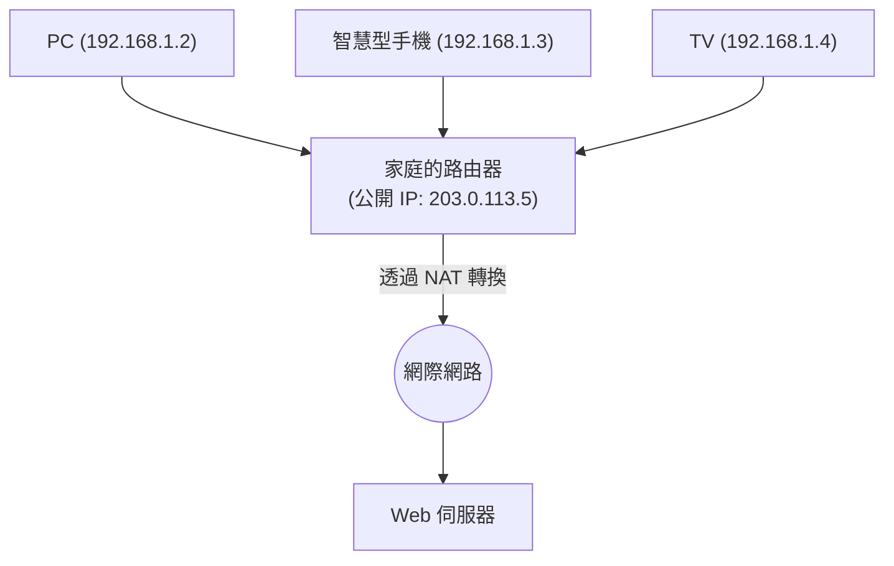

## 1. 網際網路「地址」的角色

連接在網際網路上的全球電腦和智慧型手機，之所以能夠準確無誤地互相傳遞資料，是因為所有的設備都被分配了一個世界上唯一的「地址」。
這個網路上的地址被稱為「 **IP 位址（Internet Protocol Address）** 」。

當我們存取「Google 的伺服器」時，瀏覽器在看不見的背景中，會將「142.250.196.110」這樣的一串數字（IP 位址）作為目的地來發送封包（包裹）。
長期支撐網際網路的這個地址系統就是「 **IPv4（Internet Protocol version 4）** 」。然而現在，這個 IPv4 面臨著嚴重的系統性極限，一場向次世代「 **IPv6** 」轉移的巨大遷移（Migration）專案正在全球規模地進行中。

## 2. IPv4 的誕生與「43 億個的極限」

IPv4 是在網際網路黎明期的 1981 年（RFC 791）被標準化的。
IPv4 的地址是以「 **32 位元** 」的資料量來表示。32 位元意味著「0 和 1 的組合有 32 位數」，計算後為 $2^{32} = 4,294,967,296$ ，也就是可以創造出 **約 43 億個** 地址。

當時的網際網路，是只有部分大學、軍事機構和大企業才會使用的小型網路。設計者們認為「地球上全人類也不過幾十億人，如果有 43 億個地址，未來永遠都不會枯竭吧」。

然而，隨著 1990 年代 World Wide Web 的爆炸性普及、2000 年代智慧型手機的出現，以及現在 IoT（物聯網：連家電和汽車都能連網的時代）的到來，這個估算完全被打亂了。
一個人都會消耗 PC、智慧型手機、平板電腦、智慧手錶等多個 IP 位址，43 億個地址轉眼間就被消耗殆盡了。

2011 年 2 月，管理全球 IP 位址的中央組織 IANA（Internet Assigned Numbers Authority），將他們囤積的「IPv4 地址最後的中央庫存」分配給各區域組織完畢後，終於宣布了 **中央庫存的完全枯竭** 。

## 3. 續命措施：NAT 與私有 IP 位址

本來在枯竭的時間點網際網路應該會陷入恐慌，但今天我們還能正常使用網路，全靠名為「 **NAT（Network Address Translation）** 」的續命技術。

NAT 是一種將世界上唯一的地址「公開 IP 位址」只分配一個給各家庭或企業的路由器，而在路由器內側（家中）則重複使用「私有 IP 位址（例：192.168.1.x）」這種「只有內部才通用的專屬地址」的技術。

路由器會將來自家中設備的所有請求，全部作為「自己（路由器）發出的請求」代理發送到網際網路上，並將收到的回覆正確地重新分配給家中的各個設備。
透過這個機制，使用 1 個公開 IP 位址就能讓幾十台設備連上網路，大幅推遲了 IPv4 的枯竭危機。然而，這並非根本的解決之道，反而產生了因 NAT 處理造成的延遲，以及難以進行 P2P 通訊（線上遊戲的直接通訊等）的弊端。

## 4. 終極解決方案：「IPv6」的登場

為了解決這個根本性的枯竭問題而設計的次世代協定，就是「 **IPv6（Internet Protocol version 6）** 」。

IPv6 最大的特徵，在於其位址空間的無比龐大。
相較於 IPv4 的「32 位元」，IPv6 擁有「 **128 位元** 」的位址空間。
計算起來是 $2^{128}$ ，約為「 **340 澗** 」（340 兆的 1 兆倍的 1 兆倍）個，能夠發行出超越人類想像數量的地址。

這個天文數字龐大到甚至被說「即使給地球上所有的沙粒都分配一個 IP 位址，也還會有剩」。
表示方法也從 IPv4 的 `192.168.1.1` 這樣的十進位，變成了如 `2001:0db8:85a3:0000:0000:8a2e:0370:7334` 的十六進位並以冒號分隔。

### IPv6 帶來的優勢
1. **不再需要 NAT**
   因為擁有近乎無限的地址，可以直接為家中的每一顆燈泡分配世界上唯一的公開 IP 位址。不需要在路由器進行複雜的位址轉換（NAT），設備之間就能夠直接進行高速通訊。
2. **安全性的標準化（IPsec）**
   標準內建了執行通訊加密與竄改偵測的 IPsec 安全功能，提升了網路層級的安全性。
3. **路由的效率化**
   因為位址的結構被階層化整理，減輕了網際網路上路由器在轉發封包時選擇路徑（路由）的處理負擔，減少了通訊延遲。

## 5. 日本的 IPv6 普及與「IPoE」

儘管 IPv6 在技術上十分完美，但普及卻花費了不少時間。最大的障礙在於「 **IPv4 和 IPv6 不互通（無法直接對話）** 」這一點。從僅支援 IPv6 的 PC 上，是無法瀏覽只支援 IPv4 的網站的。因此，電信業者與 ISP 被迫承擔平行維運兩種網路（雙軌堆疊）的龐大成本。

然而近年來，日本由於獨特的原因，IPv6 的普及速度呈現爆炸性的成長。那就是透過「 **IPoE（IPv6 IPoE）方式** 」所帶來的通訊高速化。

日本傳統的網際網路連線（PPPoE 方式），在夜間時 ISP 的「網路終端設備」部分會發生嚴重的擁塞，導致通訊速度急遽下降。
相對應地，如果使用新的連線方式「IPoE」，就能夠繞過這個大塞車的節點，直接通過寬敞且空閒的次世代網路。由於使用這個「IPoE 方式」的條件是「必須是 IPv6 通訊」，因此引發了許多使用者「為了讓網路變快而導入支援 IPv6 的路由器」的風潮，結果讓日本的 IPv6 普及率躍升至世界頂尖水準。

## 6. 總結：無聲的基礎設施大遷移

作為網際網路基礎的 IP 協定版本升級，就像是在高速行駛中的汽車上更換引擎一樣，是一個極度困難的專案。
然而，透過 Google 和 Netflix 等全球 IT 企業、電信商，以及路由器製造商長年來的努力，IPv6 的普及率穩步上升，現在全球的許多流量都已經在 IPv6 上運行。

克服了 43 億個枯竭的系統性危機，獲得了 340 澗個無限空間的網際網路，今後將作為所有物品都能連上網路的 IoT 時代、智慧城市以及自動駕駛的基礎，已經準備好繼續向下一個進化邁進。
