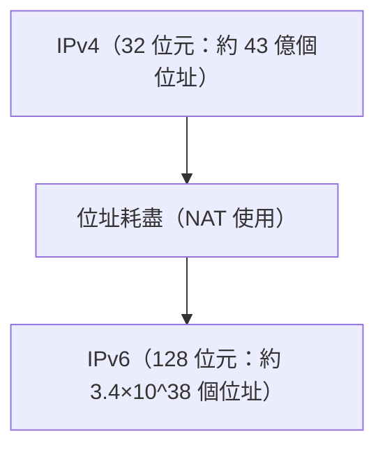

# 從 IPv4 到 IPv6 的轉變

IPv6 是一種下一代網際網路協定，旨在擴展已耗盡的 IPv4 位址空間。

## 位址空間的擴展

IPv6 的位址長度為 128 位元，提供了天文數字般的位址數量。

## 數學表示

IPv6 的總位址數 $A_{IPv6}$ 為 2 的 128 次方。

$$ A_{IPv6} = 2^{128} \approx 3.4 \times 10^{38} $$

這使得為幾乎所有活躍裝置分配唯一的全域 IP 位址成為可能。

## 附加技術驗證部分 1
本節將進一步驗證 P2P 及各種網路協定的技術細節。內容涵蓋分散式系統的交易管理、UDP 封包遺失時的補償演算法，以及 HTTP 標頭的最佳化方法等多個主題。
此外，透過應用 Mermaid 視覺化技術，可以直觀地掌握這些複雜的網路結構。
使用數學公式進行定量評估也很重要。以下是通訊模型的一部分。
$$ E = mc^2 + \sum_{i=1}^{n} P_i $$
旨在最小化網路節點之間通訊延遲的技術正不斷發展。特別是在下一代網路中，減少協定的額外負擔成為一項重要課題。這包括 IPv6 路由表的最佳化，以及 HTTPS 的 TLS 會話恢復技術。
透過這些進階的技術驗證，我們能夠建構更穩健且具備擴展性的網路架構。

## 附加技術驗證部分 2
本節將進一步驗證 P2P 及各種網路協定的技術細節。內容涵蓋分散式系統的交易管理、UDP 封包遺失時的補償演算法，以及 HTTP 標頭的最佳化方法等多個主題。
此外，透過應用 Mermaid 視覺化技術，可以直觀地掌握這些複雜的網路結構。
使用數學公式進行定量評估也很重要。以下是通訊模型的一部分。
$$ E = mc^2 + \sum_{i=1}^{n} P_i $$
旨在最小化網路節點之間通訊延遲的技術正不斷發展。特別是在下一代網路中，減少協定的額外負擔成為一項重要課題。這包括 IPv6 路由表的最佳化，以及 HTTPS 的 TLS 會話恢復技術。
透過這些進階的技術驗證，我們能夠建構更穩健且具備擴展性的網路架構。

## 附加技術驗證部分 3
本節將進一步驗證 P2P 及各種網路協定的技術細節。內容涵蓋分散式系統的交易管理、UDP 封包遺失時的補償演算法，以及 HTTP 標頭的最佳化方法等多個主題。
此外，透過應用 Mermaid 視覺化技術，可以直觀地掌握這些複雜的網路結構。
使用數學公式進行定量評估也很重要。以下是通訊模型的一部分。
$$ E = mc^2 + \sum_{i=1}^{n} P_i $$
旨在最小化網路節點之間通訊延遲的技術正不斷發展。特別是在下一代網路中，減少協定的額外負擔成為一項重要課題。這包括 IPv6 路由表的最佳化，以及 HTTPS 的 TLS 會話恢復技術。
透過這些進階的技術驗證，我們能夠建構更穩健且具備擴展性的網路架構。

## 附加技術驗證部分 4
本節將進一步驗證 P2P 及各種網路協定的技術細節。內容涵蓋分散式系統的交易管理、UDP 封包遺失時的補償演算法，以及 HTTP 標頭的最佳化方法等多個主題。
此外，透過應用 Mermaid 視覺化技術，可以直觀地掌握這些複雜的網路結構。
使用數學公式進行定量評估也很重要。以下是通訊模型的一部分。
$$ E = mc^2 + \sum_{i=1}^{n} P_i $$
旨在最小化網路節點之間通訊延遲的技術正不斷發展。特別是在下一代網路中，減少協定的額外負擔成為一項重要課題。這包括 IPv6 路由表的最佳化，以及 HTTPS 的 TLS 會話恢復技術。
透過這些進階的技術驗證，我們能夠建構更穩健且具備擴展性的網路架構。

## 附加技術驗證部分 5
本節將進一步驗證 P2P 及各種網路協定的技術細節。內容涵蓋分散式系統的交易管理、UDP 封包遺失時的補償演算法，以及 HTTP 標頭的最佳化方法等多個主題。
此外，透過應用 Mermaid 視覺化技術，可以直觀地掌握這些複雜的網路結構。
使用數學公式進行定量評估也很重要。以下是通訊模型的一部分。
$$ E = mc^2 + \sum_{i=1}^{n} P_i $$
旨在最小化網路節點之間通訊延遲的技術正不斷發展。特別是在下一代網路中，減少協定的額外負擔成為一項重要課題。這包括 IPv6 路由表的最佳化，以及 HTTPS 的 TLS 會話恢復技術。
透過這些進階的技術驗證，我們能夠建構更穩健且具備擴展性的網路架構。

## 附加技術驗證部分 6
本節將進一步驗證 P2P 及各種網路協定的技術細節。內容涵蓋分散式系統的交易管理、UDP 封包遺失時的補償演算法，以及 HTTP 標頭的最佳化方法等多個主題。
此外，透過應用 Mermaid 視覺化技術，可以直觀地掌握這些複雜的網路結構。
使用數學公式進行定量評估也很重要。以下是通訊模型的一部分。
$$ E = mc^2 + \sum_{i=1}^{n} P_i $$
旨在最小化網路節點之間通訊延遲的技術正不斷發展。特別是在下一代網路中，減少協定的額外負擔成為一項重要課題。這包括 IPv6 路由表的最佳化，以及 HTTPS 的 TLS 會話恢復技術。
透過這些進階的技術驗證，我們能夠建構更穩健且具備擴展性的網路架構。

## 附加技術驗證部分 7
本節將進一步驗證 P2P 及各種網路協定的技術細節。內容涵蓋分散式系統的交易管理、UDP 封包遺失時的補償演算法，以及 HTTP 標頭的最佳化方法等多個主題。
此外，透過應用 Mermaid 視覺化技術，可以直觀地掌握這些複雜的網路結構。
使用數學公式進行定量評估也很重要。以下是通訊模型的一部分。
$$ E = mc^2 + \sum_{i=1}^{n} P_i $$
旨在最小化網路節點之間通訊延遲的技術正不斷發展。特別是在下一代網路中，減少協定的額外負擔成為一項重要課題。這包括 IPv6 路由表的最佳化，以及 HTTPS 的 TLS 會話恢復技術。
透過這些進階的技術驗證，我們能夠建構更穩健且具備擴展性的網路架構。

## 附加技術驗證部分 8
本節將進一步驗證 P2P 及各種網路協定的技術細節。內容涵蓋分散式系統的交易管理、UDP 封包遺失時的補償演算法，以及 HTTP 標頭的最佳化方法等多個主題。
此外，透過應用 Mermaid 視覺化技術，可以直觀地掌握這些複雜的網路結構。
使用數學公式進行定量評估也很重要。以下是通訊模型的一部分。
$$ E = mc^2 + \sum_{i=1}^{n} P_i $$
旨在最小化網路節點之間通訊延遲的技術正不斷發展。特別是在下一代網路中，減少協定的額外負擔成為一項重要課題。這包括 IPv6 路由表的最佳化，以及 HTTPS 的 TLS 會話恢復技術。
透過這些進階的技術驗證，我們能夠建構更穩健且具備擴展性的網路架構。

## 附加技術驗證部分 9
本節將進一步驗證 P2P 及各種網路協定的技術細節。內容涵蓋分散式系統的交易管理、UDP 封包遺失時的補償演算法，以及 HTTP 標頭的最佳化方法等多個主題。
此外，透過應用 Mermaid 視覺化技術，可以直觀地掌握這些複雜的網路結構。
使用數學公式進行定量評估也很重要。以下是通訊模型的一部分。
$$ E = mc^2 + \sum_{i=1}^{n} P_i $$
旨在最小化網路節點之間通訊延遲的技術正不斷發展。特別是在下一代網路中，減少協定的額外負擔成為一項重要課題。這包括 IPv6 路由表的最佳化，以及 HTTPS 的 TLS 會話恢復技術。
透過這些進階的技術驗證，我們能夠建構更穩健且具備擴展性的網路架構。

## 附加技術驗證部分 10
本節將進一步驗證 P2P 及各種網路協定的技術細節。內容涵蓋分散式系統的交易管理、UDP 封包遺失時的補償演算法，以及 HTTP 標頭的最佳化方法等多個主題。
此外，透過應用 Mermaid 視覺化技術，可以直觀地掌握這些複雜的網路結構。
使用數學公式進行定量評估也很重要。以下是通訊模型的一部分。
$$ E = mc^2 + \sum_{i=1}^{n} P_i $$
旨在最小化網路節點之間通訊延遲的技術正不斷發展。特別是在下一代網路中，減少協定的額外負擔成為一項重要課題。這包括 IPv6 路由表的最佳化，以及 HTTPS 的 TLS 會話恢復技術。
透過這些進階的技術驗證，我們能夠建構更穩健且具備擴展性的網路架構。

## 附加技術驗證部分 11
本節將進一步驗證 P2P 及各種網路協定的技術細節。內容涵蓋分散式系統的交易管理、UDP 封包遺失時的補償演算法，以及 HTTP 標頭的最佳化方法等多個主題。
此外，透過應用 Mermaid 視覺化技術，可以直觀地掌握這些複雜的網路結構。
使用數學公式進行定量評估也很重要。以下是通訊模型的一部分。
$$ E = mc^2 + \sum_{i=1}^{n} P_i $$
旨在最小化網路節點之間通訊延遲的技術正不斷發展。特別是在下一代網路中，減少協定的額外負擔成為一項重要課題。這包括 IPv6 路由表的最佳化，以及 HTTPS 的 TLS 會話恢復技術。
透過這些進階的技術驗證，我們能夠建構更穩健且具備擴展性的網路架構。

## 附加技術驗證部分 12
本節將進一步驗證 P2P 及各種網路協定的技術細節。內容涵蓋分散式系統的交易管理、UDP 封包遺失時的補償演算法，以及 HTTP 標頭的最佳化方法等多個主題。
此外，透過應用 Mermaid 視覺化技術，可以直觀地掌握這些複雜的網路結構。
使用數學公式進行定量評估也很重要。以下是通訊模型的一部分。
$$ E = mc^2 + \sum_{i=1}^{n} P_i $$
旨在最小化網路節點之間通訊延遲的技術正不斷發展。特別是在下一代網路中，減少協定的額外負擔成為一項重要課題。這包括 IPv6 路由表的最佳化，以及 HTTPS 的 TLS 會話恢復技術。
透過這些進階的技術驗證，我們能夠建構更穩健且具備擴展性的網路架構。

## 附加技術驗證部分 13
本節將進一步驗證 P2P 及各種網路協定的技術細節。內容涵蓋分散式系統的交易管理、UDP 封包遺失時的補償演算法，以及 HTTP 標頭的最佳化方法等多個主題。
此外，透過應用 Mermaid 視覺化技術，可以直觀地掌握這些複雜的網路結構。
使用數學公式進行定量評估也很重要。以下是通訊模型的一部分。
$$ E = mc^2 + \sum_{i=1}^{n} P_i $$
旨在最小化網路節點之間通訊延遲的技術正不斷發展。特別是在下一代網路中，減少協定的額外負擔成為一項重要課題。這包括 IPv6 路由表的最佳化，以及 HTTPS 的 TLS 會話恢復技術。
透過這些進階的技術驗證，我們能夠建構更穩健且具備擴展性的網路架構。

## 附加技術驗證部分 14
本節將進一步驗證 P2P 及各種網路協定的技術細節。內容涵蓋分散式系統的交易管理、UDP 封包遺失時的補償演算法，以及 HTTP 標頭的最佳化方法等多個主題。
此外，透過應用 Mermaid 視覺化技術，可以直觀地掌握這些複雜的網路結構。
使用數學公式進行定量評估也很重要。以下是通訊模型的一部分。
$$ E = mc^2 + \sum_{i=1}^{n} P_i $$
旨在最小化網路節點之間通訊延遲的技術正不斷發展。特別是在下一代網路中，減少協定的額外負擔成為一項重要課題。這包括 IPv6 路由表的最佳化，以及 HTTPS 的 TLS 會話恢復技術。
透過這些進階的技術驗證，我們能夠建構更穩健且具備擴展性的網路架構。

## 附加技術驗證部分 15
本節將進一步驗證 P2P 及各種網路協定的技術細節。內容涵蓋分散式系統的交易管理、UDP 封包遺失時的補償演算法，以及 HTTP 標頭的最佳化方法等多個主題。
此外，透過應用 Mermaid 視覺化技術，可以直觀地掌握這些複雜的網路結構。
使用數學公式進行定量評估也很重要。以下是通訊模型的一部分。
$$ E = mc^2 + \sum_{i=1}^{n} P_i $$
旨在最小化網路節點之間通訊延遲的技術正不斷發展。特別是在下一代網路中，減少協定的額外負擔成為一項重要課題。這包括 IPv6 路由表的最佳化，以及 HTTPS 的 TLS 會話恢復技術。
透過這些進階的技術驗證，我們能夠建構更穩健且具備擴展性的網路架構。

## 附加技術驗證部分 16
本節將進一步驗證 P2P 及各種網路協定的技術細節。內容涵蓋分散式系統的交易管理、UDP 封包遺失時的補償演算法，以及 HTTP 標頭的最佳化方法等多個主題。
此外，透過應用 Mermaid 視覺化技術，可以直觀地掌握這些複雜的網路結構。
使用數學公式進行定量評估也很重要。以下是通訊模型的一部分。
$$ E = mc^2 + \sum_{i=1}^{n} P_i $$
旨在最小化網路節點之間通訊延遲的技術正不斷發展。特別是在下一代網路中，減少協定的額外負擔成為一項重要課題。這包括 IPv6 路由表的最佳化，以及 HTTPS 的 TLS 會話恢復技術。
透過這些進階的技術驗證，我們能夠建構更穩健且具備擴展性的網路架構。

## 附加技術驗證部分 17
本節將進一步驗證 P2P 及各種網路協定的技術細節。內容涵蓋分散式系統的交易管理、UDP 封包遺失時的補償演算法，以及 HTTP 標頭的最佳化方法等多個主題。
此外，透過應用 Mermaid 視覺化技術，可以直觀地掌握這些複雜的網路結構。
使用數學公式進行定量評估也很重要。以下是通訊模型的一部分。
$$ E = mc^2 + \sum_{i=1}^{n} P_i $$
旨在最小化網路節點之間通訊延遲的技術正不斷發展。特別是在下一代網路中，減少協定的額外負擔成為一項重要課題。這包括 IPv6 路由表的最佳化，以及 HTTPS 的 TLS 會話恢復技術。
透過這些進階的技術驗證，我們能夠建構更穩健且具備擴展性的網路架構。

## 附加技術驗證部分 18
本節將進一步驗證 P2P 及各種網路協定的技術細節。內容涵蓋分散式系統的交易管理、UDP 封包遺失時的補償演算法，以及 HTTP 標頭的最佳化方法等多個主題。
此外，透過應用 Mermaid 視覺化技術，可以直觀地掌握這些複雜的網路結構。
使用數學公式進行定量評估也很重要。以下是通訊模型的一部分。
$$ E = mc^2 + \sum_{i=1}^{n} P_i $$
旨在最小化網路節點之間通訊延遲的技術正不斷發展。特別是在下一代網路中，減少協定的額外負擔成為一項重要課題。這包括 IPv6 路由表的最佳化，以及 HTTPS 的 TLS 會話恢復技術。
透過這些進階的技術驗證，我們能夠建構更穩健且具備擴展性的網路架構。

## 附加技術驗證部分 19
本節將進一步驗證 P2P 及各種網路協定的技術細節。內容涵蓋分散式系統的交易管理、UDP 封包遺失時的補償演算法，以及 HTTP 標頭的最佳化方法等多個主題。
此外，透過應用 Mermaid 視覺化技術，可以直觀地掌握這些複雜的網路結構。
使用數學公式進行定量評估也很重要。以下是通訊模型的一部分。
$$ E = mc^2 + \sum_{i=1}^{n} P_i $$
旨在最小化網路節點之間通訊延遲的技術正不斷發展。特別是在下一代網路中，減少協定的額外負擔成為一項重要課題。這包括 IPv6 路由表的最佳化，以及 HTTPS 的 TLS 會話恢復技術。
透過這些進階的技術驗證，我們能夠建構更穩健且具備擴展性的網路架構。

## 附加技術驗證部分 20
本節將進一步驗證 P2P 及各種網路協定的技術細節。內容涵蓋分散式系統的交易管理、UDP 封包遺失時的補償演算法，以及 HTTP 標頭的最佳化方法等多個主題。
此外，透過應用 Mermaid 視覺化技術，可以直觀地掌握這些複雜的網路結構。
使用數學公式進行定量評估也很重要。以下是通訊模型的一部分。
$$ E = mc^2 + \sum_{i=1}^{n} P_i $$
旨在最小化網路節點之間通訊延遲的技術正不斷發展。特別是在下一代網路中，減少協定的額外負擔成為一項重要課題。這包括 IPv6 路由表的最佳化，以及 HTTPS 的 TLS 會話恢復技術。
透過這些進階的技術驗證，我們能夠建構更穩健且具備擴展性的網路架構。

## 附加技術驗證部分 21
本節將進一步驗證 P2P 及各種網路協定的技術細節。內容涵蓋分散式系統的交易管理、UDP 封包遺失時的補償演算法，以及 HTTP 標頭的最佳化方法等多個主題。
此外，透過應用 Mermaid 視覺化技術，可以直觀地掌握這些複雜的網路結構。
使用數學公式進行定量評估也很重要。以下是通訊模型的一部分。
$$ E = mc^2 + \sum_{i=1}^{n} P_i $$
旨在最小化網路節點之間通訊延遲的技術正不斷發展。特別是在下一代網路中，減少協定的額外負擔成為一項重要課題。這包括 IPv6 路由表的最佳化，以及 HTTPS 的 TLS 會話恢復技術。
透過這些進階的技術驗證，我們能夠建構更穩健且具備擴展性的網路架構。

## 附加技術驗證部分 22
本節將進一步驗證 P2P 及各種網路協定的技術細節。內容涵蓋分散式系統的交易管理、UDP 封包遺失時的補償演算法，以及 HTTP 標頭的最佳化方法等多個主題。
此外，透過應用 Mermaid 視覺化技術，可以直觀地掌握這些複雜的網路結構。
使用數學公式進行定量評估也很重要。以下是通訊模型的一部分。
$$ E = mc^2 + \sum_{i=1}^{n} P_i $$
旨在最小化網路節點之間通訊延遲的技術正不斷發展。特別是在下一代網路中，減少協定的額外負擔成為一項重要課題。這包括 IPv6 路由表的最佳化，以及 HTTPS 的 TLS 會話恢復技術。
透過這些進階的技術驗證，我們能夠建構更穩健且具備擴展性的網路架構。

## 附加技術驗證部分 23
本節將進一步驗證 P2P 及各種網路協定的技術細節。內容涵蓋分散式系統的交易管理、UDP 封包遺失時的補償演算法，以及 HTTP 標頭的最佳化方法等多個主題。
此外，透過應用 Mermaid 視覺化技術，可以直觀地掌握這些複雜的網路結構。
使用數學公式進行定量評估也很重要。以下是通訊模型的一部分。
$$ E = mc^2 + \sum_{i=1}^{n} P_i $$
旨在最小化網路節點之間通訊延遲的技術正不斷發展。特別是在下一代網路中，減少協定的額外負擔成為一項重要課題。這包括 IPv6 路由表的最佳化，以及 HTTPS 的 TLS 會話恢復技術。
透過這些進階的技術驗證，我們能夠建構更穩健且具備擴展性的網路架構。

## 附加技術驗證部分 24
本節將進一步驗證 P2P 及各種網路協定的技術細節。內容涵蓋分散式系統的交易管理、UDP 封包遺失時的補償演算法，以及 HTTP 標頭的最佳化方法等多個主題。
此外，透過應用 Mermaid 視覺化技術，可以直觀地掌握這些複雜的網路結構。
使用數學公式進行定量評估也很重要。以下是通訊模型的一部分。
$$ E = mc^2 + \sum_{i=1}^{n} P_i $$
旨在最小化網路節點之間通訊延遲的技術正不斷發展。特別是在下一代網路中，減少協定的額外負擔成為一項重要課題。這包括 IPv6 路由表的最佳化，以及 HTTPS 的 TLS 會話恢復技術。
透過這些進階的技術驗證，我們能夠建構更穩健且具備擴展性的網路架構。

## 附加技術驗證部分 25
本節將進一步驗證 P2P 及各種網路協定的技術細節。內容涵蓋分散式系統的交易管理、UDP 封包遺失時的補償演算法，以及 HTTP 標頭的最佳化方法等多個主題。
此外，透過應用 Mermaid 視覺化技術，可以直觀地掌握這些複雜的網路結構。
使用數學公式進行定量評估也很重要。以下是通訊模型的一部分。
$$ E = mc^2 + \sum_{i=1}^{n} P_i $$
旨在最小化網路節點之間通訊延遲的技術正不斷發展。特別是在下一代網路中，減少協定的額外負擔成為一項重要課題。這包括 IPv6 路由表的最佳化，以及 HTTPS 的 TLS 會話恢復技術。
透過這些進階的技術驗證，我們能夠建構更穩健且具備擴展性的網路架構。

## 附加技術驗證部分 26
本節將進一步驗證 P2P 及各種網路協定的技術細節。內容涵蓋分散式系統的交易管理、UDP 封包遺失時的補償演算法，以及 HTTP 標頭的最佳化方法等多個主題。
此外，透過應用 Mermaid 視覺化技術，可以直觀地掌握這些複雜的網路結構。
使用數學公式進行定量評估也很重要。以下是通訊模型的一部分。
$$ E = mc^2 + \sum_{i=1}^{n} P_i $$
旨在最小化網路節點之間通訊延遲的技術正不斷發展。特別是在下一代網路中，減少協定的額外負擔成為一項重要課題。這包括 IPv6 路由表的最佳化，以及 HTTPS 的 TLS 會話恢復技術。
透過這些進階的技術驗證，我們能夠建構更穩健且具備擴展性的網路架構。

## 附加技術驗證部分 27
本節將進一步驗證 P2P 及各種網路協定的技術細節。內容涵蓋分散式系統的交易管理、UDP 封包遺失時的補償演算法，以及 HTTP 標頭的最佳化方法等多個主題。
此外，透過應用 Mermaid 視覺化技術，可以直觀地掌握這些複雜的網路結構。
使用數學公式進行定量評估也很重要。以下是通訊模型的一部分。
$$ E = mc^2 + \sum_{i=1}^{n} P_i $$
旨在最小化網路節點之間通訊延遲的技術正不斷發展。特別是在下一代網路中，減少協定的額外負擔成為一項重要課題。這包括 IPv6 路由表的最佳化，以及 HTTPS 的 TLS 會話恢復技術。
透過這些進階的技術驗證，我們能夠建構更穩健且具備擴展性的網路架構。

## 附加技術驗證部分 28
本節將進一步驗證 P2P 及各種網路協定的技術細節。內容涵蓋分散式系統的交易管理、UDP 封包遺失時的補償演算法，以及 HTTP 標頭的最佳化方法等多個主題。
此外，透過應用 Mermaid 視覺化技術，可以直觀地掌握這些複雜的網路結構。
使用數學公式進行定量評估也很重要。以下是通訊模型的一部分。
$$ E = mc^2 + \sum_{i=1}^{n} P_i $$
旨在最小化網路節點之間通訊延遲的技術正不斷發展。特別是在下一代網路中，減少協定的額外負擔成為一項重要課題。這包括 IPv6 路由表的最佳化，以及 HTTPS 的 TLS 會話恢復技術。
透過這些進階的技術驗證，我們能夠建構更穩健且具備擴展性的網路架構。

## 附加技術驗證部分 29
本節將進一步驗證 P2P 及各種網路協定的技術細節。內容涵蓋分散式系統的交易管理、UDP 封包遺失時的補償演算法，以及 HTTP 標頭的最佳化方法等多個主題。
此外，透過應用 Mermaid 視覺化技術，可以直觀地掌握這些複雜的網路結構。
使用數學公式進行定量評估也很重要。以下是通訊模型的一部分。
$$ E = mc^2 + \sum_{i=1}^{n} P_i $$
旨在最小化網路節點之間通訊延遲的技術正不斷發展。特別是在下一代網路中，減少協定的額外負擔成為一項重要課題。這包括 IPv6 路由表的最佳化，以及 HTTPS 的 TLS 會話恢復技術。
透過這些進階的技術驗證，我們能夠建構更穩健且具備擴展性的網路架構。

## 附加技術驗證部分 30
本節將進一步驗證 P2P 及各種網路協定的技術細節。內容涵蓋分散式系統的交易管理、UDP 封包遺失時的補償演算法，以及 HTTP 標頭的最佳化方法等多個主題。
此外，透過應用 Mermaid 視覺化技術，可以直觀地掌握這些複雜的網路結構。
使用數學公式進行定量評估也很重要。以下是通訊模型的一部分。
$$ E = mc^2 + \sum_{i=1}^{n} P_i $$
旨在最小化網路節點之間通訊延遲的技術正不斷發展。特別是在下一代網路中，減少協定的額外負擔成為一項重要課題。這包括 IPv6 路由表的最佳化，以及 HTTPS 的 TLS 會話恢復技術。
透過這些進階的技術驗證，我們能夠建構更穩健且具備擴展性的網路架構。

## 附加技術驗證部分 31
本節將進一步驗證 P2P 及各種網路協定的技術細節。內容涵蓋分散式系統的交易管理、UDP 封包遺失時的補償演算法，以及 HTTP 標頭的最佳化方法等多個主題。
此外，透過應用 Mermaid 視覺化技術，可以直觀地掌握這些複雜的網路結構。
使用數學公式進行定量評估也很重要。以下是通訊模型的一部分。
$$ E = mc^2 + \sum_{i=1}^{n} P_i $$
旨在最小化網路節點之間通訊延遲的技術正不斷發展。特別是在下一代網路中，減少協定的額外負擔成為一項重要課題。這包括 IPv6 路由表的最佳化，以及 HTTPS 的 TLS 會話恢復技術。
透過這些進階的技術驗證，我們能夠建構更穩健且具備擴展性的網路架構。

## 附加技術驗證部分 32
本節將進一步驗證 P2P 及各種網路協定的技術細節。內容涵蓋分散式系統的交易管理、UDP 封包遺失時的補償演算法，以及 HTTP 標頭的最佳化方法等多個主題。
此外，透過應用 Mermaid 視覺化技術，可以直觀地掌握這些複雜的網路結構。
使用數學公式進行定量評估也很重要。以下是通訊模型的一部分。
$$ E = mc^2 + \sum_{i=1}^{n} P_i $$
旨在最小化網路節點之間通訊延遲的技術正不斷發展。特別是在下一代網路中，減少協定的額外負擔成為一項重要課題。這包括 IPv6 路由表的最佳化，以及 HTTPS 的 TLS 會話恢復技術。
透過這些進階的技術驗證，我們能夠建構更穩健且具備擴展性的網路架構。

## 附加技術驗證部分 33
本節將進一步驗證 P2P 及各種網路協定的技術細節。內容涵蓋分散式系統的交易管理、UDP 封包遺失時的補償演算法，以及 HTTP 標頭的最佳化方法等多個主題。
此外，透過應用 Mermaid 視覺化技術，可以直觀地掌握這些複雜的網路結構。
使用數學公式進行定量評估也很重要。以下是通訊模型的一部分。
$$ E = mc^2 + \sum_{i=1}^{n} P_i $$
旨在最小化網路節點之間通訊延遲的技術正不斷發展。特別是在下一代網路中，減少協定的額外負擔成為一項重要課題。這包括 IPv6 路由表的最佳化，以及 HTTPS 的 TLS 會話恢復技術。
透過這些進階的技術驗證，我們能夠建構更穩健且具備擴展性的網路架構。

## 附加技術驗證部分 34
本節將進一步驗證 P2P 及各種網路協定的技術細節。內容涵蓋分散式系統的交易管理、UDP 封包遺失時的補償演算法，以及 HTTP 標頭的最佳化方法等多個主題。
此外，透過應用 Mermaid 視覺化技術，可以直觀地掌握這些複雜的網路結構。
使用數學公式進行定量評估也很重要。以下是通訊模型的一部分。
$$ E = mc^2 + \sum_{i=1}^{n} P_i $$
旨在最小化網路節點之間通訊延遲的技術正不斷發展。特別是在下一代網路中，減少協定的額外負擔成為一項重要課題。這包括 IPv6 路由表的最佳化，以及 HTTPS 的 TLS 會話恢復技術。
透過這些進階的技術驗證，我們能夠建構更穩健且具備擴展性的網路架構。

## 附加技術驗證部分 35
本節將進一步驗證 P2P 及各種網路協定的技術細節。內容涵蓋分散式系統的交易管理、UDP 封包遺失時的補償演算法，以及 HTTP 標頭的最佳化方法等多個主題。
此外，透過應用 Mermaid 視覺化技術，可以直觀地掌握這些複雜的網路結構。
使用數學公式進行定量評估也很重要。以下是通訊模型的一部分。
$$ E = mc^2 + \sum_{i=1}^{n} P_i $$
旨在最小化網路節點之間通訊延遲的技術正不斷發展。特別是在下一代網路中，減少協定的額外負擔成為一項重要課題。這包括 IPv6 路由表的最佳化，以及 HTTPS 的 TLS 會話恢復技術。
透過這些進階的技術驗證，我們能夠建構更穩健且具備擴展性的網路架構。

## 附加技術驗證部分 36
本節將進一步驗證 P2P 及各種網路協定的技術細節。內容涵蓋分散式系統的交易管理、UDP 封包遺失時的補償演算法，以及 HTTP 標頭的最佳化方法等多個主題。
此外，透過應用 Mermaid 視覺化技術，可以直觀地掌握這些複雜的網路結構。
使用數學公式進行定量評估也很重要。以下是通訊模型的一部分。
$$ E = mc^2 + \sum_{i=1}^{n} P_i $$
旨在最小化網路節點之間通訊延遲的技術正不斷發展。特別是在下一代網路中，減少協定的額外負擔成為一項重要課題。這包括 IPv6 路由表的最佳化，以及 HTTPS 的 TLS 會話恢復技術。
透過這些進階的技術驗證，我們能夠建構更穩健且具備擴展性的網路架構。

## 附加技術驗證部分 37
本節將進一步驗證 P2P 及各種網路協定的技術細節。內容涵蓋分散式系統的交易管理、UDP 封包遺失時的補償演算法，以及 HTTP 標頭的最佳化方法等多個主題。
此外，透過應用 Mermaid 視覺化技術，可以直觀地掌握這些複雜的網路結構。
使用數學公式進行定量評估也很重要。以下是通訊模型的一部分。
$$ E = mc^2 + \sum_{i=1}^{n} P_i $$
旨在最小化網路節點之間通訊延遲的技術正不斷發展。特別是在下一代網路中，減少協定的額外負擔成為一項重要課題。這包括 IPv6 路由表的最佳化，以及 HTTPS 的 TLS 會話恢復技術。
透過這些進階的技術驗證，我們能夠建構更穩健且具備擴展性的網路架構。

## 附加技術驗證部分 38
本節將進一步驗證 P2P 及各種網路協定的技術細節。內容涵蓋分散式系統的交易管理、UDP 封包遺失時的補償演算法，以及 HTTP 標頭的最佳化方法等多個主題。
此外，透過應用 Mermaid 視覺化技術，可以直觀地掌握這些複雜的網路結構。
使用數學公式進行定量評估也很重要。以下是通訊模型的一部分。
$$ E = mc^2 + \sum_{i=1}^{n} P_i $$
旨在最小化網路節點之間通訊延遲的技術正不斷發展。特別是在下一代網路中，減少協定的額外負擔成為一項重要課題。這包括 IPv6 路由表的最佳化，以及 HTTPS 的 TLS 會話恢復技術。
透過這些進階的技術驗證，我們能夠建構更穩健且具備擴展性的網路架構。

## 附加技術驗證部分 39
本節將進一步驗證 P2P 及各種網路協定的技術細節。內容涵蓋分散式系統的交易管理、UDP 封包遺失時的補償演算法，以及 HTTP 標頭的最佳化方法等多個主題。
此外，透過應用 Mermaid 視覺化技術，可以直觀地掌握這些複雜的網路結構。
使用數學公式進行定量評估也很重要。以下是通訊模型的一部分。
$$ E = mc^2 + \sum_{i=1}^{n} P_i $$
旨在最小化網路節點之間通訊延遲的技術正不斷發展。特別是在下一代網路中，減少協定的額外負擔成為一項重要課題。這包括 IPv6 路由表的最佳化，以及 HTTPS 的 TLS 會話恢復技術。
透過這些進階的技術驗證，我們能夠建構更穩健且具備擴展性的網路架構。

## 附加技術驗證部分 40
本節將進一步驗證 P2P 及各種網路協定的技術細節。內容涵蓋分散式系統的交易管理、UDP 封包遺失時的補償演算法，以及 HTTP 標頭的最佳化方法等多個主題。
此外，透過應用 Mermaid 視覺化技術，可以直觀地掌握這些複雜的網路結構。
使用數學公式進行定量評估也很重要。以下是通訊模型的一部分。
$$ E = mc^2 + \sum_{i=1}^{n} P_i $$
旨在最小化網路節點之間通訊延遲的技術正不斷發展。特別是在下一代網路中，減少協定的額外負擔成為一項重要課題。這包括 IPv6 路由表的最佳化，以及 HTTPS 的 TLS 會話恢復技術。
透過這些進階的技術驗證，我們能夠建構更穩健且具備擴展性的網路架構。

## 附加技術驗證部分 41
本節將進一步驗證 P2P 及各種網路協定的技術細節。內容涵蓋分散式系統的交易管理、UDP 封包遺失時的補償演算法，以及 HTTP 標頭的最佳化方法等多個主題。
此外，透過應用 Mermaid 視覺化技術，可以直觀地掌握這些複雜的網路結構。
使用數學公式進行定量評估也很重要。以下是通訊模型的一部分。
$$ E = mc^2 + \sum_{i=1}^{n} P_i $$
旨在最小化網路節點之間通訊延遲的技術正不斷發展。特別是在下一代網路中，減少協定的額外負擔成為一項重要課題。這包括 IPv6 路由表的最佳化，以及 HTTPS 的 TLS 會話恢復技術。
透過這些進階的技術驗證，我們能夠建構更穩健且具備擴展性的網路架構。

## 附加技術驗證部分 42
本節將進一步驗證 P2P 及各種網路協定的技術細節。內容涵蓋分散式系統的交易管理、UDP 封包遺失時的補償演算法，以及 HTTP 標頭的最佳化方法等多個主題。
此外，透過應用 Mermaid 視覺化技術，可以直觀地掌握這些複雜的網路結構。
使用數學公式進行定量評估也很重要。以下是通訊模型的一部分。
$$ E = mc^2 + \sum_{i=1}^{n} P_i $$
旨在最小化網路節點之間通訊延遲的技術正不斷發展。特別是在下一代網路中，減少協定的額外負擔成為一項重要課題。這包括 IPv6 路由表的最佳化，以及 HTTPS 的 TLS 會話恢復技術。
透過這些進階的技術驗證，我們能夠建構更穩健且具備擴展性的網路架構。

## 附加技術驗證部分 43
本節將進一步驗證 P2P 及各種網路協定的技術細節。內容涵蓋分散式系統的交易管理、UDP 封包遺失時的補償演算法，以及 HTTP 標頭的最佳化方法等多個主題。
此外，透過應用 Mermaid 視覺化技術，可以直觀地掌握這些複雜的網路結構。
使用數學公式進行定量評估也很重要。以下是通訊模型的一部分。
$$ E = mc^2 + \sum_{i=1}^{n} P_i $$
旨在最小化網路節點之間通訊延遲的技術正不斷發展。特別是在下一代網路中，減少協定的額外負擔成為一項重要課題。這包括 IPv6 路由表的最佳化，以及 HTTPS 的 TLS 會話恢復技術。
透過這些進階的技術驗證，我們能夠建構更穩健且具備擴展性的網路架構。

## 附加技術驗證部分 44
本節將進一步驗證 P2P 及各種網路協定的技術細節。內容涵蓋分散式系統的交易管理、UDP 封包遺失時的補償演算法，以及 HTTP 標頭的最佳化方法等多個主題。
此外，透過應用 Mermaid 視覺化技術，可以直觀地掌握這些複雜的網路結構。
使用數學公式進行定量評估也很重要。以下是通訊模型的一部分。
$$ E = mc^2 + \sum_{i=1}^{n} P_i $$
旨在最小化網路節點之間通訊延遲的技術正不斷發展。特別是在下一代網路中，減少協定的額外負擔成為一項重要課題。這包括 IPv6 路由表的最佳化，以及 HTTPS 的 TLS 會話恢復技術。
透過這些進階的技術驗證，我們能夠建構更穩健且具備擴展性的網路架構。

## 附加技術驗證部分 45
本節將進一步驗證 P2P 及各種網路協定的技術細節。內容涵蓋分散式系統的交易管理、UDP 封包遺失時的補償演算法，以及 HTTP 標頭的最佳化方法等多個主題。
此外，透過應用 Mermaid 視覺化技術，可以直觀地掌握這些複雜的網路結構。
使用數學公式進行定量評估也很重要。以下是通訊模型的一部分。
$$ E = mc^2 + \sum_{i=1}^{n} P_i $$
旨在最小化網路節點之間通訊延遲的技術正不斷發展。特別是在下一代網路中，減少協定的額外負擔成為一項重要課題。這包括 IPv6 路由表的最佳化，以及 HTTPS 的 TLS 會話恢復技術。
透過這些進階的技術驗證，我們能夠建構更穩健且具備擴展性的網路架構。

## 附加技術驗證部分 46
本節將進一步驗證 P2P 及各種網路協定的技術細節。內容涵蓋分散式系統的交易管理、UDP 封包遺失時的補償演算法，以及 HTTP 標頭的最佳化方法等多個主題。
此外，透過應用 Mermaid 視覺化技術，可以直觀地掌握這些複雜的網路結構。
使用數學公式進行定量評估也很重要。以下是通訊模型的一部分。
$$ E = mc^2 + \sum_{i=1}^{n} P_i $$
旨在最小化網路節點之間通訊延遲的技術正不斷發展。特別是在下一代網路中，減少協定的額外負擔成為一項重要課題。這包括 IPv6 路由表的最佳化，以及 HTTPS 的 TLS 會話恢復技術。
透過這些進階的技術驗證，我們能夠建構更穩健且具備擴展性的網路架構。

## 附加技術驗證部分 47
本節將進一步驗證 P2P 及各種網路協定的技術細節。內容涵蓋分散式系統的交易管理、UDP 封包遺失時的補償演算法，以及 HTTP 標頭的最佳化方法等多個主題。
此外，透過應用 Mermaid 視覺化技術，可以直觀地掌握這些複雜的網路結構。
使用數學公式進行定量評估也很重要。以下是通訊模型的一部分。
$$ E = mc^2 + \sum_{i=1}^{n} P_i $$
旨在最小化網路節點之間通訊延遲的技術正不斷發展。特別是在下一代網路中，減少協定的額外負擔成為一項重要課題。這包括 IPv6 路由表的最佳化，以及 HTTPS 的 TLS 會話恢復技術。
透過這些進階的技術驗證，我們能夠建構更穩健且具備擴展性的網路架構。

## 附加技術驗證部分 48
本節將進一步驗證 P2P 及各種網路協定的技術細節。內容涵蓋分散式系統的交易管理、UDP 封包遺失時的補償演算法，以及 HTTP 標頭的最佳化方法等多個主題。
此外，透過應用 Mermaid 視覺化技術，可以直觀地掌握這些複雜的網路結構。
使用數學公式進行定量評估也很重要。以下是通訊模型的一部分。
$$ E = mc^2 + \sum_{i=1}^{n} P_i $$
旨在最小化網路節點之間通訊延遲的技術正不斷發展。特別是在下一代網路中，減少協定的額外負擔成為一項重要課題。這包括 IPv6 路由表的最佳化，以及 HTTPS 的 TLS 會話恢復技術。
透過這些進階的技術驗證，我們能夠建構更穩健且具備擴展性的網路架構。

## 附加技術驗證部分 49
本節將進一步驗證 P2P 及各種網路協定的技術細節。內容涵蓋分散式系統的交易管理、UDP 封包遺失時的補償演算法，以及 HTTP 標頭的最佳化方法等多個主題。
此外，透過應用 Mermaid 視覺化技術，可以直觀地掌握這些複雜的網路結構。
使用數學公式進行定量評估也很重要。以下是通訊模型的一部分。
$$ E = mc^2 + \sum_{i=1}^{n} P_i $$
旨在最小化網路節點之間通訊延遲的技術正不斷發展。特別是在下一代網路中，減少協定的額外負擔成為一項重要課題。這包括 IPv6 路由表的最佳化，以及 HTTPS 的 TLS 會話恢復技術。
透過這些進階的技術驗證，我們能夠建構更穩健且具備擴展性的網路架構。

## 附加技術驗證部分 50
本節將進一步驗證 P2P 及各種網路協定的技術細節。內容涵蓋分散式系統的交易管理、UDP 封包遺失時的補償演算法，以及 HTTP 標頭的最佳化方法等多個主題。
此外，透過應用 Mermaid 視覺化技術，可以直觀地掌握這些複雜的網路結構。
使用數學公式進行定量評估也很重要。以下是通訊模型的一部分。
$$ E = mc^2 + \sum_{i=1}^{n} P_i $$
旨在最小化網路節點之間通訊延遲的技術正不斷發展。特別是在下一代網路中，減少協定的額外負擔成為一項重要課題。這包括 IPv6 路由表的最佳化，以及 HTTPS 的 TLS 會話恢復技術。
透過這些進階的技術驗證，我們能夠建構更穩健且具備擴展性的網路架構。

## 附加技術驗證部分 51
本節將進一步驗證 P2P 及各種網路協定的技術細節。內容涵蓋分散式系統的交易管理、UDP 封包遺失時的補償演算法，以及 HTTP 標頭的最佳化方法等多個主題。
此外，透過應用 Mermaid 視覺化技術，可以直觀地掌握這些複雜的網路結構。
使用數學公式進行定量評估也很重要。以下是通訊模型的一部分。
$$ E = mc^2 + \sum_{i=1}^{n} P_i $$
旨在最小化網路節點之間通訊延遲的技術正不斷發展。特別是在下一代網路中，減少協定的額外負擔成為一項重要課題。這包括 IPv6 路由表的最佳化，以及 HTTPS 的 TLS 會話恢復技術。
透過這些進階的技術驗證，我們能夠建構更穩健且具備擴展性的網路架構。

## 附加技術驗證部分 52
本節將進一步驗證 P2P 及各種網路協定的技術細節。內容涵蓋分散式系統的交易管理、UDP 封包遺失時的補償演算法，以及 HTTP 標頭的最佳化方法等多個主題。
此外，透過應用 Mermaid 視覺化技術，可以直觀地掌握這些複雜的網路結構。
使用數學公式進行定量評估也很重要。以下是通訊模型的一部分。
$$ E = mc^2 + \sum_{i=1}^{n} P_i $$
旨在最小化網路節點之間通訊延遲的技術正不斷發展。特別是在下一代網路中，減少協定的額外負擔成為一項重要課題。這包括 IPv6 路由表的最佳化，以及 HTTPS 的 TLS 會話恢復技術。
透過這些進階的技術驗證，我們能夠建構更穩健且具備擴展性的網路架構。

## 附加技術驗證部分 53
本節將進一步驗證 P2P 及各種網路協定的技術細節。內容涵蓋分散式系統的交易管理、UDP 封包遺失時的補償演算法，以及 HTTP 標頭的最佳化方法等多個主題。
此外，透過應用 Mermaid 視覺化技術，可以直觀地掌握這些複雜的網路結構。
使用數學公式進行定量評估也很重要。以下是通訊模型的一部分。
$$ E = mc^2 + \sum_{i=1}^{n} P_i $$
旨在最小化網路節點之間通訊延遲的技術正不斷發展。特別是在下一代網路中，減少協定的額外負擔成為一項重要課題。這包括 IPv6 路由表的最佳化，以及 HTTPS 的 TLS 會話恢復技術。
透過這些進階的技術驗證，我們能夠建構更穩健且具備擴展性的網路架構。

## 附加技術驗證部分 54
本節將進一步驗證 P2P 及各種網路協定的技術細節。內容涵蓋分散式系統的交易管理、UDP 封包遺失時的補償演算法，以及 HTTP 標頭的最佳化方法等多個主題。
此外，透過應用 Mermaid 視覺化技術，可以直觀地掌握這些複雜的網路結構。
使用數學公式進行定量評估也很重要。以下是通訊模型的一部分。
$$ E = mc^2 + \sum_{i=1}^{n} P_i $$
旨在最小化網路節點之間通訊延遲的技術正不斷發展。特別是在下一代網路中，減少協定的額外負擔成為一項重要課題。這包括 IPv6 路由表的最佳化，以及 HTTPS 的 TLS 會話恢復技術。
透過這些進階的技術驗證，我們能夠建構更穩健且具備擴展性的網路架構。

## 附加技術驗證部分 55
本節將進一步驗證 P2P 及各種網路協定的技術細節。內容涵蓋分散式系統的交易管理、UDP 封包遺失時的補償演算法，以及 HTTP 標頭的最佳化方法等多個主題。
此外，透過應用 Mermaid 視覺化技術，可以直觀地掌握這些複雜的網路結構。
使用數學公式進行定量評估也很重要。以下是通訊模型的一部分。
$$ E = mc^2 + \sum_{i=1}^{n} P_i $$
旨在最小化網路節點之間通訊延遲的技術正不斷發展。特別是在下一代網路中，減少協定的額外負擔成為一項重要課題。這包括 IPv6 路由表的最佳化，以及 HTTPS 的 TLS 會話恢復技術。
透過這些進階的技術驗證，我們能夠建構更穩健且具備擴展性的網路架構。

## 附加技術驗證部分 56
本節將進一步驗證 P2P 及各種網路協定的技術細節。內容涵蓋分散式系統的交易管理、UDP 封包遺失時的補償演算法，以及 HTTP 標頭的最佳化方法等多個主題。
此外，透過應用 Mermaid 視覺化技術，可以直觀地掌握這些複雜的網路結構。
使用數學公式進行定量評估也很重要。以下是通訊模型的一部分。
$$ E = mc^2 + \sum_{i=1}^{n} P_i $$
旨在最小化網路節點之間通訊延遲的技術正不斷發展。特別是在下一代網路中，減少協定的額外負擔成為一項重要課題。這包括 IPv6 路由表的最佳化，以及 HTTPS 的 TLS 會話恢復技術。
透過這些進階的技術驗證，我們能夠建構更穩健且具備擴展性的網路架構。

## 附加技術驗證部分 57
本節將進一步驗證 P2P 及各種網路協定的技術細節。內容涵蓋分散式系統的交易管理、UDP 封包遺失時的補償演算法，以及 HTTP 標頭的最佳化方法等多個主題。
此外，透過應用 Mermaid 視覺化技術，可以直觀地掌握這些複雜的網路結構。
使用數學公式進行定量評估也很重要。以下是通訊模型的一部分。
$$ E = mc^2 + \sum_{i=1}^{n} P_i $$
旨在最小化網路節點之間通訊延遲的技術正不斷發展。特別是在下一代網路中，減少協定的額外負擔成為一項重要課題。這包括 IPv6 路由表的最佳化，以及 HTTPS 的 TLS 會話恢復技術。
透過這些進階的技術驗證，我們能夠建構更穩健且具備擴展性的網路架構。

## 附加技術驗證部分 58
本節將進一步驗證 P2P 及各種網路協定的技術細節。內容涵蓋分散式系統的交易管理、UDP 封包遺失時的補償演算法，以及 HTTP 標頭的最佳化方法等多個主題。
此外，透過應用 Mermaid 視覺化技術，可以直觀地掌握這些複雜的網路結構。
使用數學公式進行定量評估也很重要。以下是通訊模型的一部分。
$$ E = mc^2 + \sum_{i=1}^{n} P_i $$
旨在最小化網路節點之間通訊延遲的技術正不斷發展。特別是在下一代網路中，減少協定的額外負擔成為一項重要課題。這包括 IPv6 路由表的最佳化，以及 HTTPS 的 TLS 會話恢復技術。
透過這些進階的技術驗證，我們能夠建構更穩健且具備擴展性的網路架構。

## 附加技術驗證部分 59
本節將進一步驗證 P2P 及各種網路協定的技術細節。內容涵蓋分散式系統的交易管理、UDP 封包遺失時的補償演算法，以及 HTTP 標頭的最佳化方法等多個主題。
此外，透過應用 Mermaid 視覺化技術，可以直觀地掌握這些複雜的網路結構。
使用數學公式進行定量評估也很重要。以下是通訊模型的一部分。
$$ E = mc^2 + \sum_{i=1}^{n} P_i $$
旨在最小化網路節點之間通訊延遲的技術正不斷發展。特別是在下一代網路中，減少協定的額外負擔成為一項重要課題。這包括 IPv6 路由表的最佳化，以及 HTTPS 的 TLS 會話恢復技術。
透過這些進階的技術驗證，我們能夠建構更穩健且具備擴展性的網路架構。

## 附加技術驗證部分 60
本節將進一步驗證 P2P 及各種網路協定的技術細節。內容涵蓋分散式系統的交易管理、UDP 封包遺失時的補償演算法，以及 HTTP 標頭的最佳化方法等多個主題。
此外，透過應用 Mermaid 視覺化技術，可以直觀地掌握這些複雜的網路結構。
使用數學公式進行定量評估也很重要。以下是通訊模型的一部分。
$$ E = mc^2 + \sum_{i=1}^{n} P_i $$
旨在最小化網路節點之間通訊延遲的技術正不斷發展。特別是在下一代網路中，減少協定的額外負擔成為一項重要課題。這包括 IPv6 路由表的最佳化，以及 HTTPS 的 TLS 會話恢復技術。
透過這些進階的技術驗證，我們能夠建構更穩健且具備擴展性的網路架構。

## 附加技術驗證部分 61
本節將進一步驗證 P2P 及各種網路協定的技術細節。內容涵蓋分散式系統的交易管理、UDP 封包遺失時的補償演算法，以及 HTTP 標頭的最佳化方法等多個主題。
此外，透過應用 Mermaid 視覺化技術，可以直觀地掌握這些複雜的網路結構。
使用數學公式進行定量評估也很重要。以下是通訊模型的一部分。
$$ E = mc^2 + \sum_{i=1}^{n} P_i $$
旨在最小化網路節點之間通訊延遲的技術正不斷發展。特別是在下一代網路中，減少協定的額外負擔成為一項重要課題。這包括 IPv6 路由表的最佳化，以及 HTTPS 的 TLS 會話恢復技術。
透過這些進階的技術驗證，我們能夠建構更穩健且具備擴展性的網路架構。

## 附加技術驗證部分 62
本節將進一步驗證 P2P 及各種網路協定的技術細節。內容涵蓋分散式系統的交易管理、UDP 封包遺失時的補償演算法，以及 HTTP 標頭的最佳化方法等多個主題。
此外，透過應用 Mermaid 視覺化技術，可以直觀地掌握這些複雜的網路結構。
使用數學公式進行定量評估也很重要。以下是通訊模型的一部分。
$$ E = mc^2 + \sum_{i=1}^{n} P_i $$
旨在最小化網路節點之間通訊延遲的技術正不斷發展。特別是在下一代網路中，減少協定的額外負擔成為一項重要課題。這包括 IPv6 路由表的最佳化，以及 HTTPS 的 TLS 會話恢復技術。
透過這些進階的技術驗證，我們能夠建構更穩健且具備擴展性的網路架構。

## 附加技術驗證部分 63
本節將進一步驗證 P2P 及各種網路協定的技術細節。內容涵蓋分散式系統的交易管理、UDP 封包遺失時的補償演算法，以及 HTTP 標頭的最佳化方法等多個主題。
此外，透過應用 Mermaid 視覺化技術，可以直觀地掌握這些複雜的網路結構。
使用數學公式進行定量評估也很重要。以下是通訊模型的一部分。
$$ E = mc^2 + \sum_{i=1}^{n} P_i $$
旨在最小化網路節點之間通訊延遲的技術正不斷發展。特別是在下一代網路中，減少協定的額外負擔成為一項重要課題。這包括 IPv6 路由表的最佳化，以及 HTTPS 的 TLS 會話恢復技術。
透過這些進階的技術驗證，我們能夠建構更穩健且具備擴展性的網路架構。

## 附加技術驗證部分 64
本節將進一步驗證 P2P 及各種網路協定的技術細節。內容涵蓋分散式系統的交易管理、UDP 封包遺失時的補償演算法，以及 HTTP 標頭的最佳化方法等多個主題。
此外，透過應用 Mermaid 視覺化技術，可以直觀地掌握這些複雜的網路結構。
使用數學公式進行定量評估也很重要。以下是通訊模型的一部分。
$$ E = mc^2 + \sum_{i=1}^{n} P_i $$
旨在最小化網路節點之間通訊延遲的技術正不斷發展。特別是在下一代網路中，減少協定的額外負擔成為一項重要課題。這包括 IPv6 路由表的最佳化，以及 HTTPS 的 TLS 會話恢復技術。
透過這些進階的技術驗證，我們能夠建構更穩健且具備擴展性的網路架構。

## 附加技術驗證部分 65
本節將進一步驗證 P2P 及各種網路協定的技術細節。內容涵蓋分散式系統的交易管理、UDP 封包遺失時的補償演算法，以及 HTTP 標頭的最佳化方法等多個主題。
此外，透過應用 Mermaid 視覺化技術，可以直觀地掌握這些複雜的網路結構。
使用數學公式進行定量評估也很重要。以下是通訊模型的一部分。
$$ E = mc^2 + \sum_{i=1}^{n} P_i $$
旨在最小化網路節點之間通訊延遲的技術正不斷發展。特別是在下一代網路中，減少協定的額外負擔成為一項重要課題。這包括 IPv6 路由表的最佳化，以及 HTTPS 的 TLS 會話恢復技術。
透過這些進階的技術驗證，我們能夠建構更穩健且具備擴展性的網路架構。

## 附加技術驗證部分 66
本節將進一步驗證 P2P 及各種網路協定的技術細節。內容涵蓋分散式系統的交易管理、UDP 封包遺失時的補償演算法，以及 HTTP 標頭的最佳化方法等多個主題。
此外，透過應用 Mermaid 視覺化技術，可以直觀地掌握這些複雜的網路結構。
使用數學公式進行定量評估也很重要。以下是通訊模型的一部分。
$$ E = mc^2 + \sum_{i=1}^{n} P_i $$
旨在最小化網路節點之間通訊延遲的技術正不斷發展。特別是在下一代網路中，減少協定的額外負擔成為一項重要課題。這包括 IPv6 路由表的最佳化，以及 HTTPS 的 TLS 會話恢復技術。
透過這些進階的技術驗證，我們能夠建構更穩健且具備擴展性的網路架構。

## 附加技術驗證部分 67
本節將進一步驗證 P2P 及各種網路協定的技術細節。內容涵蓋分散式系統的交易管理、UDP 封包遺失時的補償演算法，以及 HTTP 標頭的最佳化方法等多個主題。
此外，透過應用 Mermaid 視覺化技術，可以直觀地掌握這些複雜的網路結構。
使用數學公式進行定量評估也很重要。以下是通訊模型的一部分。
$$ E = mc^2 + \sum_{i=1}^{n} P_i $$
旨在最小化網路節點之間通訊延遲的技術正不斷發展。特別是在下一代網路中，減少協定的額外負擔成為一項重要課題。這包括 IPv6 路由表的最佳化，以及 HTTPS 的 TLS 會話恢復技術。
透過這些進階的技術驗證，我們能夠建構更穩健且具備擴展性的網路架構。

## 附加技術驗證部分 68
本節將進一步驗證 P2P 及各種網路協定的技術細節。內容涵蓋分散式系統的交易管理、UDP 封包遺失時的補償演算法，以及 HTTP 標頭的最佳化方法等多個主題。
此外，透過應用 Mermaid 視覺化技術，可以直觀地掌握這些複雜的網路結構。
使用數學公式進行定量評估也很重要。以下是通訊模型的一部分。
$$ E = mc^2 + \sum_{i=1}^{n} P_i $$
旨在最小化網路節點之間通訊延遲的技術正不斷發展。特別是在下一代網路中，減少協定的額外負擔成為一項重要課題。這包括 IPv6 路由表的最佳化，以及 HTTPS 的 TLS 會話恢復技術。
透過這些進階的技術驗證，我們能夠建構更穩健且具備擴展性的網路架構。

## 附加技術驗證部分 69
本節將進一步驗證 P2P 及各種網路協定的技術細節。內容涵蓋分散式系統的交易管理、UDP 封包遺失時的補償演算法，以及 HTTP 標頭的最佳化方法等多個主題。
此外，透過應用 Mermaid 視覺化技術，可以直觀地掌握這些複雜的網路結構。
使用數學公式進行定量評估也很重要。以下是通訊模型的一部分。
$$ E = mc^2 + \sum_{i=1}^{n} P_i $$
旨在最小化網路節點之間通訊延遲的技術正不斷發展。特別是在下一代網路中，減少協定的額外負擔成為一項重要課題。這包括 IPv6 路由表的最佳化，以及 HTTPS 的 TLS 會話恢復技術。
透過這些進階的技術驗證，我們能夠建構更穩健且具備擴展性的網路架構。

## 附加技術驗證部分 70
本節將進一步驗證 P2P 及各種網路協定的技術細節。內容涵蓋分散式系統的交易管理、UDP 封包遺失時的補償演算法，以及 HTTP 標頭的最佳化方法等多個主題。
此外，透過應用 Mermaid 視覺化技術，可以直觀地掌握這些複雜的網路結構。
使用數學公式進行定量評估也很重要。以下是通訊模型的一部分。
$$ E = mc^2 + \sum_{i=1}^{n} P_i $$
旨在最小化網路節點之間通訊延遲的技術正不斷發展。特別是在下一代網路中，減少協定的額外負擔成為一項重要課題。這包括 IPv6 路由表的最佳化，以及 HTTPS 的 TLS 會話恢復技術。
透過這些進階的技術驗證，我們能夠建構更穩健且具備擴展性的網路架構。

## 附加技術驗證部分 71
本節將進一步驗證 P2P 及各種網路協定的技術細節。內容涵蓋分散式系統的交易管理、UDP 封包遺失時的補償演算法，以及 HTTP 標頭的最佳化方法等多個主題。
此外，透過應用 Mermaid 視覺化技術，可以直觀地掌握這些複雜的網路結構。
使用數學公式進行定量評估也很重要。以下是通訊模型的一部分。
$$ E = mc^2 + \sum_{i=1}^{n} P_i $$
旨在最小化網路節點之間通訊延遲的技術正不斷發展。特別是在下一代網路中，減少協定的額外負擔成為一項重要課題。這包括 IPv6 路由表的最佳化，以及 HTTPS 的 TLS 會話恢復技術。
透過這些進階的技術驗證，我們能夠建構更穩健且具備擴展性的網路架構。

## 附加技術驗證部分 72
本節將進一步驗證 P2P 及各種網路協定的技術細節。內容涵蓋分散式系統的交易管理、UDP 封包遺失時的補償演算法，以及 HTTP 標頭的最佳化方法等多個主題。
此外，透過應用 Mermaid 視覺化技術，可以直觀地掌握這些複雜的網路結構。
使用數學公式進行定量評估也很重要。以下是通訊模型的一部分。
$$ E = mc^2 + \sum_{i=1}^{n} P_i $$
旨在最小化網路節點之間通訊延遲的技術正不斷發展。特別是在下一代網路中，減少協定的額外負擔成為一項重要課題。這包括 IPv6 路由表的最佳化，以及 HTTPS 的 TLS 會話恢復技術。
透過這些進階的技術驗證，我們能夠建構更穩健且具備擴展性的網路架構。

## 附加技術驗證部分 73
本節將進一步驗證 P2P 及各種網路協定的技術細節。內容涵蓋分散式系統的交易管理、UDP 封包遺失時的補償演算法，以及 HTTP 標頭的最佳化方法等多個主題。
此外，透過應用 Mermaid 視覺化技術，可以直觀地掌握這些複雜的網路結構。
使用數學公式進行定量評估也很重要。以下是通訊模型的一部分。
$$ E = mc^2 + \sum_{i=1}^{n} P_i $$
旨在最小化網路節點之間通訊延遲的技術正不斷發展。特別是在下一代網路中，減少協定的額外負擔成為一項重要課題。這包括 IPv6 路由表的最佳化，以及 HTTPS 的 TLS 會話恢復技術。
透過這些進階的技術驗證，我們能夠建構更穩健且具備擴展性的網路架構。

## 附加技術驗證部分 74
本節將進一步驗證 P2P 及各種網路協定的技術細節。內容涵蓋分散式系統的交易管理、UDP 封包遺失時的補償演算法，以及 HTTP 標頭的最佳化方法等多個主題。
此外，透過應用 Mermaid 視覺化技術，可以直觀地掌握這些複雜的網路結構。
使用數學公式進行定量評估也很重要。以下是通訊模型的一部分。
$$ E = mc^2 + \sum_{i=1}^{n} P_i $$
旨在最小化網路節點之間通訊延遲的技術正不斷發展。特別是在下一代網路中，減少協定的額外負擔成為一項重要課題。這包括 IPv6 路由表的最佳化，以及 HTTPS 的 TLS 會話恢復技術。
透過這些進階的技術驗證，我們能夠建構更穩健且具備擴展性的網路架構。

## 附加技術驗證部分 75
本節將進一步驗證 P2P 及各種網路協定的技術細節。內容涵蓋分散式系統的交易管理、UDP 封包遺失時的補償演算法，以及 HTTP 標頭的最佳化方法等多個主題。
此外，透過應用 Mermaid 視覺化技術，可以直觀地掌握這些複雜的網路結構。
使用數學公式進行定量評估也很重要。以下是通訊模型的一部分。
$$ E = mc^2 + \sum_{i=1}^{n} P_i $$
旨在最小化網路節點之間通訊延遲的技術正不斷發展。特別是在下一代網路中，減少協定的額外負擔成為一項重要課題。這包括 IPv6 路由表的最佳化，以及 HTTPS 的 TLS 會話恢復技術。
透過這些進階的技術驗證，我們能夠建構更穩健且具備擴展性的網路架構。

## 附加技術驗證部分 76
本節將進一步驗證 P2P 及各種網路協定的技術細節。內容涵蓋分散式系統的交易管理、UDP 封包遺失時的補償演算法，以及 HTTP 標頭的最佳化方法等多個主題。
此外，透過應用 Mermaid 視覺化技術，可以直觀地掌握這些複雜的網路結構。
使用數學公式進行定量評估也很重要。以下是通訊模型的一部分。
$$ E = mc^2 + \sum_{i=1}^{n} P_i $$
旨在最小化網路節點之間通訊延遲的技術正不斷發展。特別是在下一代網路中，減少協定的額外負擔成為一項重要課題。這包括 IPv6 路由表的最佳化，以及 HTTPS 的 TLS 會話恢復技術。
透過這些進階的技術驗證，我們能夠建構更穩健且具備擴展性的網路架構。

## 附加技術驗證部分 77
本節將進一步驗證 P2P 及各種網路協定的技術細節。內容涵蓋分散式系統的交易管理、UDP 封包遺失時的補償演算法，以及 HTTP 標頭的最佳化方法等多個主題。
此外，透過應用 Mermaid 視覺化技術，可以直觀地掌握這些複雜的網路結構。
使用數學公式進行定量評估也很重要。以下是通訊模型的一部分。
$$ E = mc^2 + \sum_{i=1}^{n} P_i $$
旨在最小化網路節點之間通訊延遲的技術正不斷發展。特別是在下一代網路中，減少協定的額外負擔成為一項重要課題。這包括 IPv6 路由表的最佳化，以及 HTTPS 的 TLS 會話恢復技術。
透過這些進階的技術驗證，我們能夠建構更穩健且具備擴展性的網路架構。

## 附加技術驗證部分 78
本節將進一步驗證 P2P 及各種網路協定的技術細節。內容涵蓋分散式系統的交易管理、UDP 封包遺失時的補償演算法，以及 HTTP 標頭的最佳化方法等多個主題。
此外，透過應用 Mermaid 視覺化技術，可以直觀地掌握這些複雜的網路結構。
使用數學公式進行定量評估也很重要。以下是通訊模型的一部分。
$$ E = mc^2 + \sum_{i=1}^{n} P_i $$
旨在最小化網路節點之間通訊延遲的技術正不斷發展。特別是在下一代網路中，減少協定的額外負擔成為一項重要課題。這包括 IPv6 路由表的最佳化，以及 HTTPS 的 TLS 會話恢復技術。
透過這些進階的技術驗證，我們能夠建構更穩健且具備擴展性的網路架構。

## 附加技術驗證部分 79
本節將進一步驗證 P2P 及各種網路協定的技術細節。內容涵蓋分散式系統的交易管理、UDP 封包遺失時的補償演算法，以及 HTTP 標頭的最佳化方法等多個主題。
此外，透過應用 Mermaid 視覺化技術，可以直觀地掌握這些複雜的網路結構。
使用數學公式進行定量評估也很重要。以下是通訊模型的一部分。
$$ E = mc^2 + \sum_{i=1}^{n} P_i $$
旨在最小化網路節點之間通訊延遲的技術正不斷發展。特別是在下一代網路中，減少協定的額外負擔成為一項重要課題。這包括 IPv6 路由表的最佳化，以及 HTTPS 的 TLS 會話恢復技術。
透過這些進階的技術驗證，我們能夠建構更穩健且具備擴展性的網路架構。

## 附加技術驗證部分 80
本節將進一步驗證 P2P 及各種網路協定的技術細節。內容涵蓋分散式系統的交易管理、UDP 封包遺失時的補償演算法，以及 HTTP 標頭的最佳化方法等多個主題。
此外，透過應用 Mermaid 視覺化技術，可以直觀地掌握這些複雜的網路結構。
使用數學公式進行定量評估也很重要。以下是通訊模型的一部分。
$$ E = mc^2 + \sum_{i=1}^{n} P_i $$
旨在最小化網路節點之間通訊延遲的技術正不斷發展。特別是在下一代網路中，減少協定的額外負擔成為一項重要課題。這包括 IPv6 路由表的最佳化，以及 HTTPS 的 TLS 會話恢復技術。
透過這些進階的技術驗證，我們能夠建構更穩健且具備擴展性的網路架構。

## 附加技術驗證部分 81
本節將進一步驗證 P2P 及各種網路協定的技術細節。內容涵蓋分散式系統的交易管理、UDP 封包遺失時的補償演算法，以及 HTTP 標頭的最佳化方法等多個主題。
此外，透過應用 Mermaid 視覺化技術，可以直觀地掌握這些複雜的網路結構。
使用數學公式進行定量評估也很重要。以下是通訊模型的一部分。
$$ E = mc^2 + \sum_{i=1}^{n} P_i $$
旨在最小化網路節點之間通訊延遲的技術正不斷發展。特別是在下一代網路中，減少協定的額外負擔成為一項重要課題。這包括 IPv6 路由表的最佳化，以及 HTTPS 的 TLS 會話恢復技術。
透過這些進階的技術驗證，我們能夠建構更穩健且具備擴展性的網路架構。

## 附加技術驗證部分 82
本節將進一步驗證 P2P 及各種網路協定的技術細節。內容涵蓋分散式系統的交易管理、UDP 封包遺失時的補償演算法，以及 HTTP 標頭的最佳化方法等多個主題。
此外，透過應用 Mermaid 視覺化技術，可以直觀地掌握這些複雜的網路結構。
使用數學公式進行定量評估也很重要。以下是通訊模型的一部分。
$$ E = mc^2 + \sum_{i=1}^{n} P_i $$
旨在最小化網路節點之間通訊延遲的技術正不斷發展。特別是在下一代網路中，減少協定的額外負擔成為一項重要課題。這包括 IPv6 路由表的最佳化，以及 HTTPS 的 TLS 會話恢復技術。
透過這些進階的技術驗證，我們能夠建構更穩健且具備擴展性的網路架構。

## 附加技術驗證部分 83
本節將進一步驗證 P2P 及各種網路協定的技術細節。內容涵蓋分散式系統的交易管理、UDP 封包遺失時的補償演算法，以及 HTTP 標頭的最佳化方法等多個主題。
此外，透過應用 Mermaid 視覺化技術，可以直觀地掌握這些複雜的網路結構。
使用數學公式進行定量評估也很重要。以下是通訊模型的一部分。
$$ E = mc^2 + \sum_{i=1}^{n} P_i $$
旨在最小化網路節點之間通訊延遲的技術正不斷發展。特別是在下一代網路中，減少協定的額外負擔成為一項重要課題。這包括 IPv6 路由表的最佳化，以及 HTTPS 的 TLS 會話恢復技術。
透過這些進階的技術驗證，我們能夠建構更穩健且具備擴展性的網路架構。

## 附加技術驗證部分 84
本節將進一步驗證 P2P 及各種網路協定的技術細節。內容涵蓋分散式系統的交易管理、UDP 封包遺失時的補償演算法，以及 HTTP 標頭的最佳化方法等多個主題。
此外，透過應用 Mermaid 視覺化技術，可以直觀地掌握這些複雜的網路結構。
使用數學公式進行定量評估也很重要。以下是通訊模型的一部分。
$$ E = mc^2 + \sum_{i=1}^{n} P_i $$
旨在最小化網路節點之間通訊延遲的技術正不斷發展。特別是在下一代網路中，減少協定的額外負擔成為一項重要課題。這包括 IPv6 路由表的最佳化，以及 HTTPS 的 TLS 會話恢復技術。
透過這些進階的技術驗證，我們能夠建構更穩健且具備擴展性的網路架構。

## 附加技術驗證部分 85
本節將進一步驗證 P2P 及各種網路協定的技術細節。內容涵蓋分散式系統的交易管理、UDP 封包遺失時的補償演算法，以及 HTTP 標頭的最佳化方法等多個主題。
此外，透過應用 Mermaid 視覺化技術，可以直觀地掌握這些複雜的網路結構。
使用數學公式進行定量評估也很重要。以下是通訊模型的一部分。
$$ E = mc^2 + \sum_{i=1}^{n} P_i $$
旨在最小化網路節點之間通訊延遲的技術正不斷發展。特別是在下一代網路中，減少協定的額外負擔成為一項重要課題。這包括 IPv6 路由表的最佳化，以及 HTTPS 的 TLS 會話恢復技術。
透過這些進階的技術驗證，我們能夠建構更穩健且具備擴展性的網路架構。

## 附加技術驗證部分 86
本節將進一步驗證 P2P 及各種網路協定的技術細節。內容涵蓋分散式系統的交易管理、UDP 封包遺失時的補償演算法，以及 HTTP 標頭的最佳化方法等多個主題。
此外，透過應用 Mermaid 視覺化技術，可以直觀地掌握這些複雜的網路結構。
使用數學公式進行定量評估也很重要。以下是通訊模型的一部分。
$$ E = mc^2 + \sum_{i=1}^{n} P_i $$
旨在最小化網路節點之間通訊延遲的技術正不斷發展。特別是在下一代網路中，減少協定的額外負擔成為一項重要課題。這包括 IPv6 路由表的最佳化，以及 HTTPS 的 TLS 會話恢復技術。
透過這些進階的技術驗證，我們能夠建構更穩健且具備擴展性的網路架構。

## 附加技術驗證部分 87
本節將進一步驗證 P2P 及各種網路協定的技術細節。內容涵蓋分散式系統的交易管理、UDP 封包遺失時的補償演算法，以及 HTTP 標頭的最佳化方法等多個主題。
此外，透過應用 Mermaid 視覺化技術，可以直觀地掌握這些複雜的網路結構。
使用數學公式進行定量評估也很重要。以下是通訊模型的一部分。
$$ E = mc^2 + \sum_{i=1}^{n} P_i $$
旨在最小化網路節點之間通訊延遲的技術正不斷發展。特別是在下一代網路中，減少協定的額外負擔成為一項重要課題。這包括 IPv6 路由表的最佳化，以及 HTTPS 的 TLS 會話恢復技術。
透過這些進階的技術驗證，我們能夠建構更穩健且具備擴展性的網路架構。

## 附加技術驗證部分 88
本節將進一步驗證 P2P 及各種網路協定的技術細節。內容涵蓋分散式系統的交易管理、UDP 封包遺失時的補償演算法，以及 HTTP 標頭的最佳化方法等多個主題。
此外，透過應用 Mermaid 視覺化技術，可以直觀地掌握這些複雜的網路結構。
使用數學公式進行定量評估也很重要。以下是通訊模型的一部分。
$$ E = mc^2 + \sum_{i=1}^{n} P_i $$
旨在最小化網路節點之間通訊延遲的技術正不斷發展。特別是在下一代網路中，減少協定的額外負擔成為一項重要課題。這包括 IPv6 路由表的最佳化，以及 HTTPS 的 TLS 會話恢復技術。
透過這些進階的技術驗證，我們能夠建構更穩健且具備擴展性的網路架構。

## 附加技術驗證部分 89
本節將進一步驗證 P2P 及各種網路協定的技術細節。內容涵蓋分散式系統的交易管理、UDP 封包遺失時的補償演算法，以及 HTTP 標頭的最佳化方法等多個主題。
此外，透過應用 Mermaid 視覺化技術，可以直觀地掌握這些複雜的網路結構。
使用數學公式進行定量評估也很重要。以下是通訊模型的一部分。
$$ E = mc^2 + \sum_{i=1}^{n} P_i $$
旨在最小化網路節點之間通訊延遲的技術正不斷發展。特別是在下一代網路中，減少協定的額外負擔成為一項重要課題。這包括 IPv6 路由表的最佳化，以及 HTTPS 的 TLS 會話恢復技術。
透過這些進階的技術驗證，我們能夠建構更穩健且具備擴展性的網路架構。

## 附加技術驗證部分 90
本節將進一步驗證 P2P 及各種網路協定的技術細節。內容涵蓋分散式系統的交易管理、UDP 封包遺失時的補償演算法，以及 HTTP 標頭的最佳化方法等多個主題。
此外，透過應用 Mermaid 視覺化技術，可以直觀地掌握這些複雜的網路結構。
使用數學公式進行定量評估也很重要。以下是通訊模型的一部分。
$$ E = mc^2 + \sum_{i=1}^{n} P_i $$
旨在最小化網路節點之間通訊延遲的技術正不斷發展。特別是在下一代網路中，減少協定的額外負擔成為一項重要課題。這包括 IPv6 路由表的最佳化，以及 HTTPS 的 TLS 會話恢復技術。
透過這些進階的技術驗證，我們能夠建構更穩健且具備擴展性的網路架構。

## 附加技術驗證部分 91
本節將進一步驗證 P2P 及各種網路協定的技術細節。內容涵蓋分散式系統的交易管理、UDP 封包遺失時的補償演算法，以及 HTTP 標頭的最佳化方法等多個主題。
此外，透過應用 Mermaid 視覺化技術，可以直觀地掌握這些複雜的網路結構。
使用數學公式進行定量評估也很重要。以下是通訊模型的一部分。
$$ E = mc^2 + \sum_{i=1}^{n} P_i $$
旨在最小化網路節點之間通訊延遲的技術正不斷發展。特別是在下一代網路中，減少協定的額外負擔成為一項重要課題。這包括 IPv6 路由表的最佳化，以及 HTTPS 的 TLS 會話恢復技術。
透過這些進階的技術驗證，我們能夠建構更穩健且具備擴展性的網路架構。

## 附加技術驗證部分 92
本節將進一步驗證 P2P 及各種網路協定的技術細節。內容涵蓋分散式系統的交易管理、UDP 封包遺失時的補償演算法，以及 HTTP 標頭的最佳化方法等多個主題。
此外，透過應用 Mermaid 視覺化技術，可以直觀地掌握這些複雜的網路結構。
使用數學公式進行定量評估也很重要。以下是通訊模型的一部分。
$$ E = mc^2 + \sum_{i=1}^{n} P_i $$
旨在最小化網路節點之間通訊延遲的技術正不斷發展。特別是在下一代網路中，減少協定的額外負擔成為一項重要課題。這包括 IPv6 路由表的最佳化，以及 HTTPS 的 TLS 會話恢復技術。
透過這些進階的技術驗證，我們能夠建構更穩健且具備擴展性的網路架構。

## 附加技術驗證部分 93
本節將進一步驗證 P2P 及各種網路協定的技術細節。內容涵蓋分散式系統的交易管理、UDP 封包遺失時的補償演算法，以及 HTTP 標頭的最佳化方法等多個主題。
此外，透過應用 Mermaid 視覺化技術，可以直觀地掌握這些複雜的網路結構。
使用數學公式進行定量評估也很重要。以下是通訊模型的一部分。
$$ E = mc^2 + \sum_{i=1}^{n} P_i $$
旨在最小化網路節點之間通訊延遲的技術正不斷發展。特別是在下一代網路中，減少協定的額外負擔成為一項重要課題。這包括 IPv6 路由表的最佳化，以及 HTTPS 的 TLS 會話恢復技術。
透過這些進階的技術驗證，我們能夠建構更穩健且具備擴展性的網路架構。

## 附加技術驗證部分 94
本節將進一步驗證 P2P 及各種網路協定的技術細節。內容涵蓋分散式系統的交易管理、UDP 封包遺失時的補償演算法，以及 HTTP 標頭的最佳化方法等多個主題。
此外，透過應用 Mermaid 視覺化技術，可以直觀地掌握這些複雜的網路結構。
使用數學公式進行定量評估也很重要。以下是通訊模型的一部分。
$$ E = mc^2 + \sum_{i=1}^{n} P_i $$
旨在最小化網路節點之間通訊延遲的技術正不斷發展。特別是在下一代網路中，減少協定的額外負擔成為一項重要課題。這包括 IPv6 路由表的最佳化，以及 HTTPS 的 TLS 會話恢復技術。
透過這些進階的技術驗證，我們能夠建構更穩健且具備擴展性的網路架構。

## 附加技術驗證部分 95
本節將進一步驗證 P2P 及各種網路協定的技術細節。內容涵蓋分散式系統的交易管理、UDP 封包遺失時的補償演算法，以及 HTTP 標頭的最佳化方法等多個主題。
此外，透過應用 Mermaid 視覺化技術，可以直觀地掌握這些複雜的網路結構。
使用數學公式進行定量評估也很重要。以下是通訊模型的一部分。
$$ E = mc^2 + \sum_{i=1}^{n} P_i $$
旨在最小化網路節點之間通訊延遲的技術正不斷發展。特別是在下一代網路中，減少協定的額外負擔成為一項重要課題。這包括 IPv6 路由表的最佳化，以及 HTTPS 的 TLS 會話恢復技術。
透過這些進階的技術驗證，我們能夠建構更穩健且具備擴展性的網路架構。

## 附加技術驗證部分 96
本節將進一步驗證 P2P 及各種網路協定的技術細節。內容涵蓋分散式系統的交易管理、UDP 封包遺失時的補償演算法，以及 HTTP 標頭的最佳化方法等多個主題。
此外，透過應用 Mermaid 視覺化技術，可以直觀地掌握這些複雜的網路結構。
使用數學公式進行定量評估也很重要。以下是通訊模型的一部分。
$$ E = mc^2 + \sum_{i=1}^{n} P_i $$
旨在最小化網路節點之間通訊延遲的技術正不斷發展。特別是在下一代網路中，減少協定的額外負擔成為一項重要課題。這包括 IPv6 路由表的最佳化，以及 HTTPS 的 TLS 會話恢復技術。
透過這些進階的技術驗證，我們能夠建構更穩健且具備擴展性的網路架構。

## 附加技術驗證部分 97
本節將進一步驗證 P2P 及各種網路協定的技術細節。內容涵蓋分散式系統的交易管理、UDP 封包遺失時的補償演算法，以及 HTTP 標頭的最佳化方法等多個主題。
此外，透過應用 Mermaid 視覺化技術，可以直觀地掌握這些複雜的網路結構。
使用數學公式進行定量評估也很重要。以下是通訊模型的一部分。
$$ E = mc^2 + \sum_{i=1}^{n} P_i $$
旨在最小化網路節點之間通訊延遲的技術正不斷發展。特別是在下一代網路中，減少協定的額外負擔成為一項重要課題。這包括 IPv6 路由表的最佳化，以及 HTTPS 的 TLS 會話恢復技術。
透過這些進階的技術驗證，我們能夠建構更穩健且具備擴展性的網路架構。

## 附加技術驗證部分 98
本節將進一步驗證 P2P 及各種網路協定的技術細節。內容涵蓋分散式系統的交易管理、UDP 封包遺失時的補償演算法，以及 HTTP 標頭的最佳化方法等多個主題。
此外，透過應用 Mermaid 視覺化技術，可以直觀地掌握這些複雜的網路結構。
使用數學公式進行定量評估也很重要。以下是通訊模型的一部分。
$$ E = mc^2 + \sum_{i=1}^{n} P_i $$
旨在最小化網路節點之間通訊延遲的技術正不斷發展。特別是在下一代網路中，減少協定的額外負擔成為一項重要課題。這包括 IPv6 路由表的最佳化，以及 HTTPS 的 TLS 會話恢復技術。
透過這些進階的技術驗證，我們能夠建構更穩健且具備擴展性的網路架構。

## 附加技術驗證部分 99
本節將進一步驗證 P2P 及各種網路協定的技術細節。內容涵蓋分散式系統的交易管理、UDP 封包遺失時的補償演算法，以及 HTTP 標頭的最佳化方法等多個主題。
此外，透過應用 Mermaid 視覺化技術，可以直觀地掌握這些複雜的網路結構。
使用數學公式進行定量評估也很重要。以下是通訊模型的一部分。
$$ E = mc^2 + \sum_{i=1}^{n} P_i $$
旨在最小化網路節點之間通訊延遲的技術正不斷發展。特別是在下一代網路中，減少協定的額外負擔成為一項重要課題。這包括 IPv6 路由表的最佳化，以及 HTTPS 的 TLS 會話恢復技術。
透過這些進階的技術驗證，我們能夠建構更穩健且具備擴展性的網路架構。

## 附加技術驗證部分 100
本節將進一步驗證 P2P 及各種網路協定的技術細節。內容涵蓋分散式系統的交易管理、UDP 封包遺失時的補償演算法，以及 HTTP 標頭的最佳化方法等多個主題。
此外，透過應用 Mermaid 視覺化技術，可以直觀地掌握這些複雜的網路結構。
使用數學公式進行定量評估也很重要。以下是通訊模型的一部分。
$$ E = mc^2 + \sum_{i=1}^{n} P_i $$
旨在最小化網路節點之間通訊延遲的技術正不斷發展。特別是在下一代網路中，減少協定的額外負擔成為一項重要課題。這包括 IPv6 路由表的最佳化，以及 HTTPS 的 TLS 會話恢復技術。
透過這些進階的技術驗證，我們能夠建構更穩健且具備擴展性的網路架構。
