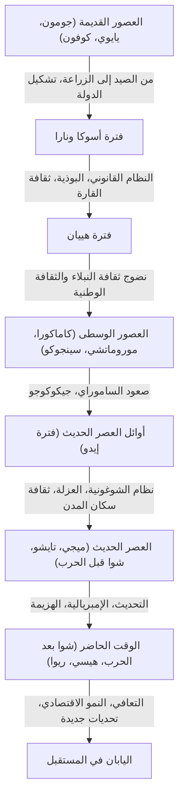

## مقدمة: ما جلبته الظروف الجغرافية كدولة جزرية

يقع الأرخبيل الياباني في الطرف الشرقي للقارة الأوراسية. كان لهذه البيئة الجغرافية الفريدة كدولة جزرية تأثير حاسم في تشكيل تاريخ وثقافة اليابان. لقد مكنتها من استقبال التقنيات والثقافات والأفكار الجديدة من القارة بمسافة مناسبة، مع تقليل مخاطر التعرض للغزو المباشر أو السيطرة من الخارج. ونتيجة لذلك، تمكنت اليابان من دمج الثقافات الأجنبية مع مناخها المحلي وروحانيتها، ورعاية هوية فريدة على مدى فترة طويلة من الزمن. في هذا المقال، سنقوم بتفكيك المسيرة الملحمية لليابان من فترة جومون إلى العصر الحديث بالتفصيل، من وجهات نظر متعددة تشمل السياسة والاقتصاد والثقافة وحياة الناس.

## الفصل الأول: من الصيد وجمع الثمار إلى الزراعة (فترتا جومون ويايوي)

### فترة جومون: التعايش مع الطبيعة وعالم روحي غني
يقدر أن فترة جومون بدأت قبل حوالي 15,000 عام. عاش الناس حياة قائمة على الصيد وصيد الأسماك وجمع الثمار. وتعتبر السمة الأبرز لهذه الفترة هي وجود الأواني الفخارية (فخار جومون)، والتي يُقال إنها من أقدم الأواني في العالم. هذه الأواني، المزينة بنقوش حبال على سطحها، لم تكن مجرد أدوات للطبخ والتخزين، بل كانت تتميز بزخارف معقدة تعكس الحس الجمالي العالي والعالم الروحي الغني للناس في ذلك الوقت. بالإضافة إلى ذلك، تقدم الاستقرار وتأسست مستوطنات واسعة النطاق (مثل موقع سانّاي-ماروياما). ويُعتقد أنهم، ورغم اعتمادهم على خيرات الطبيعة، قد تكيفوا مع التغيرات المناخية وبنوا مجتمعاً مستداماً.

### فترة يايوي: وصول زراعة الأرز الرطب والتحول الاجتماعي
بدءًا من القرن الرابع قبل الميلاد تقريبًا، وصلت تقنيات زراعة الأرز الرطب والأدوات المعدنية (الحديد والبرونز) من القارة، مما إيذن ببدء فترة يايوي. أدى بدء زراعة الأرز إلى إحداث تحول جذري في أسلوب حياة الناس. أصبح من الممكن تراكم الإنتاج الفائض، وبدأت تظهر فوارق في الثروة وطبقات بين أولئك الذين يديرون هذه الفوائض وأولئك الذين لا يملكونها. أصبحت المستوطنات "مستوطنات محاطة بخنادق" محاطة بالخنادق والسواتر الترابية، وبدأت النزاعات حول حقوق الأراضي والمياه تحدث بشكل متكرر. في هذه الفترة، ظهرت العديد من الدول الصغيرة، وتسجل الكتب التاريخية الصينية (مثل "تاريخ وي: سجلات وا") كيف أن الملكة هيميكو من مملكة ياماتاي كانت تحكم العديد من الدول.

## الفصل الثاني: تشكيل الدولة واستقبال ثقافة القارة (فترات كوفون وأسوكا ونارا)

### فترة كوفون: قبور ضخمة تروي تركيز السلطة
منذ النصف الثاني من القرن الثالث، بدأت تبنى مدافن قديمة ضخمة، مثل قبور كوفون التي تأخذ شكل ثقب المفتاح، في مناطق مختلفة. وهذا يعني ظهور حكام أقوياء (عشائر) يسيطرون على مناطق واسعة. وعلى وجه الخصوص، قامت مملكة ياماتو المتمركزة في منطقة كينكي بإخضاع العشائر المحلية والمضي قدماً في توحيد البلاد. ويُمكن ملاحظة حجم السلطة في ذلك الوقت وتأثير التقنيات من القارة (مثل أدوات الخيل وفخار سويكي) من خلال حجم القبور والمقتنيات الجنائزية.

### فترة أسوكا ونارا: بناء الدولة القائمة على القانون وازدهار البوذية
في منتصف القرن السادس، عندما تم إدخال البوذية من مملكة بايكجي (في كوريا)، واجه المجتمع الياباني نقطة تحول رئيسية. حيث قام الأمير شوتوكو وآخرون بحماية البوذية وتأسيس نظام المراتب الاثنتي عشرة والدستور المكون من 17 مادة، واضعين بذلك أساس نظام دولة مركزي يترأسه الإمبراطور. بعد ذلك، ومن خلال إصلاحات تايكا (عام 645)، بدأ بشكل جدي بناء دولة يحكمها القانون وفقاً للنظام القانوني في الصين (سلالة تانغ).
وعندما تم نقل العاصمة إلى هيجوكيو (نارا) في عام 710، تم إدخال التقنيات والثقافات المتقدمة من القارة بنشاط من خلال البعثات المرسلة إلى تانغ. وازدهرت ثقافة تيمبيو، والتي يمثلها بناء تمثال بوذا العظيم في معبد تودايجي، وتم تجميع الكتب التاريخية مثل "كوجيكي" (سجل الأمور القديمة) و"نيهون شوكي" (سجلات اليابان) والأعمال الأدبية مثل "مانيوشو" (مجموعة العشرة آلاف ورقة)، مما أدى إلى ترسيخ الهوية الذاتية للدولة.

## الفصل الثالث: ازدهار ثقافة النبلاء والثقافة الوطنية (فترة هييان)

استمرت فترة هييان لحوالي 400 عام بدءًا من نقل العاصمة إلى هييان-كيو في عام 794، وكانت حقبة سيطر فيها النبلاء، وبشكل خاص عشيرة فوجيوارا، على السلطة. ومع إلغاء البعثات إلى تانغ (عام 894)، تم استيعاب واستيعاب ثقافة القارة، وتطورت "ثقافة وطنية" (كوكوفو بونكا) فريدة تناسب المناخ والحساسية اليابانية.
والأمر الأكثر أهمية هو ولادة "الحروف المقطعية" (هيراغانا وكاتاكانا). وقد مكّن ذلك من التعبير عن مشاعر ومناظر الناس الدقيقة باللغة اليابانية، وولدت أعمال أدبية عالمية المستوى مثل "حكاية جينجي" لموراساكي شيكيبو و"كتاب الوسادة" لسي شوناجون. كما انتشرت طائفة الأرض الطاهرة، وتغلغلت فكرة تمني ولادة جديدة في الجنة من أميدا نايوراي (بوذا أميتابها) من النبلاء إلى عامة الشعب.

## الفصل الرابع: صعود الساموراي ومجتمع العصور الوسطى (فترات كاماكورا، موروماتشي، وسينجوكو)

### تأسيس شوغونية كاماكورا وحكومة المحاربين
في نهاية فترة هييان، برز محاربو الساموراي الذين اكتسبوا قوتهم من الحفاظ على الأمن في الأقاليم. أطاح ميناموتو نو يوريتومو بعشيرة تايرا وأسس شوغونية كاماكورا في عام 1192. وكانت هذه أول حكومة كاملة يحكمها الساموراي، وتختلف عن حكم البلاط الإمبراطوري أو النبلاء. تم تنفيذ الحكم بناءً على علاقة سيد-تابع (النظام الإقطاعي) تُعرف باسم "الخدمة والمكافأة" (Goon to Hoko)، وتم تشكيل ثقافة محاربين بسيطة وقوية. بالإضافة إلى ذلك، ولدت بوذية جديدة (بوذية كاماكورا الجديدة)، وانتشر الإيمان على نطاق واسع بين عامة الناس من خلال ممارسات بسيطة مثل ترديد اسم بوذا (نينبوتسو) وتأمل الزن.

### ثقافة موروماتشي وعصر قلب المراتب (جيكوكوجو)
في عام 1338، أسس أشيكاغا تاكاوجي شوغونية موروماتشي في كيوتو. شهدت فترة موروماتشي تطوراً اقتصادياً بفضل تجارة الختم مع سلالة مينغ، وازدهرت ثقافة كيتاياما وهيغاشياما، والتي يمثلها الجناحان الذهبي والفضي. في هذه الفترة، تم تأسيس الفنون وأساليب الحياة التي تشكل الأساس للثقافة اليابانية الحديثة، مثل حفل الشاي وتنسيق الزهور ومسرح النو.
ومع ذلك، بعد حرب أونين (1467)، تراجعت سلطة الشوغونية، ودخلت البلاد فترة سينجوكو (الممالك المتحاربة) حيث انتشر اتجاه "جيكوكوجو" (المرؤوس يطيح برئيسه)، حيث أطاح الأقوياء بمن هم فوقهم. سعت أسماء الساموراي في مختلف المناطق إلى إثراء أراضيها وتقوية جيوشها، وبدأ الاتصال بأوروبا (ثقافة نانبان)، مثل إدخال الأسلحة النارية ونشر المسيحية.

## الفصل الخامس: عالم من السلام والنضج الفريد (فترة إيدو)

في عام 1603، أسس توكوغاوا إياسو شوغونية إيدو، وبدأت حقبة سلام استمرت لحوالي 260 عامًا (السلام التوكوغاوي). طبقت الشوغونية نظامًا صارمًا للطبقات (ساموراي، مزارعون، حرفيون، وتجار)، وفرضت على اللوردات الإقطاعيين (الدايميو) التناوب على الحضور إلى إيدو (سانكين-كوتاي)، وأرست نظام حكم قوي (نظام شوغونية وإقطاعيات).
فيما يتعلق بالسياسة الخارجية، تم حظر المسيحية بشكل صارم، واعتمد نظام "البلد المغلق" (ساكوكو) حيث اقتصرت التجارة على هولندا والصين (سلالة تشينغ) فقط في ناغاساكي. أدى ذلك إلى الحد من التحفيز الخارجي، ولكن داخل البلاد، تحسنت الإنتاجية الزراعية وتطور اقتصاد السلع بشكل كبير.
في المناطق الحضرية التي تركزت حول أوساكا وإيدو، ازدهرت ثقافة سكان المدن (ثقافة جينروكو وكاسي). تم تنمية ثقافة متنوعة وراقية، مثل مطبوعات أوكييو-إي، والكابوكي، والهايكاي، والدراسات الهولندية (رانجاكو). وبفضل انتشار مدارس المعابد (تيراكويا)، وصلت معدلات معرفة القراءة والكتابة بين عامة الناس إلى مستوى عالٍ جدًا مقارنة بالمعايير العالمية. أصبح هذا التطور الداخلي ومستوى التعليم العالي أساسًا قويًا للتحديث اللاحق.

## الفصل السادس: قفزة نحو دولة حديثة (ميجي، تايشو، وأوائل شوا)

### استعらし ميجي وإثراء الدولة وتقوية الجيش
انتهت فترة العزلة الوطنية مع وصول أسطول بيري في عام 1853، واضطرت اليابان إلى فتح أبوابها. في مواجهة تهديد القوى الغربية، أطاحت اليابان بالشوغونية من خلال استعراش ميجي في عام 1868 وسارعت لبناء دولة قومية حديثة يترأسها الإمبراطور.
تحت شعارات "إثراء الدولة وتقوية الجيش" و"تشجيع الصناعة" و"التنوير الحضاري"، أدخلت اليابان بسرعة هائلة الأنظمة السياسية الغربية والقوانين والعلوم والتكنولوجيا والنظام العسكري. وفي عام 1889، تم إصدار دستور إمبراطورية اليابان، لتصبح دولة دستورية بأول نظام وزاري وبرلمان في آسيا. بعد الحربين الصينية اليابانية والروسية اليابانية، انضمت اليابان إلى صفوف القوى العظمى في المجتمع الدولي، وحققت الثورة الصناعية، وطورت اقتصادًا رأسماليًا.

### ديمقراطية تايشو والطريق إلى الحرب
خلال فترة تايشو، وعلى خلفية الازدهار الاقتصادي الناجم عن الحرب العالمية الأولى، تقدم التحضر، وازدهرت الحركات السياسية والثقافية الليبرالية المعروفة باسم "ديمقراطية تايشو". تم استهلاك الثقافة الجماهيرية وانتشرت أنماط الحياة الحديثة.
ومع ذلك، ومع دخول فترة شوا، وعلى خلفية الضربة الاقتصادية الناتجة عن الكساد الكبير واستنزاف المجتمعات الريفية، تقدم صعود الجيش واختلال السياسات الحزبية. عززت اليابان توسعها في القارة الصينية، وسرعان ما غرقت في مستنقع الحرب الصينية اليابانية، ثم دخلت في حرب المحيط الهادئ في عام 1941. في أغسطس 1945، وبعد إلقاء القنبلتين الذريتين على هيروشيما وناغاساكي، ودخول الاتحاد السوفيتي في الحرب، قبلت اليابان إعلان بوتسدام، وعانت أول هزيمة واحتلال عسكري أجنبي في تاريخها.

## الفصل السابع: النهوض من بين الأنقاض وآفاق المستقبل (العصر الحديث)

### النمو الاقتصادي المعجزة والمسيرة كدولة مسالمة
تحت احتلال القيادة العليا لقوات الحلفاء (GHQ)، خضعت اليابان لإصلاحات شاملة لنزع السلاح وإرساء الديمقراطية. ويقوم دستور اليابان، الذي دخل حيز التنفيذ في عام 1947، على المبادئ الأساسية للسيادة الشعبية واحترام حقوق الإنسان الأساسية والسلام.
بعد استعادة استقلالها بموجب معاهدة سان فرانسيسكو للسلام عام 1951، سرعت اليابان من تعافيها الاقتصادي مستفيدة من الطلب الخاص الناجم عن الحرب الكورية. وخلال فترة "النمو الاقتصادي المرتفع" من منتصف الخمسينيات إلى أوائل السبعينيات، وسعت اقتصادها بوتيرة مذهلة، ونمت لتصبح ثاني أكبر قوة اقتصادية في العالم. اجتاحت الصناعات التحويلية مثل السيارات والإلكترونيات الاستهلاكية الأسواق العالمية، وتحسن مستوى معيشة الناس بشكل كبير.

### التحديات المعاصرة وخلق قيم جديدة
بعد انهيار اقتصاد الفقاعة في أوائل التسعينيات، شهدت اليابان فترة طويلة من الركود الاقتصادي تعرف غالبًا باسم "العقود الثلاثة الضائعة". وتواجه الآن قضايا اجتماعية خطيرة مثل انخفاض معدل المواليد وشيخوخة السكان، وتراجع عدد السكان، وهجرة سكان الريف، والاستجابة للكوارث الكبرى (مثل زلزال شرق اليابان الكبير).
ومن ناحية أخرى، تحظى الثقافة الشعبية (اليابان الرائعة) مثل الأنمي والمانغا والألعاب وثقافة الطعام بتقدير كبير في جميع أنحاء العالم، ويزداد حضورها كقوة ناعمة. كما أنها تحتفظ بقدرة تنافسية عالية في مجالات التكنولوجيا المتقدمة مثل التقنيات البيئية والروبوتات.

## الخاتمة: استمرارية التاريخ وانتقاله إلى الجيل القادم

من أواني جومون الفخارية إلى التقنيات الحديثة العالية اليوم، كان تاريخ اليابان عملية ديناميكية من الاستيعاب المرن للتأثيرات الخارجية مع دمجها مع تقاليدها ومناخها، والاستمرار في خلق قيم جديدة.
إن روح "وا" (التناغم)، واحترام الطبيعة، وتقليد الصناعة الدقيقة التي نشأت ضمن التوازن بين الانغلاق والانفتاح كدولة جزرية، لا تزال تنبض بقوة في نفوس الشعب الياباني اليوم. من خلال استخلاص الدروس من التاريخ الماضي واحترام التنوع، ستستمر اليابان في نسج تاريخ جديد نحو مستقبل مستدام.

