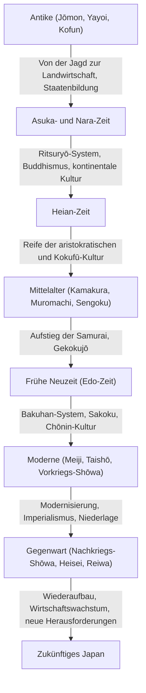

## Prolog: Was die geografischen Bedingungen als Inselstaat brachten

Der japanische Archipel, gelegen am östlichen Rand des eurasischen Kontinents. Diese einzigartige geografische Umgebung als Inselstaat hatte einen entscheidenden Einfluss auf die Bildung der Geschichte und Kultur Japans. Neue Technologien, Kulturen und Ideen vom Kontinent wurden mit angemessener Distanz aufgenommen, während das Risiko einer direkten Invasion oder Herrschaft von außen reduziert wurde. Dies ermöglichte es Japan, fremde Kulturen mit seiner eigenen Natur und Spiritualität zu verschmelzen und über einen langen Zeitraum eine einzigartige Identität zu kultivieren. In diesem Artikel werden wir die epische Geschichte Japans von der Jōmon-Zeit bis zur Gegenwart im Detail aus mehreren Perspektiven beleuchten: Politik, Wirtschaft, Kultur und das Leben der Menschen.

## Kapitel 1: Von der Jagd und dem Sammeln zur Landwirtschaft (Jōmon- und Yayoi-Zeit)

### Jōmon-Zeit: Zusammenleben mit der Natur und eine reiche spirituelle Welt
Die Jōmon-Zeit soll vor etwa 15.000 Jahren begonnen haben. Die Menschen lebten auf der Grundlage von Jagd, Fischerei und Sammeln. Das größte Merkmal dieser Zeit ist die Existenz von Töpferwaren (Jōmon-Töpferwaren), die als einige der ältesten der Welt gelten. Diese Töpferwaren mit ihren seilartigen Mustern auf der Oberfläche waren nicht nur Werkzeuge zum Kochen oder Aufbewahren, sondern besaßen eine komplexe dekorative Eigenschaft, die von dem hohen ästhetischen Sinn und der reichen spirituellen Welt der damaligen Menschen zeugt. Darüber hinaus schritt die Sesshaftigkeit voran und es bildeten sich große Siedlungen (wie die Sannai-Maruyama-Stätte). Man geht davon aus, dass sie eine nachhaltige Gesellschaft aufbauten, die sich an den Klimawandel anpasste, obwohl sie auf die Gaben der Natur angewiesen waren.

### Yayoi-Zeit: Die Einführung des Reisanbaus und die Transformation der Gesellschaft
Ab etwa dem 4. Jahrhundert v. Chr. wurden die Techniken des Nassreisanbaus und Metallwerkzeuge (Eisen und Bronze) vom Kontinent eingeführt, was den Beginn der Yayoi-Zeit markiert. Der Beginn des Reisanbaus veränderte den Lebensstil der Menschen grundlegend. Die Anhäufung von landwirtschaftlichen Überschüssen wurde möglich, und es begannen sich Klassen und Unterschiede im Reichtum zwischen denen, die den Überschuss kontrollierten, und denen, die ihn nicht hatten, zu bilden. Siedlungen wurden zu "Kango-Siedlungen" (von Wassergräben umgebene Siedlungen), umgeben von Gräben und Erdwällen, und Konflikte um Land und Wasserrechte wurden häufig. In dieser Zeit entstanden viele kleine Staaten, und chinesische historische Aufzeichnungen (wie die "Aufzeichnungen der Wei: Bericht über die Wajin") beschreiben, wie Königin Himiko von Yamataikoku über verschiedene Staaten herrschte.

## Kapitel 2: Staatenbildung und die Rezeption der kontinentalen Kultur (Kofun-, Asuka- und Nara-Zeit)

### Kofun-Zeit: Riesige Gräber als Zeugnis der Machtkonzentration
Ab der zweiten Hälfte des 3. Jahrhunderts wurden in verschiedenen Regionen riesige Kofun (schlüssellochförmige Grabhügel) errichtet. Dies bedeutet das Aufkommen mächtiger Herrscher (Gozoku), die große Gebiete kontrollierten. Insbesondere der Yamato-Staat, der sich auf die Kinki-Region konzentrierte, unterwarf regionale Clans und trieb die Vereinigung des Landes voran. Die Größe der Kofun und ihre Grabbeigaben spiegeln die damalige Machtfülle und den Einfluss kontinentaler Technologien (wie Pferdegeschirr und Sue-Töpferwaren) wider.

### Asuka- und Nara-Zeit: Aufbau des Ritsuryō-Staates und die Blütezeit des Buddhismus
Als Mitte des 6. Jahrhunderts der Buddhismus aus Baekje eingeführt wurde, erlebte die japanische Gesellschaft einen großen Wendepunkt. Prinz Shōtoku und andere schützten den Buddhismus und legten den Grundstein für einen zentralisierten Staat mit dem Kaiser im Mittelpunkt, indem sie das System der zwölf Hofränge und die 17-Artikel-Verfassung etablierten. Danach, durch die Taika-Reformen (645), begann der Aufbau eines Ritsuryō-Staates nach dem Vorbild des Rechtssystems von China (Tang-Dynastie).
Als die Hauptstadt 710 nach Heijō-kyō (Nara) verlegt wurde, wurden fortschrittliche Kulturen und Technologien des Kontinents aktiv durch die japanischen Gesandten zur Tang-Dynastie (Kentōshi) eingeführt. Die Tenpyō-Kultur, repräsentiert durch den Bau des Großen Buddha in Tōdai-ji, erblühte, und historische Bücher wie das "Kojiki" und "Nihon Shoki" sowie literarische Werke wie das "Man'yōshū" wurden zusammengestellt, wodurch die Identität als Nation gefestigt wurde.

## Kapitel 3: Das Erblühen der aristokratischen Kultur und die Kokufū-Kultur (Heian-Zeit)

Die Heian-Zeit, die ab der Verlegung der Hauptstadt nach Heian-kyō im Jahr 794 etwa 400 Jahre andauerte, war eine Ära, in der Aristokraten, einschließlich des Fujiwara-Clans, die Macht hielten. Mit der Abschaffung der Kentōshi (894) wurde die kontinentale Kultur verdaut und absorbiert, und es entwickelte sich eine einzigartige "Kokufū-Kultur" (nationale Kultur), die dem japanischen Klima und den japanischen Sensibilitäten entsprach.
Besonders wichtig ist die Entstehung der "Kana-Zeichen" (Hiragana und Katakana). Dies machte es möglich, zarte Emotionen und Szenen der Menschen auf Japanisch auszudrücken, und brachte weltberühmte literarische Werke wie das "Genji Monogatari" von Murasaki Shikibu und "Makura no Sōshi" von Sei Shōnagon hervor. Zudem verbreitete sich der Reines-Land-Buddhismus, und der Glaube, von Amida Nyorai ins Paradies gerettet zu werden, drang von den Aristokraten zu den einfachen Bürgern vor.

## Kapitel 4: Der Aufstieg der Samurai und die mittelalterliche Gesellschaft (Kamakura-, Muromachi- und Sengoku-Zeit)

### Die Gründung des Kamakura-Shogunats und die Herrschaft der Kriegerklasse
Am Ende der Heian-Zeit stiegen Samurai, die aus der Aufrechterhaltung der lokalen Sicherheit Macht geschöpft hatten, auf. Minamoto no Yoritomo besiegte den Taira-Clan und gründete 1192 das Kamakura-Shogunat. Dies war die erste vollwertige Regierung der Samurai, die sich von der Herrschaft der Aristokratie durch den Kaiser und die Adligen unterschied. Die Regierung basierte auf einer Herr-und-Vasall-Beziehung (Feudalsystem) von "Goon to Hōkō" (Gunst und Dienst), und es bildete sich eine einfache und robuste Kriegerkultur. Außerdem entstand ein neuer Buddhismus (neuer Kamakura-Buddhismus), und durch einfache Praktiken wie Nembutsu und Zazen verbreitete sich der Glaube weit unter den einfachen Menschen.

### Die Muromachi-Kultur und das Zeitalter des Gekokujō
1338 gründete Ashikaga Takauji das Muromachi-Shogunat in Kyoto. In der Muromachi-Zeit kam es zu einer wirtschaftlichen Entwicklung durch den Tally-Handel mit der Ming-Dynastie sowie zur Blüte der Kitayama- und Higashiyama-Kultur, repräsentiert durch den Goldenen und den Silbernen Pavillon. Darstellende Künste und Lebensstile, die die Grundlage der modernen japanischen Kultur bilden, wie die Teezeremonie, Blumenarrangements (Ikebana) und das Nō-Theater, wurden in dieser Zeit etabliert.
Mit dem Ōnin-Krieg (1467) verlor das Shogunat jedoch an Autorität, und das Land stürzte in die Sengoku-Zeit (Zeit der streitenden Reiche), in der der Trend des "Gekokujō" (die Unteren stürzen die Oberen) herrschte. Regionale Sengoku-Daimyō (Feudalherren) strebten nach Reichtum und militärischer Stärke. Der Kontakt mit Europa (Nanban-Kultur) begann ebenfalls, einschließlich der Einführung von Feuerwaffen und der Verbreitung des Christentums.

## Kapitel 5: Eine Zeit des Friedens und der einzigartigen Reife (Edo-Zeit)

1603 gründete Tokugawa Ieyasu das Edo-Shogunat, und es folgte eine etwa 260 Jahre andauernde Friedenszeit (Pax Tokugawa). Das Shogunat etablierte ein starkes Herrschaftssystem (Bakuhan-System), in dem das Klassensystem von Kriegern, Bauern, Handwerkern und Kaufleuten festgeschrieben wurde und den Daimyō das Sankin-kōtai (wechselnde Aufwartung) auferlegt wurde.
Was die Außenpolitik betraf, so wurde das Christentum strikt verboten und ein "Sakoku" (Landesabschluss)-System eingeführt, das den Handel auf die Niederlande und China (Qing) in Nagasaki beschränkte. Dadurch wurden externe Reize begrenzt, doch im Inland stieg die landwirtschaftliche Produktivität, und die Warenwirtschaft entwickelte sich bemerkenswert.
In städtischen Gebieten wie Osaka und Edo erblühte die Chōnin-Kultur (Stadtbürgerkultur, z.B. Genroku- und Kasei-Kultur). Eine vielfältige und raffinierte Kultur mit Ukiyo-e, Kabuki, Haikai und Rangaku (Niederlandekunde) wurde gepflegt. Durch die Verbreitung von Terakoya (Tempelschulen) erreichte die Alphabetisierungsrate der einfachen Leute ein weltweit extrem hohes Niveau. Diese endogene Entwicklung und der hohe Bildungsstand bildeten eine starke Grundlage für die spätere Modernisierung.

## Kapitel 6: Der Sprung zum modernen Staat (Meiji-, Taishō- und frühe Shōwa-Zeit)

### Die Meiji-Restauration und reiches Land, starke Armee
Mit der Ankunft von Perrys Flotte im Jahr 1853 endete die nationale Isolation, und Japan wurde gezwungen, sich zu öffnen. Angesichts der Bedrohung durch die westlichen Mächte stürzte Japan durch die Meiji-Restauration von 1868 das Shogunat und beeilte sich, einen modernen Nationalstaat mit dem Kaiser im Mittelpunkt aufzubauen.
Unter den Slogans "Fukoku Kyōhei" (Reiches Land, starke Armee), "Shokusan Kōgyō" (Förderung der Industrie) und "Bunmei Kaika" (Zivilisation und Aufklärung) wurden westliche politische Systeme, Gesetze, Wissenschaft und Technologie sowie militärische Systeme mit enormer Geschwindigkeit eingeführt. 1889 wurde die Verfassung des Kaiserreichs Japan verkündet, womit Japan zum ersten konstitutionellen Staat in Asien mit einem Kabinettssystem und einem Parlament wurde. Nach dem Ersten Sino-Japanischen und dem Russisch-Japanischen Krieg trat Japan in die Reihen der Großmächte der internationalen Gemeinschaft ein, vollzog die industrielle Revolution und entwickelte eine kapitalistische Wirtschaft.

### Die Taishō-Demokratie und der Weg in den Krieg
In der Taishō-Zeit schritt die Urbanisierung vor dem Hintergrund des wirtschaftlichen Booms des Ersten Weltkriegs voran, und liberale politische und kulturelle Bewegungen, die als "Taishō-Demokratie" bekannt sind, erlebten einen Aufschwung. Die Massenkultur wurde konsumiert und moderne Lebensstile verbreiteten sich.
Mit dem Beginn der Shōwa-Zeit schritten jedoch der Aufstieg des Militärs und die Dysfunktion der Parteipolitik voran, vor dem Hintergrund der wirtschaftlichen Auswirkungen der Weltwirtschaftskrise und der Erschöpfung der ländlichen Gebiete. Japan verstärkte seine Expansion auf das chinesische Festland und geriet schließlich in den Morast des Zweiten Sino-Japanischen Krieges und 1941 in den Pazifikkrieg. Im August 1945, nach dem Abwurf der Atombomben auf Hiroshima und Nagasaki und dem Eintritt der Sowjetunion in den Krieg, akzeptierte Japan die Potsdamer Erklärung und erlebte die erste Niederlage und Besetzung durch ausländische Truppen in seiner Geschichte.

## Kapitel 7: Wiederaufbau aus den Ruinen und Ausblick auf die Zukunft (Gegenwart)

### Das Wunder des Wirtschaftswachstums und der Weg als friedliche Nation
Unter der Besatzung durch das GHQ (General Headquarters of the Supreme Commander for the Allied Powers) durchlief Japan tiefgreifende Reformen zur Entmilitarisierung und Demokratisierung. Die 1947 in Kraft getretene japanische Verfassung hat die Volkssouveränität, die Achtung der grundlegenden Menschenrechte und den Pazifismus als ihre Grundprinzipien.
Japan erlangte seine Unabhängigkeit mit dem Friedensvertrag von San Francisco 1951 zurück und beschleunigte seinen wirtschaftlichen Wiederaufbau, ausgelöst durch die Sonderbeschaffungen während des Koreakrieges. Während der "Phase des schnellen Wirtschaftswachstums" von Mitte der 1950er bis Anfang der 1970er Jahre weitete sich das Wirtschaftsvolumen in einem erstaunlichen Tempo aus, und das Land wuchs zur zweitgrößten Volkswirtschaft der Welt heran. Die Fertigungsindustrie, darunter Autos und Haushaltsgeräte, dominierte den Weltmarkt, und der Lebensstandard der Bevölkerung verbesserte sich dramatisch.

### Zeitgenössische Herausforderungen und die Schaffung neuer Werte
Nach dem Platzen der Bubble-Wirtschaft Anfang der 1990er Jahre hat Japan eine lange Phase der wirtschaftlichen Stagnation erlebt, die oft als die "verlorenen 30 Jahre" bezeichnet wird. Das Land steht vor ernsten gesellschaftlichen Herausforderungen wie einer alternden Bevölkerung bei sinkenden Geburtenraten, Bevölkerungsrückgang, Entvölkerung ländlicher Gebiete und der Bewältigung massiver Naturkatastrophen (wie dem großen Erdbeben in Ostjapan).
Auf der anderen Seite wird die Popkultur (Cool Japan) wie Anime, Manga, Spiele und die Esskultur weltweit hoch geschätzt, und ihre Präsenz als Soft Power nimmt zu. Darüber hinaus behauptet Japan weiterhin eine hohe Wettbewerbsfähigkeit in Spitzentechnologiebereichen wie Umwelttechnologien und Robotik.

## Fazit: Die Kontinuität der Geschichte und ihre Weitergabe an die nächste Generation

Von Jōmon-Töpferwaren bis hin zu modernen Hochtechnologien war die Geschichte Japans ein dynamischer Prozess, in dem Einflüsse von außen flexibel aufgenommen, mit den eigenen Traditionen und dem eigenen Klima verschmolzen und kontinuierlich neue Werte geschaffen wurden.
Der Geist des "Wa" (Harmonie), der in der Balance zwischen der Geschlossenheit und Offenheit eines Inselstaates kultiviert wurde, die Ehrfurcht vor der Natur und die Tradition der sorgfältigen Handwerkskunst (Monozukuri) leben in den heutigen Japanern ununterbrochen weiter. Indem Japan Lehren aus der Geschichte zieht und die Vielfalt respektiert, wird es weiterhin eine neue Geschichte in Richtung einer nachhaltigen Zukunft spinnen.

