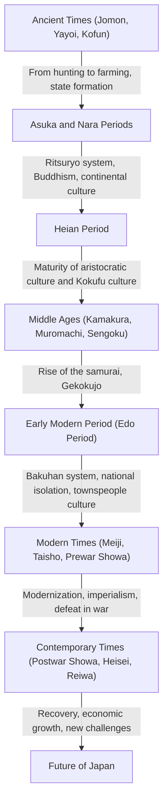

## Prologue: What the Geographical Condition of an Island Nation Brought

The Japanese archipelago is located at the eastern edge of the Eurasian continent. This unique geographical environment of an island nation has had a decisive influence on the formation of Japan's history and culture. While accepting new technologies, cultures, and ideas from the continent with a moderate sense of distance, Japan was able to reduce the risk of direct invasion and domination from the outside. This enabled Japan to fuse foreign cultures with its own climate and spirituality, fostering a unique identity over a long period. In this article, we will unravel in detail the epic journey of Japan from the Jomon period to the modern era, from multiple perspectives including politics, economy, culture, and people's lives.

## Chapter 1: From Hunter-Gathering to Farming (Jomon and Yayoi Periods)

### Jomon Period: Coexistence with Nature and a Rich Spiritual World
The Jomon period is said to have begun about 15,000 years ago. People led a life based on hunting, fishing, and gathering. The greatest feature of this era is the existence of pottery (Jomon pottery), which is said to be among the oldest in the world. These pottery pieces, decorated with cord markings on their surfaces, were not merely tools for cooking and storage, but had complex decorative qualities, testifying to the high aesthetic sense and rich spiritual world of the people of that time. In addition, settlement progressed, and large-scale villages (such as the Sannai-Maruyama site) were formed. It is believed that they built a sustainable society, adapting to climate change while relying on the blessings of nature.

### Yayoi Period: The Introduction of Rice Cultivation and Social Transformation
From around the 4th century BC, wet-rice cultivation techniques and metal tools (iron and bronze) were introduced from the continent, marking the dawn of the Yayoi period. The start of rice farming fundamentally transformed people's lifestyles. The accumulation of surplus products became possible, and a gap in wealth and classes began to emerge between those who managed it and those who did not. Villages became "moated settlements" surrounded by moats and earthworks, and disputes over land and water rights began to occur frequently. During this period, many small states arose, and Chinese historical records (such as the "Wajinden" in the Records of Wei) describe how Himiko, the queen of Yamatai-koku, ruled over various states.

## Chapter 2: State Formation and the Reception of Continental Culture (Kofun, Asuka, and Nara Periods)

### Kofun Period: Massive Tombs Tell of the Concentration of Power
From the latter half of the 3rd century, massive keyhole-shaped tombs (kofun) began to be constructed in various places. This signifies the emergence of powerful rulers (local chieftains) who governed wide areas. In particular, the Yamato Kingship, centered in the Kinki region, subjugated local chieftains and advanced the unification of the country. From the scale of the tombs and the burial goods, one can see the magnitude of the power at that time and the influence of technologies from the continent (such as horse harnesses and Sue pottery).

### Asuka and Nara Periods: Construction of a Ritsuryo State and the Prosperity of Buddhism
When Buddhism was introduced from Baekje in the mid-6th century, Japanese society reached a major turning point. Prince Shotoku and others protected Buddhism, established the Twelve Level Cap and Rank System and the Seventeen-Article Constitution, laying the foundation for a centralized state system centered on the Emperor. After the Taika Reform (645), the construction of a Ritsuryo state modeled after the legal system of China (Tang) began in earnest.
When the capital was moved to Heijo-kyo (Nara) in 710, advanced culture and technologies from the continent were actively introduced through envoys to Tang China. The Tenpyo culture, represented by the construction of the Great Buddha at Todai-ji Temple, blossomed. Historical books such as the "Kojiki" and "Nihon Shoki," as well as literary works like the "Manyoshu," were compiled, establishing the country's self-identity.

## Chapter 3: The Blossoming of Aristocratic Culture and Kokufu Culture (Heian Period)

The Heian period, which lasted for about 400 years from the relocation of the capital to Heian-kyo in 794, was an era in which nobles, led by the Fujiwara clan, held power. Triggered by the abolition of the envoys to Tang (894), the continental culture was digested and absorbed, developing into a unique "Kokufu culture" (national style culture) that suited the climate and sensibilities of Japan.
Particularly important was the birth of "kana characters (hiragana and katakana)." This made it possible to express people's delicate emotions and scenes in Japanese, producing world-renowned literary works such as Murasaki Shikibu's "The Tale of Genji" and Sei Shonagon's "The Pillow Book." In addition, Pure Land Buddhism spread, and the ideology of wishing for rebirth in the pure land by praying to Amitabha Tathagata permeated from the nobility to the common people.

## Chapter 4: The Rise of the Samurai and Medieval Society (Kamakura, Muromachi, and Sengoku Periods)

### Establishment of the Kamakura Shogunate and Warrior Government
At the end of the Heian period, samurai who had gained power from maintaining public order in the provinces emerged. Minamoto no Yoritomo overthrew the Taira clan and established the Kamakura Shogunate in 1192. This was the first full-fledged government by warriors, distinct from the court noble government by the Emperor and aristocrats. Governance based on a master-servant relationship (feudal system) called "Go-on to Hoko" (favor and service) was implemented, forming a simple and sturdy warrior culture. Additionally, new schools of Buddhism (Kamakura New Buddhism) were born, spreading faith widely among the common people through simple practices such as chanting the Nembutsu and Zen meditation.

### Muromachi Culture and the Era of Gekokujo
In 1338, Ashikaga Takauji established the Muromachi Shogunate in Kyoto. The Muromachi period saw economic development through the tally trade with Ming China and the flourishing of the Kitayama and Higashiyama cultures, represented by the Golden and Silver Pavilions. Performing arts and lifestyles that form the foundation of modern Japanese culture, such as the tea ceremony, flower arrangement (ikebana), and Noh theater, were established during this time.
However, with the Onin War (1467) as a turning point, the authority of the Shogunate plummeted, plunging into the Sengoku (Warring States) period, where the trend of "Gekokujo" (those below overthrowing those above) prevailed. Sengoku daimyo (feudal lords) in various regions strove for wealth and military strength, and contact with Europe (Nanban culture) began, including the introduction of firearms and the propagation of Christianity.

## Chapter 5: An Era of Peace and Unique Maturity (Edo Period)

In 1603, Tokugawa Ieyasu established the Edo Shogunate, bringing about a peaceful era (Pax Tokugawa) that lasted for about 260 years. The Shogunate fixed the class system of warriors, farmers, artisans, and merchants, and laid down a rigid ruling system (Bakuhan system), such as making the Sankin-kotai (alternate attendance) mandatory for daimyo.
As for foreign policy, the Shogunate strictly prohibited Christianity and adopted a "Sakoku" (national isolation) policy, limiting trade only to the Netherlands and China (Qing) at Nagasaki. While this restricted external stimuli, agricultural productivity improved domestically, and the commercial economy developed remarkably.
In urban areas centered around Osaka and Edo, townspeople's culture (Genroku culture and Kasei culture) blossomed. Diverse and sophisticated cultures such as Ukiyo-e, Kabuki, Haikai, and Rangaku (Dutch studies) were nurtured, and with the spread of Terakoya (temple schools), the literacy rate of commoners reached an extremely high level by global standards. This endogenous development and high educational standard became a powerful foundation for later modernization.

## Chapter 6: The Leap to a Modern State (Meiji, Taisho, and Early Showa Periods)

### The Meiji Restoration and Wealthy Nation, Strong Army
The arrival of Commodore Perry in 1853 spelled the end of national isolation, forcing Japan to open its doors. Faced with the threat of the Western powers, Japan overthrew the Shogunate through the Meiji Restoration in 1868 and hurried to build a modern nation-state centered on the Emperor.
Under the slogans of "Fukoku Kyohei" (Wealthy Nation, Strong Army), "Shokusan Kogyo" (Encouragement of New Industry), and "Bunmei Kaika" (Civilization and Enlightenment), Japan furiously introduced Western political systems, laws, science and technology, and military systems. In 1889, the Constitution of the Empire of Japan was promulgated, making it a constitutional state with Asia's first cabinet system and parliament. Through the Sino-Japanese and Russo-Japanese Wars, Japan joined the ranks of the great powers in the international community, accomplished the Industrial Revolution, and developed a capitalist economy.

### Taisho Democracy and the Road to War
During the Taisho period, urbanization advanced against the backdrop of an economic boom from World War I, and a liberal political and cultural movement known as "Taisho Democracy" surged. Mass culture was consumed, and modern lifestyles became widespread.
However, entering the Showa period, against the backdrop of economic blows from the Great Depression and the impoverishment of rural villages, the rise of the military and the dysfunction of party politics progressed. Japan intensified its advance into the Chinese mainland, eventually plunging into the quagmire of the Second Sino-Japanese War, and then into the Pacific War in 1941. In August 1945, after the atomic bombings of Hiroshima and Nagasaki and the Soviet Union's entry into the war, Japan accepted the Potsdam Declaration, experiencing its first-ever defeat in recorded history and occupation by foreign military forces.

## Chapter 7: Recovery from the Ashes and Prospects for the Future (Modern Era)

### Miraculous Economic Growth and the Path as a Peaceful Nation
Under the occupation of GHQ (General Headquarters of the Supreme Commander for the Allied Powers), Japan underwent sweeping reforms of demilitarization and democratization. The Constitution of Japan, which came into effect in 1947, establishes popular sovereignty, respect for fundamental human rights, and pacifism as its basic principles.
Japan, which regained its independence with the San Francisco Peace Treaty in 1951, accelerated its economic recovery triggered by the special procurement of the Korean War. During the "High Economic Growth Period" from the mid-1950s to the early 1970s, it expanded its economic scale at an astonishing pace, growing into the world's second-largest economic power. Manufacturing industries such as automobiles and home appliances swept the global market, and the living standards of the people improved dramatically.

### Modern Challenges and the Creation of New Value
After the collapse of the bubble economy in the early 1990s, Japan has experienced a prolonged period of economic stagnation, also known as the "Lost 30 Years." It faces serious social challenges such as a declining birthrate and aging population, population decline, depopulation in rural areas, and responses to mega-disasters (such as the Great East Japan Earthquake).
On the other hand, pop culture (Cool Japan) such as anime, manga, video games, and food culture is highly evaluated worldwide, increasing its presence as soft power. Furthermore, Japan continues to maintain high competitiveness in advanced technological fields such as environmental technology and robotics.

## Conclusion: Historical Continuity and Inheritance by the Next Generation

From Jomon pottery to modern high-tech, Japan's history has been a dynamic process of flexibly receiving external influences while fusing them with its own traditions and climate to continue creating new value.
The spirit of "Wa" (harmony), reverence for nature, and the tradition of meticulous craftsmanship—cultivated within the balance of closedness and openness as an island nation—continue to live on continuously in the Japanese people today. Learning lessons from past history and respecting diversity, Japan will surely continue to weave a new history towards a sustainable future.

