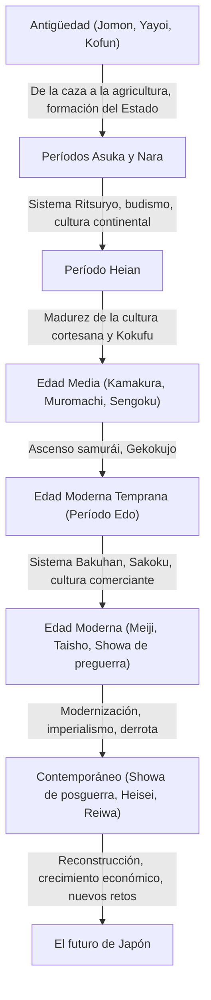

## Prólogo: Lo que trajo la condición geográfica de un país insular

El archipiélago japonés se encuentra en el extremo oriental del continente euroasiático. Este entorno geográfico único, como nación insular, ha tenido una influencia decisiva en la formación de la historia y cultura japonesas. Pudo reducir el riesgo de invasión y dominación directa desde el exterior, al mismo tiempo que aceptaba nuevas tecnologías, culturas e ideas del continente manteniendo una distancia adecuada. Esto permitió a Japón fusionar la cultura extranjera con su propio clima y espiritualidad, y cultivar su propia identidad única durante un largo período de tiempo. En este artículo, desentrañaremos detalladamente el gran viaje de Japón desde el período Jomon hasta la actualidad, desde diversas perspectivas como la política, la economía, la cultura y la vida de las personas.

## Capítulo 1: De la caza y recolección a la agricultura (Períodos Jomon y Yayoi)

### Período Jomon: Convivencia con la naturaleza y un mundo espiritual rico
El período Jomon, que se cree que comenzó hace unos 15.000 años. La gente llevaba una vida basada en la caza, la pesca y la recolección. La característica más importante de esta época es la existencia de vasijas de barro (cerámica Jomon) que se dice que son de las más antiguas del mundo. Estas vasijas con patrones de cuerdas en su superficie no eran solo herramientas para cocinar y almacenar, sino que tenían un diseño decorativo complejo, lo que atestigua el alto sentido estético y el rico mundo espiritual de las personas de la época. Además, avanzó la vida sedentaria y se formaron asentamientos a gran escala (como el sitio arqueológico Sannai-Maruyama). Se cree que construyeron una sociedad sostenible adaptándose al cambio climático, aunque dependían de los recursos naturales.

### Período Yayoi: La introducción de la agricultura de arroz húmedo y la transformación social
A partir del siglo IV a. C., la tecnología del cultivo de arroz húmedo y las herramientas de metal (hierro y bronce) se introdujeron desde el continente, marcando el inicio del período Yayoi. El inicio del cultivo de arroz transformó fundamentalmente el estilo de vida de las personas. Se hizo posible la acumulación de productos excedentes, y comenzó a surgir una brecha de riqueza y clases sociales entre quienes los administraban y quienes no. Los asentamientos se convirtieron en "asentamientos rodeados por fosos" con trincheras y terraplenes, y los conflictos por la tierra y los derechos de agua se volvieron frecuentes. En esta época surgieron numerosos estados pequeños, y los libros de historia chinos (como el "Gishi Wajinden") registran que Himiko, la reina de Yamataikoku, gobernaba sobre varios países.

## Capítulo 2: Formación del Estado y recepción de la cultura continental (Períodos Kofun, Asuka y Nara)

### Período Kofun: La concentración de poder revelada por enormes tumbas
Desde finales del siglo III, comenzaron a construirse enormes túmulos funerarios con forma de cerradura (Kofun) en varias regiones. Esto significa la aparición de individuos o familias poderosas (Gozoku) que gobernaban áreas extensas. En particular, la corte de Yamato, centrada en la región de Kinki, sometió a los poderosos clanes regionales y promovió la unificación del país. A partir del tamaño de los túmulos funerarios y de los bienes funerarios, se puede observar la magnitud del poder de la época y la influencia de la tecnología continental (como los arreos de caballos y la cerámica Sueki).

### Períodos Asuka y Nara: Construcción de un Estado basado en leyes (Ritsuryo) y prosperidad del budismo
Cuando el budismo se introdujo desde Baekje a mediados del siglo VI, la sociedad japonesa alcanzó un importante punto de inflexión. El Príncipe Shotoku y otros protegieron el budismo y sentaron las bases de un sistema estatal centralizado con el Emperador en su centro, promulgando el Sistema de Doce Rangos y la Constitución de los Diecisiete Artículos. Posteriormente, a través de la Reforma Taika (645), comenzó en serio la construcción de un estado basado en leyes (Ritsuryo) modelado según el sistema legal de China (dinastía Tang).
Cuando la capital se trasladó a Heijo-kyo (Nara) en 710, se introdujeron activamente culturas y tecnologías avanzadas del continente a través de las misiones a la China Tang (Kentoshi). Floreció la cultura Tenpyo, representada por la construcción del Gran Buda en el templo Todai-ji, y se compilaron libros de historia como el "Kojiki" y el "Nihon Shoki", y obras literarias como el "Man'yoshu", estableciendo la identidad como nación.

## Capítulo 3: Florecimiento de la cultura cortesana y cultura Kokufu (Período Heian)

El período Heian, que duró unos 400 años desde el traslado de la capital a Heian-kyo en 794, fue una época en la que la nobleza, especialmente el clan Fujiwara, ostentaba el poder. A raíz de la abolición de las misiones a la dinastía Tang (894), se digirió y asimiló la cultura continental, y se desarrolló una "cultura Kokufu" (estilo nacional) única que se adaptaba al clima y la sensibilidad de Japón.
Particularmente importante es el nacimiento del "silabario Kana (Hiragana y Katakana)". Esto hizo posible expresar las sutiles emociones y escenas de las personas en japonés, dando lugar a obras literarias de fama mundial como el "Cuento de Genji" (Genji Monogatari) de Murasaki Shikibu y "El libro de la almohada" (Makura no Soshi) de Sei Shonagon. Además, el Budismo de la Tierra Pura se extendió, y la creencia de rezar al Buda Amida por el renacimiento en el Paraíso impregnó desde la nobleza hasta la gente común.

## Capítulo 4: El ascenso de los samuráis y la sociedad medieval (Períodos Kamakura, Muromachi y Sengoku)

### Establecimiento del Shogunato Kamakura y el gobierno militar
A finales del período Heian, surgieron los samuráis, que habían ganado fuerza a partir del mantenimiento de la seguridad regional. Minamoto no Yoritomo derrocó al clan Taira y estableció el Shogunato Kamakura en 1192. Este fue el primer gobierno a gran escala liderado por samuráis, a diferencia del gobierno aristocrático (Kuge) dirigido por el Emperador y la nobleza. Se llevó a cabo un gobierno basado en la relación señor-vasallo (sistema feudal) de "Goon to Hoko" (favor y servicio), formando una cultura guerrera simple y robusta. Además, nació un nuevo budismo (el nuevo budismo de Kamakura), y la fe se extendió ampliamente entre las masas a través de prácticas simples como el Nenbutsu y el Zazen.

### Cultura Muromachi y la era del Gekokujo (los de abajo superan a los de arriba)
En 1338, Ashikaga Takauji abrió el Shogunato Muromachi en Kioto. El período Muromachi prosperó con el desarrollo económico debido al comercio de recuento (Kangou boeki) con la dinastía Ming, y las culturas Kitayama y Higashiyama representadas por el Pabellón Dorado (Kinkaku) y el Pabellón Plateado (Ginkaku). Durante este período se establecieron las artes escénicas y los estilos de vida que forman la base de la cultura japonesa moderna, como la ceremonia del té, los arreglos florales (Ikebana) y el teatro Noh.
Sin embargo, después de la Guerra de Onin (1467), la autoridad del shogunato colapsó y el país entró en el período Sengoku (de los Estados Combatientes), donde prevaleció la tendencia de "Gekokujo" (los inferiores derrocan a los superiores), en la cual los capaces derrotaban a sus superiores. Los señores de la guerra (Sengoku Daimyo) de varias regiones se esforzaron por enriquecer sus territorios y fortalecer sus ejércitos (Fukoku Kyohei), y también comenzó el contacto con Europa (cultura Nanban), como la introducción de las armas de fuego y la propagación del cristianismo.

## Capítulo 5: Era de paz y maduración única (Período Edo)

En 1603, Tokugawa Ieyasu estableció el Shogunato de Edo, dando paso a una era de paz que duraría unos 260 años (Pax Tokugawa). El shogunato fijó el sistema de clases de guerreros, agricultores, artesanos y comerciantes (Shi-no-ko-sho), y obligó a los señores feudales (Daimyo) a realizar una residencia alterna en Edo (Sankin-kotai), estableciendo un sistema de gobierno fuerte (sistema Bakuhan).
Como política exterior, se prohibió estrictamente el cristianismo y se adoptó una política de "Sakoku" (aislamiento nacional), limitando el comercio solo a los Países Bajos y China (dinastía Qing) en Nagasaki. Aunque esto limitó los estímulos externos, la productividad agrícola mejoró a nivel nacional y la economía mercantil se desarrolló significativamente.
En las zonas urbanas centradas en Osaka y Edo, floreció la cultura de los comerciantes (culturas Genroku y Kasei). Se fomentó una cultura diversa y refinada como el Ukiyo-e, el Kabuki, el Haikai y el Rangaku (estudios holandeses), y con la difusión de las escuelas del templo (Terakoya), la tasa de alfabetización de la gente común alcanzó un nivel extremadamente alto a nivel mundial. Este desarrollo endógeno y el alto nivel educativo sirvieron como una base sólida para la posterior modernización.

## Capítulo 6: El salto hacia un Estado moderno (Períodos Meiji, Taisho y principios de Showa)

### Restauración Meiji y enriquecimiento del país y fortalecimiento del ejército
Con la llegada del comodoro Perry en 1853, el aislamiento nacional llegó a su fin y Japón se vio obligado a abrir el país. Enfrentado a la amenaza de las potencias occidentales, Japón derrocó al shogunato a través de la Restauración Meiji en 1868 y se apresuró a construir un estado nacional moderno centrado en el Emperador.
Bajo los lemas de "Fukoku Kyohei" (Enriquecer al país, fortalecer el ejército), "Shokusan Kogyo" (Fomento de la industria) y "Bunmei Kaika" (Civilización e Ilustración), se introdujeron a un ritmo feroz los sistemas políticos, las leyes, la ciencia y tecnología, y los sistemas militares occidentales. En 1889, se promulgó la Constitución del Imperio del Japón, convirtiéndose en el primer estado constitucional de Asia con un sistema de gabinete y parlamento. A través de las guerras sino-japonesa y ruso-japonesa, Japón se unió a las filas de las grandes potencias en la comunidad internacional, logró la revolución industrial y desarrolló una economía capitalista.

### Democracia Taisho y el camino hacia la guerra
Durante el período Taisho, con el telón de fondo de la prosperidad económica de la Primera Guerra Mundial, avanzó la urbanización y surgieron movimientos políticos y culturales liberales conocidos como la "Democracia Taisho". Se consumió la cultura de masas y se popularizó un estilo de vida moderno.
Sin embargo, al entrar en el período Showa, con el golpe económico de la Gran Depresión y el agotamiento de las aldeas agrícolas, el ejército ganó poder y la política de partidos se volvió disfuncional. Japón intensificó su avance hacia el continente chino, desembocando en el atolladero de la Segunda Guerra Sino-Japonesa, y más tarde en la Guerra del Pacífico en 1941. En agosto de 1945, tras los bombardeos atómicos de Hiroshima y Nagasaki y la entrada de la Unión Soviética en la guerra, Japón aceptó la Declaración de Potsdam, experimentando su primera derrota y ocupación por tropas extranjeras en la historia.

## Capítulo 7: Reconstrucción desde las cenizas y perspectivas de futuro (Época contemporánea)

### Crecimiento económico milagroso y camino como nación pacífica
Bajo la ocupación del GHQ (Cuartel General del Comandante Supremo de las Fuerzas Aliadas), Japón se sometió a reformas radicales de desmilitarización y democratización. La Constitución de Japón, que entró en vigor en 1947, establece como principios fundamentales la soberanía popular, el respeto a los derechos humanos fundamentales y el pacifismo.
Tras recuperar su independencia con el Tratado de Paz de San Francisco en 1951, Japón aceleró su reconstrucción económica impulsado por la demanda especial de la Guerra de Corea. Durante el "período de rápido crecimiento económico" desde mediados de la década de 1950 hasta principios de la de 1970, la economía se expandió a un ritmo asombroso, convirtiéndose en la segunda potencia económica mundial. Las industrias manufactureras, como las de automóviles y electrodomésticos, dominaron el mercado mundial y el nivel de vida del pueblo mejoró drásticamente.

### Desafíos contemporáneos y creación de nuevo valor
Después del colapso de la economía de burbuja a principios de la década de 1990, Japón ha experimentado un largo período de estancamiento económico, también conocido como las "tres décadas perdidas". Se enfrenta a graves problemas sociales como la disminución de la tasa de natalidad y el envejecimiento de la población, el declive de la población, la despoblación rural y la respuesta a grandes desastres (como el Gran Terremoto del Este de Japón).
Por otro lado, la cultura pop (Cool Japan), como el anime, el manga, los videojuegos y la cultura gastronómica, ha ganado un gran reconocimiento en todo el mundo, aumentando su presencia como poder blando. Además, Japón mantiene un alto nivel de competitividad en campos tecnológicos avanzados como la tecnología ambiental y la robótica.

## Conclusión: Continuidad histórica y legado para la próxima generación

Desde la cerámica Jomon hasta la tecnología de alta tecnología actual, la historia de Japón ha sido un proceso dinámico de recibir de manera flexible las influencias externas, al tiempo que las fusiona con sus propias tradiciones y clima para continuar creando nuevos valores.
El espíritu de "Wa" (armonía) cultivado en el equilibrio de cierre y apertura de un país insular, el respeto por la naturaleza y la tradición de meticulosa artesanía siguen vivos en el pueblo japonés de hoy. Aprendiendo de las lecciones del pasado y respetando la diversidad, Japón seguirá tejiendo una nueva historia hacia un futuro sostenible.

