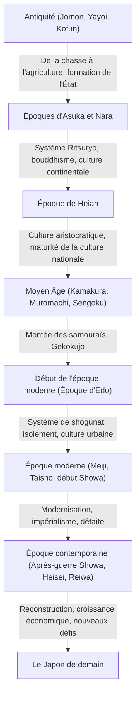

## Introduction : Les conséquences de la condition géographique d'une nation insulaire

L'archipel japonais est situé à l'extrémité orientale de l'Eurasie. Cet environnement géographique unique de pays insulaire a eu une influence décisive sur la formation de l'histoire et de la culture du Japon. Tout en acceptant les nouvelles technologies, cultures et idées du continent avec une certaine distance, il a pu réduire le risque d'invasion ou de domination directe de l'extérieur. Cela a permis au Japon de fusionner la culture étrangère avec son propre climat et sa propre spiritualité, et de cultiver une identité unique sur une longue période. Dans cet article, nous détaillerons le vaste parcours du Japon depuis la période Jomon jusqu'à nos jours, sous les angles politique, économique, culturel et de la vie des peuples.

## Chapitre 1 : De la chasse-cueillette à l'agriculture (Époques Jomon et Yayoi)

### Époque Jomon : Coexistence avec la nature et riche monde spirituel
La période Jomon, qui aurait commencé il y a environ 15 000 ans. Les gens menaient une vie basée sur la chasse, la pêche et la cueillette. La plus grande caractéristique de cette époque est la présence de poteries (poterie Jomon), dites parmi les plus anciennes du monde. Ces poteries aux motifs de corde ne sont pas de simples outils de cuisson ou de stockage, elles ont un niveau de décoration complexe, témoignant du sens esthétique élevé et du riche monde spirituel des habitants de l'époque. De plus, la sédentarisation a progressé et de grands villages (comme le site de Sannai-Maruyama) se sont formés. On pense que tout en dépendant des bienfaits de la nature, ils se sont adaptés aux changements climatiques et ont construit une société durable.

### Époque Yayoi : Introduction de la riziculture et transformation de la société
À partir d'environ le 4e siècle avant notre ère, la technique de la riziculture inondée et les outils en métal (fer et bronze) ont été introduits depuis le continent, marquant le début de l'époque Yayoi. Le début de la riziculture a fondamentalement transformé le mode de vie des gens. L'accumulation de surplus de production est devenue possible, et des disparités de richesse et de classes ont commencé à apparaître entre ceux qui la géraient et ceux qui ne l'avaient pas. Les villages sont devenus des "villages entourés de douves", entourés de fossés et de remblais de terre, et les conflits concernant les terres et les droits d'eau sont devenus fréquents. À cette époque, de petits États se sont multipliés, et les chroniques chinoises (telles que "L'Histoire des Wa" dans les Chroniques des Trois Royaumes) décrivent comment Himiko, la reine du royaume de Yamatai, régnait sur divers pays.

## Chapitre 2 : Formation de l'État et réception de la culture continentale (Époques Kofun, Asuka et Nara)

### Époque Kofun : La concentration du pouvoir révélée par des tombes géantes
À partir de la seconde moitié du 3ème siècle, des tumulus géants en forme de trou de serrure (kofun) ont commencé à être construits dans diverses régions. Cela signifie l'émergence de puissants souverains (clans influents) contrôlant de vastes zones. En particulier, la royauté de Yamato, centrée sur la région du Kansai, a soumis les clans de diverses régions et a progressé dans l'unification du pays. L'échelle des kofuns et les objets funéraires révèlent l'étendue du pouvoir de l'époque et l'influence des techniques continentales (comme le harnachement des chevaux et la poterie Sueki).

### Époques d'Asuka et Nara : Construction d'un État ritsuryo et prospérité du bouddhisme
L'introduction du bouddhisme par le royaume de Baekje au milieu du 6e siècle a marqué un tournant majeur pour la société japonaise. Le prince Shotoku et d'autres ont protégé le bouddhisme et ont établi le système des douze rangs de cour et la Constitution en 17 articles, jetant les bases d'un système d'État centralisé autour de l'empereur. Par la suite, via la réforme de Taika (645), la construction d'un État fondé sur un système de lois (ritsuryo) inspiré de celui de la Chine (dynastie Tang) a commencé sérieusement.
Lorsque la capitale a été déplacée à Heijo-kyo (Nara) en 710, la culture avancée et les technologies du continent ont été activement introduites via les missions diplomatiques envoyées vers la dynastie Tang. La culture de Tenpyo, représentée par la construction du Grand Bouddha au temple Todai-ji, s'est épanouie. Des livres d'histoire tels que le "Kojiki" et le "Nihon Shoki", ainsi que des œuvres littéraires telles que le "Man'yoshu", ont été compilés, établissant l'identité nationale du pays.

## Chapitre 3 : Épanouissement de la culture aristocratique et de la culture nationale (Époque de Heian)

La période de Heian, qui a duré environ 400 ans depuis le transfert de la capitale à Heian-kyo en 794, est une époque où l'aristocratie, avec le clan Fujiwara en tête, détenait le pouvoir. L'abolition des missions vers les Tang (894) a été l'occasion d'assimiler la culture continentale et de développer une "culture nationale" (Kokufu bunka) unique, adaptée au climat et à la sensibilité japonaise.
Particulièrement importante est la naissance des caractères "kana" (hiragana et katakana). Cela a permis d'exprimer en japonais les sentiments délicats et les scènes, donnant naissance à des œuvres littéraires de renommée mondiale telles que "Le Dit du Genji" de Murasaki Shikibu et "Les Notes de chevet" de Sei Shonagon. En outre, le bouddhisme de la Terre pure s'est répandu, et l'idée de prier le bouddha Amida pour renaître au paradis a imprégné l'aristocratie, puis le peuple.

## Chapitre 4 : L'ascension des samouraïs et la société médiévale (Époques de Kamakura, Muromachi et Sengoku)

### L'établissement du shogunat de Kamakura et le gouvernement militaire
À la fin de la période Heian, les guerriers (samouraïs) ayant gagné en puissance grâce au maintien de l'ordre en province se sont imposés. Minamoto no Yoritomo a renversé le clan Taira et a établi le shogunat de Kamakura en 1192. Il s'agissait du premier gouvernement à part entière dirigé par des samouraïs, différent du gouvernement civil de l'empereur et des nobles. Une gouvernance basée sur la relation maître-serviteur (système féodal) de "faveurs et services" a été mise en place, formant une culture militaire forte et austère. De plus, un nouveau bouddhisme (le nouveau bouddhisme de Kamakura) est né, et la foi s'est largement répandue parmi le peuple grâce à des pratiques simples comme l'incantation du nom d'Amida (nenbutsu) ou la méditation assise (zazen).

### La culture de Muromachi et l'ère du Gekokujo
En 1338, Ashikaga Takauji a établi le shogunat de Muromachi à Kyoto. L'époque de Muromachi a connu un développement économique grâce au commerce du sceau avec la dynastie Ming, et l'épanouissement des cultures de Kitayama et Higashiyama, représentées par le Pavillon d'Or et le Pavillon d'Argent. Des arts et des modes de vie qui constituent la base de la culture japonaise moderne, tels que la cérémonie du thé, l'arrangement floral (ikebana) et le théâtre nô, ont été établis pendant cette période.
Cependant, après la guerre d'Onin (1467), l'autorité du shogunat s'est effondrée, plongeant le pays dans la période Sengoku (royaumes combattants), dominée par la tendance du "Gekokujo" (les inférieurs renversent les supérieurs). Les seigneurs de la guerre (daimyos) locaux se sont efforcés d'enrichir leurs provinces et de renforcer leurs armées, et le contact avec l'Europe (culture Nanban) a également commencé, avec l'introduction des armes à feu et la propagation du christianisme.

## Chapitre 5 : L'ère de la grande paix et la maturité unique (Époque d'Edo)

En 1603, Tokugawa Ieyasu a établi le shogunat d'Edo, inaugurant une période pacifique d'environ 260 ans (Pax Tokugawana). Le shogunat a figé le système de classes (guerriers, paysans, artisans, marchands) et a imposé une gouvernance forte (système bakuhan), en obligeant notamment les daimyos à la résidence alternée (sankin kotai).
En matière de politique étrangère, le shogunat a strictement interdit le christianisme et a adopté une politique d'"isolement" (sakoku) limitant le commerce uniquement aux Pays-Bas et à la Chine (Qing) à Nagasaki. Bien que la stimulation externe ait été limitée, la productivité agricole a augmenté au niveau national, et l'économie marchande s'est considérablement développée.
Dans les zones urbaines telles qu'Osaka et Edo, la culture bourgeoise (cultures Genroku et Kasei) a fleuri. Des cultures diverses et raffinées telles que l'ukiyo-e, le kabuki, le haïku et les études hollandaises (rangaku) se sont développées, et grâce à la diffusion des écoles de temple (terakoya), le taux d'alphabétisation des roturiers a atteint un niveau extrêmement élevé à l'échelle mondiale. Ce développement endogène et le niveau élevé d'éducation ont constitué une base solide pour la modernisation ultérieure.

## Chapitre 6 : Le bond vers un État moderne (Époques Meiji, Taisho et début Showa)

### La restauration de Meiji et la richesse nationale par la force militaire
Avec l'arrivée du commodore Perry en 1853, l'isolement a pris fin, forçant le Japon à s'ouvrir. Face à la menace des puissances occidentales, le Japon a renversé le shogunat lors de la restauration de Meiji en 1868, et s'est empressé de construire un État-nation moderne centré sur l'empereur.
Sous les slogans de "pays riche, armée forte" (Fukoku Kyohei), "promotion des industries" et "civilisation et illumination", le pays a frénétiquement adopté les systèmes politiques, les lois, la science et la technologie, ainsi que les systèmes militaires de l'Occident. En 1889, la Constitution de l'Empire du Japon a été promulguée, faisant du Japon le premier État constitutionnel d'Asie à disposer d'un système de cabinet et d'un parlement. À travers les guerres sino-japonaise et russo-japonaise, le Japon a rejoint les rangs des grandes puissances au sein de la communauté internationale, a accompli sa révolution industrielle et a développé une économie capitaliste.

### La démocratie de Taisho et la voie vers la guerre
Pendant l'ère Taisho, dans un contexte de prospérité économique due à la Première Guerre mondiale, l'urbanisation a progressé et un mouvement politique et culturel libéral connu sous le nom de "Démocratie de Taisho" a pris de l'ampleur. La culture de masse a été consommée et un mode de vie moderne s'est répandu.
Cependant, à l'ère Showa, sur fond de chocs économiques causés par la Grande Dépression et d'épuisement des zones rurales, la montée des militaires et le dysfonctionnement de la politique des partis se sont aggravés. Le Japon a intensifié son expansion sur le continent chinois, plongeant bientôt dans le bourbier de la guerre sino-japonaise, puis de la guerre du Pacifique en 1941. En août 1945, après les bombardements atomiques sur Hiroshima et Nagasaki et l'entrée en guerre de l'Union soviétique, le Japon a accepté la déclaration de Potsdam, connaissant pour la première fois de son histoire la défaite et l'occupation par des troupes étrangères.

## Chapitre 7 : La reconstruction depuis les ruines et les perspectives d'avenir (Époque contemporaine)

### Un miracle de croissance économique et la voie d'une nation pacifique
Sous l'occupation du GHQ (Commandement suprême des forces alliées), le Japon a subi une démilitarisation radicale et des réformes démocratiques. La Constitution du Japon, entrée en vigueur en 1947, a pour principes fondamentaux la souveraineté populaire, le respect des droits de l'homme et le pacifisme.
Ayant recouvré son indépendance par le traité de paix de San Francisco en 1951, le Japon a accéléré sa reconstruction économique à l'occasion de la demande spéciale liée à la guerre de Corée. Au cours de la "période de haute croissance économique" s'étendant du milieu des années 1950 au début des années 1970, son économie s'est développée à un rythme effarant, devenant la deuxième plus grande puissance économique mondiale. Les industries manufacturières telles que l'automobile et l'électroménager ont dominé les marchés mondiaux, améliorant de façon spectaculaire le niveau de vie de la population.

### Les défis contemporains et la création de nouvelles valeurs
Après l'effondrement de la bulle économique au début des années 1990, le Japon a connu une longue période de stagnation économique, souvent appelée les "30 années perdues". Il est confronté à de graves problèmes de société tels que le vieillissement de la population couplé à une baisse de la natalité, le déclin démographique, la désertification rurale, et la réponse aux catastrophes majeures (comme le grand tremblement de terre de l'Est du Japon).
D'un autre côté, la culture populaire (Cool Japan) telle que les dessins animés (anime), les bandes dessinées (mangas), les jeux vidéo et la culture culinaire jouit d'une grande réputation dans le monde entier, augmentant sa présence en tant que soft power. De plus, dans les domaines technologiques de pointe comme les technologies environnementales et la robotique, il maintient toujours une forte compétitivité.

## Conclusion : La continuity de l'histoire et la transmission aux générations futures

Des poteries Jomon aux hautes technologies d'aujourd'hui, l'histoire du Japon a été un processus dynamique où, tout en acceptant avec souplesse les influences extérieures, il les a fusionnées avec ses propres traditions et son climat, créant continuellement de nouvelles valeurs.
L'esprit de "l'harmonie" (Wa), forgé dans un équilibre entre le caractère fermé et ouvert d'un pays insulaire, le profond respect de la nature et la tradition d'un artisanat minutieux continuent de vivre chez les Japonais d'aujourd'hui. En tirant les leçons de l'histoire et en respectant la diversité, le Japon continuera sans doute de tisser une nouvelle histoire vers un avenir durable.

