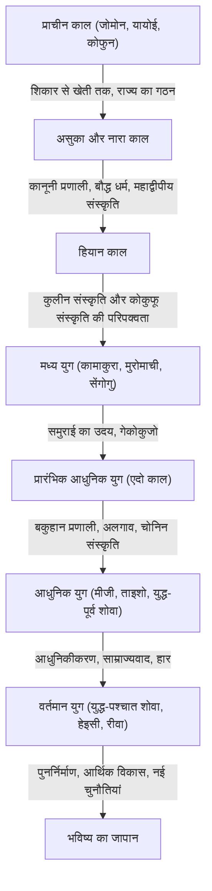

## प्रस्तावना: द्वीप राष्ट्र की भौगोलिक परिस्थितियों का प्रभाव
यूरेशियाई महाद्वीप के पूर्वी छोर पर स्थित जापानी द्वीपसमूह। एक द्वीप राष्ट्र के रूप में इस अद्वितीय भौगोलिक पर्यावरण ने जापान के इतिहास और संस्कृति के निर्माण पर निर्णायक प्रभाव डाला है। मुख्य भूमि से नई तकनीकों, संस्कृति और विचारों को उचित दूरी के साथ अपनाते हुए, यह बाहरी दुनिया से सीधे आक्रमण और प्रभुत्व के जोखिम को कम करने में सक्षम रहा है। इसने जापान को अपनी जलवायु और आध्यात्मिकता के साथ विदेशी संस्कृतियों को मिलाने और लंबी अवधि में अपनी अनूठी पहचान विकसित करने में सक्षम बनाया। इस लेख में, हम जोमोन काल से लेकर आधुनिक समय तक जापान की शानदार यात्रा को राजनीतिक, आर्थिक, सांस्कृतिक और लोगों के जीवन के कई दृष्टिकोणों से विस्तार से जानेंगे।

## अध्याय 1: शिकार-संग्रह से कृषि तक (जोमोन और यायोई काल)

### जोमोन काल: प्रकृति के साथ सह-अस्तित्व और एक समृद्ध आध्यात्मिक दुनिया
माना जाता है कि जोमोन काल लगभग 15,000 साल पहले शुरू हुआ था। लोग शिकार, मछली पकड़ने और भोजन इकट्ठा करने पर आधारित जीवन जीते थे। इस युग की सबसे बड़ी विशेषता मिट्टी के बर्तनों (जोमोन मिट्टी के बर्तन) का अस्तित्व है, जिन्हें दुनिया के सबसे पुराने बर्तनों में से एक कहा जाता है। सतह पर रस्सी के पैटर्न वाले ये मिट्टी के बर्तन केवल खाना पकाने और भंडारण के लिए उपकरण नहीं थे, बल्कि इनमें जटिल सजावट भी थी, जो उस समय के लोगों की उच्च सौंदर्य बोध और समृद्ध आध्यात्मिक दुनिया को दर्शाती है। इसके अलावा, स्थायी बस्तियों का विकास हुआ, और बड़ी बस्तियों (जैसे सान्नई-मारुयामा खंडहर) का निर्माण हुआ। यह माना जाता है कि प्रकृति के उपहारों पर निर्भर होने के बावजूद, उन्होंने जलवायु परिवर्तन को अनुकूलित किया और एक टिकाऊ समाज का निर्माण किया।

### यायोई काल: धान की खेती का परिचय और सामाजिक परिवर्तन
ईसा पूर्व चौथी शताब्दी के आसपास, मुख्य भूमि से धान की खेती की तकनीक और धातु के उपकरण (लोहे और कांस्य के उपकरण) पेश किए गए, जिससे यायोई काल की शुरुआत हुई। चावल की खेती की शुरुआत ने लोगों की जीवन शैली को मौलिक रूप से बदल दिया। अधिशेष उत्पादों को जमा करना संभव हो गया, और उन्हें प्रबंधित करने वालों और जिनके पास नहीं था, उनके बीच धन और वर्ग के अंतर पैदा होने लगे। बस्तियाँ खाइयों और मिट्टी के बांधों से घिरी "खाईदार बस्तियों" में बदल गईं, और भूमि और जल अधिकारों को लेकर विवाद अक्सर होने लगे। इस युग में छोटे राज्यों का उदय हुआ, और चीनी ऐतिहासिक अभिलेखों (जैसे 'वी झी वाजेन ज़ुआन') में उल्लेख है कि यमातई देश की रानी हिमिको विभिन्न राज्यों पर शासन करती थी।

## अध्याय 2: राज्य का गठन और महाद्वीपीय संस्कृति को अपनाना (कोफुन, असुका और नारा काल)

### कोफुन काल: विशाल मकबरे जो सत्ता के केंद्रीकरण की कहानी कहते हैं
तीसरी शताब्दी के उत्तरार्ध से, विभिन्न क्षेत्रों में चाबी के आकार वाले (keyhole-shaped) विशाल कोफुन (मकबरे) बनाए जाने लगे। यह एक शक्तिशाली शासक वर्ग (गोज़ोकू) के उद्भव का प्रतीक था जिसने विस्तृत क्षेत्रों को नियंत्रित किया। विशेष रूप से, किन्की क्षेत्र में केंद्रित यामातो शासन ने विभिन्न क्षेत्रों के गोज़ोकू को अपने अधीन कर लिया और देश के एकीकरण को आगे बढ़ाया। कोफुन के आकार और दफन वस्तुओं से, उस समय की शक्ति के पैमाने और महाद्वीप से तकनीकी प्रभाव (जैसे घोड़े के उपकरण और सुएकी मिट्टी के बर्तन) को देखा जा सकता है।

### असुका और नारा काल: एक कानूनी राज्य का निर्माण और बौद्ध धर्म की समृद्धि
जब छठी शताब्दी के मध्य में बाकजे से बौद्ध धर्म पेश किया गया, तो जापानी समाज एक बड़े टर्निंग पॉइंट पर पहुँच गया। प्रिंस शोटोकू और अन्य लोगों ने बौद्ध धर्म को संरक्षण दिया, 'बारह-स्तरीय कैप और रैंक प्रणाली' और 'सत्रह-लेख संविधान' स्थापित किया, और सम्राट पर केंद्रित एक केंद्रीकृत राज्य प्रणाली की नींव रखी। इसके बाद, ताइका सुधार (645) के माध्यम से, चीन (तांग राजवंश) की कानूनी प्रणाली पर आधारित एक कानूनी (रित्सुर्यो) राज्य का निर्माण बयाना में शुरू हुआ।
जब 710 में राजधानी को हीजोक्यो (नारा) में स्थानांतरित कर दिया गया, तो केंटोशी (तांग राजवंश के दूतों) के माध्यम से महाद्वीप की उन्नत संस्कृति और तकनीक को सक्रिय रूप से पेश किया गया। तेनप्यो संस्कृति, जिसका प्रतिनिधित्व टोडाईजी मंदिर में महान बुद्ध के निर्माण द्वारा किया जाता है, फली-फूली। 'कोजिकी' और 'निहोन शोकी' जैसी ऐतिहासिक पुस्तकें और 'मन्योशु' जैसी साहित्यिक कृतियाँ संकलित की गईं, और एक राष्ट्र के रूप में आत्म-पहचान स्थापित की गई।

## अध्याय 3: कुलीन संस्कृति और कोकुफू संस्कृति का विकास (हियान काल)

794 में हियानक्यो (क्योटो) में राजधानी के स्थानांतरण के बाद लगभग 400 वर्षों तक चलने वाले हियान काल में, फुजिवारा कबीले सहित रईसों ने सत्ता पर कब्जा कर लिया। 894 में केंटोशी के उन्मूलन के बाद, महाद्वीपीय संस्कृति को पचा और आत्मसात कर लिया गया, और जापान की अपनी जलवायु और संवेदनाओं के अनुकूल अपनी अनूठी "कोकुफू संस्कृति" (राष्ट्रीय संस्कृति) विकसित हुई।
विशेष रूप से महत्वपूर्ण "काना अक्षरों (हीरागाना और काताकाना)" का जन्म था। इसने जापानी भाषा में लोगों की सूक्ष्म भावनाओं और दृश्यों को व्यक्त करना संभव बना दिया, और मुरासाकी शिकिबु की 'द टेल ऑफ़ जेनजी' और सेई शोनागोन की 'द पिलो बुक' जैसी विश्व प्रसिद्ध साहित्यिक कृतियों का निर्माण किया। इसके अलावा, शुद्ध भूमि बौद्ध धर्म (Pure Land Buddhism) फैल गया, और अमिदा न्योराई से स्वर्ग में पुनर्जन्म की प्रार्थना करने का विचार रईसों से आम लोगों तक फैल गया।

## अध्याय 4: समुराई का उदय और मध्ययुगीन समाज (कामाकुरा, मुरोमाची और सेंगोगु काल)

### कामाकुरा शोगुनेट की स्थापना और समुराई सरकार
हियान काल के अंत में, स्थानीय क्षेत्रों में शांति बनाए रखने से शक्ति प्राप्त करने वाले समुराई (योद्धा) प्रमुख हो गए। मिनामोतो नो योरिटोमो ने ताइरा कबीले को हराया और 1192 में कामाकुरा शोगुनेट की स्थापना की। यह सम्राट और रईसों द्वारा कुलीन सरकार से अलग, समुराई द्वारा पहली पूर्ण पैमाने की सरकार थी। शासन "गोओन और होको" (एहसान और सेवा) के स्वामी-सेवक संबंध (सामंती व्यवस्था) पर आधारित था, और एक मजबूत योद्धा संस्कृति का निर्माण हुआ। इसके अलावा, एक नया बौद्ध धर्म (कामाकुरा नया बौद्ध धर्म) पैदा हुआ, और नेनबुत्सु और ज़ेन जैसे सरल अभ्यासों के माध्यम से, आम लोगों के बीच विश्वास व्यापक रूप से फैल गया।

### मुरोमाची संस्कृति और गेकोकुजो का युग
1338 में, आशिकागा ताकाउजी ने क्योटो में मुरोमाची शोगुनेट की स्थापना की। मुरोमाची काल ने मिंग राजवंश के साथ व्यापार के माध्यम से आर्थिक विकास और किंकाकुजी (स्वर्ण मंडप) और जिंकाकुजी (रजत मंडप) द्वारा दर्शाई गई किटायामा संस्कृति और हिगाशियामा संस्कृति की समृद्धि देखी। चाय समारोह, फूल व्यवस्था, और नोह रंगमंच जैसी कलाएँ और जीवन शैली, जो आधुनिक जापानी संस्कृति का आधार हैं, इसी अवधि में स्थापित की गई थीं।
हालाँकि, ओनिन युद्ध (1467) के बाद शोगुनेट का अधिकार गिर गया, और जापान सेंगोगु काल (युद्धरत राज्यों की अवधि) में प्रवेश कर गया, जहाँ "गेकोकुजो" (अधीनस्थों द्वारा वरिष्ठों को उखाड़ फेंकना) की प्रवृत्ति प्रचलित थी। विभिन्न क्षेत्रों के डाइम्यो ने अपने राज्यों को समृद्ध करने और अपनी सेनाओं को मजबूत करने का प्रयास किया, और यूरोप के साथ संपर्क (नानबान संस्कृति), जैसे बन्दूक का परिचय और ईसाई धर्म का प्रचार, भी शुरू हुआ।

## अध्याय 5: शांति का युग और अद्वितीय परिपक्वता (एदो काल)

1603 में, तोकुगावा इयासू ने एदो शोगुनेट की स्थापना की, जो शांति के लगभग 260 वर्षों (पैक्स टोकुगावाना) की शुरुआत थी। शोगुनेट ने सामुराई, किसानों, कारीगरों और व्यापारियों की एक कठोर वर्ग प्रणाली स्थापित की, और डाइम्यो को साकिन कोटाई (वैकल्पिक उपस्थिति) के लिए बाध्य करने जैसी एक मजबूत शासन प्रणाली (बकुहान प्रणाली) लागू की।
विदेशी नीति के संदर्भ में, ईसाई धर्म पर पूरी तरह से प्रतिबंध लगा दिया गया था, और "सकोकू" (राष्ट्रीय अलगाव) प्रणाली अपनाई गई थी, जिसमें व्यापार केवल नागासाकी में डच और चीनी (किंग राजवंश) तक सीमित था। इसने बाहरी उत्तेजनाओं को सीमित कर दिया, लेकिन घरेलू स्तर पर, कृषि उत्पादकता में सुधार हुआ और कमोडिटी अर्थव्यवस्था उल्लेखनीय रूप से विकसित हुई।
ओसाका और एदो (टोक्यो) पर केंद्रित शहरी क्षेत्रों में, चोनिन (नगरवासी) संस्कृति (जेनरोकू संस्कृति और कासेई संस्कृति) फली-फूली। उकियो-ए, काबुकी, हाइकु और रंगगाकू जैसी विविध और परिष्कृत संस्कृतियों का पोषण किया गया, और टेराकोया (मंदिर के स्कूलों) के प्रसार के कारण आम लोगों की साक्षरता दर वैश्विक मानकों के अनुसार अत्यंत उच्च स्तर पर पहुँच गई। इस अंतर्जात विकास और उच्च शैक्षिक स्तर ने बाद के आधुनिकीकरण के लिए एक मजबूत नींव रखी।

## अध्याय 6: एक आधुनिक राष्ट्र की ओर छलांग (मीजी, ताइशो और प्रारंभिक शोवा काल)

### मीजी बहाली और एक समृद्ध देश, मजबूत सेना
1853 में कमोडोर पेरी के आगमन के साथ, अलगाव समाप्त हो गया, और जापान को देश खोलने के लिए मजबूर होना पड़ा। पश्चिमी शक्तियों के खतरे का सामना करते हुए, जापान ने 1868 की मीजी बहाली के माध्यम से शोगुनेट को उखाड़ फेंका और सम्राट पर केंद्रित एक आधुनिक राष्ट्र-राज्य के निर्माण में जल्दबाजी की।
"फुकुकु क्योहेई" (समृद्ध देश, मजबूत सेना), "शोकुसान कोग्यो" (औद्योगिक विकास), और "बुनमेई काइका" (सभ्यता और ज्ञानोदय) के नारों के तहत, पश्चिमी राजनीतिक प्रणालियों, कानूनों, विज्ञान और प्रौद्योगिकी और सैन्य प्रणालियों को तीव्र गति से पेश किया गया था। 1889 में, ग्रेटर जापान के साम्राज्य का संविधान प्रख्यापित किया गया था, जिससे जापान एशिया का पहला संवैधानिक राज्य बन गया जिसमें एक कैबिनेट प्रणाली और संसद थी। चीन-जापानी और रूस-जापानी युद्धों के माध्यम से, जापान अंतरराष्ट्रीय समुदाय में महान शक्तियों की श्रेणी में शामिल हो गया, औद्योगिक क्रांति हासिल की, और पूंजीवादी अर्थव्यवस्था विकसित की।

### ताइशो लोकतंत्र और युद्ध का रास्ता
ताइशो काल में, प्रथम विश्व युद्ध के कारण हुए आर्थिक उछाल की पृष्ठभूमि में शहरीकरण आगे बढ़ा, और "ताइशो लोकतंत्र" नामक एक उदार राजनीतिक और सांस्कृतिक आंदोलन फला-फूला। जन संस्कृति का उपभोग किया जाने लगा और आधुनिक जीवन शैली फैल गई।
हालाँकि, शोवा काल में प्रवेश करते हुए, महामंदी के कारण होने वाले आर्थिक झटके और ग्रामीण गांवों की थकावट की पृष्ठभूमि में, सेना का उदय हुआ और पार्टी की राजनीति शिथिल होने लगी। जापान ने चीनी मुख्य भूमि में अपने विस्तार को मजबूत किया, अंततः चीन-जापानी युद्ध के दलदल में, और 1941 में प्रशांत युद्ध में प्रवेश किया। अगस्त 1945 में, हिरोशिमा और नागासाकी पर परमाणु बमबारी और सोवियत संघ के प्रवेश के बाद, जापान ने पोट्सडैम घोषणा को स्वीकार कर लिया, और इतिहास में पहली बार हार और विदेशी सैन्य कब्जे का अनुभव किया।

## अध्याय 7: राख से पुनर्निर्माण और भविष्य का दृष्टिकोण (आधुनिक युग)

### चमत्कारी आर्थिक विकास और एक शांतिपूर्ण राष्ट्र के रूप में पथ
GHQ (सुप्रीम कमांडर फॉर द एलाइड पॉवर्स) के कब्जे के तहत, जापान ने पूर्ण विसैन्यीकरण और लोकतंत्रीकरण सुधार किए। 1947 में लागू किया गया जापान का संविधान, लोकप्रिय संप्रभुता, मौलिक मानवाधिकारों के सम्मान और शांतिवाद को बुनियादी सिद्धांतों के रूप में स्थापित करता है।
1951 की सैन फ्रांसिस्को शांति संधि के साथ अपनी स्वतंत्रता वापस पाने वाले जापान ने कोरियाई युद्ध के दौरान विशेष मांग से प्रेरित होकर आर्थिक पुनर्प्राप्ति में तेजी लाई। 1950 के दशक के मध्य से 1970 के दशक की शुरुआत तक "तीव्र आर्थिक विकास अवधि" के दौरान, अर्थव्यवस्था आश्चर्यजनक गति से बढ़ी, और यह दुनिया की दूसरी सबसे बड़ी अर्थव्यवस्था बन गई। ऑटोमोबाइल और घरेलू उपकरणों जैसे विनिर्माण उद्योगों ने वैश्विक बाजार पर हावी हो गए, और लोगों के जीवन स्तर में नाटकीय रूप से सुधार हुआ।

### आधुनिक चुनौतियाँ और नए मूल्यों का निर्माण
1990 के दशक की शुरुआत में बुलबुला अर्थव्यवस्था के पतन के बाद से, जापान ने "लॉस्ट 30 इयर्स" (खोए हुए 30 वर्ष) कहे जाने वाले दीर्घकालिक आर्थिक ठहराव का अनुभव किया है। यह गिरती जन्म दर और बढ़ती उम्र की आबादी, घटती आबादी, ग्रामीण क्षेत्रों की कमी और प्रमुख आपदाओं (जैसे ग्रेट ईस्ट जापान भूकंप) जैसी गंभीर सामाजिक चुनौतियों का सामना कर रहा है।
दूसरी ओर, एनीमे, मंगा, गेम्स और खाद्य संस्कृति (कूल जापान) जैसी पॉप संस्कृति को दुनिया भर में अत्यधिक महत्व दिया जाता है, और एक सॉफ्ट पावर के रूप में इसकी उपस्थिति बढ़ रही है। इसके अलावा, यह पर्यावरणीय प्रौद्योगिकी और रोबोटिक्स जैसे उन्नत प्रौद्योगिकी क्षेत्रों में उच्च प्रतिस्पर्धात्मकता बनाए हुए है।

## निष्कर्ष: ऐतिहासिक निरंतरता और अगली पीढ़ी को विरासत

जोमोन मिट्टी के बर्तनों से लेकर आधुनिक उच्च तकनीक तक, जापान का इतिहास एक गतिशील प्रक्रिया रही है जिसने बाहरी प्रभावों को लचीले ढंग से स्वीकार करते हुए अपनी परंपराओं और जलवायु के साथ मिलाया है और नए मूल्य पैदा करना जारी रखा है।
एक द्वीप राष्ट्र के रूप में बंद और खुलेपन के संतुलन में विकसित हुई "वा" (सद्भाव) की भावना, प्रकृति के प्रति श्रद्धा, और सावधानीपूर्वक विनिर्माण की परंपरा आधुनिक जापानी लोगों में जीवित है। अतीत के इतिहास से सबक सीखते हुए और विविधता का सम्मान करते हुए, जापान एक टिकाऊ भविष्य की ओर नया इतिहास बुनता रहेगा।

