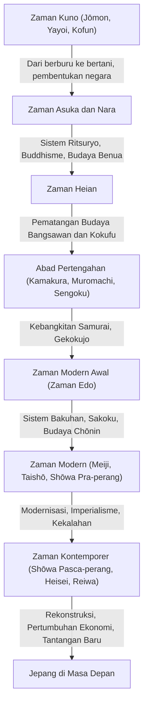

## Prolog: Apa yang Dihasilkan oleh Kondisi Geografis Negara Kepulauan

Kepulauan Jepang terletak di ujung timur benua Eurasia. Lingkungan geografis unik sebagai negara kepulauan ini telah memberikan pengaruh yang menentukan pada pembentukan sejarah dan budaya Jepang. Sambil menerima teknologi, budaya, dan pemikiran baru dari benua dengan menjaga jarak yang wajar, Jepang mampu mengurangi risiko invasi langsung atau dominasi dari luar. Hal ini memungkinkan Jepang untuk memadukan budaya asing dengan iklim dan spiritualitasnya sendiri, serta mengembangkan identitas uniknya dalam jangka waktu yang panjang. Pada artikel ini, kita akan mengungkap langkah epik Jepang dari zaman Jōmon hingga era modern secara terperinci, melalui berbagai sudut pandang: politik, ekonomi, budaya, dan kehidupan masyarakat.

## Bab 1: Dari Berburu dan Meramu ke Bertani (Zaman Jōmon dan Yayoi)

### Zaman Jōmon: Hidup Berdampingan dengan Alam dan Dunia Spiritual yang Kaya
Zaman Jōmon yang diperkirakan dimulai sekitar 15.000 tahun yang lalu. Masyarakat menjalani kehidupan yang berbasis pada berburu, memancing, dan meramu. Ciri khas utama dari zaman ini adalah keberadaan tembikar yang disebut-sebut sebagai salah satu yang tertua di dunia (Tembikar Jōmon). Tembikar dengan pola tali di permukaannya ini bukan sekadar alat untuk memasak atau menyimpan, melainkan memiliki nilai dekoratif yang kompleks, yang mencerminkan cita rasa estetika yang tinggi serta dunia spiritual yang kaya dari masyarakat pada masa itu. Selain itu, masyarakat mulai menetap, dan permukiman berskala besar (seperti Situs Sannai-Maruyama) terbentuk. Meskipun bergantung pada anugerah alam, mereka diyakini telah beradaptasi dengan perubahan iklim dan membangun masyarakat yang berkelanjutan.

### Zaman Yayoi: Masuknya Pertanian Padi Sawah dan Transformasi Sosial
Sejak sekitar abad ke-4 SM, teknologi pertanian padi sawah dan peralatan logam (peralatan besi dan perunggu) masuk dari benua, dan zaman Yayoi pun dimulai. Dimulainya budidaya padi secara fundamental mengubah gaya hidup masyarakat. Akumulasi surplus produksi menjadi mungkin, dan kesenjangan kekayaan serta kelas sosial mulai muncul antara mereka yang mengelola surplus dan mereka yang tidak memilikinya. Permukiman menjadi "permukiman berparit" (kangō shūraku) yang dikelilingi oleh parit dan tanggul tanah, serta konflik untuk memperebutkan tanah dan hak air sering terjadi. Pada zaman ini, banyak negara kecil yang saling bersaing, dan dalam catatan sejarah Tiongkok (seperti "Gishi Wajinden"), digambarkan bagaimana Himiko, Ratu Yamataikoku, memerintah berbagai negara tersebut.

## Bab 2: Pembentukan Negara dan Penerimaan Budaya Benua (Zaman Kofun, Asuka, dan Nara)

### Zaman Kofun: Makam Raksasa yang Menceritakan Pemusatan Kekuasaan
Sejak paruh kedua abad ke-3, makam-makam raksasa dengan bentuk lubang kunci (kofun) mulai dibangun di berbagai daerah. Hal ini menandakan munculnya penguasa yang kuat (gozoku) yang menguasai wilayah yang luas. Secara khusus, Kekuasaan Yamato yang berpusat di wilayah Kinki menundukkan para penguasa di berbagai daerah dan mendorong penyatuan negara. Dari ukuran makam dan barang-barang yang ikut dikuburkan (fukusōhin), kita dapat melihat besarnya kekuasaan pada saat itu serta pengaruh teknologi dari benua (seperti perlengkapan kuda dan tembikar Sueki).

### Zaman Asuka dan Nara: Pembangunan Negara Ritsuryo dan Kemakmuran Buddhisme
Ketika Buddhisme masuk dari Baekje pada pertengahan abad ke-6, masyarakat Jepang menghadapi titik balik yang besar. Pangeran Shōtoku dan tokoh-tokoh lainnya melindungi Buddhisme, menetapkan Sistem Dua Belas Peringkat (Kan'i Jūnikai), serta Konstitusi Tujuh Belas Pasal, yang meletakkan dasar bagi sistem negara yang tersentralisasi dengan Kaisar sebagai pusatnya. Setelah itu, melalui Reformasi Taika (tahun 645), pembangunan negara Ritsuryo (negara hukum) yang meniru sistem hukum Tiongkok (Dinasti Tang) dimulai secara besar-besaran.
Ketika ibu kota dipindahkan ke Heijō-kyō (Nara) pada tahun 710, budaya dan teknologi maju dari benua secara aktif diperkenalkan melalui Utusan ke Dinasti Tang (Kentōshi). Budaya Tenpyō yang diwakili oleh pembangunan patung Buddha Agung di Tōdai-ji berkembang pesat, dan buku-buku sejarah seperti "Kojiki" dan "Nihon Shoki" serta karya sastra seperti "Man'yōshū" disusun, sehingga identitas sebagai sebuah negara pun terbentuk.

## Bab 3: Mekarnya Budaya Bangsawan dan Budaya Kokufu (Zaman Heian)

Zaman Heian, yang berlangsung sekitar 400 tahun sejak perpindahan ibu kota ke Heian-kyō pada tahun 794, adalah era ketika kaum bangsawan, termasuk klan Fujiwara, memegang kekuasaan. Dengan dihapuskannya Utusan ke Dinasti Tang (tahun 894) sebagai titik tolak, Jepang mencerna dan menyerap budaya benua, lalu mengembangkan "Budaya Kokufu" (budaya gaya nasional) unik yang sesuai dengan iklim dan kepekaan Jepang.
Yang paling penting adalah lahirnya "huruf Kana (Hiragana dan Katakana)". Hal ini memungkinkan ekspresi perasaan dan pemandangan yang halus dari masyarakat dalam bahasa Jepang, serta menghasilkan karya sastra kelas dunia seperti "Genji Monogatari" karya Murasaki Shikibu dan "Makura no Sōshi" karya Sei Shōnagon. Selain itu, agama Buddha Tanah Suci (Jōdo-kyō) menyebar luas, dan pemikiran yang memohon kelahiran kembali di surga (Gokuraku Ōjō) kepada Buddha Amida meresap dari kalangan bangsawan ke rakyat jelata.

## Bab 4: Kebangkitan Samurai dan Masyarakat Abad Pertengahan (Zaman Kamakura, Muromachi, dan Sengoku)

### Berdirinya Keshogunan Kamakura dan Pemerintahan Militer
Pada akhir zaman Heian, samurai (busho) yang memperoleh kekuatan dari menjaga keamanan di daerah mulai bangkit. Minamoto no Yoritomo menggulingkan klan Taira dan mendirikan Keshogunan Kamakura (Kamakura Bakufu) pada tahun 1192. Ini adalah pemerintahan skala penuh pertama oleh samurai, yang berbeda dari pemerintahan sipil (kuge) oleh Kaisar dan kaum bangsawan. Pemerintahan dijalankan berdasarkan hubungan tuan-hamba (sistem feodal) yang disebut "Goon to Hōkō" (Kebaikan dan Pengabdian), dan terbentuklah budaya samurai yang sederhana dan tangguh. Selain itu, aliran Buddhisme baru (Buddhisme Baru Kamakura) lahir, dan kepercayaan menyebar luas di kalangan rakyat jelata melalui praktik sederhana seperti pelafalan nama Buddha (Nenbutsu) dan meditasi (Zazen).

### Budaya Muromachi dan Era Gekokujo
Pada tahun 1338, Ashikaga Takauji mendirikan Keshogunan Muromachi di Kyoto. Zaman Muromachi diwarnai oleh perkembangan ekonomi melalui perdagangan Kangō dengan Dinasti Ming, serta berkembangnya Budaya Kitayama dan Budaya Higashiyama yang diwakili oleh Kinkaku (Paviliun Emas) dan Ginkaku (Paviliun Perak). Seni pertunjukan dan gaya hidup yang menjadi dasar budaya Jepang modern, seperti upacara minum teh, merangkai bunga, dan teater Noh, mulai terbentuk pada periode ini.
Namun, setelah Perang Ōnin (1467), otoritas Keshogunan jatuh, dan Jepang memasuki zaman Sengoku (Negara-Negara Berperang), di mana tren "Gekokujo" (bawahan menggulingkan atasan) merajalela, yang mana orang-orang yang memiliki kekuatan menumbangkan mereka yang berada di atas. Para penguasa wilayah (Sengoku Daimyō) di berbagai daerah berusaha memperkaya negara dan memperkuat militer (Fukoku Kyōhei), serta kontak dengan Eropa (Budaya Nanban) mulai terjadi, seperti masuknya senjata api dan penyebaran agama Kristen.

## Bab 5: Dunia yang Damai dan Pematangan Unik (Zaman Edo)

Pada tahun 1603, Tokugawa Ieyasu mendirikan Keshogunan Edo, dan sejak saat itu, era damai (Pax Tokugawa) yang berlangsung sekitar 260 tahun pun tiba. Keshogunan menetapkan sistem kelas yang ketat yaitu Shi-Nō-Kō-Shō (Samurai, Petani, Pengrajin, Pedagang), dan mewajibkan para Daimyō untuk melakukan Sankin-kōtai (sistem kehadiran bergilir), sehingga membentuk sistem pemerintahan yang kuat (Sistem Bakuhan).
Dalam hal kebijakan luar negeri, Keshogunan menerapkan larangan ketat terhadap agama Kristen dan mengadopsi sistem "Sakoku" (negara tertutup) yang membatasi perdagangan hanya dengan Belanda dan Tiongkok (Dinasti Qing) di Nagasaki. Meskipun hal ini membatasi rangsangan dari luar, produktivitas pertanian dalam negeri meningkat, dan ekonomi komersial berkembang pesat.
Di daerah perkotaan yang berpusat di Osaka dan Edo, budaya kelas menengah kota (Budaya Genroku dan Budaya Kasei) mekar. Budaya yang beragam dan berkelas seperti Ukiyo-e, Kabuki, Haikai, dan Rangaku (Ilmu Belanda) dipelihara, dan dengan meluasnya Terakoya (sekolah swasta), tingkat melek huruf rakyat jelata mencapai tingkat yang sangat tinggi menurut standar dunia pada masa itu. Perkembangan endogen dan tingginya tingkat pendidikan ini kemudian menjadi fondasi yang kuat bagi modernisasi di masa mendatang.

## Bab 6: Lompatan Menjadi Negara Modern (Zaman Meiji, Taishō, dan Awal Shōwa)

### Restorasi Meiji dan Fukoku Kyōhei
Dengan kedatangan armada Perry pada tahun 1853, isolasi (Sakoku) berakhir, dan Jepang terpaksa membuka negaranya. Menghadapi ancaman kekuatan besar Barat, Jepang menggulingkan Keshogunan melalui Restorasi Meiji pada tahun 1868, dan bergegas membangun negara bangsa modern yang berpusat pada Kaisar.
Dengan mengusung slogan "Fukoku Kyōhei" (Memperkaya Negara, Memperkuat Militer), "Shokusan Kōgyō" (Mendorong Industri), dan "Bunmei Kaika" (Pencerahan Peradaban), Jepang mengadopsi sistem politik, hukum, sains dan teknologi, serta sistem militer Barat dengan kecepatan yang luar biasa. Pada tahun 1889, Konstitusi Kekaisaran Jepang Raya diumumkan, menjadikan Jepang sebagai negara konstitusional dengan sistem kabinet dan parlemen pertama di Asia. Melalui Perang Sino-Jepang dan Perang Rusia-Jepang, Jepang bergabung dengan negara-negara besar dalam komunitas internasional, mencapai revolusi industri, dan mengembangkan ekonomi kapitalis.

### Demokrasi Taishō dan Jalan Menuju Perang
Pada zaman Taishō, urbanisasi mengalami kemajuan dengan latar belakang ledakan ekonomi dari Perang Dunia I, dan gerakan politik dan budaya liberal yang disebut "Demokrasi Taishō" berkembang pesat. Budaya populer dikonsumsi, dan gaya hidup modern menjadi hal yang umum.
Namun, saat memasuki era Shōwa, di tengah latar belakang pukulan ekonomi akibat Depresi Hebat dan kelelahan di desa-desa pertanian, kebangkitan militer dan disfungsi politik partai politik terus berlanjut. Jepang meningkatkan ekspansinya ke benua Tiongkok, yang akhirnya mengarah pada Perang Tiongkok-Jepang yang berlarut-larut, dan kemudian masuk ke dalam Perang Pasifik pada tahun 1941. Pada bulan Agustus 1945, setelah jatuhnya bom atom di Hiroshima dan Nagasaki, serta masuknya Uni Soviet ke dalam perang, Jepang menerima Deklarasi Potsdam, dan mengalami kekalahan serta pendudukan oleh pasukan asing untuk pertama kalinya dalam sejarahnya.

## Bab 7: Rekonstruksi dari Puing-Puing dan Pandangan Masa Depan (Era Kontemporer)

### Pertumbuhan Ekonomi yang Ajaib dan Langkah sebagai Negara Damai
Di bawah pendudukan GHQ (Markas Besar Tertinggi Kekuatan Sekutu), Jepang mengalami demiliterisasi menyeluruh dan reformasi demokratisasi. Konstitusi Jepang yang diberlakukan pada tahun 1947 memiliki prinsip dasar: kedaulatan rakyat, penghormatan terhadap hak asasi manusia yang fundamental, dan pasifisme (cinta damai).
Setelah memperoleh kembali kemerdekaannya melalui Perjanjian Damai San Francisco pada tahun 1951, Jepang mempercepat rekonstruksi ekonomi dengan memanfaatkan permintaan khusus dari Perang Korea. Selama "Periode Pertumbuhan Ekonomi Tinggi" dari pertengahan 1950-an hingga awal 1970-an, Jepang memperluas skala ekonominya dengan kecepatan yang menakjubkan, dan tumbuh menjadi negara dengan ekonomi terbesar kedua di dunia. Industri manufaktur seperti mobil dan peralatan rumah tangga mendominasi pasar global, dan standar hidup masyarakat meningkat secara dramatis.

### Tantangan Kontemporer dan Penciptaan Nilai Baru
Setelah pecahnya gelembung ekonomi pada awal 1990-an, Jepang mengalami periode stagnasi ekonomi yang panjang yang dikenal sebagai "Tiga Dekade yang Hilang". Jepang dihadapkan pada tantangan sosial yang parah, seperti penurunan angka kelahiran dan penuaan penduduk, penyusutan populasi, depopulasi daerah pedesaan, serta respons terhadap bencana alam besar (seperti Gempa Bumi Besar Jepang Timur).
Di sisi lain, budaya pop (Cool Japan) seperti anime, manga, permainan, dan budaya kuliner telah mendapatkan penilaian tinggi di seluruh dunia, sehingga meningkatkan kehadirannya sebagai soft power. Selain itu, dalam bidang teknologi maju seperti teknologi lingkungan dan robotika, Jepang masih mempertahankan daya saing yang tinggi.

## Penutup: Kontinuitas Sejarah dan Pewarisan ke Generasi Berikutnya

Dari tembikar Jōmon hingga teknologi tinggi masa kini, sejarah Jepang merupakan proses dinamis yang secara fleksibel menerima pengaruh dari luar, lalu memadukannya dengan tradisi dan iklimnya sendiri, untuk terus menciptakan nilai-nilai baru.
Semangat "Wa" (Harmoni), rasa hormat terhadap alam, dan tradisi manufaktur yang presisi (Monozukuri), yang dipupuk dalam keseimbangan antara ketertutupan dan keterbukaan sebagai negara kepulauan, terus hidup dan mengalir dalam diri orang Jepang modern. Sambil mengambil pelajaran dari sejarah masa lalu dan menghormati keberagaman, Jepang akan terus merajut sejarah baru menuju masa depan yang berkelanjutan.

