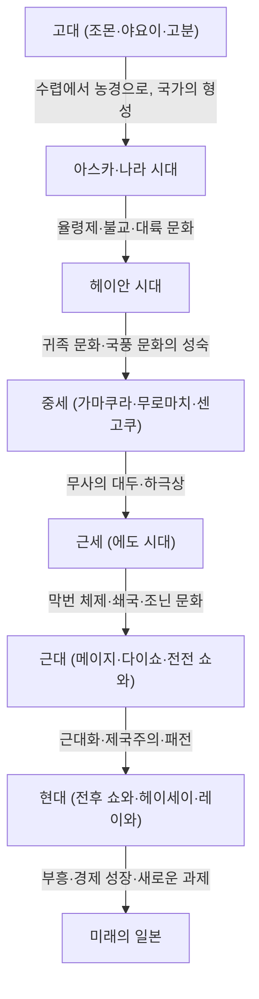

## 서장: 섬나라라는 지리적 조건이 가져온 것

유라시아 대륙의 동쪽 끝에 위치한 일본 열도. 이 섬나라라는 독특한 지리적 환경은 일본의 역사와 문화 형성에 결정적인 영향을 미쳐왔습니다. 대륙으로부터의 새로운 기술이나 문화, 사상을 적당한 거리감을 두고 수용하면서도, 외부로부터의 직접적인 침략이나 지배를 받을 위험을 줄일 수 있었습니다. 이를 통해 일본은 외래 문화를 자국의 풍토나 정신성과 융합시켜, 독자적인 정체성을 장기간에 걸쳐 양성해 나갈 수 있었던 것입니다. 본고에서는 조몬 시대부터 현대에 이르기까지 일본의 장대한 발자취를 정치, 경제, 문화, 그리고 사람들의 삶이라는 다각적인 시점에서 상세히 풀어보겠습니다.

## 제1장: 수렵 채집에서 농경으로 (조몬·야요이 시대)

### 조몬 시대: 자연과의 공생과 풍부한 정신 세계
약 1만 5천 년 전에 시작되었다고 여겨지는 조몬 시대. 사람들은 수렵, 어로, 채집을 기반으로 한 생활을 영위하고 있었습니다. 이 시대의 가장 큰 특징은 세계 최고(最古)급이라고도 불리는 토기(조몬 토기)의 존재입니다. 표면에 새끼줄 무늬가 새겨진 이 토기들은 단순한 조리나 저장 도구에 그치지 않고 복잡한 장식성을 띠고 있어, 당시 사람들의 높은 미의식과 풍부한 정신 세계를 대변해 줍니다. 또한, 정주화가 진행되어 대규모 취락(산나이마루야마 유적 등)이 형성되었습니다. 자연의 혜택에 의존하면서도 기후 변화에 적응하며 지속 가능한 사회를 구축하고 있었다고 생각됩니다.

### 야요이 시대: 수도 농경의 전래와 사회의 변용
기원전 4세기경부터 대륙으로부터 수도(水稻, 벼) 농경 기술이나 금속기(철기·청동기)가 전래되어 야요이 시대가 막을 엽니다. 벼농사의 시작은 사람들의 라이프 스타일을 근본부터 변혁시켰습니다. 잉여 생산물의 축적이 가능해졌고, 이를 관리하는 자와 가지지 못한 자 사이에 빈부 격차나 계급이 생겨나기 시작한 것입니다. 취락은 해자나 토루로 둘러싸인 '환호취락'이 되었고, 토지나 수리권을 둘러싼 다툼이 빈번하게 일어나게 되었습니다. 이 시대에는 소국들이 난립했으며, 중국의 사서(『위지왜인전』 등)에는 야마타이국의 여왕 히미코가 여러 나라를 통치하고 있던 모습이 기록되어 있습니다.

## 제2장: 국가의 형성과 대륙 문화의 수용 (고분·아스카·나라 시대)

### 고분 시대: 거대한 무덤이 말해주는 권력의 집중
3세기 후반부터 각지에 거대한 전방후원분 등의 고분이 축조되기 시작합니다. 이는 광역을 지배하는 강대한 권력자(호족)의 출현을 의미합니다. 특히 긴키 지방을 중심으로 하는 야마토 왕권은 각지의 호족을 복속시키며 국내 통일을 진행해 나갔습니다. 고분의 규모나 부장품을 통해 당시 권력의 크기나 대륙으로부터의 기술(마구, 스에키 등)의 영향을 엿볼 수 있습니다.

### 아스카·나라 시대: 율령 국가의 건설과 불교의 융성
6세기 중반 백제로부터 불교가 전래되면서 일본 사회는 큰 전환점을 맞이합니다. 쇼토쿠 태자 등은 불교를 보호하고, 관위 12계나 17조 헌법을 제정하여 천황을 중심으로 하는 중앙집권적인 국가 체제의 기초를 다졌습니다. 그 후 다이카 개신(645년)을 거쳐 중국(당)의 법체계를 모방한 율령 국가 건설이 본격화됩니다.
710년에 헤이조쿄(나라)로 천도한 이후에는 견당사를 통해 대륙의 선진적인 문화나 기술이 적극적으로 도입되었습니다. 도다이지의 대불 건립으로 대표되는 덴표 문화가 꽃을 피웠고, 『고사기』, 『일본서기』와 같은 역사서나 『만엽집』 등의 문학 작품이 편찬되어 국가로서의 자기 동일성이 확립되어 갔습니다.

## 제3장: 귀족 문화의 개화와 국풍 문화 (헤이안 시대)

794년 헤이안쿄 천도부터 약 400년간 지속된 헤이안 시대는 후지와라 씨를 비롯한 귀족이 권력을 쥔 시대입니다. 견당사가 폐지(894년)된 것을 계기로 대륙 문화를 소화 흡수하여, 일본의 풍토나 감성에 맞는 독자적인 '국풍 문화'가 발달했습니다.
특히 중요한 것은 '가나 문자(히라가나·가타카나)'의 탄생입니다. 이로 인해 사람들의 섬세한 감정이나 정경을 일본어로 표현하는 것이 가능해졌고, 무라사키 시키부의 『겐지 모노가타리』나 세이 쇼나곤의 『마쿠라노소시』 등 세계에 자랑할 만한 문학 작품이 탄생했습니다. 또한 정토교가 널리 퍼져, 아미타여래에게 극락왕생을 바라는 사상이 귀족에서 서민으로 스며들게 되었습니다.

## 제4장: 무사의 대두와 중세 사회 (가마쿠라·무로마치·센고쿠 시대)

### 가마쿠라 막부의 성립과 무가 정권
헤이안 시대 말기, 지방의 치안 유지를 통해 힘을 기른 무사가 대두합니다. 미나모토노 요리토모는 헤이씨를 타도하고 1192년에 가마쿠라 막부를 열었습니다. 이는 천황이나 귀족에 의한 공가 정권과는 다른, 무사에 의한 최초의 본격적인 정권이었습니다. '고온과 호코(은혜와 봉사)'라는 주종 관계(봉건 제도)에 기반한 통치가 이루어졌고, 질실강건한 무가 문화가 형성되었습니다. 또한 새로운 불교(가마쿠라 신불교)가 탄생하여, 염불이나 좌선과 같은 간명한 실천을 통해 널리 민중에게 신앙이 퍼졌습니다.

### 무로마치 문화와 하극상의 시대
1338년, 아시카가 다카우지가 교토에 무로마치 막부를 엽니다. 무로마치 시대는 명과의 감합 무역을 통한 경제 발전과 함께 금각이나 은각으로 대표되는 기타야마 문화·히가시야마 문화가 번영했습니다. 다도, 꽃꽂이(이케바나), 노가쿠 등 현대 일본 문화의 기층이 되는 예능이나 생활 양식이 이 시기에 확립되었습니다.
그러나 오닌의 난(1467년)을 기점으로 막부의 권위는 실추되었고, 실력 있는 자가 윗사람을 쓰러뜨리는 '하극상'의 풍조가 만연하는 센고쿠(전국) 시대로 돌입합니다. 각지의 센고쿠 다이묘는 부국강병에 힘썼으며, 조총의 전래나 기독교의 포교 등 유럽과의 접촉(남만 문화)도 시작되었습니다.

## 제5장: 태평성대와 독자적인 성숙 (에도 시대)

1603년, 도쿠가와 이에야스가 에도 막부를 열고, 이후 약 260년에 걸친 평화로운 시대(팍스 도쿠가와나)가 찾아옵니다. 막부는 사농공상의 신분 제도를 고정하고, 다이묘에게는 참근교대를 의무화하는 등 강고한 지배 체제(막번 체제)를 구축했습니다.
대외 정책으로는 기독교의 금교를 철저히 하고, 네덜란드와 중국(청)에게만 나가사키에서의 무역을 한정하는 '쇄국' 체제를 취했습니다. 이로 인해 외부로부터의 자극은 제한되었으나, 국내에서는 농업 생산성이 향상되고 상품 경제가 현저히 발달했습니다.
오사카나 에도를 중심으로 하는 도시부에서는 조닌 문화(겐로쿠 문화·가세이 문화)가 꽃을 피웠습니다. 우키요에, 가부키, 하이카이, 난학 등 다양하고 세련된 문화가 육성되었고, 데라코야의 보급으로 서민들의 식자율도 세계적으로 볼 때 극히 높은 수준에 달해 있었습니다. 이러한 내발적인 발전과 교육 수준의 높이가 훗날 근대화의 강력한 기반이 된 것입니다.

## 제6장: 근대 국가로의 도약 (메이지·다이쇼·쇼와 초기)

### 메이지 유신과 부국강병
1853년 페리의 내항으로 쇄국은 막을 내리고, 일본은 개국을 피할 수 없게 되었습니다. 구미 열강의 위협에 직면한 일본은 1868년 메이지 유신을 통해 막부를 무너뜨리고 천황을 중심으로 하는 근대적인 국민 국가의 건설을 서둘렀습니다.
'부국강병', '식산흥업', '문명개화'를 슬로건으로 내걸고 서양의 정치 제도, 법률, 과학 기술, 군사 시스템을 맹렬한 기세로 도입했습니다. 1889년에는 대일본제국 헌법이 반포되어, 아시아 최초의 내각 제도와 의회를 가진 입헌 국가가 되었습니다. 청일·러일 전쟁을 거쳐 일본은 국제 사회에서 열강의 반열에 올랐으며, 산업 혁명을 완수하고 자본주의 경제를 발전시켰습니다.

### 다이쇼 데모크라시와 전쟁으로의 길
다이쇼 시대에는 제1차 세계 대전의 호경기를 배경으로 도시화가 진행되었고, '다이쇼 데모크라시'라 불리는 자유주의적인 정치·문화 운동이 고조되었습니다. 대중 문화가 소비되고 모던한 생활 양식이 보급되었습니다.
그러나 쇼와에 접어들면서 세계 공황으로 인한 경제적 타격과 농촌의 피폐를 배경으로, 군부의 대두와 정당 정치의 기능 부전이 진행되었습니다. 일본은 중국 대륙으로의 진출을 강화했고, 이윽고 수렁에 빠진 중일 전쟁, 그리고 1941년에는 태평양 전쟁으로 돌입하게 되었습니다. 1945년 8월, 히로시마와 나가사키에 대한 원자폭탄 투하, 소련의 참전을 거쳐 일본은 포츠담 선언을 수락하고, 유사 이래 최초가 되는 패전과 외국 군대의 점령을 경험하게 됩니다.

## 제7장: 폐허 속에서의 부흥과 미래로의 전망 (현대)

### 기적적인 경제 성장과 평화 국가로서의 발자취
GHQ(연합군 최고사령관 총사령부)의 점령 하에서, 일본은 철저한 비군사화와 민주화 개혁을 받았습니다. 1947년에 시행된 일본국 헌법은 국민 주권, 기본적 인권의 존중, 평화주의를 기본 원칙으로 하고 있습니다.
1951년 샌프란시스코 강화 조약으로 독립을 회복한 일본은 한국 전쟁의 특수를 계기로 경제 부흥을 가속화했습니다. 1950년대 중반부터 1970년대 초반에 이르는 '고도 경제 성장기'에는 경이적인 속도로 경제 규모를 확대하여 세계 제2위의 경제 대국으로 성장을 이루었습니다. 자동차나 가전제품 등의 제조업이 세계 시장을 석권했고, 국민의 생활 수준은 극적으로 향상되었습니다.

### 현대의 과제와 새로운 가치의 창조
1990년대 초반 버블 경제 붕괴 이후, 일본은 '잃어버린 30년'이라고도 불리는 장기적인 경제 침체기를 겪고 있습니다. 저출산 고령화, 인구 감소, 지방의 과소화, 거대 재해(동일본 대진재 등)에 대한 대응과 같은 심각한 사회 과제에 직면해 있습니다.
한편으로는 애니메이션, 만화, 게임, 식문화 등의 팝 컬처(쿨 재팬)가 전 세계에서 높은 평가를 받고 있어, 소프트 파워로서의 존재감은 커지고 있습니다. 또한 환경 기술이나 로보틱스 등의 첨단 기술 분야에서도 여전히 높은 경쟁력을 유지하고 있습니다.

## 맺음말: 역사의 연속성과 다음 세대로의 계승

조몬의 토기에서 현대의 하이테크 기술에 이르기까지, 일본의 역사는 외부로부터의 영향을 유연하게 받아들이면서도 그것을 스스로의 전통이나 풍토와 융합시켜, 새로운 가치를 끊임없이 창조해 온 역동적인 과정이었습니다.
섬나라라는 폐쇄성과 개방성의 균형 속에서 배양된 '와(和, 조화)'의 정신, 자연에 대한 경외심, 그리고 치밀한 모노즈쿠리(제조)의 전통은 현대 일본인 속에서도 면면히 숨 쉬고 있습니다. 과거의 역사에서 교훈을 배우고 다양성을 존중하면서, 일본은 앞으로도 지속 가능한 미래를 향해 새로운 역사를 자아내 갈 것입니다.

