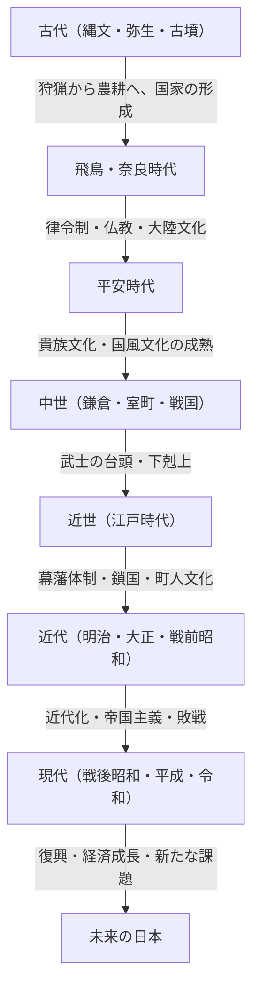

## 序章：島国という地理的条件がもたらしたもの

ユーラシア大陸の東端に位置する日本列島。この島国という独特の地理的環境は、日本の歴史と文化の形成に決定的な影響を与えてきました。大陸からの新しい技術や文化、思想を適度な距離感をもって受容しつつ、外部からの直接的な侵略や支配を受けるリスクを低減させることができました。これにより、日本は外来文化を自国の風土や精神性と融合させ、独自のアイデンティティを長期間にわたって醸成していくことが可能となったのです。本稿では、縄文時代から現代に至るまでの日本の壮大な歩みを、政治、経済、文化、そして人々の暮らしという多角的な視点から詳細に紐解いていきます。

## 第1章：狩猟採集から農耕へ（縄文・弥生時代）

### 縄文時代：自然との共生と豊かな精神世界
約1万5千年前に始まったとされる縄文時代。人々は狩猟、漁労、採集を基盤とした生活を営んでいました。この時代の最大の特徴は、世界最古級とも言われる土器（縄文土器）の存在です。表面に縄目模様が施されたこれらの土器は、単なる調理や貯蔵の道具にとどまらず、複雑な装飾性を持っており、当時の人々の高い美意識と豊かな精神世界を物語っています。また、定住化が進み、大規模な集落（三内丸山遺跡など）が形成されました。自然の恵みに依存しながらも、気候変動に適応し、持続可能な社会を築いていたと考えられています。

### 弥生時代：水稲農耕の伝来と社会の変容
紀元前4世紀頃から、大陸から水稲農耕技術や金属器（鉄器・青銅器）が伝来し、弥生時代が幕を開けます。稲作の開始は、人々のライフスタイルを根本から変革しました。余剰生産物の蓄積が可能となり、それを管理する者と持たざる者との間に貧富の差や階級が生じ始めたのです。集落は濠や土塁で囲まれた「環濠集落」となり、土地や水利権を巡る争いが頻発するようになりました。この時代には小国が乱立し、中国の史書（『魏志倭人伝』など）には、邪馬台国の女王・卑弥呼が諸国を統治していた様子が記されています。

## 第2章：国家の形成と大陸文化の受容（古墳・飛鳥・奈良時代）

### 古墳時代：巨大な墓が語る権力の集中
3世紀後半から、各地で巨大な前方後円墳などの古墳が築造されるようになります。これは、広域を支配する強大な権力者（豪族）の出現を意味しています。特に近畿地方を中心とするヤマト王権は、各地の豪族を服属させ、国内の統一を進めていきました。古墳の規模や副葬品からは、当時の権力の大きさや、大陸からの技術（馬具や須恵器など）の影響が見て取れます。

### 飛鳥・奈良時代：律令国家の建設と仏教の隆盛
6世紀半ばに百済から仏教が伝来すると、日本社会は大きな転換点を迎えます。聖徳太子らは仏教を保護し、冠位十二階や十七条憲法を制定して天皇を中心とする中央集権的な国家体制の基礎を築きました。その後、大化の改新（645年）を経て、中国（唐）の法体系に倣った律令国家の建設が本格化します。
710年に平城京（奈良）に都が遷されると、遣唐使を通じて大陸の先進的な文化や技術が積極的に導入されました。東大寺の大仏建立に代表される天平文化が花開き、『古事記』『日本書紀』といった歴史書や『万葉集』などの文学作品が編纂され、国家としての自己同一性が確立されていきました。

## 第3章：貴族文化の開花と国風文化（平安時代）

794年の平安京遷都から約400年続く平安時代は、藤原氏をはじめとする貴族が権力を握った時代です。遣唐使が廃止（894年）されたことを契機に、大陸文化を消化吸収し、日本の風土や感性に合った独自の「国風文化」が発達しました。
特に重要なのは「仮名文字（ひらがな・カタカナ）」の誕生です。これにより、人々の細やかな感情や情景を日本語で表現することが可能となり、紫式部の『源氏物語』や清少納言の『枕草子』など、世界に誇る文学作品が生み出されました。また、浄土教が広まり、阿弥陀如来に極楽往生を願う思想が貴族から庶民へと浸透していきました。

## 第4章：武士の台頭と中世社会（鎌倉・室町・戦国時代）

### 鎌倉幕府の成立と武家政権
平安時代末期、地方の治安維持から力をつけた武士が台頭します。源頼朝は平氏を打倒し、1192年に鎌倉幕府を開きました。これは、天皇や貴族による公家政権とは異なる、武士による初の本格的な政権でした。「御恩と奉公」という主従関係（封建制度）に基づく統治が行われ、質実剛健な武家文化が形成されました。また、新しい仏教（鎌倉新仏教）が誕生し、念仏や座禅といった簡明な実践を通じて、広く民衆に信仰が広まりました。

### 室町文化と下剋上の時代
1338年、足利尊氏が京都に室町幕府を開きます。室町時代は、明との勘合貿易による経済発展と、金閣や銀閣に代表される北山文化・東山文化が栄えました。茶の湯、生け花、能楽など、現代の日本文化の基層となる芸能や生活様式がこの時期に確立されました。
しかし、応仁の乱（1467年）を境に幕府の権威は失墜し、実力ある者が上の者を倒す「下剋上」の風潮が蔓延する戦国時代へと突入します。各地の戦国大名は富国強兵に努め、鉄砲の伝来やキリスト教の布教など、ヨーロッパとの接触（南蛮文化）も始まりました。

## 第5章：太平の世と独自の成熟（江戸時代）

1603年、徳川家康が江戸幕府を開き、以後約260年にわたる平和な時代（パクス・トクガワーナ）が訪れます。幕府は士農工商の身分制度を固定し、大名には参勤交代を義務付けるなど、強固な支配体制（幕藩体制）を敷きました。
対外政策としては、キリスト教の禁教を徹底し、オランダと中国（清）のみに長崎での貿易を限定する「鎖国」体制をとりました。これにより外部からの刺激は制限されましたが、国内では農業生産性が向上し、商品経済が著しく発達しました。
大坂や江戸を中心とする都市部では、町人文化（元禄文化・化政文化）が花開きました。浮世絵、歌舞伎、俳諧、蘭学など、多様で洗練された文化が育まれ、寺子屋の普及により庶民の識字率も世界的に見て極めて高い水準に達していました。この内発的な発展と教育水準の高さが、後の近代化の強力な基盤となったのです。

## 第6章：近代国家への飛躍（明治・大正・昭和初期）

### 明治維新と富国強兵
1853年のペリー来航により鎖国は終わりを告げ、日本は開国を余儀なくされました。欧米列強の脅威に直面した日本は、1868年の明治維新によって幕府を倒し、天皇を中心とする近代的な国民国家の建設を急ぎました。
「富国強兵」「殖産興業」「文明開化」をスローガンに掲げ、西洋の政治制度、法律、科学技術、軍事システムを猛烈な勢いで導入しました。1889年には大日本帝国憲法が発布され、アジア初の内閣制度と議会を持つ立憲国家となりました。日清・日露戦争を経て、日本は国際社会において列強の仲間入りを果たし、産業革命を成し遂げて資本主義経済を発展させました。

### 大正デモクラシーと戦争への道
大正時代には、第一次世界大戦の好景気を背景に都市化が進み、「大正デモクラシー」と呼ばれる自由主義的な政治・文化運動が盛り上がりました。大衆文化が消費され、モダンな生活様式が普及しました。
しかし、昭和に入ると、世界恐慌による経済的打撃や農村の疲弊を背景に、軍部の台頭と政党政治の機能不全が進行しました。日本は中国大陸への進出を強め、やがて泥沼の日中戦争、そして1941年には太平洋戦争へと突入していきました。1945年8月、広島と長崎への原爆投下、ソ連の参戦を経て、日本はポツダム宣言を受諾し、有史以来初となる敗戦と外国軍隊の占領を経験することになります。

## 第7章：焼け跡からの復興と未来への展望（現代）

### 奇跡の経済成長と平和国家としての歩み
GHQ（連合国軍最高司令官総司令部）の占領下で、日本は徹底的な非軍事化と民主化の改革を受けました。1947年に施行された日本国憲法は、国民主権、基本的人権の尊重、平和主義を基本原則としています。
1951年のサンフランシスコ平和条約により独立を回復した日本は、朝鮮戦争の特需を契機に経済復興を加速させました。1950年代半ばから1970年代初頭にかけての「高度経済成長期」には、驚異的なペースで経済規模を拡大し、世界第2位の経済大国へと成長を遂げました。自動車や家電製品などの製造業が世界市場を席巻し、国民の生活水準は劇的に向上しました。

### 現代の課題と新たな価値の創造
1990年代初頭のバブル経済崩壊後、日本は「失われた30年」とも呼ばれる長期の経済低迷期を経験しています。少子高齢化、人口減少、地方の過疎化、巨大災害（東日本大震災など）への対応といった深刻な社会課題に直面しています。
一方で、アニメ、マンガ、ゲーム、食文化などのポップカルチャー（クールジャパン）は世界中で高い評価を得ており、ソフトパワーとしての存在感は増しています。また、環境技術やロボティクスなどの先端技術分野においても、依然として高い競争力を維持しています。

## 結び：歴史の連続性と次世代への継承

縄文の土器から現代のハイテク技術に至るまで、日本の歴史は、外部からの影響を柔軟に受け入れつつ、それを自らの伝統や風土と融合させ、新たな価値を創造し続けてきたダイナミックな過程でした。
島国という閉鎖性と開放性のバランスの中で培われた「和」の精神、自然に対する畏敬の念、そして緻密なモノづくりの伝統は、現代の日本人の中にも脈々と息づいています。過去の歴史から教訓を学び、多様性を尊重しながら、日本はこれからも持続可能な未来に向けて新たな歴史を紡いでいくことでしょう。

