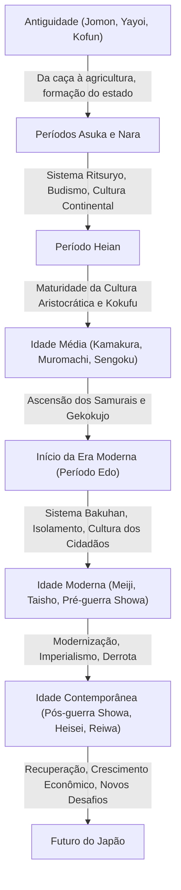

## Introdução: O que as condições geográficas de uma nação insular trouxeram

O arquipélago japonês está localizado no extremo leste do continente eurasiano. Este ambiente geográfico único, como uma nação insular, teve uma influência decisiva na formação da história e cultura do Japão. Permitiu ao país aceitar novas tecnologias, culturas e ideias do continente a uma distância moderada, enquanto reduzia o risco de invasão direta e domínio estrangeiro. Como resultado, o Japão conseguiu fundir a cultura estrangeira com seu próprio clima e espiritualidade, cultivando uma identidade única por um longo período de tempo. Neste artigo, desvendaremos detalhadamente a épica jornada do Japão desde o período Jomon até a era moderna, a partir de múltiplas perspectivas: política, econômica, cultural e o modo de vida do povo.

## Capítulo 1: Da Caça e Coleta à Agricultura (Períodos Jomon e Yayoi)

### Período Jomon: Coexistência com a Natureza e um Rico Mundo Espiritual
O período Jomon, que se acredita ter começado há cerca de 15.000 anos, era caracterizado por pessoas que levavam uma vida baseada na caça, pesca e coleta. A maior característica desta era é a existência da cerâmica (cerâmica Jomon), considerada uma das mais antigas do mundo. Essas peças de cerâmica com padrões de corda na superfície não eram apenas ferramentas para cozinhar e armazenar, mas possuíam elementos decorativos complexos, revelando um alto senso estético e o rico mundo espiritual das pessoas da época. Além disso, a sedentarização progrediu e assentamentos em grande escala (como o Sítio Sannai-Maruyama) foram formados. Acredita-se que, embora dependessem das bênçãos da natureza, adaptaram-se às mudanças climáticas e construíram uma sociedade sustentável.

### Período Yayoi: A Introdução do Cultivo de Arroz e a Transformação da Sociedade
A partir de cerca do século IV a.C., as técnicas de cultivo de arroz e os utensílios de metal (ferramentas de ferro e bronze) foram introduzidos do continente, marcando o início do período Yayoi. O início do cultivo de arroz transformou fundamentalmente o estilo de vida das pessoas. Tornou-se possível acumular excedentes de produção e as disparidades de riqueza e classes começaram a surgir entre os que os gerenciavam e os que não tinham nada. Os assentamentos tornaram-se "assentamentos cercados por fossos", rodeados por valas e fortificações de terra, e as disputas por terras e direitos de água tornaram-se frequentes. Durante essa época, pequenos estados proliferaram, e os registros históricos chineses (como "Gishi Wajinden") documentam como a Rainha Himiko de Yamataikoku governava as províncias.

## Capítulo 2: Formação do Estado e a Recepção da Cultura Continental (Períodos Kofun, Asuka e Nara)

### Período Kofun: O Que as Enormes Tumbas Dizem Sobre a Concentração de Poder
A partir da segunda metade do século III, enormes tumbas em formato de fechadura (kofun) começaram a ser construídas em várias regiões. Isso significa o surgimento de poderosos líderes (clãs) governando vastas áreas. Em particular, a autoridade de Yamato, centrada na região de Kinki, subjugou clãs locais em várias regiões, promovendo a unificação do país. O tamanho dos túmulos e os bens funerários mostram a magnitude do poder da época e a influência das tecnologias do continente (como arreios de cavalo e cerâmica Sueki).

### Períodos Asuka e Nara: A Construção do Estado Ritsuryo e a Ascensão do Budismo
Quando o budismo foi introduzido de Baekje em meados do século VI, a sociedade japonesa enfrentou um grande ponto de inflexão. O Príncipe Shotoku e outros protegeram o budismo, estabeleceram o Sistema de Doze Níveis e a Constituição dos Dezessete Artigos, e lançaram as bases para um sistema estatal centralizado centrado no imperador. Depois disso, com a Reforma Taika (645), a construção de um estado Ritsuryo modelado no sistema legal da China (dinastia Tang) começou com força total.
Quando a capital foi transferida para Heijo-kyo (Nara) em 710, culturas e tecnologias avançadas do continente foram ativamente introduzidas por meio dos enviados para a dinastia Tang (Kentoshi). A cultura Tenpyo, representada pela construção do Grande Buda em Todai-ji, floresceu, e obras históricas como "Kojiki" e "Nihon Shoki" e obras literárias como "Manyoshu" foram compiladas, estabelecendo a identidade do Japão como uma nação.

## Capítulo 3: O Desabrochar da Cultura Aristocrática e da Cultura Kokufu (Período Heian)

O período Heian, que durou cerca de 400 anos desde a mudança da capital para Heian-kyo em 794, foi uma época em que os aristocratas, incluindo o clã Fujiwara, detinham o poder. Aproveitando a abolição dos enviados à dinastia Tang (894), a cultura continental foi digerida e absorvida, desenvolvendo uma "cultura Kokufu" (estilo nacional) única que se adequava ao clima e à sensibilidade japonesa.
Particularmente importante é o nascimento da "escrita Kana (Hiragana e Katakana)". Isso tornou possível expressar as emoções detalhadas das pessoas e cenas em japonês, e obras literárias de orgulho mundial, como "Genji Monogatari" (O Conto de Genji) de Murasaki Shikibu e "Makura no Soshi" (O Livro de Travesseiro) de Sei Shonagon, foram criadas. Além disso, o budismo da Terra Pura se espalhou, e a ideia de orar ao Buda Amida por um renascimento no paraíso permeou desde a aristocracia até os plebeus.

## Capítulo 4: A Ascensão dos Samurais e a Sociedade Medieval (Períodos Kamakura, Muromachi e Sengoku)

### O Estabelecimento do Shogunato Kamakura e o Governo Militar
No final do período Heian, os samurais, que ganharam força ao manter a segurança nas regiões, ganharam destaque. Minamoto no Yoritomo derrotou o clã Taira e estabeleceu o shogunato Kamakura em 1192. Este foi o primeiro governo de pleno direito por samurais, diferente do governo da corte por imperadores e aristocratas. O governo era baseado em uma relação de senhorio e vassalagem (sistema feudal) de "favor e serviço" (Goon e Hoko), e uma cultura samurai simples e robusta foi formada. Além disso, um novo budismo (novo budismo de Kamakura) nasceu e a fé se espalhou amplamente entre as massas através de práticas simples, como recitação do Nenbutsu e a meditação Zazen.

### A Cultura Muromachi e a Era do Gekokujo
Em 1338, Ashikaga Takauji estabeleceu o shogunato Muromachi em Kyoto. O período Muromachi viu o desenvolvimento econômico através do comércio oficial com a dinastia Ming e o florescimento das culturas Kitayama e Higashiyama, representadas pelo Pavilhão Dourado (Kinkaku-ji) e o Pavilhão de Prata (Ginkaku-ji). As artes cênicas e os estilos de vida que formam a camada fundamental da cultura japonesa moderna, como a cerimônia do chá, arranjo de flores (Ikebana) e teatro Noh, foram estabelecidos durante este período.
No entanto, após a Guerra de Onin (1467), a autoridade do shogunato entrou em colapso e a era entrou no período Sengoku (Estados Combatentes), onde a tendência de "Gekokujo" (aqueles com habilidade derrubando seus superiores) se espalhou. Os senhores da guerra Sengoku (daimyo) em várias regiões se esforçaram para enriquecer seus países e fortalecer suas forças militares, e o contato com a Europa (cultura Nanban) também começou, como a introdução de armas de fogo e a propagação do cristianismo.

## Capítulo 5: Uma Era Pacífica e um Amadurecimento Único (Período Edo)

Em 1603, Tokugawa Ieyasu estabeleceu o shogunato Edo, e um período de paz (Pax Tokugawa) de cerca de 260 anos se seguiu. O shogunato fixou o sistema de status social (Shi-no-ko-sho) e impôs obrigações estritas aos daimyo, como o sistema de frequência alternada (Sankin-kotai), estabelecendo um forte sistema de governo (sistema Bakuhan).
Como política externa, baniu estritamente o cristianismo e adotou uma política de "Sakoku" (isolamento nacional) que limitava o comércio apenas aos Países Baixos e à China (dinastia Qing) em Nagasaki. Embora o estímulo externo tenha sido limitado por isso, a produtividade agrícola melhorou domesticamente e a economia mercantil desenvolveu-se notavelmente.
Nas áreas urbanas, especialmente em Osaka e Edo, a cultura dos cidadãos (cultura Genroku e Kasei) floresceu. Culturas diversas e refinadas, como ukiyo-e, kabuki, haiku e Estudos Holandeses (Rangaku), foram cultivadas, e com a disseminação dos terakoya (escolas de templo), a taxa de alfabetização entre as pessoas comuns atingiu um nível extremamente alto, mesmo para os padrões globais. Esse desenvolvimento endógeno e alto nível de educação formaram uma forte base para a posterior modernização.

## Capítulo 6: Um Salto Rumo a um Estado Moderno (Períodos Meiji, Taisho e Início de Showa)

### A Restauração Meiji e o Enriquecimento Nacional e Força Militar
Com a chegada dos navios de Perry em 1853, o isolamento terminou e o Japão foi forçado a abrir o país. Diante da ameaça das potências ocidentais, o Japão derrubou o shogunato através da Restauração Meiji de 1868 e apressou-se a construir um estado-nação moderno centrado no imperador.
Sob os slogans "País Rico e Exército Forte" (Fukoku Kyohei), "Promoção da Indústria" e "Civilização e Iluminação" (Bunmei Kaika), introduziu os sistemas políticos ocidentais, leis, ciência, tecnologia e o sistema militar com um ímpeto feroz. Em 1889, a Constituição do Império do Japão foi promulgada, e tornou-se a primeira nação constitucional na Ásia a ter um sistema de gabinete e parlamento. Após a Guerra Sino-Japonesa e a Guerra Russo-Japonesa, o Japão juntou-se às fileiras das grandes potências na comunidade internacional, concluiu sua revolução industrial e desenvolveu uma economia capitalista.

### A Democracia Taisho e o Caminho para a Guerra
No período Taisho, a urbanização progrediu contra o pano de fundo de uma economia em expansão durante a Primeira Guerra Mundial, e surgiu um movimento político e cultural liberal conhecido como "Democracia Taisho". A cultura de massa foi consumida e estilos de vida modernos se espalharam.
No entanto, no período Showa, em meio aos danos econômicos da Grande Depressão e à exaustão das vilas agrícolas, o exército ganhou destaque e os partidos políticos tornaram-se disfuncionais. O Japão fortaleceu sua expansão no continente chinês e acabou entrando no pântano da Segunda Guerra Sino-Japonesa e, em 1941, na Guerra do Pacífico. Em agosto de 1945, após os bombardeios atômicos de Hiroshima e Nagasaki e a entrada soviética na guerra, o Japão aceitou a Declaração de Potsdam, experimentando a derrota e a ocupação por militares estrangeiros pela primeira vez em sua história.

## Capítulo 7: Recuperação das Cinzas e Perspectivas Futuras (Era Contemporânea)

### Um Crescimento Econômico Milagroso e os Passos como Uma Nação Pacífica
Sob a ocupação do GHQ (Comando Supremo das Forças Aliadas), o Japão passou por reformas completas de desmilitarização e democratização. A Constituição do Japão, promulgada em 1947, baseia-se nos princípios de soberania popular, respeito aos direitos humanos fundamentais e pacifismo.
O Japão, que recuperou sua independência com o Tratado de Paz de São Francisco em 1951, acelerou sua recuperação econômica devido à demanda especial gerada pela Guerra da Coreia. Durante o "período de rápido crescimento econômico", de meados da década de 1950 até o início da década de 1970, a escala econômica expandiu-se a um ritmo surpreendente e transformou-se na segunda maior economia do mundo. A indústria de manufatura, como automóveis e eletrodomésticos, dominou o mercado global, e o padrão de vida das pessoas melhorou drasticamente.

### Desafios Contemporâneos e a Criação de Novo Valor
Após o colapso da economia de bolha no início dos anos 90, o Japão passou por um longo período de estagnação econômica, muitas vezes chamado de "as Três Décadas Perdidas". O país enfrenta sérios desafios sociais, como o declínio da taxa de natalidade e o envelhecimento da população, a redução da população, o despovoamento das áreas rurais e as respostas a megadesastres (como o Grande Terremoto do Leste do Japão).
Por outro lado, a cultura pop, como anime, mangá, jogos e cultura alimentar (Cool Japan), são altamente avaliados em todo o mundo, e sua presença como "soft power" está crescendo. Além disso, ainda mantém alta competitividade em campos de tecnologia de ponta, como tecnologia ambiental e robótica.

## Conclusão: A Continuidade da História e o Legado para a Próxima Geração

Da cerâmica Jomon à tecnologia de ponta moderna, a história do Japão tem sido um processo dinâmico de aceitação flexível de influências externas e, em seguida, sua fusão com as próprias tradições e clima para continuar criando novos valores.
O espírito de "Wa" (harmonia), a reverência pela natureza e a tradição de elaboração meticulosa de bens, que foram cultivados em um equilíbrio entre o encerramento e a abertura de uma nação insular, continuam a viver ininterruptamente no povo japonês contemporâneo. Aprendendo as lições da história passada e respeitando a diversidade, o Japão continuará, sem dúvida, a tecer uma nova história em direção a um futuro sustentável.

