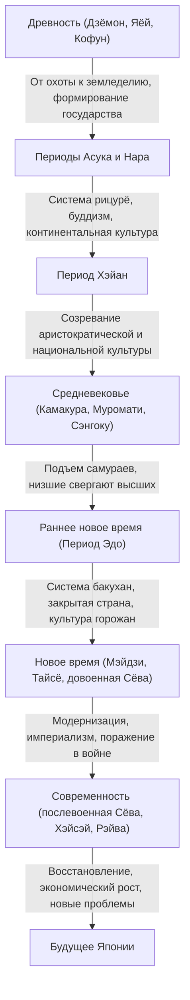

## Введение: Что принесли географические условия островного государства

Японский архипелаг, расположенный на восточной окраине Евразийского континента. Эта уникальная географическая среда островного государства оказала решающее влияние на формирование истории и культуры Японии. Умеренная отдаленность позволяла принимать новые технологии, культуру и идеи с континента, одновременно снижая риск прямого внешнего вторжения и господства. Благодаря этому Япония смогла объединить иностранную культуру с собственным климатом и духовностью, долгое время развивая уникальную идентичность. В этой статье мы подробно рассмотрим масштабный путь Японии от периода Дзёмон до наших дней с различных точек зрения: политики, экономики, культуры и повседневной жизни людей.

## Глава 1: От охоты и собирательства к земледелию (Периоды Дзёмон и Яёй)

### Период Дзёмон: Симбиоз с природой и богатый духовный мир
Считается, что период Дзёмон начался около 15 000 лет назад. Люди вели образ жизни, основанный на охоте, рыболовстве и собирательстве. Важнейшей особенностью этой эпохи является наличие керамики (керамика Дзёмон), которая считается одной из старейших в мире. Эти сосуды, украшенные веревочным орнаментом, были не просто инструментами для приготовления и хранения пищи, но и имели сложные декоративные элементы, свидетельствующие о высоком эстетическом чувстве и богатом духовном мире людей того времени. Кроме того, начался процесс перехода к оседлости и формирования крупных поселений (таких как стоянка Саннай-Маруяма). Считается, что, завися от даров природы, они приспосабливались к изменениям климата и строили устойчивое общество.

### Период Яёй: Приход заливного рисоводства и трансформация общества
С IV века до н.э. с континента были завезены технологии заливного рисоводства и металлические орудия (железные и бронзовые), что ознаменовало начало периода Яёй. Начало выращивания риса в корне изменило образ жизни людей. Стало возможным накопление излишков производства, что привело к возникновению разрыва в богатстве и появлению классов между теми, кто ими управлял, и теми, кто их не имел. Поселения превратились в «окруженные рвом поселения», защищенные рвами и земляными валами, и стали часто вспыхивать конфликты за земли и права на воду. В эту эпоху появилось множество небольших государств, и в китайских исторических хрониках (таких как «Предание о людях ва» в «Записях Вэй») описывается, как королева Яматай Химико правила различными странами.

## Глава 2: Формирование государства и принятие континентальной культуры (Периоды Кофун, Асука и Нара)

### Период Кофун: Гигантские гробницы как символ концентрации власти
Со второй половины III века во многих регионах начали сооружаться гигантские курганы в форме замочной скважины (кофун). Это означало появление могущественных владык (гозоку), контролировавших обширные территории. В частности, власть Ямато, сосредоточенная в регионе Кинки, подчиняла себе местные кланы и продвигала объединение страны. Масштабы гробниц и погребальный инвентарь свидетельствуют о величине тогдашней власти и влиянии континентальных технологий (таких как конская сбруя и керамика суэ).

### Периоды Асука и Нара: Строительство государства, основанного на законах, и расцвет буддизма
Когда в середине VI века из Пэкче пришел буддизм, японское общество пережило важный поворотный момент. Принц Сётоку и другие защищали буддизм, создали Систему двенадцати рангов и Конституцию из семнадцати статей, заложив основы централизованного государственного устройства во главе с императором. Впоследствии, пройдя через Реформы Тайка (645 г.), всерьез началось строительство государства рицурё, созданного по образцу правовой системы Китая (династии Тан).
Когда в 710 году столица была перенесена в Хэйдзё-кё (Нара), через миссии в Тан активно внедрялись передовые континентальные культуры и технологии. Расцвела культура Тэмпё, представленная созданием Великого Будды в Тодайдзи, были составлены исторические хроники «Кодзики» и «Нихон сёки», а также литературные произведения, такие как «Манъёсю», что привело к утверждению национальной идентичности.

## Глава 3: Расцвет аристократической культуры и национальная культура (Период Хэйан)

Период Хэйан, длившийся около 400 лет после переноса столицы в Хэйан-кё в 794 году, был эпохой, когда власть принадлежала аристократии, включая клан Фудзивара. После отмены миссий в Тан (894 г.) Япония ассимилировала континентальную культуру, и развилась уникальная «национальная культура» (Кокуфу бунка), соответствовавшая японскому климату и мироощущению.
Особенно важным было создание слоговой азбуки «кана» (хирагана и катакана). Это позволило выражать тонкие эмоции людей и сцены на японском языке, что привело к созданию таких всемирно известных литературных произведений, как «Повесть о Гэндзи» Мурасаки Сикибу и «Записки у изголовья» Сэй Сёнагон. Кроме того, распространилось учение Чистой земли, и идея молитвы Будде Амиде о перерождении в раю проникла от аристократии к простым людям.

## Глава 4: Подъем самураев и средневековое общество (Периоды Камакура, Муромати и Сэнгоку)

### Возникновение сёгуната Камакура и правление самураев
В конце периода Хэйан набрали силу самураи, которые изначально занимались поддержанием порядка в провинциях. Минамото-но Ёритомо разгромил клан Тайра и в 1192 году основал сёгунат Камакура. Это было первое полноценное правительство самураев, отличавшееся от аристократического правления императора и придворной знати. Управление осуществлялось на основе феодальных отношений господства и подчинения (милости и службы), и сформировалась суровая и простая самурайская культура. Также возник новый буддизм (камакурский буддизм), и через простые практики, такие как чтение нэмбуцу и дзадзэн, вера широко распространилась среди простого народа.

### Культура Муромати и эпоха «низших, свергающих высших»
В 1338 году Асикага Такаудзи основал сёгунат Муромати в Киото. Период Муромати характеризовался экономическим развитием благодаря торговле с династией Мин и расцветом культур Китаяма и Хигасияма, представленных Золотым и Серебряным павильонами. Именно в этот период были заложены основы современных японских искусств и образа жизни, таких как чайная церемония, икебана и театр Но.
Однако после Войны Онин (1467 г.) авторитет сёгуната пал, и страна вступила в период Сэнгоку (Эпоха сражающихся провинций), когда распространилась тенденция «гэкокудзё» (низшие свергают высших) — сильные свергали тех, кто был над ними. Даймё в различных регионах стремились к обогащению своих земель и усилению армий; также начались контакты с Европой (культура намбан), включая появление огнестрельного оружия и распространение христианства.

## Глава 5: Мирное время и уникальное созревание (Период Эдо)

В 1603 году Токугава Иэясу основал сёгунат Эдо, после чего последовал мирный период, длившийся около 260 лет. Сёгунат закрепил сословную систему си-но-ко-сё (самураи, крестьяне, ремесленники, торговцы) и ввел строгую систему контроля, обязывая даймё участвовать в системе поочередного присутствия в столице (санкин-котай).
Во внешней политике был введен строгий запрет на христианство и установлена политика «закрытой страны» (сакоку), ограничивавшая торговлю только с Нидерландами и Китаем в Нагасаки. Это ограничило внешнее влияние, но внутри страны повысилась производительность сельского хозяйства, и значительно развилась товарная экономика.
В городских районах, центрами которых были Осака и Эдо, расцвела культура горожан. Развивались разнообразные и утонченные формы культуры, такие как укиё-э, кабуки, хайкай и рангаку (голландские науки), а благодаря распространению школ тэракоя уровень грамотности среди простого народа достиг чрезвычайно высокого мирового уровня. Это эндогенное развитие и высокий уровень образования стали мощной базой для последующей модернизации.

## Глава 6: Скачок к современному государству (Периоды Мэйдзи, Тайсё и начало Сёва)

### Реставрация Мэйдзи и обогащение государства, усиление армии
С прибытием эскадры Перри в 1853 году политика изоляции закончилась, и Япония была вынуждена открыться миру. Столкнувшись с угрозой со стороны западных держав, Япония свергла сёгунат во время Реставрации Мэйдзи 1868 года и поспешила построить современное национальное государство во главе с императором.
Под лозунгами «Богатое государство, сильная армия», «Поощрение промышленности» и «Просвещение и цивилизация» началось стремительное внедрение западных политических систем, законов, науки, технологий и военных систем. В 1889 году была обнародована Конституция Великой Японской империи, и Япония стала первым в Азии конституционным государством с кабинетом министров и парламентом. Пройдя через японо-китайскую и русско-японскую войны, Япония вошла в число великих держав международного сообщества, завершила промышленную революцию и развила капиталистическую экономику.

### Демократия Тайсё и путь к войне
В период Тайсё, на фоне экономического бума во время Первой мировой войны, ускорилась урбанизация, и набрали силу либеральные политические и культурные движения, известные как «Демократия Тайсё». Массовая культура стала доступной, и распространился современный образ жизни.
Однако с началом периода Сёва, на фоне экономических ударов от Великой депрессии и истощения деревни, усилилось влияние военных, и произошло падение партийной политики. Япония усилила свою экспансию в континентальный Китай, что в конечном итоге привело к затяжной японо-китайской войне, а в 1941 году — к вступлению в Тихоокеанскую войну. В августе 1945 года, после атомных бомбардировок Хиросимы и Нагасаки и вступления в войну СССР, Япония приняла Потсдамскую декларацию, пережив первое в своей истории поражение и оккупацию иностранными войсками.

## Глава 7: Восстановление из пепла и взгляд в будущее (Современность)

### Чудо экономического роста и путь мирного государства
Под оккупацией GHQ (Генерального штаба Верховного главнокомандующего союзными державами) Япония подверглась тщательным реформам демилитаризации и демократизации. Конституция Японии, вступившая в силу в 1947 году, основана на принципах народного суверенитета, уважения основных прав человека и пацифизма.
Восстановив независимость благодаря Сан-Францисскому мирному договору 1951 года, Япония ускорила экономическое восстановление, толчком к которому послужили особые закупки во время Корейской войны. Во время «периода высоких темпов экономического роста» с середины 1950-х до начала 1970-х годов экономика росла поразительными темпами, и Япония превратилась во вторую по величине экономику мира. Производственные отрасли, такие как автомобилестроение и бытовая электроника, доминировали на мировых рынках, а уровень жизни граждан резко повысился.

### Современные проблемы и создание новых ценностей
После краха экономики «мыльного пузыря» в начале 1990-х годов Япония переживает длительный период экономического застоя, также известный как «потерянные 30 лет». Страна сталкивается с серьезными социальными проблемами, такими как снижение рождаемости и старение населения, депопуляция, запустение регионов, а также последствия крупных стихийных бедствий (например, Великого восточно-японского землетрясения).
С другой стороны, поп-культура (Cool Japan), такая как аниме, манга, игры и культура питания, высоко ценится во всем мире, и присутствие страны как «мягкой силы» возрастает. Кроме того, Япония по-прежнему сохраняет высокую конкурентоспособность в таких передовых технологических областях, как экологические технологии и робототехника.

## Заключение: Непрерывность истории и наследие для будущих поколений

От глиняной посуды Дзёмон до современных высоких технологий, история Японии — это динамичный процесс гибкого восприятия внешних влияний, их слияния с собственными традициями и климатом, и постоянного создания новых ценностей.
Дух гармонии, развившийся в балансе между закрытостью и открытостью островного государства, благоговение перед природой и традиция скрупулезного мастерства продолжают жить в современных японцах. Извлекая уроки из прошлого и уважая разнообразие, Япония продолжит ткать новую историю на пути к устойчивому будущему.

