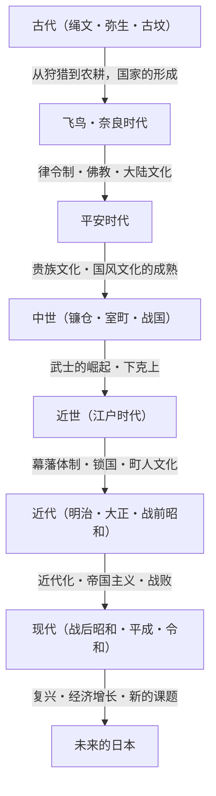

## 序章：岛国这一地理条件带来的影响

位于欧亚大陆东端的日本列岛。这种岛国独特的地理环境，对日本历史和文化的形成产生了决定性的影响。它使得日本在以适度的距离感接受来自大陆的新技术、文化和思想的同时，能够降低遭受外部直接侵略和统治的风险。借此，日本得以将外来文化与本国的风土人情和精神特质相融合，在漫长的岁月中酝酿出独特的身份认同。本文将从政治、经济、文化以及人们的生活等多个视角，详细解读从绳文时代到现代，日本所走过的宏大历程。

## 第一章：从狩猎采集到农耕（绳文・弥生时代）

### 绳文时代：与自然共生和丰富的精神世界
始于约1万5千年前的绳文时代。人们过着以狩猎、捕鱼、采集为基础的生活。这个时代最大的特征，是存在被称为世界最古老级别之一的陶器（绳文陶器）。这些表面饰有绳纹的陶器，不仅仅是烹饪和储藏的工具，还具有复杂的装饰性，诉说着当时人们极高的审美意识和丰富的精神世界。此外，定居化不断推进，形成了大规模的聚落（如三内丸山遗址等）。人们在依赖自然恩赐的同时，也适应着气候变化，被认为建立起了一个可持续发展的社会。

### 弥生时代：水稻农耕的传入与社会的变迁
从公元前4世纪左右开始，水稻农耕技术和金属器（铁器、青铜器）从大陆传入，拉开了弥生时代的序幕。水稻种植的开始，从根本上改变了人们的生活方式。剩余农产品的积累成为可能，在管理者与一无所有者之间开始产生贫富差距和阶级。聚落变成了被壕沟和土垒包围的“环濠聚落”，围绕土地和水利权的争夺日益频繁。这个时代小国林立，中国的史书（如《魏志倭人传》等）中记载了邪马台国女王卑弥呼统治诸国的情景。

## 第二章：国家的形成与大陆文化的接受（古坟・飞鸟・奈良时代）

### 古坟时代：巨大陵墓诉说的权力集中
从3世纪后半叶开始，各地开始建造巨大的前方后圆坟等古坟。这意味着统治广阔地域的强大掌权者（豪族）的出现。尤其是以近畿地方为中心的大和王权，使各地的豪族臣服，推动了国内的统一。从古坟的规模和陪葬品中，可以看出当时权力的庞大，以及来自大陆技术（如马具和须惠器等）的影响。

### 飞鸟・奈良时代：律令国家的建设与佛教的兴盛
6世纪中叶，佛教从百济传入，日本社会迎来了重大的转折点。圣德太子等人保护佛教，制定了冠位十二阶和十七条宪法，奠定了以天皇为中心的中央集权国家体制的基础。此后，经过大化改新（645年），模仿中国（唐朝）法律体系的律令国家建设正式展开。
710年迁都平城京（奈良）后，通过遣唐使，积极引进了大陆先进的文化和技术。以建造东大寺大佛为代表的天平文化繁荣发展，编纂了《古事记》、《日本书纪》等历史书籍以及《万叶集》等文学作品，作为国家的自我认同感得以确立。

## 第三章：贵族文化的绽放与国风文化（平安时代）

从794年迁都平安京开始，持续了约400年的平安时代，是以藤原氏为首的贵族掌握权力的时代。以废止遣唐使（894年）为契机，日本消化吸收了大陆文化，发展出了符合日本风土人情和感性的独特“国风文化”。
其中尤为重要的是“假名文字（平假名、片假名）”的诞生。由此，人们可以用日语表达细腻的情感和情景，诞生了紫式部的《源氏物语》和清少纳言的《枕草子》等享誉世界的文学作品。此外，净土教广泛传播，向阿弥陀佛祈求往生极乐的思想，从贵族渗透到了平民之中。

## 第四章：武士的崛起与中世社会（镰仓・室町・战国时代）

### 镰仓幕府的成立与武家政权
平安时代末期，通过维持地方治安而积蓄力量的武士开始崛起。源赖朝打倒平氏，于1192年建立了镰仓幕府。这是不同于天皇和贵族的公家政权，由武士建立的首个真正意义上的政权。基于“御恩与奉公”这种主从关系（封建制度）进行统治，形成了质朴刚健的武家文化。此外，新佛教（镰仓新佛教）诞生，通过念佛和坐禅等简明易行的实践，信仰在民众中广泛传播。

### 室町文化与下克上的时代
1338年，足利尊氏在京都建立了室町幕府。室町时代，通过与明朝的勘合贸易实现了经济发展，以金阁和银阁为代表的北山文化和东山文化繁荣一时。茶道、花道、能乐等构成现代日本文化基层的艺术和生活方式，都在这一时期确立。
然而，以应仁之乱（1467年）为转折点，幕府权威扫地，社会进入了实力派打倒上位者的“下克上”风气蔓延的战国时代。各地的战国大名致力于富国强兵，随着铁炮的传入和基督教的传教，与欧洲的接触（南蛮文化）也开始了。

## 第五章：太平盛世与独特的成熟（江户时代）

1603年，德川家康建立江户幕府，此后迎来了长达约260年的和平时代（德川治世）。幕府固定了士农工商的身份制度，规定大名有参勤交代的义务等，确立了牢固的统治体制（幕藩体制）。
在对外政策方面，彻底禁绝基督教，实行了仅限于荷兰和中国（清朝）在长崎进行贸易的“锁国”体制。虽然这限制了来自外部的刺激，但国内农业生产率得到提高，商品经济取得了显著发展。
以大阪和江户为中心的城市地区，町人文化（元禄文化、化政文化）迎来了繁荣。浮世绘、歌舞伎、俳谐、兰学等丰富多样且洗练的文化得以孕育，随着寺子屋（私塾）的普及，平民的识字率在世界上也达到了极高的水平。这种内发性的发展和高水平的教育，成为了后来近代化的强大基石。

## 第六章：向近代国家的飞跃（明治・大正・昭和初期）

### 明治维新与富国强兵
1853年佩里来航宣告了锁国的结束，日本被迫开国。面对欧美列强的威胁，日本通过1868年的明治维新推翻了幕府，加紧建设以天皇为中心的近代民族国家。
打出“富国强兵”、“殖产兴业”、“文明开化”的口号，以猛烈的势头引入了西方的政治制度、法律、科学技术和军事系统。1889年颁布了《大日本帝国宪法》，成为亚洲第一个拥有内阁制度和议会的立宪国家。经过甲午中日战争和日俄战争，日本在国际社会中跻身列强之列，完成了工业革命并发展了资本主义经济。

### 大正民主与走向战争之路
大正时代，在第一次世界大战带来的经济繁荣背景下，城市化不断推进，被称为“大正民主”的自由主义政治和文化运动高涨。大众文化被消费，摩登的生活方式得到普及。
然而，进入昭和时代后，在世界经济大萧条造成的经济打击和农村凋敝的背景下，军部开始抬头，政党政治机能不全的问题日益严重。日本加强了对中国大陆的扩张，最终陷入泥潭般的侵华战争，并于1941年卷入了太平洋战争。1945年8月，经历了广岛和长崎被投下原子弹、苏联参战之后，日本接受了《波茨坦公告》，经历了有史以来的首次战败和外国军队占领。

## 第七章：从废墟中复兴与展望未来（现代）

### 奇迹般的经济增长与和平国家之路
在GHQ（盟军最高司令官总司令部）的占领下，日本接受了彻底的非军事化和民主化改革。1947年施行的《日本国宪法》，以主权在民、尊重基本人权、和平主义为基本原则。
凭借1951年的《旧金山和约》恢复独立后，日本以朝鲜战争的特需为契机，加速了经济复兴。在20世纪50年代中叶至70年代初的“经济高度成长期”，日本以惊人的速度扩大了经济规模，成长为世界第二大经济体。汽车、家电等制造业席卷全球市场，国民的生活水平得到了戏剧性的提高。

### 现代的课题与创造新价值
20世纪90年代初泡沫经济崩溃后，日本经历了被称为“失去的30年”的长期经济低迷期。目前正面临着少子老龄化、人口减少、地方人口过疏化，以及应对巨大灾害（如东日本大地震等）等严重的社会课题。
另一方面，动画、漫画、游戏、饮食文化等流行文化（酷日本）在世界各地获得了高度评价，作为软实力的存在感日益增强。同时，在环保技术和机器人等尖端技术领域，日本依然保持着很强的竞争力。

## 结语：历史的连续性与传承给下一代

从绳文的陶器到现代的高科技，日本的历史是一个动态的过程：在灵活接受外部影响的同时，将其与自身的传统和风土相融合，不断创造出新的价值。
在岛国封闭性与开放性的平衡中培养出的“和”之精神、对自然的敬畏之情，以及精益求精的制造传统，在现代日本人身上依然脉脉相传。汲取过去历史的教训，尊重多样性，日本今后也将面向可持续发展的未来，继续编织新的历史。

