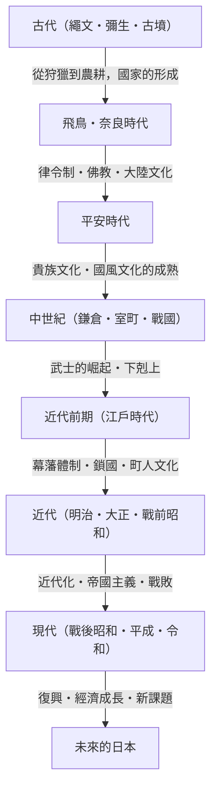

## 序章：島國的地理條件帶來的影響

位於歐亞大陸東端的日本列島。這種島國獨特的地理環境，對日本歷史與文化的形成產生了決定性的影響。在與大陸保持適度距離的情況下，日本能夠接受來自大陸的新技術、文化與思想，同時降低了受到外部直接侵略或統治的風險。這使得日本能夠將外來文化與本國的風土人情及精神特質相融合，從而長久地孕育出獨特的自我認同。本文將從政治、經濟、文化以及人民生活等多個角度，詳細解讀從繩文時代到現代，日本這段壯麗的發展歷程。

## 第1章：從狩獵採集到農耕（繩文・彌生時代）

### 繩文時代：與自然共生及豐富的精神世界
據說始於約1萬5千年前的繩文時代。人們過著以狩獵、捕魚、採集為基礎的生活。這個時代最大的特徵，是存在著被稱為世界最古老級別的陶器（繩文土器）。這些表面帶有繩紋圖案的陶器，不僅僅是烹飪或儲存的工具，還具有複雜的裝飾性，訴說著當時人們高度的審美觀與豐富的精神世界。此外，隨著定居化的發展，形成了大規模的聚落（如三內丸山遺跡等）。一般認為，他們在依賴自然恩賜的同時，也適應了氣候變遷，建立了一個永續的社會。

### 彌生時代：水稻農耕的傳入與社會的變遷
從西元前4世紀左右開始，水稻農耕技術與金屬器（鐵器、青銅器）從大陸傳入，揭開了彌生時代的序幕。稻作的開始從根本上改變了人們的生活方式。剩餘農產品的積累成為可能，在管理這些產品的人與一無所有的人之間，開始產生了貧富差距與階級。聚落變成了被壕溝或土壘包圍的「環濠聚落」，圍繞土地與水權的爭奪變得頻繁。在這個時代，小國林立，中國的史書（如《魏志倭人傳》等）中記載了邪馬台國的女王卑彌呼統治諸國的情景。

## 第2章：國家的形成與大陸文化的接受（古墳・飛鳥・奈良時代）

### 古墳時代：巨大陵墓訴說的權力集中
從3世紀後半葉開始，各地開始建造巨大的前方後圓墳等古墳。這意味著統治廣大地區的強大掌權者（豪族）的出現。特別是以近畿地區為中心的「大和王權」，使各地的豪族臣服，推進了國內的統一。從古墳的規模及陪葬品中，可以看出當時權力之大，以及受到大陸技術（如馬具、須惠器等）的影響。

### 飛鳥・奈良時代：律令國家的建設與佛教的興盛
6世紀中葉，佛教從百濟傳入後，日本社會迎來了重大的轉捩點。聖德太子等人保護佛教，制定了冠位十二階及十七條憲法，奠定了以天皇為中心的中央集權國家體制的基礎。其後，經過大化革新（645年），仿效中國（唐朝）法律體系的律令國家建設全面展開。
710年遷都平城京（奈良）後，透過遣唐使積極引進了大陸先進的文化與技術。以建立東大寺大佛為代表的天平文化百花齊放，編纂了《古事記》、《日本書紀》等史書以及《萬葉集》等文學作品，確立了作為國家的自我認同。

## 第3章：貴族文化的開花與國風文化（平安時代）

從794年遷都平安京開始，持續了約400年的平安時代，是以藤原氏為首的貴族掌握權力的時代。以廢止遣唐使（894年）為契機，日本消化吸收了大陸文化，發展出適合日本風土與感性的獨特「國風文化」。
其中最重要的是「假名文字（平假名、片假名）」的誕生。這使得人們能夠用日語來表達細膩的感情與情景，孕育出了紫式部的《源氏物語》及清少納言的《枕草子》等享譽世界的文學作品。此外，淨土教開始普及，祈求阿彌陀佛接引往生極樂世界的思想，從貴族滲透到了平民階層。

## 第4章：武士的崛起與中世紀社會（鎌倉・室町・戰國時代）

### 鎌倉幕府的成立與武家政權
平安時代末期，因維持地方治安而壯大勢力的武士開始崛起。源賴朝打倒了平氏，於1192年建立了鎌倉幕府。這是有別於天皇與貴族所組成的公家政權，第一個由武士建立的真正政權。實行了基於「御恩與奉公」這種主從關係（封建制度）的統治，形成了質樸剛健的武家文化。此外，新佛教（鎌倉新佛教）誕生，透過念佛、坐禪等簡明易懂的修行方式，信仰廣泛地在民眾中傳播開來。

### 室町文化與下剋上的時代
1338年，足利尊氏在京都建立了室町幕府。室町時代，藉由與明朝的勘合貿易帶動了經濟發展，以金閣、銀閣為代表的北山文化、東山文化也隨之繁榮。茶道、花道、能樂等構成現代日本文化底層的演藝與生活方式，都是在這個時期確立的。
然而，以應仁之亂（1467年）為界，幕府的權威掃地，社會進入了實力派推翻上位者的「下剋上」風潮蔓延的戰國時代。各地的戰國大名致力於富國強兵，隨著鐵炮的傳入與基督教的傳教，與歐洲的接觸（南蠻文化）也開始了。

## 第5章：太平盛世與獨特的成熟（江戶時代）

1603年，德川家康建立了江戶幕府，從此迎來了長達約260年的和平時代（日本和平）。幕府固定了士農工商的身分制度，並規定大名必須「參勤交代」，建立起強固的統治體制（幕藩體制）。
在對外政策上，徹底禁止基督教，並實行僅限荷蘭與中國（清朝）在長崎進行貿易的「鎖國」體制。這雖然限制了來自外部的刺激，但國內的農業生產力提升，商品經濟顯著發達。
在以大坂和江戶為中心的都市地區，町人文化（元祿文化、化政文化）百花齊放。浮世繪、歌舞伎、俳諧、蘭學等多元且精緻的文化被孕育出來，由於寺子屋（私塾）的普及，平民的識字率在世界範圍內也達到了極高的水準。這種內發性的發展與高水準的教育，成為了後來現代化的強大基礎。

## 第6章：向近代國家的飛躍（明治・大正・昭和初期）

### 明治維新與富國強兵
1853年培理來航宣告了鎖國的結束，日本被迫開國。面對歐美列強的威脅，日本透過1868年的明治維新推翻了幕府，加緊建設以天皇為中心的近代民族國家。
以「富國強兵」、「殖產興業」、「文明開化」為口號，以猛烈的勢頭引進了西方的政治制度、法律、科學技術與軍事系統。1889年頒布了《大日本帝國憲法》，成為亞洲第一個擁有內閣制度與議會的立憲國家。經過甲午、日俄戰爭，日本在國際社會中躋身列強之林，完成了產業革命並發展了資本主義經濟。

### 大正民主與走向戰爭之路
在大正時代，以第一次世界大戰帶來的經濟繁榮為背景，都市化不斷發展，被稱為「大正民主」的自由主義政治與文化運動高漲。大眾文化被消費，摩登的生活方式逐漸普及。
然而，進入昭和時代後，在世界經濟危機帶來的經濟打擊與農村凋敝的背景下，軍部開始崛起，政黨政治的機能也逐漸喪失。日本加強了對中國大陸的擴張，最終陷入了泥沼般的中日戰爭，並在1941年突入了太平洋戰爭。1945年8月，經過廣島與長崎被投下原子彈、蘇聯參戰，日本接受了《波茨坦公告》，經歷了有史以來首次的戰敗與外國軍隊的佔領。

## 第7章：從廢墟中復興與對未來的展望（現代）

### 奇蹟般的經濟成長與作為和平國家的進程
在GHQ（盟軍最高司令官總司令部）的佔領下，日本接受了徹底的非軍事化與民主化改革。1947年施行的《日本國憲法》，以主權在民、尊重基本人權、和平主義為基本原則。
1951年透過《舊金山和約》恢復獨立的日本，以韓戰的特需為契機，加速了經濟復興。在1950年代中期到1970年代初期的「高度經濟成長期」，日本以驚人的速度擴大了經濟規模，成長為世界第二大經濟體。汽車、家電等製造業席捲全球市場，國民的生活水準有了戲劇性的提升。

### 現代的課題與新價值的創造
1990年代初期泡沫經濟破滅後，日本經歷了被稱為「失落的三十年」的長期經濟低迷期。面臨著少子高齡化、人口減少、地方人口外流，以及應對巨大災害（如東日本大震災等）等嚴峻的社會課題。
另一方面，動畫、漫畫、遊戲、飲食文化等流行文化（酷日本）在世界各地獲得了高度評價，作為軟實力的存在感日益增強。此外，在環境技術與機器人等尖端技術領域，日本依然保持著高度的競爭力。

## 結語：歷史的延續性與對下一代的傳承

從繩文的陶器到現代的高科技技術，日本的歷史，是一個在靈活接受外部影響的同時，將其與自身的傳統及風土相融合，不斷創造出新價值的充滿活力的過程。
在島國的封閉性與開放性的平衡中培養出來的「和」之精神、對自然的敬畏之心，以及一絲不苟的製造傳統，至今仍在現代日本人的血液中脈脈相傳。從過去的歷史中汲取教訓，在尊重多樣性的同時，日本今後也將朝著永續的未來，繼續編織出新的歷史。

