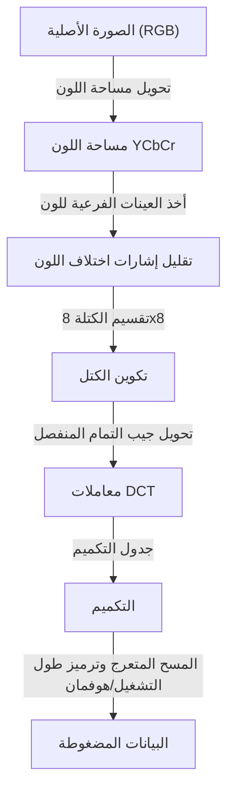
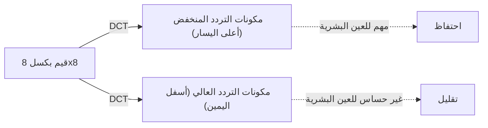

## مقدمة: عالم البيانات وجماليات 'التخلص'

في العالم الرقمي، غالبًا ما تكون "البيانات" ثقيلة جدًا. تحتوي بيانات الصور على وجه الخصوص على ثلاث قيم لـ RGB (أحمر، أخضر، أزرق) لكل بكسل، وعندما يتعلق الأمر بالصور التي تحتوي على ملايين البكسلات، يصبح حجم البيانات هائلاً بسرعة. في أواخر الثمانينيات والتسعينيات، مع تحول انتشار الإنترنت والكاميرات الرقمية إلى حقيقة واقعة، اصطدم الباحثون بحاجز كبير. كانت المشكلة هي "كيفية الحفاظ على الصور صغيرة مع جعلها تبدو جميلة".

هنا جاء دور فريق خبراء التصوير المشترك، أو معيار **JPEG**. يكمن جوهر JPEG في استخدامه الذكي لـ "حدود الرؤية البشرية" الكامنة وراء كلمة "الضغط". ما الذي يمكن التخلص منه من الصورة دون أن يلاحظه البشر؟ كان JPEG إجابة مثالية على هذا السؤال. في هذه المقالة، سنتعمق في تاريخ ضغط الصور، من ولادة معيار JPEG، وتحويل مساحة اللون، والأساس الرياضي لتحويل جيب التمام المنفصل (DCT)، وعملية ترميز هوفمان، وآلية توليد ضوضاء الكتلة، إلى WebP و AVIF الحديثين.

## ولادة معيار JPEG: طفرة عام 1992

في عام 1986، شكلت ISO و CCITT (الآن ITU-T) بالاشتراك مجموعة توحيد لضغط الصور الثابتة. كانت هذه بداية "فريق خبراء التصوير المشترك". في ذلك الوقت، كانت قوة معالجة الكمبيوتر وسعة التخزين وسرعات خطوط الاتصال ضعيفة بشكل لا يصدق مقارنة باليوم. لم يكن من الواقعي التعامل مع ميغابايت من الصور كما هي، وكانت هناك حاجة ماسة لتوحيد الضغط الفُقْداني (طريقة تحقق معدلات ضغط عالية للغاية عن طريق التخلص من بعض البيانات الأصلية).

بعد عدة سنوات من المناقشة والتقييم الفني، تمت الموافقة رسميًا على معيار JPEG في عام 1992. لا يعد JPEG خوارزمية واحدة، بل يشير إلى إطار عمل لسلسلة من تقنيات الضغط. من بينها، يمتلك JPEG الأساسي الأكثر شيوعًا خط أنابيب متطور للغاية يركز على تحويل جيب التمام المنفصل (DCT)، مقترنًا بالتكميم المصمم خصيصًا للخصائص البصرية البشرية، وترميز الإنتروبيا عبر ترميز هوفمان.

يكشف كل خطوة في خط الأنابيب هذا عن اندماج رائع بين الرياضيات وعلم وظائف الأعضاء. دعونا ننظر إليها خطوة بخطوة.

## تحويل مساحة اللون: YCbCr والخصائص البصرية البشرية

عادة ما يتم تمثيل الصور على الكمبيوتر بالألوان الأساسية الثلاثة R (أحمر) و G (أخضر) و B (أزرق). ومع ذلك، فإن العين البشرية أكثر حساسية للتغيرات في السطوع (النصوع) بكثير من التغيرات في اللون (تدرج اللون والتشبع). بعبارة أخرى، فإن تركها كـ RGB يمزج بين "المعلومات التي بالكاد يلاحظها البشر" و "المعلومات التي يتم ملاحظتها بسهولة"، مما يجعل من المستحيل تقليل البيانات بكفاءة.

لذلك، يقوم JPEG بتحويل مساحة اللون RGB إلى مساحة اللون **YCbCr**.

- **Y (النصوع)**: معلومات السطوع. تعادل صورة أحادية اللون.
- **Cb (اختلاف اللون الأزرق)**: المكون الأزرق ناقص النصوع.
- **Cr (اختلاف اللون الأحمر)**: المكون الأحمر ناقص النصوع.

بالاستفادة من حساسية العين البشرية للنصوع، يتخذ JPEG نهجًا (أخذ العينات الفرعية للون) حيث يحافظ على المكون "Y" قدر الإمكان ويقلل من المكونين "Cb" و "Cr". على سبيل المثال، في تنسيق يسمى "4:2:0"، يتم تقليل معلومات اختلاف اللون إلى نصف الدقة رأسيًا وأفقيًا (الربع من حيث كمية البيانات). ينجح هذا في تقليل كمية البيانات بشكل كبير دون أي تدهور تقريبًا في جودة الصورة المرئية للعين البشرية. هذه هي الخطوة الأولى في "التخلص مما لا يلاحظه البشر".

## تحويل جيب التمام المنفصل (DCT): تحليل الصور إلى ترددات

بعد تحويل مساحة اللون وتقسيم بيانات الصورة إلى كتل (عادة 8x8 بكسل)، تخضع للعملية الأساسية التالية: **تحويل جيب التمام المنفصل (DCT)**.

DCT هي عملية رياضية تحول الترتيب "المكاني" للبكسلات في صورة إلى مكونات "تردد". تحتوي كتلة البكسل 8x8 على 64 قيمة نصوع، ولكن عند تطبيق DCT، فإنها تحلل هذا إلى 64 مكون تردد (معاملات) تتراوح من "السطوع الكلي (مكون التيار المستمر، DC)" إلى "الأنماط الدقيقة والحواف (مكون التيار المتردد، AC)".

لماذا التحويل إلى ترددات؟ وذلك لأن العين البشرية حساسة لـ "التدرجات اللطيفة (الترددات المنخفضة)"، ولكنها غير حساسة للتكاثر الدقيق لـ "الضوضاء الدقيقة جدًا أو الأنماط المعقدة (الترددات العالية)". DCT بحد ذاتها عملية رياضية قابلة للعكس ولا تفقد أي معلومات، ولكنها خطوة معالجة مسبقة أساسية لتسليط الضوء على "ما يجب التخلص منه".

## جدول التكميم: 'القسمة' التي تحكم الجماليات

بالنسبة للمعاملات الـ 64 التي تم الحصول عليها بواسطة DCT، يتم أخيرًا إجراء عملية "التخلص" من البيانات. هذا هو **التكميم**.

التكميم هو عملية بسيطة تتمثل في تقسيم معاملات DCT على مصفوفة ثابتة 8x8 تسمى "جدول التكميم" وقطع (تقريب) الكسور العشرية. تم تصميم جدول التكميم لوضع أرقام صغيرة لمكونات التردد المنخفض (أعلى اليسار) وأرقام كبيرة لمكونات التردد العالي (أسفل اليمين).

ماذا يحدث عندما تقسم على رقم كبير وتقطع؟ تصبح معظم مكونات التردد العالي "0". بعبارة أخرى، تُفقد معلومات التفاصيل الدقيقة. إن توليد الكثير من هذه الأصفار هو المفتاح لتحسين كفاءة الضغط اللاحقة بشكل كبير.

من خلال تعديل درجة التكميم (حجم قيم الجدول)، يتم تحديد التوازن بين "جودة" و "حجم ملف" صورة JPEG. يؤدي خفض قيمة Q إلى القسمة على أرقام أكبر، لذلك تصبح العديد من المعاملات 0 ويزداد معدل الضغط، ولكن تُفقد التفاصيل.

## ضوضاء الكتلة: الآثار الجانبية للضغط غير المعقول

إذا تم تقوية التكميم بشكل مفرط، تحدث تشوهات (ضوضاء) شهيرة. التشوهات النموذجية هي **ضوضاء الكتلة** و **ضوضاء البعوض**.

نظرًا لأن JPEG يعالج بوحدات من كتل 8x8 بكسل، فعند فقدان المعلومات بسبب التكميم، لا يمكن الحفاظ على استمرارية اللون والسطوع بين الكتل المتجاورة، وتصبح الحدود مرئية بوضوح. هذه هي ضوضاء الكتلة. علاوة على ذلك، حول التغيرات المفاجئة (مجموعات من مكونات التردد العالي) مثل النص أو الحواف، يؤدي قطع مكونات التردد العالي بالقوة إلى ضوضاء تشبه التموج (ضوضاء البعوض).

يمكن القول إن هذه الضوضاء توضح بصريًا قيود خوارزمية JPEG والآثار الجانبية للتحويل الرياضي.

## ترميز هوفمان وضغط الإنتروبيا: التعبئة دون إهدار

بمجرد اكتمال التكميم، تحتوي الكتلة 8x8 على بعض القيم ذات المغزى في أعلى اليسار، ويصطف الجزء السفلي الأيمن المتبقي بكمية كبيرة من الأصفار. لتحويل هذا بكفاءة إلى بيانات، يتم استخدام طريقة تسمى **المسح المتعرج** لإعادة ترتيب المعاملات في سطر واحد من أعلى اليسار إلى أسفل اليمين. هذا يتسبب في ظهور الأصفار على التوالي.

بعد ذلك، يلخص **ترميز طول التشغيل** "عدد الأصفار المتتالية"، وأخيرًا يتم تطبيق **ترميز هوفمان**. ترميز هوفمان هو طريقة لتعيين سلاسل بتات قصيرة للأنماط التي تظهر بشكل متكرر وسلاسل بتات طويلة للأنماط التي نادرًا ما تظهر. عند هذه النقطة، يتم أخيرًا إنشاء ملف ".jpg" الذي نتعامل معه.

## السلالة إلى تنسيقات الجيل القادم: WebP، AVIF، JPEG XL

مرت أكثر من 30 عامًا منذ ولادة JPEG، وأصبحت الصور ومقاطع الفيديو تمثل الآن غالبية حركة مرور الإنترنت. على الرغم من أن JPEG لا يزال يحتل الصدارة، فقد ظهرت العديد من تنسيقات الجيل التالي لتلبية المتطلبات الحديثة (جودة أعلى، سعة أقل، دعم قناة ألفا، إلخ).

### WebP

تم تطوير WebP بواسطة Google، وهو يطبق تقنية معيار ضغط الفيديو "VP8" على الصور الثابتة. باستخدام نموذج تنبؤ أكثر تقدمًا من JPEG، فإنه يقلل حجم الملف بنسبة 20-30٪ مقارنة بـ JPEG مع دعم الشفافية (قناة ألفا) والرسوم المتحركة.

### AVIF (تنسيق ملف صورة AV1)

يحول AVIF برنامج ترميز ضغط الفيديو المفتوح من الجيل التالي "AV1" إلى الصور الثابتة. يفتخر بكفاءة ضغط أعلى من WebP، وهو يتكيف تمامًا مع تقنيات العرض الحديثة مثل HDR (النطاق الديناميكي العالي). في حين أن لديه نفس المعالجة القائمة على الكتل مثل JPEG، فإنه يحقق معدل ضغط هائلاً باستخدام موارد حسابية وفيرة، مثل أحجام الكتل المتغيرة وخوارزميات التنبؤ المتقدمة.

### JPEG XL

تم تصميمه كخليفة لـ JPEG، وله ميزة فريدة تتمثل في القدرة على إعادة ضغط ملفات JPEG الموجودة دون تدهور. يتمتع بتوازن جيد بين جودة الصورة وحجمها، ويتسع دعمه تدريجياً.

## الخلاصة: فن الطرح

يكشف كشف تاريخ وتقنية JPEG أنه ليس مجرد تاريخ لـ "ضغط البيانات" ولكنه تاريخ لـ "اختراق الحواس البشرية". عندما ننظر إلى صورة، فإننا لا ننظر إلى جميع البكسلات بالتساوي. استخدم JPEG الرياضيات وعلم وظائف الأعضاء لقطع "ما لا ننظر إليه" بدقة.

مع تطور التكنولوجيا الرقمية، تظهر التنسيقات الجديدة واحدًا تلو الآخر، لكن الفلسفة الأساسية التي أسسها JPEG، "خداع العين البشرية"، لا تزال موروثة باستمرار في الرسوم المتحركة وضغط الفيديو اليوم. في المرة القادمة التي ترى فيها صورة جميلة على شاشة هاتفك الذكي، توقف لحظة للتفكير في الملايين من "أجزاء المعلومات المهملة" وراءها والصيغ الرياضية الجميلة التي جعلت ذلك ممكنًا.
