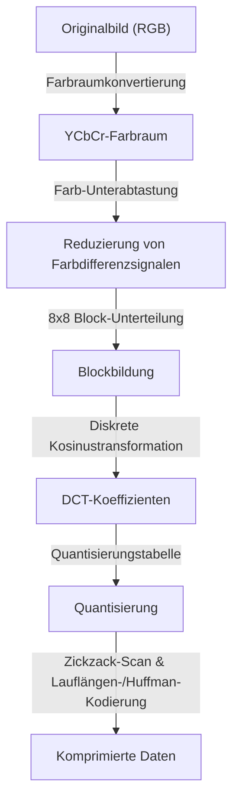
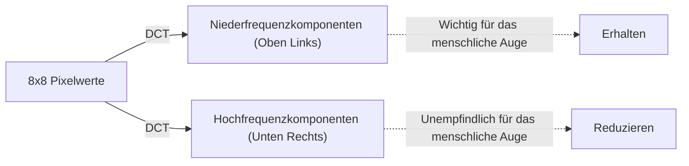

## Einleitung: Die Welt der Daten und die Ästhetik des 'Verwerfens'

In der digitalen Welt sind "Daten" oft zu schwer. Insbesondere Bilddaten haben drei Werte für RGB (Rot, Grün, Blau) pro Pixel, und bei Bildern mit Millionen von Pixeln wird die Datenmenge schnell enorm. In den späten 1980er und 1990er Jahren, als die Verbreitung des Internets und von Digitalkameras Realität wurde, stießen Forscher auf eine große Hürde. Das Problem war, "wie man Bilder klein hält und sie gleichzeitig schön aussehen lässt."

Hier kam die Joint Photographic Experts Group, oder der **JPEG**-Standard, ins Spiel. Die Essenz von JPEG liegt in seiner cleveren Nutzung der "Grenzen des menschlichen Sehens" hinter dem Wort "Komprimierung". Was kann man aus einem Foto wegwerfen, ohne dass es Menschen bemerken? JPEG war eine perfekte Antwort auf diese Frage. In diesem Artikel werden wir uns in die Geschichte der Bildkomprimierung vertiefen, von der Geburt des JPEG-Standards, der Farbraumkonvertierung, der mathematischen Grundlage der diskreten Kosinustransformation (DCT), dem Huffman-Kodierungsprozess, dem Mechanismus der Blockrauschen-Erzeugung bis hin zu modernen WebP und AVIF.

## Die Geburt des JPEG-Standards: Ein Durchbruch im Jahr 1992

1986 gründeten ISO und CCITT (heute ITU-T) gemeinsam eine Standardisierungsgruppe für die Komprimierung von Standbildern. Dies war der Beginn der "Joint Photographic Experts Group". Damals waren die Verarbeitungsleistung von Computern, die Speicherkapazität und die Geschwindigkeiten der Kommunikationsleitungen im Vergleich zu heute unglaublich gering. Es war nicht realistisch, Megabytes an Bildern so zu handhaben, wie sie waren, und es bestand ein dringender Bedarf zur Standardisierung verlustbehafteter Komprimierung (eine Methode, die durch Verwerfen einiger Originaldaten extrem hohe Komprimierungsraten erzielt).

Nach mehrjährigen Diskussionen und technischen Bewertungen wurde der JPEG-Standard 1992 offiziell genehmigt. JPEG ist kein einzelner Algorithmus, sondern bezieht sich auf ein Framework einer Reihe von Komprimierungstechniken. Darunter verfügt das beliebteste Baseline-JPEG über eine hochentwickelte Pipeline, die sich auf die diskrete Kosinustransformation (DCT) konzentriert, kombiniert mit einer auf die menschlichen visuellen Eigenschaften zugeschnittenen Quantisierung und Entropiekodierung über Huffman-Kodierung.

Jeder Schritt in dieser Pipeline offenbart eine wunderbare Verschmelzung von Mathematik und Physiologie. Lassen Sie uns sie Schritt für Schritt betrachten.

## Farbraumkonvertierung: YCbCr und menschliche visuelle Eigenschaften

Bilder auf einem Computer werden üblicherweise durch die drei Primärfarben R (Rot), G (Grün) und B (Blau) dargestellt. Das menschliche Auge reagiert jedoch viel empfindlicher auf Änderungen der Helligkeit (Luminanz) als auf Farbänderungen (Farbton und Sättigung). Mit anderen Worten, wenn man es als RGB belässt, mischen sich "Informationen, die Menschen kaum bemerken" und "Informationen, die leicht bemerkt werden", was es unmöglich macht, Daten effizient auszudünnen.

Daher konvertiert JPEG den RGB-Farbraum in den **YCbCr-Farbraum**.

- **Y (Luminanz)**: Helligkeitsinformationen. Entspricht einem Monochrombild.
- **Cb (Blaue Farbdifferenz)**: Die blaue Komponente abzüglich der Luminanz.
- **Cr (Rote Farbdifferenz)**: Die rote Komponente abzüglich der Luminanz.

Indem JPEG die Empfindlichkeit des menschlichen Auges für Luminanz ausnutzt, verfolgt es einen Ansatz (Farb-Unterabtastung), bei dem es die "Y"-Komponente so weit wie möglich erhält und die "Cb"- und "Cr"-Komponenten ausdünnt. In einem Format namens "4:2:0" werden beispielsweise Farbdifferenzinformationen vertikal und horizontal auf die halbe Auflösung (ein Viertel in Bezug auf die Datenmenge) reduziert. Dies führt zu einer erheblichen Reduzierung der Datenmenge bei fast keinem für das menschliche Auge sichtbaren Verlust an Bildqualität. Dies ist der erste Schritt beim "Verwerfen dessen, was Menschen nicht bemerken".

## Diskrete Kosinustransformation (DCT): Bilder in Frequenzen zerlegen

Nach der Konvertierung des Farbraums und der Aufteilung der Bilddaten in Blöcke (normalerweise 8x8 Pixel) wird es dem nächsten Kernprozess unterzogen: der **Diskreten Kosinustransformation (DCT)**.

DCT ist eine mathematische Operation, die die "räumliche" Anordnung von Pixeln in einem Bild in "Frequenz"-Komponenten umwandelt. Ein 8x8 Pixelblock hat 64 Luminanzwerte, aber wenn DCT angewendet wird, zerlegt sie diese in 64 Frequenzkomponenten (Koeffizienten), die von "Gesamthelligkeit (Gleichstromkomponente, DC)" bis "feine Muster und Kanten (Wechselstromkomponente, AC)" reichen.

Warum in Frequenzen konvertieren? Das liegt daran, dass das menschliche Auge empfindlich auf "sanfte Verläufe (niedrige Frequenzen)" reagiert, aber unempfindlich gegenüber der genauen Reproduktion von "sehr feinem Rauschen oder komplexen Mustern (hohen Frequenzen)" ist. DCT selbst ist eine reversible mathematische Operation und verliert keine Informationen, aber es ist ein wesentlicher Vorverarbeitungsschritt, um hervorzuheben, "was weggeworfen werden soll".

## Quantisierungstabelle: Die 'Division', die die Ästhetik regelt

Für die 64 durch DCT erhaltenen Koeffizienten wird schließlich der Prozess des "Verwerfens" von Daten durchgeführt. Das ist die **Quantisierung**.

Quantisierung ist eine einfache Operation, bei der die DCT-Koeffizienten durch eine 8x8 konstante Matrix, genannt "Quantisierungstabelle", dividiert und die Dezimalstellen abgeschnitten (gerundet) werden. Die Quantisierungstabelle ist so konzipiert, dass sie kleine Zahlen für Niederfrequenzkomponenten (oben links) und große Zahlen für Hochfrequenzkomponenten (unten rechts) platziert.

Was passiert, wenn Sie durch eine große Zahl dividieren und abschneiden? Die meisten Hochfrequenzkomponenten werden zu "0". Das bedeutet, dass feine Detailinformationen verloren gehen. Die Erzeugung vieler dieser "0"en ist der Schlüssel zur dramatischen Verbesserung der späteren Komprimierungseffizienz.

Durch Anpassen des Quantisierungsgrades (der Größe der Tabellenwerte) wird das Gleichgewicht zwischen "Qualität" und "Dateigröße" eines JPEG-Bildes bestimmt. Das Verringern des Q-Wertes führt zu einer Division durch größere Zahlen, so dass viele Koeffizienten 0 werden und die Komprimierungsrate steigt, aber Details verloren gehen.

## Blockrauschen: Nebenwirkungen unvernünftiger Komprimierung

Wenn die Quantisierung zu stark intensiviert wird, treten berühmte Artefakte (Rauschen) auf. Typische sind **Blockrauschen** und **Moskitorauschen**.

Da JPEG in Einheiten von 8x8 Pixelblöcken arbeitet, kann bei Informationsverlust durch Quantisierung die Kontinuität von Farbe und Helligkeit zwischen benachbarten Blöcken nicht aufrechterhalten werden, und Grenzen werden deutlich sichtbar. Dies ist Blockrauschen. Außerdem führt das gewaltsame Herausschneiden von Hochfrequenzkomponenten in der Umgebung plötzlicher Änderungen (Cluster von Hochfrequenzkomponenten) wie Text oder Kanten zu wellenartigem Rauschen (Moskitorauschen).

Man kann sagen, dass diese Geräusche die Grenzen des JPEG-Algorithmus und die Nebenwirkungen der mathematischen Transformation visuell demonstrieren.

## Huffman-Kodierung und Entropiekomprimierung: Packen ohne Verschwendung

Sobald die Quantisierung abgeschlossen ist, hat der 8x8-Block ein paar bedeutungsvolle Werte oben links, und der verbleibende Teil unten rechts ist mit einer großen Menge an "0"en aufgereiht. Um dies effizient in Daten umzuwandeln, wird eine Methode namens **Zickzack-Scan** verwendet, um die Koeffizienten in einer Zeile von oben links nach unten rechts neu anzuordnen. Dadurch erscheinen Nullen nacheinander.

Danach fasst die **Lauflängenkodierung** zusammen, "wie viele Nullen aufeinander folgen", und schließlich wird die **Huffman-Kodierung** angewendet. Die Huffman-Kodierung ist eine Methode, um häufig auftretenden Mustern kurze Bitfolgen und selten auftretenden Mustern lange Bitfolgen zuzuweisen. An diesem Punkt ist die ".jpg"-Datei, mit der wir arbeiten, endlich erstellt.

## Genealogie zu Formaten der nächsten Generation: WebP, AVIF, JPEG XL

Über 30 Jahre sind seit der Geburt von JPEG vergangen, und Bilder und Videos machen mittlerweile den Großteil des Internetverkehrs aus. Obwohl JPEG immer noch unangefochten an der Spitze steht, sind verschiedene Formate der nächsten Generation aufgetaucht, um modernen Anforderungen gerecht zu werden (höhere Qualität, geringere Kapazität, Alpha-Kanal-Unterstützung usw.).

### WebP

Das von Google entwickelte WebP wendet die Technologie des Videokomprimierungsstandards "VP8" auf Standbilder an. Mit einem fortschrittlicheren Vorhersagemodell als JPEG reduziert es die Dateigröße um 20-30% im Vergleich zu JPEG und unterstützt gleichzeitig Transparenz (Alpha-Kanal) und Animation.

### AVIF (AV1 Image File Format)

AVIF leitet den Open-Video-Komprimierungs-Codec "AV1" der nächsten Generation auf Standbilder ab. Mit einer höheren Komprimierungseffizienz als WebP ist es perfekt an moderne Display-Technologien wie HDR (High Dynamic Range). Obwohl es die gleiche blockbasierte Verarbeitung wie JPEG aufweist, erreicht es durch den Einsatz reichhaltiger Rechenressourcen wie variablen Blockgrößen und fortschrittlichen Vorhersagealgorithmen eine überwältigende Komprimierungsrate.

### JPEG XL

Es wurde als Nachfolger von JPEG entwickelt und hat die einzigartige Eigenschaft, vorhandene JPEG-Dateien ohne Verschlechterung neu komprimieren zu können. Es bietet ein gutes Gleichgewicht zwischen Bildqualität und Größe, und seine Unterstützung wächst allmählich.

## Fazit: Die Kunst der Subtraktion

Das Entschlüsseln der Geschichte und Technologie von JPEG zeigt, dass es nicht nur eine Geschichte der "Datenkomprimierung" ist, sondern eine Geschichte des "Hackens menschlicher Sinne". Wenn wir ein Bild betrachten, betrachten wir nicht alle Pixel gleichermaßen. JPEG nutzte Mathematik und Physiologie, um das, was wir nicht betrachten, genau abzuschneiden.

Mit der Weiterentwicklung der digitalen Technologie tauchen nacheinander neue Formate auf, aber die von JPEG etablierte Grundphilosophie, "das menschliche Auge zu täuschen", wird in der heutigen Animations- und Videokomprimierung immer noch kontinuierlich übernommen. Wenn Sie das nächste Mal ein schönes Foto auf dem Bildschirm Ihres Smartphones sehen, nehmen Sie sich einen Moment Zeit, um über die Millionen "verworfenen Informationen" dahinter und die schönen mathematischen Formeln, die dies ermöglichten, nachzudenken.
