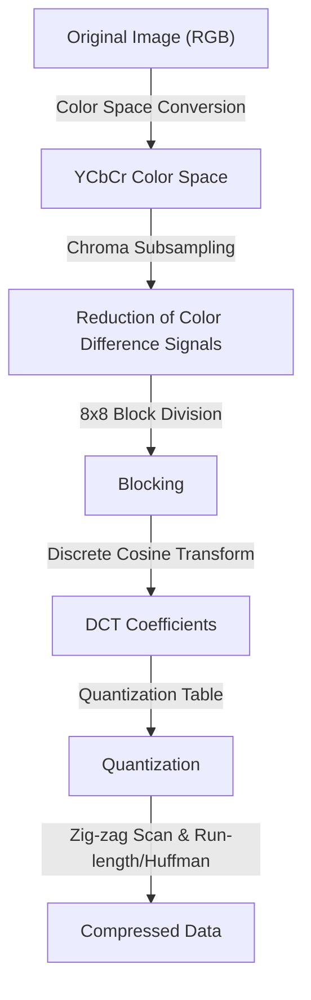
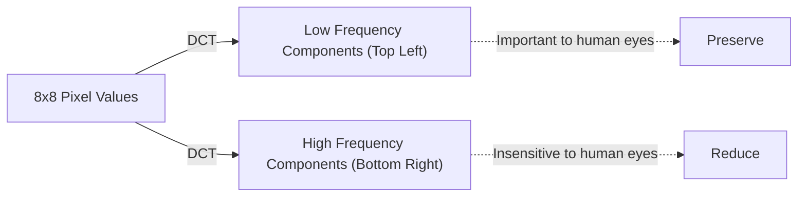

## Introduction: The World of Data and the Aesthetics of 'Discarding'

In the digital world, "data" is often too heavy. Image data in particular has three values for RGB (Red, Green, Blue) per pixel, and when it comes to images with millions of pixels, the amount of data quickly becomes enormous. In the late 1980s and 1990s, as the spread of the Internet and digital cameras became a reality, researchers hit a major wall. The problem was "how to keep images small while looking beautiful."

This is where the Joint Photographic Experts Group, or **JPEG** standard, came in. The essence of JPEG lies in its clever use of the "limits of human vision" behind the word "compression." What can be thrown away from a photograph without humans noticing? JPEG was a perfect answer to this question. In this article, we will delve into the history of image compression, from the birth of the JPEG standard, color space conversion, the mathematical foundation of Discrete Cosine Transform (DCT), the Huffman coding process, the mechanism of block noise generation, to modern WebP and AVIF.

## The Birth of the JPEG Standard: A 1992 Breakthrough

In 1986, ISO and CCITT (now ITU-T) jointly set up a standardization group for still image compression. This was the beginning of the "Joint Photographic Experts Group." At that time, computer processing power, storage capacity, and communication line speeds were incredibly poor compared to today. It was not realistic to handle megabytes of images as they were, and there was an urgent need to standardize lossy compression (a method that achieves extremely high compression rates by discarding some of the original data).

After several years of discussion and technical evaluation, the JPEG standard was officially approved in 1992. JPEG is not a single algorithm, but refers to a framework of a series of compression techniques. Among them, the most popular baseline JPEG has a highly sophisticated pipeline that centers on the Discrete Cosine Transform (DCT), combined with quantization tailored to human visual characteristics, and entropy coding via Huffman coding.

Each step in this pipeline reveals a wonderful fusion of mathematics and physiology. Let's look at them step by step.

## Color Space Conversion: YCbCr and Human Visual Characteristics

Images on a computer are usually represented by the three primary colors of R (Red), G (Green), and B (Blue). However, the human eye is far more sensitive to changes in brightness (luminance) than to changes in color (hue and saturation). In other words, leaving it as RGB mixes "information that humans hardly notice" and "information that is easily noticed," making it impossible to thin out data efficiently.

Therefore, JPEG converts the RGB color space into the **YCbCr color space**.

- **Y (Luminance)**: Brightness information. Equivalent to a monochrome image.
- **Cb (Blue Color Difference)**: The blue component minus the luminance.
- **Cr (Red Color Difference)**: The red component minus the luminance.

Taking advantage of the human eye's sensitivity to luminance, JPEG takes an approach (chroma subsampling) where it preserves the "Y" component as much as possible and thins out the "Cb" and "Cr" components. For example, in a format called "4:2:0", color difference information is reduced to half the resolution vertically and horizontally (one quarter in terms of data amount). This succeeds in significantly reducing the amount of data with almost no degradation in image quality visible to the human eye. This is the first step in "discarding what humans do not notice."

## Discrete Cosine Transform (DCT): Decomposing Images into Frequencies

After converting the color space and dividing the image data into blocks (usually 8x8 pixels), it is subjected to the next core process: **Discrete Cosine Transform (DCT)**.

DCT is a mathematical operation that converts the "spatial" arrangement of pixels in an image into "frequency" components. An 8x8 pixel block has 64 luminance values, but when DCT is applied, it decomposes this into 64 frequency components (coefficients) ranging from "overall brightness (direct current component, DC)" to "fine patterns and edges (alternating current component, AC)."

Why convert to frequencies? This is because the human eye is sensitive to "gentle gradients (low frequencies)", but insensitive to the accurate reproduction of "very fine noise or complex patterns (high frequencies)". DCT itself is a reversible mathematical operation and does not lose any information, but it is an essential preprocessing step to highlight "what to throw away."

## Quantization Table: The 'Division' that Rules Aesthetics

For the 64 coefficients obtained by DCT, the process of "discarding" data is finally performed. That is **Quantization**.

Quantization is a simple operation of dividing the DCT coefficients by an 8x8 constant matrix called a "quantization table" and truncating (rounding off) the decimals. The quantization table is designed to place small numbers for low frequency components (top left) and large numbers for high frequency components (bottom right).

What happens when you divide by a large number and truncate? Most of the high frequency components become "0". In other words, fine detail information is lost. The generation of a lot of these "0"s is the key to dramatically improving later compression efficiency.

By adjusting the degree of quantization (the size of the table values), the balance between the "Quality" and "File Size" of a JPEG image is determined. Lowering the Q value divides by larger numbers, so many coefficients become 0 and the compression rate increases, but details are lost.

## Block Noise: Side Effects of Unreasonable Compression

If quantization is strengthened too much, famous artifacts (noise) occur. Typical ones are **Block Noise** and **Mosquito Noise**.

Since JPEG processes in units of 8x8 pixel blocks, when information is lost due to quantization, the continuity of color and brightness between adjacent blocks cannot be maintained, and boundaries become clearly visible. This is block noise. Furthermore, around sudden changes (clusters of high frequency components) such as text or edges, forcibly cutting out high frequency components results in ripple-like noise (mosquito noise).

These noises can be said to visually demonstrate the limitations of the JPEG algorithm and the side effects of mathematical transformation.

## Huffman Coding and Entropy Compression: Packing Without Waste

Once quantization is complete, the 8x8 block has a few meaningful values in the top left, and the remaining bottom right part is lined up with a large amount of "0"s. To efficiently convert this into data, a method called **Zig-zag Scan** is used to rearrange the coefficients in a line from top left to bottom right. This causes zeros to appear consecutively.

After that, **Run-length Encoding** summarizes "how many zeros are consecutive," and finally **Huffman Coding** is applied. Huffman coding is a method of assigning short bit strings to frequently appearing patterns and long bit strings to rarely appearing patterns. At this point, the ".jpg" file we handle is finally created.

## Genealogy to Next-Generation Formats: WebP, AVIF, JPEG XL

Over 30 years have passed since the birth of JPEG, and images and videos now account for the majority of Internet traffic. Although JPEG still reigns supreme, various next-generation formats have emerged to meet modern demands (higher quality, lower capacity, alpha channel support, etc.).

### WebP

Developed by Google, WebP applies the technology of the video compression standard "VP8" to still images. Using a more advanced prediction model than JPEG, it reduces the file size by 20-30% compared to JPEG while also supporting transparency (alpha channel) and animation.

### AVIF (AV1 Image File Format)

AVIF diverts the next-generation open video compression codec "AV1" to still images. Boasting higher compression efficiency than WebP, it is perfectly adapted to modern display technologies such as HDR (High Dynamic Range). While having the same block-based processing as JPEG, it achieves an overwhelming compression rate by using abundant computational resources, such as variable block sizes and advanced prediction algorithms.

### JPEG XL

Designed as a successor to JPEG, it has the unique feature of being able to recompress existing JPEG files without degradation. It has a good balance between image quality and size, and its support is gradually expanding.

## Conclusion: The Art of Subtraction

Unraveling the history and technology of JPEG reveals that it is not just a history of "data compression" but a history of "hacking human senses." When we look at an image, we are not looking at all pixels equally. JPEG used mathematics and physiology to accurately cut off "what we are not looking at."

As digital technology evolves, new formats appear one after another, but the basic philosophy established by JPEG, "deceiving the human eye," is still continuously inherited in today's animation and video compression. The next time you see a beautiful photo on your smartphone screen, take a moment to think about the millions of "discarded pieces of information" behind it and the beautiful mathematical formulas that made it possible.
