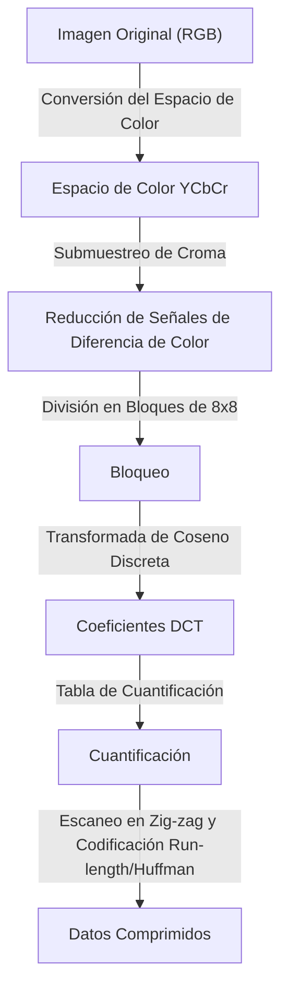
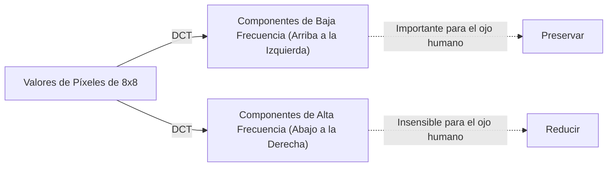

## Introducción: El mundo de los datos y la estética de 'descartar'

En el mundo digital, los "datos" suelen ser demasiado pesados. Los datos de imagen en particular tienen tres valores para RGB (Rojo, Verde, Azul) por píxel, y cuando se trata de imágenes con millones de píxeles, la cantidad de datos se vuelve rápidamente enorme. A finales de la década de 1980 y en la de 1990, a medida que la expansión de Internet y las cámaras digitales se convirtió en una realidad, los investigadores se toparon con un gran obstáculo. El problema era "cómo mantener las imágenes pequeñas mientras se ven hermosas".

Aquí es donde entró en juego el Joint Photographic Experts Group, o el estándar **JPEG**. La esencia de JPEG radica en su inteligente uso de los "límites de la visión humana" detrás de la palabra "compresión". ¿Qué se puede tirar de una fotografía sin que los humanos se den cuenta? JPEG fue una respuesta perfecta a esta pregunta. En este artículo, profundizaremos en la historia de la compresión de imágenes, desde el nacimiento del estándar JPEG, la conversión del espacio de color, la base matemática de la Transformada de Coseno Discreta (DCT), el proceso de codificación Huffman, el mecanismo de generación de ruido de bloque, hasta los modernos WebP y AVIF.

## El nacimiento del estándar JPEG: Un gran avance en 1992

En 1986, ISO y CCITT (ahora ITU-T) crearon conjuntamente un grupo de estandarización para la compresión de imágenes fijas. Este fue el comienzo del "Joint Photographic Experts Group". En ese momento, la potencia de procesamiento de las computadoras, la capacidad de almacenamiento y las velocidades de las líneas de comunicación eran increíblemente deficientes en comparación con la actualidad. No era realista manejar megabytes de imágenes tal como estaban, y había una necesidad urgente de estandarizar la compresión con pérdida (un método que logra tasas de compresión extremadamente altas descartando parte de los datos originales).

Después de varios años de discusión y evaluación técnica, el estándar JPEG fue aprobado oficialmente en 1992. JPEG no es un solo algoritmo, sino que se refiere a un marco de una serie de técnicas de compresión. Entre ellas, el JPEG de línea base más popular tiene un conducto altamente sofisticado que se centra en la Transformada de Coseno Discreta (DCT), combinada con una cuantificación adaptada a las características visuales humanas y codificación de entropía mediante la codificación Huffman.

Cada paso en este proceso revela una maravillosa fusión de matemáticas y fisiología. Veámoslos paso a paso.

## Conversión del espacio de color: YCbCr y características visuales humanas

Las imágenes en una computadora generalmente están representadas por los tres colores primarios R (Rojo), G (Verde) y B (Azul). Sin embargo, el ojo humano es mucho más sensible a los cambios de brillo (luminancia) que a los cambios de color (tono y saturación). En otras palabras, dejarlo como RGB mezcla "información que los humanos casi no notan" e "información que se nota fácilmente", lo que hace imposible reducir los datos de manera eficiente.

Por lo tanto, JPEG convierte el espacio de color RGB al **espacio de color YCbCr**.

- **Y (Luminancia)**: Información de brillo. Equivalente a una imagen monocroma.
- **Cb (Diferencia de Color Azul)**: El componente azul menos la luminancia.
- **Cr (Diferencia de Color Rojo)**: El componente rojo menos la luminancia.

Aprovechando la sensibilidad del ojo humano a la luminancia, JPEG adopta un enfoque (submuestreo de croma) en el que conserva el componente "Y" tanto como sea posible y reduce los componentes "Cb" y "Cr". Por ejemplo, en un formato llamado "4:2:0", la información de diferencia de color se reduce a la mitad de la resolución vertical y horizontalmente (una cuarta parte en términos de cantidad de datos). Esto logra reducir significativamente la cantidad de datos sin casi ninguna degradación en la calidad de la imagen visible para el ojo humano. Este es el primer paso en "descartar lo que los humanos no notan".

## Transformada de coseno discreta (DCT): Descomponiendo imágenes en frecuencias

Después de convertir el espacio de color y dividir los datos de la imagen en bloques (generalmente de 8x8 píxeles), se somete al siguiente proceso central: **Transformada de Coseno Discreta (DCT)**.

DCT es una operación matemática que convierte la disposición "espacial" de los píxeles en una imagen en componentes de "frecuencia". Un bloque de píxeles de 8x8 tiene 64 valores de luminancia, pero cuando se aplica DCT, descompone esto en 64 componentes de frecuencia (coeficientes) que van desde el "brillo general (componente de corriente continua, DC)" hasta los "patrones finos y bordes (componente de corriente alterna, AC)".

¿Por qué convertir a frecuencias? Esto se debe a que el ojo humano es sensible a "gradientes suaves (bajas frecuencias)", pero insensible a la reproducción precisa de "ruido muy fino o patrones complejos (altas frecuencias)". DCT en sí es una operación matemática reversible y no pierde ninguna información, pero es un paso de preprocesamiento esencial para resaltar "qué tirar".

## Tabla de cuantificación: La 'división' que rige la estética

Para los 64 coeficientes obtenidos por DCT, finalmente se realiza el proceso de "descartar" datos. Eso es la **Cuantificación**.

La cuantificación es una operación simple de dividir los coeficientes DCT por una matriz constante de 8x8 llamada "tabla de cuantificación" y truncar (redondear) los decimales. La tabla de cuantificación está diseñada para colocar números pequeños para los componentes de baja frecuencia (arriba a la izquierda) y números grandes para los componentes de alta frecuencia (abajo a la derecha).

¿Qué sucede cuando se divide por un número grande y se trunca? La mayoría de los componentes de alta frecuencia se convierten en "0". En otras palabras, se pierde información de detalles finos. La generación de muchos de estos "0"s es la clave para mejorar drásticamente la eficiencia de compresión posterior.

Al ajustar el grado de cuantificación (el tamaño de los valores de la tabla), se determina el equilibrio entre la "Calidad" y el "Tamaño de archivo" de una imagen JPEG. Disminuir el valor Q divide por números más grandes, por lo que muchos coeficientes se convierten en 0 y la tasa de compresión aumenta, pero se pierden detalles.

## Ruido de bloque: Efectos secundarios de una compresión irracional

Si la cuantificación se fortalece demasiado, se producen famosos artefactos (ruido). Los típicos son el **Ruido de Bloque** y el **Ruido de Mosquito**.

Dado que JPEG procesa en unidades de bloques de 8x8 píxeles, cuando se pierde información debido a la cuantificación, la continuidad del color y el brillo entre bloques adyacentes no se puede mantener, y los límites se vuelven claramente visibles. Esto es el ruido de bloque. Además, alrededor de cambios repentinos (grupos de componentes de alta frecuencia) como texto o bordes, cortar a la fuerza los componentes de alta frecuencia da como resultado un ruido similar a una ondulación (ruido de mosquito).

Se puede decir que estos ruidos demuestran visualmente las limitaciones del algoritmo JPEG y los efectos secundarios de la transformación matemática.

## Codificación Huffman y compresión de entropía: Empaque sin desperdicio

Una vez que se completa la cuantificación, el bloque de 8x8 tiene unos pocos valores significativos en la parte superior izquierda, y la parte inferior derecha restante está alineada con una gran cantidad de "0"s. Para convertir esto de manera eficiente en datos, se utiliza un método llamado **Escaneo en Zig-zag** para reorganizar los coeficientes en una línea de arriba a la izquierda a abajo a la derecha. Esto hace que los ceros aparezcan consecutivamente.

Después de eso, la **Codificación Run-length** resume "cuántos ceros son consecutivos" y finalmente se aplica la **Codificación Huffman**. La codificación Huffman es un método de asignar cadenas de bits cortas a patrones que aparecen con frecuencia y cadenas de bits largas a patrones que aparecen raramente. En este punto, el archivo ".jpg" que manejamos finalmente se crea.

## Genealogía hacia formatos de próxima generación: WebP, AVIF, JPEG XL

Han pasado más de 30 años desde el nacimiento de JPEG, y las imágenes y los videos ahora representan la mayor parte del tráfico de Internet. Aunque JPEG sigue reinando, han surgido varios formatos de próxima generación para satisfacer las demandas modernas (mayor calidad, menor capacidad, soporte de canal alfa, etc.).

### WebP

Desarrollado por Google, WebP aplica la tecnología del estándar de compresión de video "VP8" a las imágenes fijas. Utilizando un modelo de predicción más avanzado que JPEG, reduce el tamaño del archivo en un 20-30% en comparación con JPEG, al mismo tiempo que admite transparencia (canal alfa) y animación.

### AVIF (AV1 Image File Format)

AVIF desvía el códec de compresión de video abierto de próxima generación "AV1" a las imágenes fijas. Con una mayor eficiencia de compresión que WebP, está perfectamente adaptado a las tecnologías de visualización modernas como HDR (Alto Rango Dinámico). Aunque tiene el mismo procesamiento basado en bloques que JPEG, logra una tasa de compresión abrumadora al utilizar abundantes recursos computacionales, como tamaños de bloque variables y algoritmos de predicción avanzados.

### JPEG XL

Diseñado como el sucesor de JPEG, tiene la característica única de poder recomprimir archivos JPEG existentes sin degradación. Tiene un buen equilibrio entre la calidad de la imagen y el tamaño, y su soporte se está expandiendo gradualmente.

## Conclusión: El arte de la resta

Desentrañar la historia y la tecnología de JPEG revela que no es solo una historia de "compresión de datos" sino una historia de "hackear los sentidos humanos". Cuando miramos una imagen, no estamos mirando todos los píxeles por igual. JPEG utilizó las matemáticas y la fisiología para cortar con precisión "lo que no estamos mirando".

A medida que evoluciona la tecnología digital, aparecen nuevos formatos uno tras otro, pero la filosofía básica establecida por JPEG, "engañar al ojo humano", se hereda continuamente en la animación y la compresión de video de hoy. La próxima vez que vea una hermosa foto en la pantalla de su teléfono inteligente, tómese un momento para pensar en los millones de "piezas de información descartadas" detrás de ella y las hermosas fórmulas matemáticas que lo hicieron posible.
