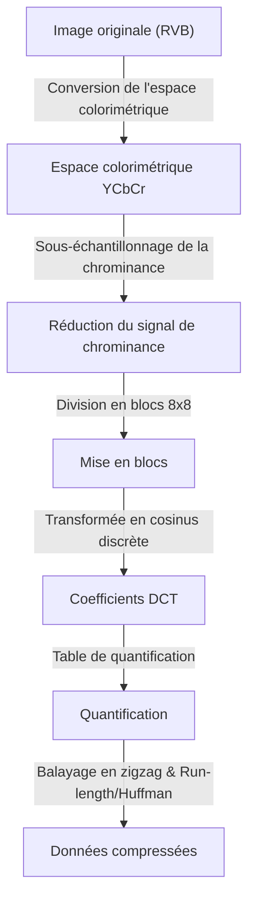
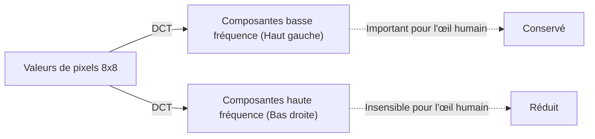

## Introduction : Le monde des données et l'esthétique du « rejet »

Dans le monde numérique, les « données » sont souvent trop lourdes. Les données d'image, en particulier, ont trois valeurs pour chaque pixel : RVB (rouge, vert, bleu). Lorsqu'il s'agit d'une image de plusieurs millions de pixels, la quantité de données devient rapidement énorme. De la fin des années 1980 aux années 1990, alors que la diffusion d'Internet et des appareils photo numériques devenait une réalité, les chercheurs se sont heurtés à un obstacle majeur. Le problème était : « Comment garder les images petites tout en les rendant belles ? »

C'est là qu'est intervenu le Joint Photographic Experts Group, ou la norme **JPEG**. L'essence du JPEG réside dans son utilisation astucieuse des « limites de la vision humaine » derrière le mot « compression ». Que pouvez-vous rejeter d'une photo sans que les humains ne s'en aperçoivent ? Le JPEG était une réponse parfaite à cette question. Dans cet article, nous explorerons l'histoire de la compression d'image depuis la naissance de la norme JPEG jusqu'à la conversion de l'espace colorimétrique, les fondements mathématiques de la transformée en cosinus discrète (DCT), le processus de codage de Huffman, le mécanisme du bruit de bloc et les formats modernes WebP et AVIF.

## Naissance de la norme JPEG : La percée de 1992

En 1986, l'ISO et le CCITT (actuellement ITU-T) ont conjointement lancé un groupe de standardisation pour la compression d'images fixes. Ce fut le début du « Joint Photographic Experts Group ». À l'époque, la puissance de traitement, la capacité de stockage et la vitesse de communication des ordinateurs étaient médiocres par rapport à aujourd'hui. Traiter des images de plusieurs mégaoctets telles quelles n'était pas réaliste, et la standardisation de la compression avec perte (une méthode pour atteindre des taux de compression extrêmement élevés en rejetant une partie des données d'origine) était une question urgente.

Après plusieurs années de discussions et d'évaluations techniques, la norme JPEG a été officiellement approuvée en 1992. Le JPEG n'est pas un algorithme unique, mais un ensemble de méthodes de compression. Parmi eux, le JPEG de base le plus populaire possède un pipeline très sophistiqué qui combine la transformée en cosinus discrète (DCT) en son cœur, une quantification adaptée aux caractéristiques visuelles humaines, et un codage entropique par codage de Huffman.

Il y a une merveilleuse fusion des mathématiques et de la physiologie à chaque étape de ce pipeline. Regardons-les un par un.

## Conversion de l'espace colorimétrique : YCbCr et les caractéristiques visuelles humaines

Sur un ordinateur, une image est généralement représentée par les trois couleurs primaires R (rouge), V (vert) et B (bleu). Cependant, l'œil humain est beaucoup plus sensible aux changements de luminosité (luminance) qu'aux changements de couleur (teinte ou saturation). En d'autres termes, si le RVB est laissé tel quel, les « informations que les humains ont du mal à remarquer » et les « informations faciles à remarquer » sont mélangées, et les données ne peuvent pas être efficacement réduites.

Par conséquent, le JPEG convertit l'espace colorimétrique RVB en **espace colorimétrique YCbCr**.

- **Y (Luminance)** : Informations sur la luminosité. Équivalent à une image monochrome.
- **Cb (Différence de bleu)** : Composante bleue moins la luminance.
- **Cr (Différence de rouge)** : Composante rouge moins la luminance.

Tirant parti du fait que l'œil humain est sensible à la luminance, le JPEG maintient autant que possible la composante « Y » et réduit (sous-échantillonne la chrominance) les composantes « Cb » et « Cr ». Par exemple, dans un format appelé « 4:2:0 », les informations de différence de couleur sont réduites à la moitié de la résolution verticale et horizontale (un quart de la quantité de données). En conséquence, ils ont réussi à réduire considérablement la quantité de données sans que l'œil humain ne perçoive presque aucune détérioration de la qualité de l'image. C'est la première étape vers « jeter ce que les humains ne remarquent pas ».

## Transformée en cosinus discrète (DCT) : Décomposition des images en fréquences

Les données d'image qui ont été converties en espace colorimétrique et divisées en blocs (généralement des pixels 8x8) sont soumises au processus de base suivant, la **Transformée en cosinus discrète (DCT)**.

La DCT est une opération mathématique qui convertit un agencement « spatial » de pixels appelé image en composantes de « fréquence ». Un bloc de 8x8 pixels a 64 valeurs de luminance, mais lorsque la DCT est appliquée, celles-ci sont décomposées en 64 composantes de fréquence (coefficients) allant de « luminosité globale (composante continue, DC) » à « motifs fins et contours (composante haute fréquence, AC) ».

Pourquoi le convertir en fréquence ? C'est parce que l'œil humain est sensible aux « dégradés doux (basses fréquences) », mais insensible à la reproduction précise de « bruits très fins et motifs complexes (hautes fréquences) ». La DCT elle-même est une opération mathématique réversible et ne perd aucune information, mais c'est un prétraitement essentiel pour mettre en évidence « où jeter ».

## Table de quantification : La « division » qui régit l'esthétique

Pour les 64 coefficients obtenus par DCT, le processus de « rejet » des données est enfin effectué. C'est la **Quantification**.

La quantification est une simple opération consistant à diviser les coefficients DCT par une matrice de constantes 8x8 appelée « table de quantification » et à arrondir à l'entier le plus proche (ou tronquer). La table de quantification est conçue pour placer de petites valeurs dans les composantes de basse fréquence (en haut à gauche) et de grandes valeurs dans les composantes de haute fréquence (en bas à droite).

Que se passe-t-il si vous divisez par un grand nombre et que vous arrondissez vers le bas ? La plupart des composantes à haute fréquence deviennent « 0 ». En d'autres termes, les informations de détails fins sont perdues. La génération de nombreux de ces « 0 » est la clé pour améliorer considérablement l'efficacité de la compression par la suite.

En ajustant le degré de quantification (la taille des valeurs du tableau), l'équilibre entre la « qualité » de l'image JPEG et la « taille du fichier » est déterminé. Si la valeur Q est abaissée, elle est divisée par un nombre plus grand, de sorte que de nombreux coefficients deviennent 0 et que le taux de compression augmente, mais les détails sont perdus.

## Bruit de bloc : Effets secondaires d'une compression déraisonnable

Si la quantification est trop forte, des artefacts (bruits) célèbres se produisent. Des exemples typiques sont le **Bruit de bloc** et le **Bruit de moustique**.

Parce que le JPEG traite par blocs de pixels 8x8, si des informations sont perdues en raison de la quantification, la continuité de la couleur et de la luminosité entre les blocs adjacents ne peut pas être maintenue, et les lignes de démarcation deviennent clairement visibles. C'est le bruit de bloc. De plus, autour de changements brusques (des masses de composantes à haute fréquence) telles que des lettres ou des bords, un bruit de type ondulation (bruit de moustique) se produit à la suite d'une réduction déraisonnable des composantes à haute fréquence.

On peut dire que ces bruits démontrent visuellement les limites de l'algorithme JPEG et les effets secondaires des transformations mathématiques.

## Codage de Huffman et compression entropique : Un emballage sans gaspillage

Une fois la quantification terminée, il y a quelques valeurs significatives en haut à gauche du bloc 8x8, et la partie restante en bas à droite est alignée avec une grande quantité de « 0 ». Afin de transformer cela efficacement en données, les coefficients sont réarrangés en ligne du haut à gauche vers le bas à droite en utilisant une méthode appelée **Balayage en zigzag**. Cela provoque l'apparition de zéros de suite.

Après cela, le « nombre de 0 consécutifs » est résumé par **Codage par plages (Run-length Encoding)**, et enfin le **Codage de Huffman** est appliqué. Le codage de Huffman est une méthode qui attribue de courtes chaînes de bits aux motifs qui apparaissent fréquemment et de longues chaînes de bits aux motifs qui apparaissent rarement. C'est à ce stade que le fichier « .jpg » que nous manipulons est enfin achevé.

## Généalogie vers les formats de nouvelle génération : WebP, AVIF, JPEG XL

Plus de 30 ans se sont écoulés depuis la naissance du JPEG, et les images et les vidéos représentent désormais la majorité du trafic Internet. Bien que le JPEG règne toujours en maître absolu, divers formats de nouvelle génération ont vu le jour pour répondre aux exigences modernes (qualité supérieure et capacité inférieure, prise en charge des canaux alpha, etc.).

### WebP

Développé par Google, WebP applique la technologie de la norme de compression vidéo « VP8 » aux images fixes. Il utilise un modèle de prédiction plus avancé que le JPEG, réduisant la taille du fichier de 20 à 30 % par rapport au JPEG tout en prenant en charge la transparence (canal alpha) et l'animation.

### AVIF (AV1 Image File Format)

AVIF applique « AV1 », un codec de compression vidéo ouvert de nouvelle génération, aux images fixes. Il se vante d'une efficacité de compression supérieure à celle du WebP et est parfaitement adapté aux technologies d'affichage modernes telles que le HDR (High Dynamic Range). Tout en ayant le même traitement par blocs que le JPEG, il réalise un taux de compression écrasant en utilisant abondamment les ressources de calcul telles que la taille de bloc variable et des algorithmes de prédiction avancés.

### JPEG XL

Conçu comme le successeur du JPEG, il a la particularité unique de pouvoir recompresser les fichiers JPEG existants sans dégradation. Il a un bon équilibre entre la qualité de l'image et la taille, et sa prise en charge s'étend progressivement.

## Conclusion : L'art de la soustraction

Lorsque l'on démêle l'histoire et la technologie du JPEG, on se rend compte que ce n'est pas seulement l'histoire de la « compression de données », mais l'histoire du « piratage des sens humains ». Lorsque nous regardons une image, nous ne regardons pas tous les pixels de la même manière. Le JPEG a utilisé les mathématiques et la physiologie pour couper avec précision « ce que nous ne regardons pas ».

Avec l'évolution de la technologie numérique, de nouveaux formats apparaissent les uns après les autres, mais la philosophie de base établie par le JPEG, qui est de « tromper l'œil humain », a été transmise aux compressions d'animation et de vidéo d'aujourd'hui. La prochaine fois que vous regarderez une belle photo sur l'écran de votre smartphone, pensez un peu aux millions d'« informations rejetées » et aux belles formules mathématiques qui l'ont rendu possible derrière elle.
