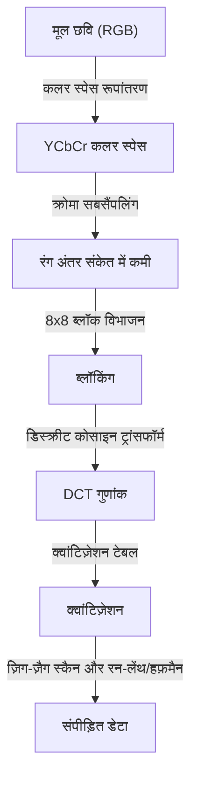
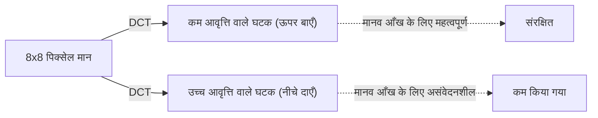

## प्रस्तावना: डेटा की दुनिया और "हटाने" का सौंदर्य

डिजिटल दुनिया में, "डेटा" अक्सर बहुत भारी होता है। विशेष रूप से छवि डेटा में प्रत्येक पिक्सेल के लिए RGB (लाल, हरा, नीला) के तीन मान होते हैं, और यदि छवि में लाखों पिक्सेल हैं, तो डेटा की मात्रा बहुत बड़ी हो जाती है। 1980 के दशक के अंत से 1990 के दशक तक, जब इंटरनेट और डिजिटल कैमरों का प्रसार एक वास्तविकता बनने लगा, शोधकर्ताओं को एक बड़ी बाधा का सामना करना पड़ा। समस्या यह थी कि "छवियों को छोटा कैसे रखा जाए और साथ ही उन्हें सुंदर कैसे दिखाया जाए?"

यहीं पर जॉइंट फोटोग्राफिक एक्सपर्ट्स ग्रुप, यानी **JPEG** मानक सामने आया। JPEG का सार "संपीड़न" शब्द के पीछे "मानव दृष्टि की सीमाओं" के चतुर उपयोग में निहित है। किसी तस्वीर से क्या हटाया जा सकता है ताकि मनुष्य इसे नोटिस न कर सके? JPEG इस प्रश्न का एक आदर्श उत्तर था। इस लेख में, हम JPEG मानक के जन्म से लेकर रंग स्थान रूपांतरण, डिस्क्रीट कोसाइन ट्रांसफॉर्म (DCT) के गणितीय आधार, हफ़मैन कोडिंग प्रक्रिया, ब्लॉक शोर के तंत्र और आधुनिक WebP और AVIF तक छवि संपीड़न के इतिहास का गहराई से पता लगाएंगे।

## JPEG मानक का जन्म: 1992 की सफलता

1986 में, ISO और CCITT (अब ITU-T) ने संयुक्त रूप से स्थिर छवि संपीड़न के लिए एक मानकीकरण समूह शुरू किया। यह "जॉइंट फोटोग्राफिक एक्सपर्ट्स ग्रुप" की शुरुआत थी। उस समय, कंप्यूटर की प्रसंस्करण शक्ति, भंडारण क्षमता और संचार गति आज की तुलना में बहुत खराब थी। कई मेगाबाइट की छवियों को ज्यों का त्यों संसाधित करना अवास्तविक था, और हानिपूर्ण संपीड़न (मूल डेटा के एक हिस्से को हटाकर अत्यधिक उच्च संपीड़न दर प्राप्त करने की एक विधि) का मानकीकरण एक तत्काल मुद्दा था।

कई वर्षों की चर्चाओं और तकनीकी मूल्यांकनों के बाद, 1992 में JPEG मानक को आधिकारिक तौर पर मंजूरी दी गई थी। JPEG कोई एक एल्गोरिथम नहीं है, बल्कि संपीड़न विधियों के एक ढांचे को संदर्भित करता है। उनमें से, सबसे लोकप्रिय बेसलाइन JPEG में एक बहुत ही परिष्कृत पाइपलाइन है जो अपने मूल में डिस्क्रीट कोसाइन ट्रांसफॉर्म (DCT), मानव दृश्य विशेषताओं के अनुरूप क्वांटिज़ेशन, और हफ़मैन कोडिंग का उपयोग करके एन्ट्रॉपी कोडिंग को जोड़ती है।

इस पाइपलाइन के प्रत्येक चरण में गणित और शरीर विज्ञान का अद्भुत संगम है। आइए उन्हें एक-एक करके देखें।

## रंग स्थान रूपांतरण: YCbCr और मानव दृश्य विशेषताएं

कंप्यूटर पर, एक छवि को आमतौर पर तीन प्राथमिक रंगों R (लाल), G (हरा), और B (नीला) में दर्शाया जाता है। हालाँकि, मानव आँख रंग (रंग या संतृप्ति) में परिवर्तन की तुलना में चमक (ल्युमिनेंस) में परिवर्तन के प्रति बहुत अधिक संवेदनशील है। दूसरे शब्दों में, यदि RGB को वैसा ही छोड़ दिया जाता है, तो "वह जानकारी जिसे मनुष्य नोटिस नहीं कर पाते" और "वह जानकारी जो आसानी से देखी जा सकती है" आपस में मिल जाती है, और डेटा को प्रभावी ढंग से कम नहीं किया जा सकता है।

इसलिए, JPEG RGB कलर स्पेस को **YCbCr कलर स्पेस** में बदल देता है।

- **Y (ल्युमिनेंस)**: चमक की जानकारी। यह मोनोक्रोम छवि के बराबर है।
- **Cb (नीला अंतर)**: नीले घटक में से ल्युमिनेंस को घटाया गया।
- **Cr (लाल अंतर)**: लाल घटक में से ल्युमिनेंस को घटाया गया।

मानव आँख की चमक के प्रति संवेदनशीलता का लाभ उठाते हुए, JPEG "Y" घटक को जितना संभव हो उतना बनाए रखता है और "Cb" और "Cr" घटकों को कम (क्रोमा सबसैंपलिंग) करता है। उदाहरण के लिए, "4:2:0" नामक प्रारूप में, रंग अंतर जानकारी लंबवत और क्षैतिज रिज़ॉल्यूशन के आधे (डेटा की मात्रा का एक चौथाई) तक कम हो जाती है। परिणामस्वरूप, वे मानव आँख को छवि गुणवत्ता में लगभग कोई गिरावट दिखाए बिना डेटा की मात्रा को काफी कम करने में सफल रहे। "मनुष्य जिस पर ध्यान नहीं देते उसे हटाना" पहला कदम है।

## डिस्क्रीट कोसाइन ट्रांसफॉर्म (DCT): छवियों को आवृत्तियों में तोड़ना

इमेज डेटा जिसे कलर स्पेस में परिवर्तित कर दिया गया है और ब्लॉक (आमतौर पर 8x8 पिक्सल) में विभाजित कर दिया गया है, उसे अगली मुख्य प्रक्रिया, **डिस्क्रीट कोसाइन ट्रांसफॉर्म (DCT)** के अधीन किया जाता है।

DCT एक गणितीय प्रक्रिया है जो छवि नामक पिक्सेल की "स्थानिक" व्यवस्था को "आवृत्ति" घटकों में परिवर्तित करती है। एक 8x8 पिक्सेल ब्लॉक में 64 ल्युमिनेंस मान होते हैं, लेकिन जब DCT लागू किया जाता है, तो ये "समग्र चमक (प्रत्यक्ष घटक, DC)" से लेकर "बारीक पैटर्न और किनारों (उच्च आवृत्ति घटक, AC)" तक 64 आवृत्ति घटकों (गुणांक) में टूट जाते हैं।

इसे आवृत्ति में क्यों परिवर्तित करें? ऐसा इसलिए है क्योंकि मानव आँख "सुचारू ग्रेडिएंट (कम आवृत्तियों)" के प्रति संवेदनशील है, लेकिन "बहुत महीन शोर और जटिल पैटर्न (उच्च आवृत्तियों)" के सटीक पुनरुत्पादन के प्रति असंवेदनशील है। DCT अपने आप में एक प्रतिवर्ती गणितीय प्रक्रिया है और यह कोई जानकारी नहीं खोता है, लेकिन यह "किसे हटाना है" को उजागर करने के लिए एक आवश्यक पूर्व-प्रसंस्करण है।

## क्वांटिज़ेशन टेबल: वह "विभाजन" जो सौंदर्यशास्त्र को नियंत्रित करता है

DCT द्वारा प्राप्त 64 गुणांकों के लिए, अंततः डेटा को "हटाने" की प्रक्रिया की जाती है। यही **क्वांटिज़ेशन** है।

क्वांटिज़ेशन एक सरल प्रक्रिया है जिसमें DCT गुणांकों को 8x8 स्थिरांक मैट्रिक्स द्वारा विभाजित किया जाता है जिसे "क्वांटिज़ेशन टेबल" कहा जाता है और निकटतम पूर्णांक तक पूर्णांकित (या छोटा) किया जाता है। क्वांटिज़ेशन टेबल को कम आवृत्ति घटकों (ऊपर बाएँ) में छोटे मान और उच्च आवृत्ति घटकों (नीचे दाएँ) में बड़े मान रखने के लिए डिज़ाइन किया गया है।

यदि आप एक बड़ी संख्या से विभाजित करते हैं और नीचे की ओर पूर्णांकित करते हैं तो क्या होगा? अधिकांश उच्च आवृत्ति घटक "0" हो जाते हैं। दूसरे शब्दों में, बारीक विवरण की जानकारी खो जाती है। इनमें से कई "0" उत्पन्न करना बाद में संपीड़न दक्षता में भारी सुधार करने की कुंजी है।

क्वांटिज़ेशन की डिग्री (तालिका के मानों का आकार) को समायोजित करके, JPEG छवि की "गुणवत्ता" और "फ़ाइल आकार" के बीच संतुलन निर्धारित किया जाता है। यदि Q मान कम किया जाता है, तो इसे एक बड़ी संख्या से विभाजित किया जाता है, इसलिए कई गुणांक 0 हो जाते हैं और संपीड़न दर बढ़ जाती है, लेकिन विवरण खो जाते हैं।

## ब्लॉक शोर: अनुचित संपीड़न के दुष्प्रभाव

यदि क्वांटिज़ेशन बहुत मजबूत है, तो प्रसिद्ध कलाकृतियाँ (शोर) उत्पन्न होती हैं। विशिष्ट उदाहरण **ब्लॉक शोर** और **मच्छर शोर** हैं।

चूँकि JPEG 8x8 पिक्सेल ब्लॉकों में संसाधित होता है, यदि क्वांटिज़ेशन के कारण जानकारी खो जाती है, तो आसन्न ब्लॉकों के बीच रंग और चमक की निरंतरता बनाए नहीं रखी जा सकती है, और सीमा रेखाएँ स्पष्ट रूप से दिखाई देने लगती हैं। यही ब्लॉक शोर है। इसके अलावा, अक्षरों या किनारों जैसे अचानक परिवर्तन (उच्च-आवृत्ति घटकों के द्रव्यमान) के आसपास, उच्च-आवृत्ति घटकों की अनुचित कमी के परिणामस्वरूप तरंग जैसा शोर (मच्छर शोर) होता है।

यह कहा जा सकता है कि ये शोर JPEG एल्गोरिथम की सीमाओं और गणितीय परिवर्तनों के दुष्प्रभावों को नेत्रहीन रूप से प्रदर्शित करते हैं।

## हफ़मैन कोडिंग और एन्ट्रॉपी संपीड़न: बिना किसी बर्बादी के पैकिंग

एक बार क्वांटिज़ेशन पूरा हो जाने पर, 8x8 ब्लॉक के ऊपरी बाएँ भाग में कुछ सार्थक मान होते हैं, और शेष निचले दाएँ भाग में भारी मात्रा में "0" पंक्तिबद्ध होते हैं। इसे कुशलतापूर्वक डेटा में बदलने के लिए, **ज़िग-ज़ैग स्कैन** नामक एक विधि का उपयोग करके गुणांकों को ऊपर बाईं ओर से नीचे दाईं ओर एक पंक्ति में पुनर्व्यवस्थित किया जाता है। इससे शून्य लगातार प्रकट होते हैं।

उसके बाद, "लगातार 0 की संख्या" को **रन-लेंथ कोडिंग** द्वारा संक्षेपित किया जाता है, और अंत में **हफ़मैन कोडिंग** लागू किया जाता है। हफ़मैन कोडिंग एक ऐसी विधि है जो अक्सर दिखाई देने वाले पैटर्न को छोटी बिट स्ट्रिंग और शायद ही कभी दिखाई देने वाले पैटर्न को लंबी बिट स्ट्रिंग निर्दिष्ट करती है। इसी स्तर पर वह ".jpg" फ़ाइल अंततः पूरी हो जाती है जिसे हम संभालते हैं।

## अगली पीढ़ी के प्रारूपों की वंशावली: WebP, AVIF, JPEG XL

JPEG के जन्म को 30 साल से अधिक समय बीत चुका है, और चित्र और वीडियो अब इंटरनेट ट्रैफ़िक का अधिकांश हिस्सा बनाते हैं। यद्यपि JPEG अभी भी सर्वोच्च शासन करता है, आधुनिक आवश्यकताओं (उच्च गुणवत्ता और कम क्षमता, अल्फा चैनल के लिए समर्थन, आदि) को पूरा करने के लिए विभिन्न अगली पीढ़ी के प्रारूप उभरे हैं।

### WebP

Google द्वारा विकसित, WebP स्थिर छवियों पर वीडियो संपीड़न मानक "VP8" की तकनीक को लागू करता है। यह JPEG की तुलना में अधिक उन्नत भविष्यवाणी मॉडल का उपयोग करता है, पारदर्शिता (अल्फा चैनल) और एनीमेशन का समर्थन करते हुए फ़ाइल आकार को JPEG की तुलना में 20 से 30% तक कम करता है।

### AVIF (AV1 छवि फ़ाइल स्वरूप)

AVIF "AV1" को स्थिर छवियों पर लागू करता है, जो अगली पीढ़ी का ओपन वीडियो संपीड़न कोडेक है। यह WebP की तुलना में अधिक संपीड़न दक्षता का दावा करता है और आधुनिक प्रदर्शन तकनीकों जैसे HDR (हाई डायनेमिक रेंज) के लिए पूरी तरह से अनुकूल है। JPEG के समान ब्लॉक-आधारित प्रसंस्करण होने के बावजूद, यह चर ब्लॉक आकार और उन्नत भविष्यवाणी एल्गोरिदम जैसे कम्प्यूटेशनल संसाधनों का प्रचुर मात्रा में उपयोग करके भारी संपीड़न दर प्राप्त करता है।

### JPEG XL

JPEG के उत्तराधिकारी के रूप में डिज़ाइन किया गया, इसमें मौजूदा JPEG फ़ाइलों को बिना किसी गिरावट के फिर से संपीड़ित करने में सक्षम होने की अनूठी विशेषता है। इसमें छवि गुणवत्ता और आकार का एक अच्छा संतुलन है, और इसका समर्थन धीरे-धीरे फैल रहा है।

## निष्कर्ष: घटाने की कला

जब हम JPEG के इतिहास और तकनीक को उजागर करते हैं, तो हम पाते हैं कि यह केवल "डेटा संपीड़न" का इतिहास नहीं है, बल्कि "मानव इंद्रियों को हैक करने" का इतिहास है। जब हम किसी चित्र को देखते हैं, तो हम सभी पिक्सेल को समान रूप से नहीं देखते हैं। JPEG ने "हम जो नहीं देखते हैं" उसे सटीक रूप से काटने के लिए गणित और शरीर विज्ञान का उपयोग किया।

डिजिटल तकनीक के विकास के साथ, नए प्रारूप एक के बाद एक दिखाई दे रहे हैं, लेकिन JPEG द्वारा स्थापित "मानव आँख को धोखा देने" का मूल दर्शन आज के एनीमेशन और वीडियो संपीड़न में पारित हो गया है। अगली बार जब आप अपने स्मार्टफोन की स्क्रीन पर एक खूबसूरत तस्वीर देखें, तो उन लाखों "हटाए गए सूचनाओं" और सुंदर गणितीय सूत्रों के बारे में थोड़ा सोचें जिन्होंने इसके पीछे इसे संभव बनाया।
