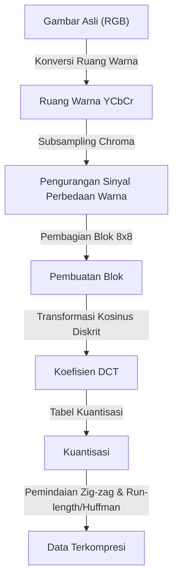
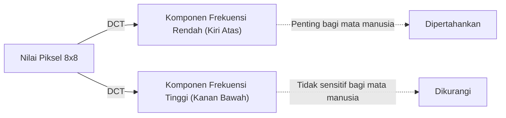

## Pengantar: Dunia Data dan Estetika "Membuang"

Di dunia digital, "data" sering kali terlalu berat. Data gambar, khususnya, memiliki tiga nilai untuk setiap piksel: RGB (merah, hijau, biru). Jika itu adalah gambar dengan jutaan piksel, jumlah datanya dengan cepat menjadi sangat besar. Dari akhir 1980-an hingga 1990-an, ketika penyebaran Internet dan kamera digital mulai menjadi kenyataan, para peneliti menabrak rintangan besar. Masalahnya adalah: "Bagaimana cara menjaga gambar tetap kecil namun tetap terlihat indah?"

Di sinilah Joint Photographic Experts Group, atau standar **JPEG**, hadir. Inti dari JPEG terletak pada penggunaan cerdiknya atas "keterbatasan penglihatan manusia" di balik kata "kompresi". Apa yang dapat Anda buang dari sebuah foto sehingga manusia tidak menyadarinya? JPEG adalah jawaban sempurna untuk pertanyaan ini. Dalam artikel ini, kita akan mempelajari sejarah kompresi gambar dari lahirnya standar JPEG hingga konversi ruang warna, dasar matematika dari Discrete Cosine Transform (DCT), proses pengkodean Huffman, mekanisme blok noise, dan format modern WebP serta AVIF.

## Lahirnya Standar JPEG: Terobosan Tahun 1992

Pada tahun 1986, ISO dan CCITT (sekarang ITU-T) bersama-sama meluncurkan grup standarisasi untuk kompresi gambar diam. Ini adalah awal dari "Joint Photographic Experts Group". Pada saat itu, kekuatan pemrosesan, kapasitas penyimpanan, dan kecepatan komunikasi komputer sangat buruk dibandingkan saat ini. Memproses gambar beberapa megabita apa adanya tidak realistis, dan standardisasi kompresi lossy (metode untuk mencapai tingkat kompresi yang sangat tinggi dengan membuang sebagian data asli) merupakan masalah yang mendesak.

Setelah beberapa tahun diskusi dan evaluasi teknis, standar JPEG secara resmi disetujui pada tahun 1992. JPEG bukanlah satu algoritma tunggal, melainkan kerangka kerja metode kompresi. Di antara metode tersebut, Baseline JPEG yang paling populer memiliki pipeline yang sangat canggih yang menggabungkan Discrete Cosine Transform (DCT) sebagai intinya, kuantisasi yang disesuaikan dengan karakteristik visual manusia, dan pengkodean entropi menggunakan pengkodean Huffman.

Terdapat perpaduan yang luar biasa antara matematika dan fisiologi di setiap langkah pipeline ini. Mari kita bahas satu per satu.

## Konversi Ruang Warna: YCbCr dan Karakteristik Visual Manusia

Pada komputer, gambar biasanya direpresentasikan oleh tiga warna primer R (merah), G (hijau), dan B (biru). Namun, mata manusia jauh lebih sensitif terhadap perubahan kecerahan (luminansi) daripada perubahan warna (rona atau saturasi). Dengan kata lain, jika RGB dibiarkan sebagaimana adanya, "informasi yang sulit diperhatikan manusia" dan "informasi yang mudah diperhatikan" akan bercampur, dan data tidak dapat dikurangi secara efektif.

Oleh karena itu, JPEG mengubah ruang warna RGB menjadi **ruang warna YCbCr**.

- **Y (Luminansi)**: Informasi kecerahan. Setara dengan gambar monokrom.
- **Cb (Perbedaan Biru)**: Komponen biru dikurangi luminansi.
- **Cr (Perbedaan Merah)**: Komponen merah dikurangi luminansi.

Memanfaatkan fakta bahwa mata manusia sensitif terhadap luminansi, JPEG mempertahankan komponen "Y" sebanyak mungkin dan mengurangi (chroma subsampling) komponen "Cb" dan "Cr". Misalnya, dalam format yang disebut "4:2:0", informasi perbedaan warna dikurangi menjadi setengah dari resolusi vertikal dan horizontal (seperempat dari jumlah data). Hasilnya, mereka berhasil secara signifikan mengurangi jumlah data tanpa mata manusia melihat hampir tidak ada penurunan kualitas gambar. Ini adalah langkah pertama menuju "membuang apa yang tidak disadari manusia".

## Discrete Cosine Transform (DCT): Memecah Gambar menjadi Frekuensi

Data gambar yang telah dikonversi ke ruang warna dan dibagi menjadi blok-blok (biasanya piksel 8x8) tunduk pada proses inti berikutnya, **Discrete Cosine Transform (DCT)**.

DCT adalah operasi matematika yang mengubah susunan "spasial" piksel yang disebut gambar menjadi komponen "frekuensi". Blok piksel 8x8 memiliki 64 nilai luminansi, tetapi ketika DCT diterapkan, nilai ini dipecah menjadi 64 komponen frekuensi (koefisien) mulai dari "kecerahan keseluruhan (komponen arus searah, DC)" hingga "pola dan tepi halus (komponen frekuensi tinggi, AC)".

Mengapa mengubahnya menjadi frekuensi? Hal ini karena mata manusia sensitif terhadap "gradien halus (frekuensi rendah)", tetapi tidak sensitif terhadap reproduksi akurat dari "noise yang sangat halus dan pola kompleks (frekuensi tinggi)". DCT itu sendiri merupakan operasi matematika yang dapat dibalik dan tidak kehilangan informasi apa pun, namun ini adalah pra-pemrosesan yang penting untuk menyoroti "bagian mana yang harus dibuang".

## Tabel Kuantisasi: "Pembagian" yang Mengatur Estetika

Untuk 64 koefisien yang diperoleh oleh DCT, proses "membuang" data akhirnya dilakukan. Inilah yang disebut **Kuantisasi**.

Kuantisasi adalah operasi sederhana membagi koefisien DCT dengan matriks konstanta 8x8 yang disebut "tabel kuantisasi" dan membulatkannya ke bilangan bulat terdekat (atau memotongnya). Tabel kuantisasi dirancang untuk menempatkan nilai-nilai kecil di komponen frekuensi rendah (kiri atas) dan nilai-nilai besar di komponen frekuensi tinggi (kanan bawah).

Apa yang terjadi jika Anda membaginya dengan angka yang besar dan membulatkannya ke bawah? Sebagian besar komponen frekuensi tinggi menjadi "0". Dengan kata lain, informasi detail yang halus hilang. Menghasilkan banyak "0" ini merupakan kunci untuk meningkatkan efisiensi kompresi secara dramatis di kemudian hari.

Dengan menyesuaikan tingkat kuantisasi (ukuran nilai tabel), keseimbangan antara "kualitas" gambar JPEG dan "ukuran file" ditentukan. Jika nilai Q diturunkan, ia dibagi dengan angka yang lebih besar, sehingga banyak koefisien menjadi 0 dan tingkat kompresi meningkat, tetapi detailnya hilang.

## Blok Noise: Efek Samping dari Kompresi Berlebihan

Jika kuantisasi terlalu kuat, artefak (noise) yang terkenal akan terjadi. Contoh umumnya adalah **Block Noise** dan **Mosquito Noise**.

Karena JPEG memproses dalam blok 8x8 piksel, jika informasi hilang akibat kuantisasi, kontinuitas warna dan kecerahan antar blok yang berdekatan tidak dapat dipertahankan, dan garis batas menjadi terlihat jelas. Ini adalah block noise. Selain itu, di sekitar perubahan mendadak (massa komponen frekuensi tinggi) seperti huruf atau tepi, noise seperti riak (mosquito noise) terjadi sebagai akibat dari pengurangan komponen frekuensi tinggi yang berlebihan.

Dapat dikatakan bahwa noise ini secara visual menunjukkan keterbatasan algoritma JPEG dan efek samping dari transformasi matematika.

## Pengkodean Huffman dan Kompresi Entropi: Pengepakan Tanpa Pemborosan

Setelah kuantisasi selesai, ada beberapa nilai yang bermakna di kiri atas blok 8x8, dan bagian kanan bawah sisanya disejajarkan dengan sejumlah besar "0". Untuk mengubah ini menjadi data secara efisien, koefisien diatur ulang dalam satu garis dari kiri atas ke kanan bawah menggunakan metode yang disebut **Pemindaian Zig-zag**. Hal ini menyebabkan angka nol muncul secara berurutan.

Setelah itu, "jumlah angka 0 yang berurutan" dirangkum oleh **Run-length Encoding**, dan akhirnya **Pengkodean Huffman** diterapkan. Pengkodean Huffman adalah metode yang menetapkan string bit pendek untuk pola yang sering muncul dan string bit panjang untuk pola yang jarang muncul. Pada tahap inilah file ".jpg" yang kita tangani akhirnya selesai.

## Silsilah Menuju Format Generasi Berikutnya: WebP, AVIF, JPEG XL

Lebih dari 30 tahun telah berlalu sejak lahirnya JPEG, dan gambar serta video kini menempati sebagian besar lalu lintas Internet. Meskipun JPEG masih berkuasa penuh, berbagai format generasi berikutnya telah muncul untuk memenuhi kebutuhan modern (kualitas lebih tinggi dan kapasitas lebih rendah, dukungan saluran alpha, dll.).

### WebP

Dikembangkan oleh Google, WebP menerapkan teknologi standar kompresi video "VP8" pada gambar diam. Ia menggunakan model prediksi yang lebih canggih daripada JPEG, mengurangi ukuran file sebesar 20 hingga 30% dibandingkan dengan JPEG sambil mendukung transparansi (saluran alpha) dan animasi.

### AVIF (AV1 Image File Format)

AVIF menerapkan "AV1", codec kompresi video terbuka generasi berikutnya, pada gambar diam. Format ini membanggakan efisiensi kompresi yang lebih tinggi daripada WebP dan secara sempurna disesuaikan dengan teknologi tampilan modern seperti HDR (High Dynamic Range). Sambil memiliki pemrosesan berbasis blok yang sama dengan JPEG, format ini mencapai tingkat kompresi yang luar biasa dengan memanfaatkan sumber daya komputasi secara berlimpah, seperti ukuran blok variabel dan algoritme prediksi tingkat lanjut.

### JPEG XL

Dirancang sebagai penerus JPEG, ia memiliki fitur unik karena dapat mengompresi ulang file JPEG yang ada tanpa degradasi. Format ini memiliki keseimbangan kualitas dan ukuran gambar yang baik, dan dukungannya secara bertahap semakin meluas.

## Kesimpulan: Seni Pengurangan

Saat kita mengungkap sejarah dan teknologi JPEG, kita menyadari bahwa itu bukan sekadar sejarah "kompresi data", melainkan sejarah "meretas indera manusia". Saat kita melihat sebuah gambar, kita tidak melihat semua piksel secara setara. JPEG menggunakan matematika dan fisiologi untuk memotong secara akurat "apa yang tidak kita lihat".

Dengan evolusi teknologi digital, format-format baru bermunculan satu per satu, tetapi filosofi dasar yang dibangun oleh JPEG, yaitu "menipu mata manusia", telah diteruskan pada kompresi animasi dan video saat ini. Lain kali Anda melihat foto yang indah di layar ponsel cerdas Anda, pikirkan sejenak tentang jutaan "informasi yang dibuang" dan rumus matematika indah yang memungkinkannya terjadi di baliknya.
