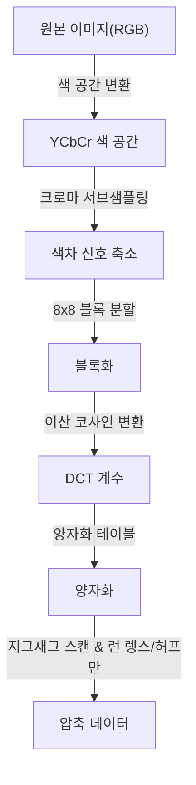
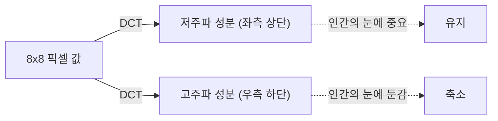

## 서장: 데이터의 세계와 '버림'의 미학

디지털 세계에서 '데이터'는 종종 너무 무겁습니다. 특히 이미지 데이터는 픽셀 하나당 RGB(빨강, 초록, 파랑) 세 개의 수치를 가지며, 수백만 픽셀의 이미지라면 그 데이터 양은 금세 방대해집니다. 1980년대 후반에서 1990년대에 걸쳐 인터넷과 디지털 카메라의 보급이 현실화될 무렵, 연구자들은 하나의 큰 벽에 부딪혔습니다. '어떻게 하면 이미지를 작게 유지하면서도 아름답게 보이게 할 것인가'라는 문제였습니다.

여기서 등장한 것이 Joint Photographic Experts Group, 즉 **JPEG**(제이펙)이라는 규격이었습니다. JPEG의 진수는 '압축'이라는 단어 이면에 있는 '인간 시각의 한계'를 교묘하게 이용한 점에 있습니다. 사진에서 무엇을 버리면 인간은 눈치채지 못하는가. JPEG는 이 질문에 대한 하나의 완벽한 해답이었습니다. 본 기사에서는 JPEG 규격의 탄생부터 색 공간 변환, 이산 코사인 변환(DCT)의 수학적 기초, 허프만 부호화 과정, 블록 노이즈 발생 메커니즘, 그리고 현대의 WebP나 AVIF에 이르기까지 이미지 압축의 역사를 깊이 파헤쳐 보겠습니다.

## JPEG 규격의 탄생: 1992년의 돌파구

1986년, ISO와 CCITT(현재의 ITU-T)는 공동으로 정지 이미지 압축을 위한 표준화 그룹을 출범시켰습니다. 이것이 'Joint Photographic Experts Group'의 시작입니다. 당시 컴퓨터의 처리 능력이나 저장 용량, 통신 회선의 속도는 현대와는 비교할 수 없을 정도로 빈약했습니다. 메가바이트 단위의 이미지를 그대로 다루는 것은 현실적이지 않았고, 손실 압축(원본 데이터의 일부를 버림으로써 극히 높은 압축률을 실현하는 기법)의 표준화가 시급한 과제였습니다.

수년에 걸친 논의와 기술적 평가를 거쳐, 1992년에 JPEG 표준이 정식으로 승인되었습니다. JPEG는 단일 알고리즘이 아니라 일련의 압축 기법 프레임워크를 가리킵니다. 그중에서도 가장 널리 보급된 베이스라인 JPEG는 이산 코사인 변환(DCT)을 핵심으로 삼아, 인간의 시각 특성에 맞춘 양자화, 그리고 허프만 부호화에 의한 엔트로피 부호화를 조합한 매우 세련된 파이프라인을 가지고 있습니다.

이 파이프라인의 각 단계에는 수학과 생리학의 멋진 융합을 엿볼 수 있습니다. 순서대로 살펴보겠습니다.

## 색 공간 변환: YCbCr과 인간의 시각 특성

컴퓨터 상에서 이미지는 통상 R(빨강), G(초록), B(파랑)의 3원색으로 표현됩니다. 그러나 인간의 눈은 색(색상이나 채도)의 변화보다는 밝기(휘도)의 변화에 훨씬 민감합니다. 즉, RGB 그대로라면 '인간이 눈치채기 어려운 정보'와 '눈치채기 쉬운 정보'가 혼재되어 있어 효율적으로 데이터를 솎아낼 수 없습니다.

그래서 JPEG는 RGB 색 공간을 **YCbCr 색 공간**으로 변환합니다.

- **Y(휘도)**: 밝기 정보. 흑백 이미지에 해당합니다.
- **Cb(청색차)**: 파란색 성분에서 휘도를 뺀 것.
- **Cr(적색차)**: 빨간색 성분에서 휘도를 뺀 것.

인간의 눈이 휘도에 민감하다는 점을 이용해, JPEG는 'Y' 성분은 가능한 한 유지하고 'Cb'와 'Cr' 성분을 솎아내는 기법(크로마 서브샘플링)을 취합니다. 예를 들어 '4:2:0'이라고 불리는 포맷에서는 색차 정보가 가로세로 절반의 해상도(데이터 양으로는 4분의 1)로 줄어듭니다. 이로써 인간의 눈에는 거의 화질 저하를 느끼게 하지 않으면서 데이터 양을 대폭 줄이는 데 성공했습니다. 이것이 '인간이 눈치채지 못하는 것을 버리는' 첫걸음입니다.

## 이산 코사인 변환(DCT): 이미지를 주파수로 분해하다

색 공간을 변환하고 블록(통상 8x8 픽셀)으로 분할된 이미지 데이터는 다음 핵심 프로세스인 **이산 코사인 변환(Discrete Cosine Transform: DCT)**을 거치게 됩니다.

DCT는 이미지라는 '공간적'인 픽셀 배열을 '주파수' 성분으로 변환하는 수학적 조작입니다. 8x8 픽셀 블록은 64개의 휘도 값을 가지고 있는데, DCT를 적용하면 이를 '전체적인 밝기(직류 성분, DC)'부터 '미세한 무늬나 엣지(고주파 성분, AC)'까지 64개의 주파수 성분(계수)으로 분해합니다.

왜 주파수로 변환할까요? 그것은 인간의 눈이 '완만한 그라데이션(저주파)'에는 민감하지만, '매우 미세한 노이즈나 복잡한 무늬(고주파)'의 정확한 재현성에는 둔감하기 때문입니다. DCT 자체는 가역적인 수학적 조작으로 정보를 전혀 잃지 않지만, '어디를 버리면 좋을지'를 부각시키기 위한 필수적인 전처리입니다.

## 양자화 테이블: 미학을 지배하는 '나눗셈'

DCT를 통해 얻어진 64개의 계수에 대해 드디어 데이터를 '버리는' 과정이 이루어집니다. 그것이 **양자화(Quantization)**입니다.

양자화는 DCT 계수를 '양자화 테이블'이라 불리는 8x8 상수 행렬로 나누고 소수점 이하를 버리는(반올림하는) 단순한 조작입니다. 양자화 테이블은 저주파 성분(좌측 상단)에는 작은 수치를, 고주파 성분(우측 하단)에는 큰 수치를 배치하도록 설계되어 있습니다.

큰 수치로 나누어 버리면 어떻게 될까요? 고주파 성분의 대부분은 '0'이 됩니다. 즉, 세밀한 디테일 정보가 상실됩니다. 이 '0'이 대량으로 발생하는 것이야말로 이후의 압축 효율을 극적으로 높이는 열쇠가 됩니다.

양자화의 정도(테이블 값의 크기)를 조정함으로써 JPEG 이미지의 '화질(Quality)'과 '파일 크기'의 균형을 결정합니다. Q 값을 낮추면 더 큰 수치로 나누어지기 때문에 많은 계수가 0이 되어 압축률은 올라가지만 디테일은 손실됩니다.

## 블록 노이즈: 무리한 압축이 초래하는 부작용

양자화를 너무 강하게 하면 유명한 아티팩트(노이즈)가 발생합니다. 대표적인 것이 **블록 노이즈(Block Noise)**와 **모스키토 노이즈(Mosquito Noise)**입니다.

JPEG는 8x8 픽셀 단위의 블록으로 처리를 수행하기 때문에 양자화로 인해 정보가 손실되면 인접한 블록 간의 색상이나 밝기의 연속성을 유지할 수 없게 되어 경계선이 뚜렷하게 보이게 됩니다. 이것이 블록 노이즈입니다. 또한, 문자나 엣지처럼 급격한 변화(고주파 성분의 덩어리) 주변에서는 고주파 성분을 무리하게 깎아낸 결과 물결무늬 같은 노이즈(모스키토 노이즈)가 발생합니다.

이러한 노이즈는 JPEG라는 알고리즘의 한계와 수학적 변환의 부작용을 시각적으로 보여준다고 할 수 있습니다.

## 허프만 부호화와 엔트로피 압축: 낭비 없는 패킹

양자화가 끝나면 8x8 블록 안에는 좌측 상단에 몇 개의 의미 있는 값이 있고, 나머지 우측 하단 부분은 대량의 '0'이 늘어선 상태가 됩니다. 이를 효율적으로 데이터화하기 위해 **지그재그 스캔(Zig-zag Scan)**이라는 기법으로 좌측 상단에서 우측 하단을 향해 계수를 한 줄로 재배열합니다. 이렇게 하면 0이 연속해서 출현하게 됩니다.

이후 **런 렝스 부호화(Run-length Encoding)**를 통해 '0이 몇 번 연속되었는지'를 정리하고, 마지막으로 **허프만 부호화(Huffman Coding)**를 적용합니다. 허프만 부호화는 자주 출현하는 패턴에는 짧은 비트열을, 드물게 출현하는 패턴에는 긴 비트열을 할당하는 기법입니다. 여기까지 와서야 비로소 우리가 다루는 '.jpg'라는 파일이 완성됩니다.

## 차세대 포맷으로의 계보: WebP, AVIF, JPEG XL

JPEG가 탄생한 지 30년 이상이 지났고, 인터넷 트래픽의 대부분을 이미지와 동영상이 차지하게 되었습니다. JPEG는 여전히 절대적인 왕좌에 군림하고 있지만, 현대의 요구(더 고화질이면서 더 적은 용량, 알파 채널 지원 등)를 충족하기 위해 다양한 차세대 포맷이 등장하고 있습니다.

### WebP (웹피)

구글이 개발한 WebP는 동영상 압축 규격 'VP8'의 기술을 정지 이미지에 응용한 것입니다. JPEG보다 고도화된 예측 모델을 사용하여 파일 크기를 JPEG 대비 20~30% 줄이면서도 투명도(알파 채널)와 애니메이션도 지원합니다.

### AVIF (AV1 Image File Format)

차세대 오픈 동영상 압축 코덱인 'AV1'을 정지 이미지로 전용한 것이 AVIF입니다. WebP 이상의 압축 효율을 자랑하며, HDR(하이다이내믹레인지) 등 현대의 디스플레이 기술에 완벽하게 적응합니다. JPEG와 같은 블록 기반의 처리를 가지면서도 블록 크기의 가변성이나 고도화된 예측 알고리즘 등 계산 자원을 아낌없이 사용함으로써 압도적인 압축률을 실현하고 있습니다.

### JPEG XL

JPEG의 후계자로 설계되어 기존 JPEG 파일을 열화 없이 재압축할 수 있다는 독특한 특징을 가지고 있습니다. 화질과 크기의 균형이 좋아 점차 지원이 확대되고 있습니다.

## 결론: 뺄셈의 예술

JPEG의 역사와 기술을 파헤쳐 보면, 그것은 단순한 '데이터 압축'의 역사가 아니라 '인간 감각 해킹'의 역사임을 알 수 있습니다. 우리는 이미지를 볼 때 모든 픽셀을 평등하게 보고 있는 것이 아닙니다. JPEG는 수학과 생리학을 구사하여 '우리가 보지 않는 것'을 정확히 잘라냈습니다.

디지털 기술의 진화에 따라 새로운 포맷이 속속 등장하고 있지만, '인간의 눈을 속이는'이라는 JPEG가 확립한 기본 철학은 오늘날의 애니메이션이나 동영상 압축에도 면면히 이어지고 있습니다. 다음에 스마트폰 화면에서 아름다운 사진을 볼 때, 그 이면에 수백만 개의 '버려진 정보'와 그것을 가능하게 한 아름다운 수식이 있다는 것에 조금만 생각의 나래를 펼쳐보세요.
