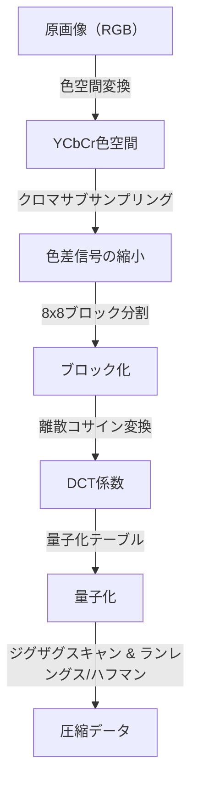
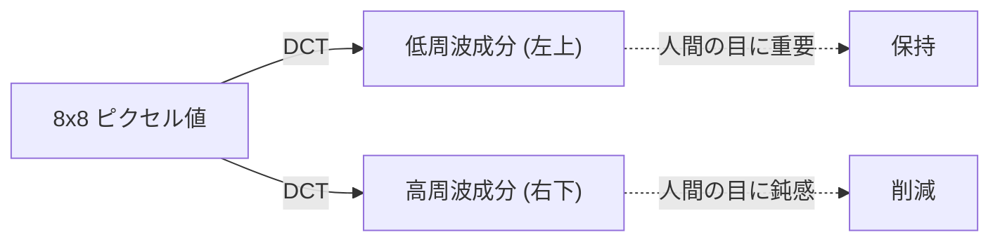

## 序章：データの世界と「捨てる」美学

デジタル世界において、「データ」は往々にして重すぎます。特に画像データは、1ピクセルごとにRGB（赤、緑、青）の3つの数値を持ち、数百万ピクセルの画像ともなれば、そのデータ量はすぐに膨大なものになります。1980年代後半から1990年代にかけて、インターネットやデジタルカメラの普及が現実味を帯びてきたころ、研究者たちはひとつの大きな壁にぶつかりました。「いかにして画像を小さく保ち、かつ美しく見せるか」という問題です。

ここで登場したのが、Joint Photographic Experts Group、すなわち**JPEG**（ジェイペグ）という規格でした。JPEGの真髄は、「圧縮」という言葉の裏にある「人間の視覚の限界」を巧みに利用した点にあります。写真から何を捨てれば、人間は気付かないのか。JPEGは、この問いに対するひとつの完璧な解答でした。本記事では、JPEG規格の誕生から、色空間の変換、離散コサイン変換（DCT）の数学的基礎、ハフマン符号化のプロセス、ブロックノイズの発生メカニズム、そして現代のWebPやAVIFに至るまでの画像圧縮の歴史を深掘りします。

## JPEG規格の誕生：1992年のブレイクスルー

1986年、ISOとCCITT（現在のITU-T）は共同で、静止画像圧縮のための標準化グループを立ち上げました。これが「Joint Photographic Experts Group」の始まりです。当時、コンピュータの処理能力やストレージ容量、通信回線の速度は現代とは比べ物にならないほど貧弱でした。メガバイト単位の画像をそのまま扱うことは現実的ではなく、非可逆圧縮（元のデータを一部捨てることで極めて高い圧縮率を実現する手法）の標準化が急務でした。

数年にわたる議論と技術的評価を経て、1992年にJPEG標準が正式に承認されました。JPEGは単一のアルゴリズムではなく、一連の圧縮手法の枠組みを指します。その中でも最も普及したベースラインJPEGは、離散コサイン変換（DCT）を中核に据え、人間の視覚特性に合わせた量子化、そしてハフマン符号化によるエントロピー符号化を組み合わせた、非常に洗練されたパイプラインを持っています。

このパイプラインの各ステップには、数学と生理学の素晴らしい融合が見られます。順を追って見ていきましょう。

## 色空間の変換：YCbCrと人間の視覚特性

コンピュータ上で画像は通常、R（赤）、G（緑）、B（青）の3原色で表現されます。しかし、人間の目は色（色相や彩度）の変化よりも、明るさ（輝度）の変化に対してはるかに敏感です。つまり、RGBのままでは「人間が気付きにくい情報」と「気付きやすい情報」が混在しており、効率的にデータを間引くことができません。

そこでJPEGは、RGB色空間を**YCbCr色空間**に変換します。

- **Y（輝度）**: 明るさの情報。モノクロ画像に相当します。
- **Cb（青色差）**: 青の成分から輝度を引いたもの。
- **Cr（赤色差）**: 赤の成分から輝度を引いたもの。

人間の目が輝度に敏感であることを利用し、JPEGは「Y」の成分はできるだけ維持し、「Cb」と「Cr」の成分を間引くという手法（クロマサブサンプリング）を取ります。例えば「4:2:0」と呼ばれるフォーマットでは、色差情報は縦横半分の解像度（データ量としては4分の1）に削減されます。これにより、人間の目にはほとんど画質劣化が分からないまま、データ量を大幅に削減することに成功しました。これが「人間が気付かないものを捨てる」第一歩です。

## 離散コサイン変換（DCT）：画像を周波数に分解する

色空間を変換し、ブロック（通常は8x8ピクセル）に分割された画像データは、次なる核心的プロセスである**離散コサイン変換（Discrete Cosine Transform: DCT）**にかけられます。

DCTは、画像という「空間的」なピクセルの並びを、「周波数」の成分へと変換する数学的操作です。8x8のピクセルブロックは64個の輝度値を持っていますが、DCTを適用すると、これを「全体的な明るさ（直流成分、DC）」から「細かい模様やエッジ（高周波成分、AC）」までの64個の周波数成分（係数）に分解します。

なぜ周波数に変換するのでしょうか？それは、人間の目が「緩やかなグラデーション（低周波）」には敏感ですが、「非常に細かいノイズや複雑な模様（高周波）」の正確な再現性には鈍感だからです。DCT自体は可逆な数学的操作であり、情報を一切失いませんが、「どこを捨てればいいか」を浮き彫りにするための不可欠な前処理なのです。

## 量子化テーブル：美学を支配する「割り算」

DCTによって得られた64個の係数に対して、いよいよデータを「捨てる」プロセスが行われます。それが**量子化（Quantization）**です。

量子化は、DCT係数を「量子化テーブル」と呼ばれる8x8の定数行列で割り、小数点以下を切り捨てる（四捨五入する）という単純な操作です。量子化テーブルは、低周波成分（左上）には小さな数値を、高周波成分（右下）には大きな数値を配置するように設計されています。

大きな数値で割って切り捨てるとどうなるでしょうか？高周波成分の多くは「0」になります。つまり、細かいディテール情報が失われます。この「0」がたくさん発生することこそが、後の圧縮効率を劇的に高める鍵となります。

量子化の度合い（テーブルの値の大きさ）を調整することで、JPEG画像の「画質（Quality）」と「ファイルサイズ」のバランスを決定します。Q値を下げると、より大きな数値で割られるため、多くの係数が0になり圧縮率は上がりますが、ディテールが失われます。

## ブロックノイズ：無理な圧縮がもたらす副作用

量子化を強めすぎると、有名なアーティファクト（ノイズ）が発生します。代表的なものが**ブロックノイズ（Block Noise）**と**モスキートノイズ（Mosquito Noise）**です。

JPEGは8x8ピクセルのブロック単位で処理を行うため、量子化によって情報が失われると、隣接するブロック間で色や明るさの連続性が保てなくなり、境界線がクッキリと見えてしまいます。これがブロックノイズです。また、文字やエッジのような急激な変化（高周波成分の塊）の周囲では、高周波成分を無理に削った結果、波紋のようなノイズ（モスキートノイズ）が発生します。

これらのノイズは、JPEGというアルゴリズムの限界と、数学的変換の副作用を視覚的に示していると言えます。

## ハフマン符号化とエントロピー圧縮：無駄のないパッキング

量子化が終わると、8x8のブロック内には左上に数個の意味のある値があり、残りの右下部分は大量の「0」が並んだ状態になります。これを効率的にデータ化するために、**ジグザグスキャン（Zig-zag Scan）**という手法で、左上から右下に向かって係数を一列に並べ替えます。これにより、ゼロが連続して出現するようになります。

その後、**ランレングス符号化（Run-length Encoding）**によって「0がいくつ連続したか」をまとめ、最後に**ハフマン符号化（Huffman Coding）**を適用します。ハフマン符号化は、頻繁に出現するパターンには短いビット列を、滅多に出現しないパターンには長いビット列を割り当てる手法です。ここまで来てようやく、私たちが扱う「.jpg」というファイルが出来上がります。

## 次世代フォーマットへの系譜：WebP、AVIF、JPEG XL

JPEGが誕生して30年以上が経過し、インターネットのトラフィックの大部分を画像や動画が占めるようになりました。JPEGは依然として絶対的な王座に君臨していますが、現代の要求（より高画質でより低容量、アルファチャンネルのサポートなど）を満たすため、様々な次世代フォーマットが登場しています。

### WebP（ウェッピー）
Googleが開発したWebPは、動画圧縮規格「VP8」の技術を静止画に応用したものです。JPEGよりも高度な予測モデルを用い、ファイルサイズをJPEG比で20〜30%削減しつつ、透過（アルファチャンネル）やアニメーションもサポートしています。

### AVIF（AV1 Image File Format）
次世代のオープンな動画圧縮コーデック「AV1」を静止画に転用したのがAVIFです。WebP以上の圧縮効率を誇り、HDR（ハイダイナミックレンジ）など現代のディスプレイ技術に完全に適応しています。JPEGと同じブロックベースの処理を持ちつつも、ブロックサイズの可変性や高度な予測アルゴリズムなど、計算資源をふんだんに使うことで圧倒的な圧縮率を実現しています。

### JPEG XL
JPEGの後継として設計され、既存のJPEGファイルを劣化なしに再圧縮できるというユニークな特徴を持っています。画質とサイズのバランスが良く、徐々にサポートが広がっています。

## 結論：引き算の芸術

JPEGの歴史と技術を紐解くと、それは単なる「データ圧縮」の歴史ではなく、「人間の感覚のハック」の歴史であることが分かります。私たちは画像を見る時、すべてのピクセルを平等に見ているわけではありません。JPEGは、数学と生理学を駆使して「私たちが見ていないもの」を正確に切り落としました。

デジタル技術の進化に伴い、新しいフォーマットが次々と登場していますが、「人間の目にごまかしを効かせる」というJPEGが確立した基本哲学は、今日のアニメーションや動画圧縮にも脈々と受け継がれています。次にスマートフォンの画面で美しい写真を見る時、その裏で何百万もの「捨てられた情報」と、それを可能にした美しい数式があることに、少しだけ思いを馳せてみてください。
