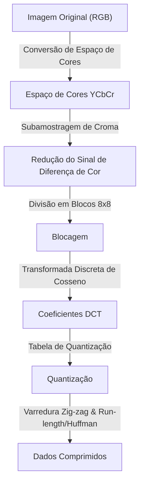
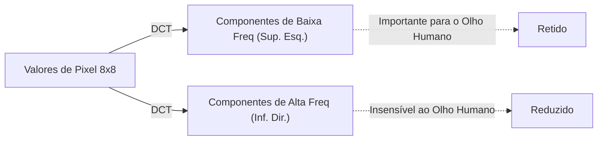

## Prólogo: O Mundo dos Dados e a Estética do "Descarte"

No mundo digital, os "dados" costumam ser muito pesados. Dados de imagem, em particular, contêm três valores RGB (vermelho, verde e azul) por pixel, e quando se trata de uma imagem de milhões de pixels, a quantidade de dados rapidamente se torna colossal. No final da década de 1980 e início da década de 1990, quando a popularização da internet e das câmeras digitais começou a se tornar realidade, os pesquisadores se depararam com um grande obstáculo. O problema de "como manter as imagens pequenas, mas com uma aparência bonita".

Foi aí que entrou o Joint Photographic Experts Group, ou a norma **JPEG**. A essência do JPEG reside no fato de que ele utiliza habilmente os "limites da visão humana" que estão por trás da palavra "compressão". O que você pode descartar de uma fotografia sem que os humanos percebam? O JPEG foi uma resposta perfeita para esta pergunta. Neste artigo, vamos aprofundar a história da compressão de imagens desde o nascimento do padrão JPEG, a conversão do espaço de cores, a base matemática da Transformada Discreta de Cosseno (DCT), o processo de codificação Huffman, o mecanismo de geração de ruído de bloco (block noise) e, finalmente, os modernos WebP e AVIF.

## O Nascimento do Padrão JPEG: O Avanço de 1992

Em 1986, a ISO e o CCITT (agora ITU-T) lançaram conjuntamente um grupo de padronização para a compressão de imagens estáticas. Este foi o início do "Joint Photographic Experts Group". Naquela época, o poder de processamento de computadores, a capacidade de armazenamento e as velocidades das linhas de comunicação eram muito mais pobres do que são hoje. Tratar as imagens do tamanho de megabytes como estão não era realista, e havia uma necessidade urgente de padronizar a compressão com perdas (um método para alcançar uma taxa de compressão extremamente alta descartando parte dos dados originais).

Após vários anos de debate e avaliação técnica, o padrão JPEG foi formalmente aprovado em 1992. O JPEG não é um único algoritmo, mas sim a estrutura de uma série de técnicas de compressão. Entre eles, o JPEG de linha de base (baseline JPEG), mais amplamente utilizado, tem o seu núcleo na Transformada Discreta de Cosseno (DCT) e possui um pipeline altamente refinado que combina a quantização adaptada às características visuais humanas com a codificação de entropia usando a codificação de Huffman.

Em cada etapa deste pipeline, há uma fusão impressionante de matemática e fisiologia. Vamos dar uma olhada passo a passo.

## Conversão do Espaço de Cores: YCbCr e Características Visuais Humanas

Em computadores, as imagens são normalmente representadas em três cores primárias: R (vermelho), G (verde) e B (azul). No entanto, o olho humano é muito mais sensível a mudanças no brilho (luminância) do que a mudanças na cor (matiz e saturação). Em outras palavras, com o formato RGB, a "informação que é difícil para os humanos perceberem" e a "informação que é fácil de perceber" se misturam, o que impossibilita afinar os dados de forma eficiente.

Portanto, o JPEG converte o espaço de cores RGB no **espaço de cores YCbCr**.

- **Y (Luminância)**: Informações de brilho. Corresponde a uma imagem monocromática.
- **Cb (Diferença de Cor Azul)**: O componente azul menos a luminância.
- **Cr (Diferença de Cor Vermelha)**: O componente vermelho menos a luminância.

Aproveitando a sensibilidade do olho humano à luminância, o JPEG emprega um método (subamostragem de croma) que mantém a componente "Y" o máximo possível e descarta as componentes "Cb" e "Cr". Por exemplo, em um formato chamado "4:2:0", a informação da diferença de cor é reduzida pela metade da resolução, tanto na vertical quanto na horizontal (um quarto da quantidade de dados). Como resultado, o volume de dados é drasticamente reduzido quase sem degradação visível na qualidade da imagem para o olho humano. Este é o primeiro passo de "descartar o que os humanos não conseguem perceber".

## Transformada Discreta de Cosseno (DCT): Decompondo Imagens em Frequências

Uma vez convertido o espaço de cor e a imagem fragmentada em blocos (geralmente 8x8 pixels), é aplicado o próximo processo fundamental: a **Transformada Discreta de Cosseno (Discrete Cosine Transform: DCT)**.

O DCT é uma operação matemática que converte o arranjo "espacial" de pixels de uma imagem em componentes de "frequência". Um bloco de 8x8 pixels possui 64 valores de luminância, mas quando o DCT é aplicado, ele é decomposto em 64 componentes (coeficientes) de frequência, desde "brilho geral (componente de corrente contínua, DC)" a "padrões e bordas finas (componentes de alta frequência, AC)".

Por que converter para frequências? É porque o olho humano é sensível a "gradações graduais (baixas frequências)", mas é insensível à precisão de reprodução de "ruídos e padrões muito finos e complexos (altas frequências)". O próprio DCT é uma operação matemática reversível e não perde qualquer informação, mas é um pré-processamento essencial para evidenciar "o que deve ser descartado".

## Tabela de Quantização: A "Divisão" que Rege a Estética

Para os 64 coeficientes obtidos pelo DCT, tem início finalmente o processo de "descartar" os dados. Essa é a **Quantização (Quantization)**.

A quantização é uma operação simples na qual os coeficientes DCT são divididos por uma matriz constante 8x8 chamada "tabela de quantização", e as partes decimais são descartadas (arredondadas). A tabela de quantização é projetada para colocar números pequenos nos componentes de baixa frequência (canto superior esquerdo) e números maiores nos componentes de alta frequência (canto inferior direito).

O que acontece quando você divide por um número grande e arredonda para baixo? Grande parte do componente de alta frequência se torna "0". Ou seja, perdem-se detalhes finos. O fato de ocorrerem muitos "0"s é fundamental para aumentar drasticamente a eficiência da compressão posterior.

Ajustando o grau de quantização (a magnitude dos valores na tabela), o equilíbrio entre "Qualidade da Imagem (Quality)" e "Tamanho de arquivo" das imagens JPEG é determinado. Quando o valor de Q é diminuído, uma vez que se dividem os números por um número maior, muitos coeficientes se tornam zero e a taxa de compressão aumenta, mas perdem-se detalhes.

## Block Noise (Ruído de Bloco): O Efeito Secundário Causado pela Compressão Forçada

Se a quantização for muito forte, irão ocorrer os famosos artefatos (ruídos). Exemplos típicos são o **Ruído de Bloco (Block Noise)** e o **Ruído Mosquito (Mosquito Noise)**.

Como o JPEG realiza o processamento em blocos de 8x8 pixels, quando informações se perdem através da quantização, a continuidade da cor ou do brilho não pode mais ser mantida entre os blocos adjacentes e o contorno passa a ser visível claramente. Esse é o ruído de bloco. Por outro lado, em torno de mudanças bruscas (uma aglomeração de componentes de alta frequência) como nas letras e nas bordas, no qual se reduziu excessivamente a frequência alta, ocorre um ruído parecido com ondulações d'água (Mosquito Noise).

Pode-se dizer que estes ruídos mostram visualmente os limites do algoritmo JPEG e os efeitos colaterais das transformações matemáticas.

## Codificação de Huffman e Compressão de Entropia: Empacotamento Sem Desperdício

Ao final da quantização, em um bloco 8x8 haverá alguns valores importantes no canto superior esquerdo, e o resto da parte inferior direita será uma extensa lista de "0"s. Para transformar isso eficientemente em dados, os coeficientes são reordenados em uma única linha a partir do canto superior esquerdo, indo em direção ao inferior direito através de uma técnica chamada **Varredura Zig-zag (Zig-zag Scan)**. Isso permite que zeros apareçam sequencialmente.

Depois, "quantos zeros são contínuos" é sumarizado através de **Codificação Run-length (Run-length Encoding)**, e, por fim, se aplica a **Codificação de Huffman (Huffman Coding)**. A codificação Huffman é um método de atribuir sequências de bits curtas aos padrões que aparecem com frequência e sequências de bits longas aos padrões que raramente aparecem. É então que finalmente obtemos o arquivo ".jpg" do qual tratamos.

## A Genealogia para os Formatos da Próxima Geração: WebP, AVIF, JPEG XL

Mais de 30 anos se passaram desde que o JPEG nasceu, e imagens e vídeos respondem agora pela maior parte do tráfego da internet. Embora o JPEG permaneça num trono indiscutível, vários formatos de próxima geração surgiram para responder às exigências modernas (maior qualidade com menor capacidade, suporte ao canal alfa, etc.).

### WebP
Desenvolvido pelo Google, o WebP aplica a tecnologia do padrão de compressão de vídeo "VP8" para imagens estáticas. Ele usa um modelo de predição mais avançado que o JPEG para reduzir o tamanho do arquivo em 20% a 30% quando comparado ao JPEG e suporta transparência (canal alfa) e animação.

### AVIF (AV1 Image File Format)
O AVIF baseia-se no próximo codec aberto de compressão de vídeo "AV1", convertendo-o para imagens estáticas. Orgulha-se de uma eficiência de compressão superior à do WebP e se adapta perfeitamente à tecnologia moderna de visualização, como o HDR (High Dynamic Range). Embora tenha o mesmo processamento baseado em blocos que o JPEG, alcança uma taxa de compressão formidável ao fazer pleno uso de recursos computacionais, através da flexibilidade do tamanho do bloco e de um algoritmo de predição de alto nível.

### JPEG XL
O JPEG XL foi projetado para ser um sucessor do JPEG, e tem uma característica peculiar que permite a recompilação sem perda da qualidade dos arquivos em JPEG existentes. Encontra um bom equilíbrio entre qualidade de imagem e tamanho, e o suporte está se espalhando gradualmente.

## Conclusão: A Arte da Subtração

Quando você desenrola a história e a tecnologia do JPEG, você descobre que não é apenas uma história de "compressão de dados", mas sim uma história de "hackear os sentidos humanos". Quando olhamos para uma imagem, nós não olhamos todos os pixels da mesma forma. O JPEG usa perfeitamente tanto a matemática quanto a fisiologia e cortou com precisão o "aquilo que nós não vemos".

Com a evolução da tecnologia digital, surgem novos formatos uns após outros, mas a filosofia básica estabelecida pelo JPEG que é "enganar os olhos humanos" tem sido passada sem interrupção para as animações e para as compressões de vídeo atuais. Da próxima vez que você estiver assistindo à tela de seu smartphone apreciando belas fotos, pense brevemente nos milhões de "informações descartadas" nos bastidores, assim como nas belas fórmulas matemáticas que permitiram isso.
