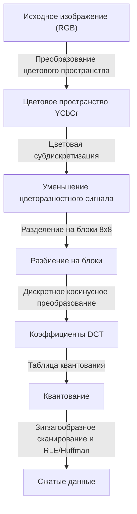
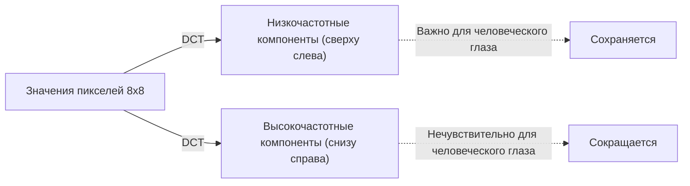

## Пролог: Мир данных и эстетика "отбрасывания"

В цифровом мире "данные" часто бывают слишком тяжелыми. В частности, данные изображений имеют три значения RGB (красный, зеленый, синий) для каждого пикселя, и если изображение состоит из миллионов пикселей, объем данных быстро становится огромным. В конце 1980-х и в 1990-х годах, когда популярность интернета и цифровых камер стала реальностью, исследователи столкнулись с одним большим препятствием. Это была проблема: «как сохранить изображения маленькими и при этом красивыми».

Именно здесь на сцену вышла Объединенная группа экспертов по фотографии (Joint Photographic Experts Group), или стандарт **JPEG**. Суть JPEG заключается в умелом использовании "ограничений человеческого зрения", скрывающихся за словом "сжатие". Что можно убрать из фотографии, чтобы человек этого не заметил? JPEG стал идеальным ответом на этот вопрос. В этой статье мы подробно рассмотрим историю сжатия изображений: от рождения стандарта JPEG, преобразования цветового пространства, математических основ дискретного косинусного преобразования (DCT), процесса кодирования Хаффмана и механизма возникновения блочных артефактов до современных форматов WebP и AVIF.

## Рождение стандарта JPEG: Прорыв 1992 года

В 1986 году ISO и CCITT (ныне ITU-T) совместно создали группу по стандартизации сжатия неподвижных изображений. Это стало началом "Joint Photographic Experts Group". В то время вычислительные мощности компьютеров, объем памяти и скорость линий связи были ничтожны по сравнению с современными. Работать с мегабайтными изображениями в их исходном виде было нереально, и существовала острая необходимость в стандартизации сжатия с потерями (метода достижения чрезвычайно высокой степени сжатия путем отбрасывания части исходных данных).

После нескольких лет дискуссий и технических оценок, стандарт JPEG был официально утвержден в 1992 году. JPEG — это не единый алгоритм, а скорее набор методов сжатия. Среди них наиболее распространенный базовый JPEG (Baseline JPEG) имеет в своей основе дискретное косинусное преобразование (DCT) и обладает весьма совершенным конвейером, сочетающим квантование, адаптированное к характеристикам человеческого зрения, и энтропийное кодирование (кодирование Хаффмана).

На каждом этапе этого конвейера наблюдается прекрасное слияние математики и физиологии. Давайте рассмотрим их по порядку.

## Преобразование цветового пространства: YCbCr и особенности зрения человека

На компьютерах изображения обычно представляются в трех основных цветах: R (красный), G (зеленый) и B (синий). Однако человеческий глаз гораздо более чувствителен к изменениям яркости, чем к изменениям цвета (оттенка и насыщенности). Иными словами, если оставить формат RGB, то "информация, которую человеку трудно заметить" и "информация, которую легко заметить", смешаются, что сделает невозможным эффективное прореживание данных.

Поэтому JPEG преобразует цветовое пространство RGB в **цветовое пространство YCbCr**.

- **Y (Яркость)**: Информация о яркости. Эквивалентно черно-белому изображению.
- **Cb (Синяя цветоразность)**: Синий компонент минус яркость.
- **Cr (Красная цветоразность)**: Красный компонент минус яркость.

Используя тот факт, что человеческий глаз чувствителен к яркости, JPEG применяет метод (цветовая субдискретизация), который максимально сохраняет компонент "Y" и прореживает компоненты "Cb" и "Cr". Например, в формате, называемом "4:2:0", информация о цветоразности уменьшается вдвое по вертикали и горизонтали (объем данных сокращается до четверти). В результате объем данных значительно уменьшается практически без заметного для человеческого глаза ухудшения качества изображения. Это первый шаг к "отбрасыванию того, чего люди не замечают".

## Дискретное косинусное преобразование (DCT): Разложение изображения на частоты

После преобразования цветового пространства и разделения данных изображения на блоки (обычно 8х8 пикселей), к ним применяется следующий ключевой процесс — **дискретное косинусное преобразование (Discrete Cosine Transform: DCT)**.

DCT — это математическая операция, которая преобразует "пространственное" расположение пикселей изображения в "частотные" компоненты. Блок размером 8х8 пикселей имеет 64 значения яркости, и применение DCT раскладывает его на 64 частотных компонента (коэффициента): от "общей яркости (постоянная составляющая, DC)" до "мелких узоров и краев (высокочастотные компоненты, AC)".

Зачем преобразовывать в частоты? Потому что человеческий глаз чувствителен к "плавным градиентам (низкие частоты)", но нечувствителен к точности воспроизведения "очень мелкого шума или сложных узоров (высокие частоты)". Само по себе DCT — это обратимая математическая операция, не теряющая никакой информации, но это необходимая предварительная обработка, чтобы выявить, "что можно отбросить".

## Таблица квантования: "Деление", управляющее эстетикой

К 64 коэффициентам, полученным с помощью DCT, наконец применяется процесс "отбрасывания" данных. Это называется **квантованием (Quantization)**.

Квантование — это простая операция деления коэффициентов DCT на матрицу констант 8х8, называемую "таблицей квантования", с последующим отбрасыванием (округлением) дробной части. Таблица квантования разработана таким образом, чтобы располагать малые значения для низкочастотных компонентов (сверху слева) и большие значения для высокочастотных компонентов (снизу справа).

Что происходит, когда вы делите на большое число и округляете? Многие высокочастотные компоненты становятся равными "0". То есть мелкие детали теряются. Именно генерация большого количества нулей является ключом к резкому повышению эффективности последующего сжатия.

Регулируя степень квантования (величину значений в таблице), определяется баланс между "качеством (Quality)" изображения JPEG и его "размером файла". При снижении значения Q коэффициенты делятся на большие числа, в результате чего многие из них становятся равными 0: степень сжатия увеличивается, но детали теряются.

## Блочный шум: Побочные эффекты чрезмерного сжатия

Если квантование слишком сильное, появляются известные артефакты (шум). Типичными примерами являются **блочный шум (Block Noise)** и **москитный шум (Mosquito Noise)**.

Поскольку JPEG выполняет обработку блоками 8х8 пикселей, потеря информации при квантовании приводит к невозможности сохранить непрерывность цвета или яркости между соседними блоками, и границы становятся четко видимыми. Это и есть блочный шум. Кроме того, вокруг резких изменений (скоплений высокочастотных компонентов), таких как текст или края объектов, из-за чрезмерного удаления высокочастотных компонентов возникает шум, похожий на рябь (москитный шум).

Можно сказать, что эти шумы визуально демонстрируют ограничения алгоритма JPEG и побочные эффекты математических преобразований.

## Кодирование Хаффмана и энтропийное сжатие: Упаковка без потерь

После завершения квантования в блоке 8x8 в верхнем левом углу остается несколько значимых значений, а вся остальная нижняя правая часть заполнена большим количеством нулей. Для того, чтобы эффективно преобразовать это в данные, коэффициенты перестраиваются в одну линию от верхнего левого к нижнему правому углу методом, называемым **зигзагообразным сканированием (Zig-zag Scan)**. Благодаря этому нули появляются последовательно.

Затем метод **кодирования длин серий (Run-length Encoding)** подсчитывает, "сколько нулей идет подряд", и, наконец, применяется **кодирование Хаффмана (Huffman Coding)**. Кодирование Хаффмана — это метод назначения коротких битовых последовательностей часто встречающимся шаблонам, и длинных битовых последовательностей — редко встречающимся шаблонам. Только на этом этапе окончательно формируется файл «.jpg», с которым мы работаем.

## Генеалогия форматов следующего поколения: WebP, AVIF, JPEG XL

С момента создания JPEG прошло более 30 лет, и сегодня большая часть интернет-трафика состоит из изображений и видео. Хотя JPEG по-прежнему остается безоговорочным лидером, для удовлетворения современных требований (более высокое качество при меньшем объеме, поддержка альфа-канала и т.д.) появляются различные форматы нового поколения.

### WebP
Разработанный Google, WebP применяет технологию стандарта сжатия видео «VP8» к неподвижным изображениям. Он использует более продвинутую модель прогнозирования, чем JPEG, уменьшая размер файла на 20-30% по сравнению с JPEG, а также поддерживает прозрачность (альфа-канал) и анимацию.

### AVIF (AV1 Image File Format)
AVIF — это адаптация открытого видеокодека следующего поколения «AV1» для неподвижных изображений. Он может похвастаться эффективностью сжатия даже выше, чем у WebP, и идеально подходит для современных технологий отображения, таких как HDR (расширенный динамический диапазон). Несмотря на то, что он имеет ту же блочную обработку, что и JPEG, он обеспечивает ошеломляющую степень сжатия за счет интенсивного использования вычислительных ресурсов, таких как изменяемый размер блоков и передовые алгоритмы прогнозирования.

### JPEG XL
Разработанный в качестве преемника JPEG, он имеет уникальную особенность — возможность пережать существующие файлы JPEG без потери качества. Он обеспечивает хороший баланс между качеством изображения и размером, и его поддержка постепенно расширяется.

## Заключение: Искусство вычитания

Если проследить историю и технологию JPEG, становится ясно, что это история не просто «сжатия данных», а история «взлома человеческих чувств». Когда мы смотрим на изображение, мы не рассматриваем все пиксели в равной степени. JPEG использует математику и физиологию, чтобы с хирургической точностью отрезать то, «на что мы не смотрим».

С развитием цифровых технологий появляются новые форматы один за другим, но базовая философия «обмана человеческого глаза», заложенная JPEG, продолжает жить и в современных методах сжатия видео и анимации. В следующий раз, когда вы будете любоваться красивой фотографией на экране смартфона, на мгновение задумайтесь о миллионах «отброшенных данных» за кулисами и о красивых математических формулах, которые сделали это возможным.
