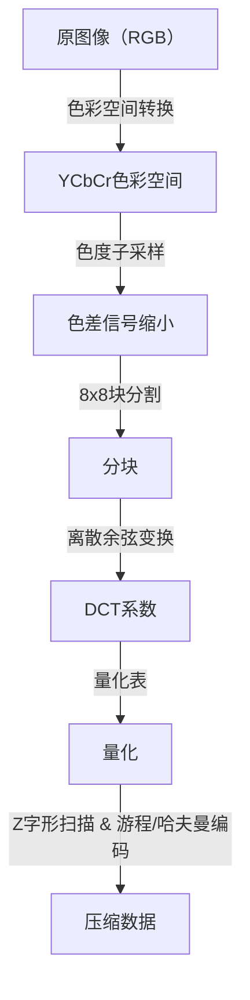
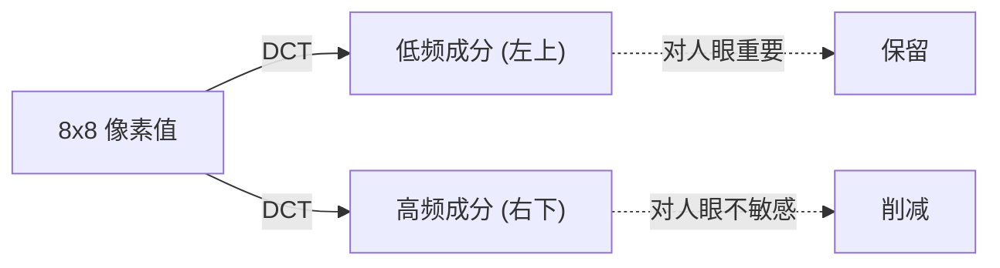

## 序章：数据世界与“丢弃”的美学

在数字世界中，“数据”往往过于沉重。特别是图像数据，每个像素都拥有RGB（红、绿、蓝）三个数值，如果是一张数百万像素的图像，其数据量很快就会变得非常庞大。在20世纪80年代末到90年代，随着互联网和数码相机的普及变得越来越现实，研究人员遇到了一个巨大的障碍。这个问题就是“如何保持图像尺寸较小的同时，又让它看起来很美观”。

此时登场的就是联合摄影专家组（Joint Photographic Experts Group），即**JPEG**标准。JPEG的精髓在于巧妙地利用了“压缩”一词背后的“人类视觉的极限”。从照片中丢弃什么，人类才不会察觉到？JPEG对这个问题提供了一个完美的解答。在本文中，我们将深入探讨图像压缩的历史，从JPEG标准的诞生、色彩空间转换、离散余弦变换（DCT）的数学基础、哈夫曼编码的过程、块状伪影的产生机制，一直到现代的WebP和AVIF。

## JPEG标准的诞生：1992年的突破

1986年，ISO和CCITT（现在的ITU-T）共同成立了一个用于静止图像压缩的标准化组织。这就是“联合摄影专家组”的起源。在当时，计算机的处理能力、存储容量以及通信线路的速度与现在相比都极其简陋。直接处理兆字节级别的图像是不现实的，因此急需标准化一种有损压缩（通过丢弃一部分原始数据来实现极高压缩率的方法）。

经过几年的讨论和技术评估，JPEG标准于1992年正式获得批准。JPEG指的不是单一的算法，而是一系列压缩方法的框架。其中最普及的基线JPEG（Baseline JPEG），以离散余弦变换（DCT）为核心，结合了适应人类视觉特性的量化以及基于哈夫曼编码的熵编码，拥有一个非常精炼的流水线。

这个流水线的每个步骤中，都能看到数学与生理学奇妙的融合。让我们一步步来看。

## 色彩空间转换：YCbCr与人类视觉特性

在计算机上，图像通常用R（红）、G（绿）、B（蓝）三原色来表示。然而，人眼对亮度（明暗）的变化要比对颜色（色相和饱和度）的变化敏感得多。也就是说，如果保留RGB格式，那么“人类难以察觉的信息”和“容易察觉的信息”就会混杂在一起，无法有效地精简数据。

因此，JPEG会将RGB色彩空间转换为**YCbCr色彩空间**。

- **Y（亮度）**: 明暗的信息。相当于黑白图像。
- **Cb（蓝色色差）**: 蓝色成分减去亮度。
- **Cr（红色色差）**: 红色成分减去亮度。

利用人眼对亮度敏感的特性，JPEG采用了一种被称为“色度子采样”的方法，即尽可能保留“Y”成分，并减少“Cb”和“Cr”成分。例如，在被称为“4:2:0”的格式中，色差信息的纵横分辨率都会被减半（数据量变为四分之一）。通过这种方式，在人眼几乎看不出画质下降的情况下，成功大幅削减了数据量。这就是“丢弃人类无法察觉的东西”的第一步。

## 离散余弦变换（DCT）：将图像分解为频率

在转换色彩空间并将图像数据分割为块（通常是8x8像素）后，接下来要进行的是下一个核心过程——**离散余弦变换（Discrete Cosine Transform: DCT）**。

DCT是一种数学操作，它将图像这种“空间”的像素排列转换为“频率”成分。一个8x8的像素块拥有64个亮度值，当应用DCT后，这将被分解为从“整体亮度（直流成分，DC）”到“细小纹理或边缘（高频成分，AC）”的64个频率成分（系数）。

为什么要转换为频率呢？因为人眼对“平缓的渐变（低频）”很敏感，但对“非常细微的噪点或复杂图案（高频）”的精确再现却很迟钝。DCT本身是一种可逆的数学操作，不会丢失任何信息，但它是为了凸显“应该丢弃哪里”而不可或缺的预处理。

## 量化表：主宰美学的“除法”

对于通过DCT获得的64个系数，终于要进行“丢弃”数据的过程了。这就是**量化（Quantization）**。

量化是一个简单的操作，即将DCT系数除以被称为“量化表”的8x8常数矩阵，并舍弃小数部分（四舍五入）。量化表的设计原理是：低频成分（左上）配置较小的数值，高频成分（右下）配置较大的数值。

除以较大的数值并舍弃小数会怎样呢？很多高频成分会变成“0”。也就是说，细微的细节信息丢失了。大量产生“0”正是后续剧烈提高压缩效率的关键。

通过调整量化的程度（表中数值的大小），可以决定JPEG图像在“画质（Quality）”和“文件大小”之间的平衡。如果降低Q值，因为除以的是更大的数值，很多系数将变为0，压缩率虽然提高了，但细节也会丢失。

## 块状伪影：过度压缩带来的副作用

如果量化程度太强，就会出现著名的伪影（噪点）。典型的例子就是**块状伪影（Block Noise）**和**蚊子噪点（Mosquito Noise）**。

因为JPEG是以8x8像素为单位进行处理的，所以当通过量化丢失信息后，相邻的块之间就无法保持颜色或亮度的连续性，边界线就会清晰可见。这就是块状伪影。此外，在文字或边缘等急剧变化（高频成分的聚集）的周围，由于强行去除了高频成分，会出现像波纹一样的噪点（蚊子噪点）。

可以说，这些噪点在视觉上展示了JPEG算法的极限以及数学变换的副作用。

## 哈夫曼编码与熵压缩：没有浪费的打包

当量化结束后，在8x8的块内，左上方会有几个有意义的值，而右下方的剩余部分则排满了大量的“0”。为了将其高效地数据化，采用了一种被称为**Z字形扫描（Zig-zag Scan）**的方法，从左上向右下将系数重新排列成一列。这使得0能够连续出现。

之后，通过**游程编码（Run-length Encoding）**总结“连续出现了多少个0”，最后再应用**哈夫曼编码（Huffman Coding）**。哈夫曼编码是一种为频繁出现的模式分配较短的比特串，为不常出现的模式分配较长的比特串的方法。到了这一步，我们日常处理的“.jpg”文件才终于生成。

## 走向下一代格式的谱系：WebP、AVIF、JPEG XL

自JPEG诞生以来已经过去了30多年，如今互联网流量的大部分都被图像和视频占据。尽管JPEG依然稳居霸主地位，但为了满足现代的需求（例如更高画质、更低容量、支持Alpha通道等），各种下一代格式不断涌现。

### WebP
由谷歌开发的WebP，是将视频压缩标准“VP8”的技术应用于静止图像的产物。它使用了比JPEG更高级的预测模型，在将文件大小比JPEG减少20%到30%的同时，还支持透明（Alpha通道）和动画。

### AVIF（AV1 Image File Format）
AVIF是将下一代开放视频压缩编解码器“AV1”转用于静止图像的结果。它拥有超越WebP的压缩效率，并完全适应HDR（高动态范围）等现代显示技术。尽管它拥有和JPEG一样基于块的处理方式，但通过块大小的可变性以及高级的预测算法等，充分利用计算资源，实现了压倒性的压缩率。

### JPEG XL
被设计为JPEG的继任者，它拥有一个独特的特征，即可以无损地重新压缩现有的JPEG文件。它在画质和大小的平衡上表现良好，并逐渐被更广泛地支持。

## 结论：减法的艺术

回顾JPEG的历史和技术，我们会发现这不仅仅是“数据压缩”的历史，更是“破解人类感官”的历史。当我们看图像时，并没有平等地看所有的像素。JPEG利用数学和生理学，精准地去除了“我们没有看到的东西”。

随着数字技术的进化，新格式层出不穷，但JPEG确立的“欺骗人眼”的基本哲学，依然在今天的动画和视频压缩中一脉相承。下次当你在智能手机屏幕上欣赏美丽的图片时，请稍微回味一下其背后数以百万计的“被丢弃的信息”，以及使这一切成为可能的美丽的数学公式。
