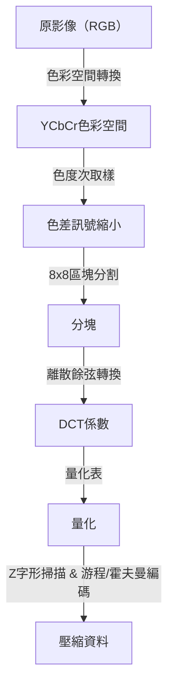
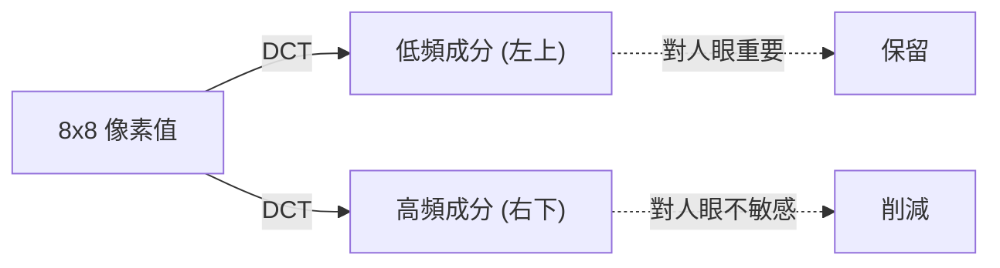

## 序章：數據世界與「丟棄」的美學

在數位世界中，「數據」往往過於沉重。特別是影像數據，每個像素都擁有RGB（紅、綠、藍）三個數值，如果是一張數百萬像素的影像，其數據量很快就會變得非常龐大。在1980年代末到1990年代，隨著網際網路和數位相機的普及變得越來越現實，研究人員遇到了一個巨大的障礙。這個問題就是「如何保持影像尺寸較小的同時，又讓它看起來很美觀」。

此時登場的就是聯合攝影專家小組（Joint Photographic Experts Group），即**JPEG**標準。JPEG的精髓在於巧妙地利用了「壓縮」一詞背後的「人類視覺的極限」。從照片中丟棄什麼，人類才不會察覺到？JPEG對這個問題提供了一個完美的解答。在本文中，我們將深入探討影像壓縮的歷史，從JPEG標準的誕生、色彩空間轉換、離散餘弦轉換（DCT）的數學基礎、霍夫曼編碼的過程、區塊雜訊的產生機制，一直到現代的WebP和AVIF。

## JPEG標準的誕生：1992年的突破

1986年，ISO和CCITT（現在的ITU-T）共同成立了一個用於靜態影像壓縮的標準化組織。這就是「聯合攝影專家小組」的起源。在當時，電腦的處理能力、儲存容量以及通訊線路的速度與現在相比都極其簡陋。直接處理MB級別的影像是很不現實的，因此急需標準化一種破壞性壓縮（透過丟棄一部分原始數據來實現極高壓縮率的方法）。

經過幾年的討論和技術評估，JPEG標準於1992年正式獲得批准。JPEG指的不是單一的演算法，而是一系列壓縮方法的框架。其中最普及的基線JPEG（Baseline JPEG），以離散餘弦轉換（DCT）為核心，結合了適應人類視覺特性的量化以及基於霍夫曼編碼的熵編碼，擁有一個非常精煉的流水線。

這個流水線的每個步驟中，都能看到數學與生理學奇妙的融合。讓我們一步步來看。

## 色彩空間轉換：YCbCr與人類視覺特性

在電腦上，影像通常用R（紅）、G（綠）、B（藍）三原色來表示。然而，人眼對亮度（明暗）的變化要比對顏色（色相和飽和度）的變化敏感得多。也就是說，如果保留RGB格式，那麼「人類難以察覺的資訊」和「容易察覺的資訊」就會混雜在一起，無法有效地精簡資料。

因此，JPEG會將RGB色彩空間轉換為**YCbCr色彩空間**。

- **Y（亮度）**: 明暗的資訊。相當於黑白影像。
- **Cb（藍色色差）**: 藍色成分減去亮度。
- **Cr（紅色色差）**: 紅色成分減去亮度。

利用人眼對亮度敏感的特性，JPEG採用了一種被稱為「色度次取樣」的方法，即盡可能保留「Y」成分，並減少「Cb」和「Cr」成分。例如，在被稱為「4:2:0」的格式中，色差資訊的縱橫解析度都會被減半（資料量變為四分之一）。透過這種方式，在人眼幾乎看不出畫質下降的情況下，成功大幅削減了資料量。這就是「丟棄人類無法察覺的東西」的第一步。

## 離散餘弦轉換（DCT）：將影像分解為頻率

在轉換色彩空間並將影像資料分割為區塊（通常是8x8像素）後，接下來要進行的是下一個核心過程——**離散餘弦轉換（Discrete Cosine Transform: DCT）**。

DCT是一種數學操作，它將影像這種「空間」的像素排列轉換為「頻率」成分。一個8x8的像素區塊擁有64個亮度值，當應用DCT後，這將被分解為從「整體亮度（直流成分，DC）」到「細小紋理或邊緣（高頻成分，AC）」的64個頻率成分（係數）。

為什麼要轉換為頻率呢？因為人眼對「平緩的漸層（低頻）」很敏感，但對「非常細微的雜訊或複雜圖案（高頻）」的精確再現卻很遲鈍。DCT本身是一種可逆的數學操作，不會遺失任何資訊，但它是為了凸顯「應該丟棄哪裡」而不可或缺的預處理。

## 量化表：主宰美學的「除法」

對於透過DCT獲得的64個係數，終於要進行「丟棄」資料的過程了。這就是**量化（Quantization）**。

量化是一個簡單的操作，即將DCT係數除以被稱為「量化表」的8x8常數矩陣，並捨棄小數部分（四捨五入）。量化表的設計原理是：低頻成分（左上）配置較小的數值，高頻成分（右下）配置較大的數值。

除以較大的數值並捨棄小數會怎樣呢？很多高頻成分會變成「0」。也就是說，細微的細節資訊遺失了。大量產生「0」正是後續劇烈提高壓縮效率的關鍵。

透過調整量化的程度（表中數值的大小），可以決定JPEG影像在「畫質（Quality）」和「檔案大小」之間的平衡。如果降低Q值，因為除以的是更大的數值，很多係數將變為0，壓縮率雖然提高了，但細節也會遺失。

## 區塊雜訊：過度壓縮帶來的副作用

如果量化程度太強，就會出現著名的偽影（雜訊）。典型的例子就是**區塊雜訊（Block Noise）**和**蚊子雜訊（Mosquito Noise）**。

因為JPEG是以8x8像素為單位進行處理的，所以當透過量化遺失資訊後，相鄰的區塊之間就無法保持顏色或亮度的連續性，邊界線就會清晰可見。這就是區塊雜訊。此外，在文字或邊緣等急劇變化（高頻成分的聚集）的周圍，由於強行去除了高頻成分，會出現像波紋一樣的雜訊（蚊子雜訊）。

可以說，這些雜訊在視覺上展示了JPEG演算法的極限以及數學轉換的副作用。

## 霍夫曼編碼與熵壓縮：沒有浪費的打包

當量化結束後，在8x8的區塊內，左上方會有幾個有意義的值，而右下方的剩餘部分則排滿了大量的「0」。為了將其高效地資料化，採用了一種被稱為**Z字形掃描（Zig-zag Scan）**的方法，從左上向右下將係數重新排列成一列。這使得0能夠連續出現。

之後，透過**游程編碼（Run-length Encoding）**總結「連續出現了多少個0」，最後再應用**霍夫曼編碼（Huffman Coding）**。霍夫曼編碼是一種為頻繁出現的模式分配較短的位元串，為不常出現的模式分配較長的位元串的方法。到了這一步，我們日常處理的「.jpg」檔案才終於生成。

## 走向下一代格式的譜系：WebP、AVIF、JPEG XL

自JPEG誕生以來已經過去了30多年，如今網際網路流量的大部分都被影像和影片佔據。儘管JPEG依然穩居霸主地位，但為了滿足現代的需求（例如更高畫質、更低容量、支援Alpha通道等），各種下一代格式不斷湧現。

### WebP
由Google開發的WebP，是將影片壓縮標準「VP8」的技術應用於靜態影像的產物。它使用了比JPEG更高級的預測模型，在將檔案大小比JPEG減少20%到30%的同時，還支援透明（Alpha通道）和動畫。

### AVIF（AV1 Image File Format）
AVIF是將下一代開放影片壓縮編解碼器「AV1」轉用於靜態影像的結果。它擁有超越WebP的壓縮效率，並完全適應HDR（高動態範圍）等現代顯示技術。儘管它擁有和JPEG一樣基於區塊的處理方式，但透過區塊大小的可變性以及高級的預測演算法等，充分利用計算資源，實現了壓倒性的壓縮率。

### JPEG XL
被設計為JPEG的繼任者，它擁有一個獨特的特徵，即可以無損地重新壓縮現有的JPEG檔案。它在畫質和大小的平衡上表現良好，並逐漸被更廣泛地支援。

## 結論：減法的藝術

回顧JPEG的歷史和技術，我們會發現這不僅僅是「資料壓縮」的歷史，更是「破解人類感官」的歷史。當我們看影像時，並沒有平等地看所有的像素。JPEG利用數學和生理學，精準地去除了「我們沒有看到的東西」。

隨著數位技術的進化，新格式層出不窮，但JPEG確立的「欺騙人眼」的基本哲學，依然在今天的動畫和影片壓縮中一脈相承。下次當你在智慧型手機螢幕上欣賞美麗的圖片時，請稍微回味一下其背後數以百萬計的「被丟棄的資訊」，以及使這一切成為可能的美麗的數學公式。
