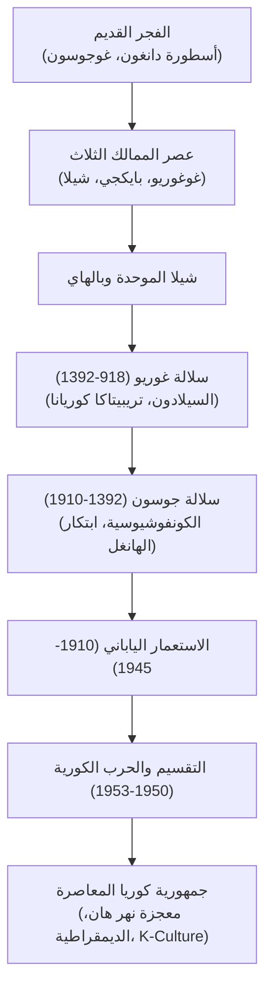

## مقدمة: القدر الجيوسياسي والصمود الكوري

تقع شبه الجزيرة الكورية في موقع استراتيجي بالغ الأهمية في شرق آسيا، حيث واجهت عبر آلاف السنين غزوات متتالية من القوى القارية والبحرية. ومع ذلك، حافظ الشعب الكوري على هويته المستقلة وأبدع إنجازات حضارية خالدة، مثل خزف السيلادون، والطباعة بالحروف المعدنية، وأعظم أبجدية صوتية علمية في العالم: **الهانغل (Hangul)** التي ابتكرها الملك سيه جونغ العظيم.

## 1. من غوجوسون إلى الممالك الثلاث
وفقاً للأسطورة، تأسست غوجوسون عام 2333 قبل الميلاد على يد دانغون. وتضم كوريا أكثر من نصف دولمينات العالم القديم.
ومع حلول القرن الأول قبل الميلاد، ظهرت ثلاث ممالك متنافسة:
- **غوغوريو**: مملكة فرسان قوية في الشمال صدت غزوات الإمبراطوريات الصينية.
- **بايكجي**: مملكة بحرية نقلت البوذية والعلوم إلى اليابان القديمة.
- **شيلا**: مملكة في الجنوب الشرقي اعتمدت على نظام الطبقات الصارم ومحاربي *الهوارانغ* لتوحيد شبه الجزيرة عام 676 م.

## 2. سلالة غوريو (918–1392)
أسسها وانغ غون، وهي السلالة التي اشتق منها اسم «كوريا». اشتهرت بفخار السيلادون الأخضر وطباعة النصوص البوذية الكاملة في ألواح *تريبيتاكا كوريانا* الخشبية في معبد هايينسا.

## 3. سلالة جوسون وابتكار الهانغل
حكمت جوسون وفقاً للكونفوشيوسية الجديدة انطلاقاً من سيول. وشهدت عصرها الذهبي في عهد **الملك سيه جونغ العظيم** (1418–1450) الذي ابتكر عام 1443 أبجدية **الهانغل** الصوتية لمحو أمية عامة الشعب. وخلال الغزو الياباني (1592–1598)، دافع الأدميرال لي سون-شين عن البلاد بسفنه المدرعة الشهيرة «سفن السلحفاة».

## 4. الحقبة الاستعمارية والحرب الكورية
ضمت اليابان كوريا عام 1910، لكن الكوريين قاوموا ببسالة (حركة الأول من مارس 1919). وبعد التحرير عام 1945، انقسمت البلاد على خط عرض 38 بفعل الحرب الباردة. وأسفرت **الحرب الكورية (1950–1953)** عن دمار شامل وتكريس التقسيم عند المنطقة منزوعة السلاح (DMZ).

## 5. معجزة نهر هان والريادة الثقافية
انطلقت كوريا الجنوبية من الركام لتحقق نمواً صناعياً مذهلاً عُرف بـ «معجزة نهر هان»، ورسخت الديمقراطية بنضال شعبي ملحمي. واليوم تقف كوريا كعملاق تكنولوجي رائد وقوة ثقافية عالمية تجتاح العالم بظاهرة **K-Culture**.
