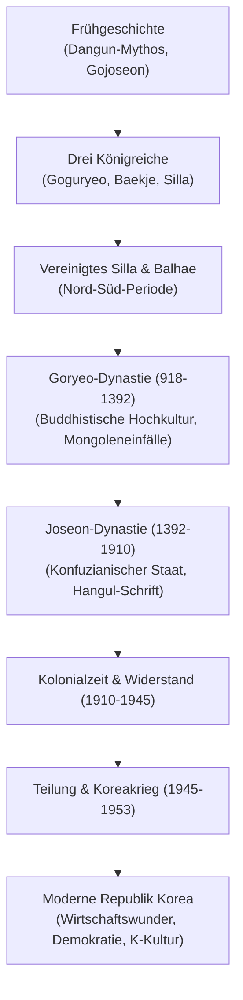

## Einleitung: Geopolitisches Schicksal und ungebrochene Identität

Die koreanische Halbinsel bildete über Jahrtausende eine der am stärksten umkämpften geostrategischen Brücken zwischen dem eurasischen Festland und den japanischen Inseln. Trotz ständiger Invasionen wahrte das koreanische Volk seine kulturelle Eigenständigkeit und schuf herausragende Kulturdenkmäler: das Seladon-Porzellan von Goryeo, die Tripitaka Koreana und das von König Sejong geschaffene Lautschriftsystem Hangul.

## 1. Urgeschichte und Gojoseon
Nach dem Dangun-Mythos wurde Gojoseon 2333 v. Chr. gegründet. Historisch entwickelte sich an den Flüssen Liao und Taedong eine hochentwickelte Bronze- und Eisenkultur mit monumentalen Dolmengräbern. Nach Konflikten mit der Han-Dynastie zerfiel Gojoseon 108 v. Chr. Im Süden formierten sich die Stammesbünde der Samhan (Mahan, Jinhan, Byeonhan).

## 2. Die Drei Reiche (Goguryeo, Baekje, Silla)
- **Goguryeo**: Expansives Reiterreich im Norden, das unter König Gwanggaeto dem Großen die Mandschurei beherrschte und chinesische Angriffe der Sui und Tang abwehrte.
- **Baekje**: Südwestlicher Staat mit hochentwickelter Seefahrt, der den Buddhismus und chinesische Gelehrsamkeit nach Japan übermittelte.
- **Silla**: Reagierte auf seine Randlage mit dem strikten Knochenrang-System (*Golpum*) und der Jugendritterschaft *Hwarang*. Silla verbündete sich mit der Tang-Dynastie und einigte 676 die Halbinsel.

## 3. Goryeo-Dynastie (918–1392)
Gegründet von Wang Geon, gab Goryeo Korea seinen westlichen Namen. Die Dynastie zeichnete sich durch die Einführung des Beamtenexamens (*gwageo*), edles Seladon-Porzellan und den Druck der *Tripitaka Koreana* aus Holztafeln aus. Trotz mongolischer Oberherrschaft bewahrte Goryeo seine Identität.

## 4. Joseon-Dynastie (1392–1910)
Gegründet von Yi Seong-gye, erhob Joseon den Neokonfuzianismus zur Staatsdoktrin. Unter **König Sejong dem Großen** (reg. 1418–1450) erlebten Wissenschaft und Kultur eine Blüte; 1443 schuf er das logische Alphabet **Hangul**. Im Imjin-Krieg (1592–1598) stoppten Admiral Yi Sun-sin und seine gepanzerten Schildkrötenschiffe (*Geobukseon*) die japanische Invasion.

## 5. Moderne, Teilung und Koreakrieg
Nach dem Verfall des Königreiches annektierte Japan Korea 1910. Nach 35 Jahren kolonialer Härte und starkem Widerstand (Bewegung des 1. März 1919) wurde Korea 1945 befreit, aber entlang des 38. Breitengrades geteilt. Der verheerende **Koreakrieg (1950–1953)** endete mit einem Waffenstillstand und der Errichtung der DMZ.

## 6. Das Wunder am Han-Fluss und globale K-Kultur
Vom kriegszerstörten Armenhaus entwickelte sich Südkorea durch staatlich geführte Industrialisierung und demokratische Volksaufstände (Gwangju 1980, Juni 1987) zu einer führenden Wirtschaftsnation. Heute prägen High-Tech-Konzerne und die globale **K-Kultur** (K-Pop, Film, Literatur) das Ansehen des Landes weltweit.
