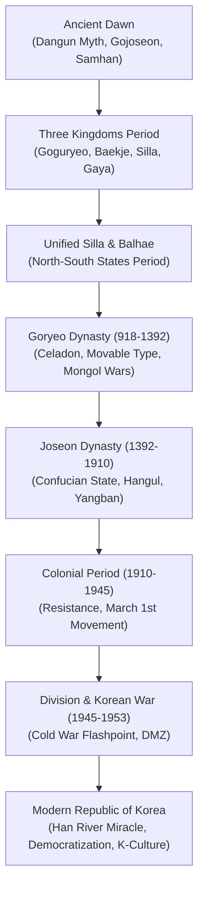

## Introduction: Geopolitical Destiny and Unyielding Resilience

Projecting outward at the eastern extremity of Eurasia between mainland China and the Japanese archipelago, the Korean Peninsula has occupied one of the most perilous yet vital geopolitical intersections in global history. For millennia, this land has been exposed to nomadic incursions from the north, imperial pressure from continental China, and maritime invasions from the east.

Yet to view Korean history merely as passive victimhood misinterprets its enduring genius. Confronting existential threats, Korean dynasties consistently digested Chinese cultural elements (Confucianism, Buddhism, legal codes) and transformed them into distinct civilizational achievements: Goryeo celadon, the Tripitaka Koreana woodblocks, the metal movable type printing invented centuries before Gutenberg, and above all, King Sejong's Hangul—widely recognized as the most scientifically conceived phonetic alphabet in the world.

In the twentieth century, overcoming the trauma of colonial occupation and the devastating Korean War, the South Korean people achieved the "Miracle on the Han River" and established a vibrant democracy through grassroots sacrifice. Today, Korean pop culture, cinema, and high-tech industries command global reverence.

## Chapter 1: The Dawn of Civilization: From Dangun to Gojoseon
Paleolithic sites in Chongok-ni revealed Acheulean handaxes, rewriting East Asian prehistoric archaeology. The Neolithic era was marked by distinctive comb-pattern pottery (*Jeulmun*), while the Bronze Age introduced lute-shaped daggers and dolmens; over half of the world's ancient dolmens reside in Korea (notably Gochang, Hwasun, and Ganghwa).

According to the foundation myth recorded in the *Samguk Yusa*, Dangun Wanggeom founded Gojoseon in 2333 BCE, uniting the heavenly lineage of Hwanung with a local bear-totem clan. Historically, by the fourth century BCE, Gojoseon commanded a powerful federation along the Liao and Taedong rivers, possessing the "Eight Prohibitive Laws." Following Wiman's seizure of power and adoption of advanced metallurgy, Gojoseon fell to the Han dynasty in 108 BCE, leading to the installation of four commanderies, including Lelang. In the south, the indigenous Samhan (Mahan, Jinhan, Byeonhan) developed rich iron-working traditions.

## Chapter 2: The Three Kingdoms and Gaya (1st Century BCE – 7th Century CE)
1. **Goguryeo**: Founded by Jumong, this warlike equestrian kingdom expanded across Manchuria. Under King Gwanggaeto the Great (r. 391–412) and King Jangsu, Goguryeo repulsed northern nomads and defeated invasions by the Sui and Tang dynasties at Salsu (612) and Ansi Fortress (645).
2. **Baekje**: Established along the Han River basin, Baekje developed brilliant maritime trade, fostering close ties with Southern Dynasties China and ancient Japan (Yamato), transmitting Buddhism, Confucian classics, and temple architecture. Its artistry shines in the Baekje Gilt-Bronze Incense Burner.
3. **Silla**: Located in the southeast, Silla developed the aristocratic Bone-Rank System (*Golpum*) and the elite martial youth corps (*Hwarang*). After King Jinheung secured access to the Yellow Sea, Silla laid the groundwork for unification.
4. **Gaya**: A confederation of iron-producing city-states in the Nakdong basin, absorbed by Silla in the sixth century.

## Chapter 3: Unified Silla and Balhae (North-South States Period)
Forging an alliance with Tang China, Silla destroyed Baekje (660) and Goguryeo (668). When Tang attempted to annex the peninsula, King Munmu fought the Silla-Tang War, expelling Chinese garrisons south of the Taedong River by 676. Silla enjoyed a golden age of Buddhist culture, epitomized by Bulguksa Temple, Seokguram Grotto, and the maritime commercial empire of Jang Bogo.

Meanwhile, Goguryeo loyalist Dae Jo-yeong founded **Balhae** in Manchuria in 698, maintaining diplomatic ties with Japan as the northern realm of this "North-South States" epoch until its fall to the Khitans in 926.

## Chapter 4: The Goryeo Dynasty (918–1392)
Wang Geon unified the Later Three Kingdoms in 936, establishing Goryeo (the origin of the name "Korea"). Goryeo adopted the civil service examination (*gwageo*) and institutionalized Buddhism as the state religion. 

The dynasty produced the world-renowned jade-green Goryeo celadon with delicate inlay techniques (*sanggam*) and printed the complete Buddhist canon—the 81,258 wooden printing blocks of the *Tripitaka Koreana*, preserved at Haeinsa Temple. Despite a century of military rule (*Musin*) and thirty years of relentless resistance against the Mongol Empire from Ganghwa Island, Goryeo preserved its sovereign identity.

## Chapter 5: The Joseon Dynasty (1392–1910)
Yi Seong-gye overthrew Goryeo and founded Joseon, establishing the capital at Hanyang (modern Seoul). Guided by Neo-Confucian ideology, Joseon institutionalized rational governance through the *Gyeongguk Daejeon* (National Code) and created the world's most detailed historical records: the *Annals of the Joseon Dynasty* and the *Seungjeongwon Ilgi*.

The fourth ruler, **King Sejong the Great (r. 1418–1450)**, initiated an unprecedented cultural renaissance, commissioning rain gauges (*cheugugi*), celestial globes, and, in 1443, personally inventing **Hangul** (Hunminjeongeum)—a brilliant 28-letter phonetic script designed to empower commoners who could not master complex Chinese characters.

Joseon weathered the devastating Japanese invasions of Toyotomi Hideyoshi (Imjin War, 1592–1598), turned by Admiral Yi Sun-sin's armored "Turtle Ships" (*Geobukseon*), and survived subsequent Manchu invasions (1627, 1636).

## Chapter 6: Late Joseon, Enlightenment, and Imperial Fall
The eighteenth century witnessed a renaissance under Kings Yeongjo and Jeongjo, highlighted by the Practical Learning (*Silhak*) movement led by Jeong Yak-yong (Dasan), advocating agricultural and institutional reform. However, nineteenth-century factional decay, agrarian revolts (Donghak Peasant Revolution), and foreign gunboat diplomacy culminated in the Japanese assassination of Empress Myeongseong (1895). Although King Gojong proclaimed the Korean Empire in 1897, imperial Japan annexed Korea in 1910.

## Chapter 7: Colonial Rule, Liberation, and the Korean War
During thirty-five years of Japanese colonial subjugation (1910–1945), Koreans mounted persistent resistance, highlighted by the nationwide **March 1st Movement (1919)** and the establishment of the Provisional Government in Shanghai.

Following liberation at the end of World War II, the peninsula was divided along the 38th parallel. On June 25, 1950, North Korea launched a surprise invasion, triggering the bloody **Korean War (1950–1953)**. After millions of casualties and US/UN and Chinese interventions, an armistice was signed in July 1953, institutionalizing the heavily fortified Demilitarized Zone (DMZ).

## Chapter 8: The Miracle on the Han River, Democracy, and Global K-Culture
From the ashes of war, South Korea underwent state-led industrialization under Park Chung-hee, giving birth to global conglomerates like Samsung, Hyundai, and LG. Despite authoritarian repression, public demand for liberty erupted in the 1980 Gwangju Uprising and the **June Democracy Movement of 1987**, establishing a durable constitutional democracy.

In the twenty-first century, South Korea overcame the 1997 Asian financial crisis to emerge as a global technological titan and cultural powerhouse. The worldwide phenomenon of **K-Culture**—from K-Pop icons BTS to Academy Award-winning cinema (*Parasite*) and Nobel laureate Han Kang—demonstrates the dynamic, unyielding creative spirit of the Korean people.
