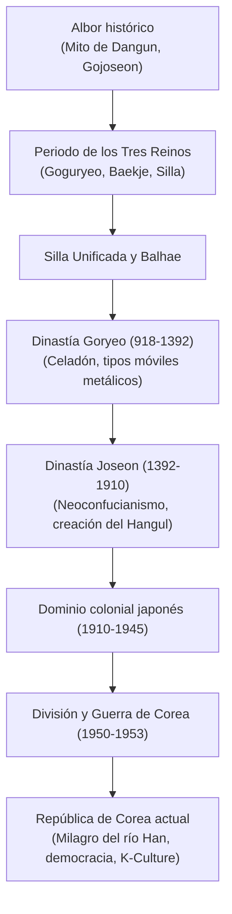

## Introducción: Destino geopolítico y resistencia inquebrantable

Enclavada en el noreste asiático, la península de Corea ha sido escenario de constantes presiones continentales y marítimas. Sin embargo, su pueblo supo asimilar las influencias extranjeras para forjar una identidad cultural única: el deslumbrante celadón de Goryeo, la imprenta de tipos móviles metálicos y el alfabeto fonético **Hangul**, creado por el rey Sejong el Grande.

## 1. Gojoseon y los Tres Reinos
El mito sitúa la fundación de Gojoseon en 2333 a. C. por Dangun Wanggeom. Corea alberga más de la mitad de los dólmenes prehistóricos del planeta.
Con el tiempo se consolidaron tres reinos rivales:
- **Goguryeo**: Poderoso reino militar del norte que frenó a los imperios Sui y Tang.
- **Baekje**: Reino marítimo que transmitió el budismo y saberes clásicos al Japón antiguo.
- **Silla**: Reino del sureste que, apoyado en el sistema de castas *Golpum* y los guerreros *Hwarang*, logró unificar la península en 676.

## 2. La dinastía Goryeo (918–1392)
Fundada por Wang Geon, Goryeo dio el nombre occidental a Corea. Destacó por su exquisito celadón de reflejos verdes y la impresión de la *Tripitaka Coreana* en 81.258 bloques de madera custodiados en el templo de Haeinsa.

## 3. La dinastía Joseon (1392–1910)
Establecida por Yi Seong-gye en Hanyang (Seúl), adoptó el neoconfucianismo como base social. Su figura cumbre fue el **rey Sejong el Grande** (1418–1450), quien promulgó el alfabeto **Hangul** en 1446 para erradicar el analfabetismo. En la guerra Imjin (1592–1598), el almirante Yi Sun-sin salvó al reino con sus innovadores barcos tortuga (*Geobukseon*).

## 4. Ocupación colonial y Guerra de Corea
Anexionada por Japón en 1910, Corea sufrió una dura represión colonial respondida por gestas como el Movimiento del 1 de Marzo de 1919. Tras la liberación de 1945, la península quedó dividida en el paralelo 38. La fratricida **Guerra de Corea (1950–1953)** dejó al país en ruinas y selló una tregua armada en la DMZ.

## 5. El milagro económico y el auge cultural global
A partir de la década de 1960, Corea del Sur experimentó una colosal transformación industrial («el milagro del río Han») y conquistó la democracia en las calles (Levantamiento de Gwangju de 1980 y marcha de junio de 1987). Hoy, convertida en potencia tecnológica, su influyente **K-Culture** (K-Pop, cine, televisión y literatura) cautiva al mundo entero.
